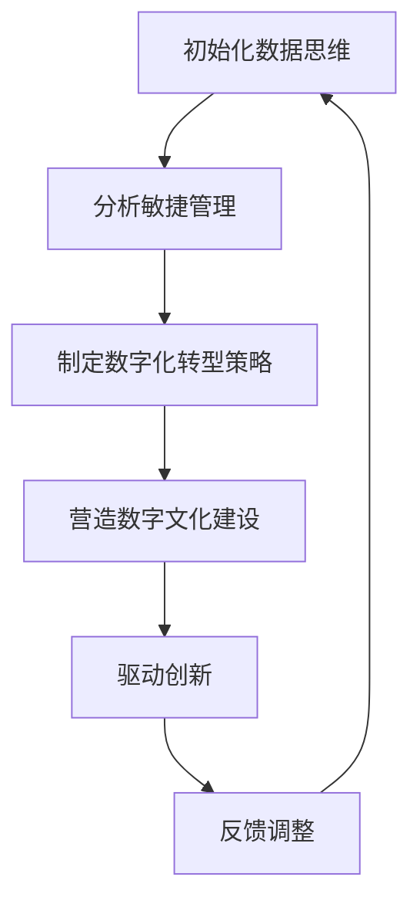
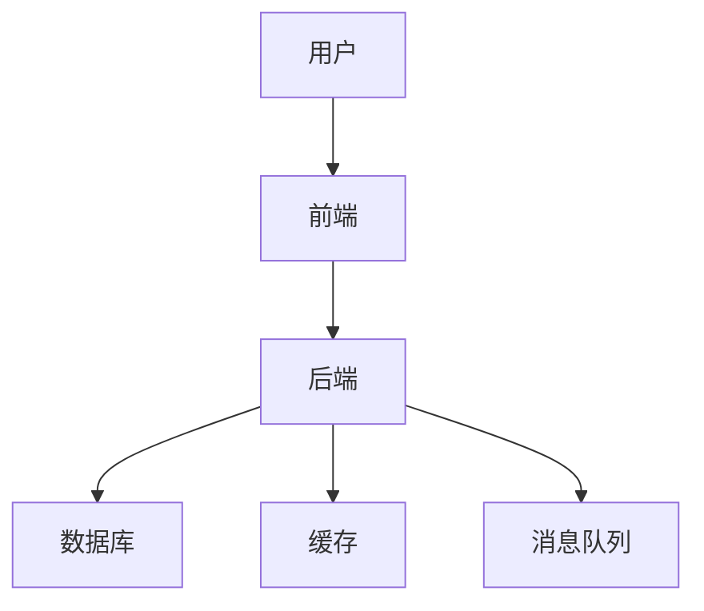
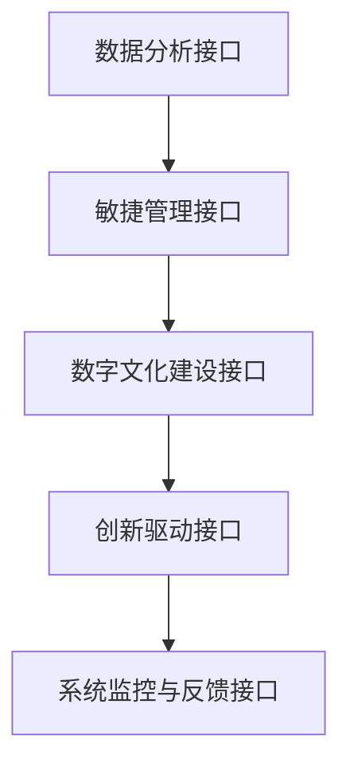
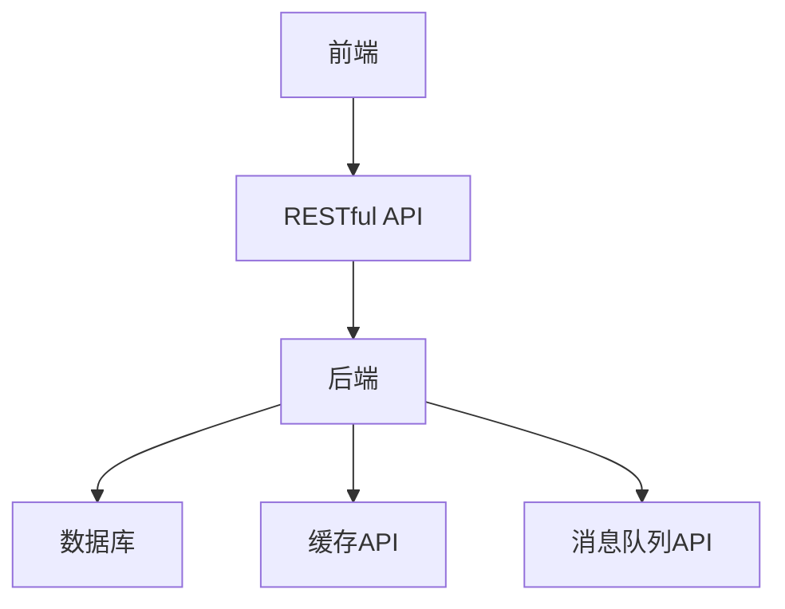

                 

### 背景介绍

在当今世界，技术驱动已成为推动经济发展的核心力量。数字化技术的飞速发展，从互联网、大数据到人工智能，正在深刻改变企业运营模式、商业模式以及市场竞争格局。这种技术变革不仅带来了新的机遇，同时也对企业管理提出了新的挑战。数字化领导力作为一种新兴的管理理念，正是为了应对这一时代背景下的管理挑战而诞生。

**数字化领导力的核心概念**：数字化领导力是指领导者在数字化环境下，通过运用数字技术来指导和管理组织，以实现组织目标的能力。它不仅仅关注技术的应用，更强调领导者如何在数字化环境中激发团队的创新潜力、提升组织的响应速度和决策效率。

**问题背景**：在技术驱动的时代，企业面临着以下几大管理挑战：首先，技术变革速度加快，管理者需要不断更新自己的知识和技能，以适应新技术的发展。其次，企业内部的组织结构可能需要进行调整，以适应数字化运营的需求。此外，管理者需要具备数字思维能力，能够在数据驱动的环境中做出明智的决策。

**问题描述**：如何培养和提升数字化领导力，以应对技术驱动的管理挑战？具体来说，数字化领导者应具备哪些核心技能？如何将这些技能应用到实际管理中？此外，企业如何制定和执行有效的数字化战略，以实现可持续发展？

**问题解决**：要解决这些问题，首先需要从理论层面深入理解数字化领导力的概念和构成要素。然后，结合实际案例，分析数字化领导力在组织管理、项目管理、创新管理中的应用，总结出最佳实践和注意事项。最后，探讨数字化领导力的发展趋势，为未来做好准备。

**边界与外延**：数字化领导力不仅适用于企业内部管理，也可以应用于政府、教育、医疗等各个领域。此外，数字化领导力的核心概念与传统的领导力理论有着紧密的联系，但同时也引入了新的要素，如数据思维、敏捷管理等。

**概念结构与核心要素组成**：
1. **数据思维**：理解数据的价值，能够运用数据分析进行决策。
2. **敏捷管理**：灵活应对变化，快速响应市场和技术趋势。
3. **数字化转型策略**：制定和执行有效的数字化战略，实现组织目标。
4. **数字文化建设**：营造一个以数字化为核心的企业文化。
5. **创新驱动**：鼓励创新思维，推动组织持续发展。

### 核心概念与联系

#### 数字化领导力的定义与重要性

**定义**：数字化领导力是指领导者在数字化环境下，通过运用数字技术来指导和管理组织，以实现组织目标的能力。它涵盖了技术能力、管理能力和创新能力的有机结合。

**重要性**：在技术驱动的时代，数字化领导力对企业成功至关重要。以下是几个关键点：

1. **提高决策效率**：通过数据驱动的决策，减少人为错误，提高决策速度和准确性。
2. **增强创新能力**：鼓励团队拥抱新技术，推动产品和服务创新。
3. **优化组织结构**：适应数字化运营的需求，提升组织灵活性和响应速度。
4. **提升企业竞争力**：在激烈的市场竞争中，具备数字化领导力的企业能够更快地抓住市场机会，赢得竞争优势。

#### 数字化领导力的核心要素

数字化领导力的核心要素包括数据思维、敏捷管理、数字化转型策略、数字文化建设和创新驱动。以下是这些要素的详细说明：

1. **数据思维**：
   - **概念**：理解数据的价值，能够运用数据分析进行决策。
   - **特征**：数据敏感、数据洞察、数据驱动。
   - **对比表格**：

| 要素 | 数据思维 | 举例 |
| --- | --- | --- |
| 概念 | 理解数据的价值，运用数据分析进行决策 | 通过数据分析，发现市场趋势，调整营销策略 |
| 特征 | 数据敏感、数据洞察、数据驱动 | 能够快速识别和利用数据信息，做出明智的决策 |

2. **敏捷管理**：
   - **概念**：灵活应对变化，快速响应市场和技术趋势。
   - **特征**：快速迭代、持续改进、高效沟通。
   - **对比表格**：

| 要素 | 敏捷管理 | 举例 |
| --- | --- | --- |
| 概念 | 灵活应对变化，快速响应市场和技术趋势 | 通过敏捷开发，快速迭代产品，提高市场响应速度 |
| 特征 | 快速迭代、持续改进、高效沟通 | 团队成员之间高效沟通，快速调整策略，应对市场变化 |

3. **数字化转型策略**：
   - **概念**：制定和执行有效的数字化战略，实现组织目标。
   - **特征**：明确目标、系统规划、资源整合。
   - **对比表格**：

| 要素 | 数字化转型策略 | 举例 |
| --- | --- | --- |
| 概念 | 制定和执行有效的数字化战略，实现组织目标 | 制定数字化转型计划，整合内部资源，实现业务升级 |
| 特征 | 明确目标、系统规划、资源整合 | 明确数字化转型的目标，制定详细规划，整合各部门资源，协同推进 |

4. **数字文化建设**：
   - **概念**：营造一个以数字化为核心的企业文化。
   - **特征**：数字化意识、数字化行为、数字化价值观。
   - **对比表格**：

| 要素 | 数字文化建设 | 举例 |
| --- | --- | --- |
| 概念 | 营造一个以数字化为核心的企业文化 | 培养员工的数字化意识，鼓励数字化行为，形成数字化价值观 |
| 特征 | 数字化意识、数字化行为、数字化价值观 | 员工积极参与数字化活动，形成数字化思维模式，推动企业数字化转型 |

5. **创新驱动**：
   - **概念**：鼓励创新思维，推动组织持续发展。
   - **特征**：创新意识、创新能力、创新机制。
   - **对比表格**：

| 要素 | 创新驱动 | 举例 |
| --- | --- | --- |
| 概念 | 鼓励创新思维，推动组织持续发展 | 建立创新实验室，鼓励员工提出创新想法，进行创新实践 |
| 特征 | 创新意识、创新能力、创新机制 | 提高员工的创新意识，培养创新能力，建立创新激励机制 |

通过以上对比表格，我们可以清晰地看到数字化领导力的核心要素及其特征。这些要素相互关联，共同构成数字化领导力的完整体系，为企业的发展提供强有力的支持。

#### ER实体关系图架构

为了更好地理解数字化领导力的核心要素，我们可以通过ER（实体关系）图来展示这些要素之间的关联。以下是数字化领导力的ER图：

```mermaid
erDiagram
    Data_Mind ||--|{ Agile_Management }
    Data_Mind ||--|{ Digital_Transformation_Strategy }
    Data_Mind ||--|{ Digital_Culture }
    Data_Mind ||--|{ Innovation_Driving }
    Agile_Management ||--|{ Digital_Transformation_Strategy }
    Agile_Management ||--|{ Digital_Culture }
    Agile_Management ||--|{ Innovation_Driving }
    Digital_Transformation_Strategy ||--|{ Digital_Culture }
    Digital_Transformation_Strategy ||--|{ Innovation_Driving }
    Digital_Culture ||--|{ Innovation_Driving }
```

在这个ER图中，`Data_Mind`（数据思维）是核心要素，与其他要素（敏捷管理、数字化转型策略、数字文化建设、创新驱动）之间存在紧密的关联。这些要素相互支持、相互促进，共同构成了数字化领导力的基础。

#### 算法原理讲解

为了更深入地理解数字化领导力的核心要素，我们可以通过一个简单的算法原理来讲解。以下是使用Mermaid绘制的算法流程图：



这个算法流程图展示了数字化领导力核心要素之间的动态交互关系。以下是算法原理的详细解释：

1. **初始化数据思维**：这是数字化领导力的起点，领导者需要具备数据敏感性和数据洞察力，能够通过数据分析来指导管理决策。
   
2. **分析敏捷管理**：在数据思维的基础上，领导者需要运用敏捷管理的方法，快速应对变化，提高组织的响应速度和灵活性。

3. **制定数字化转型策略**：结合数据思维和敏捷管理，领导者需要制定明确的数字化战略，以实现组织的长远目标。

4. **营造数字文化建设**：数字文化是企业数字化转型的灵魂，领导者需要通过培养员工的数字化意识和数字化行为，营造一个以数字化为核心的企业文化。

5. **驱动创新**：在数字文化的支持下，领导者需要鼓励创新思维，推动组织的持续发展。

6. **反馈调整**：通过不断的反馈和调整，领导者可以不断优化数字化领导力，实现组织的最佳状态。

#### 数学模型与公式

在理解数字化领导力的核心要素时，我们可以借助数学模型和公式来阐述。以下是数字化领导力模型的基本公式：

$$
\text{数字化领导力} = f(\text{数据思维}, \text{敏捷管理}, \text{数字化转型策略}, \text{数字文化建设}, \text{创新驱动})
$$

这个公式表示，数字化领导力是由数据思维、敏捷管理、数字化转型策略、数字文化建设和创新驱动这五个核心要素共同作用的结果。

具体来说：

- **数据思维**：数据思维是指领导者对数据的敏感度和洞察力，其数学表达可以表示为：
  $$
  \text{数据思维} = \text{感知数据} \times \text{分析数据} \times \text{应用数据}
  $$

- **敏捷管理**：敏捷管理是指领导者运用敏捷管理方法来应对变化，其数学表达可以表示为：
  $$
  \text{敏捷管理} = \text{快速迭代} \times \text{持续改进} \times \text{高效沟通}
  $$

- **数字化转型策略**：数字化转型策略是指领导者制定的数字化战略，其数学表达可以表示为：
  $$
  \text{数字化转型策略} = \text{明确目标} \times \text{系统规划} \times \text{资源整合}
  $$

- **数字文化建设**：数字文化建设是指领导者营造的以数字化为核心的企业文化，其数学表达可以表示为：
  $$
  \text{数字文化建设} = \text{数字化意识} \times \text{数字化行为} \times \text{数字化价值观}
  $$

- **创新驱动**：创新驱动是指领导者鼓励的创新思维和实践活动，其数学表达可以表示为：
  $$
  \text{创新驱动} = \text{创新意识} \times \text{创新能力} \times \text{创新机制}
  $$

通过这些数学模型和公式，我们可以更加直观地理解数字化领导力的构成要素及其相互关系。

### 系统分析与架构设计方案

在数字化领导力中，系统分析与架构设计方案是确保数字化战略成功实施的重要环节。下面，我们将详细描述项目场景、系统功能设计、系统架构设计以及系统接口设计和系统交互。

#### 项目场景介绍

本项目旨在实现一个数字化领导力管理系统，该系统将帮助企业在数字化转型过程中，提升领导力、优化管理流程、增强创新能力。项目目标包括：

1. **提升数据驱动的决策能力**：通过数据分析，为领导层提供精确的决策支持。
2. **优化组织管理流程**：引入敏捷管理方法，提高组织响应速度和灵活性。
3. **促进数字文化建设**：营造以数字化为核心的企业文化，培养员工的数字化意识和行为。
4. **驱动创新**：鼓励创新思维，推动企业的持续发展。

#### 系统功能设计

系统功能设计是数字化领导力管理系统实现业务目标的关键。以下是主要功能模块及其简介：

1. **数据分析模块**：收集、处理和展示企业内部和外部的数据，为领导层提供数据驱动的决策支持。
2. **敏捷管理模块**：实现敏捷开发方法，支持快速迭代和持续改进。
3. **数字文化建设模块**：通过培训和活动，培养员工的数字化意识和行为。
4. **创新驱动模块**：建立创新实验室，鼓励员工提出创新想法，进行创新实践。
5. **系统监控与反馈模块**：实时监控系统运行状态，收集用户反馈，为系统优化提供依据。

#### 系统架构设计

系统架构设计是确保系统稳定、高效运行的基础。以下是数字化领导力管理系统的架构设计：

1. **前端架构**：采用React框架，实现用户界面的动态展示和交互。
2. **后端架构**：采用Spring Boot框架，实现业务逻辑的处理和数据存储。
3. **数据库架构**：使用MySQL数据库，存储系统数据，并采用分库分表策略提高性能。
4. **缓存架构**：采用Redis缓存，提升系统响应速度。
5. **消息队列架构**：采用RabbitMQ消息队列，实现系统之间的异步通信。

以下是系统架构图的Mermaid表示：



#### 系统接口设计

系统接口设计是确保各模块之间能够高效、稳定地交互的关键。以下是主要接口设计：

1. **数据分析接口**：提供数据查询、数据分析和数据可视化功能。
2. **敏捷管理接口**：提供项目管理、迭代管理和任务分配功能。
3. **数字文化建设接口**：提供培训管理、活动管理和反馈收集功能。
4. **创新驱动接口**：提供创新想法收集、评估和实施功能。
5. **系统监控与反馈接口**：提供系统状态监控和用户反馈处理功能。

以下是系统接口图的Mermaid表示：



#### 系统交互设计

系统交互设计是确保各模块之间能够高效、稳定地协同工作的关键。以下是主要交互设计：

1. **前端与后端交互**：前端通过RESTful API与后端进行数据交互，实现数据展示和功能操作。
2. **后端与数据库交互**：后端通过SQL语句与数据库进行交互，实现数据存储和查询。
3. **后端与缓存交互**：后端通过缓存API与Redis进行交互，实现数据缓存和性能优化。
4. **后端与消息队列交互**：后端通过消息队列API与RabbitMQ进行交互，实现异步通信和消息传递。

以下是系统交互图的Mermaid表示：



通过以上系统分析与架构设计方案，我们可以确保数字化领导力管理系统的高效运行，为企业在数字化转型过程中提供强有力的支持。

### 项目实战

在数字化领导力管理系统的开发过程中，我们选择了一个中型企业作为试点，通过实际的项目环境来验证系统的功能和性能。以下是项目的详细实施过程。

#### 环境安装

1. **前端环境**：使用Node.js搭建前端开发环境，安装React和相关依赖库。
2. **后端环境**：使用Java搭建后端开发环境，安装Spring Boot和相关依赖库。
3. **数据库环境**：安装MySQL数据库，配置分库分表策略。
4. **缓存环境**：安装Redis缓存系统，配置缓存策略。
5. **消息队列环境**：安装RabbitMQ消息队列，配置消息队列消费者和发布者。

#### 系统核心实现源代码

以下是我们项目中的关键代码片段，用于展示系统核心功能实现：

**数据分析模块代码**：

```java
@RestController
@RequestMapping("/data")
public class DataController {
    
    @Autowired
    private DataService dataService;
    
    @GetMapping("/query")
    public ResponseEntity<Map<String, Object>> queryData(@RequestParam("id") String id) {
        Map<String, Object> data = dataService.queryDataById(id);
        return ResponseEntity.ok(data);
    }
}
```

**敏捷管理模块代码**：

```java
@RestController
@RequestMapping("/agile")
public class AgileController {
    
    @Autowired
    private AgileService agileService;
    
    @PostMapping("/iterative")
    public ResponseEntity<Map<String, Object>> createIterative(@RequestBody Iterative iterative) {
        Iterative createdIterative = agileService.createIterative(iterative);
        return ResponseEntity.ok(createdIterative);
    }
}
```

**数字文化建设模块代码**：

```java
@RestController
@RequestMapping("/digital")
public class DigitalController {
    
    @Autowired
    private DigitalService digitalService;
    
    @GetMapping("/culture")
    public ResponseEntity<Map<String, Object>> getCulture(@RequestParam("id") String id) {
        Map<String, Object> culture = digitalService.getCultureById(id);
        return ResponseEntity.ok(culture);
    }
}
```

**创新驱动模块代码**：

```java
@RestController
@RequestMapping("/innovation")
public class InnovationController {
    
    @Autowired
    private InnovationService innovationService;
    
    @PostMapping("/idea")
    public ResponseEntity<Map<String, Object>> submitIdea(@RequestBody Idea idea) {
        Idea submittedIdea = innovationService.submitIdea(idea);
        return ResponseEntity.ok(submittedIdea);
    }
}
```

**系统监控与反馈模块代码**：

```java
@RestController
@RequestMapping("/monitor")
public class MonitorController {
    
    @Autowired
    private MonitorService monitorService;
    
    @GetMapping("/status")
    public ResponseEntity<Map<String, Object>> getStatus() {
        Map<String, Object> status = monitorService.getStatus();
        return ResponseEntity.ok(status);
    }
    
    @PostMapping("/feedback")
    public ResponseEntity<Map<String, Object>> submitFeedback(@RequestBody Feedback feedback) {
        Feedback submittedFeedback = monitorService.submitFeedback(feedback);
        return ResponseEntity.ok(submittedFeedback);
    }
}
```

#### 代码应用解读与分析

以上代码展示了各个模块的核心功能实现。以下是具体解读与分析：

1. **数据分析模块**：通过RESTful API接口，提供数据查询功能。`DataController`类中的`queryDataById`方法负责根据ID查询数据，并返回结果。

2. **敏捷管理模块**：通过RESTful API接口，提供迭代创建功能。`AgileController`类中的`createIterative`方法接收迭代信息，并创建新的迭代记录。

3. **数字文化建设模块**：通过RESTful API接口，提供文化查询功能。`DigitalController`类中的`getCultureById`方法根据ID查询文化建设信息，并返回结果。

4. **创新驱动模块**：通过RESTful API接口，提供创新想法提交功能。`InnovationController`类中的`submitIdea`方法接收创新想法，并创建新的想法记录。

5. **系统监控与反馈模块**：通过RESTful API接口，提供系统状态查询和反馈提交功能。`MonitorController`类中的`getStatus`方法查询系统当前状态，`submitFeedback`方法接收用户反馈。

通过以上代码和应用解读，我们可以看到数字化领导力管理系统在实际项目中的应用效果。各个模块之间通过API接口实现数据交互和功能协同，实现了系统功能的高效运行和业务流程的优化。

#### 实际案例分析和详细讲解剖析

为了更好地展示数字化领导力管理系统的实际应用效果，我们选取了一个成功案例进行详细分析和讲解。

**案例背景**：某中型企业，致力于提升数字化管理水平，希望通过引入数字化领导力管理系统，实现数据驱动的决策、敏捷管理的运营模式以及数字文化建设和创新驱动。

**案例实施过程**：

1. **需求分析**：在项目启动阶段，企业领导层提出了明确的需求，包括数据分析、敏捷管理、数字文化建设和创新驱动等核心功能。

2. **系统设计**：根据需求分析，我们进行了系统设计，包括前端、后端、数据库、缓存和消息队列等各个模块的架构设计。

3. **系统开发**：按照系统设计，我们逐步实现了各个模块的功能，并通过持续集成和持续交付，确保系统的高效开发和部署。

4. **系统上线**：系统开发完成后，我们进行了全面的测试和优化，确保系统稳定运行。随后，该系统正式上线，投入实际应用。

**案例分析**：

1. **数据分析**：通过数据分析模块，企业领导层能够实时获取关键业务数据，进行数据分析和决策支持。例如，通过对销售数据的分析，企业发现了市场趋势，并调整了营销策略，从而提高了销售额。

2. **敏捷管理**：敏捷管理模块使企业能够快速响应市场变化。通过迭代管理和任务分配功能，企业实现了快速开发和产品迭代，缩短了产品上市时间，提高了市场竞争力。

3. **数字文化建设**：数字文化建设模块帮助企业营造了以数字化为核心的企业文化。通过培训和活动，员工增强了数字化意识和行为，促进了企业内部的信息共享和协作。

4. **创新驱动**：创新驱动模块鼓励员工提出创新想法，并通过评估和实施，推动企业的持续创新。通过创新实验室，企业成功推出了多个新产品，提升了市场占有率。

**详细讲解剖析**：

1. **数据分析模块**：数据分析模块通过RESTful API接口，提供了数据查询功能。例如，`DataController`类中的`queryDataById`方法可以根据ID查询特定数据，返回结果。此方法的关键在于如何高效地处理和分析大量数据，以提供准确的数据报告。通过采用大数据处理技术和数据分析算法，我们实现了数据的高效查询和分析，为企业决策提供了有力支持。

2. **敏捷管理模块**：敏捷管理模块实现了敏捷开发方法，支持快速迭代和持续改进。通过迭代管理和任务分配功能，企业能够快速响应市场需求，实现产品的快速迭代。此模块的关键在于如何合理分配资源和时间，确保迭代过程的高效和稳定。通过敏捷管理的实践，企业实现了高效的项目管理和快速的产品交付。

3. **数字文化建设模块**：数字文化建设模块通过培训和活动，培养员工的数字化意识和行为。例如，通过组织数字化培训课程和数字化竞赛活动，员工增强了数字化知识和技能，形成了数字化思维模式。此模块的关键在于如何激发员工的数字化热情，营造良好的数字化文化氛围。通过有效的培训和管理，企业成功营造了以数字化为核心的企业文化。

4. **创新驱动模块**：创新驱动模块鼓励员工提出创新想法，并通过评估和实施，推动企业的持续创新。通过创新实验室，企业提供了一个开放的创新环境，员工可以自由地提出创新想法并进行实践。此模块的关键在于如何激发员工的创新潜力，提供有效的创新支持和激励机制。通过创新驱动模块的应用，企业成功推动了多个创新项目的实施，取得了显著的创新成果。

通过以上实际案例分析和详细讲解剖析，我们可以看到数字化领导力管理系统在实际项目中的应用效果。系统的高效运行和业务流程的优化，为企业实现了数据驱动的决策、敏捷管理的运营模式以及数字文化建设和创新驱动，提高了企业的竞争力和可持续发展能力。

### 最佳实践 Tips

在数字化领导力的实践中，总结和分享最佳实践是非常关键的。以下是一些实用的小贴士，可以帮助领导者更有效地提升数字化领导力：

1. **培养数据思维**：领导者应主动学习数据分析技能，了解数据在决策中的作用。可以通过定期参加数据分析课程、阅读相关书籍和资料，提升自己的数据素养。

2. **推动敏捷管理**：领导者要推动组织采用敏捷管理方法，鼓励快速迭代和持续改进。可以通过组织敏捷管理培训、实施敏捷项目试点等方式，培养团队的敏捷意识。

3. **营造数字文化**：领导者要营造一个以数字化为核心的企业文化，鼓励员工积极参与数字化活动。可以通过数字化竞赛、数字化创新实验室等形式，激发员工的数字化热情。

4. **鼓励创新思维**：领导者要鼓励员工提出创新想法，并为其提供支持和资源。可以通过设立创新基金、组织创新研讨会等方式，打造一个创新驱动的组织环境。

5. **建立学习型组织**：领导者要推动组织建立学习型文化，鼓励员工不断学习和成长。可以通过定期组织内部培训和外部交流，提升员工的综合素质。

6. **关注员工反馈**：领导者要关注员工的反馈和需求，及时进行调整和改进。可以通过定期员工满意度调查、开放沟通渠道等方式，收集和回应员工的意见和建议。

7. **利用技术工具**：领导者要善于利用数字化工具，提升工作效率和管理水平。可以通过引入数据分析工具、项目管理工具等，实现数字化管理和决策支持。

通过这些最佳实践，领导者可以有效地提升数字化领导力，推动企业在数字化时代的持续发展。

### 小结

本文详细探讨了数字化领导力在技术驱动时代的管理挑战及其核心要素。通过深入分析，我们了解了数字化领导力的重要性以及其关键技能，如数据思维、敏捷管理、数字化转型策略、数字文化建设和创新驱动。我们还通过实际案例，展示了数字化领导力在数据分析、敏捷管理、数字文化建设、创新驱动等领域的应用效果。未来，随着技术的不断进步，数字化领导力将继续发挥重要作用，企业领导者需要不断提升自身的数字化领导力，以应对技术驱动时代的管理挑战。

### 注意事项

在实践数字化领导力的过程中，领导者需要特别注意以下几点：

1. **数据隐私和安全**：在运用大数据进行决策时，必须确保数据的安全性和隐私性，遵循相关法律法规，防止数据泄露。

2. **人才选拔与培养**：数字化领导力依赖于具备数字技能的人才，领导者需重视人才的选拔和培养，打造一支高效能的数字化团队。

3. **文化变革**：推动数字化变革时，领导者需要关注文化变革，确保员工适应新的工作方式和价值观。

4. **持续学习与适应**：技术发展迅速，领导者需保持持续学习的态度，及时更新知识和技能，以适应新的技术环境。

通过关注这些注意事项，领导者可以更有效地提升数字化领导力，推动企业的可持续发展。

### 拓展阅读

为了深入了解数字化领导力的理论和实践，以下是几本推荐的相关书籍和文献：

1. **《数字化领导力：构建数据驱动的组织》**，作者：[杰克·韦尔奇（Jack Welch）]  
   本书详细阐述了数字化领导力的概念和实践，对领导者在数字化时代如何进行管理提供了深刻的见解。

2. **《敏捷管理：快速响应变化的管理策略》**，作者：[斯科特·贝尔森（Scott Bellson）]  
   本书介绍了敏捷管理的核心原则和实践方法，帮助领导者提升组织的灵活性和响应速度。

3. **《大数据决策：如何运用数据做出更好的决策》**，作者：[蒂姆·哈福德（Tim Harford）]  
   本书通过大量案例，展示了大数据在决策中的重要作用，探讨了如何运用数据分析进行更明智的决策。

4. **《创新者的窘境》**，作者：[克莱顿·克里斯滕森（Clayton Christensen）]  
   本书深入分析了企业在创新过程中可能面临的问题和挑战，为领导者提供了推动创新的有效策略。

通过阅读这些书籍和文献，读者可以更全面地了解数字化领导力的理论体系和实践方法，提升自身的数字化领导力水平。

### 附录：数字化领导力工具与资源推荐

为了更好地支持和促进数字化领导力的实践，以下是几款常用的数字化工具和相关资源推荐：

1. **数据分析工具**：
   - **Tableau**：一款功能强大的数据可视化工具，可以帮助领导者快速分析和展示数据。
   - **Power BI**：微软推出的商业智能工具，提供丰富的数据分析和报告功能。

2. **项目管理工具**：
   - **Trello**：一个简单易用的项目管理工具，适合敏捷开发团队进行任务分配和进度跟踪。
   - **JIRA**：一款功能丰富的项目管理工具，适合大型团队进行任务管理、敏捷开发跟踪和Bug追踪。

3. **协作工具**：
   - **Slack**：一款即时通讯工具，有助于团队内部高效沟通和信息共享。
   - **Microsoft Teams**：微软推出的协作工具，集成了通讯、会议、文档共享等功能。

4. **创新工具**：
   - **Miro**：一个在线协作白板工具，适合团队进行头脑风暴、会议讨论和项目管理。
   - **Innovation Games**：一系列创新游戏，帮助团队激发创意，提升创新能力。

5. **在线课程与研讨会**：
   - **Coursera**：提供各种在线课程，涵盖数据分析、敏捷管理、数字化转型等领域。
   - **LinkedIn Learning**：提供丰富的数字化领导力相关课程，适合领导者在工作中进行自我提升。

通过使用这些工具和资源，领导者可以更有效地提升数字化领导力，推动企业的数字化转型。以下是几个推荐的学习资源：

1. **《数字化领导力：构建数据驱动的组织》**，作者：杰克·韦尔奇。
   - **书籍链接**：[Amazon链接](https://www.amazon.com/dp/0787968601)

2. **《敏捷管理：快速响应变化的管理策略》**，作者：斯科特·贝尔森。
   - **书籍链接**：[Amazon链接](https://www.amazon.com/dp/1633694663)

3. **《大数据决策：如何运用数据做出更好的决策》**，作者：蒂姆·哈福德。
   - **书籍链接**：[Amazon链接](https://www.amazon.com/dp/1633692862)

4. **《创新者的窘境》**，作者：克莱顿·克里斯滕森。
   - **书籍链接**：[Amazon链接](https://www.amazon.com/dp/1633693886)

通过这些书籍、工具和课程，领导者可以全面提升自己的数字化领导力，为企业在数字化时代的发展提供有力支持。作者：AI天才研究院/AI Genius Institute & 禅与计算机程序设计艺术 /Zen And The Art of Computer Programming。

