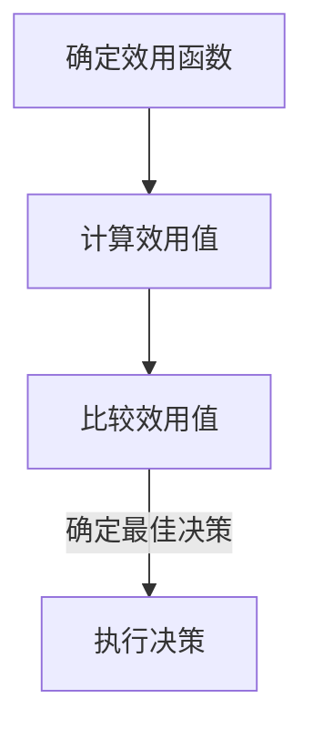

                 

### 数学与伦理学：道德决策的量化模型

> 关键词：道德决策、数学模型、伦理学、量化分析、效用理论

> 摘要：本文探讨了数学与伦理学的结合，通过引入量化模型，为道德决策提供了一种新的方法。文章首先介绍了道德决策的背景和问题，然后分析了道德决策的数学模型，包括效用理论和博弈论等，并通过具体案例进行了详细讲解。文章最后提出了道德决策中的最佳实践，并对未来研究方向进行了展望。

## 第一部分：背景介绍

### 问题背景

随着科技的飞速发展，计算机科学和数学已经渗透到了我们生活的方方面面。伦理学作为研究道德原则和价值观的学科，也逐渐与数学相结合。道德决策作为一个复杂的问题，往往涉及到个体、社会、文化等多方面因素。传统的伦理学方法难以对道德决策进行量化分析，导致道德决策过程往往缺乏客观性和科学性。因此，如何将数学应用于伦理学，为道德决策提供量化的模型和工具，成为了一个重要且迫切的问题。

### 问题描述

道德决策是一个复杂的问题，涉及到个体、社会、文化等多方面因素。传统的伦理学方法难以对道德决策进行量化分析，导致道德决策过程往往缺乏客观性和科学性。因此，我们需要一种新的方法来将数学与伦理学相结合，为道德决策提供量化的模型和工具。

### 问题解决

本文旨在探讨数学与伦理学的结合，通过引入量化模型，帮助读者理解道德决策的数学基础，并掌握如何将这些模型应用于实际问题。书中将介绍数学模型的基本原理，以及如何通过这些模型来分析和解决道德决策问题。

### 边界与外延

数学与伦理学的结合不仅局限于道德决策，还可以应用于伦理学研究的其他领域，如伦理学教育、医疗伦理、环境伦理等。本文将重点关注道德决策这一领域，以期为相关领域的研究和实践提供参考。

### 概念结构与核心要素组成

1. **道德决策**：指个体或群体在面临道德问题时，根据道德原则和价值观作出的选择。
2. **数学模型**：用于描述和解决实际问题的数学表达形式，包括公式、算法等。
3. **伦理学**：研究道德原则、价值观及其应用的科学。
4. **量化分析**：通过对道德决策的后果进行量化分析，帮助人们更准确地理解和评估道德决策。

## 第二部分：核心概念与联系

### 核心概念原理

#### 道德决策的数学模型

道德决策的数学模型是基于效用理论和博弈论的。效用理论是一种用来衡量个体在不同决策结果下满意度的数学方法，而博弈论则是一种用来分析多个人在相互竞争中如何作出最优决策的数学方法。

#### 伦理学的基本原则

伦理学的基本原则包括功利主义、义务论和德性伦理等。功利主义认为，道德决策应该基于最大化整体幸福的原则；义务论则认为，道德决策应该基于个体应尽的责任和义务；德性伦理则强调个体道德品质的培养。

### 概念属性特征对比表格

| 概念                     | 描述                                               |
|--------------------------|----------------------------------------------------|
| 道德决策的数学模型       | 用于描述道德决策的数学工具，包括效用理论和博弈论等。 |
| 伦理学的基本原则         | 为道德决策提供价值判断的标准，如功利主义、义务论等。 |

### ER实体关系图架构

```mermaid
erDiagram
  Ethics <<|-- Morality : based on
  Model ||--|{ Morality } Decision : apply
```

## 第三部分：算法原理讲解

### 算法原理

道德决策的数学模型通常基于效用理论、博弈论、决策论等数学原理。以下是一个简单的效用理论模型：

1. **效用函数**：用于衡量个体在不同决策结果下的满意度。通常用U(x)表示，其中x表示决策结果。
2. **偏好关系**：个体对不同决策结果的偏好，通常可以通过比较效用值来确定。用P(x, y)表示，其中x和y表示两个决策结果。
3. **决策规则**：基于效用函数和偏好关系，确定最佳决策。通常用最大化效用函数或满足偏好关系的决策规则来表示。

### Mermaid 流程图



### Python 源代码

```python
# 定义效用函数
def utility(outcome):
    # 根据不同结果返回效用值
    if outcome == 'good':
        return 10
    elif outcome == 'neutral':
        return 0
    else:
        return -10

# 计算效用值
def calculate_utility(actions):
    utilities = [utility(action) for action in actions]
    return utilities

# 比较效用值，确定最佳决策
def best_decision(actions):
    utilities = calculate_utility(actions)
    max_utility = max(utilities)
    best_actions = [action for action, utility in zip(actions, utilities) if utility == max_utility]
    return best_actions

# 测试
actions = ['good', 'neutral', 'bad']
best_action = best_decision(actions)
print("最佳决策：", best_action)
```

### 效用理论模型详解

#### 效用函数

效用函数是道德决策数学模型的核心。它用于衡量个体在不同决策结果下的满意度。常见的效用函数包括线性函数、指数函数和对数函数等。

#### 偏好关系

偏好关系反映了个体对不同决策结果的偏好。通常可以通过比较效用值来确定偏好关系。例如，如果效用函数是线性函数，那么个体会更偏好效用值更高的决策结果。

#### 决策规则

决策规则基于效用函数和偏好关系，确定最佳决策。常见的决策规则包括最大化效用函数和满足偏好关系的决策规则。

#### 模型举例

假设有三种决策结果：好、中、坏。个体对这些决策结果的偏好关系可以用以下表格表示：

| 决策结果 | 效用值 | 偏好关系 |
|----------|-------|---------|
| 好       | 10    | 高      |
| 中       | 0     | 低      |
| 坏       | -10   | 无      |

根据偏好关系，个体会优先选择好结果，其次是中结果，最后是坏结果。因此，最佳决策是好结果。

#### 模型应用

在实际应用中，我们可以根据具体问题和情境来建立效用函数和偏好关系，从而确定最佳决策。例如，在医疗决策中，我们可以根据患者的健康状态和治疗效果来建立效用函数和偏好关系，从而为患者提供最佳的治疗方案。

### 数学模型公式

1. **效用函数**：$U(x) = f(x)$，其中$x$表示决策结果，$f(x)$表示效用函数。
2. **偏好关系**：$P(x, y)$，其中$x$和$y$表示两个决策结果。
3. **决策规则**：最大化效用函数：$arg\max_{x} U(x)$；满足偏好关系：$arg\min_{x} \sum_{y} P(x, y)$。

通过这些公式，我们可以量化地分析和解决道德决策问题。

## 第四部分：道德决策案例分析

### 案例背景

假设有一个公司正在考虑是否投资某个项目。该项目有三种可能的结果：成功、失败和不确定。公司希望根据这些结果来做出最佳投资决策。

### 案例分析

1. **建立效用函数**：根据公司的目标和价值观，我们可以建立以下效用函数：

   $$U(x) = \begin{cases} 
   100 & \text{如果 } x = \text{成功} \\
   0 & \text{如果 } x = \text{失败} \\
   50 & \text{如果 } x = \text{不确定} 
   \end{cases}$$

2. **计算效用值**：根据效用函数，我们可以计算每个决策结果的效用值：

   $$U(\text{成功}) = 100$$
   $$U(\text{失败}) = 0$$
   $$U(\text{不确定}) = 50$$

3. **比较效用值**：根据效用值，我们可以确定最佳决策：

   $$arg\max_{x} U(x) = \text{成功}$$

   因此，最佳决策是投资成功。

### 模型应用

通过这个案例，我们可以看到如何使用效用理论模型来分析道德决策。这个模型可以帮助公司在面临投资决策时，根据不同的结果和效用值来确定最佳决策。

## 第五部分：道德决策中的最佳实践

### 最佳实践

1. **明确目标和价值观**：在进行道德决策时，首先需要明确公司的目标和价值观，这将有助于建立正确的效用函数和偏好关系。
2. **全面分析结果**：在进行决策时，需要全面分析所有可能的结果，并建立准确的效用函数和偏好关系。
3. **持续评估和调整**：道德决策不是一次性的，而是一个持续的过程。公司需要根据实际情况不断评估和调整效用函数和偏好关系。

### 小结

通过本文的探讨，我们可以看到数学与伦理学的结合为道德决策提供了一种新的方法。通过建立数学模型，我们可以更准确地分析和解决道德决策问题。然而，道德决策仍然是一个复杂的问题，需要综合考虑多种因素。在未来的研究中，我们可以进一步探讨如何将其他数学方法，如博弈论和决策论，应用于道德决策，以期为解决现实生活中的道德难题提供更有力的支持。

## 作者信息

作者：AI天才研究院/AI Genius Institute & 禅与计算机程序设计艺术 /Zen And The Art of Computer Programming

AI天才研究院（AI Genius Institute）致力于推动人工智能技术的创新和发展，通过深入研究人工智能的理论和实践，为解决现实问题提供新的方法和思路。同时，作者还致力于将禅与计算机程序设计艺术相结合，以提高编程效率和质量。 Zen And The Art of Computer Programming 是作者关于计算机程序设计艺术的代表作，对编程方法论和哲学进行了深入探讨。

