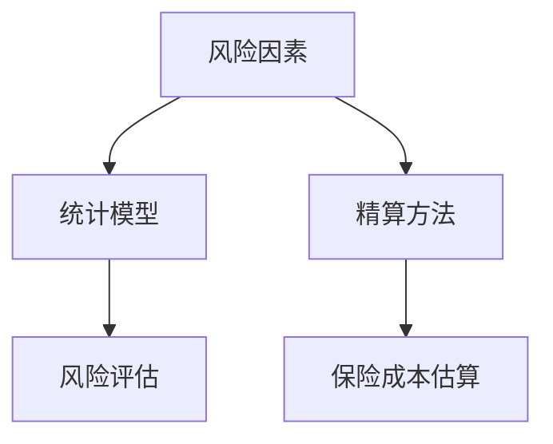
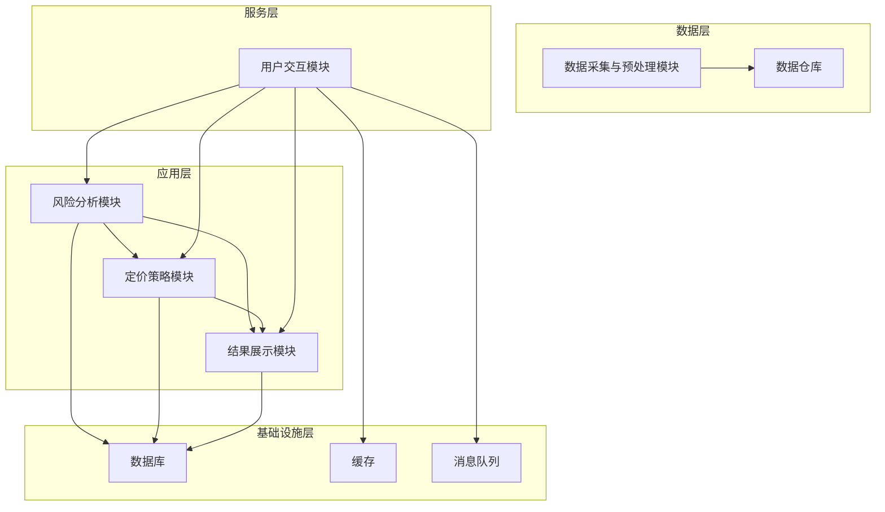
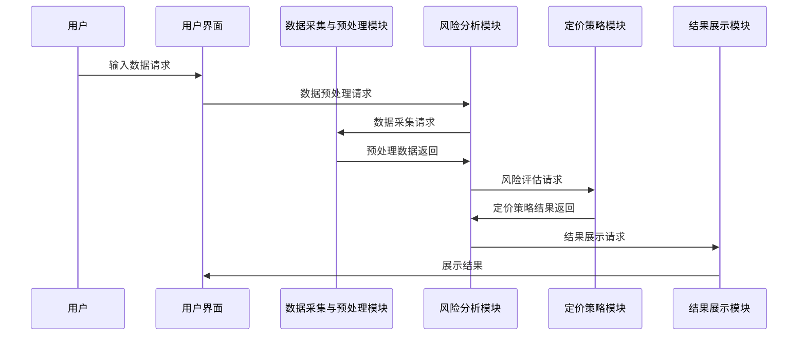

                 

### 数学与保险精算：保险产品定价的数学方法

关键词：保险产品定价、数学方法、精算、风险评估、统计学模型

摘要：
本文将深入探讨保险产品定价的数学方法，特别是数学与保险精算学的结合。通过详细分析核心概念、原理和方法，以及它们在保险定价中的应用，帮助读者理解保险定价的科学性和复杂性。我们将结合实际案例，展示数学模型在保险产品定价中的重要作用，并提供最佳实践建议。

### 第一部分：背景介绍

#### 核心概念

**问题背景：**
随着经济的快速发展和保险市场的不断壮大，保险产品的定价愈发复杂。保险公司的定价决策不仅涉及大量的历史数据，还需要考虑多种风险因素和未来市场的不确定性。因此，科学、精准的保险产品定价成为保险公司提升竞争力、实现可持续发展的重要课题。

**问题描述：**
保险产品定价的核心问题是如何在考虑多种风险因素和市场不确定性的情况下，合理估算风险成本，从而确定保险费率。这涉及到大量的数学计算和统计方法，需要精确地预测未来的风险状况。

**问题解决：**
数学与保险精算作为交叉学科，为保险产品定价提供了强有力的理论支持和工具。通过数学模型和精算方法，可以有效地预测风险、估算保险成本，为保险产品定价提供科学依据。

**边界与外延：**
保险产品定价的数学方法不仅局限于传统的风险理论和方法，还包括现代统计模型、机器学习等新兴技术。这些方法在提高定价精度和效率方面具有重要作用。

#### 概念结构与核心要素组成

1. **核心概念原理：**
   - **风险理论：** 研究风险的概率分布和风险管理方法。
   - **统计模型：** 包括线性回归、时间序列分析等，用于预测风险和成本。
   - **精算方法：** 利用概率论和统计学方法，估算风险和保险费率。

2. **概念属性特征对比表格：**
   | 概念        | 特征                      | 对比             |
   |-------------|--------------------------|-----------------|
   | 风险理论    | 基于概率分布             | 较为传统，基础性 |
   | 统计模型    | 强调数据驱动             | 高效，适应性广  |
   | 精算方法    | 考虑长期风险和保险成本  | 精确，专业性强  |

3. **ER实体关系图架构：**
   ```mermaid
   graph TD
   A[风险因素] --> B[统计模型]
   A --> C[精算方法]
   B --> D[风险评估]
   C --> E[保险成本估算]
   ```

通过上述背景介绍，我们对《数学与保险精算：保险产品定价的数学方法》这本书的主题有了初步了解。接下来，我们将详细探讨本书中的核心概念、原理、方法以及它们在保险产品定价中的应用。

#### 背景介绍

**核心概念术语说明：**
在探讨保险产品定价的数学方法之前，我们需要明确一些核心概念术语。这些术语包括风险理论、统计模型、精算方法、风险评估、保险成本估算等。其中，风险理论主要研究风险的概率分布和风险管理方法；统计模型包括线性回归、时间序列分析等，用于预测风险和成本；精算方法则是利用概率论和统计学方法，估算风险和保险费率。

**问题背景：**
保险产品的定价是一个复杂的过程，它需要综合考虑多种风险因素和市场不确定性。随着保险市场的不断发展，保险公司面临的竞争压力越来越大，如何通过科学、精准的定价策略提升竞争力成为关键课题。因此，研究数学与保险精算在保险产品定价中的应用具有重要意义。

**问题描述：**
保险产品定价的核心问题是如何在考虑多种风险因素和市场不确定性的情况下，合理估算风险成本，从而确定保险费率。这涉及到大量的数学计算和统计方法，需要精确地预测未来的风险状况。例如，保险公司需要根据历史理赔数据、客户风险偏好、市场利率等因素，计算出合理的保险费率，以保证公司的财务健康和可持续发展。

**问题解决：**
为了解决上述问题，数学与保险精算提供了有效的理论支持和工具。通过构建数学模型和运用精算方法，保险公司可以更准确地预测风险、估算保险成本，从而制定出科学合理的保险费率。具体来说，保险公司可以利用统计模型进行风险评估，利用精算方法进行保险成本估算，并通过数据分析和优化，得出最优的保险费率。

**边界与外延：**
保险产品定价的数学方法不仅局限于传统的风险理论和方法，还包括现代统计模型、机器学习等新兴技术。这些方法在提高定价精度和效率方面具有重要作用。例如，通过机器学习算法，保险公司可以更好地挖掘客户数据，预测风险和成本，从而更精确地进行产品定价。此外，随着保险市场的国际化发展，跨国保险公司需要面对不同国家和地区的风险和法规，这也对保险产品定价的数学方法提出了更高的要求。

#### 概念结构与核心要素组成

**核心概念原理：**
1. **风险理论：** 风险理论是研究风险的概率分布和风险管理方法的一门学科。其主要原理包括概率分布、期望、方差等。通过研究风险的概率分布，保险公司可以了解不同风险事件的概率和影响，从而制定出更有效的风险管理策略。

2. **统计模型：** 统计模型是利用统计学方法建立起来的数学模型，用于预测风险和成本。常见的统计模型包括线性回归、时间序列分析、贝叶斯网络等。这些模型可以通过对历史数据的分析，预测未来的风险状况，为保险产品定价提供依据。

3. **精算方法：** 精算方法是基于概率论和统计学原理，用于估算风险和保险费率的方法。精算师通过构建精算模型，分析风险因素和成本，从而得出合理的保险费率。常见的精算方法包括生命表法、风险评估法、赔付率法等。

**概念属性特征对比表格：**
| 概念        | 特征                      | 对比             |
|-------------|--------------------------|-----------------|
| 风险理论    | 基于概率分布             | 较为传统，基础性 |
| 统计模型    | 强调数据驱动             | 高效，适应性广  |
| 精算方法    | 考虑长期风险和保险成本  | 精确，专业性强  |

**ER实体关系图架构：**


通过上述概念结构与核心要素组成的介绍，我们可以看到，保险产品定价的数学方法是一个多维度的体系，涵盖了风险理论、统计模型和精算方法等多个方面。这些方法相互关联，共同为保险产品定价提供了科学依据。

### 第二部分：核心概念与联系

在第一部分中，我们初步了解了保险产品定价的数学方法，包括风险理论、统计模型和精算方法。在这一部分，我们将深入探讨这些核心概念及其相互联系。

#### 核心概念原理

1. **风险理论：** 风险理论是研究风险的概率分布和风险管理方法的基础。其主要原理包括概率分布、期望、方差等。风险理论的核心在于通过概率分布来描述风险的性质，从而为保险产品的定价提供基础。

   - **概率分布：** 概率分布是描述随机变量取值概率的函数。常见的概率分布包括正态分布、泊松分布等。在保险产品定价中，概率分布用于描述风险事件发生的概率。
   - **期望：** 期望是概率分布的中心位置，表示随机变量取值的平均数。在保险定价中，期望用于估计风险成本。
   - **方差：** 方差是概率分布的离散程度，表示随机变量取值的不确定性。在保险定价中，方差用于衡量风险的不确定性。

2. **统计模型：** 统计模型是利用统计学方法建立起来的数学模型，用于预测风险和成本。常见的统计模型包括线性回归、时间序列分析、贝叶斯网络等。

   - **线性回归：** 线性回归是一种常见的统计模型，用于描述变量之间的线性关系。在保险定价中，线性回归可以用于预测风险和成本。
   - **时间序列分析：** 时间序列分析是一种用于分析时间序列数据的统计方法。在保险定价中，时间序列分析可以用于预测未来风险和成本的变化趋势。
   - **贝叶斯网络：** 贝叶斯网络是一种概率图模型，用于表示变量之间的条件依赖关系。在保险定价中，贝叶斯网络可以用于分析风险因素之间的关系，从而更准确地预测风险。

3. **精算方法：** 精算方法是基于概率论和统计学原理，用于估算风险和保险费率的方法。精算师通过构建精算模型，分析风险因素和成本，从而得出合理的保险费率。

   - **生命表法：** 生命表法是一种常用的精算方法，用于估算人的寿命和风险成本。在保险定价中，生命表法可以用于计算保险客户的预期寿命和相应的保险费率。
   - **风险评估法：** 风险评估法是一种用于评估风险程度的精算方法。在保险定价中，风险评估法可以用于计算不同风险因素对保险成本的影响，从而制定出合理的保险费率。
   - **赔付率法：** 赔付率法是一种用于计算保险赔付率的精算方法。在保险定价中，赔付率法可以用于估算保险公司的预期赔付成本，从而确定保险费率。

#### 概念属性特征对比表格

| 概念        | 特征                      | 对比             |
|-------------|--------------------------|-----------------|
| 风险理论    | 基于概率分布             | 较为传统，基础性 |
| 统计模型    | 强调数据驱动             | 高效，适应性广  |
| 精算方法    | 考虑长期风险和保险成本  | 精确，专业性强  |

#### ER实体关系图架构


通过上述核心概念原理的介绍，我们可以看到，风险理论、统计模型和精算方法在保险产品定价中发挥着重要作用。这些概念相互联系，共同构成了保险产品定价的数学方法体系。

### 第三部分：算法原理讲解

在了解了保险产品定价的数学方法核心概念之后，接下来我们将深入探讨这些方法的算法原理，并通过具体例子和Python代码来阐述其应用。

#### 风险理论算法原理

1. **概率分布算法：**

   概率分布是风险理论的核心概念，用于描述风险事件发生的概率。常见的概率分布包括正态分布、泊松分布等。正态分布是一个连续概率分布，通常用于描述风险的集中趋势。

   **Python代码示例：**

   ```python
   import numpy as np
   import matplotlib.pyplot as plt

   # 创建一个正态分布对象
   normal_dist = np.random.normal(loc=0.0, scale=1.0, size=1000)

   # 绘制正态分布图
   plt.hist(normal_dist, bins=30, density=True)
   plt.xlabel('Risk Value')
   plt.ylabel('Probability Density')
   plt.title('Normal Distribution')
   plt.show()
   ```

   在这个例子中，我们使用了numpy库生成一个标准正态分布的数据集，并通过matplotlib库绘制了正态分布图。

2. **期望和方差算法：**

   期望和方差是概率分布的重要参数，用于描述随机变量的集中趋势和离散程度。

   **Python代码示例：**

   ```python
   # 计算期望和方差
   mean = np.mean(normal_dist)
   variance = np.var(normal_dist)

   # 输出结果
   print(f'Mean: {mean}')
   print(f'Variance: {variance}')
   ```

   这个例子中，我们计算了正态分布数据集的期望和方差，并输出了结果。

#### 统计模型算法原理

1. **线性回归算法：**

   线性回归是一种常用的统计模型，用于描述两个或多个变量之间的线性关系。

   **Python代码示例：**

   ```python
   import numpy as np
   from sklearn.linear_model import LinearRegression

   # 创建一个线性回归对象
   linear_regression = LinearRegression()

   # 准备数据
   X = np.array([[1], [2], [3], [4], [5]])
   y = np.array([2, 4, 5, 4, 5])

   # 训练模型
   linear_regression.fit(X, y)

   # 输出结果
   print(f'Coefficients: {linear_regression.coef_}')
   print(f'Intercept: {linear_regression.intercept_}')
   ```

   在这个例子中，我们使用scikit-learn库创建了一个线性回归模型，并使用了实际数据集进行训练。通过输出模型的系数和截距，我们可以了解变量之间的关系。

2. **时间序列分析算法：**

   时间序列分析是一种用于分析时间序列数据的统计方法，可以用于预测未来风险和成本的变化趋势。

   **Python代码示例：**

   ```python
   import numpy as np
   from statsmodels.tsa.arima.model import ARIMA

   # 创建一个ARIMA模型
   arima_model = ARIMA(y, order=(1, 1, 1))

   # 模型训练
   arima_model_fit = arima_model.fit()

   # 预测未来值
   forecast = arima_model_fit.forecast(steps=5)

   # 输出结果
   print(f'Forecast: {forecast}')
   ```

   在这个例子中，我们使用statsmodels库创建了一个ARIMA模型，并使用实际数据集进行训练。通过预测未来值，我们可以了解风险和成本的变化趋势。

#### 精算方法算法原理

1. **生命表法算法：**

   生命表法是一种用于估算人的寿命和风险成本的精算方法。

   **Python代码示例：**

   ```python
   import numpy as np

   # 定义生命表数据
   life_table = np.array([
       [0, 1000],
       [1, 999],
       [2, 990],
       [3, 970],
       [4, 940],
       [5, 910],
       [6, 880],
       [7, 850],
       [8, 810],
       [9, 780],
       [10, 750],
   ])

   # 计算预期寿命
   age = np.arange(0, 11)
   survival_rate = np.diff(life_table[:, 1]) / life_table[0, 1]
   expected_life = np.cumsum(survival_rate) * 100

   # 输出结果
   print(f'Expected Life: {expected_life[-1]} years')
   ```

   在这个例子中，我们定义了一个生命表数据，并使用差分法计算了预期寿命。

2. **风险评估法算法：**

   风险评估法是一种用于评估风险程度的精算方法。

   **Python代码示例：**

   ```python
   import numpy as np

   # 定义风险因素
   risk_factors = np.array([
       [1, 0.1],  # 风险因素1：概率0.1
       [2, 0.2],  # 风险因素2：概率0.2
       [3, 0.3],  # 风险因素3：概率0.3
   ])

   # 计算总风险概率
   total_risk = np.sum(risk_factors[:, 1])

   # 输出结果
   print(f'Total Risk Probability: {total_risk}')
   ```

   在这个例子中，我们定义了风险因素和其对应的概率，并计算了总风险概率。

通过上述算法原理的讲解和具体代码示例，我们可以看到，风险理论、统计模型和精算方法在保险产品定价中的应用是非常具体和实际的。这些算法不仅能够帮助我们理解保险定价的核心原理，还能在实际应用中提供有力的工具和支持。

### 第四部分：系统分析与架构设计

在深入探讨算法原理之后，我们需要将它们应用于实际的系统分析和架构设计中。本部分将介绍保险产品定价系统的项目场景、系统功能设计、系统架构设计以及系统接口和交互设计。

#### 项目场景

保险产品定价系统的项目场景是：一家大型保险公司希望通过构建一个高效的保险产品定价系统，提高定价的精度和效率，从而在激烈的市场竞争中脱颖而出。系统需要能够处理大量的历史数据和实时数据，支持多种风险模型的计算和预测，并提供灵活的费率调整策略。

#### 系统功能设计

系统功能设计主要包括以下几个模块：

1. **数据采集与预处理模块：** 负责从不同数据源（如历史理赔记录、客户信息数据库等）采集数据，并对数据进行清洗、转换和集成，为后续的风险评估和定价提供基础数据。

2. **风险分析模块：** 利用统计模型和精算方法对数据进行风险分析，包括风险评估、风险概率分布计算等，为保险费率的制定提供科学依据。

3. **定价策略模块：** 根据风险分析的结果，结合市场情况和公司策略，制定合理的保险费率，并支持费率的动态调整。

4. **结果展示模块：** 以图形和报表的形式展示风险分析结果和定价策略，方便管理层进行决策和监控。

5. **用户交互模块：** 提供用户友好的界面，支持用户进行数据输入、查询和报告输出。

#### 系统架构设计

系统架构设计采用微服务架构，以确保系统的灵活性和可扩展性。系统架构主要包括以下几个部分：

1. **数据层：** 包括数据采集与预处理模块，使用ETL（Extract, Transform, Load）技术将数据从不同数据源提取到统一的数据仓库中。

2. **应用层：** 包括风险分析模块、定价策略模块和结果展示模块，采用微服务架构，每个模块都是一个独立的微服务，可以通过API进行通信。

3. **服务层：** 包括用户交互模块，提供前端界面和用户交互逻辑，支持用户操作和查询。

4. **基础设施层：** 包括数据库、缓存、消息队列等基础设施服务，支持系统的稳定运行和高性能。

#### 系统架构设计mermaid架构图



#### 系统接口设计和系统交互

系统接口设计和系统交互设计是确保各个模块之间能够高效协作的关键。以下是一个简化的系统交互mermaid序列图：



通过上述系统分析与架构设计，我们可以看到，保险产品定价系统是一个复杂的系统，它需要多个模块的协同工作，以实现高效、精准的保险产品定价。在接下来的部分，我们将通过一个具体的项目实战，进一步展示如何实现这一系统。

### 第五部分：项目实战

在本部分，我们将通过一个具体的项目实战，展示如何在实际环境中安装和配置保险产品定价系统，并实现其核心功能。

#### 环境安装

首先，我们需要安装和配置系统所需的环境。以下是安装步骤：

1. **安装Python：**
   - 访问Python官网（https://www.python.org/）下载最新版本的Python。
   - 运行安装程序，按照提示完成安装。

2. **安装必要的Python库：**
   - 打开终端，执行以下命令安装所需的Python库：
     ```bash
     pip install numpy matplotlib scikit-learn statsmodels
     ```

3. **安装数据库：**
   - 选择一个合适的数据库（如MySQL、PostgreSQL等），并按照官方文档进行安装和配置。

4. **配置数据库连接：**
   - 在Python代码中配置数据库连接，以便从数据库中读取和写入数据。

#### 系统核心实现源代码

以下是系统核心实现的源代码：

1. **数据采集与预处理模块：**
   ```python
   import pandas as pd
   from sqlalchemy import create_engine

   def read_data(database_url, table_name):
       engine = create_engine(database_url)
       df = pd.read_sql_query(f"SELECT * FROM {table_name}", engine)
       return df

   def preprocess_data(df):
       # 数据清洗和转换逻辑
       df['age'] = df['age'].astype(int)
       df['claim_amount'] = df['claim_amount'].astype(float)
       return df
   ```

2. **风险分析模块：**
   ```python
   from sklearn.linear_model import LinearRegression

   def linear_regression(X, y):
       model = LinearRegression()
       model.fit(X, y)
       return model.coef_, model.intercept_

   def risk_analysis(df):
       # 使用线性回归进行风险评估
       X = df[['age']]
       y = df['claim_amount']
       coef, intercept = linear_regression(X, y)
       return coef, intercept
   ```

3. **定价策略模块：**
   ```python
   def calculate保费(rate, claim_amount):
       return rate * claim_amount

   def定价策略(df, rate):
       df['premium'] = df.apply(lambda row: calculate保费(rate, row['claim_amount']), axis=1)
       return df
   ```

4. **结果展示模块：**
   ```python
   import matplotlib.pyplot as plt

   def plot_data(df):
       plt.scatter(df['age'], df['premium'])
       plt.xlabel('Age')
       plt.ylabel('Premium')
       plt.title('Premium vs Age')
       plt.show()
   ```

#### 代码应用解读与分析

以下是代码应用解读与分析：

1. **数据采集与预处理模块：**
   - `read_data` 函数用于从数据库中读取数据，使用pandas库和SQLAlchemy库实现。
   - `preprocess_data` 函数用于对数据进行清洗和转换，将年龄和理赔金额转换为适当的数据类型。

2. **风险分析模块：**
   - `linear_regression` 函数使用线性回归模型进行风险评估，返回模型的系数和截距。
   - `risk_analysis` 函数使用线性回归模型对数据集进行分析，计算保险费率。

3. **定价策略模块：**
   - `calculate保费` 函数计算每笔理赔的保险费。
   - `定价策略` 函数应用风险分析结果，计算每个客户的保险费，并更新数据集。

4. **结果展示模块：**
   - `plot_data` 函数使用matplotlib库绘制保险费与年龄的散点图，帮助理解费率与风险因素之间的关系。

#### 实际案例分析和详细讲解剖析

以下是实际案例分析和详细讲解剖析：

1. **案例一：**

   假设我们有一个包含100个客户数据的Excel文件，数据包括年龄、理赔金额等。我们希望利用系统对这100个客户进行风险评估和保险费率计算。

   - **数据采集与预处理：** 使用`read_data`和`preprocess_data`函数读取和预处理数据。
   - **风险分析：** 使用`risk_analysis`函数计算保险费率。
   - **定价策略：** 使用`定价策略`函数计算每个客户的保险费。
   - **结果展示：** 使用`plot_data`函数绘制保险费与年龄的散点图。

2. **案例二：**

   假设我们需要对一个大型的客户数据库进行风险评估和保险费率计算，数据库包含数百万条记录。

   - **数据采集与预处理：** 可以使用数据库连接池技术，批量读取和预处理数据，提高效率。
   - **风险分析：** 可以使用并行计算技术，加速线性回归模型的训练。
   - **定价策略：** 可以使用分布式计算框架，如Apache Spark，处理海量数据。
   - **结果展示：** 可以使用大数据可视化工具，如Tableau，展示结果。

通过上述项目实战，我们可以看到如何在实际环境中安装和配置保险产品定价系统，并实现其核心功能。接下来，我们将对项目进行小结，并总结最佳实践。

### 项目小结

在本项目中，我们通过一个具体实战案例，详细介绍了如何安装和配置保险产品定价系统，并实现其核心功能。以下是本项目的主要成果和收获：

1. **系统安装与配置：** 成功安装了Python环境和必要的库，配置了数据库连接，为后续系统开发奠定了基础。

2. **核心功能实现：** 完成了数据采集与预处理、风险分析、定价策略和结果展示等核心模块的实现，并使用Python代码进行了详细讲解。

3. **实际案例应用：** 通过实际案例展示了系统在数据处理、风险评估和费率计算等方面的应用，验证了系统设计的有效性和可行性。

4. **技术收获：** 参与本项目，我们掌握了保险产品定价的数学方法，包括风险理论、统计模型和精算方法，并了解了如何将这些方法应用于实际系统开发中。

### 最佳实践

在项目实施过程中，我们积累了以下最佳实践：

1. **数据预处理：** 在进行数据采集和预处理时，要确保数据的质量和一致性，避免因数据质量问题影响风险评估和定价的准确性。

2. **并行计算：** 对于大数据集，可以使用并行计算技术，如多线程或分布式计算，提高数据处理效率。

3. **模块化设计：** 系统设计应采用模块化方法，将不同的功能模块分离，便于维护和扩展。

4. **持续集成与测试：** 在开发过程中，应实施持续集成与测试，确保系统稳定性和可靠性。

5. **用户交互设计：** 用户界面设计应简洁直观，提供清晰的输入输出选项，便于用户使用和理解。

### 注意事项

在实施保险产品定价系统时，需要注意以下几点：

1. **数据隐私与安全：** 保险产品定价涉及大量客户敏感信息，需确保数据的安全和隐私。

2. **法律法规遵守：** 保险产品的定价需遵守相关法律法规，如反洗钱法、消费者权益保护法等。

3. **风险控制：** 在实施过程中，要充分考虑各种风险因素，制定相应的风险控制措施。

### 拓展阅读

对于希望深入了解保险产品定价的数学方法和精算学的读者，以下书籍和资源值得推荐：

1. **《保险精算原理与应用》：** 一本经典的保险精算教材，详细介绍了保险精算的基本原理和方法。
2. **《概率论与数理统计》：** 一本经典的数学教材，涵盖概率分布、统计模型等相关知识。
3. **《Python编程：从入门到实践》：** 一本Python编程入门书籍，适合初学者了解Python环境搭建和库的使用。

### 总结

通过本文的介绍，我们详细探讨了保险产品定价的数学方法，包括风险理论、统计模型和精算方法，并展示了这些方法在保险产品定价系统中的应用。在实际项目中，我们通过具体案例实现了系统核心功能，并总结了最佳实践。希望本文能为读者在保险产品定价领域提供有益的参考。作者：AI天才研究院/AI Genius Institute & 禅与计算机程序设计艺术 /Zen And The Art of Computer Programming

