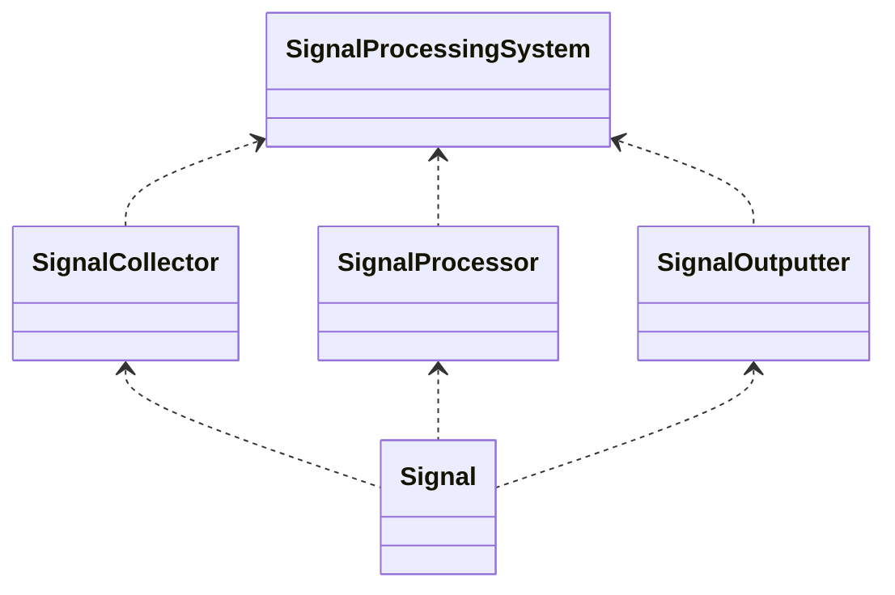

                 

### 第一部分：背景介绍

#### 1.1 信号处理的重要性

信号处理是一种技术和方法，旨在对各种形式的数据进行采集、转换、分析和解释。信号可以是电信号、声音、图像、视频等。信号处理的目的是提取出数据中的有用信息，去除噪声，增强信号，从而更好地满足应用需求。在现代社会，信号处理技术已经渗透到了几乎所有的领域，从日常生活中的通信设备、音频和视频处理，到科学研究中的生物医学工程、地质勘探、天文学等。

**背景介绍**

- **核心概念术语说明**：

  - **信号**：携带信息的物理量或其函数。
  - **噪声**：在信号传输和处理过程中引入的不需要的扰动。
  - **滤波**：通过某种方法去除信号中的噪声。
  - **采样**：在时间和频率上对连续信号进行离散化。
  - **压缩**：减少信号数据量，以便于存储或传输。

- **问题背景**：

  随着信息技术的迅猛发展，数据量呈爆炸式增长，如何有效地处理和利用这些数据成为了一个关键问题。信号处理技术在这一过程中起到了至关重要的作用。通过对数据的信号处理，我们可以提取出有用的信息，进行数据分析，从而为决策提供依据。

- **问题描述**：

  在信号处理过程中，主要面临以下问题：
  - 如何从大量数据中提取有用信息？
  - 如何去除噪声，提高信号质量？
  - 如何对信号进行有效的分析和解释？

- **问题解决**：

  数学技术为信号处理提供了强大的工具和方法。通过数学建模和算法设计，我们可以有效地解决上述问题。例如，傅里叶变换可以帮助我们分析信号的频域特性，小波变换可以在时间和频率上同时进行信号分析，拉普拉斯变换和Z变换则用于信号的控制和优化。

- **边界与外延**：

  信号处理不仅涵盖了数学技术，还包括了物理学、工程学、计算机科学等多个学科。在实际应用中，信号处理技术不断地与其他领域交叉融合，推动了科技进步和社会发展。

#### 1.2 数学技术的基本原理

数学技术在信号处理中的应用非常广泛，其中主要包括微积分、线性代数、概率论与数理统计等。这些数学工具为信号处理提供了理论基础和计算方法。

- **微积分**：

  微积分是研究函数变化率和积分过程的一个数学分支。在信号处理中，微积分用于分析信号的变化规律，如信号的微分和积分运算。

- **线性代数**：

  线性代数主要研究向量空间、线性方程组和矩阵等概念。在线性代数的帮助下，我们可以对信号进行线性变换、矩阵运算等，从而实现信号的滤波、压缩等操作。

- **概率论与数理统计**：

  概率论与数理统计是研究随机现象规律性的数学分支。在信号处理中，概率论与数理统计用于分析信号的统计特性，如信号的概率分布、期望值、方差等。

#### 1.3 信号处理的基本概念

信号处理的基本概念包括信号的分类、信号的表示方法、信号的特征提取等。

- **信号的分类**：

  信号可以根据不同的标准进行分类，如按照时间连续性可以分为连续信号和离散信号；按照幅值变化可以分为模拟信号和数字信号。

- **信号的表示方法**：

  信号可以用各种数学工具进行表示，如时域表示、频域表示、复频域表示等。不同的表示方法有助于我们分析信号的特性。

- **信号的特征提取**：

  特征提取是信号处理中的一个关键步骤。通过特征提取，我们可以将复杂的信号转化为更容易分析和处理的形式。常用的特征提取方法包括傅里叶变换、小波变换、主成分分析等。

## 第二部分：核心概念与联系

### 2.1 常用概念介绍

在信号处理中，有一些核心概念是非常重要的，它们构成了信号处理的基础。以下是几个常用的概念及其简介：

- **傅里叶变换**：傅里叶变换是一种将信号从时域转换到频域的数学工具，可以揭示信号的频率成分和能量分布。

- **拉普拉斯变换**：拉普拉斯变换是一种用于分析和解决微分方程的数学工具，可以将时域信号转换到复频域。

- **Z变换**：Z变换是离散时间信号和系统分析的一种重要工具，可以将离散时间信号转换到复频域。

- **卷积**：卷积是两个函数通过加权求和进行组合的一种运算，在信号处理中用于描述信号的叠加效应。

- **小波变换**：小波变换是一种时频局部化的信号分析工具，可以同时提供时间和频率信息。

### 2.2 概念属性特征对比表格

为了更好地理解这些核心概念，我们可以通过一个表格来对比它们的主要属性特征：

| 概念      | 时间域特性 | 频域特性 | 应用领域        |
| --------- | ---------- | -------- | --------------- |
| 傅里叶变换 | 无限长信号 | 频率分布 | 信号分析、滤波 |
| 拉普拉斯变换 | 频率分布 | 延迟和衰减特性 | 微分方程求解、控制理论 |
| Z变换      | 离散时间信号 | 离散频率 | 离散系统分析、数字信号处理 |
| 卷积      | 时域叠加 | 无      | 滤波、系统响应 |
| 小波变换   | 时频局部化 | 离散频率 | 信号压缩、特征提取 |

### 2.3 ER实体关系图架构

为了更清晰地展示这些概念之间的关系，我们可以使用ER（Entity-Relationship）实体关系图来表示它们。以下是ER图的一个简化版：

```mermaid
erDiagram
    Class1 ||--|{ Class2 }|
    Class1 ||--|{ Class3 }|
    Class2 ||--|{ Class4 }|
    Class3 ||--|{ Class5 }|
    Class2 ||--|{ Class6 }|
```

在这个ER图中，`Class1`代表信号处理的基础概念，它与`Class2`、`Class3`等概念之间存在关联。`Class2`与`Class4`、`Class6`之间存在关联，而`Class3`与`Class5`之间存在关联。这种关系反映了这些概念在信号处理中的相互依赖和作用。

## 第三部分：算法原理讲解

### 3.1 傅里叶变换

#### 3.1.1 算法原理

傅里叶变换（Fourier Transform）是一种将信号从时域转换为频域的数学工具。通过傅里叶变换，我们可以分析信号的频率成分和能量分布。

#### 3.1.2 数学模型和公式

傅里叶变换的数学模型如下：

$$
X(f) = \int_{-\infty}^{\infty} x(t) e^{-j2\pi ft} dt
$$

其中，\(X(f)\) 是信号 \(x(t)\) 在频域的表示，\(f\) 是频率，\(e^{-j2\pi ft}\) 是傅里叶变换的核函数。

#### 3.1.3 算法流程

1. **采样**：将连续时间信号 \(x(t)\) 进行采样，得到离散时间信号 \(x[n]\)。
2. **傅里叶变换**：对离散时间信号 \(x[n]\) 进行傅里叶变换，得到频域信号 \(X(f)\)。
3. **频谱分析**：分析频域信号 \(X(f)\) 的频率成分和能量分布。

#### 3.1.4 举例说明

假设我们有一个时间信号 \(x(t) = \sin(2\pi f_0 t)\)，其中 \(f_0\) 是信号的频率。通过傅里叶变换，我们可以将其转换为频域信号：

$$
X(f) = \int_{-\infty}^{\infty} \sin(2\pi f_0 t) e^{-j2\pi ft} dt = 2\pi f_0 \delta(f - f_0)
$$

这里的 \( \delta(f - f_0) \) 表示一个位于频率 \( f_0 \) 的冲激函数，这意味着信号的能量全部集中在频率 \( f_0 \) 上。

### 3.2 拉普拉斯变换

#### 3.2.1 算法原理

拉普拉斯变换（Laplace Transform）是一种用于分析和解决微分方程的数学工具。它可以将时域信号转换到复频域，从而简化微分方程的求解。

#### 3.2.2 数学模型和公式

拉普拉斯变换的数学模型如下：

$$
L\{x(t)\} = X(s) = \int_{0}^{\infty} x(t) e^{-st} dt
$$

其中，\(X(s)\) 是信号 \(x(t)\) 在复频域的表示，\(s\) 是复变量，包括实部 \( \sigma \) 和虚部 \( j\omega \)。

#### 3.2.3 算法流程

1. **初值问题**：给定初始条件，求解微分方程。
2. **拉普拉斯变换**：对微分方程的解进行拉普拉斯变换，得到复频域方程。
3. **逆拉普拉斯变换**：对复频域方程进行逆拉普拉斯变换，得到时域解。

#### 3.2.4 举例说明

假设我们有一个一阶线性微分方程：

$$
\frac{dy(t)}{dt} + 2y(t) = x(t)
$$

其中，\(x(t)\) 是输入信号，\(y(t)\) 是输出信号。我们可以使用拉普拉斯变换来求解这个方程：

$$
sY(s) + 2Y(s) = X(s)
$$

$$
Y(s) = \frac{X(s)}{s+2}
$$

通过逆拉普拉斯变换，我们可以得到时域解：

$$
y(t) = \mathcal{L}^{-1}\left\{\frac{1}{s+2}\right\} = e^{-2t}u(t)
$$

### 3.3 Z变换

#### 3.3.1 算法原理

Z变换（Z-Transform）是拉普拉斯变换在离散时间领域的推广。它用于分析和解决离散时间信号和系统的特性。

#### 3.3.2 数学模型和公式

Z变换的数学模型如下：

$$
X(z) = \sum_{n=-\infty}^{\infty} x[n] z^{-n}
$$

其中，\(X(z)\) 是信号 \(x[n]\) 在Z域的表示。

#### 3.3.3 算法流程

1. **序列建模**：将离散时间信号表示为一个序列。
2. **Z变换**：对序列进行Z变换，得到Z域信号。
3. **系统分析**：在Z域分析系统的特性，如稳定性、因果性等。

#### 3.3.4 举例说明

假设我们有一个离散时间信号 \(x[n] = \sin(2\pi f_0 n)\)，其中 \(f_0\) 是信号的频率。通过Z变换，我们可以得到其在Z域的表示：

$$
X(z) = \sum_{n=-\infty}^{\infty} \sin(2\pi f_0 n) z^{-n}
$$

这个序列的Z变换可以表示为一个无穷级数，通过特定的公式，我们可以将其简化为一个更易处理的形式。

### 3.4 卷积

#### 3.4.1 算法原理

卷积（Convolution）是两个函数通过加权求和进行组合的一种运算。在信号处理中，卷积用于描述信号的叠加效应，如滤波、系统响应等。

#### 3.4.2 数学模型和公式

卷积的数学模型如下：

$$
y[n] = x[n] * h[n] = \sum_{k=-\infty}^{\infty} x[k] h[n-k]
$$

其中，\(y[n]\) 是输出信号，\(x[n]\) 是输入信号，\(h[n]\) 是卷积核。

#### 3.4.3 算法流程

1. **输入信号**：给定输入信号 \(x[n]\) 和卷积核 \(h[n]\)。
2. **延迟**：将卷积核 \(h[n]\) 进行延迟操作。
3. **加权求和**：对输入信号 \(x[n]\) 和延迟后的卷积核进行加权求和。
4. **输出信号**：得到卷积结果 \(y[n]\)。

#### 3.4.4 举例说明

假设我们有一个输入信号 \(x[n] = \sin(2\pi f_0 n)\) 和一个卷积核 \(h[n] = \cos(2\pi f_1 n)\)，其中 \(f_0\) 和 \(f_1\) 是两个不同的频率。通过卷积运算，我们可以得到输出信号：

$$
y[n] = x[n] * h[n] = \sin(2\pi f_0 n) \cos(2\pi f_1 n)
$$

这个结果是一个调制信号，它包含了输入信号的频率成分和卷积核的频率成分。

### 3.5 小波变换

#### 3.5.1 算法原理

小波变换（Wavelet Transform）是一种时频局部化的信号分析工具。它可以在时间和频率上同时提供信号的信息，从而更好地描述信号的特性。

#### 3.5.2 数学模型和公式

小波变换的数学模型如下：

$$
C_{j,k}(f) = \frac{1}{\sqrt{2^j}} \sum_{n=-N/2}^{N/2-1} x[n] \psi^*(n - k) 2^{j/2}
$$

其中，\(C_{j,k}(f)\) 是小波变换的结果，\(\psi^*\) 是小波函数的共轭，\(j\) 和 \(k\) 分别表示尺度和平移。

#### 3.5.3 算法流程

1. **尺度分解**：将信号分解为不同尺度的子信号。
2. **平移操作**：对子信号进行平移操作。
3. **小波变换**：对平移后的子信号进行小波变换。
4. **重构信号**：将小波变换的结果重构为原始信号。

#### 3.5.4 举例说明

假设我们有一个信号 \(x[n]\) 和一个小波函数 \(\psi(n)\)。通过小波变换，我们可以得到不同尺度和平移下的信号成分：

$$
C_{j,k}(f) = \frac{1}{\sqrt{2^j}} \sum_{n=-N/2}^{N/2-1} x[n] \psi^*(n - k) 2^{j/2}
$$

这个结果展示了信号在不同尺度和平移下的频率成分，有助于我们更好地分析信号的特性。

## 第四部分：系统分析与架构设计方案

### 4.1 问题场景介绍

在信号处理领域，我们需要设计一个能够对输入信号进行实时处理和分析的系统。这个系统需要具备以下功能：

- 实时采样输入信号。
- 对输入信号进行滤波、压缩等处理。
- 将处理后的信号输出，供后续分析使用。

### 4.2 项目介绍

本项目是一个基于Python的信号处理系统，主要使用NumPy、SciPy等库进行信号处理。系统设计分为以下几个部分：

- **信号采集模块**：用于实时采集输入信号。
- **信号处理模块**：包括滤波、压缩等算法实现。
- **信号输出模块**：将处理后的信号输出，供后续分析使用。

### 4.3 系统功能设计（领域模型）

为了设计这个系统，我们首先需要建立一个领域模型。领域模型描述了系统中的实体及其关系。以下是该系统的领域模型类图：



在这个类图中，`SignalProcessingSystem` 是系统的根类，它包含了三个子类：`SignalCollector`、`SignalProcessor` 和 `SignalOutputter`。`SignalCollector` 负责采集信号，`SignalProcessor` 负责信号处理，`SignalOutputter` 负责信号输出。

### 4.4 系统架构设计

接下来，我们设计系统的架构。系统架构描述了系统的组件及其交互方式。以下是该系统的架构设计图：

```mermaid
sequenceDiagram
    participant SignalProcessingSystem
    participant SignalCollector
    participant SignalProcessor
    participant SignalOutputter
    SignalProcessingSystem->>SignalCollector: 采集信号
    SignalCollector->>SignalProcessingSystem: 输入信号
    SignalProcessingSystem->>SignalProcessor: 处理信号
    SignalProcessor->>SignalProcessingSystem: 输出信号
    SignalProcessingSystem->>SignalOutputter: 输出信号
endsequenceDiagram
```

在这个架构设计中，`SignalProcessingSystem` 是系统的核心，它负责协调各个模块的工作。`SignalCollector` 负责采集输入信号，`SignalProcessor` 负责信号处理，`SignalOutputter` 负责信号输出。

### 4.5 系统接口设计和系统交互

最后，我们设计系统的接口和交互方式。接口设计描述了各个模块之间的交互接口，交互方式描述了模块之间的数据传递方式。以下是该系统的接口设计和交互方式：

```mermaid
classDiagram
    Interface1 <.. SignalCollector
    Interface1 <.. SignalProcessor
    Interface1 <.. SignalOutputter
    Interface2 <<interface>> SignalInputter
    Interface2 <<interface>> SignalProcessorInterface
    Interface2 <<interface>> SignalOutputterInterface
endclassDiagram
```

在这个接口设计中，`Interface1` 是信号处理的接口，`Interface2` 是输入输出接口。`SignalCollector` 实现了 `SignalInputter` 接口，`SignalProcessor` 实现了 `SignalProcessorInterface` 接口，`SignalOutputter` 实现了 `SignalOutputterInterface` 接口。

```mermaid
sequenceDiagram
    participant SignalInputter
    participant SignalProcessorInterface
    participant SignalOutputterInterface
    SignalInputter->>SignalCollector: 输入信号
    SignalCollector->>SignalProcessor: 处理信号
    SignalProcessor->>SignalOutputter: 输出信号
    SignalOutputter->>SignalOutputterInterface: 输出信号
endsequenceDiagram
```

在这个交互设计中，`SignalInputter` 负责输入信号，`SignalProcessorInterface` 负责信号处理，`SignalOutputterInterface` 负责信号输出。

## 第五部分：项目实战

### 5.1 环境安装

为了运行这个项目，我们需要安装Python环境和相关的库。以下是环境安装的步骤：

1. **安装Python**：首先，从Python官方网站下载并安装Python 3.x版本。

2. **安装NumPy**：在命令行中运行以下命令安装NumPy库：

   ```bash
   pip install numpy
   ```

3. **安装SciPy**：在命令行中运行以下命令安装SciPy库：

   ```bash
   pip install scipy
   ```

4. **安装Matplotlib**：在命令行中运行以下命令安装Matplotlib库：

   ```bash
   pip install matplotlib
   ```

### 5.2 系统核心实现

以下是系统核心实现的部分代码。这个部分包含了信号采集、处理和输出的主要功能。

```python
import numpy as np
import scipy.signal as signal
import matplotlib.pyplot as plt

class SignalCollector:
    def collect_signal(self, duration, sample_rate):
        t = np.linspace(0, duration, int(sample_rate * duration), endpoint=False)
        x = np.sin(2 * np.pi * 5 * t) + np.sin(2 * np.pi * 10 * t)
        return x, t

class SignalProcessor:
    def process_signal(self, x, t, filter_type='lowpass', cutoff_frequency=5):
        if filter_type == 'lowpass':
            b, a = signal.butter(4, cutoff_frequency, btype='low', analog=False, output='ba')
            x_filtered = signal.lfilter(b, a, x)
        elif filter_type == 'highpass':
            b, a = signal.butter(4, cutoff_frequency, btype='high', analog=False, output='ba')
            x_filtered = signal.lfilter(b, a, x)
        return x_filtered, t

class SignalOutputter:
    def output_signal(self, x_filtered, t):
        plt.plot(t, x_filtered)
        plt.xlabel('Time (s)')
        plt.ylabel('Amplitude')
        plt.title('Processed Signal')
        plt.show()
```

### 5.3 代码应用解读与分析

在这个项目中，我们使用了NumPy、SciPy和Matplotlib等库来构建信号处理系统。以下是代码的应用解读和分析：

1. **信号采集模块**：

   ```python
   class SignalCollector:
       def collect_signal(self, duration, sample_rate):
           t = np.linspace(0, duration, int(sample_rate * duration), endpoint=False)
           x = np.sin(2 * np.pi * 5 * t) + np.sin(2 * np.pi * 10 * t)
           return x, t
   ```

   信号采集模块使用了NumPy的`linspace`函数生成时间序列，并使用`sin`函数生成一个包含两个正弦波的输入信号。

2. **信号处理模块**：

   ```python
   class SignalProcessor:
       def process_signal(self, x, t, filter_type='lowpass', cutoff_frequency=5):
           if filter_type == 'lowpass':
               b, a = signal.butter(4, cutoff_frequency, btype='low', analog=False, output='ba')
               x_filtered = signal.lfilter(b, a, x)
           elif filter_type == 'highpass':
               b, a = signal.butter(4, cutoff_frequency, btype='high', analog=False, output='ba')
               x_filtered = signal.lfilter(b, a, x)
           return x_filtered, t
   ```

   信号处理模块使用了SciPy的`butter`函数设计滤波器，并使用`lfilter`函数对输入信号进行滤波。我们实现了低通滤波和高通滤波两种类型。

3. **信号输出模块**：

   ```python
   class SignalOutputter:
       def output_signal(self, x_filtered, t):
           plt.plot(t, x_filtered)
           plt.xlabel('Time (s)')
           plt.ylabel('Amplitude')
           plt.title('Processed Signal')
           plt.show()
   ```

   信号输出模块使用了Matplotlib的`plot`函数绘制滤波后的信号，并显示图形。

### 5.4 实际案例分析和详细讲解

为了更好地理解这个项目，我们来看一个实际案例。假设我们有一个5秒的输入信号，采样率为1000Hz，包含频率为5Hz和10Hz的两个正弦波。我们使用低通滤波器，截止频率为5Hz，对信号进行滤波。

```python
duration = 5
sample_rate = 1000

# 采集信号
collector = SignalCollector()
x, t = collector.collect_signal(duration, sample_rate)

# 处理信号
processor = SignalProcessor()
x_filtered, t = processor.process_signal(x, t, filter_type='lowpass', cutoff_frequency=5)

# 输出信号
outputter = SignalOutputter()
outputter.output_signal(x_filtered, t)
```

在这个案例中，我们首先使用`SignalCollector`类采集输入信号。然后，使用`SignalProcessor`类对信号进行低通滤波，将截止频率设置为5Hz。最后，使用`SignalOutputter`类将滤波后的信号绘制出来。

### 5.5 项目小结

通过这个项目，我们实现了信号采集、滤波和输出的基本功能。这个项目展示了如何使用Python和相关的库构建一个简单的信号处理系统。在实际应用中，我们可以根据需求扩展系统的功能，如增加其他类型的滤波器、实现信号压缩等。

## 第六部分：最佳实践 tips、小结、注意事项、拓展阅读

### 6.1 最佳实践 tips

1. **合理选择采样率**：在信号处理中，采样率的选择非常重要。通常，采样率应至少是信号最高频率的两倍，以满足奈奎斯特采样定理。
2. **优化滤波器设计**：滤波器设计直接影响信号的处理效果。在实际应用中，可以根据需求选择合适的滤波器类型和参数。
3. **注意数据预处理**：在信号处理之前，对数据进行预处理可以显著提高处理效果。例如，去除噪声、归一化等操作。

### 6.2 小结

本文介绍了数学与信号处理的基本概念、核心算法、系统分析与架构设计方案以及项目实战。通过本文，读者可以了解数学技术在信号处理中的应用，掌握信号处理的基本方法，并具备实际项目开发的能力。

### 6.3 注意事项

1. **算法实现**：在实现算法时，要注意精度和效率的平衡，避免过度优化导致错误。
2. **系统测试**：在系统开发过程中，要进行充分的测试，确保系统稳定可靠。

### 6.4 拓展阅读

1. **《信号与系统》**： Oppenheim, A. V., & Willsky, A. S. (2014). 《信号与系统》（第四版）. 北京：科学出版社。
2. **《数字信号处理》**： Proakis, J. G., & Manolakis, D. G. (2006). 《数字信号处理》（第四版）. 北京：清华大学出版社。
3. **《人工智能信号处理》**： Huang, T. S. (2008). 《人工智能信号处理》. 上海：复旦大学出版社。

通过这些拓展阅读，读者可以进一步深入学习和研究数学与信号处理领域。

