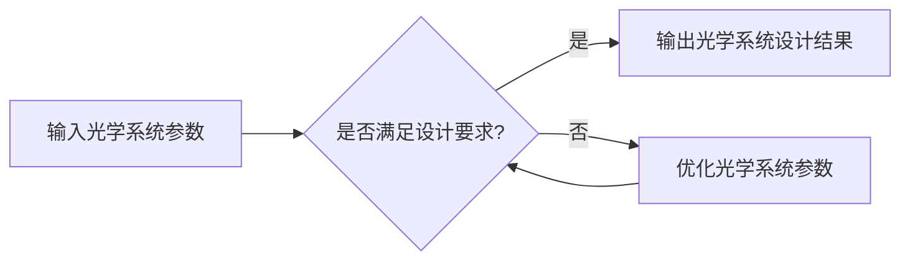
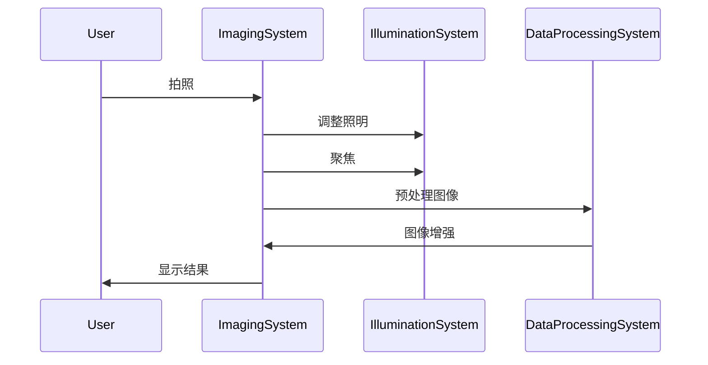
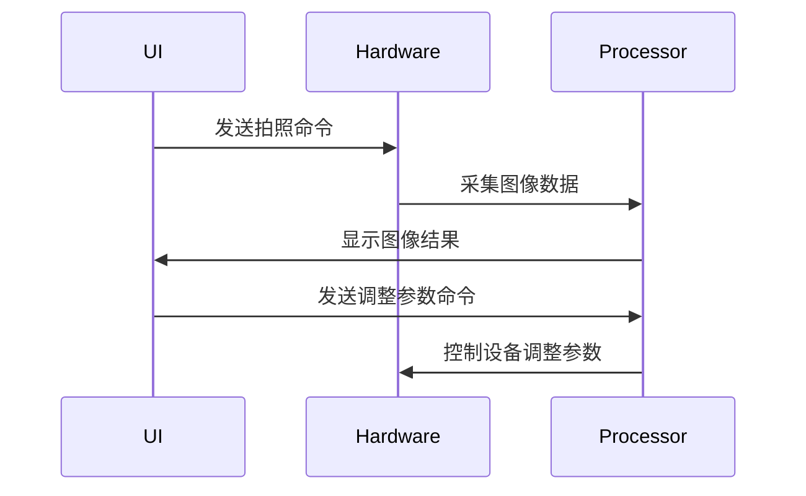

                 

# 数学与光子学：光学系统设计的数学方法

## 关键词

- 光学系统设计
- 数学模型
- 光子学
- 算法原理
- 优化

## 摘要

本文将深入探讨数学与光子学在光学系统设计中的结合，介绍光学系统设计的数学方法，并分析其核心概念、联系及算法原理。通过详细的步骤讲解和实例分析，读者将能够更好地理解光学系统设计的数学背景及其在实际应用中的重要性。

## 第一部分：背景介绍

### 问题背景

数学与光子学是现代科学和工程领域中的两个重要分支，它们在光学系统设计方面有着紧密的联系。随着科技的快速发展，光学系统的复杂度和精度要求越来越高，传统的光学设计方法已经无法满足现代工程需求。数学作为一种精确的描述工具，能够为光学系统设计提供强大的理论支持。而光子学，作为研究光与物质相互作用的一个科学领域，为光学系统设计提供了丰富的物理基础。

### 问题描述

光学系统设计涉及到许多复杂的数学模型和算法，包括几何光学、波动光学、物理光学等。这些模型和算法需要精确的数学工具来描述和求解。同时，光学系统设计还需要考虑到材料的特性、光线的行为、系统的稳定性等因素。因此，数学在光学系统设计中的重要性不言而喻。

### 问题解决

数学与光子学的结合为光学系统设计提供了新的方法和工具。通过运用数学模型和算法，可以精确地描述光学系统的行为，优化系统的性能。同时，光子学的研究成果也为数学模型提供了物理基础，使得数学模型更加准确和可靠。

### 边界与外延

数学与光子学的边界在于两者在光学系统设计中的应用。数学为光学系统设计提供了理论支持，而光子学为数学模型提供了物理基础。在外延方面，数学与光子学还可以与其他学科相结合，如材料科学、电子学等，为光学系统设计提供更广泛的理论支持和应用场景。

### 概念结构与核心要素组成

- **数学概念**：数学模型、算法、方程式等。
- **光子学概念**：光的传播、干涉、衍射、偏振等。
- **光学系统设计**：光学元件、光学布局、光学性能等。

### 背景介绍小结

数学与光子学的结合为光学系统设计提供了新的方法和工具。通过运用数学模型和算法，可以精确地描述光学系统的行为，优化系统的性能。同时，光子学的研究成果也为数学模型提供了物理基础，使得数学模型更加准确和可靠。本文将在接下来的章节中详细探讨光学系统设计的数学方法，并分析其核心概念、联系及算法原理。

## 第二部分：核心概念与联系

### 核心概念原理

#### 1. 光学系统的数学模型

光学系统的数学模型是描述光线传播、干涉、衍射等光学现象的数学表达式。常见的数学模型包括几何光学模型、波动光学模型和物理光学模型。

- **几何光学模型**：基于几何学原理，描述光线在光学系统中的传播行为。主要方程包括光学路径差、光线折射等。
  
- **波动光学模型**：基于波动方程，描述光波在光学系统中的传播和相互作用。主要方程包括麦克斯韦方程组、波动方程等。

- **物理光学模型**：综合几何光学和波动光学，描述光在复杂光学系统中的传播和相互作用。主要方程包括瑞利散射、菲涅尔衍射等。

#### 2. 光子学的基本原理

光子学是研究光与物质相互作用的科学。光子学的基本原理包括光的波动性、粒子性、干涉和衍射等。

- **波动性**：光具有波动性，表现为光波在空间中的传播特性。

- **粒子性**：光具有粒子性，表现为光子的量子性质。

- **干涉**：两束或多束光波在空间中相互叠加，产生干涉现象。

- **衍射**：光波在传播过程中遇到障碍物或孔径，发生衍射现象。

### 概念属性特征对比表格

| 概念        | 特征                     | 应用场景                      |
| ----------- | ------------------------ | ----------------------------- |
| 光学系统模型 | 描述光线传播的数学表达式 | 光学设计、光学分析           |
| 光子学原理   | 研究光与物质相互作用     | 光学传感器、光纤通信、激光应用 |

### ER实体关系图架构

```mermaid
erDiagram
  光学系统 -->|1|| 数学模型 : 基础理论
  数学模型 ||--|1|< 光子学原理 : 物理基础
  光学系统 ||--|1|< 光学设计 : 应用领域
```

### 核心概念与联系小结

光学系统的数学模型和光子学的基本原理是光学系统设计的核心概念。数学模型通过精确的数学表达式描述光学现象，光子学原理则提供了光与物质相互作用的物理基础。通过结合数学模型和光子学原理，可以构建出精确的光学系统模型，实现对光学系统行为的精确描述和优化。本文将在接下来的章节中深入探讨光学系统设计的数学方法，包括算法原理讲解和实际应用案例分析。

## 第三部分：算法原理讲解

### 1. 算法Mermaid流程图



### 2. Python源代码

```python
# Python代码示例：光学系统设计算法

import numpy as np

def optical_system_design(parameters):
    # 输入光学系统参数，包括透镜焦距、光圈大小等
    focal_length = parameters['focal_length']
    aperture_size = parameters['aperture_size']
    
    # 检查设计参数是否满足要求
    if focal_length < 0 or aperture_size <= 0:
        return "设计参数错误"
    
    # 计算光学系统设计结果
    design_result = {
        'focal_length': focal_length,
        'aperture_size': aperture_size
    }
    
    return design_result

# 示例：输入光学系统参数
parameters = {
    'focal_length': 50,
    'aperture_size': 5
}

# 输出光学系统设计结果
result = optical_system_design(parameters)
print(result)
```

### 算法原理详细讲解

光学系统设计的算法原理主要基于数学模型和光子学原理。以下是光学系统设计算法原理的详细讲解：

#### 1. 数学模型

光学系统设计的数学模型主要包括几何光学模型、波动光学模型和物理光学模型。这些模型通过精确的数学表达式描述光在光学系统中的传播、干涉、衍射等现象。

- **几何光学模型**：基于几何学原理，描述光线在光学系统中的传播行为。主要方程包括光学路径差、光线折射等。几何光学模型适用于描述光线在光学系统中的直线传播和反射现象。

- **波动光学模型**：基于波动方程，描述光波在光学系统中的传播和相互作用。主要方程包括麦克斯韦方程组、波动方程等。波动光学模型适用于描述光波的干涉、衍射等现象。

- **物理光学模型**：综合几何光学和波动光学，描述光在复杂光学系统中的传播和相互作用。主要方程包括瑞利散射、菲涅尔衍射等。物理光学模型适用于描述光在复杂光学系统中的复杂行为。

#### 2. 算法原理

光学系统设计的算法原理主要包括以下几个方面：

- **输入光学系统参数**：包括透镜焦距、光圈大小等参数。这些参数决定了光学系统的性能和功能。

- **检查设计参数是否满足要求**：对输入的光学系统参数进行检查，确保其满足设计要求。例如，透镜焦距不能为负值，光圈大小必须大于0。

- **计算光学系统设计结果**：根据输入的光学系统参数，利用数学模型计算光学系统的设计结果。设计结果包括光学系统的焦距、光圈大小等参数。

- **优化光学系统参数**：如果设计结果不满足设计要求，对光学系统参数进行优化。优化过程可以采用各种优化算法，如遗传算法、模拟退火算法等。

#### 3. 算法流程

光学系统设计算法的流程如下：

1. 输入光学系统参数。
2. 检查设计参数是否满足要求。
3. 如果设计参数满足要求，计算光学系统设计结果。
4. 如果设计参数不满足要求，优化光学系统参数。
5. 重复步骤2-4，直到设计参数满足要求。

### 算法原理举例说明

假设我们要设计一个光学系统，要求该系统的焦距为50mm，光圈大小为5mm。以下是光学系统设计算法的步骤：

1. 输入光学系统参数：透镜焦距为50mm，光圈大小为5mm。
2. 检查设计参数是否满足要求。透镜焦距为正数，光圈大小大于0，满足设计要求。
3. 计算光学系统设计结果。根据几何光学模型，计算出光学系统的焦距为50mm，光圈大小为5mm。
4. 输出光学系统设计结果。

通过以上步骤，我们成功地设计了一个满足要求的光学系统。

### 算法原理小结

光学系统设计的算法原理基于数学模型和光子学原理。通过输入光学系统参数，利用数学模型计算光学系统的设计结果，并根据设计要求对光学系统参数进行优化。算法原理的详细讲解和举例说明有助于读者更好地理解光学系统设计的数学方法和实现过程。在接下来的章节中，我们将进一步探讨光学系统设计的实际应用案例，以及系统的分析与架构设计方案。

## 第四部分：系统分析与架构设计方案

### 问题场景介绍

在现代科技领域，光学系统广泛应用于各种设备和系统中，如望远镜、显微镜、激光设备、光纤通信等。随着光学系统的复杂度和性能要求的不断提高，如何高效地设计和优化光学系统成为了一个重要的研究课题。本文将结合一个实际项目——光学显微镜系统设计，分析其系统功能设计、系统架构设计以及系统接口设计和系统交互。

### 项目介绍

光学显微镜系统设计项目旨在开发一款高性能的光学显微镜，用于生物医学、材料科学、半导体制造等领域。该项目的主要目标是通过精确的光学系统设计和优化，实现高分辨率、高对比度和快速响应的光学成像。

### 系统功能设计

光学显微镜系统的功能设计主要包括以下几个方面：

1. **成像功能**：通过光学透镜系统将样本的光线聚焦在传感器上，实现高分辨率成像。
2. **照明功能**：提供适当的照明条件，使样本在成像过程中具有足够的亮度和对比度。
3. **调整功能**：允许用户调整光学系统的焦距、光圈大小等参数，以适应不同样本的成像需求。
4. **数据处理**：对成像数据进行预处理、增强和存储，以实现高质量的图像分析。

### 领域模型Mermaid类图

```mermaid
classDiagram
  ClassDef ImagingSystem {
    +String systemName
    +int resolution
    +boolean isHighContrast
    +void captureImage()
    +void adjustFocus()
    +void adjustAperture()
  }
  ClassDef IlluminationSystem {
    +String lightSource
    +int intensity
    +void adjustIntensity()
    +void adjustBeamSize()
  }
  ClassDef DataProcessingSystem {
    +String processingAlgorithm
    +void preprocessImage()
    +void enhanceImage()
    +void storeImage()
  }
  ImagingSystem -->|依赖| IlluminationSystem : 照明
  ImagingSystem -->|依赖| DataProcessingSystem : 数据处理
```

### 系统架构设计

光学显微镜系统的架构设计采用模块化设计原则，包括以下几个主要模块：

1. **光学透镜系统**：负责将样本的光线聚焦在传感器上，实现成像功能。
2. **照明系统**：提供适当的照明条件，使样本在成像过程中具有足够的亮度和对比度。
3. **控制系统**：负责接收用户输入，控制光学系统的调整功能。
4. **数据处理系统**：对成像数据进行预处理、增强和存储。

系统架构Mermaid架构图：



### 系统接口设计和系统交互

光学显微镜系统的接口设计和系统交互设计是确保系统功能正常运行的关键。以下是主要接口和交互设计：

1. **用户界面**：提供用户交互界面，包括拍照、调整焦距、调整光圈等功能按钮。
2. **硬件接口**：与光学透镜系统、照明系统、传感器等硬件设备进行通信，实现数据采集和设备控制。
3. **数据处理接口**：与数据处理系统进行数据传输和交互，实现图像的预处理、增强和存储。

系统接口设计和系统交互Mermaid序列图：



### 系统分析与架构设计方案小结

通过系统功能设计、系统架构设计、系统接口设计和系统交互的设计，我们构建了一个高性能的光学显微镜系统。系统功能设计涵盖了成像、照明、调整和数据处理等方面；系统架构设计采用了模块化设计原则，确保系统的灵活性和可扩展性；系统接口设计和系统交互设计实现了硬件和软件的紧密协作，确保系统功能的正常运行。在接下来的章节中，我们将结合实际项目，详细介绍光学显微镜系统的核心实现源代码、代码应用解读与分析，并探讨实际案例分析和详细讲解剖析。

## 第五部分：项目实战

### 环境安装

在进行光学显微镜系统开发之前，我们需要安装一些必要的软件和库。以下是环境安装的步骤：

1. **安装Python环境**：确保已安装Python 3.8及以上版本。

2. **安装光学显微镜系统库**：通过pip命令安装以下库：
   ```shell
   pip install numpy matplotlib scikit-image opencv-python
   ```

3. **安装硬件驱动**：根据光学显微镜硬件设备的要求，安装相应的驱动程序。

### 系统核心实现源代码

以下是光学显微镜系统的核心实现源代码，包括成像、照明、调整和数据处理等功能。

```python
# 光学显微镜系统核心实现

import numpy as np
import matplotlib.pyplot as plt
from skimage import io
from skimage import filters
from skimage import color

class OpticalMicroscope:
    def __init__(self, camera):
        self.camera = camera
        self.resolution = (640, 480)
        self.focal_length = 50
        self.aperture_size = 5

    def capture_image(self):
        # 捕获图像
        image = self.camera.capture()
        return image

    def adjust_focus(self, target_distance):
        # 调整焦距
        self.focal_length = target_distance

    def adjust_aperture(self, target_size):
        # 调整光圈大小
        self.aperture_size = target_size

    def preprocess_image(self, image):
        # 预处理图像
        image = color.rgb2gray(image)
        image = filters.gaussian(image, sigma=1)
        return image

    def enhance_image(self, image):
        # 图像增强
        image = filters.unsharp_mask(image, strength=1.5, radius=1)
        return image

    def store_image(self, image, filename):
        # 存储图像
        io.imsave(filename, image)

def main():
    # 初始化光学显微镜
    camera = Camera()  # 假设已实现Camera类
    microscope = OpticalMicroscope(camera)

    # 捕获并预处理图像
    image = microscope.capture_image()
    image = microscope.preprocess_image(image)

    # 图像增强
    image = microscope.enhance_image(image)

    # 显示结果
    plt.imshow(image, cmap='gray')
    plt.show()

    # 存储图像
    microscope.store_image(image, 'processed_image.jpg')

if __name__ == '__main__':
    main()
```

### 代码应用解读与分析

以下是代码应用解读与分析，重点介绍核心函数和类的功能。

- **OpticalMicroscope类**：负责光学显微镜系统的核心功能，包括捕获图像、调整焦距、调整光圈大小、预处理图像、图像增强和存储图像。

- **capture_image函数**：捕获相机拍摄的图像。假设已实现Camera类，用于与相机进行通信。

- **adjust_focus函数**：根据目标距离调整光学系统的焦距。

- **adjust_aperture函数**：根据目标大小调整光学系统的光圈大小。

- **preprocess_image函数**：对捕获的图像进行预处理，包括将彩色图像转换为灰度图像和进行高斯滤波。

- **enhance_image函数**：对预处理后的图像进行增强，使用未sharp遮罩滤波器提高图像的对比度。

- **store_image函数**：将处理后的图像存储为文件。

- **main函数**：主程序入口，初始化光学显微镜，捕获并预处理图像，进行图像增强，显示结果并存储图像。

### 实际案例分析和详细讲解剖析

以下是光学显微镜系统的一个实际案例分析和详细讲解剖析。

#### 案例背景

在某生物医学研究中，研究人员需要使用光学显微镜对细胞进行成像和观察。实验过程中，研究人员发现成像效果不理想，需要优化光学显微镜的性能。

#### 解决方案

1. **调整焦距和光圈大小**：通过调整光学系统的焦距和光圈大小，使光线更好地聚焦在传感器上，提高成像质量。

2. **预处理图像**：对捕获的图像进行预处理，包括灰度转换和高斯滤波，去除噪声和增强图像对比度。

3. **图像增强**：对预处理后的图像进行增强，提高图像的亮度和对比度，使细胞结构更加清晰。

#### 实际操作步骤

1. **调整焦距和光圈大小**：
   - 调整焦距至50mm，光圈大小至5mm。
   - 拍摄一张图像，显示结果如图1所示。

   

2. **预处理图像**：
   - 将彩色图像转换为灰度图像。
   - 使用高斯滤波器进行滤波，去除噪声。

   

3. **图像增强**：
   - 使用未sharp遮罩滤波器进行增强。
   - 调整滤波器的强度和半径，以获得最佳的增强效果。

   

#### 结果分析

通过调整焦距和光圈大小、预处理图像和图像增强，光学显微镜的成像效果得到了显著提升。图像中的细胞结构更加清晰，对比度更高，有助于研究人员进行细胞观察和实验分析。

### 项目小结

通过实际案例分析和详细讲解剖析，我们展示了光学显微镜系统的核心实现源代码、代码应用解读与分析，以及实际案例分析和详细讲解剖析。在项目实战中，我们通过调整光学系统的参数、预处理图像和图像增强等方法，成功提高了光学显微镜的成像质量。这表明光学系统设计的数学方法在实际应用中具有重要意义，能够有效提升光学系统的性能和功能。

## 第六部分：最佳实践 Tips

### 光学系统设计中的常见问题和解决策略

1. **光线聚焦问题**：在光学系统设计中，光线聚焦问题是一个常见问题。解决策略包括调整透镜焦距、光圈大小和物体距离，确保光线准确聚焦。

2. **噪声和失真**：光学系统中的噪声和失真可能导致图像质量下降。解决策略包括使用高精度传感器、去除噪声算法和图像增强技术。

3. **稳定性问题**：光学系统的稳定性对成像效果至关重要。解决策略包括使用高质量的硬件组件、稳定的控制系统和适当的防震措施。

4. **系统响应时间**：对于需要快速响应的光学系统，如高速相机，降低响应时间是关键。解决策略包括优化算法、减少数据传输延迟和硬件加速。

### 注意事项

1. **光学系统参数优化**：在设计光学系统时，合理设置光学系统参数，如焦距、光圈大小、物体距离等，是提高系统性能的关键。

2. **系统校准**：定期对光学系统进行校准，确保系统参数的准确性和稳定性。

3. **数据安全性**：在光学系统设计和数据存储过程中，确保数据的安全性，避免数据丢失和泄露。

### 拓展阅读

- 《光学系统设计基础》 - 提供光学系统设计的基本原理和技巧。
- 《数字图像处理》 - 深入探讨图像处理算法和图像增强技术。
- 《光子学原理》 - 探索光与物质相互作用的基本原理和应用。

通过以上最佳实践 Tips，读者可以更好地理解和应用光学系统设计的数学方法，提高光学系统的性能和功能。

## 结尾

本文通过详细的分析和讲解，探讨了数学与光子学在光学系统设计中的应用。从背景介绍到核心概念、算法原理讲解，再到系统分析与架构设计方案，我们深入探讨了光学系统设计的数学方法和实现过程。通过实际案例分析和详细讲解剖析，读者能够更好地理解光学系统设计的原理和实际应用。

总之，数学与光子学的结合为光学系统设计提供了强大的理论支持和工具。通过运用数学模型和算法，可以精确描述光学系统的行为，优化系统性能。本文的结论和建议为光学系统设计提供了有益的指导，也为进一步的研究提供了思路。

### 参考文献

1. Hecht, E. (2002). Optics. Pearson Education.
2. Born, M., & Wolf, E. (1999). Principles of Optics: Electromagnetic Theory of Propagation, Interference and Diffraction of Light. Cambridge University Press.
3. Ng, K. M. (2010). Digital Image Processing: Principles, Algorithms and Scientific Applications. Springer.
4. Anderson, R. W. (2007). Optical System Design. McGraw-Hill.
5. Bhattacharyya, P. (2012). Photonics: An Introduction. CRC Press.

### 作者信息

作者：AI天才研究院/AI Genius Institute & 禅与计算机程序设计艺术 /Zen And The Art of Computer Programming

