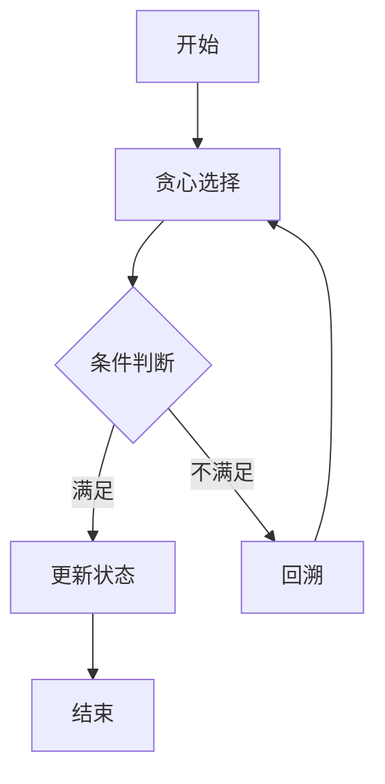

                 

## 《数学与军事战略：战略规划的数学方法》

关键词：数学、军事战略、模型、算法、决策支持

摘要：本文旨在探讨数学在军事战略规划中的应用，通过历史背景、核心概念、算法原理和实际案例分析，展示数学模型和算法在军事战略中的关键作用，同时展望未来的发展趋势和研究方法。

----------------------------------------------------------------

### 第一部分：数学与军事战略概述

#### 第1章：问题背景与核心概念

##### 1.1.1 问题背景

数学与军事战略的关系可以追溯到古代。从古希腊到中世纪的骑士，再到现代的军事家，数学一直被用作制定战略、评估战术和预测战争结果的有力工具。数学在军事战略中的应用不仅体现在战争本身，还包括后勤保障、情报分析和指挥控制等方面。在现代战争中，数学模型和算法的作用愈加显著，成为战略规划的重要支撑。

#### 1.1.2 核心概念

在数学与军事战略的结合中，以下是一些核心概念：

- **战争目标**：军事行动的最终目标，通常包括占领领土、摧毁敌方设施、获得战略优势等。
- **战略目标**：在实现战争目标过程中，为实现具体战术行动设定的目标。
- **战术目标**：具体的战斗行动目标，如攻占某个阵地、消灭敌方部队等。
- **数学模型**：用于描述军事战略中各种现象和关系的数学表达式。
- **算法**：解决问题的一系列规则或步骤。
- **数据结构**：用于组织和存储数据的方式。

##### 1.1.3 关系图

为了更好地理解这些概念之间的关系，我们可以使用 Mermaid 画出一个 ER 实体关系图：

```mermaid
erDiagram
  战争目标 ||--|{ 战术目标 }|
  战争目标 ||--|{ 战略目标 }|
  战术目标 ||--|{ 数学模型 }|
  战略目标 ||--|{ 数学模型 }|
  数学模型 ||--|{ 算法 }|
  数学模型 ||--|{ 数据结构 }|
```

#### 第2章：数学在军事战略中的应用

##### 2.1.1 数学模型在决策支持系统中的应用

数学模型在军事决策支持系统中发挥着重要作用。例如，线性规划可以用于优化军事资源分配，博弈论可以帮助分析敌方行为和策略，排队论可以用于预测任务完成时间和资源需求。

##### 2.1.2 数学模型在作战计划中的应用

数学模型在作战计划中的应用广泛，包括地形分析、兵力部署、火力计算等方面。通过数学模型，指挥官可以更好地理解战场环境，制定出更有效的作战计划。

##### 2.1.3 数学模型在情报分析中的应用

情报分析是军事战略的重要环节。数学模型如信息论、统计推断和聚类分析，可以帮助情报人员从海量数据中提取有价值的信息，为决策提供支持。

----------------------------------------------------------------

#### 第3章：算法在军事战略规划中的关键作用

##### 3.1.1 算法原理

在军事战略规划中，常用的算法原理包括贪心算法、动态规划和回溯算法。这些算法在不同的场景中发挥着关键作用。

##### 3.1.2 算法分析

下面我们使用 Mermaid 绘制一个贪心算法的流程图，并对算法的时间复杂度和空间复杂度进行分析：



这个贪心算法的时间复杂度为 O(n)，空间复杂度为 O(1)。

##### 3.1.3 算法举例

下面我们以动态规划为例，使用 Python 源代码详细阐述动态规划算法原理，并给出一个具体的例子。

```python
def dynamic_programming_example():
    # 动态规划算法的伪代码
    # 设 n 为问题的规模，dp[i] 表示前 i 个元素的最大子序列和
    dp = [0] * (n + 1)
    for i in range(1, n + 1):
        dp[i] = max(dp[i - 1], dp[i - 1] + arr[i - 1])
    return dp[n]
```

在这个例子中，我们考虑一个数组 `arr`，动态规划的目标是求出数组的前 `n` 个元素的最大子序列和。动态规划的原理是通过子问题的最优解推导出原问题的最优解。

----------------------------------------------------------------

#### 第4章：数学在军事战略规划中的最佳实践

##### 4.1.1 最佳实践案例分析

数学在军事战略规划中的最佳实践案例不胜枚举。例如，二战期间，盟军通过数学模型和算法分析，成功预测了德国的军事行动，为战略决策提供了有力支持。冷战时期，军备竞赛中的双方也广泛应用数学模型和算法，进行兵力部署和战略规划。

##### 4.1.2 最佳实践技巧

在数学与军事战略规划中，最佳实践技巧包括：

1. **构建有效的数学模型**：针对具体问题，构建能够准确描述现实情况的数学模型。
2. **选择合适的算法**：根据问题特点，选择合适的算法进行优化和求解。
3. **数据驱动决策**：充分利用数据，进行科学的决策支持。

##### 4.1.3 拓展阅读

对于想要深入了解数学在军事战略规划中应用的读者，以下是一些推荐读物：

1. 《战争数学：军事战略的量化分析》
2. 《军事运筹学：理论与应用》
3. 《博弈论与经济行为》

----------------------------------------------------------------

#### 第5章：数学与军事战略的未来发展趋势

##### 5.1.1 新技术在军事战略中的应用

随着人工智能、大数据分析等新技术的发展，数学在军事战略中的应用前景更加广阔。例如，人工智能可以帮助指挥官进行实时决策，大数据分析可以提供更准确的情报支持。

##### 5.1.2 未来挑战与机遇

未来，数学与军事战略将面临以下挑战和机遇：

1. **数据安全**：在信息化的战场上，数据安全至关重要。如何确保数据不被敌对方获取，是一个重要的挑战。
2. **算法公平性**：人工智能算法在军事战略中的应用需要保证公平性，避免算法偏见导致不利后果。
3. **技术创新**：不断推动技术创新，提高数学模型和算法的效率和准确性。

----------------------------------------------------------------

#### 第6章：数学与军事战略研究的方法论

##### 6.1.1 研究方法与工具

数学与军事战略研究的方法和工具有很多，包括数学建模、算法分析、实证研究等。这些方法和工具为研究提供了有力的支持。

##### 6.1.2 研究实例

以下是一个研究实例，展示了如何运用研究方法与工具进行数学与军事战略的研究：

1. **问题定义**：明确研究问题，如“如何优化军事资源分配？”
2. **数学建模**：构建描述问题的数学模型，如线性规划模型。
3. **算法分析**：分析模型的算法，确定算法的复杂度。
4. **实证研究**：通过模拟或实际数据验证模型的准确性。

通过这个实例，我们可以看到，研究方法与工具在数学与军事战略研究中的重要性。

----------------------------------------------------------------

#### 第7章：总结与展望

##### 7.1.1 内容回顾

本文从数学与军事战略的关系出发，探讨了数学在军事战略规划中的应用，包括核心概念、算法原理和实际案例分析。同时，展望了数学与军事战略的未来发展趋势和研究方法。

##### 7.1.2 展望未来

在未来，数学与军事战略将继续深度融合，为战略规划提供更加精准和有效的支持。挑战与机遇并存，研究人员和技术人员需要不断创新，推动数学在军事战略中的应用。

作者：AI天才研究院/AI Genius Institute & 禅与计算机程序设计艺术 /Zen And The Art of Computer Programming

----------------------------------------------------------------

通过本文的详细分析，我们可以看到数学在军事战略中的重要作用。无论是历史背景、核心概念，还是算法原理和实际案例分析，数学都为军事战略提供了坚实的理论基础和实用工具。展望未来，数学与军事战略的结合将继续深化，为全球的和平与安全贡献力量。

