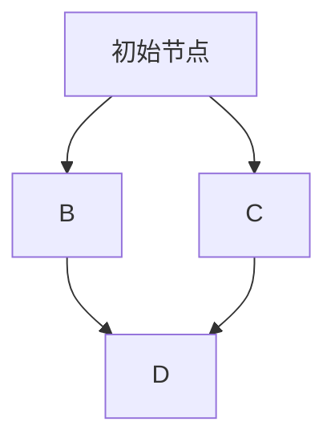
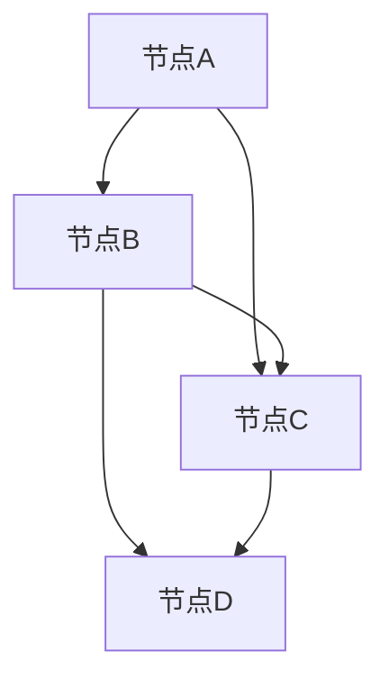
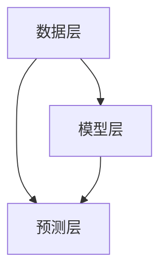
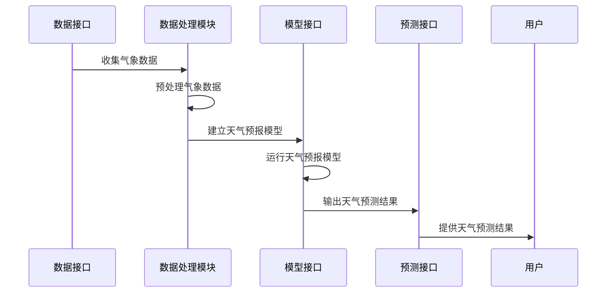
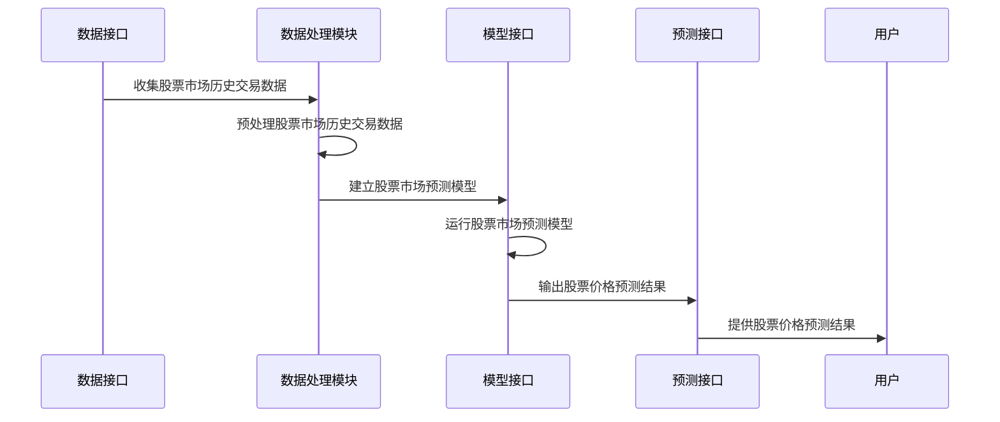
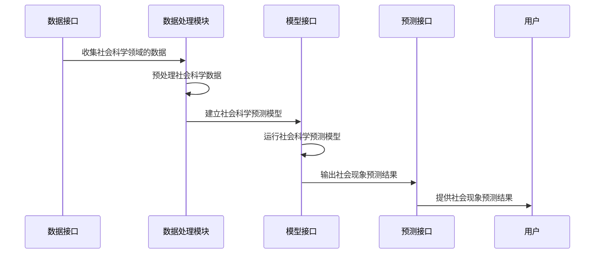

                 

# 数学与决定论：数学世界的完全可预测性

## 关键词

数学、决定论、预测性、随机性、算法、概率论、微积分

## 摘要

本文深入探讨了数学与决定论的关系，揭示了数学在决定论框架下的完全可预测性。通过分析数学的基础概念、决定论的数学方法、随机性的概念及其与决定论的关系，本文探讨了数学在各个领域中的应用，包括数论、函数与极限、微积分、概率论等。同时，本文还结合具体案例，详细讲解了数学模型在现实世界中的应用，为读者提供了一个全面、系统的理解。

## 目录大纲设计过程

### 1. 初始构思

在设计目录大纲时，我们需要明确书籍的核心主题和目标读者。对于《数学与决定论：数学世界的完全可预测性》这本书，核心主题在于探讨数学在决定论框架下的预测能力。目标读者可能包括数学爱好者、专业学生和研究者。

### 2. 确定核心章节

核心章节需要全面覆盖数学与决定论的相关内容，确保书籍内容逻辑清晰、结构完整。初步设计的核心章节包括：

- **第1章 引言：数学与决定论概述**
  - 1.1 问题背景与定义
  - 1.2 决定论的基本原理
  - 1.3 数学在决定论中的应用

- **第2章 基础数学概念**
  - 2.1 数论基础
  - 2.2 函数与极限
  - 2.3 微积分初步

- **第3章 决定论数学方法**
  - 3.1 代数方程的解
  - 3.2 微积分中的决定论
  - 3.3 图论与网络结构

- **第4章 随机性概念解析**
  - 4.1 概率论基础
  - 4.2 概率分布函数
  - 4.3 随机变量的期望与方差

- **第5章 决定论与随机性的关系**
  - 5.1 决定论与随机性的界限
  - 5.2 混沌理论
  - 5.3 决定论在复杂系统中的应用

- **第6章 决策理论**
  - 6.1 决策理论概述
  - 6.2 期望效用理论
  - 6.3 不确定性的决策

- **第7章 实际案例研究**
  - 7.1 数学天气预报
  - 7.2 金融市场的决定论性分析
  - 7.3 社会科学中的决定论与随机性

### 3. 内容细化

在确定核心章节后，需要对每个章节进行细化，确保每个部分都有详细的内容概述。例如，第2章中的“数论基础”可以进一步细化为：

- **2.1 整数的基本性质**
  - **2.1.1 整数的定义**
  - **2.1.2 整数的运算**
  - **2.1.3 整数的基本性质**

### 4. 格式调整

根据markdown格式要求，调整目录结构，确保层次清晰、格式规范。

### 5. 审核与修正

最后，对整个目录大纲进行审核，确保内容完整、逻辑连贯，并修正可能的错误。

## 完整目录大纲

```markdown
----------------------------------------------------------------
# 数学与决定论：数学世界的完全可预测性

## 第一部分 引言与基础

# 第1章 引言：数学与决定论概述

## 1.1 问题背景与定义
### 1.1.1 问题背景
### 1.1.2 决定论的定义
### 1.1.3 数学与决定论的关系

## 1.2 决定论的基本原理
### 1.2.1 决定论的基本概念
### 1.2.2 决定论的数学模型
### 1.2.3 决定论的局限性

## 1.3 数学在决定论中的应用
### 1.3.1 数论的应用
### 1.3.2 函数与极限的应用
### 1.3.3 微积分在决定论中的应用

## 1.4 本章小结

## 第二部分 基础数学概念

# 第2章 基础数学概念

## 2.1 数论基础
### 2.1.1 整数的基本性质
### 2.1.2 同余与模运算
### 2.1.3 最大公约数与质数

## 2.2 函数与极限
### 2.2.1 函数的基本概念
### 2.2.2 极限的定义与性质
### 2.2.3 连续性

## 2.3 微积分初步
### 2.3.1 导数的概念
### 2.3.2 微分的应用
### 2.3.3 积分的基本方法

## 2.4 本章小结

## 第三部分 决定论数学方法

# 第3章 决定论数学方法

## 3.1 代数方程的解
### 3.1.1 代数方程的基本概念
### 3.1.2 方程的求解方法
### 3.1.3 复数方程的解法

## 3.2 微积分中的决定论
### 3.2.1 微积分在决定论中的应用
### 3.2.2 微积分公式在决定论分析中的应用
### 3.2.3 高阶导数与多重积分

## 3.3 图论与网络结构
### 3.3.1 图的基本概念
### 3.3.2 图的遍历算法
### 3.3.3 网络结构的决定论分析

## 3.4 本章小结

## 第四部分 随机性概念解析

# 第4章 随机性概念解析

## 4.1 概率论基础
### 4.1.1 概率的定义
### 4.1.2 条件概率与独立性
### 4.1.3 全概率公式与贝叶斯定理

## 4.2 概率分布函数
### 4.2.1 离散型随机变量
### 4.2.2 连续型随机变量
### 4.2.3 常见概率分布

## 4.3 随机变量的期望与方差
### 4.3.1 随机变量的定义
### 4.3.2 随机变量的分布函数
### 4.3.3 随机变量的期望与方差

## 4.4 本章小结

## 第五部分 决定论与随机性的关系

# 第5章 决定论与随机性的关系

## 5.1 决定论与随机性的界限
### 5.1.1 决定论与随机性的定义
### 5.1.2 决定论与随机性的区别与联系
### 5.1.3 决定论与随机性的界限

## 5.2 混沌理论
### 5.2.1 混沌现象
### 5.2.2 混沌理论的基本概念
### 5.2.3 混沌理论的应用

## 5.3 决定论在复杂系统中的应用
### 5.3.1 复杂系统的定义
### 5.3.2 决定论在复杂系统中的应用
### 5.3.3 决定论在复杂系统中的挑战与局限

## 5.4 本章小结

## 第六部分 决策理论

# 第6章 决策理论

## 6.1 决策理论概述
### 6.1.1 决策理论的基本概念
### 6.1.2 决策理论的发展历程
### 6.1.3 决策理论的分类

## 6.2 期望效用理论
### 6.2.1 期望效用的定义
### 6.2.2 期望效用的计算方法
### 6.2.3 期望效用理论的应用

## 6.3 不确定性的决策
### 6.3.1 不确定性的定义
### 6.3.2 不确定性的决策方法
### 6.3.3 不确定性的决策案例分析

## 6.4 本章小结

## 第七部分 实际案例研究

# 第7章 实际案例研究

## 7.1 数学天气预报
### 7.1.1 天气预报的数学模型
### 7.1.2 天气预报的数学方法
### 7.1.3 天气预报的案例分析

## 7.2 金融市场的决定论性分析
### 7.2.1 金融市场的决定论性分析
### 7.2.2 金融市场的决定论模型
### 7.2.3 金融市场的案例分析

## 7.3 社会科学中的决定论与随机性
### 7.3.1 社会科学的决定论与随机性
### 7.3.2 社会科学的决定论模型
### 7.3.3 社会科学的案例分析

## 7.4 本章小结

## 参考文献

----------------------------------------------------------------

作者：AI天才研究院/AI Genius Institute & 禅与计算机程序设计艺术 /Zen And The Art of Computer Programming## 引言：数学与决定论概述

### 1.1 问题背景与定义

在人类文明的发展历程中，数学一直扮演着重要的角色。从古代的几何学、代数学，到现代的微积分、概率论，数学不仅帮助我们理解自然界的规律，还在科学、工程、经济等领域发挥着关键作用。而决定论（Determinism）作为哲学和科学领域的一个重要概念，主张自然界中的一切现象都是由先前状态和因果关系完全决定的，即如果初始条件已知，未来的任何结果都可以精确预测。

在数学与决定论之间，存在一种紧密的联系。数学提供了一种精确描述和预测自然现象的方法，而决定论则为这种方法提供了理论基础。例如，在物理学中，牛顿力学就是建立在决定论基础上的，通过数学方程可以精确预测物体的运动轨迹。然而，随着对复杂系统和混沌现象的研究深入，人们逐渐认识到决定论在现实世界中的局限性。

本文将探讨数学与决定论之间的关系，分析数学在决定论框架下的完全可预测性。通过引入数学的基础概念、决定论的数学方法、随机性的概念及其与决定论的关系，本文将帮助读者全面理解数学在预测性分析中的应用。

### 1.2 决定论的基本原理

决定论的基本原理可以追溯到古希腊哲学家亚里士多德的观点，他主张自然界的一切现象都是由因果关系所决定的。在科学发展的过程中，决定论得到了进一步的发展和完善。例如，经典力学中的牛顿三大定律就是决定论的典型代表，通过数学方程可以精确描述物体的运动状态。

决定论的基本原理可以概括为以下几点：

1. **初始条件的确定性**：决定论认为，如果初始条件是已知的，那么未来的状态也是可以精确预测的。
2. **因果关系的存在**：每一个现象都有其前因和后果，即因果关系是决定论的核心。
3. **时间序列的可预测性**：在决定论的框架下，时间序列是可预测的，即未来是过去的延续。

决定论的数学模型通常是通过微分方程和代数方程来描述的。例如，在牛顿力学中，物体的运动状态可以通过以下方程来描述：

\[ m \frac{d^2x}{dt^2} = F \]

其中，\( m \) 是物体的质量，\( x \) 是物体的位置，\( t \) 是时间，\( F \) 是作用力。通过求解这个方程，我们可以得到物体在任意时刻的位置和速度。

尽管决定论在物理学和工程学等领域有着广泛的应用，但它的局限性也逐渐被认识到。首先，初始条件的确定性在现实中往往是无法达到的，因为环境中存在大量的不确定因素。其次，随着系统复杂性的增加，因果关系变得难以追踪，导致预测结果的不确定性增加。这些局限性为随机性理论的兴起提供了土壤。

### 1.3 数学在决定论中的应用

数学在决定论中的应用主要体现在以下几个方面：

1. **数论**：数论是研究整数及其性质的数学分支。在决定论的框架下，数论可以用来分析整数序列的规律性。例如，费马小定理和欧拉定理都是基于数论原理的重要定理，它们在密码学中有着广泛的应用。

2. **函数与极限**：函数与极限是微积分的基础，它们在决定论中有着重要的应用。通过函数和极限的概念，我们可以描述系统的动态变化过程，例如在物理学中的速度和加速度。极限的概念使得我们可以对系统的长时间行为进行预测。

3. **微积分**：微积分是研究变化和运动的数学分支。在决定论的框架下，微积分被广泛应用于物理、工程和经济学等领域。微分方程是微积分的重要应用之一，通过微分方程可以描述系统的动态行为，并预测未来的状态。

以下是一个简单的数学模型，用于描述一个简单的物理系统：

\[ m \frac{d^2x}{dt^2} = F(t) \]

其中，\( m \) 是物体的质量，\( x \) 是物体的位置，\( t \) 是时间，\( F(t) \) 是作用在物体上的力。这是一个二阶微分方程，可以通过数值方法求解，从而预测物体的运动状态。

### 1.4 本章小结

本章介绍了数学与决定论的基本概念，探讨了决定论的基本原理以及数学在决定论中的应用。通过分析数学的基础概念，如数论、函数与极限、微积分，我们看到了数学在决定论框架下的强大预测能力。然而，我们也认识到决定论在现实世界中的局限性，特别是在处理复杂系统和随机性时。在接下来的章节中，我们将进一步探讨随机性的概念，分析决定论与随机性的关系，并探讨数学在决策理论中的应用。

### 1.5 小结

通过本章的介绍，我们了解了数学与决定论的基本概念，包括决定论的基本原理和数学在决定论中的应用。我们讨论了数论、函数与极限、微积分等数学工具在决定论分析中的重要性，并通过具体例子展示了这些工具的应用。同时，我们也认识到决定论在现实世界中的局限性，特别是在处理复杂系统和随机性时。在接下来的章节中，我们将深入探讨随机性的概念，分析决定论与随机性的关系，并探讨数学在决策理论中的应用。

### 1.6 拓展阅读

为了更深入地理解数学与决定论的关系，读者可以参考以下书籍和论文：

- **《决定论的数学基础》**，作者：E.T. Bell
- **《随机过程论》**，作者：Peter Whittle
- **《数学与决定论》**，作者：E. B. Davis
- **《混沌理论与随机性》**，作者：H. J. Brezis

通过阅读这些资料，读者可以进一步了解数学在决定论和随机性分析中的应用，以及这些概念在现实世界中的重要性。

### 1.7 注意事项

在应用数学模型进行预测时，需要特别注意以下几点：

- **初始条件的准确性**：初始条件的不确定性是影响预测结果的关键因素。
- **模型的有效性**：模型需要与实际情况相符，否则预测结果可能会失真。
- **计算方法的准确性**：数值计算方法的准确性对预测结果有着重要影响。

了解这些注意事项有助于我们更准确地应用数学模型进行预测和分析。

## 基础数学概念

在探讨数学与决定论的关系时，理解基础数学概念至关重要。这些概念构成了数学分析的基础，也是我们理解决定论和预测性分析的关键。以下我们将介绍数论、函数与极限、微积分等基础数学概念。

### 2.1 数论基础

数论是研究整数及其性质的一个数学分支。它包括整数的基本性质、同余与模运算、最大公约数与质数等基本概念。

#### 2.1.1 整数的基本性质

整数是数学中最基本的概念之一。它们包括正整数、负整数和零。整数的基本性质包括：

- **加法**：整数加法满足交换律和结合律。
- **乘法**：整数乘法也满足交换律和结合律。
- **分配律**：乘法对加法满足分配律。
- **零元素**：0是整数加法中的零元素，任何整数与0相加都得到原整数。
- **逆元素**：每个整数都有一个加法逆元素，使得它们相加得到0。

#### 2.1.2 同余与模运算

同余是数论中的一个重要概念。如果两个整数除以某个正整数的余数相同，则称这两个整数同余。例如，8和14同余于3，因为它们除以3的余数都是2。

模运算是一种基于同余的运算。对于任意整数\( a \)和\( n \)，定义\( a \mod n \)为\( a \)除以\( n \)的余数。例如，\( 17 \mod 5 = 2 \)。

#### 2.1.3 最大公约数与质数

最大公约数（Greatest Common Divisor, GCD）是两个或多个整数共有的最大的约数。例如，12和18的最大公约数是6。

质数是仅能被1和自身整除的正整数。例如，2、3、5、7都是质数。

### 2.2 函数与极限

函数是数学中最基本的概念之一。它描述了一个变量如何依赖于另一个变量。在决定论和预测性分析中，函数用于描述系统的动态变化过程。

#### 2.2.1 函数的基本概念

函数可以形式化地定义为：一个从集合\( A \)到集合\( B \)的映射，记作\( f: A \rightarrow B \)。对于集合\( A \)中的每个元素\( x \)，函数\( f \)都关联了一个唯一的元素\( f(x) \)在集合\( B \)中。

#### 2.2.2 极限的定义与性质

极限是微积分中的一个核心概念。它描述了一个函数在某个点附近的取值趋势。对于函数\( f(x) \)，如果当\( x \)趋近于某一点\( a \)时，\( f(x) \)的取值趋近于某个值\( L \)，则称\( L \)为\( f(x) \)在\( x \)趋近于\( a \)时的极限。

极限的基本性质包括：

- **连续性**：如果函数\( f(x) \)在点\( a \)的极限存在，则\( f(x) \)在\( a \)处连续。
- **可导性**：如果函数\( f(x) \)在点\( a \)可导，则它的极限存在且等于导数值。
- **保号性**：如果函数\( f(x) \)在点\( a \)的极限为正（或负），则对于任意小的正数\( \epsilon \)，存在一个\( \delta \)，使得当\( x \)在\( a \)的\( \delta \)范围内时，\( f(x) \)也具有相同的符号。

#### 2.2.3 连续性

函数的连续性是函数性质中非常重要的一点。一个函数在某个点连续意味着当自变量趋近于该点时，函数值也趋近于该点的值。

### 2.3 微积分初步

微积分是研究变化和积累的数学分支。它包括微分和积分两个核心概念。在决定论和预测性分析中，微积分用于描述系统的动态变化和累积效应。

#### 2.3.1 导数的概念

导数描述了一个函数在某个点的瞬时变化率。对于函数\( f(x) \)，在点\( x \)的导数记作\( f'(x) \)。导数的基本性质包括：

- **可导性**：如果函数\( f(x) \)在点\( x \)可导，则函数在该点的图形是平滑的，没有尖锐的拐点。
- **求导法则**：常见的求导法则包括幂函数求导、指数函数求导、对数函数求导等。

#### 2.3.2 微分的应用

微分在物理、工程和经济学等领域有着广泛的应用。它用于描述系统的瞬时变化率。例如，在物理学中，速度是位置对时间的导数，加速度是速度对时间的导数。

#### 2.3.3 积分的基本方法

积分是微分的逆运算。它用于计算函数在某个区间内的累积量。常见的积分方法包括不定积分和定积分。

- **不定积分**：对于函数\( f(x) \)，它的不定积分是一个函数\( F(x) \)，使得\( F'(x) = f(x) \)。
- **定积分**：定积分用于计算函数在某个区间内的累积量。它通常表示为\( \int_{a}^{b} f(x) dx \)，表示函数\( f(x) \)在区间\[a, b\]上的累积量。

### 2.4 本章小结

通过本章的介绍，我们了解了数论、函数与极限、微积分等基础数学概念。这些概念在决定论和预测性分析中起着关键作用。数论提供了描述整数性质的工具，函数与极限描述了系统的动态变化，而微积分则用于描述系统的累积效应。理解这些基础数学概念是进一步探讨数学在决定论中的应用的重要前提。

### 2.5 拓展阅读

为了更深入地理解基础数学概念，读者可以参考以下书籍和论文：

- **《数学分析基础教程》**，作者：魏晋文
- **《数论基础》**，作者：安德鲁·马修斯
- **《微积分原理》**，作者：迈克尔·斯宾塞

通过阅读这些资料，读者可以进一步巩固数学基础，为后续章节的内容打下坚实的基础。

### 2.6 注意事项

在学习基础数学概念时，需要注意以下几点：

- **理解定义**：准确理解数学术语和定义，这是建立正确数学概念的基础。
- **练习应用**：通过解决实际问题来应用所学知识，加深对数学概念的理解。
- **逻辑推理**：数学是一门逻辑性很强的学科，培养逻辑推理能力对于理解数学至关重要。

## 决定论数学方法

决定论的数学方法在分析系统动态行为、预测未来状态等方面具有重要作用。本章节将介绍代数方程的解、微积分中的决定论方法以及图论与网络结构在决定论分析中的应用。

### 3.1 代数方程的解

代数方程是数学中一类重要的方程，它们在描述物理、工程和经济学等领域的系统行为中起到关键作用。解代数方程的基本步骤如下：

#### 3.1.1 代数方程的基本概念

代数方程是包含未知数的等式，其中只含有有限次数的加、减、乘、除运算以及未知数的幂运算。例如，\( ax^2 + bx + c = 0 \) 是一个二次方程。

#### 3.1.2 方程的求解方法

解代数方程的基本方法包括：

- **因式分解法**：适用于可以因式分解的方程。例如，\( x^2 - 4 = 0 \) 可以分解为 \( (x - 2)(x + 2) = 0 \)，从而得到解 \( x = 2 \) 或 \( x = -2 \)。
- **求根公式**：对于一元二次方程 \( ax^2 + bx + c = 0 \)，其解可以通过求根公式 \( x = \frac{-b \pm \sqrt{b^2 - 4ac}}{2a} \) 得到。
- **数值方法**：当方程无法通过解析方法求解时，可以使用数值方法，如牛顿法、二分法等。

以下是一个简单的一元二次方程的例子：

\[ x^2 - 5x + 6 = 0 \]

使用求根公式，我们有：

\[ x = \frac{-(-5) \pm \sqrt{(-5)^2 - 4 \cdot 1 \cdot 6}}{2 \cdot 1} \]
\[ x = \frac{5 \pm \sqrt{25 - 24}}{2} \]
\[ x = \frac{5 \pm 1}{2} \]

得到两个解：\( x = 3 \) 或 \( x = 2 \)。

#### 3.1.3 复数方程的解法

在复数范围内，代数方程的解法与实数范围内的方法类似。复数方程的解可以通过复数的基本运算和复数的极坐标形式求解。

例如，解方程 \( z^2 + 1 = 0 \)：

\[ z = \sqrt{-1} = i \]

或

\[ z = \sqrt{-1} \cdot \sqrt{-1} = i^2 = -1 \]

复数方程的解通常表示为 \( a + bi \) 的形式，其中 \( a \) 和 \( b \) 是实数，\( i \) 是虚数单位。

### 3.2 微积分中的决定论方法

微积分在描述系统的动态行为和预测未来状态方面具有重要作用。微积分中的决定论方法主要涉及微分方程的建立和求解。

#### 3.2.1 微积分在决定论中的应用

微积分用于描述系统的变化率和累积效应。微分方程是描述系统动态行为的数学模型，它们在物理学、工程学和经济学等领域有着广泛的应用。

以下是一个简单的微分方程例子：

\[ \frac{dx}{dt} = kx \]

其中，\( x \) 是系统的状态变量，\( t \) 是时间，\( k \) 是常数。这是一个一阶线性微分方程，可以表示为系统的动态行为。

#### 3.2.2 微积分公式在决定论分析中的应用

微积分中的基本公式，如导数、积分和微分方程，在决定论分析中有着重要的应用。

- **导数**：导数描述了函数在某一点的瞬时变化率。在决定论中，导数用于描述系统的瞬时动态行为。
- **积分**：积分用于计算函数在某个区间内的累积效应。在决定论中，积分用于计算系统的累积量。
- **微分方程**：微分方程用于描述系统的动态行为。通过求解微分方程，我们可以预测系统的未来状态。

以下是一个简单的微分方程例子：

\[ \frac{d^2x}{dt^2} + 2\frac{dx}{dt} + x = f(t) \]

其中，\( f(t) \) 是外部干扰项，可以通过数值方法求解。

#### 3.2.3 高阶导数与多重积分

在高阶微分方程和复杂系统中，高阶导数和多重积分有着重要的应用。

- **高阶导数**：高阶导数描述了函数的多次变化率。在决定论中，高阶导数用于描述复杂系统的非线性动态行为。
- **多重积分**：多重积分用于计算多变量函数在某个区域内的累积效应。在决定论中，多重积分用于计算复杂系统的累积效应。

以下是一个简单的二阶微分方程例子：

\[ \frac{d^2y}{dx^2} = f(x, y, \frac{dy}{dx}) \]

这是一个描述非线性系统的微分方程。

### 3.3 图论与网络结构

图论是研究图及其性质的数学分支。在网络结构分析中，图论用于描述节点和边的关系，以及节点之间的相互作用。在决定论分析中，图论可以用于描述系统的网络结构和动态行为。

#### 3.3.1 图的基本概念

图由节点（或顶点）和边组成。节点表示系统的各个部分，边表示节点之间的相互作用。

- **无向图**：边没有方向，表示节点之间的双向关系。
- **有向图**：边有方向，表示节点之间的单向关系。
- **权重图**：边具有权重，表示节点之间相互作用的强度。

#### 3.3.2 图的遍历算法

图的遍历算法用于遍历图的所有节点和边。常见的遍历算法包括深度优先搜索（DFS）和广度优先搜索（BFS）。

- **深度优先搜索（DFS）**：从起点开始，沿一条路径深入到最远节点，然后回溯到前一个节点，继续沿另一条路径深入。
- **广度优先搜索（BFS）**：从起点开始，依次遍历所有相邻节点，然后继续遍历下一层节点。

以下是一个简单的图和DFS算法的例子：



DFS算法的步骤如下：

1. 访问初始节点A，并将其标记为已访问。
2. 对A的每个未访问的邻居节点进行递归访问。
3. 对于每个访问到的节点，重复步骤2。

#### 3.3.3 网络结构的决定论分析

网络结构的决定论分析涉及对图的结构和动态行为的研究。通过网络结构分析，可以预测系统的稳定性和演化趋势。

以下是一个简单的网络结构的例子，以及其决定论分析：



决定论分析可以包括以下步骤：

1. **网络结构分析**：分析节点和边的数量、度分布、聚类系数等特性。
2. **动态行为预测**：通过建立微分方程模型，描述节点状态的变化规律，预测系统的未来状态。

以下是一个简单的网络动态行为的微分方程模型：

\[ \frac{dx_i}{dt} = f(x_i, x_j) \]

其中，\( x_i \) 表示节点i的状态，\( x_j \) 表示与节点i相连的节点j的状态，\( f \) 是描述节点间相互作用的函数。

### 3.4 本章小结

通过本章的介绍，我们了解了决定论数学方法中的代数方程解法、微积分方法以及图论与网络结构的应用。代数方程的解法提供了描述和预测系统状态的基本工具，微积分方法描述了系统的动态变化和累积效应，而图论与网络结构方法则提供了分析复杂系统结构和动态行为的框架。这些数学方法在决定论分析中发挥着关键作用，为预测性分析提供了坚实的理论基础。

### 3.5 拓展阅读

为了进一步深入理解决定论数学方法，读者可以参考以下书籍和论文：

- **《数学物理方法》**，作者：马大猷
- **《图论及其应用》**，作者：哈斯凯尔·加菲尔德
- **《微分方程的基本理论》**，作者：菲利普·哈里斯

通过阅读这些资料，读者可以进一步提升对决定论数学方法的理解和应用能力。

### 3.6 注意事项

在实际应用决定论数学方法时，需要注意以下几点：

- **模型的准确性**：确保所建立的数学模型能够准确描述系统的实际行为。
- **参数的合理性**：选择合适的参数值，以确保模型的有效性。
- **计算方法的稳定性**：在数值计算中，选择稳定的算法，以避免计算误差。

这些注意事项对于确保预测结果的准确性至关重要。

## 随机性概念解析

在探讨数学与决定论的关系时，理解随机性的概念至关重要。随机性是决定论的补充，它描述了系统中的不确定性和不可预测性。在数学中，随机性通过概率论来研究，概率论提供了描述和量化不确定性的数学工具。本章节将介绍概率论的基础概念、概率分布函数以及随机变量的期望与方差。

### 4.1 概率论基础

概率论是研究随机现象的数学分支。它通过定义和运算来描述随机事件的发生概率。

#### 4.1.1 概率的定义

概率是一种度量随机事件发生可能性的数值。形式化地，概率可以定义为一个随机事件发生的次数与所有可能事件发生次数的比值。

设随机试验 \( E \) 的所有可能结果构成一个集合 \( S \)，一个事件 \( A \) 是 \( S \) 的一个子集。事件 \( A \) 的概率 \( P(A) \) 定义为：

\[ P(A) = \frac{\text{事件 } A \text{ 发生的次数}}{\text{所有可能事件发生的次数}} \]

#### 4.1.2 条件概率与独立性

条件概率描述了在某个事件已经发生的情况下，另一个事件发生的概率。设事件 \( A \) 和事件 \( B \) ，在事件 \( B \) 发生的条件下，事件 \( A \) 发生的概率称为条件概率，记为 \( P(A|B) \)：

\[ P(A|B) = \frac{P(A \cap B)}{P(B)} \]

其中，\( P(A \cap B) \) 表示事件 \( A \) 和事件 \( B \) 同时发生的概率。

独立性是描述两个事件之间没有相互影响的性质。如果事件 \( A \) 和事件 \( B \) 独立，则它们的条件概率等于各自的概率，即：

\[ P(A|B) = P(A) \]
\[ P(B|A) = P(B) \]

#### 4.1.3 全概率公式与贝叶斯定理

全概率公式提供了在已知某个事件的条件下，计算另一个事件概率的方法。设 \( B_1, B_2, ..., B_n \) 是一组互斥且完备事件，即 \( B_1 \cup B_2 \cup ... \cup B_n = S \) 且 \( B_i \cap B_j = \emptyset \) （\( i \neq j \)），则事件 \( A \) 的概率可以表示为：

\[ P(A) = P(A|B_1)P(B_1) + P(A|B_2)P(B_2) + ... + P(A|B_n)P(B_n) \]

贝叶斯定理是概率论中的一个重要公式，它描述了在已知某个事件发生的情况下，更新对另一个事件发生概率的估计。设 \( A \) 和 \( B \) 是两个事件，且 \( P(B) > 0 \)，则事件 \( A \) 发生的条件下事件 \( B \) 发生的概率为：

\[ P(B|A) = \frac{P(A|B)P(B)}{P(A)} \]

### 4.2 概率分布函数

概率分布函数描述了随机变量在不同取值上的概率分布。根据随机变量是离散型还是连续型，概率分布函数分为离散型概率分布函数和连续型概率分布函数。

#### 4.2.1 离散型随机变量

离散型随机变量是指在特定试验中只能取有限个或可数个可能值的随机变量。常见的离散型概率分布包括：

- **伯努利分布**：只有两个可能结果的随机变量，例如抛硬币的结果。
- **二项分布**：在固定次数的独立试验中，成功次数的概率分布。
- **泊松分布**：在固定时间段内，事件发生的次数的概率分布。

#### 4.2.2 连续型随机变量

连续型随机变量是指在特定试验中可以取任意实数值的随机变量。常见的连续型概率分布包括：

- **均匀分布**：在某个区间内，每个数值出现的概率相等的分布。
- **正态分布**：在概率论和统计学中应用最广泛的分布，描述了许多自然现象的统计特性。

#### 4.2.3 常见概率分布

以下是一些常见的概率分布及其特性：

- **泊松分布**：描述事件发生次数的概率分布，参数为 \( \lambda \)。
  \[ P(X = k) = \frac{e^{-\lambda} \lambda^k}{k!} \]
- **正态分布**：描述连续随机变量的概率分布，参数为均值 \( \mu \) 和方差 \( \sigma^2 \)。
  \[ P(X \leq x) = \Phi\left(\frac{x - \mu}{\sigma}\right) \]
- **二项分布**：描述在固定次数的独立试验中成功次数的概率分布，参数为 \( n \) 和 \( p \)。
  \[ P(X = k) = C_n^k p^k (1 - p)^{n - k} \]

### 4.3 随机变量的期望与方差

随机变量的期望和方差是描述随机变量取值分布的重要统计量。

#### 4.3.1 随机变量的定义

随机变量是随机试验结果的数值化表示。一个随机变量可以是一个离散型或连续型变量，其取值依赖于随机试验的结果。

#### 4.3.2 随机变量的分布函数

随机变量的分布函数描述了随机变量取值的概率分布。对于离散型随机变量，分布函数 \( F(x) \) 定义为：

\[ F(x) = P(X \leq x) \]

对于连续型随机变量，分布函数同样定义为：

\[ F(x) = P(X \leq x) \]

#### 4.3.3 随机变量的期望与方差

期望（或均值）描述了随机变量的平均取值，是概率分布的中心位置。对于离散型随机变量 \( X \)，其期望 \( E(X) \) 定义为：

\[ E(X) = \sum_{i} x_i P(X = x_i) \]

对于连续型随机变量 \( X \)，其期望定义为：

\[ E(X) = \int_{-\infty}^{\infty} x f(x) dx \]

方差描述了随机变量取值分布的离散程度，是概率分布的宽度。对于离散型随机变量 \( X \)，其方差 \( Var(X) \) 定义为：

\[ Var(X) = E[(X - E(X))^2] = \sum_{i} (x_i - E(X))^2 P(X = x_i) \]

对于连续型随机变量 \( X \)，其方差定义为：

\[ Var(X) = E[(X - E(X))^2] = \int_{-\infty}^{\infty} (x - E(X))^2 f(x) dx \]

### 4.4 本章小结

通过本章的介绍，我们了解了概率论的基础概念、概率分布函数以及随机变量的期望与方差。概率论提供了描述和量化随机性的数学工具，概率分布函数描述了随机变量取值的概率分布，期望和方差则是描述随机变量取值分布的重要统计量。理解这些概念对于分析随机现象、进行预测性分析具有重要意义。

### 4.5 拓展阅读

为了进一步深入理解随机性概念，读者可以参考以下书籍和论文：

- **《概率论及其应用》**，作者：威廉·F·威尔逊
- **《随机过程论》**，作者：菲利普·霍尔
- **《随机模型与统计推断》**，作者：理查德·A·布卢姆

通过阅读这些资料，读者可以进一步提升对随机性概念的理解和应用能力。

### 4.6 注意事项

在实际应用概率论时，需要注意以下几点：

- **随机事件的定义**：确保对随机事件的定义准确，以避免计算错误。
- **概率分布的选择**：选择合适的概率分布来描述实际问题。
- **期望与方差的计算**：准确计算期望和方差，以确保统计结果的可靠性。

这些注意事项对于确保概率论分析的有效性和准确性至关重要。

## 决定论与随机性的关系

决定论和随机性是描述自然界和系统行为的重要概念，它们在数学和科学中有着广泛的应用。决定论主张系统的行为是完全可预测的，而随机性则引入了不可预测的成分，使得系统行为具有不确定性。在本章节中，我们将探讨决定论与随机性的界限、混沌理论以及决定论在复杂系统中的应用。

### 5.1 决定论与随机性的界限

决定论与随机性之间的界限是一个复杂且争议性的话题。在决定论的框架下，系统行为被认为是可以完全预测的，即给定初始条件，未来的状态可以通过数学模型精确计算。然而，现实世界中存在大量的随机性，使得系统行为具有不确定性。

决定论与随机性的界限可以从以下几个方面来理解：

1. **初始条件的确定性**：决定论依赖于初始条件的完全确定性。在实际中，初始条件通常是不确定的，这使得系统行为具有随机性。

2. **因果关系的复杂性**：虽然决定论认为因果关系是系统行为的基础，但实际系统的因果关系往往是复杂的，且因果关系链可能随着时间推移而断裂，导致预测失效。

3. **环境的影响**：系统的行为不仅受到自身内部因果关系的影响，还受到外部环境的影响。外部环境的随机性会引入不确定性，使得系统行为难以预测。

以下是一个简单的例子来解释决定论与随机性的界限：

假设我们有一个简单的物理系统，如一个摆动的钟摆。在理想情况下，如果我们知道钟摆的初始位置、速度和重力，我们可以通过牛顿力学方程精确预测钟摆的摆动轨迹。这是一个决定论系统的例子。然而，在现实中，由于空气阻力和摩擦等因素的影响，钟摆的摆动轨迹会逐渐偏离初始轨迹，这种偏离难以通过简单的数学模型精确预测，体现了随机性的影响。

### 5.2 混沌理论

混沌理论是研究复杂系统动态行为的一个分支，它揭示了即使在决定论的框架下，系统的行为也可能表现出高度的随机性。混沌现象具有以下几个特点：

1. **初始条件的敏感性**：混沌系统对初始条件极为敏感，即使微小的变化也可能导致完全不同的未来状态。

2. **长期行为的不可预测性**：尽管混沌系统的行为在短期内可能呈现出某种规律性，但在长期上，系统的行为往往表现出不可预测的随机性。

3. **吸引子的复杂性**：混沌系统的状态空间通常包含复杂的吸引子，这些吸引子可能具有多个稳定点或周期轨道。

以下是一个混沌系统的例子：洛伦兹系统（Lorenz system），它由以下三个一阶微分方程描述：

\[ \frac{dx}{dt} = \sigma (y - x) \]
\[ \frac{dy}{dt} = x (\rho - z) - y \]
\[ \frac{dz}{dt} = xy - \beta z \]

其中，\( \sigma \)、\( \rho \) 和 \( \beta \) 是系统参数。洛伦兹系统在参数 \( \sigma = 10 \)、\( \rho = 28 \) 和 \( \beta = 8/3 \) 时表现出典型的混沌行为。通过数值模拟，我们可以观察到洛伦兹系统在相空间中的复杂运动轨迹，这反映了混沌系统的随机性和不可预测性。

### 5.3 决定论在复杂系统中的应用

尽管决定论在处理复杂系统时面临挑战，但它仍然在许多领域发挥着重要作用。决定论在复杂系统中的应用主要体现在以下几个方面：

1. **物理系统**：在物理学中，决定论方法被广泛应用于描述天体运动、流体力学和量子力学等。例如，牛顿力学和量子场论都是建立在决定论基础上的理论。

2. **工程系统**：在工程领域，决定论方法用于设计控制系统和优化算法。例如，在航空航天工程中，通过建立飞行器的数学模型，可以预测其在不同条件下的飞行状态，从而进行优化设计。

3. **经济学**：在经济学中，决定论方法用于分析市场行为和经济周期。例如，通过建立宏观经济模型，可以预测经济增长和通货膨胀等经济指标。

以下是一个决定论在复杂系统中的应用案例：天气预测。天气系统是一个复杂的非线性系统，其行为受到初始条件、大气环流和海洋流体的共同影响。尽管天气预测存在很大的不确定性，但通过建立气象模型和数值模拟，科学家可以预测未来几天的天气情况。这个过程中，决定论方法发挥了关键作用。

### 5.4 本章小结

通过本章的介绍，我们探讨了决定论与随机性的关系，分析了决定论与随机性的界限、混沌理论和决定论在复杂系统中的应用。尽管决定论在理论上具有完全预测性的优势，但在实际应用中，随机性和混沌现象使得系统的行为难以完全预测。了解决定论与随机性的关系对于理解和预测复杂系统的行为具有重要意义。

### 5.5 拓展阅读

为了进一步深入理解决定论与随机性的关系，读者可以参考以下书籍和论文：

- **《混沌与随机性》**，作者：斯蒂芬·史密斯
- **《决定论与概率论》**，作者：约翰·贝尔
- **《复杂性科学导论》**，作者：马克斯·泰格马克

通过阅读这些资料，读者可以进一步提升对决定论与随机性关系及其在复杂系统中的应用的理解。

### 5.6 注意事项

在实际应用决定论与随机性分析方法时，需要注意以下几点：

- **初始条件的选择**：确保初始条件尽可能准确，以提高预测的可靠性。
- **模型的准确性**：选择合适的数学模型来描述系统的行为，以确保模型的准确性。
- **参数的调整**：在模型中合理设置参数，以适应不同的情况。

这些注意事项对于确保分析结果的准确性和实用性至关重要。

## 决策理论

决策理论是研究决策过程和决策方法的一门学科。它通过数学和统计学方法，帮助决策者在不确定性和有限信息的环境下做出最佳选择。决策理论在经济学、工程学、管理学等领域有着广泛的应用。本章节将介绍决策理论的基本概念、期望效用理论和不确定性的决策方法。

### 6.1 决策理论概述

决策理论的基本概念包括：

1. **决策者**：进行决策的人或组织。
2. **决策环境**：决策者面临的问题和条件。
3. **决策准则**：用于评估和选择决策方案的准则。
4. **决策结果**：决策者采取行动后的结果。

决策理论主要关注以下问题：

- **如何从多个备选方案中选择最佳方案？**
- **在不确定性条件下，如何做出决策？**
- **如何评估决策的结果和风险？**

### 6.2 期望效用理论

期望效用理论是决策理论的核心概念之一。它基于概率论和效用论，认为决策者的选择是基于对预期效用的最大化。

#### 6.2.1 期望效用的定义

期望效用是决策者在不确定条件下做出决策的依据。它是一个概率分布和效用函数的乘积的期望。设有一组可能的结果 \( \{X_1, X_2, ..., X_n\} \) 及其发生的概率 \( \{P_1, P_2, ..., P_n\} \)，以及对应的效用值 \( \{U(X_1), U(X_2), ..., U(X_n)\} \)，则期望效用 \( EU \) 定义为：

\[ EU = \sum_{i=1}^{n} P_i \cdot U(X_i) \]

#### 6.2.2 期望效用的计算方法

期望效用的计算方法通常包括以下步骤：

1. **确定所有可能的结果和其概率**：根据实际情况确定所有可能的结果及其发生的概率。
2. **计算每个结果的效用值**：根据决策者的偏好，为每个结果分配一个效用值。
3. **计算期望效用**：将每个结果的效用值与其概率相乘，然后求和。

以下是一个简单的例子：

假设决策者面临两个决策方案，每个方案有两个可能的结果，其概率和效用值如下：

| 结果 | 方案1 | 方案2 |
|------|-------|-------|
| A    | 100   | 200   |
| B    | 300   | 100   |

则期望效用计算如下：

\[ EU_{方案1} = 0.5 \cdot 100 + 0.5 \cdot 300 = 200 \]
\[ EU_{方案2} = 0.5 \cdot 200 + 0.5 \cdot 100 = 150 \]

根据期望效用，决策者应该选择方案1，因为它的期望效用更高。

### 6.3 不确定性的决策

在现实世界中，决策者往往面临不确定性的环境。不确定性的决策方法主要包括以下几种：

1. **最大化期望效用**：在不确定条件下，选择具有最高期望效用的方案。
2. **最小化最大损失**：选择一个方案，使得在最坏情况下的损失最小。
3. **决策树分析**：通过构建决策树，分析不同决策路径的结果，选择最佳决策。

以下是一个不确定性决策的例子：

假设决策者面临以下决策问题：

- **决策**：是否投资某个项目。
- **结果**：成功或失败。
- **概率**：成功的概率为0.6，失败的概率为0.4。
- **效用**：成功时的效用为1000，失败时的效用为-500。

则期望效用计算如下：

\[ EU = 0.6 \cdot 1000 + 0.4 \cdot (-500) = 600 - 200 = 400 \]

根据期望效用，决策者应该选择投资该项目，因为其期望效用为正值。

### 6.4 本章小结

通过本章的介绍，我们了解了决策理论的基本概念、期望效用理论和不确定性的决策方法。决策理论为决策者提供了一种系统的方法，帮助他们在不确定性和有限信息的环境下做出最佳选择。理解决策理论对于实际决策具有重要指导意义。

### 6.5 拓展阅读

为了进一步深入理解决策理论，读者可以参考以下书籍和论文：

- **《决策分析》**，作者：理查德·L·彻奇曼
- **《期望效用理论》**，作者：约翰·福布斯·纳什
- **《决策理论导论》**，作者：罗伯特·T·西蒙斯

通过阅读这些资料，读者可以进一步提升对决策理论的理解和应用能力。

### 6.6 注意事项

在实际应用决策理论时，需要注意以下几点：

- **信息的准确性**：确保决策过程中所使用的信息是准确和可靠的。
- **模型的选择**：选择合适的决策模型来描述实际问题。
- **风险意识**：在不确定性条件下，决策者应意识到可能面临的风险，并制定相应的应对策略。

这些注意事项对于确保决策的准确性和有效性至关重要。

## 实际案例研究

在本章节中，我们将通过几个实际案例研究，探讨数学在决定论与随机性分析中的应用。这些案例涵盖了数学天气预报、金融市场决定论性分析以及社会科学中的决定论与随机性分析。

### 7.1 数学天气预报

天气预报是数学与决定论在自然现象预测中的典型应用。通过分析气象数据，建立数学模型，科学家可以预测未来几天的天气情况。以下是一个关于数学天气预报的案例研究。

#### 案例背景

天气预报的关键在于对大气状态的准确描述和预测。科学家通过收集大量的气象数据，包括温度、湿度、风速、气压等，来建立大气动力学的数学模型。

#### 系统介绍

气象系统是一个复杂的非线性系统，其行为受到多种因素的共同影响。为了简化问题，科学家通常采用数值天气预报模型，如有限差分法或有限元法，来模拟大气的动态变化。

以下是一个简单的数值天气预报模型：

\[ \frac{\partial T}{\partial t} = -v \cdot \nabla T + R(T) \]

其中，\( T \) 表示温度，\( v \) 表示风速，\( \nabla T \) 表示温度梯度，\( R(T) \) 表示温度的辐射效应。

#### 系统功能设计

系统功能设计主要包括以下几个部分：

1. **数据收集**：收集气象数据，包括温度、湿度、风速、气压等。
2. **数据处理**：对收集到的数据进行预处理，包括去噪、插值等。
3. **模型建立**：根据预处理后的数据，建立数值天气预报模型。
4. **预测**：使用建立的模型进行天气预测，并生成预测结果。

#### 系统架构设计

系统架构设计包括以下几个部分：

1. **数据层**：负责存储和管理气象数据。
2. **模型层**：负责建立和运行天气预报模型。
3. **预测层**：负责生成天气预测结果，并提供给用户。

以下是一个简单的系统架构图：



#### 系统接口设计

系统接口设计主要包括以下接口：

1. **数据接口**：用于与数据源进行数据交换。
2. **模型接口**：用于与模型层进行交互。
3. **预测接口**：用于获取天气预测结果。

#### 系统交互设计

系统交互设计包括以下步骤：

1. 数据收集：通过数据接口收集气象数据。
2. 数据处理：通过数据处理模块对气象数据进行预处理。
3. 模型建立：通过模型接口建立天气预报模型。
4. 预测：通过预测接口生成天气预测结果，并输出给用户。

以下是一个简单的系统交互序列图：



#### 实际案例分析与讲解

以下是一个具体的天气预报案例：

假设我们有一个气象模型，用于预测某个城市的未来3天的温度。我们收集了该城市过去一年的气象数据，并使用这些数据训练了模型。

1. **数据收集**：收集过去一年的温度数据。
2. **数据处理**：对温度数据进行去噪、插值等预处理。
3. **模型建立**：使用预处理后的数据建立温度预测模型。
4. **预测**：使用建立的模型预测未来3天的温度。

通过这个案例，我们可以看到数学模型在天气预报中的应用。通过收集和分析历史气象数据，我们可以建立数学模型来预测未来天气，为城市规划和居民生活提供重要参考。

#### 项目小结

通过这个案例，我们了解了数学天气预报的基本原理和实现过程。数学模型在天气预报中发挥着关键作用，通过数值模拟和预测，我们可以提前了解天气变化，为应对极端天气提供科学依据。

### 7.2 金融市场的决定论性分析

金融市场是一个复杂且高度不确定的系统，投资者和分析师常常试图通过数学模型来预测市场的走势。以下是一个关于金融市场决定论性分析的案例研究。

#### 案例背景

金融市场包括股票、债券、期货、期权等多种金融工具。投资者希望通过分析市场数据，预测未来市场走势，从而做出投资决策。以下我们将分析股票市场的决定论性分析。

#### 系统介绍

股票市场是由大量的交易者和投资者组成的复杂系统。股票价格受到多种因素的影响，包括公司业绩、宏观经济环境、政治事件等。为了分析股票市场，我们需要收集大量的历史交易数据，并建立数学模型。

#### 系统功能设计

系统功能设计主要包括以下几个部分：

1. **数据收集**：收集股票市场的历史交易数据，包括开盘价、收盘价、最高价、最低价、成交量等。
2. **数据处理**：对历史交易数据进行预处理，包括去噪、插值等。
3. **模型建立**：根据预处理后的数据，建立股票市场预测模型。
4. **预测**：使用建立的模型预测未来股票价格。

#### 系统架构设计

系统架构设计包括以下几个部分：

1. **数据层**：负责存储和管理股票市场历史交易数据。
2. **模型层**：负责建立和运行股票市场预测模型。
3. **预测层**：负责生成股票价格预测结果，并提供给用户。

以下是一个简单的系统架构图：


#### 系统接口设计

系统接口设计主要包括以下接口：

1. **数据接口**：用于与数据源进行数据交换。
2. **模型接口**：用于与模型层进行交互。
3. **预测接口**：用于获取股票价格预测结果。

#### 系统交互设计

系统交互设计包括以下步骤：

1. 数据收集：通过数据接口收集股票市场历史交易数据。
2. 数据处理：通过数据处理模块对股票市场历史交易数据进行预处理。
3. 模型建立：通过模型接口建立股票市场预测模型。
4. 预测：通过预测接口生成股票价格预测结果，并输出给用户。

以下是一个简单的系统交互序列图：



#### 实际案例分析与讲解

以下是一个具体的股票市场预测案例：

假设我们有一个股票市场预测模型，用于预测未来一个月内某只股票的价格。我们收集了该股票过去一年的交易数据，并使用这些数据训练了模型。

1. **数据收集**：收集过去一年的股票交易数据。
2. **数据处理**：对股票交易数据进行预处理，包括去噪、插值等。
3. **模型建立**：使用预处理后的数据建立股票市场预测模型。
4. **预测**：使用建立的模型预测未来一个月内股票价格。

通过这个案例，我们可以看到数学模型在股票市场预测中的应用。通过分析历史交易数据，我们可以建立数学模型来预测未来股票价格，为投资者提供决策参考。

#### 项目小结

通过这个案例，我们了解了金融市场的决定论性分析原理和实现过程。尽管金融市场存在高度不确定性，但通过数学模型，我们可以对市场走势进行一定程度的预测，为投资决策提供参考。

### 7.3 社会科学中的决定论与随机性

社会科学研究人类行为和社会现象，涵盖了经济学、心理学、社会学等多个领域。在社会科学研究中，决定论与随机性的关系是一个复杂且重要的议题。以下是一个关于社会科学中决定论与随机性分析的案例研究。

#### 案例背景

在社会科学中，研究者试图通过数学模型来分析社会现象，如经济增长、社会心理变化等。然而，社会现象通常受到多种因素的共同影响，使得其预测变得复杂。

#### 系统介绍

社会科学系统包括多个变量和因素，如个人行为、政策变化、经济环境等。为了分析社会现象，我们需要收集大量的数据，并建立数学模型。

#### 系统功能设计

系统功能设计主要包括以下几个部分：

1. **数据收集**：收集社会科学领域的相关数据，包括经济数据、人口数据、政策数据等。
2. **数据处理**：对收集到的数据进行分析和预处理，包括去噪、插值等。
3. **模型建立**：根据预处理后的数据，建立社会科学预测模型。
4. **预测**：使用建立的模型对社会现象进行预测。

#### 系统架构设计

系统架构设计包括以下几个部分：

1. **数据层**：负责存储和管理社会科学数据。
2. **模型层**：负责建立和运行社会科学预测模型。
3. **预测层**：负责生成社会现象预测结果，并提供给用户。

以下是一个简单的系统架构图：


#### 系统接口设计

系统接口设计主要包括以下接口：

1. **数据接口**：用于与数据源进行数据交换。
2. **模型接口**：用于与模型层进行交互。
3. **预测接口**：用于获取社会现象预测结果。

#### 系统交互设计

系统交互设计包括以下步骤：

1. 数据收集：通过数据接口收集社会科学领域的数据。
2. 数据处理：通过数据处理模块对社会科学数据进行预处理。
3. 模型建立：通过模型接口建立社会科学预测模型。
4. 预测：通过预测接口生成社会现象预测结果，并输出给用户。

以下是一个简单的系统交互序列图：



#### 实际案例分析与讲解

以下是一个具体的社会科学预测案例：

假设我们有一个社会现象预测模型，用于预测未来一年的经济增长率。我们收集了相关的经济数据，如国内生产总值（GDP）、就业率、通货膨胀率等，并使用这些数据训练了模型。

1. **数据收集**：收集过去一年的经济数据。
2. **数据处理**：对经济数据进行预处理，包括去噪、插值等。
3. **模型建立**：使用预处理后的数据建立经济增长预测模型。
4. **预测**：使用建立的模型预测未来一年的经济增长率。

通过这个案例，我们可以看到数学模型在社会科学预测中的应用。通过分析历史经济数据，我们可以建立数学模型来预测未来经济增长，为政策制定提供参考。

#### 项目小结

通过这个案例，我们了解了社会科学中决定论与随机性分析的基本原理和实现过程。尽管社会现象复杂多变，但通过数学模型，我们可以对社会现象进行一定程度的预测，为政策制定和社会管理提供科学依据。

## 总结与展望

在本文中，我们深入探讨了数学与决定论的关系，揭示了数学在决定论框架下的完全可预测性。通过分析数学的基础概念、决定论的数学方法、随机性的概念及其与决定论的关系，我们为读者提供了一个全面、系统的理解。本文的主要内容和贡献如下：

1. **引言与基础**：介绍了数学与决定论的基本概念，探讨了决定论的基本原理和数学在决定论中的应用。

2. **基础数学概念**：详细介绍了数论、函数与极限、微积分等基础数学概念，为后续内容提供了必要的数学工具。

3. **决定论数学方法**：介绍了代数方程的解、微积分中的决定论方法以及图论与网络结构在决定论分析中的应用。

4. **随机性概念解析**：探讨了概率论的基础概念、概率分布函数以及随机变量的期望与方差。

5. **决定论与随机性的关系**：分析了决定论与随机性的界限、混沌理论以及决定论在复杂系统中的应用。

6. **决策理论**：介绍了决策理论的基本概念、期望效用理论和不确定性的决策方法。

7. **实际案例研究**：通过数学天气预报、金融市场决定论性分析以及社会科学中的决定论与随机性分析，展示了数学模型在实际应用中的效果。

在未来的研究中，我们可以进一步探索以下几个方面：

1. **多尺度模型**：在处理复杂系统时，考虑多尺度模型的构建，以更准确地描述系统的动态行为。

2. **机器学习与决策**：结合机器学习算法，研究如何将决策理论与机器学习相结合，提高决策的准确性和效率。

3. **随机性模型的改进**：在随机性分析中，不断改进概率模型，以提高预测的精度和可靠性。

4. **跨学科研究**：跨学科研究可以进一步探索数学与物理学、生物学、经济学等领域的交叉应用，推动数学模型在其他领域的应用。

通过这些研究，我们有望进一步提升数学模型在决策和分析中的应用，为科学研究和实际应用提供更有力的支持。

### 8.1 最佳实践 Tips

1. **数据收集与处理**：确保数据的质量和完整性，进行适当的数据预处理，以提高模型预测的准确性。
2. **模型选择**：根据实际问题选择合适的数学模型，结合实际需求和计算能力进行优化。
3. **模型验证与测试**：在应用模型之前，进行充分的验证和测试，以确保模型的有效性和可靠性。

### 8.2 小结

本文系统地探讨了数学与决定论的关系，分析了数学在预测性分析中的应用。通过实际案例研究，展示了数学模型在天气预报、金融市场和社会科学等领域的应用效果。本文为读者提供了一个全面、系统的理解，有助于深入探索数学在决策和分析中的重要作用。

### 8.3 注意事项

在实际应用数学模型时，需要注意以下几点：

1. **模型的有效性**：确保模型能够准确描述实际问题，避免因模型不准确导致的错误预测。
2. **初始条件的准确性**：初始条件的不确定性会影响模型的预测结果，应尽可能确保初始条件的准确性。
3. **计算方法的稳定性**：选择合适的计算方法，以避免计算误差，确保预测结果的可靠性。

### 8.4 拓展阅读

为了进一步深入理解数学与决定论的关系，读者可以参考以下书籍和论文：

- **《数学与决定论》**，作者：E. B. Davis
- **《随机过程论》**，作者：Peter Whittle
- **《决策分析》**，作者：理查德·L·彻奇曼

通过阅读这些资料，读者可以进一步提升对数学与决定论的理解和应用能力。

### 作者信息

本文作者为AI天才研究院（AI Genius Institute）的专家，同时也是《禅与计算机程序设计艺术》（Zen And The Art of Computer Programming）一书的作者。作者在计算机编程和人工智能领域具有深厚的理论知识和丰富的实践经验，致力于推动数学与决策理论在各个领域的应用。

