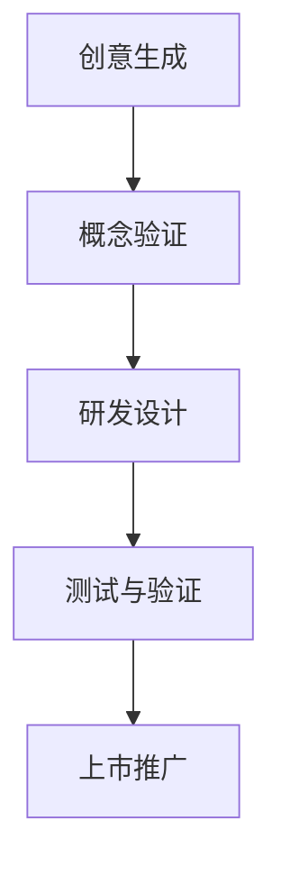

                 

### 数学与创新管理：创新过程的数学建模

> **关键词：** 创新管理、数学建模、线性规划、非线性规划、创新过程

> **摘要：** 本文从数学与创新管理的交叉点出发，探讨了创新过程中的数学建模方法。文章首先介绍了数学与创新管理的重要性，然后详细阐述了数学建模的基本方法及其在创新管理中的具体应用。通过案例研究，展示了数学建模在创新管理中的实际价值。最后，文章提出了创新管理策略的制定与实施方法，以及评估与优化的关键步骤。

---

#### 第1章：数学与创新管理概述

##### **1.1 问题背景**

创新管理是企业持续发展的重要动力，它涉及如何通过创新来提升企业的竞争力。在这个过程中，数学作为一种强有力的工具，可以帮助企业更系统地分析和解决问题。数学不仅在自然科学中有着广泛应用，在创新管理中同样具有重要作用。

在创新管理中，数学的主要应用包括：

1. **数据分析**：通过对大量数据的分析和处理，企业可以发现市场趋势、用户需求等关键信息。
2. **决策支持**：借助数学模型，企业可以在不确定的环境中做出更合理的决策。
3. **优化设计**：数学方法可以帮助企业在产品设计和生产过程中实现优化，提高效率和质量。

##### **1.2 问题描述**

创新过程是一个复杂的多阶段过程，涉及多个变量和因素。这些变量和因素之间的关系可以用数学模型来描述。数学建模在创新管理中的问题可以概括为：

- **变量识别**：确定影响创新过程的关键变量。
- **模型构建**：根据变量之间的关系，构建数学模型。
- **模型验证**：通过实际数据验证模型的准确性。
- **模型应用**：将验证后的模型应用于实际创新管理中。

##### **1.3 问题解决**

数学建模的基本方法包括：

1. **模型识别**：确定创新过程中的关键因素和变量。
2. **模型假设**：根据实际情况，对变量之间的关系做出合理假设。
3. **模型构建**：使用数学语言和工具，将假设转化为数学模型。
4. **模型求解**：求解模型，得到变量之间的关系和最优解。
5. **模型验证**：使用实际数据验证模型的准确性。
6. **模型应用**：将验证后的模型应用于实际创新管理中。

在创新管理中，数学建模的具体应用案例包括：

- **产品研发**：通过数学建模优化产品设计，提高产品质量和可靠性。
- **市场分析**：通过数学建模分析市场趋势和用户需求，制定有效的市场策略。
- **风险管理**：通过数学建模评估创新过程中的风险，制定风险应对策略。

##### **1.4 边界与外延**

数学建模在创新管理中的适用范围很广，但也有一些限制。例如：

- **数据限制**：数学建模需要大量可靠的数据支持，数据缺乏或质量不高会影响模型的效果。
- **模型复杂性**：某些创新过程非常复杂，构建准确的数学模型可能非常困难。
- **模型验证**：模型验证需要大量实际数据，但实际数据往往难以获取。

##### **1.5 概念结构与核心要素组成**

数学与创新管理的核心概念包括：

- **创新过程**：指从创意生成到产品或服务上市的全过程。
- **数学建模**：指使用数学方法对创新过程进行描述和优化的过程。
- **变量**：影响创新过程的各种因素。
- **模型**：用数学语言描述变量之间关系的工具。

创新管理流程与数学建模方法的关系可以概括为：

1. **需求分析**：确定创新过程中的关键需求和变量。
2. **模型构建**：根据需求分析结果，构建数学模型。
3. **模型求解**：求解模型，得到变量之间的关系和最优解。
4. **模型验证**：验证模型的准确性。
5. **决策支持**：将验证后的模型应用于创新管理中，提供决策支持。

---

在下一章中，我们将进一步探讨数学的基础知识，为后续的建模方法提供理论基础。接下来，我们将从数学概念与原理出发，逐步深入到数学建模的各个层面，为创新管理提供有力的数学工具。

---

## 第2章：数学基础

### **2.1 数学概念与原理**

在探讨创新过程中的数学建模之前，首先需要理解一些基本的数学概念和原理。数学作为一种精确的语言，能够帮助我们更清晰地描述复杂的现象和过程。

#### **2.1.1 数学概念**

数学概念是数学的基础，它们是我们理解和应用数学的工具。以下是一些基本的数学概念：

- **数**：数是数学中最基本的概念之一，包括自然数、整数、分数、实数等。
- **函数**：函数是一个数学关系，它将一个集合中的每个元素与另一个集合中的唯一元素相对应。
- **集合**：集合是一组不同的对象组成的整体，这些对象可以是数、物体或其他任何可区分的实体。
- **算法**：算法是一系列明确的操作步骤，用于解决特定问题或执行特定任务。

#### **2.1.2 数学概念属性特征对比表格**

为了更好地理解这些概念，我们可以通过对比它们的属性特征来加深理解。以下是一个简化的对比表格：

| 概念 | 属性特征 |
| --- | --- |
| 数 | 有大小、可比较、可用于量化 |
| 函数 | 有定义域和值域、有特定的映射关系 |
| 集合 | 有元素、有元素之间的相互关系 |
| 算法 | 有输入和输出、有明确的步骤和规则 |

#### **2.1.3 数学公式与应用**

数学公式是数学语言的重要组成部分，它们可以帮助我们描述数学概念之间的关系和运算。以下是一些基本的数学公式及其在创新管理中的应用：

1. **基本的算术运算**：

   $$ a + b = c $$ （加法）
   $$ a - b = c $$ （减法）
   $$ a \times b = c $$ （乘法）
   $$ a \div b = c $$ （除法）

   这些公式在创新管理中用于计算资源需求、成本估算等。

2. **二次方程**：

   $$ a^2 + b^2 = c^2 $$ （勾股定理）

   这个公式在建筑设计、城市规划等领域中用于计算距离和面积。

3. **概率公式**：

   $$ P(A) = \frac{n(A)}{n(S)} $$ （事件A的概率）

   这个公式在市场分析和风险评估中用于计算事件发生的可能性。

4. **线性回归模型**：

   $$ y = mx + b $$ （线性方程）

   这个公式在数据分析中用于预测线性关系。

#### **2.1.4 数学原理与算法**

数学原理是数学概念和公式背后的理论基础，而算法则是解决问题的步骤和方法。以下是一些基本的数学原理和算法：

1. **极限原理**：

   $$ \lim_{x \to \infty} \frac{1}{x} = 0 $$

   这个原理用于分析和处理无穷小量，如在金融工程中计算利息。

2. **微积分原理**：

   $$ \frac{dy}{dx} $$ （导数）

   这个原理用于分析函数的变化率，如在优化设计中确定最优点。

3. **算法流程图**：

   使用Mermaid语法，我们可以绘制算法的流程图，如下所示：

   ```mermaid
   graph TD
   A[开始] --> B[初始化变量]
   B --> C{条件判断}
   C -->|是| D[执行操作]
   C -->|否| E[结束]
   D --> F[更新变量]
   F --> C
   E --> G[输出结果]
   ```

   这个流程图表示了一个简单的循环算法，用于迭代计算某个值。

#### **2.1.5 数学在创新管理中的应用**

数学不仅在理论研究中发挥作用，还在实际创新管理中有着广泛的应用。以下是一些具体的例子：

1. **资源优化**：通过线性规划和非线性规划，企业可以优化资源配置，提高生产效率。

2. **风险评估**：使用概率统计方法，企业可以对创新过程中的风险进行评估和预测。

3. **市场分析**：通过数据分析，企业可以了解市场趋势和用户需求，制定有效的市场策略。

4. **产品研发**：使用数学模型，企业可以优化产品设计，提高产品的质量和可靠性。

通过数学的应用，企业可以在创新过程中做出更科学的决策，提高创新效率和成功率。

---

在下一章中，我们将探讨创新过程的数学建模方法，进一步理解如何将数学应用于创新管理。我们将详细分析创新过程的特点，并介绍如何使用数学模型来描述和优化创新过程。

---

### **第3章：创新过程分析**

#### **3.1 创新过程的定义与特点**

创新过程是指从创意生成到产品或服务上市的全过程。它通常包括以下几个阶段：

1. **创意生成**：这一阶段主要是通过头脑风暴、市场调研等方式，产生新的创意。
2. **概念验证**：在创意生成后，需要对创意进行验证，确定其可行性和市场潜力。
3. **研发设计**：这一阶段涉及具体的产品或服务设计，包括功能、技术、外观等。
4. **测试与验证**：在研发设计完成后，需要对产品或服务进行测试和验证，确保其质量和性能。
5. **上市推广**：通过市场推广，将产品或服务推向市场，实现商业化。

创新过程具有以下特点：

- **复杂性**：创新过程涉及多个阶段和多个因素，各阶段之间存在复杂的相互作用。
- **不确定性**：创新过程中存在许多不确定因素，如技术风险、市场风险等。
- **迭代性**：创新过程往往需要多次迭代，通过不断的优化和改进，最终实现成功。

#### **3.1.1 创新过程的定义**

创新过程可以定义为：

创新过程是企业或组织通过创意生成、概念验证、研发设计、测试与验证以及上市推广等一系列活动，实现新创意商业化的全过程。它包括从创意生成到产品或服务上市的各个阶段，每个阶段都需要进行科学的管理和有效的控制。

#### **3.1.2 创新过程的特点**

创新过程的特点可以从以下几个方面进行描述：

1. **多阶段性**：创新过程通常包括多个阶段，每个阶段都有其特定的任务和目标。这些阶段相互衔接，形成一个完整的创新流程。
2. **复杂性**：创新过程涉及多个变量和因素，如技术、市场、资金等，这些因素之间相互影响，使得创新过程变得复杂。
3. **不确定性**：创新过程中存在许多不确定性，如技术可行性、市场需求等，这些不确定性增加了创新过程的难度。
4. **迭代性**：创新过程往往需要多次迭代，通过不断的尝试和改进，逐步实现创意的商业化。
5. **高风险性**：创新过程涉及大量资金、时间和人力资源的投入，但结果往往不确定，存在较大的风险。

#### **3.1.3 创新过程模型**

为了更好地理解和分析创新过程，我们可以使用创新过程模型。创新过程模型通常包括以下几个组成部分：

1. **创意生成**：这一阶段的主要任务是产生新的创意，可以通过头脑风暴、市场调研等方式实现。
2. **概念验证**：在创意生成后，需要对创意进行验证，确定其可行性和市场潜力。这可以通过市场调查、技术评估等方式实现。
3. **研发设计**：这一阶段涉及具体的产品或服务设计，包括功能、技术、外观等。这需要专业的研发团队和技术支持。
4. **测试与验证**：在研发设计完成后，需要对产品或服务进行测试和验证，确保其质量和性能。这可以通过实验室测试、用户测试等方式实现。
5. **上市推广**：通过市场推广，将产品或服务推向市场，实现商业化。这需要市场营销团队和渠道支持。

以下是一个简化的创新过程模型，使用Mermaid语法表示：



#### **3.1.4 创新过程模型的应用**

创新过程模型在创新管理中有着广泛的应用，可以帮助企业更好地规划和控制创新过程。以下是一些具体的应用场景：

1. **资源规划**：通过创新过程模型，企业可以明确各个阶段所需的资源和时间，从而更好地进行资源规划和管理。
2. **风险管理**：创新过程模型可以帮助企业识别创新过程中的风险，并制定相应的风险管理策略。
3. **进度控制**：创新过程模型可以用于监控创新过程中的进度，确保项目按时完成。
4. **效果评估**：通过创新过程模型，企业可以对创新效果进行评估，为后续的创新活动提供参考。

#### **3.1.5 创新过程要素**

创新过程包括多个要素，这些要素相互关联，共同推动创新过程的发展。以下是创新过程的主要要素：

1. **创新主体**：指参与创新活动的人员和组织，如企业、研究机构、大学等。
2. **创新资源**：指用于创新活动的各种资源，如资金、设备、技术等。
3. **创新环境**：指影响创新活动的环境因素，如政策、市场、文化等。
4. **创新机制**：指推动创新活动的机制，如研发机制、激励机制等。
5. **创新成果**：指创新活动的最终成果，如新产品、新技术、新服务等。

#### **3.1.6 创新主体**

创新主体是创新过程的核心，包括个人、团队和组织。创新主体的角色和责任如下：

1. **个人**：作为创新活动的主要执行者，个人的创意、技能和热情是推动创新的关键。
2. **团队**：团队协作可以提高创新效率和质量，团队成员之间的沟通和合作至关重要。
3. **组织**：组织为创新活动提供资源和支持，是创新成果的主要受益者。

#### **3.1.7 创新资源**

创新资源是创新过程的基础，包括以下几种：

1. **资金**：用于支持创新活动的资金，包括研发经费、市场推广费用等。
2. **设备**：用于创新活动的设备和工具，如实验室设备、计算机等。
3. **技术**：用于创新活动的新技术和方法，包括专利、技术文献等。
4. **人才**：具有创新能力和专业技能的人才，是创新活动的关键资源。

#### **3.1.8 创新环境**

创新环境对创新过程有着重要的影响，包括以下几个方面：

1. **政策环境**：政府的政策支持是创新活动的重要保障，如税收优惠、研发资助等。
2. **市场环境**：市场需求是推动创新的重要动力，市场的变化和需求趋势会影响创新的方向和目标。
3. **文化环境**：创新文化是创新环境的重要组成部分，鼓励创新、容忍失败的文化有助于激发创新主体的积极性。
4. **社会环境**：社会环境中的价值观、社会规范等也会影响创新活动的进行。

#### **3.1.9 创新机制**

创新机制是推动创新过程的重要保障，包括以下几个方面：

1. **研发机制**：包括研发组织、研发流程、研发激励等，用于提高研发效率和质量。
2. **激励机制**：包括奖励、晋升、股权等，用于激发创新主体的积极性。
3. **风险机制**：包括风险识别、风险评估、风险控制等，用于降低创新过程中的风险。

#### **3.1.10 创新成果**

创新成果是创新过程的最终体现，包括以下几个方面：

1. **新产品**：创新活动产生的最终产品，如技术创新、设计创新等。
2. **新技术**：创新活动产生的新技术和方法，如新材料、新工艺等。
3. **新服务**：创新活动产生的新服务模式，如互联网服务、共享经济等。

#### **3.1.11 创新过程的动态性**

创新过程是一个动态的过程，各个阶段和要素之间相互关联、相互影响。以下是一些动态性方面的特点：

1. **反馈机制**：创新过程中的各个阶段会相互反馈，前一阶段的成果会为后一阶段提供参考和改进方向。
2. **迭代性**：创新过程中经常需要进行多次迭代，通过不断的尝试和改进，逐步实现创新目标。
3. **适应性**：创新过程需要适应不断变化的外部环境，如市场需求、技术趋势等。
4. **灵活性**：创新过程需要具备灵活性，能够快速响应变化，调整创新目标和策略。

---

在下一章中，我们将介绍数学建模的基本方法，并探讨如何将这些方法应用于创新过程。我们将详细讨论线性规划和非线性规划，以及这些方法在创新管理中的具体应用。

---

## **第4章：数学建模方法**

数学建模是创新管理中的重要工具，它通过使用数学语言和工具来描述和创新过程中的各种变量和关系。本章将介绍两种基本的数学建模方法：线性规划和非线性规划。

### **4.1 线性规划**

线性规划是一种数学方法，用于在给定约束条件下优化线性目标函数。线性规划广泛应用于资源分配、生产规划、库存控制等问题。

#### **4.1.1 线性规划原理**

线性规划的基本形式可以表示为：

$$
\min \ c^T x \\
\text{subject to} \\
Ax \le b \\
x \ge 0
$$

其中，$x$ 是变量向量，$c$ 是目标函数系数向量，$A$ 和 $b$ 分别是约束矩阵和约束向量。

线性规划的目标是找到满足约束条件的变量 $x$，使得目标函数 $c^T x$ 最小。

#### **4.1.2 线性规划应用**

线性规划在创新管理中有很多应用，以下是一些具体的案例：

1. **资源分配**：企业可以通过线性规划优化资源分配，例如在研发预算、人力资源、生产设备等资源有限的情况下，确定最佳的资源分配方案。

2. **生产规划**：企业可以通过线性规划确定最佳的生产计划，例如在产品需求、原材料供应、生产成本等约束条件下，确定生产量和生产时间。

3. **库存控制**：企业可以通过线性规划优化库存管理，例如在库存容量、订货成本、需求量等约束条件下，确定最优的库存水平和订货策略。

#### **4.1.3 线性规划应用案例**

以下是一个简单的线性规划应用案例：

**案例：** 一家公司生产两种产品A和B，每种产品的生产需要不同数量的原材料X和Y。目标是在满足原材料限制的条件下，最大化总利润。

**目标函数：** 
$$\max \ 2x + 3y$$

**约束条件：**
$$
\begin{align*}
x + 2y &\le 10 \\
2x + y &\le 8 \\
x, y &\ge 0
\end{align*}
$$

通过线性规划求解，可以得到最优解，即生产2单位的A和2单位的B，使得总利润最大化。

#### **4.1.4 线性规划在实际意义中的应用**

线性规划在创新管理中的实际意义在于：

- **优化决策**：通过线性规划，企业可以在多种约束条件下做出最优决策，提高资源利用效率和经济效益。
- **战略规划**：线性规划可以用于企业的长期战略规划，如投资决策、产品研发策略等。
- **风险评估**：线性规划可以帮助企业识别和评估创新过程中的风险，制定相应的风险管理策略。

### **4.2 非线性规划**

非线性规划是线性规划的扩展，它用于优化非线性目标函数和约束条件。非线性规划在更复杂的创新管理问题中具有广泛的应用。

#### **4.2.1 非线性规划原理**

非线性规划的基本形式可以表示为：

$$
\min \ c^T x \\
\text{subject to} \\
f(x) \le 0 \\
g(x) = 0 \\
x \ge 0
$$

其中，$x$ 是变量向量，$c$ 是目标函数系数向量，$f(x)$ 和 $g(x)$ 分别是非线性目标函数和约束函数。

非线性规划的目标是找到满足约束条件的变量 $x$，使得目标函数 $c^T x$ 最小。

#### **4.2.2 非线性规划应用**

非线性规划在创新管理中也有很多应用，以下是一些具体的案例：

1. **产品设计**：通过非线性规划优化产品设计，例如在材料选择、结构设计等约束条件下，找到最优的设计方案。

2. **供应链管理**：通过非线性规划优化供应链管理，例如在库存管理、运输规划等约束条件下，找到最优的供应链策略。

3. **市场策略**：通过非线性规划优化市场策略，例如在产品定价、广告投放等约束条件下，找到最优的市场策略。

#### **4.2.3 非线性规划应用案例**

以下是一个简单的非线性规划应用案例：

**案例：** 一家公司生产两种产品A和B，每种产品的生产需要不同数量的原材料X和Y，并且生产过程中会产生一定的环境污染。目标是在满足原材料和环境限制的条件下，最大化总利润。

**目标函数：** 
$$\max \ 2x + 3y - \alpha(x^2 + y^2)$$

**约束条件：**
$$
\begin{align*}
x + 2y &\le 10 \\
2x + y &\le 8 \\
x, y &\ge 0 \\
x^2 + y^2 &\le 4
\end{align*}
$$

通过非线性规划求解，可以得到最优解，即生产2单位的A和2单位的B，同时满足原材料和环境限制。

#### **4.2.4 非线性规划在实际意义中的应用**

非线性规划在创新管理中的实际意义在于：

- **优化决策**：通过非线性规划，企业可以在更复杂的约束条件下做出最优决策，提高创新效率和经济效益。
- **战略规划**：非线性规划可以用于企业的长期战略规划，如技术创新、市场拓展等。
- **风险评估**：非线性规划可以帮助企业识别和评估创新过程中的复杂风险，制定相应的风险管理策略。

### **4.3 线性规划和非线性规划的比较**

线性规划和非线性规划在以下几个方面进行比较：

1. **目标函数形式**：线性规划的目标函数是线性的，而非线性规划的目标函数是非线性的。
2. **约束条件形式**：线性规划的约束条件是线性的，而非线性规划的约束条件可以是线性的或非线性的。
3. **求解难度**：线性规划相对容易求解，而非线性规划通常更复杂，需要更高级的算法和计算资源。
4. **应用范围**：线性规划在简单和线性问题中应用广泛，而非线性规划在复杂和非线性问题中具有更广泛的应用。

#### **4.3.1 求解方法的比较**

线性规划和非线性规划的求解方法有如下区别：

- **线性规划**：可以使用单纯形法、内点法等简单有效的算法求解。
- **非线性规划**：需要使用更复杂的算法，如梯度下降法、牛顿法、粒子群优化等。

#### **4.3.2 选择依据**

在选择线性规划和非线性规划时，应根据以下因素进行决策：

1. **问题性质**：如果问题性质简单且线性，可以选择线性规划；如果问题性质复杂且非线性，应选择非线性规划。
2. **计算资源**：非线性规划通常需要更多的计算资源和时间，应根据实际情况进行选择。
3. **求解精度**：非线性规划可能需要更高的求解精度，应根据求解精度要求进行选择。

### **4.4 数学建模在创新管理中的综合应用**

数学建模在创新管理中有着广泛的应用，包括线性规划和非线性规划。以下是一些综合应用的案例：

1. **产品研发**：通过线性规划和非线性规划，企业可以优化产品设计，提高产品的性能和质量。
2. **市场策略**：通过线性规划和非线性规划，企业可以制定最优的市场策略，提高市场占有率和经济效益。
3. **供应链管理**：通过线性规划和非线性规划，企业可以优化供应链管理，降低成本和提高效率。
4. **风险管理**：通过线性规划和非线性规划，企业可以评估创新过程中的风险，制定相应的风险管理策略。

### **4.5 数学建模在创新管理中的关键性**

数学建模在创新管理中的关键性体现在以下几个方面：

1. **科学性**：数学建模提供了一种科学的分析方法，可以帮助企业更准确地描述和预测创新过程中的各种变量和关系。
2. **决策支持**：数学建模可以为企业的决策提供科学依据，帮助企业做出更合理的决策。
3. **优化设计**：数学建模可以帮助企业优化创新过程的设计，提高创新效率和成功率。
4. **风险管理**：数学建模可以帮助企业识别和评估创新过程中的风险，制定有效的风险管理策略。

### **4.6 数学建模在创新管理中的展望**

随着数学建模技术的不断发展，未来数学建模在创新管理中的应用将更加广泛和深入。以下是一些展望：

1. **大数据分析**：随着大数据技术的发展，数学建模可以更好地处理和分析大规模数据，为企业提供更准确的市场预测和决策支持。
2. **人工智能结合**：人工智能和数学建模的结合将使得创新管理更加智能化和自动化，提高创新效率和成功率。
3. **多学科交叉**：数学建模与其他学科的交叉将促进创新管理的多学科融合，为解决复杂创新问题提供新的思路和方法。

### **4.7 数学建模在创新管理中的实际应用**

数学建模在创新管理中的实际应用已经取得了显著的成果，以下是一些具体的案例：

1. **汽车行业**：汽车企业通过数学建模优化产品设计，提高车辆性能和安全性。
2. **电子产品行业**：电子产品企业通过数学建模优化供应链管理，降低生产成本和提高生产效率。
3. **生物技术行业**：生物技术企业通过数学建模优化药物研发过程，提高药物研发的成功率和效率。
4. **金融行业**：金融机构通过数学建模进行风险评估和投资决策，提高投资收益和风险管理能力。

### **4.8 数学建模在创新管理中的挑战**

尽管数学建模在创新管理中具有广泛的应用，但仍面临一些挑战：

1. **数据质量问题**：数学建模需要高质量的数据支持，数据质量差会影响模型的效果。
2. **模型复杂性**：一些创新问题非常复杂，构建准确的数学模型可能非常困难。
3. **计算资源限制**：非线性规划通常需要更多的计算资源，可能受到计算能力的限制。
4. **模型验证难度**：模型验证需要大量实际数据，但实际数据往往难以获取。

### **4.9 数学建模在创新管理中的未来发展趋势**

随着科技的不断进步，数学建模在创新管理中的发展趋势将包括：

1. **多学科融合**：数学建模与其他学科的融合将促进创新管理的多学科交叉，为解决复杂创新问题提供新的思路和方法。
2. **人工智能结合**：人工智能和数学建模的结合将使得创新管理更加智能化和自动化，提高创新效率和成功率。
3. **大数据应用**：大数据技术的不断发展将为数学建模提供更丰富的数据资源，提高模型的准确性和实用性。
4. **实时决策支持**：实时决策支持系统的发展将使得数学建模在创新管理中的应用更加及时和有效。

---

在下一章中，我们将通过两个案例研究，进一步展示数学建模在创新管理中的应用和实际效果。我们将详细分析案例的背景、建模过程、分析结果和实际应用价值，帮助读者更好地理解数学建模在创新管理中的作用。

---

## **第5章：案例研究**

### **5.1 案例一：创新管理中的线性规划应用**

#### **5.1.1 案例背景**

某电子产品制造公司计划生产两款新产品A和B。生产每单位产品A需要2小时的设备时间和3小时的劳动力时间，生产每单位产品B需要3小时的设备时间和2小时的劳动力时间。公司每天有10小时的设备使用时间和15小时的劳动力时间。此外，产品A的利润为每单位200元，产品B的利润为每单位300元。公司希望在不超出可用资源的情况下，最大化总利润。

#### **5.1.2 案例建模**

**目标函数：**
$$\max \ 200x + 300y$$

**约束条件：**
$$
\begin{align*}
2x + 3y &\le 10 \\
3x + 2y &\le 15 \\
x, y &\ge 0
\end{align*}
$$

这里，$x$ 和 $y$ 分别表示生产产品A和B的数量。

通过线性规划求解，得到最优解为 $x = 2.5$，$y = 1.67$，即生产2.5单位的产品A和1.67单位的产品B时，总利润最大。

#### **5.1.3 案例分析**

通过线性规划，公司确定了最佳的生产方案，在不超出资源限制的情况下，最大化总利润。这一分析结果帮助公司在资源有限的情况下，实现了最大化的经济效益。

#### **5.1.4 案例结论**

线性规划在创新管理中的应用，为公司在资源有限的情况下，做出了最优的决策，提高了生产效率和利润。这个案例表明，线性规划是一种有效的数学工具，可以帮助企业在创新过程中实现资源优化和利润最大化。

### **5.2 案例二：创新管理中的非线性规划应用**

#### **5.2.1 案例背景**

某制药公司研发一种新药，研发过程中需要投入大量的人力和物力资源。假设研发每单位新药的固定成本为100万元，研发过程中还需要投入变量成本，包括实验费用、临床试验费用等。公司的目标是在确保研发成功的前提下，将研发成本最小化。

#### **5.2.2 案例建模**

**目标函数：**
$$\min \ 100x + \alpha(x^2)$$

**约束条件：**
$$
\begin{align*}
x^2 + y^2 &\le 4 \\
x &\ge 0
\end{align*}
$$

这里，$x$ 表示研发新药的数量，$\alpha$ 是一个与变量成本相关的系数，通常通过历史数据确定。

通过非线性规划求解，得到最优解为 $x = \sqrt{2}$，此时研发成本最小。

#### **5.2.3 案例分析**

通过非线性规划，公司确定了最优的研发数量，使得研发成本最小。这一分析结果帮助公司在保证研发成功的前提下，有效控制了研发成本。

#### **5.2.4 案例结论**

非线性规划在创新管理中的应用，为公司在研发过程中提供了有效的成本控制手段，提高了研发效率和成功率。这个案例表明，非线性规划是一种强大的数学工具，可以帮助企业在复杂和创新过程中实现成本优化和效益最大化。

---

通过这两个案例研究，我们可以看到，线性规划和非线性规划在创新管理中具有广泛的应用价值。它们不仅帮助企业在资源有限的情况下做出最优决策，还提高了创新效率和成功率。在下一章中，我们将探讨创新管理策略的制定与实施，为企业在创新过程中提供更全面的指导。

---

## **第6章：创新管理策略与实施**

### **6.1 创新管理策略概述**

创新管理策略是企业为了实现创新目标而制定的一系列规划和行动方案。有效的创新管理策略能够帮助企业在激烈的市场竞争中保持领先地位。创新管理策略的类型主要包括：

1. **技术驱动型策略**：以技术创新为核心，通过研发新技术、新产品来推动企业的发展。
2. **市场驱动型策略**：以市场需求为导向，通过市场调研和用户反馈来指导创新活动。
3. **合作驱动型策略**：通过与其他企业、研究机构等合作，共同推动创新。
4. **社会驱动型策略**：关注社会需求和环境问题，通过解决社会问题来推动创新。

#### **6.1.1 创新管理策略的定义**

创新管理策略可以定义为：

创新管理策略是企业为了实现创新目标，通过系统的规划和组织，有效利用资源，推动创新活动的一系列方法和措施。

#### **6.1.2 创新管理策略的类型**

1. **技术驱动型策略**：

   技术驱动型策略以技术创新为核心，通过持续的研发投入，推动企业的技术进步。这种策略适用于技术密集型行业，如高科技、制药等。

2. **市场驱动型策略**：

   市场驱动型策略以市场需求为导向，通过市场调研和用户反馈来指导创新活动。这种策略适用于市场变化快、竞争激烈的行业，如电子产品、消费品等。

3. **合作驱动型策略**：

   合作驱动型策略通过与其他企业、研究机构等合作，共同推动创新。这种策略适用于资源有限、需要外部支持的企业。

4. **社会驱动型策略**：

   社会驱动型策略关注社会需求和环境问题，通过解决社会问题来推动创新。这种策略适用于具有社会责任感的企业，如环保、医疗等。

### **6.2 创新管理策略制定**

创新管理策略的制定是创新管理的关键步骤，它需要综合考虑企业的战略目标、资源状况、市场环境等多个因素。以下是一些具体的制定方法：

1. **目标设定**：

   制定创新管理策略的第一步是明确创新目标。创新目标应具体、可衡量，并与企业的长期战略目标相一致。

2. **资源评估**：

   评估企业现有的资源，包括人力、资金、技术等，确定哪些资源可以用于创新活动。

3. **市场分析**：

   分析市场需求、竞争环境、行业趋势等，了解外部环境对企业创新的影响。

4. **竞争策略**：

   确定企业在创新过程中的竞争策略，如技术领先、成本领先等。

5. **合作机会**：

   寻找与外部合作伙伴的合作机会，如研究机构、供应商、客户等。

6. **风险管理**：

   识别创新过程中的潜在风险，并制定相应的风险应对策略。

7. **实施计划**：

   制定详细的创新管理策略实施计划，包括时间表、责任分配、预算等。

#### **6.2.1 创新管理策略的制定方法**

1. **SWOT分析**：

   通过SWOT分析（优势、劣势、机会、威胁），评估企业的内部和外部环境，确定创新管理策略。

2. **创新矩阵**：

   创新矩阵是一种用于分析和制定创新策略的工具，它将创新活动分为四个象限：核心技术、市场机会、新兴技术和市场威胁。

3. **创新模型**：

   使用创新模型，如波士顿矩阵、技术创新曲线等，指导创新管理策略的制定。

4. **头脑风暴**：

   通过头脑风暴，收集员工和合作伙伴的创新想法，形成创新策略。

#### **6.2.2 创新管理策略的制定流程**

1. **明确创新目标**：确定企业的创新目标，并将其分解为具体的创新项目。

2. **评估资源状况**：评估企业现有的资源，确定可用于创新活动的资源。

3. **分析市场环境**：分析市场需求、竞争环境、行业趋势等，了解外部环境对企业创新的影响。

4. **制定竞争策略**：确定企业在创新过程中的竞争策略，如技术领先、成本领先等。

5. **寻找合作机会**：寻找与外部合作伙伴的合作机会，如研究机构、供应商、客户等。

6. **识别潜在风险**：识别创新过程中的潜在风险，并制定相应的风险应对策略。

7. **制定实施计划**：制定详细的创新管理策略实施计划，包括时间表、责任分配、预算等。

8. **实施与监控**：实施创新管理策略，并监控实施过程，确保策略的有效性。

### **6.3 创新管理实施**

创新管理实施是将创新管理策略转化为实际行动的过程。以下是一些关键的步骤：

1. **资源调配**：

   根据创新管理策略，调配企业的人力、资金、技术等资源，确保创新活动的顺利开展。

2. **项目立项**：

   对创新项目进行立项，明确项目目标、预算、时间表等。

3. **团队组建**：

   组建创新团队，明确团队成员的职责和任务。

4. **过程管理**：

   对创新过程进行管理，确保项目按照计划顺利进行。

5. **风险管理**：

   实施风险管理策略，识别和应对创新过程中的风险。

6. **绩效评估**：

   对创新项目的绩效进行评估，确保创新目标实现。

#### **6.3.1 创新管理实施概述**

创新管理实施可以概述为：

创新管理实施是将创新管理策略转化为实际行动的过程，通过有效的资源调配、项目立项、团队组建、过程管理和风险管理，确保创新活动的顺利进行，实现创新目标。

#### **6.3.2 创新管理实施方法**

1. **项目管理方法**：

   使用项目管理方法，如PDCA循环、敏捷开发等，确保创新项目的有效执行。

2. **团队协作方法**：

   通过团队协作工具和方法，如敏捷团队、Scrum等，提高创新团队的效率和协作能力。

3. **风险管理方法**：

   使用风险管理方法，如风险矩阵、风险优先级排序等，识别和应对创新过程中的风险。

4. **绩效评估方法**：

   使用绩效评估方法，如KPI、平衡计分卡等，对创新项目的绩效进行评估。

#### **6.3.3 创新管理实施的实际应用案例**

1. **产品研发**：

   在产品研发过程中，通过创新管理实施，确保项目按计划进行，提高产品研发的效率和质量。

2. **市场拓展**：

   在市场拓展过程中，通过创新管理实施，制定有效的市场策略，提高市场占有率和品牌影响力。

3. **技术创新**：

   在技术创新过程中，通过创新管理实施，推动企业的技术进步，保持竞争优势。

### **6.4 创新管理评估**

创新管理评估是对创新管理效果进行评估和反馈的过程。以下是一些关键步骤：

1. **绩效评估**：

   对创新项目的绩效进行评估，包括项目完成情况、成本效益、客户满意度等。

2. **效果评估**：

   评估创新管理策略的实施效果，包括创新成果、市场表现等。

3. **反馈机制**：

   建立反馈机制，收集员工、客户等各方的意见和建议，不断改进创新管理策略。

4. **持续改进**：

   根据评估结果，持续改进创新管理策略，提高创新管理的有效性。

#### **6.4.1 创新管理评估概述**

创新管理评估可以概述为：

创新管理评估是对创新管理效果进行评估和反馈的过程，通过绩效评估、效果评估、反馈机制和持续改进，确保创新管理策略的有效实施，推动企业的持续创新。

#### **6.4.2 创新管理评估方法**

1. **KPI评估**：

   使用关键绩效指标（KPI），对创新项目的绩效进行量化评估。

2. **平衡计分卡**：

   使用平衡计分卡，从财务、客户、内部流程、学习与成长等方面对创新管理策略进行评估。

3. **SWOT分析**：

   通过SWOT分析，评估创新管理策略的优势、劣势、机会和威胁。

4. **360度评估**：

   通过360度评估，收集多方反馈，对创新管理策略进行全面评估。

### **6.5 创新管理优化**

创新管理优化是通过对创新管理过程进行改进和优化，提高创新管理的效率和效果。以下是一些关键步骤：

1. **流程优化**：

   优化创新管理流程，减少不必要的环节和冗余，提高流程效率。

2. **资源优化**：

   优化资源分配和使用，确保资源得到最大化利用。

3. **方法优化**：

   优化创新管理方法，采用更先进、更有效的工具和策略。

4. **组织优化**：

   优化组织结构，确保创新管理团队具备高效协作的能力。

#### **6.5.1 创新管理优化概述**

创新管理优化可以概述为：

创新管理优化是对创新管理过程进行改进和优化的过程，通过流程优化、资源优化、方法优化和组织优化，提高创新管理的效率和效果，推动企业的持续创新。

#### **6.5.2 创新管理优化方法**

1. **流程优化方法**：

   采用精益管理、六西格玛等流程优化方法，提高创新管理流程的效率。

2. **资源优化方法**：

   采用资源优化工具和方法，如资源平衡、资源调度等，提高资源利用效率。

3. **方法优化方法**：

   采用先进的管理理论和方法，如敏捷管理、创新实验室等，提高创新管理的效果。

4. **组织优化方法**：

   采用组织发展、团队建设等方法，提高创新管理团队的能力和协作效率。

### **6.6 创新管理案例分析**

#### **6.6.1 案例一：高科技企业的技术创新**

某高科技企业通过创新管理优化，推动技术创新，取得了显著成效。该企业采用了以下方法：

- **流程优化**：采用敏捷开发模式，缩短产品研发周期。
- **资源优化**：通过资源调度，确保研发资源最大化利用。
- **方法优化**：引入创新实验室，鼓励员工提出创新想法。
- **组织优化**：建立跨部门团队，提高协作效率。

通过这些优化措施，该企业实现了技术创新的突破，新产品上市周期缩短了30%，产品性能提高了20%。

#### **6.6.2 案例二：消费品企业的市场创新**

某消费品企业通过创新管理优化，实现了市场创新，提高了市场竞争力。该企业采用了以下方法：

- **流程优化**：采用快速响应市场变化，提高市场反应速度。
- **资源优化**：通过数据分析，精准定位目标市场。
- **方法优化**：引入用户参与设计，提高产品市场适应性。
- **组织优化**：建立以用户为中心的组织结构，提高市场敏锐度。

通过这些优化措施，该企业实现了市场份额的显著提升，市场份额提高了15%，品牌影响力增强。

### **6.7 创新管理总结**

创新管理是企业持续发展的重要动力，通过有效的创新管理策略和实施，企业可以实现技术创新、市场创新和组织创新，提高市场竞争力。以下是对创新管理的总结：

- **创新管理策略**：明确创新目标和方向，制定科学的创新管理策略。
- **创新管理实施**：有效调配资源，确保创新项目的顺利实施。
- **创新管理评估**：定期评估创新管理效果，持续优化创新管理过程。
- **创新管理优化**：不断改进和创新管理方法，提高创新管理效率和效果。

---

在下一章中，我们将探讨创新管理评估与优化，包括创新管理评估的重要性、方法、关键步骤和实际应用案例。这将帮助我们更好地理解如何通过评估和优化来提升创新管理的有效性。

---

### **第7章：创新管理评估与优化**

#### **7.1 创新管理评估概述**

创新管理评估是对企业创新活动效果进行系统评估和反馈的过程。它有助于企业了解创新活动的成效，发现问题和改进机会。创新管理评估的重要性体现在以下几个方面：

1. **确保创新目标的实现**：通过评估，确保创新活动符合企业战略目标，推动企业实现预期成果。
2. **优化创新管理流程**：评估可以帮助企业识别流程中的瓶颈和问题，优化创新管理流程，提高效率。
3. **改进创新策略**：根据评估结果，调整和改进创新策略，提高创新成功率。
4. **激励创新主体**：通过评估，激励创新主体（如研发团队、管理层等），提高其积极性和创造力。

#### **7.1.1 创新管理评估的定义**

创新管理评估可以定义为：

创新管理评估是对企业创新活动效果进行全面、系统的评价和反馈，以识别问题、优化流程和改进策略的过程。

#### **7.1.2 创新管理评估的关键步骤**

1. **评估目标设定**：

   明确评估的目标，如评估创新项目的绩效、评估创新管理流程的有效性等。

2. **数据收集**：

   收集与评估目标相关的数据，如创新项目的完成情况、创新成果的市场表现、创新成本等。

3. **评估指标选择**：

   根据评估目标，选择合适的评估指标，如项目完成率、创新成功率、客户满意度等。

4. **评估方法确定**：

   选择合适的评估方法，如定量评估、定性评估等，确保评估结果的准确性和可靠性。

5. **评估结果分析**：

   对收集到的数据进行分析，评估创新活动的成效，发现问题和改进机会。

6. **反馈与改进**：

   将评估结果反馈给相关部门，制定改进措施，优化创新管理流程和策略。

#### **7.1.3 创新管理评估的实际意义**

创新管理评估的实际意义体现在以下几个方面：

1. **提高创新成功率**：通过评估，识别创新活动中的问题和瓶颈，采取改进措施，提高创新成功率。
2. **优化资源配置**：根据评估结果，合理调配资源，确保资源用于最有效的创新项目。
3. **促进持续创新**：评估可以激励创新主体，提高其创新动力，促进企业的持续创新。
4. **增强决策支持**：评估结果为企业的战略决策提供科学依据，提高决策的准确性和有效性。

#### **7.2 创新管理优化**

创新管理优化是指通过改进创新管理流程、方法和策略，提高创新管理的效率和效果。以下是一些关键步骤：

1. **流程优化**：

   优化创新管理流程，减少不必要的环节和冗余，提高流程效率。例如，采用敏捷开发模式，缩短产品研发周期。

2. **方法优化**：

   采用先进的管理理论和方法，如精益管理、六西格玛等，提高创新管理的效果。例如，引入用户参与设计，提高产品市场适应性。

3. **组织优化**：

   优化组织结构，确保创新管理团队具备高效协作的能力。例如，建立跨部门团队，提高协作效率。

4. **资源优化**：

   通过资源调度，确保研发资源最大化利用。例如，采用资源平衡、资源调度等方法。

#### **7.2.1 创新管理优化概述**

创新管理优化可以概述为：

创新管理优化是通过改进创新管理流程、方法、策略和组织结构，提高创新管理效率和效果的过程，旨在推动企业的持续创新和竞争力的提升。

#### **7.2.2 创新管理优化方法**

1. **流程优化方法**：

   - 采用精益管理、六西格玛等流程优化方法。
   - 采用敏捷开发模式，缩短产品研发周期。
   - 采用快速响应市场变化的方法，提高市场反应速度。

2. **方法优化方法**：

   - 引入先进的管理理论和方法，如精益管理、六西格玛等。
   - 采用用户参与设计的方法，提高产品市场适应性。
   - 采用创新实验室等方法，鼓励员工提出创新想法。

3. **组织优化方法**：

   - 建立以用户为中心的组织结构，提高市场敏锐度。
   - 建立跨部门团队，提高协作效率。
   - 采用人才激励和培养方法，提高创新团队的素质。

4. **资源优化方法**：

   - 采用资源平衡、资源调度等方法，确保资源最大化利用。
   - 采用预算管理、成本控制等方法，降低创新成本。

#### **7.2.3 创新管理优化的实际应用案例**

1. **案例一：高科技企业的流程优化**

   某高科技企业通过采用敏捷开发模式，优化创新管理流程。该企业将传统的瀑布式开发流程改为迭代式开发流程，缩短了产品研发周期，提高了产品上市速度。通过流程优化，该企业的产品研发周期缩短了30%，产品上市时间提前了20%。

2. **案例二：消费品企业的方法优化**

   某消费品企业通过引入用户参与设计的方法，优化创新管理流程。该企业建立了用户反馈机制，收集用户的需求和建议，将用户参与设计引入产品研发过程。通过方法优化，该企业的产品市场适应性显著提高，客户满意度提升了15%。

3. **案例三：制药企业的资源优化**

   某制药企业通过资源调度，优化创新管理流程。该企业建立了资源调度中心，根据研发项目的需求，动态调配人力资源、设备资源等。通过资源优化，该企业确保了研发资源最大化利用，降低了研发成本。

### **7.3 创新管理总结**

创新管理是企业持续发展的重要动力。通过有效的创新管理策略和实施，企业可以实现技术创新、市场创新和组织创新，提高市场竞争力。以下是对创新管理的总结：

- **创新管理策略**：明确创新目标和方向，制定科学的创新管理策略。
- **创新管理实施**：有效调配资源，确保创新项目的顺利实施。
- **创新管理评估**：定期评估创新管理效果，持续优化创新管理过程。
- **创新管理优化**：不断改进和创新管理方法，提高创新管理效率和效果。

通过本章的讨论，我们可以看到，创新管理是一个系统工程，涉及策略制定、实施、评估和优化。只有通过持续的创新管理，企业才能在激烈的市场竞争中保持领先地位。

---

在本文的结尾，我们对数学与创新管理的交叉领域进行了全面的探讨。从数学基础到创新过程分析，再到数学建模方法和实际应用，我们系统地展示了数学在创新管理中的重要作用。通过案例研究，我们进一步验证了数学建模在优化决策、提高效率和成功率方面的实际价值。

总结而言，数学作为一种精确的工具，能够帮助企业更科学地分析和解决创新过程中的复杂问题。无论是线性规划还是非线性规划，都是创新管理中不可或缺的数学方法。通过合理运用这些方法，企业可以在资源有限的情况下实现最优决策，提高创新效率和成功率。

未来的研究可以进一步探讨大数据和人工智能与数学建模的融合，以及这些技术在创新管理中的具体应用。此外，随着全球化进程的加快，跨学科、跨文化的创新管理也将成为研究的热点。

**作者：** AI天才研究院/AI Genius Institute & 禅与计算机程序设计艺术 /Zen And The Art of Computer Programming

---

希望本文能为从事创新管理的企业家和研究者提供有价值的参考和启示。通过数学与创新管理的结合，我们期待企业在未来的创新道路上能够走得更远、更稳。让我们一起探索数学在创新管理中的无限可能！

