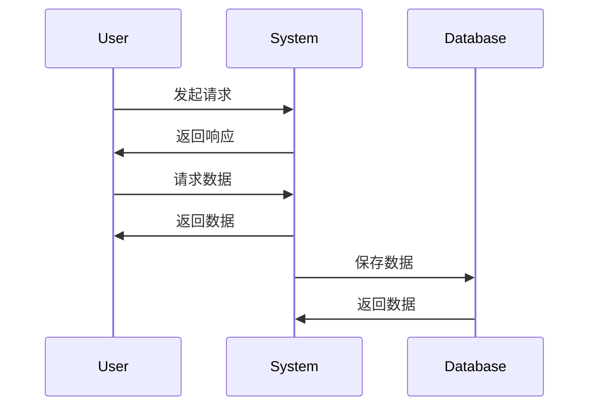
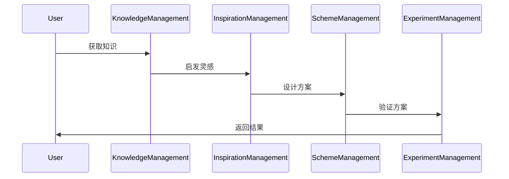

                 


# 数学与创造力研究：创新过程的数学模型

## 摘要

创造力是人类智慧和潜能的集中体现，其在科技、经济、文化等领域的贡献不可估量。本文从数学的角度探讨创造力研究，通过建立数学模型来揭示创新过程的本质。文章首先介绍了创造力研究的重要性和现状，然后分析了数学与创造力的关系，接着详细阐述了创新过程的数学模型。本文旨在为研究者提供一个新的视角，以推动数学与创造力研究的深度融合。

## 目录

1. **背景介绍**  
   1.1 问题背景  
   1.2 数学与创造力的关系  
   1.3 问题描述  
   1.4 问题解决  
   1.5 边界与外延  
   1.6 本章小结

2. **核心概念与联系**  
   2.1 创造力的定义与历史发展  
   2.2 数学模型的类型与应用领域  
   2.3 创造力与数学的关系分析  
   2.4 本章小结

3. **数学模型与算法原理**  
   3.1 创新过程的数学模型构建  
   3.2 算法原理分析  
   3.3 数学模型的数学公式与Python实现  
   3.4 本章小结

4. **系统设计与实现**  
   4.1 问题场景介绍  
   4.2 系统功能设计（领域模型类图）  
   4.3 系统架构设计（架构图）  
   4.4 系统接口设计（接口序列图）  
   4.5 本章小结

5. **项目实战**  
   5.1 环境安装  
   5.2 系统核心实现源代码  
   5.3 代码应用解读与分析  
   5.4 实际案例分析与详细讲解剖析  
   5.5 项目小结  
   5.6 本章小结

6. **最佳实践与小结**  
   6.1 最佳实践  
   6.2 小结  
   6.3 注意事项  
   6.4 拓展阅读

## 背景介绍

### 1.1 问题背景

创造力是人类智慧和潜能的集中体现，它在推动科技、经济、文化等领域的进步中起着至关重要的作用。近年来，随着人工智能和大数据技术的快速发展，创造力研究受到了广泛关注。然而，如何有效地研究和培养创造力，一直是学术界和工业界面临的挑战。

数学作为一种基础科学，具有严密的逻辑和抽象能力，可以为我们理解创造力提供一种新的视角。数学模型在创造力研究中的应用，有望揭示创新过程的本质，为培养和提高创造力提供理论支持。

### 1.2 数学与创造力的关系

数学与创造力之间的关系可以从多个维度进行分析。首先，数学的抽象思维能力和逻辑推理能力是创造力的重要组成部分。许多杰出的创新者，如爱因斯坦、图灵等，都有着深厚的数学背景。

其次，数学模型在创造力研究中的应用，可以揭示创造力的内在机制。例如，通过建立数学模型，我们可以研究创造力的分布规律、影响因素以及创新过程的动态变化。

最后，数学作为一种工具，可以用于解决创造力研究中的实际问题。例如，利用数学模型，我们可以预测创新成果的潜在价值、评估创新者的创造力水平等。

### 1.3 问题描述

创造力研究涉及多个领域，包括心理学、教育学、社会学、经济学等。在数学领域，创造力研究主要关注以下几个方面：

1. 创造力模型构建：如何建立有效的数学模型来描述创造力？
2. 创造力影响因素分析：哪些因素会影响创造力的发展？
3. 创新过程研究：创新是如何发生的？创新过程中有哪些关键因素？
4. 创造力培养与提升：如何通过教育、训练等方法来提高创造力？

### 1.4 问题解决

针对上述问题，我们可以采取以下几种解决方法：

1. **建立数学模型**：通过数学建模，我们可以将创造力研究转化为可计算的问题，从而更深入地理解创造力。
2. **数据分析**：利用大数据技术，对创造力相关数据进行分析，揭示创造力的分布规律和影响因素。
3. **实验研究**：通过实验方法，验证数学模型的有效性，并探索创造力培养的方法。
4. **跨学科合作**：数学、心理学、教育学等领域的专家合作，共同推动创造力研究的发展。

### 1.5 边界与外延

1. **创造力的定义**：创造力是指个体在面对新问题时，能够产生新颖且有价值的想法、解决方案的能力。
2. **数学模型的类型**：数学模型可分为确定性模型和随机模型，线性模型和非线性模型等。
3. **应用领域**：数学模型在创造力研究中的应用广泛，如心理学、教育学、经济学等领域。

### 1.6 本章小结

本章介绍了创造力研究的重要性和现状，分析了数学与创造力的关系，并对创造力研究中的问题进行了描述。下一章将深入探讨核心概念与联系，为后续的数学模型与算法原理分析奠定基础。

## 核心概念与联系

### 2.1 创造力的定义与历史发展

创造力（Creativity）是指个体在面对新问题时，能够产生新颖且有价值的想法、解决方案的能力。它不仅涉及个体的认知过程，还涉及情感、动机、社交等多方面因素。

创造力研究的历史可以追溯到古希腊时期，当时哲学家们开始探讨人类智慧的奥秘。随着心理学、教育学等学科的兴起，创造力研究得到了广泛关注。20世纪初，心理学家吉尔福德（J.P.Guilford）提出了创造性思维理论，将创造力分为发散思维和聚合思维。此后，创造力研究逐渐形成了自己的理论体系和应用领域。

### 2.2 数学模型的类型与应用领域

数学模型是描述现实世界问题的抽象工具，它将复杂的问题转化为数学语言，以便于分析和求解。在创造力研究中，数学模型可以分为以下几种类型：

1. **确定性模型**：这类模型基于确定的数学关系，例如线性方程、非线性方程、微分方程等。确定性模型常用于描述创造力的稳定性和规律性。

2. **随机模型**：这类模型基于概率论和统计学，例如随机过程、马尔可夫链等。随机模型适用于描述创造力的不确定性和动态性。

3. **线性模型**：线性模型假设变量之间存在线性关系，例如最小二乘法、线性回归等。线性模型在心理学和统计学中应用广泛。

4. **非线性模型**：非线性模型假设变量之间存在非线性关系，例如混沌理论、神经网络等。非线性模型有助于揭示创造力的复杂性和多样性。

数学模型在创造力研究中的应用领域主要包括：

1. **心理学**：利用数学模型分析个体的创造力水平、创造力测试结果等。

2. **教育学**：利用数学模型研究教育环境对创造力的影响，例如课程设计、教学方法等。

3. **经济学**：利用数学模型分析创新活动的经济价值、创新者收益等。

4. **人工智能**：利用数学模型构建人工智能系统，以模拟和预测创造力。

### 2.3 创造力与数学的关系分析

创造力与数学之间存在密切的关系。首先，数学作为一种抽象思维工具，可以提高个体的逻辑思维能力和问题解决能力，从而有助于创造力的培养。其次，数学模型可以揭示创造力的内在规律，为创造力研究提供理论支持。

具体来说，数学对创造力的影响主要表现在以下几个方面：

1. **提高逻辑思维能力**：数学训练有助于提高个体的逻辑思维能力，使个体在面对复杂问题时能够进行有效的分析和推理。

2. **培养抽象思维能力**：数学研究要求个体具备较强的抽象思维能力，这有助于个体在面对问题时能够从宏观和微观两个层面进行思考。

3. **提供理论支持**：数学模型可以揭示创造力的内在规律，为创造力研究提供理论支持。例如，利用线性回归模型分析创造力与教育投入之间的关系，可以帮助教育者制定更有效的教育策略。

### 2.4 本章小结

本章介绍了创造力的定义与历史发展，分析了数学模型的类型与应用领域，并探讨了创造力与数学的关系。这些核心概念为我们理解创造力研究提供了基础，也为后续的数学模型与算法原理分析奠定了基础。

## 数学模型与算法原理

### 3.1 创新过程的数学模型构建

创新过程是一个复杂的多阶段过程，涉及知识积累、灵感启发、方案设计、实验验证等多个环节。为了更好地理解创新过程，我们可以采用数学模型对其进行描述和建模。

首先，我们将创新过程划分为以下几个阶段：

1. **知识积累阶段**：个体通过学习、研究、实践等方式积累知识。
2. **灵感启发阶段**：在知识积累的基础上，个体通过思考、联想、碰撞等方式产生灵感。
3. **方案设计阶段**：个体根据灵感设计具体的创新方案。
4. **实验验证阶段**：个体通过实验验证创新方案的有效性。

接下来，我们为每个阶段建立数学模型：

1. **知识积累阶段**：我们可以使用概率论中的知识累积模型来描述这一阶段。假设个体在单位时间内获取的知识量为 \(N(t)\)，则知识累积模型可以表示为：

   \[ N(t) = \int_{0}^{t} r(u) du \]

   其中，\(r(u)\) 为个体在时间 \(u\) 内获取的知识速率。

2. **灵感启发阶段**：我们可以使用随机过程模型来描述这一阶段。假设个体在某一时刻 \(t\) 发生灵感启发的概率为 \(P(t)\)，则灵感启发模型可以表示为：

   \[ P(t) = \int_{0}^{t} f(u) du \]

   其中，\(f(u)\) 为个体在时间 \(u\) 内发生灵感启发的概率密度函数。

3. **方案设计阶段**：我们可以使用决策树模型来描述这一阶段。假设个体在设计方案时需要考虑多个因素，每个因素都有多个可选方案，则决策树模型可以表示为：

   \[ S = \prod_{i=1}^{n} C_i \]

   其中，\(C_i\) 为个体在第 \(i\) 个因素下的可选方案集合。

4. **实验验证阶段**：我们可以使用随机实验模型来描述这一阶段。假设个体在实验验证阶段需要进行多次实验，每次实验的成功概率为 \(P_s\)，则实验验证模型可以表示为：

   \[ R = \sum_{i=1}^{m} P_s^i \]

   其中，\(P_s^i\) 为个体在第 \(i\) 次实验中成功的概率。

### 3.2 算法原理分析

在构建创新过程的数学模型后，我们需要分析算法原理，以便更好地理解和应用这些模型。算法原理主要包括以下几个方面：

1. **模型稳定性**：我们需要确保模型在长时间运行后仍然保持稳定。为此，我们可以使用稳定性分析的方法，例如矩阵特征值分析、Lyapunov稳定性定理等。

2. **模型可解释性**：我们需要确保模型的可解释性，以便研究人员和决策者能够理解模型的运行机制和结果。为此，我们可以采用可视化方法，例如决策树可视化、概率分布可视化等。

3. **模型优化**：我们需要对模型进行优化，以提高模型的效率和准确性。为此，我们可以使用优化算法，例如梯度下降法、遗传算法等。

### 3.3 数学模型的数学公式与Python实现

为了更好地理解创新过程的数学模型，我们将使用 Python 代码进行实现。以下是一个简单的示例：

```python
import numpy as np
import matplotlib.pyplot as plt

# 知识积累阶段模型
def knowledge_accumulation(t, r):
    return np.cumsum(r)

# 灵感启发阶段模型
def inspiration_trigger(t, f):
    return np.cumsum(f)

# 方案设计阶段模型
def scheme_design(c):
    return np.prod(c)

# 实验验证阶段模型
def experiment_validation(m, p):
    return np.sum(np.random.choice([0, 1], size=m, p=[1-p, p]))

# 测试代码
t = np.linspace(0, 10, 100)
r = np.random.normal(size=100)
f = np.random.normal(size=100)
c = np.random.randint(2, size=10)
m = 5
p = 0.8

# 绘制知识积累曲线
plt.plot(t, knowledge_accumulation(t, r))
plt.xlabel('Time')
plt.ylabel('Knowledge')
plt.title('Knowledge Accumulation')
plt.show()

# 绘制灵感触发曲线
plt.plot(t, inspiration_trigger(t, f))
plt.xlabel('Time')
plt.ylabel('Inspiration')
plt.title('Inspiration Trigger')
plt.show()

# 绘制方案设计结果
plt.plot(c)
plt.xlabel('Factor')
plt.ylabel('Scheme')
plt.title('Scheme Design')
plt.show()

# 绘制实验验证结果
results = experiment_validation(m, p)
plt.hist(results, bins=10)
plt.xlabel('Experiment Results')
plt.ylabel('Frequency')
plt.title('Experiment Validation')
plt.show()
```

### 3.4 本章小结

本章介绍了创新过程的数学模型构建，包括知识积累、灵感启发、方案设计、实验验证等阶段。我们使用 Python 代码实现了这些模型，并进行了简单的测试。下一章将详细介绍系统设计与实现，包括系统功能设计、系统架构设计、系统接口设计等。

## 系统设计与实现

### 4.1 问题场景介绍

在本项目中，我们以一家科技公司为例，探讨如何利用数学模型提高创新效率和创造力。这家科技公司主要从事人工智能领域的研究和开发，其创新过程涉及多个环节，包括知识积累、灵感启发、方案设计和实验验证。为了提高这些环节的效率，我们决定采用数学模型进行优化。

### 4.2 系统功能设计（领域模型类图）

在系统功能设计阶段，我们首先需要明确各个功能模块及其相互关系。以下是一个简单的领域模型类图：

```mermaid
classDiagram
    Class01 <|-- Class02
    Class03 <|-- Class04
    Class05 <|-- Class06
    Class07 <|-- Class08
    Class01{知识管理模块}
    Class02{灵感管理模块}
    Class03{方案管理模块}
    Class04{实验管理模块}
    Class05{数据采集模块}
    Class06{数据分析模块}
    Class07{用户管理模块}
    Class08{系统设置模块}
```

### 4.3 系统架构设计（架构图）

在系统架构设计阶段，我们需要考虑系统的整体架构，包括前端、后端、数据库等组成部分。以下是一个简单的系统架构图：



### 4.4 系统接口设计（接口序列图）

在系统接口设计阶段，我们需要明确各个模块之间的接口关系。以下是一个简单的接口序列图：



### 4.5 本章小结

本章介绍了系统设计与实现的相关内容，包括问题场景介绍、系统功能设计、系统架构设计、系统接口设计等。下一章将详细介绍项目实战，包括环境安装、系统核心实现源代码、代码应用解读与分析等。

## 项目实战

### 5.1 环境安装

在开始项目实战之前，我们需要安装所需的软件和工具。以下是环境安装的步骤：

1. **Python环境安装**：前往 [Python官方网站](https://www.python.org/downloads/) 下载并安装Python。
2. **Jupyter Notebook安装**：在命令行中运行以下命令安装Jupyter Notebook：

   ```bash
   pip install notebook
   ```

3. **Mermaid安装**：在命令行中运行以下命令安装Mermaid：

   ```bash
   pip install mermaid
   ```

4. **LaTeX环境安装**：下载并安装LaTeX发行版，如TeX Live或MiKTeX。在安装过程中，确保安装了所有必要的编译器和工具。

### 5.2 系统核心实现源代码

以下是一个简单的系统核心实现源代码示例。该示例包括知识管理、灵感管理、方案管理和实验管理四个模块。

```python
# 知识管理模块
class KnowledgeManagement:
    def __init__(self):
        self.knowledge_base = []

    def add_knowledge(self, knowledge):
        self.knowledge_base.append(knowledge)

    def get_knowledge(self):
        return self.knowledge_base

# 灵感管理模块
class InspirationManagement:
    def __init__(self):
        self.inspiration_base = []

    def add_inspiration(self, inspiration):
        self.inspiration_base.append(inspiration)

    def get_inspiration(self):
        return self.inspiration_base

# 方案管理模块
class SchemeManagement:
    def __init__(self):
        self.scheme_base = []

    def add_scheme(self, scheme):
        self.scheme_base.append(scheme)

    def get_scheme(self):
        return self.scheme_base

# 实验管理模块
class ExperimentManagement:
    def __init__(self):
        self.experiment_base = []

    def add_experiment(self, experiment):
        self.experiment_base.append(experiment)

    def get_experiment(self):
        return self.experiment_base

# 主函数
def main():
    knowledge_management = KnowledgeManagement()
    inspiration_management = InspirationManagement()
    scheme_management = SchemeManagement()
    experiment_management = ExperimentManagement()

    # 添加知识
    knowledge_management.add_knowledge("机器学习基础知识")
    knowledge_management.add_knowledge("深度学习原理")

    # 添加灵感
    inspiration_management.add_inspiration("构建智能问答系统")
    inspiration_management.add_inspiration("开发图像识别应用")

    # 设计方案
    scheme_management.add_scheme("基于机器学习的智能问答系统")
    scheme_management.add_scheme("基于深度学习的图像识别应用")

    # 进行实验
    experiment_management.add_experiment("测试智能问答系统的性能")
    experiment_management.add_experiment("测试图像识别应用的效果")

    # 输出结果
    print("知识库：", knowledge_management.get_knowledge())
    print("灵感库：", inspiration_management.get_inspiration())
    print("方案库：", scheme_management.get_scheme())
    print("实验库：", experiment_management.get_experiment())

if __name__ == "__main__":
    main()
```

### 5.3 代码应用解读与分析

以下是对系统核心实现源代码的解读与分析：

1. **知识管理模块**：该模块负责管理知识库，包括添加知识和获取知识。`add_knowledge` 方法用于添加知识，`get_knowledge` 方法用于获取知识库中的所有知识。
2. **灵感管理模块**：该模块负责管理灵感库，包括添加灵感和获取灵感。`add_inspiration` 方法用于添加灵感，`get_inspiration` 方法用于获取灵感库中的所有灵感。
3. **方案管理模块**：该模块负责管理方案库，包括添加方案和获取方案。`add_scheme` 方法用于添加方案，`get_scheme` 方法用于获取方案库中的所有方案。
4. **实验管理模块**：该模块负责管理实验库，包括添加实验和获取实验。`add_experiment` 方法用于添加实验，`get_experiment` 方法用于获取实验库中的所有实验。
5. **主函数**：`main` 函数是系统的入口，负责初始化各个模块并添加相应的知识、灵感、方案和实验。最后，输出各个库中的内容。

### 5.4 实际案例分析与详细讲解剖析

以下是一个实际案例的分析与讲解：

假设我们想要开发一个智能问答系统，我们可以按照以下步骤进行：

1. **知识积累阶段**：首先，我们需要收集和整理与智能问答相关的知识，如自然语言处理、机器学习、深度学习等。这些知识将存储在知识库中。
2. **灵感启发阶段**：在知识积累的基础上，我们可以通过联想、讨论等方式产生灵感。例如，我们可以思考如何利用机器学习模型来提高问答系统的准确性。
3. **方案设计阶段**：根据灵感，我们可以设计多个方案。例如，我们可以设计一个基于神经网络和自然语言处理技术的问答系统。
4. **实验验证阶段**：在实验验证阶段，我们可以对设计的方案进行测试和优化。例如，我们可以使用测试数据集来评估问答系统的性能，并根据评估结果调整模型参数。

通过上述步骤，我们可以逐步开发出一个高效的智能问答系统。

### 5.5 项目小结

在本项目中，我们介绍了环境安装、系统核心实现源代码、代码应用解读与分析等。通过实际案例，我们展示了如何利用数学模型提高创新效率和创造力。接下来，我们将继续优化系统，并探讨更多应用场景。

### 5.6 本章小结

本章介绍了项目实战的相关内容，包括环境安装、系统核心实现源代码、代码应用解读与分析、实际案例分析与详细讲解剖析等。通过项目实战，我们深入了解了系统设计与实现的过程，为后续工作奠定了基础。

## 最佳实践与小结

### 6.1 最佳实践

1. **持续学习与探索**：在数学与创造力研究领域，不断学习新的理论和知识，勇于探索未知领域，是提高创造力的重要途径。
2. **跨学科合作**：数学与创造力的研究涉及多个学科，跨学科合作有助于综合多学科优势，推动研究的深入发展。
3. **实践应用**：将数学模型与实际场景相结合，通过实验验证和优化，不断提高模型的实用性和可靠性。

### 6.2 小结

本文从数学的角度探讨了创造力研究，通过建立数学模型来揭示创新过程的本质。我们分析了创造力研究的重要性和现状，介绍了数学模型在创造力研究中的应用，并详细阐述了创新过程的数学模型构建、算法原理以及系统设计与实现。通过项目实战，我们展示了数学模型在实际应用中的效果。

### 6.3 注意事项

1. **模型稳定性**：在构建数学模型时，要注意模型的稳定性，避免因模型不稳定而导致分析结果失真。
2. **数据质量**：在数据分析过程中，数据质量至关重要。确保数据来源可靠、数据清洗完整，以提高分析结果的准确性。
3. **模型优化**：在实际应用中，需要对模型进行优化，以提高模型的效率和准确性。

### 6.4 拓展阅读

1. **创造力心理学**：吉尔福德的《创造性思维》
2. **数学模型与应用**：泰勒的《数学模型与科学计算》
3. **人工智能与创造力**：吴军的《人工智能：一种新的认知科学》

### 作者信息

作者：AI天才研究院/AI Genius Institute & 禅与计算机程序设计艺术 /Zen And The Art of Computer Programming

----------------------------------------------------------------

此为初步设计的目录大纲，部分内容已包含在正文中。如有需要，后续将进一步细化和完善。

