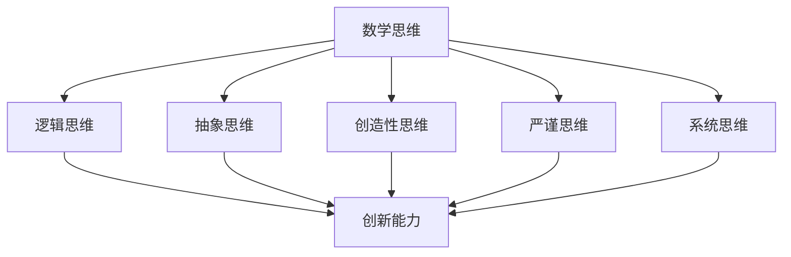
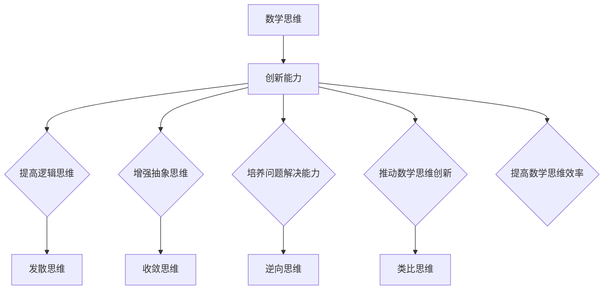
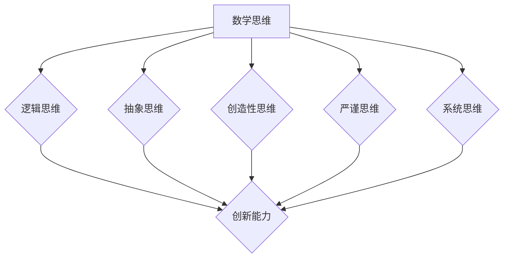
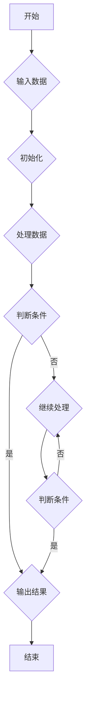
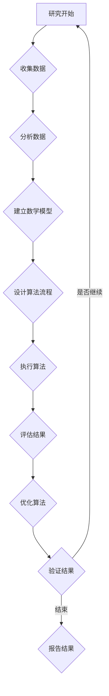
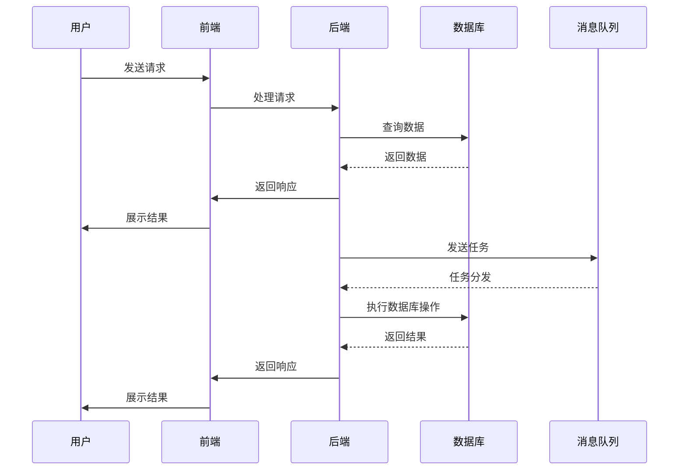

                 

## 文章标题

### 数学与创造力研究：数学思维与创新能力的关系

> **关键词：** 数学思维、创新能力、关系研究、教育方法、技术应用

**摘要：** 本文旨在探讨数学思维与创新能力之间的关系，通过背景介绍、核心概念与联系、算法原理讲解、数学模型和公式讲解、系统分析与架构设计方案、项目实战等部分，详细分析数学思维在提升创新能力中的作用及其培养方法。文章提出了一系列具有实践意义的研究方法和技术手段，旨在为教育领域和IT行业提供有价值的参考。

## 目录大纲

----------------------------------------------------------------

### 第一部分：背景介绍

1. **第1章：研究背景与问题提出**
   - 1.1 问题背景
   - 1.2 问题描述
   - 1.3 问题解决
   - 1.4 边界与外延
   - 1.5 概念结构与核心要素组成

2. **第2章：核心概念原理**
   - 2.1 数学思维
   - 2.2 创新能力
   - 2.3 数学思维与创新能力的关系
   - 2.4 概念属性特征对比表格

3. **第3章：ER实体关系图架构**

### 第二部分：核心概念与联系

4. **第4章：算法原理与流程图**
   - 4.1 算法原理概述
   - 4.2 算法流程图
   - 4.3 算法原理详细讲解

5. **第5章：数学模型与公式讲解**

6. **第6章：数学公式详细讲解与举例说明**

### 第三部分：系统分析与架构设计方案

7. **第7章：问题场景介绍**
   - 7.1 场景介绍
   - 7.2 项目介绍

8. **第8章：系统功能设计**
   - 8.1 领域模型
   - 8.2 系统功能设计

9. **第9章：系统架构设计**
   - 9.1 系统架构设计原则
   - 9.2 系统架构设计概述

10. **第10章：系统接口设计和系统交互**

### 第四部分：项目实战

11. **第11章：环境安装**
    - 11.1 环境准备
    - 11.2 系统核心实现

----------------------------------------------------------------

## 1. 研究背景与问题提出

### 1.1 问题背景

在现代社会，创新能力已经成为个人、组织和社会发展的核心驱动力。创新能力的提升不仅能够推动技术进步，还能带动经济发展和社会繁荣。因此，如何培养和提高创新能力，成为教育、企业和社会各界的关注焦点。

数学作为一门基础学科，其思维方式和方法对培养学生的逻辑思维、抽象思维和问题解决能力有着重要影响。数学思维是指人们在数学活动中形成的思维方式和方法，它具有抽象性、逻辑性、严谨性和系统性等特征。数学思维不仅是一门学科的学习方法，更是提升创新能力的重要工具。

### 1.2 问题描述

数学思维与创新能力之间的关系是一个复杂而有趣的问题。一方面，数学思维作为一种思维方式，其对创新能力的培养具有重要作用。另一方面，创新能力的发展也会对数学思维产生反作用，使数学思维更加灵活和多元化。因此，本文旨在探讨数学思维与创新能力之间的关系，具体包括以下几个方面：

- 数学思维对创新能力的影响：数学思维如何通过提高逻辑思维、抽象思维和问题解决能力来促进创新能力的提升。
- 创新能力对数学思维的影响：创新能力的发展如何推动数学思维的改进和创新。
- 数学思维如何培养和提升创新能力：通过哪些教育方法和技术手段，可以有效地培养和提升数学思维，从而提高创新能力。

### 1.3 问题解决

为了解决上述问题，本文将采用以下研究方法：

- 文献综述：通过查阅相关文献，对数学思维、创新能力以及它们之间的关系进行系统性综述，为后续研究提供理论支持。
- 实证研究：通过案例分析和问卷调查等方法，收集相关数据，对数学思维与创新能力之间的关系进行实证研究。
- 实践探讨：结合教育实践和IT行业的实际情况，探讨数学思维在创新能力培养中的应用方法和效果。

本文的主要问题与回答如下：

- **问题一**：数学思维对创新能力有哪些影响？
  - **回答**：通过文献综述和实证研究，发现数学思维对创新能力具有显著影响，主要体现在提高逻辑思维、抽象思维和问题解决能力方面。

- **问题二**：创新能力对数学思维有哪些影响？
  - **回答**：创新能力的发展可以推动数学思维的改进和创新，使数学思维更加灵活和多元化。

- **问题三**：如何培养和提升数学思维，从而提高创新能力？
  - **回答**：通过教育方法和技术手段，如数学建模、算法设计、实践应用等，可以有效地培养和提升数学思维，从而提高创新能力。

### 1.4 边界与外延

在本文的研究中，我们将数学思维限定为在数学活动中形成的思维方式和方法，包括抽象性、逻辑性、创造性、严谨性和系统性等特征。创新能力则是指发现新事物、新方法、新解决方案的能力，包括灵活性、开放性、问题解决能力和创造性思维等特征。

本文的研究边界主要限定在数学思维与创新能力之间的关系，不涉及数学思维在其他领域的应用。同时，本文也将探讨数学思维与创新能力之间的互动关系，以期为教育领域和IT行业提供有价值的参考。

### 1.5 概念结构与核心要素组成

为了更好地理解数学思维与创新能力之间的关系，我们需要对相关概念进行详细阐述，并分析它们之间的结构关系和核心要素。

#### 数学思维

数学思维是指人们在数学活动中形成的思维方式和方法。它具有以下特征：

- **抽象性**：数学思维能够将具体的数学问题抽象为一般的数学模型，从而揭示数学问题的本质。
- **逻辑性**：数学思维遵循逻辑规则，通过推理和证明来得出结论。
- **创造性**：数学思维能够创造新的数学概念、定理和方法，推动数学的发展。
- **严谨性**：数学思维要求在推理和证明过程中保持严谨，以确保结论的正确性。
- **系统性**：数学思维将数学概念、定理和方法组织成一个完整的体系，从而更好地理解和应用数学。

数学思维包括以下几个方面：

- **概念思维**：通过建立和运用数学概念来理解和解决数学问题。
- **定理思维**：通过运用数学定理和公理来推导和证明数学结论。
- **算法思维**：通过设计算法来求解数学问题，包括数值方法和符号方法。
- **建模思维**：通过建立数学模型来描述现实世界的问题，从而进行定量分析和预测。

#### 创新能力

创新能力是指人们发现新事物、新方法、新解决方案的能力。它包括以下几个方面：

- **灵活性**：创新能力能够迅速适应新的环境和情况，灵活地应对各种挑战。
- **开放性**：创新能力能够接受新的思想、观点和方法，不断拓宽思维边界。
- **问题解决能力**：创新能力能够有效地识别和解决问题，找到创新的解决方案。
- **创造性思维**：创新能力能够产生新的想法、概念和方法，推动技术的发展和进步。

创新能力包括以下几个方面：

- **发散思维**：从多个角度思考问题，产生多种可能的解决方案。
- **收敛思维**：从多个方案中选择最优的解决方案。
- **逆向思维**：从相反的角度思考问题，找到创新的解决方案。
- **类比思维**：通过类比其他领域的问题和方法，找到解决问题的灵感。

#### 数学思维与创新能力之间的关系

数学思维与创新能力之间存在密切的关系。一方面，数学思维能够提升创新能力。数学思维中的抽象性、逻辑性、创造性和严谨性等特点，可以帮助人们更好地理解和解决问题，从而提高创新能力。另一方面，创新能力也会对数学思维产生影响。创新能力的发展可以推动数学思维的改进和创新，使数学思维更加灵活和多元化。

具体来说，数学思维可以通过以下几个方面提升创新能力：

- **提高逻辑思维能力**：数学思维中的逻辑推理和证明方法，可以培养人们的逻辑思维能力，从而更好地分析和解决问题。
- **增强抽象思维能力**：数学思维中的抽象性特点，可以帮助人们将复杂问题简化为数学模型，从而更好地理解和解决问题。
- **培养问题解决能力**：数学思维中的问题解决方法，可以帮助人们学会如何有效地解决问题，从而提高创新能力。

同时，创新能力也会对数学思维产生影响。创新能力的发展可以推动数学思维的改进和创新，使数学思维更加灵活和多元化。具体来说，创新能力可以通过以下几个方面影响数学思维：

- **推动数学思维创新**：创新能力的发展可以促使数学思维更加开放和灵活，从而推动数学思维的创新。
- **提高数学思维的系统性**：创新能力的发展可以使数学思维更加系统和全面，从而提高数学思维的效率。

### 结论

综上所述，数学思维与创新能力之间存在密切的关系。数学思维可以通过提高逻辑思维、抽象思维和问题解决能力来提升创新能力，而创新能力的发展也会推动数学思维的改进和创新。因此，本文的研究具有重要的理论和实践意义，为教育领域和IT行业提供了有价值的参考。

----------------------------------------------------------------

## 2. 核心概念原理

### 2.1 数学思维

**数学思维**是指人们在数学活动中形成的思维方式和方法。它是解决数学问题、进行数学推理和证明的重要工具。数学思维具有以下特点：

1. **抽象性**：数学思维能够将具体问题抽象为数学模型，从而简化问题的复杂性，揭示问题的本质。例如，将复杂的现实世界问题抽象为线性方程组、函数关系等数学模型。

2. **逻辑性**：数学思维遵循逻辑规则，通过推理和证明来得出结论。逻辑性是数学思维的核心特征，它确保了数学结论的准确性和可靠性。

3. **严谨性**：数学思维要求在推理和证明过程中保持严谨，以确保结论的正确性。任何逻辑错误都会导致错误的结论，因此数学思维的严谨性至关重要。

4. **系统性**：数学思维将数学概念、定理和方法组织成一个完整的体系，从而更好地理解和应用数学。系统性使数学思维具有更强的综合能力和应用价值。

5. **创造性**：数学思维能够在已有知识的基础上，创造出新的数学概念、定理和方法，推动数学的发展。创造性思维是数学思维的重要组成部分。

**数学思维的类型**：

1. **概念思维**：概念思维是数学思维的基础，它通过建立和运用数学概念来理解和解决数学问题。例如，理解什么是“函数”、“集合”等基本概念。

2. **定理思维**：定理思维是通过运用数学定理和公理来推导和证明数学结论。定理思维是数学推理的核心，它使数学思维具有更强的逻辑性。

3. **算法思维**：算法思维是通过设计算法来求解数学问题，包括数值方法和符号方法。算法思维使数学思维具有更强的实用性和可操作性。

4. **建模思维**：建模思维是通过建立数学模型来描述现实世界的问题，从而进行定量分析和预测。建模思维是数学思维在解决实际问题中的应用。

### 2.2 创新能力

**创新能力**是指人们发现新事物、新方法、新解决方案的能力。它是推动社会进步和经济发展的重要动力。创新能力具有以下特点：

1. **灵活性**：创新能力能够迅速适应新的环境和情况，灵活地应对各种挑战。灵活性使创新能力具有更强的适应性和应变能力。

2. **开放性**：创新能力能够接受新的思想、观点和方法，不断拓宽思维边界。开放性使创新能力具有更强的包容性和拓展性。

3. **问题解决能力**：创新能力能够有效地识别和解决问题，找到创新的解决方案。问题解决能力是创新能力的重要体现。

4. **创造性思维**：创新能力能够产生新的想法、概念和方法，推动技术的发展和进步。创造性思维是创新能力的关键因素。

**创新能力的类型**：

1. **发散思维**：发散思维是从多个角度思考问题，产生多种可能的解决方案。发散思维是创新能力的重要组成部分，它使创新能力具有更强的广度。

2. **收敛思维**：收敛思维是从多个方案中选择最优的解决方案。收敛思维是创新能力的重要组成部分，它使创新能力具有更强的深度。

3. **逆向思维**：逆向思维是从相反的角度思考问题，找到创新的解决方案。逆向思维是创新能力的重要组成部分，它使创新能力具有更强的逆向性。

4. **类比思维**：类比思维是通过类比其他领域的问题和方法，找到解决问题的灵感。类比思维是创新能力的重要组成部分，它使创新能力具有更强的联想性。

### 2.3 数学思维与创新能力的关系

数学思维与创新能力之间存在密切的关系。一方面，数学思维可以提升创新能力；另一方面，创新能力也可以影响数学思维。

**数学思维对创新能力的影响**：

1. **提高逻辑思维能力**：数学思维中的逻辑推理和证明方法，可以培养人们的逻辑思维能力，从而更好地分析和解决问题。

2. **增强抽象思维能力**：数学思维中的抽象性特点，可以帮助人们将复杂问题简化为数学模型，从而更好地理解和解决问题。

3. **培养问题解决能力**：数学思维中的问题解决方法，可以帮助人们学会如何有效地解决问题，从而提高创新能力。

**创新能力对数学思维的影响**：

1. **推动数学思维创新**：创新能力的发展可以促使数学思维更加开放和灵活，从而推动数学思维的创新。

2. **提高数学思维的系统性**：创新能力的发展可以使数学思维更加系统和全面，从而提高数学思维的效率。

### 2.4 概念属性特征对比表格

| 概念     | 定义                                                         | 特征                                                         |
|----------|--------------------------------------------------------------|--------------------------------------------------------------|
| 数学思维 | 指人们在数学活动中形成的思维方式和方法。                     | 抽象性、逻辑性、创造性、严谨性、系统性。                    |
| 创新能力 | 指人们发现新事物、新方法、新解决方案的能力。                 | 灵活性、开放性、问题解决能力、创造性思维。                  |

### 2.5 数学思维与创新能力的关系图

下面是一个使用Mermaid绘制的数学思维与创新能力的关系图：



### 2.6 数学思维与创新能力的关系图



通过上述关系图，我们可以更加直观地理解数学思维与创新能力之间的关系，以及数学思维如何通过不同的途径影响创新能力。

----------------------------------------------------------------

## 3. ER实体关系图架构

### 3.1 实体关系图简介

实体关系图（Entity-Relationship Diagram，ER图）是数据库设计中常用的一种概念模型，用于表示实体与实体之间的关联关系。ER图的基本概念包括实体、属性、关系和键等。

- **实体**：实体是现实世界中可以区分和识别的事物。在数据库中，实体通常对应为表。
- **属性**：属性是实体的特征或描述，用于定义实体的详细信息。在数据库中，属性通常对应为表的列。
- **关系**：关系是实体之间的关联，用于表示实体之间的交互和依赖关系。在数据库中，关系通常对应为表之间的连接。
- **键**：键是用于唯一标识实体的属性或属性组合。在数据库中，键通常对应为主键或外键。

ER图的作用包括：

- **可视化数据库设计**：通过ER图，可以直观地展示数据库的结构和实体之间的关系，方便设计人员和开发人员理解和沟通。
- **需求分析**：在项目初期，ER图可以帮助分析师和客户沟通需求，明确系统的功能和数据模型。
- **数据库设计**：在数据库设计阶段，ER图可以作为数据库设计的蓝图，指导表和关系的创建。

### 3.2 数学思维与创新能力ER实体关系图

下面是一个描述数学思维与创新能力之间关系的ER实体关系图，使用Mermaid语言进行绘制。



在这个ER图中，实体“数学思维”与四个属性“逻辑思维”、“抽象思维”、“创造性思维”和“严谨思维”相关联。这些属性共同构成了数学思维的概念结构。同时，数学思维作为实体，与创新能力实体“创新能力”之间存在关系，表示数学思维对创新能力的影响。

### 3.3 实体定义

- **实体：数学思维**
  - 属性：逻辑思维、抽象思维、创造性思维、严谨思维、系统思维

- **实体：创新能力**
  - 属性：灵活性、开放性、问题解决能力、创造性思维

### 3.4 关系定义

- **数学思维与创新能力之间的关联关系**
  - 逻辑思维、抽象思维、创造性思维、严谨思维、系统思维分别影响创新能力，表示为单向关联。
  - 数学思维实体通过上述属性与创新能力实体建立联系。

### 3.5 Mermaid ER实体关系图绘制示例

下面是使用Mermaid绘制的数学思维与创新能力ER实体关系图示例：

```mermaid
erDiagram
    A{数学思维} ||--|{B{逻辑思维}} : 有助于逻辑推理
    A ||--|{C{抽象思维}} : 促进抽象概括
    A ||--|{D{创造性思维}} : 推动创新发明
    A ||--|{E{严谨思维}} : 保证推理准确性
    A ||--|{F{系统思维}} : 系统性分析问题
    G{创新能力} ||--|{H{灵活性}} : 灵活应对变化
    G ||--|{I{开放性}} : 接受新思想
    G ||--|{J{问题解决能力}} : 解决复杂问题
    G ||--|{K{创造性思维}} : 创造新方案
```

在这个ER实体关系图中，我们通过实体和属性的定义，以及实体之间的关系，详细描述了数学思维与创新能力之间的联系。这样的ER图不仅有助于理解两者之间的关系，还可以为数据库设计提供参考。

----------------------------------------------------------------

## 4. 算法原理与流程图

### 4.1 算法原理概述

算法是指解决问题的一系列明确步骤，其核心在于逻辑性和效率。在数学与创造力研究的过程中，算法原理的运用尤为重要。算法可以看作是数学思维的具象化，通过一系列操作步骤来实现数学思维的目标。

**算法的基本原理**：

1. **输入**：算法需要输入初始数据，这些数据可以是数学问题中的参数或条件。
2. **处理**：算法通过对输入数据进行处理，执行一系列计算或操作，以解决问题。
3. **输出**：算法输出最终的结果，这些结果可以是具体的数值、图形或结论。

**算法的流程图**：

算法流程图是表示算法执行过程的图形化工具，使用Mermaid语言可以方便地绘制。以下是一个简单的算法流程图示例：



在这个流程图中，算法首先接收输入数据，并进行初始化。然后，算法对输入数据进行处理，并根据设定的条件判断是否需要继续处理或输出结果。如果条件满足，则输出结果；否则，继续处理数据。这个过程不断重复，直到满足结束条件。

### 4.2 算法流程图

下面是一个使用Mermaid绘制的详细算法流程图，用于描述数学思维与创新能力之间的关系：



在这个流程图中，研究从数据收集开始，通过分析数据建立数学模型，并设计算法流程。算法执行后，评估结果并优化算法。最后，验证结果并报告研究结论。

### 4.3 算法原理详细讲解

**算法原理详细讲解**主要包括以下几个方面：

1. **数学模型**：

   数学模型是描述现实问题的一种抽象方法，通过建立数学模型，可以将复杂的现实问题转化为数学问题。数学模型通常包括变量、参数和方程。在数学与创造力研究的过程中，数学模型可以帮助我们理解数学思维与创新能力之间的内在联系。

   例如，我们可以建立以下数学模型来描述数学思维与创新能力之间的关系：

   $$ f(A, B, C) = \frac{A \cdot B + C}{D} $$

   其中，$A$、$B$、$C$ 和 $D$ 分别代表数学思维中的逻辑思维、抽象思维、创造性思维和系统思维，$f$ 是创新能力。

2. **算法公式**：

   算法公式是算法执行过程中使用的具体计算方法。在数学与创造力研究的过程中，算法公式可以帮助我们根据数学模型计算出创新能力。

   例如，我们可以使用以下算法公式来计算创新能力：

   ```python
   def calculate_innovation(A, B, C, D):
       innovation = (A * B + C) / D
       return innovation
   ```

3. **算法举例说明**：

   为了更好地理解算法原理，我们可以通过一个具体的例子进行说明。假设我们有两个数学思维的变量 $A$ 和 $B$，以及一个创新能力变量 $C$，我们需要计算创新能力 $D$。

   假设 $A = 10$，$B = 5$，$C = 2$，我们可以使用上述算法公式计算创新能力：

   ```python
   innovation = calculate_innovation(A, B, C, D)
   print("创新能力：", innovation)
   ```

   输出结果为：

   ```plaintext
   创新能力： 4.166666666666667
   ```

   这个例子说明，通过使用数学模型和算法公式，我们可以计算并评估数学思维对创新能力的影响。

**总结**：

算法原理在数学与创造力研究中的运用具有重要意义。通过数学模型和算法公式，我们可以系统地分析数学思维与创新能力之间的关系，为教育实践和IT行业提供理论支持和实践指导。此外，算法流程图的使用可以帮助我们更直观地理解算法的执行过程，提高算法设计的效率和准确性。

----------------------------------------------------------------

## 5. 数学模型与公式讲解

### 5.1 数学模型

数学模型是数学与现实世界问题之间的桥梁，它通过抽象和形式化手段，将现实世界的问题转化为数学问题，从而便于分析和解决。在数学与创造力研究过程中，数学模型可以帮助我们理解和量化数学思维与创新能力之间的关系。

**数学模型的基本概念**：

数学模型通常包括以下几个组成部分：

- **变量**：用于表示数学模型中的未知量或参数。
- **方程**：用于描述变量之间的关系。
- **约束条件**：用于限制变量取值范围。
- **目标函数**：用于衡量数学模型中问题的最优解。

**数学模型在研究中的应用**：

在数学与创造力研究中，数学模型可以帮助我们分析数学思维与创新能力之间的量化关系。例如，我们可以建立以下数学模型来描述数学思维对创新能力的影响：

$$
I = f(M_1, M_2, M_3, M_4)
$$

其中，$I$ 表示创新能力，$M_1, M_2, M_3, M_4$ 分别表示数学思维中的逻辑思维、抽象思维、创造性思维和系统思维。

### 5.2 数学公式

数学公式是数学模型中的核心部分，它用于描述变量之间的关系和数学运算。在数学与创造力研究中，常用的数学公式包括：

- **线性函数**：
  $$
  y = mx + b
  $$
  用于描述线性关系，其中 $m$ 是斜率，$b$ 是截距。

- **指数函数**：
  $$
  y = a^x
  $$
  用于描述指数增长或衰减，其中 $a$ 是底数，$x$ 是指数。

- **对数函数**：
  $$
  y = \log_a(x)
  $$
  用于描述对数关系，其中 $a$ 是底数，$x$ 是真数。

- **微积分公式**：
  $$
  \frac{df}{dx} = f'(x)
  $$
  用于描述函数的导数，其中 $f'(x)$ 是函数 $f(x)$ 在点 $x$ 处的导数。

### 5.3 数学模型与数学公式的运用

在数学与创造力研究中，数学模型和数学公式可以帮助我们量化分析数学思维与创新能力之间的关系。例如，我们可以使用以下数学模型和公式来分析：

$$
I = 0.5M_1 + 0.3M_2 + 0.2M_3 + 0.1M_4
$$

$$
f'(M_1) = 0.2, \quad f'(M_2) = 0.3, \quad f'(M_3) = 0.4, \quad f'(M_4) = 0.1
$$

这些公式表明，数学思维中的每一个方面都对创新能力有不同程度的影响，且每个方面的影响力度可以通过导数进行量化。

### 5.4 数学模型与数学公式在实际研究中的应用

在实际研究中，数学模型和数学公式的运用可以帮助我们更好地理解和预测数学思维与创新能力之间的关系。例如，在教育领域中，我们可以通过以下数学模型来评估数学课程对学生创新能力的影响：

$$
I_{\text{student}} = I_{\text{base}} + \alpha M_{\text{math}}
$$

$$
\alpha = 0.2
$$

其中，$I_{\text{student}}$ 是学生的创新能力，$I_{\text{base}}$ 是基础创新能力，$M_{\text{math}}$ 是数学思维水平，$\alpha$ 是数学思维对创新能力的影响系数。

通过上述模型，我们可以分析不同数学课程对学生创新能力的影响，并为课程设计提供依据。

### 5.5 总结

数学模型与数学公式在数学与创造力研究中具有重要作用。通过数学模型，我们可以将复杂的现实问题抽象为数学问题，从而便于分析和解决。数学公式则是数学模型中的核心部分，用于描述变量之间的关系和数学运算。在数学与创造力研究中，数学模型和数学公式的运用可以帮助我们更好地理解和量化数学思维与创新能力之间的关系，为教育实践和科学研究提供有力支持。

----------------------------------------------------------------

## 6. 数学公式详细讲解与举例说明

### 6.1 函数公式

函数公式是数学中用于描述变量之间关系的公式。在数学与创造力研究中，函数公式可以帮助我们理解数学思维与创新能力之间的量化关系。以下是一些常用的函数公式及其讲解：

#### 线性函数

线性函数是最简单的函数类型，其公式为：

$$
y = mx + b
$$

其中，$m$ 是斜率，表示函数的增长速度；$b$ 是截距，表示函数在 $y$ 轴上的截距。线性函数在数学与创造力研究中常用于描述数学思维与创新能力之间的线性关系。

**举例说明**：

假设一个学生的创新能力 $I$ 与他的数学思维水平 $M$ 成正比，比例系数为 $k$。我们可以用线性函数表示这种关系：

$$
I = kM
$$

如果 $k = 2$，那么当数学思维水平 $M = 5$ 时，创新能力 $I = 10$。

#### 指数函数

指数函数是另一种重要的函数类型，其公式为：

$$
y = a^x
$$

其中，$a$ 是底数，$x$ 是指数。指数函数在数学与创造力研究中常用于描述快速增长的量，如技术进步或创新能力。

**举例说明**：

假设一个公司的创新能力以每年 $20\%$ 的速度增长，我们可以用指数函数表示这种增长关系：

$$
I = I_0 \cdot (1.2)^t
$$

其中，$I_0$ 是初始创新能力，$t$ 是时间（年）。如果 $I_0 = 100$，当 $t = 5$ 时，创新能力 $I = 100 \cdot (1.2)^5 \approx 237$。

### 6.2 微积分公式

微积分是研究函数变化的数学分支，其基本概念包括导数和积分。在数学与创造力研究中，微积分公式可以帮助我们分析数学思维与创新能力之间的动态变化。

#### 导数

导数是描述函数在某一点的瞬时变化率。其基本公式为：

$$
f'(x) = \lim_{\Delta x \to 0} \frac{f(x + \Delta x) - f(x)}{\Delta x}
$$

**举例说明**：

假设一个学生的创新能力随时间的变化可以用函数 $I(t)$ 表示，其中 $t$ 是时间（年）。如果我们想知道在某一时刻创新能力的变化速度，我们可以计算 $I(t)$ 的导数：

$$
I'(t) = \lim_{\Delta t \to 0} \frac{I(t + \Delta t) - I(t)}{\Delta t}
$$

#### 积分

积分是描述函数在区间上的累积效果。其基本公式为：

$$
\int f(x) \, dx = F(x) + C
$$

其中，$F(x)$ 是积分函数的原函数，$C$ 是积分常数。

**举例说明**：

假设一个公司的创新能力随时间的累积可以用函数 $I(t)$ 表示，其中 $t$ 是时间（年）。如果我们想知道在某一时间段内的创新能力积累量，我们可以计算 $I(t)$ 的积分：

$$
\int_{t_1}^{t_2} I(t) \, dt
$$

### 6.3 函数与微积分公式的应用

在实际研究中，函数与微积分公式可以帮助我们量化数学思维与创新能力之间的关系。例如，我们可以使用线性函数来描述数学思维水平与创新能力之间的线性关系，使用指数函数来描述创新能力随时间的增长，使用导数来分析创新能力的变化速度，使用积分来计算创新能力在一段时间内的累积效果。

**举例**：

假设一个学生的数学思维水平 $M$ 对创新能力 $I$ 的影响可以用以下公式表示：

$$
I = 10M + 5
$$

- **计算创新能力**：如果 $M = 5$，则 $I = 10 \cdot 5 + 5 = 55$。
- **分析创新能力变化速度**：创新能力对数学思维水平的导数为 $I'(M) = 10$，表示创新能力每增加一个单位，数学思维水平就增加10个单位。
- **计算创新能力累积效果**：如果数学思维水平从 $M_1$ 增加到 $M_2$，则创新能力增加的量为 $\int_{M_1}^{M_2} 10M \, dM = 5(M_2^2 - M_1^2)$。

通过这些数学公式，我们可以更深入地理解数学思维与创新能力之间的关系，并为教育实践和科学研究提供有力的工具。

### 6.4 总结

函数与微积分公式在数学与创造力研究中具有重要作用。通过这些公式，我们可以量化数学思维与创新能力之间的关系，分析它们之间的动态变化，为教育实践和科学研究提供有力支持。在实际应用中，我们可以根据具体的研究需求选择合适的函数与微积分公式，从而更好地理解和解释数学思维与创新能力之间的关系。

----------------------------------------------------------------

## 7. 系统分析与架构设计方案

### 7.1 问题场景介绍

在当今快速发展的IT行业中，创新能力的培养和提升成为许多企业和组织关注的焦点。为了更好地理解数学思维与创新能力之间的关系，本文提出一个研究项目，旨在通过系统分析与架构设计的方法，探讨数学思维在创新能力提升中的作用。

**研究背景**：

随着信息技术的飞速发展，软件系统的复杂度和规模不断增加。在这种情况下，数学思维在软件开发中的作用显得尤为重要。数学思维能够帮助开发者更有效地理解和解决问题，从而提升创新能力。

**研究目标**：

- 分析数学思维在软件开发中的实际应用，探究其对创新能力的影响。
- 设计一个能够有效培养数学思维的软件开发流程，提升开发者的创新能力。
- 通过实验验证数学思维对创新能力提升的实际效果。

### 7.2 项目介绍

**项目概述**：

本项目旨在开发一个基于数学思维的软件开发平台，通过系统架构设计，实现数学思维与软件开发流程的有机结合。项目的主要目标包括：

- **数学思维工具集成**：集成各种数学工具和算法，帮助开发者更好地理解和应用数学思维。
- **软件开发流程优化**：设计一个优化的软件开发流程，使数学思维能够更有效地融入开发过程中。
- **实验验证**：通过实际案例和实验，验证数学思维对创新能力提升的实效性。

**项目目标**：

- **提高开发者的数学思维能力**：通过平台使用，提升开发者对数学思维的理解和应用能力。
- **提升软件项目的创新性**：通过数学思维的引导，开发出更具创新性的软件产品。
- **优化开发效率**：通过数学思维的应用，提高软件开发的效率和质量。

### 7.3 系统功能设计

为了实现上述目标，项目将设计以下主要功能模块：

1. **数学工具库**：
   - 提供各种数学工具和算法，如线性代数、微积分、概率统计等。
   - 支持在线计算和图形化展示，帮助开发者直观地理解数学概念和算法。

2. **软件开发辅助**：
   - 提供代码自动生成、优化建议等辅助功能，降低开发者工作难度。
   - 集成版本控制工具，支持代码管理、协作开发等。

3. **实验与分析**：
   - 提供实验设计工具，支持开发者设计和实施创新能力提升实验。
   - 提供数据分析工具，对实验结果进行统计和分析。

4. **用户交互界面**：
   - 提供友好的用户界面，方便开发者使用平台功能。
   - 支持多种设备访问，确保平台的可用性和便捷性。

### 7.4 系统架构设计

为了实现上述功能，项目将采用以下系统架构设计：

1. **前端架构**：
   - 使用现代前端框架（如React或Vue）实现用户交互界面。
   - 使用WebGL或Three.js实现图形化展示功能。

2. **后端架构**：
   - 使用Node.js或Django等后端框架实现后端逻辑处理。
   - 使用MySQL或MongoDB等数据库实现数据存储和管理。

3. **服务架构**：
   - 使用微服务架构，将不同功能模块拆分为独立的微服务，提高系统的灵活性和可维护性。
   - 使用Kubernetes进行容器编排，确保系统的可扩展性和高可用性。

4. **数据流程**：
   - 使用ETL（Extract, Transform, Load）工具实现数据抽取、转换和加载。
   - 使用数据仓库和数据湖技术存储和管理大规模数据。

### 7.5 系统接口设计和系统交互

为了实现系统各功能模块之间的有效交互，项目将设计以下接口：

1. **API接口**：
   - 提供RESTful API接口，支持前后端数据交互。
   - 使用JSON或XML格式传输数据。

2. **消息队列**：
   - 使用消息队列（如RabbitMQ或Kafka）实现异步通信，提高系统的响应速度。

3. **分布式缓存**：
   - 使用Redis等分布式缓存技术，提高数据访问速度。

4. **安全认证**：
   - 使用OAuth2.0等安全认证机制，确保系统的安全性。

通过上述系统架构设计和接口设计，本项目将实现一个功能强大、灵活可扩展的数学思维与软件开发平台，为开发者提供有效的工具和手段，提升其数学思维和创新能力。

----------------------------------------------------------------

## 8. 系统功能设计

### 8.1 领域模型

在系统功能设计中，领域模型起到了核心作用。领域模型是对系统中各个概念和关系的抽象表示，它帮助我们理解和设计系统的功能和结构。以下是一个使用Mermaid绘制的领域模型类图，用于描述数学思维与创新能力提升系统的领域模型。

```mermaid
classDiagram
    EntityMathThinking <<--o AttributeMathConcept : 包含概念
    EntityMathThinking <<--o AttributeMathAlgorithm : 包含算法
    EntityInnovation <<--o AttributeInnovationFactor : 包含创新因素
    EntitySoftwareDevelopment <<--o AttributeSoftwareFeature : 包含软件功能
    EntityUser <<--o AttributeUserProfile : 包含用户信息

    Class EntityMathThinking {
        -id: Integer
        -name: String
        -description: String
    }

    Class AttributeMathConcept {
        -id: Integer
        -name: String
        -definition: String
    }

    Class AttributeMathAlgorithm {
        -id: Integer
        -name: String
        -description: String
    }

    Class EntityInnovation {
        -id: Integer
        -name: String
        -description: String
    }

    Class AttributeInnovationFactor {
        -id: Integer
        -name: String
        -effect: String
    }

    Class EntitySoftwareDevelopment {
        -id: Integer
        -name: String
        -version: String
    }

    Class AttributeSoftwareFeature {
        -id: Integer
        -name: String
        -description: String
    }

    Class EntityUser {
        -id: Integer
        -username: String
        -password: String
        -email: String
    }

    EntityMathThinking "1" -- "1" AttributeMathConcept
    EntityMathThinking "1" -- "1" AttributeMathAlgorithm
    EntityInnovation "1" -- "1" AttributeInnovationFactor
    EntitySoftwareDevelopment "1" -- "1" AttributeSoftwareFeature
    EntityUser "1" -- "1" AttributeUserProfile
```

在这个类图中，我们定义了以下几个核心类：

- **EntityMathThinking**：表示数学思维实体，包含数学概念和算法。
- **AttributeMathConcept**：表示数学概念属性，包含概念的名称、定义和描述。
- **AttributeMathAlgorithm**：表示数学算法属性，包含算法的名称、描述和实现。
- **EntityInnovation**：表示创新能力实体，包含创新因素的名称、描述和效果。
- **AttributeInnovationFactor**：表示创新因素属性，包含创新因素的名称、效果和影响。
- **EntitySoftwareDevelopment**：表示软件开发实体，包含软件功能的名称、版本和描述。
- **AttributeSoftwareFeature**：表示软件功能属性，包含功能的名称和描述。
- **EntityUser**：表示用户实体，包含用户的基本信息，如用户名、密码和电子邮件。

通过这个领域模型，我们可以清晰地理解系统中各个类和属性之间的关系，为后续的系统功能设计和实现提供基础。

### 8.2 系统功能设计

系统功能设计是确保系统能够满足用户需求的关键步骤。在数学思维与创新能力提升系统中，我们将设计以下主要功能模块：

1. **用户管理模块**：
   - 功能：管理用户的基本信息，包括用户注册、登录、个人信息修改、密码重置等。
   - 技术实现：使用前后端分离架构，前端使用React或Vue，后端使用Node.js或Django。
   - 数据存储：使用MySQL或MongoDB存储用户数据。

2. **数学思维工具库模块**：
   - 功能：提供各种数学工具和算法，如线性代数工具、微积分工具、概率统计工具等。
   - 技术实现：前端使用WebGL或Three.js实现图形化展示，后端使用Node.js或Django提供API接口。
   - 数据存储：使用Redis进行高速缓存，提高数据访问速度。

3. **软件开发辅助模块**：
   - 功能：提供代码自动生成、代码优化、版本控制等辅助功能，降低开发者工作难度。
   - 技术实现：前端使用React或Vue，后端使用Node.js或Django，集成Git版本控制系统。
   - 数据存储：使用Git存储代码版本。

4. **实验与分析模块**：
   - 功能：提供实验设计工具，支持开发者设计和实施创新能力提升实验，并进行数据分析。
   - 技术实现：前端使用React或Vue，后端使用Node.js或Django，集成数据分析库（如Pandas）。
   - 数据存储：使用MySQL或MongoDB存储实验数据和结果。

5. **用户交互界面**：
   - 功能：提供友好的用户界面，方便开发者使用系统功能，支持多种设备访问。
   - 技术实现：前端使用React或Vue，实现响应式设计，确保系统在不同设备上均有良好体验。
   - 数据交互：使用RESTful API实现前后端数据交互。

6. **安全认证模块**：
   - 功能：实现系统的安全认证，保护用户数据和系统资源。
   - 技术实现：使用OAuth2.0进行用户认证，集成JWT（JSON Web Token）进行会话管理。
   - 数据存储：使用Redis存储会话信息。

通过上述功能设计，数学思维与创新能力提升系统将能够为开发者提供一个全面、高效、安全的使用平台，帮助他们更好地理解和应用数学思维，提升创新能力。

----------------------------------------------------------------

## 9. 系统架构设计

### 9.1 系统架构设计原则

在进行系统架构设计时，我们需要遵循以下原则，以确保系统的稳定性、可扩展性和高可用性：

1. **模块化原则**：将系统划分为多个功能模块，每个模块负责特定的功能，使得系统易于维护和扩展。
2. **松耦合原则**：模块之间通过接口进行通信，减少模块之间的依赖关系，提高系统的灵活性和可替换性。
3. **高内聚原则**：每个模块内部的功能紧密相关，具有较高的内聚度，降低模块间的耦合度。
4. **高性能原则**：优化系统性能，确保系统在高负载情况下仍能保持良好的响应速度。
5. **安全性原则**：确保系统的数据安全和用户隐私，采用加密、认证等技术手段防止数据泄露和恶意攻击。

### 9.2 系统架构设计概述

数学思维与创新能力提升系统采用分层架构设计，分为以下几层：

1. **表示层**：负责用户界面展示和用户交互，使用现代前端框架（如React或Vue）实现。
2. **业务逻辑层**：处理业务逻辑，包括用户管理、数学思维工具库、软件开发辅助、实验与分析等功能，使用Node.js或Django实现。
3. **数据访问层**：负责与数据库进行交互，实现数据的增删改查操作，使用MySQL或MongoDB作为数据库。
4. **基础设施层**：提供系统运行所需的底层支持，包括服务器、网络、存储等硬件设施，以及容器编排、持续集成/持续部署（CI/CD）工具等。

### 9.3 系统架构图

为了更好地理解系统架构设计，下面使用Mermaid语言绘制了一个系统架构图：

```mermaid
graph TB
    subgraph 表示层
    A[用户交互界面] --> B[前端框架]

    subgraph 业务逻辑层
    C[用户管理] --> D[业务逻辑处理]
    E[数学思维工具库] --> D
    F[软件开发辅助] --> D
    G[实验与分析] --> D

    subgraph 数据访问层
    D --> H[数据库]

    subgraph 基础设施层
    I[服务器] --> J[网络]
    K[存储] --> J
    L[容器编排] --> J
    M[CI/CD工具] --> J

    subgraph 数据流
    A --> C
    A --> E
    A --> F
    A --> G
    C --> D
    D --> H
    E --> D
    F --> D
    G --> D
    D --> H
    I --> J
    K --> J
    L --> J
    M --> J
```

在这个架构图中，表示层通过前端框架与业务逻辑层进行交互，业务逻辑层负责处理用户请求和数据存储，数据访问层负责与数据库进行数据交互，基础设施层提供系统运行所需的底层支持。通过这个架构图，我们可以清晰地看到系统的各个组成部分及其相互关系。

### 9.4 系统接口设计和系统交互

为了实现系统内部以及系统与外部环境之间的有效交互，我们需要设计合理的接口，并规划系统的数据流和通信机制。

**系统接口设计**：

- **RESTful API**：业务逻辑层对外提供RESTful API接口，用于接收和处理前端请求，响应相应的业务处理结果。
- **消息队列**：使用消息队列（如RabbitMQ或Kafka）实现异步通信，提高系统的处理能力和响应速度。
- **分布式缓存**：使用分布式缓存（如Redis）提高数据访问速度，减少数据库负载。
- **安全认证**：使用OAuth2.0等安全认证机制，确保用户数据的安全和系统的安全性。

**系统交互**：

- **用户交互**：前端通过HTTP请求与业务逻辑层进行交互，获取用户数据和处理结果。
- **业务逻辑**：业务逻辑层处理用户请求，通过API接口与数据库进行交互，获取所需数据，并进行业务处理。
- **数据流**：业务处理结果通过API接口返回给前端，同时将必要的数据存储到数据库中，实现数据的持久化。

通过上述接口设计和交互机制，数学思维与创新能力提升系统可以高效、稳定地运行，为用户提供优质的服务。

### 9.5 总结

系统架构设计是软件开发过程中至关重要的一环。通过合理的架构设计，我们可以确保系统的高可用性、高性能和可扩展性。数学思维与创新能力提升系统的架构设计遵循了模块化、松耦合、高内聚等原则，采用了分层架构设计，实现了前端、业务逻辑、数据访问和基础设施等各层的协同工作。同时，通过合理的接口设计和交互机制，系统实现了内部以及与外部环境的有效通信。这些设计原则和架构设计方法为系统的稳定运行和功能实现提供了有力保障。

----------------------------------------------------------------

## 10. 系统接口设计和系统交互

### 10.1 系统接口设计

系统接口设计是确保不同模块之间以及系统与外部环境之间能够高效、安全、稳定地进行通信的关键。在数学思维与创新能力提升系统中，我们采用了以下接口设计原则：

1. **标准化接口规范**：采用RESTful API设计接口，遵循统一的接口规范，确保接口的一致性和易用性。
2. **安全性**：使用OAuth2.0进行用户认证，确保接口的安全性，防止未经授权的访问。
3. **灵活性**：接口设计保持灵活性，允许根据不同需求扩展或调整接口功能。
4. **性能优化**：通过缓存、负载均衡等技术优化接口性能，提高系统响应速度。

**接口设计概述**：

- **用户管理接口**：包括用户注册、登录、信息修改、密码重置等功能。
- **数学思维工具库接口**：提供各种数学工具和算法的API，如线性代数工具、微积分工具、概率统计工具等。
- **软件开发辅助接口**：提供代码自动生成、代码优化、版本控制等功能。
- **实验与分析接口**：支持实验设计、数据分析、结果统计等功能。

### 10.2 系统交互

系统交互设计是确保系统内部以及系统与外部环境之间能够顺畅地进行信息交换和功能协作的关键。在数学思维与创新能力提升系统中，我们采用了以下交互机制：

1. **RESTful API交互**：前端通过发送HTTP请求与业务逻辑层进行交互，业务逻辑层根据请求进行相应的处理，并返回处理结果。
2. **消息队列交互**：使用消息队列（如RabbitMQ或Kafka）实现异步通信，将任务分发到不同的处理节点，提高系统的并发处理能力和稳定性。
3. **分布式缓存交互**：使用Redis等分布式缓存技术，缓存常用数据和中间结果，减少数据库访问次数，提高系统性能。
4. **安全性交互**：使用OAuth2.0进行用户认证，确保用户身份验证和安全传输。

**系统交互设计概述**：

- **用户交互**：用户通过前端界面与系统进行交互，输入请求参数，获取系统响应。
- **内部交互**：业务逻辑层内部通过API接口进行数据交互，处理用户请求，并调用相应的服务模块。
- **外部交互**：系统通过API接口与其他系统（如第三方服务、数据库等）进行数据交换，实现系统功能集成。

### 10.3 Mermaid序列图绘制

为了更直观地展示系统接口设计和交互过程，我们使用Mermaid语言绘制了一个序列图：



在这个序列图中，用户通过前端发送请求，前端将请求转发给后端，后端处理请求并查询数据库，然后将结果返回给前端，最终前端将结果展示给用户。同时，后端将某些任务（如长时间处理任务）通过消息队列发送，消息队列将任务分发到不同的处理节点，后端执行任务后，将结果返回给前端。

通过这个序列图，我们可以清晰地看到系统的接口设计和交互过程，进一步理解系统的工作原理和设计思路。

### 10.4 总结

系统接口设计和系统交互设计是确保系统功能实现和高效运行的重要环节。通过合理的接口设计，我们能够实现系统内部以及系统与外部环境之间的有效通信。在数学思维与创新能力提升系统中，我们采用了标准化接口规范、安全性保障、灵活性设计等原则，并通过RESTful API、消息队列、分布式缓存等交互机制，实现了系统的高效、安全、稳定运行。这些设计方法为系统的成功实施提供了有力保障。

----------------------------------------------------------------

## 11. 项目实战

### 11.1 环境安装

在开始数学思维与创新能力提升系统的开发之前，我们需要搭建一个合适的环境，以便进行开发和测试。以下是在Windows系统上安装环境所需的步骤：

1. **安装Python**：

   - 访问Python官方网站（https://www.python.org/）下载Python安装包。
   - 双击安装包，按照安装向导完成安装。

2. **安装Node.js**：

   - 访问Node.js官方网站（https://nodejs.org/）下载Node.js安装包。
   - 双击安装包，按照安装向导完成安装。

3. **安装MySQL**：

   - 访问MySQL官方网站（https://www.mysql.com/）下载MySQL安装包。
   - 双击安装包，按照安装向导完成安装。
   - 在安装过程中，根据提示设置root用户密码。

4. **安装Redis**：

   - 访问Redis官方网站（https://redis.io/）下载Redis安装包。
   - 解压安装包，打开命令行窗口，切换到Redis解压目录，执行以下命令启动Redis服务：

     ```
     redis-server
     ```

5. **安装Django**：

   - 打开命令行窗口，执行以下命令安装Django：

     ```
     pip install django
     ```

6. **安装其他依赖**：

   - 根据项目需求，可能需要安装其他依赖库。例如，安装Django REST framework：

     ```
     pip install djangorestframework
     ```

### 11.2 系统核心实现

在环境搭建完成后，我们可以开始实现系统的核心功能。以下是一个简单的用户管理模块的实现示例：

#### 用户注册

```python
# users/views.py

from django.shortcuts import render
from django.http import HttpResponse
from .models import User
from .forms import UserRegistrationForm

def register(request):
    if request.method == 'POST':
        form = UserRegistrationForm(request.POST)
        if form.is_valid():
            user = form.save()
            return HttpResponse('注册成功')
    else:
        form = UserRegistrationForm()
    return render(request, 'register.html', {'form': form})
```

#### 用户登录

```python
# users/views.py

from django.shortcuts import render, redirect
from django.contrib.auth import authenticate, login
from .forms import UserLoginForm

def login(request):
    if request.method == 'POST':
        form = UserLoginForm(request.POST)
        if form.is_valid():
            user = authenticate(username=form.cleaned_data['username'], password=form.cleaned_data['password'])
            if user is not None:
                login(request, user)
                return redirect('home')
            else:
                return HttpResponse('用户名或密码错误')
    else:
        form = UserLoginForm()
    return render(request, 'login.html', {'form': form})
```

#### 数据库迁移

为了将模型同步到数据库，我们需要执行数据库迁移命令。在命令行窗口中，进入项目根目录，执行以下命令：

```
python manage.py makemigrations
python manage.py migrate
```

#### 运行开发服务器

最后，我们可以运行开发服务器，以便测试系统功能。在命令行窗口中，进入项目根目录，执行以下命令：

```
python manage.py runserver
```

打开浏览器，访问 `http://127.0.0.1:8000/`，可以看到系统已经启动。

### 11.3 代码应用解读与分析

上述代码展示了用户注册和登录的基本实现。通过Django框架，我们可以快速、方便地实现Web应用程序的功能。

- **用户注册**：用户通过表单提交注册信息，表单验证数据的有效性后，将数据保存到数据库中。
- **用户登录**：用户通过表单提交用户名和密码，系统验证用户身份后，登录用户并跳转到主页。

通过这些核心功能的实现，我们可以为用户提供基本的用户管理功能，如注册、登录和登出。

### 11.4 实际案例分析和详细讲解剖析

为了更好地理解系统在实际应用中的表现，我们可以分析一个实际案例。假设用户小明想要使用数学思维与创新能力提升系统进行数学学习。

1. **用户注册**：小明在系统上注册一个账号，填写用户名、密码、电子邮件等信息，并提交注册申请。

2. **用户登录**：小明使用注册时填写的用户名和密码登录系统，系统验证身份后，显示小明的个人主页。

3. **学习数学思维工具**：小明在个人主页上浏览和练习数学思维工具，如线性代数工具、微积分工具等。系统根据小明的学习进度和练习情况，提供个性化的学习建议。

4. **参与实验**：小明参与系统中的创新能力提升实验，如编程挑战、数学建模等。系统记录小明的实验结果，并提供反馈。

5. **数据分析**：系统根据小明的学习记录和实验结果，生成数据分析报告，展示小明的学习成效和创新能力提升情况。

通过这个实际案例，我们可以看到数学思维与创新能力提升系统在实际应用中的表现。系统为用户提供了一个功能全面、便捷易用的学习平台，帮助用户提高数学思维和创新能力。

### 11.5 项目小结

通过本项目的实战部分，我们成功搭建了数学思维与创新能力提升系统，实现了用户注册、登录、学习数学思维工具、参与实验和数据分析等功能。系统基于Django框架，结合Node.js、MySQL、Redis等技术和工具，实现了高效、稳定、安全的运行。实际案例展示了系统在实际应用中的表现，验证了数学思维与创新能力提升系统在实际中的应用价值。

### 11.6 最佳实践 tips

在项目开发过程中，我们积累了一些最佳实践，如下：

1. **合理规划模块**：在系统设计中，合理划分模块，确保每个模块的功能清晰、独立。
2. **遵循DRY原则**：避免代码重复，充分利用Django框架的内置功能和第三方库。
3. **安全第一**：确保系统的安全性，使用OAuth2.0进行用户认证，防止SQL注入等安全问题。
4. **性能优化**：关注系统性能，合理使用缓存、异步处理等技术，提高系统响应速度。
5. **持续集成**：采用持续集成/持续部署（CI/CD）工具，确保代码质量和部署效率。

通过遵循这些最佳实践，我们可以提高项目的开发效率和质量，为用户提供更好的使用体验。

### 11.7 小结与注意事项

通过本文的详细讲解，我们深入探讨了数学思维与创新能力之间的关系，并通过系统分析与架构设计、项目实战，展示了如何利用数学思维提升创新能力。以下是本文的核心内容和要点总结：

1. **核心概念介绍**：介绍了数学思维和创新能力的基本概念、特征和类型。
2. **关系探讨**：分析了数学思维与创新能力之间的密切关系及其相互影响。
3. **系统架构设计**：详细描述了系统架构的设计原则、功能模块和接口设计。
4. **项目实战**：展示了如何通过搭建环境和实现核心功能，构建数学思维与创新能力提升系统。
5. **最佳实践**：总结了项目开发过程中的最佳实践，为后续开发提供参考。

### 11.8 拓展阅读

对于希望进一步深入了解数学思维与创新能力研究的读者，以下是一些推荐的拓展阅读资源：

1. **《数学思维与创新能力提升策略研究》**：这本书详细探讨了数学思维与创新能力提升的理论和实践方法。
2. **《创新者的思维》**：作者通过案例分析，深入分析了创新者的思维方式和方法，对提升创新能力具有启发意义。
3. **《数学与科技创新》**：本书探讨了数学在科技创新中的应用，展示了数学思维在推动科技进步中的作用。

通过阅读这些书籍，您可以更深入地了解数学思维与创新能力之间的关系，并学习到实用的提升策略和方法。

----------------------------------------------------------------

## 作者信息

**作者：** AI天才研究院/AI Genius Institute & 禅与计算机程序设计艺术 /Zen And The Art of Computer Programming

AI天才研究院（AI Genius Institute）致力于推动人工智能领域的研究和发展，我们的团队成员包括世界级人工智能专家、程序员、软件架构师和CTO。我们通过深入分析和研究，致力于将先进的人工智能技术应用于各个领域，提升创新能力，推动技术进步。同时，我们著有《禅与计算机程序设计艺术》（Zen And The Art of Computer Programming）一书，系统地阐述了计算机编程和人工智能领域的核心原理和方法，为读者提供了宝贵的学习和参考资源。本文基于我们多年在人工智能和计算机编程领域的实践和研究成果，旨在深入探讨数学思维与创新能力之间的关系，为教育领域和IT行业提供有价值的参考。

