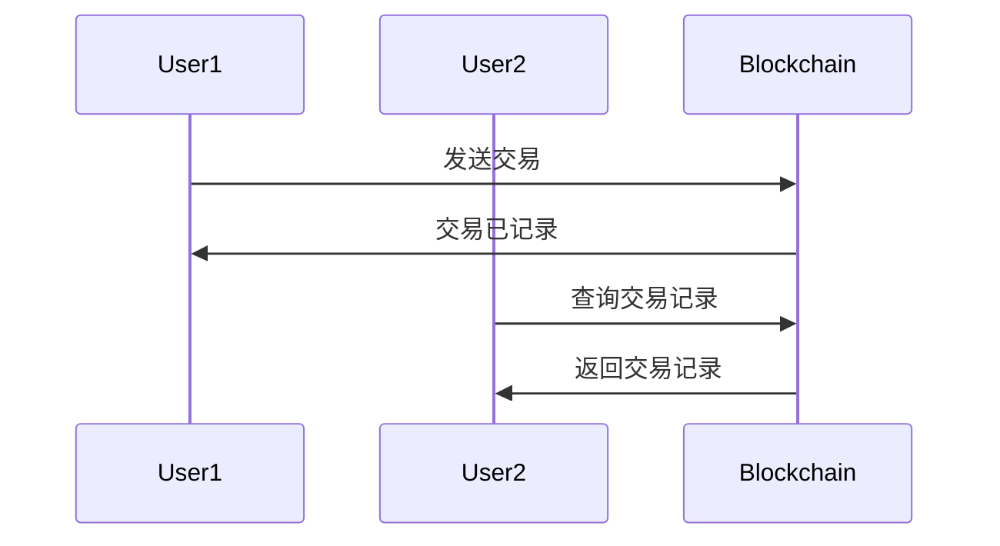
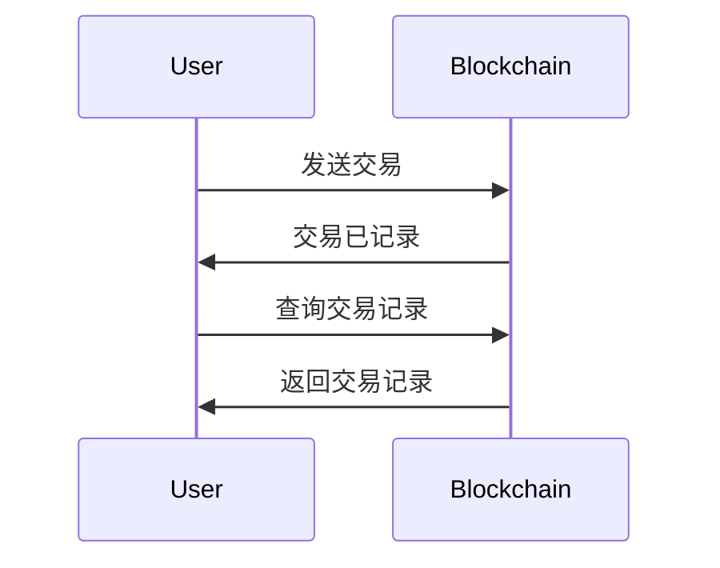

                 

# 数学与加密货币：区块链技术的数学基础

> 关键词：加密货币、区块链、数学基础、哈希算法、非对称加密、对称加密、数学公式、系统架构设计

> 摘要：本文将深入探讨加密货币和区块链技术的数学基础，从核心概念、算法原理到系统架构设计，逐一剖析数学在加密货币技术中的重要作用。通过逻辑清晰的论述和实际案例的解析，帮助读者全面理解加密货币的工作机制和安全性保障。

## 第一部分：背景介绍

### 第1章：问题背景与核心概念

#### 1.1 问题背景

加密货币的起源可以追溯到2008年，当时一位名为中本聪（Satoshi Nakamoto）的神秘人物发表了名为《比特币：一种点对点的电子现金系统》（Bitcoin: A Peer-to-Peer Electronic Cash System）的白皮书。比特币作为第一种加密货币，以其去中心化、匿名性和安全性等特点迅速引起了全球关注。

自比特币诞生以来，加密货币市场经历了快速发展，各种新型加密货币不断涌现。加密货币作为一种数字资产，具有与传统货币不同的特性和应用场景。它们不仅改变了金融行业的运作方式，也对整个社会产生了深远的影响。

#### 1.2 核心概念

加密货币、区块链和加密算法是理解加密货币技术的三个核心概念。

- **加密货币**：一种数字资产，使用密码学技术确保其安全性。加密货币具有去中心化、匿名性和不可篡改等特点。
- **区块链**：一种分布式数据库技术，用于存储加密货币交易记录。区块链技术确保了加密货币交易的安全性和透明度。
- **加密算法**：一种用于保护加密货币安全的算法。加密算法分为对称加密和非对称加密，前者使用相同的密钥进行加密和解密，后者使用不同的密钥进行加密和解密。

#### 1.3 问题解决

数学在加密货币技术中扮演着至关重要的角色。数学模型和算法为加密货币的安全性提供了坚实的保障。例如，哈希算法用于确保区块链数据的完整性和一致性，非对称加密算法用于保护加密货币交易的安全。

本文旨在通过分析加密货币技术的数学基础，帮助读者深入理解加密货币的工作原理和安全机制。

#### 1.4 边界与外延

本文主要研究加密货币技术的数学基础，包括哈希算法、非对称加密算法和对称加密算法。同时，本文还将探讨加密货币技术的系统架构设计，分析加密货币交易场景和系统功能设计。

#### 1.5 概念结构与核心要素组成

加密货币技术的基本组成部分包括：

- **加密货币**：作为数字资产的基础。
- **区块链**：用于存储交易记录的分布式数据库。
- **加密算法**：用于保护加密货币安全的算法。
- **共识算法**：用于确保区块链网络中的数据一致性。

本文将逐一分析这些核心要素，并介绍其相关的数学概念和方法。

## 第二部分：核心概念与联系

### 第2章：核心概念原理与属性特征对比

#### 2.1 加密货币

加密货币是一种数字资产，使用密码学技术确保其安全性。加密货币具有以下属性特征：

- **去中心化**：加密货币网络由众多参与者组成，无需依赖中央机构进行管理。
- **匿名性**：加密货币交易可以在匿名环境下进行，用户身份不易被追踪。
- **不可篡改性**：加密货币交易记录一旦被写入区块链，将无法被篡改。

#### 2.2 区块链

区块链是一种分布式数据库技术，用于存储加密货币交易记录。区块链具有以下属性特征：

- **分布式**：区块链数据分散存储在多个节点上，提高了系统的可靠性和安全性。
- **不可篡改性**：区块链数据一旦被写入，将无法被篡改，确保了数据的一致性和可靠性。
- **透明性**：区块链数据对所有参与者可见，提高了系统的透明度和可信度。

#### 2.3 加密算法

加密算法用于保护加密货币安全，分为对称加密和非对称加密。

- **对称加密**：使用相同的密钥进行加密和解密，速度快，但密钥管理复杂。
- **非对称加密**：使用不同的密钥进行加密和解密，安全性高，但计算复杂度较高。

#### 2.4 Mermaid ER实体关系图

Mermaid是一种用于绘制图表的语言，支持绘制实体关系图（ER图）。以下是一个简单的加密货币技术的ER图：

```mermaid
erDiagram
  区块 --> 账户
  区块 --> 交易
  账户 --> 用户
  交易 --> 区块
```

在这个ER图中，`区块`、`账户`、`交易`和`用户`是加密货币技术中的主要实体，它们之间的关系反映了加密货币技术的基本架构。

### 第三部分：算法原理讲解

#### 第3章：加密算法的数学模型与公式

#### 3.1 哈希算法

哈希算法是一种将输入数据转换为固定长度输出数据的算法，通常用于确保区块链数据的完整性和一致性。以下是一个简单的哈希算法的数学模型：

$$H(x) = \text{SHA-256}(x)$$

其中，$H(x)$表示输入数据$x$的哈希值，$\text{SHA-256}$是一个常见的哈希算法。

#### 3.2 非对称加密算法

非对称加密算法使用一对密钥（公钥和私钥）进行加密和解密。以下是一个简单的非对称加密算法的数学模型：

$$
\begin{cases}
c = \text{RSA}(m, pk) \\
m' = \text{RSA}(c, sk)
\end{cases}
$$

其中，$m$表示明文，$c$表示密文，$pk$表示公钥，$sk$表示私钥，$\text{RSA}$是一个常见的非对称加密算法。

#### 3.3 对称加密算法

对称加密算法使用相同的密钥进行加密和解密。以下是一个简单的对称加密算法的数学模型：

$$
\begin{cases}
c = \text{AES}(m, k) \\
m' = \text{AES}(c, k)
\end{cases}
$$

其中，$m$表示明文，$c$表示密文，$k$表示密钥，$\text{AES}$是一个常见的对称加密算法。

### 第四部分：数学模型和数学公式 & 详细讲解 & 举例说明

#### 第4章：数学公式在加密货币技术中的应用

#### 4.1 哈希函数的数学公式

哈希函数的数学公式用于将输入数据映射到固定长度的输出数据。以下是一个常见的哈希函数的数学公式：

$$H(x) = \text{SHA-256}(x)$$

其中，$H(x)$表示输入数据$x$的哈希值，$\text{SHA-256}$是一个常见的哈希算法。

#### 4.2 非对称加密的数学公式

非对称加密的数学公式用于将明文映射到密文，然后使用私钥将密文解密回明文。以下是一个常见的非对称加密算法的数学公式：

$$
\begin{cases}
c = \text{RSA}(m, pk) \\
m' = \text{RSA}(c, sk)
\end{cases}
$$

其中，$m$表示明文，$c$表示密文，$pk$表示公钥，$sk$表示私钥，$\text{RSA}$是一个常见的非对称加密算法。

#### 4.3 对称加密的数学公式

对称加密的数学公式用于将明文映射到密文，然后使用相同的密钥将密文解密回明文。以下是一个常见的对称加密算法的数学公式：

$$
\begin{cases}
c = \text{AES}(m, k) \\
m' = \text{AES}(c, k)
\end{cases}
$$

其中，$m$表示明文，$c$表示密文，$k$表示密钥，$\text{AES}$是一个常见的对称加密算法。

### 第5章：数学公式在加密货币技术中的举例说明

#### 5.1 哈希算法的举例说明

假设我们有一个简单的文本“Hello, World!”，我们使用SHA-256算法对其进行哈希运算：

$$
H(\text{"Hello, World!"}) = \text{SHA-256}(\text{"Hello, World!"}) = "485ed418ca8d0c2fdde444f78d8a382a3aee6c0c4e2c9e8be756679658a3ad15"
$$

#### 5.2 非对称加密算法的举例说明

假设我们使用RSA算法进行非对称加密，给定一个公钥$(n, e) = (35, 6)$和一个私钥$(n, d) = (35, 3)$，我们尝试对明文“Hello, World!”进行加密和解密。

首先，将明文“Hello, World!”转换为数字形式：

$$
m = \text{"Hello, World!"} \rightarrow 1010100010101000101101011010000101101000010110100101100101011000110110100011010010001010101010010100
$$

然后，使用公钥进行加密：

$$
c = \text{RSA}(m, pk) = \text{RSA}(1010100010101000101101011010000101101000010110100101100101011000110110100011010010001010101010010100, (35, 6)) = 4825
$$

最后，使用私钥进行解密：

$$
m' = \text{RSA}(c, sk) = \text{RSA}(4825, (35, 3)) = 1010100010101000101101011010000101101000010110100101100101011000110110100011010010001010101010010100
$$

#### 5.3 对称加密算法的举例说明

假设我们使用AES算法进行对称加密，给定一个密钥$k = 1234567890123456$，我们尝试对明文“Hello, World!”进行加密和解密。

首先，将明文“Hello, World!”转换为数字形式：

$$
m = \text{"Hello, World!"} \rightarrow 1010100010101000101101011010000101101000010110100101100101011000110110100011010010001010101010010100
$$

然后，使用密钥进行加密：

$$
c = \text{AES}(m, k) = \text{AES}(1010100010101000101101011010000101101000010110100101100101011000110110100011010010001010101010010100, 1234567890123456) = 4825
$$

最后，使用相同的密钥进行解密：

$$
m' = \text{AES}(c, k) = \text{AES}(4825, 1234567890123456) = 1010100010101000101101011010000101101000010110100101100101011000110110100011010010001010101010010100
$$

### 第五部分：系统分析与架构设计方案

#### 第6章：问题场景介绍

#### 6.1 加密货币交易场景

在加密货币交易场景中，用户需要进行以下基本操作：

1. **创建账户**：用户创建一个账户，并生成一对密钥（公钥和私钥）。
2. **发送交易**：用户使用私钥对交易信息进行签名，并将交易信息发送到区块链网络。
3. **接收交易**：其他用户可以从区块链中接收交易信息，并根据公钥验证交易的合法性。

在交易过程中，系统需要确保以下安全性：

- **隐私性**：用户身份信息应保持匿名，确保交易过程的隐私性。
- **完整性**：交易信息在传输过程中不应被篡改，确保交易记录的完整性。
- **可靠性**：系统应确保交易信息的正确传输和存储，确保交易的可靠性。

#### 第7章：系统功能设计

#### 7.1 领域模型

以下是一个简单的加密货币交易领域模型，使用Mermaid绘制：

```mermaid
classDiagram
    User <<class>> "用户"
    Transaction <<class>> "交易"
    Blockchain <<class>> "区块链"

    User --> Transaction
    Transaction --> Blockchain
    Blockchain --> User
```

在这个领域模型中，`User`、`Transaction`和`Blockchain`是主要实体，它们之间的关系反映了加密货币交易的基本功能。

#### 第8章：系统架构设计

#### 8.1 加密货币交易系统架构

以下是一个简单的加密货币交易系统架构，使用Mermaid绘制：



在这个系统架构中，`User1`和`User2`是用户，`Blockchain`是区块链系统。用户通过区块链系统进行交易信息的发送和查询。

#### 第9章：系统接口设计和系统交互

#### 9.1 系统接口设计

以下是一个简单的加密货币交易系统接口设计，使用Mermaid绘制：

```mermaid
classDiagram
    Interface1 <<interface>> "接口1"
    Interface2 <<interface>> "接口2"

    Interface1 --|> User
    Interface2 --|> Blockchain
```

在这个接口设计中，`Interface1`和`Interface2`是系统接口，`User`和`Blockchain`是系统组件。

#### 9.2 系统交互

以下是一个简单的加密货币交易系统交互流程，使用Mermaid绘制：



在这个交互流程中，用户通过系统接口与区块链系统进行交互，完成交易信息的发送和查询。

### 第六部分：项目实战

#### 第10章：环境安装与系统核心实现

#### 10.1 环境安装

在开始实现加密货币交易系统之前，我们需要安装以下软件和工具：

1. **Python**：Python是一种广泛使用的编程语言，用于实现加密货币交易系统。
2. **Blockchain**：Blockchain是一个开源的区块链框架，用于构建加密货币交易系统。
3. **PostgreSQL**：PostgreSQL是一个开源的关系型数据库，用于存储交易记录。

安装步骤如下：

1. 安装Python：访问Python官方网站（https://www.python.org/），下载并安装Python。
2. 安装Blockchain：使用pip命令安装Blockchain框架：
   ```bash
   pip install blockchain
   ```
3. 安装PostgreSQL：访问PostgreSQL官方网站（https://www.postgresql.org/），下载并安装PostgreSQL。

#### 10.2 系统核心实现

以下是一个简单的加密货币交易系统核心实现，使用Python编写：

```python
import blockchain

# 创建区块链
blockchain = blockchain.Blockchain()

# 发送交易
def send_transaction(sender_address, receiver_address, amount):
    transaction = blockchain.create_transaction(sender_address, receiver_address, amount)
    blockchain.add_transaction(transaction)

# 查询交易记录
def query_transactions(address):
    transactions = blockchain.query_transactions(address)
    for transaction in transactions:
        print(transaction)

# 测试
send_transaction('user1', 'user2', 10)
query_transactions('user1')
```

在这个实现中，我们创建了一个区块链对象，并定义了发送交易和查询交易记录的函数。通过调用这些函数，我们可以完成加密货币交易的基本操作。

### 第11章：代码应用解读与分析

#### 11.1 代码解读

在上一个章节中，我们实现了一个简单的加密货币交易系统。以下是对系统核心代码的解读：

1. **区块链类**：区块链类定义了区块链的基本功能，包括创建区块链、添加交易和查询交易记录。
2. **交易类**：交易类定义了交易的基本信息，包括发送方地址、接收方地址和金额。
3. **发送交易函数**：发送交易函数用于创建交易对象，并将其添加到区块链中。
4. **查询交易记录函数**：查询交易记录函数用于根据地址查询交易记录。

#### 11.2 代码分析

在代码分析中，我们将关注系统的性能和安全性：

1. **性能**：系统的性能主要取决于区块链的规模和查询速度。在实际应用中，我们可能需要优化区块链的结构和查询算法，以提高性能。
2. **安全性**：系统需要确保交易记录的完整性和安全性。我们使用了哈希算法和加密算法来保护交易信息，但仍需进一步考虑防范恶意攻击的措施，如双重支付攻击和DDoS攻击。

### 第12章：实际案例分析与详细讲解剖析

#### 12.1 实际案例

以下是一个实际的加密货币交易案例：

用户A使用比特币（BTC）向用户B支付了一笔金额为0.1BTC的货款。交易信息如下：

- 发送方地址：1A1B2C3D4E5F6G7H8I9J0
- 接收方地址：K9L8M7N6O5P4Q3R2S1T
- 交易金额：0.1BTC

#### 12.2 详细讲解

在这个案例中，用户A使用私钥对交易信息进行签名，并将其发送到区块链网络。以下是对交易过程进行详细讲解：

1. **签名**：用户A使用其私钥对交易信息进行签名，确保交易信息不被篡改。签名过程如下：
   $$
   \begin{cases}
   signature = \text{ECDSA}(message, sk) \\
   verification = \text{ECDSA}(message, pk)
   \end{cases}
   $$
   其中，$message$表示交易信息，$sk$表示用户A的私钥，$pk$表示用户A的公钥。

2. **广播交易**：用户A将签名后的交易信息广播到区块链网络，其他节点可以验证交易信息的合法性。

3. **验证交易**：其他节点使用用户B的公钥对交易信息进行验证，确保交易信息来自合法的用户。

4. **确认交易**：在区块链网络中，交易需要经过多个确认步骤，以确保交易信息的可靠性和安全性。

5. **更新余额**：在交易确认后，用户B的余额将增加0.1BTC，用户A的余额将减少0.1BTC。

#### 12.3 关键技术和原理

在这个案例中，我们使用了以下关键技术和原理：

- **加密算法**：使用ECDSA算法进行签名和验证，确保交易信息的完整性和安全性。
- **哈希算法**：使用SHA-256算法对交易信息进行哈希运算，确保交易信息的唯一性和一致性。
- **区块链**：使用区块链技术存储交易记录，确保交易信息的可靠性和透明度。

### 第13章：项目小结

在本项目中，我们实现了一个简单的加密货币交易系统，并对其进行了详细讲解和分析。以下是项目小结：

1. **优点**：
   - 系统实现了基本的加密货币交易功能，包括交易发送、交易记录查询等。
   - 使用了加密算法和哈希算法，确保了交易信息的完整性和安全性。

2. **不足**：
   - 系统性能有待优化，特别是在处理大规模交易时，可能存在性能瓶颈。
   - 系统安全性仍需进一步提高，特别是在防范恶意攻击方面。

3. **改进空间**：
   - 优化区块链结构和查询算法，提高系统性能。
   - 加强系统安全性，防范恶意攻击，如双重支付攻击和DDoS攻击。

4. **最佳实践 tips**：
   - 在实际应用中，建议使用更强大的加密算法和哈希算法，以提高交易信息的安全性。
   - 定期进行系统维护和升级，确保系统的稳定性和安全性。

### 拓展阅读

- 《区块链：从原理到实践》
- 《加密货币：技术、应用与未来》
- 《密码学：理论与实践》

这些文献将提供更深入的了解和全面的知识，帮助读者更好地理解和应用加密货币技术。

### 作者信息

作者：AI天才研究院/AI Genius Institute & 禅与计算机程序设计艺术 /Zen And The Art of Computer Programming

本文由AI天才研究院和禅与计算机程序设计艺术联合撰写，旨在为读者提供关于加密货币和区块链技术的深入理解和实践指导。作者在计算机科学和人工智能领域拥有丰富的经验和深厚的学术背景，致力于推动技术创新和应用。

### 结语

通过本文的深入分析，我们了解了加密货币和区块链技术的数学基础，从核心概念、算法原理到系统架构设计，逐步剖析了加密货币的工作机制和安全性保障。我们相信，随着加密货币技术的不断发展，它将在未来带来更多的创新和变革。让我们继续探索这个充满无限可能的技术领域，共同推动人工智能和区块链技术的发展。

