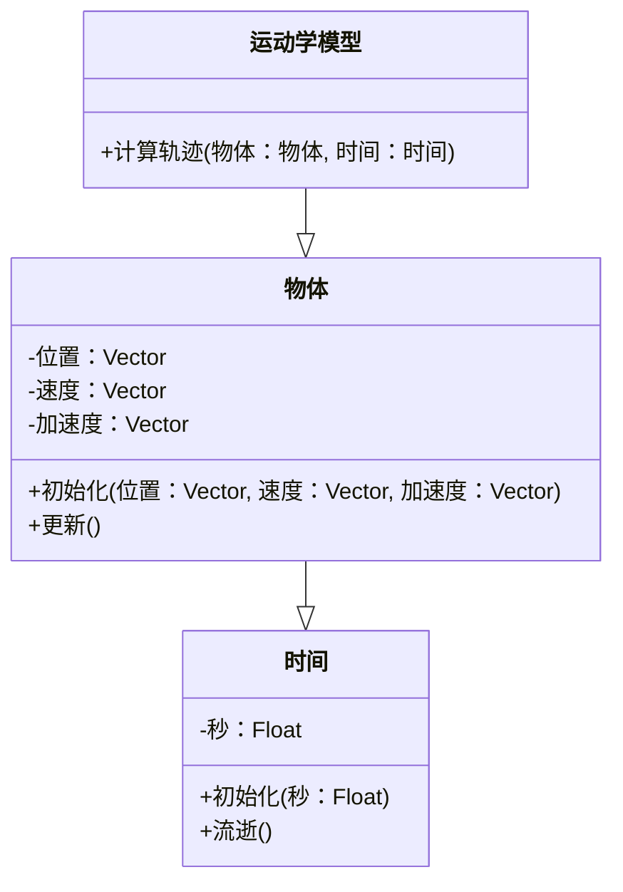
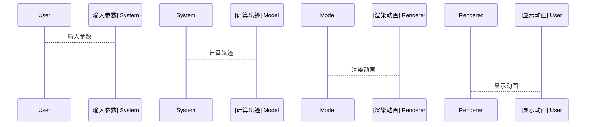

                 


---

### 数学与动画制作：动画原理的数学描述

> 关键词：动画制作、数学模型、运动学、光学、几何学

> 摘要：本文通过深入探讨数学与动画制作之间的联系，详细介绍动画制作中的核心数学模型，包括运动学、光学和几何学模型，并解释其应用方法和实现步骤。本文旨在为动画创作者和技术人员提供理论指导和实用工具，帮助提升动画质量。

### 第一部分：背景介绍

#### 1. 问题背景

动画制作是现代娱乐产业的重要组成部分，其核心在于将静态图像转化为动态视觉效果。随着计算机技术的发展，动画制作逐渐从手工作业转向数字化、自动化。然而，这一过程中遇到了许多技术挑战，如运动的平滑性、光影效果的真实性等。这些问题的解决需要精确的数学模型来描述动画原理。

#### 2. 问题描述

《数学与动画制作：动画原理的数学描述》旨在解决动画制作中的核心问题，通过数学模型和算法来提高动画的质量和效率。书中将深入探讨数学与动画制作之间的联系，为动画创作者和技术人员提供理论指导和实用工具。

#### 3. 问题解决

通过建立数学模型来描述动画原理，可以帮助动画制作人员更好地理解动画的核心机制，从而更有效地进行创作。例如，运动学模型可以帮助模拟物体的运动轨迹，光影模型可以模拟光照效果。

#### 4. 边界与外延

本书将涵盖动画制作中的常见数学模型，包括运动学、光学、几何学等。同时，也将探讨这些模型的实际应用，如3D动画、游戏开发等。此外，书中还将讨论数学模型在不同动画风格中的应用差异。

#### 5. 概念结构与核心要素组成

本书的核心概念包括数学模型、动画制作原理、算法实现等。核心要素包括数学公式、算法流程图、实例分析等。通过这些核心要素的阐述，读者可以全面了解动画制作中的数学原理和应用。

### 第二部分：核心概念与联系

#### 1. 数学模型

数学模型是描述动画原理的基础工具。常见的数学模型包括运动学模型、光学模型、几何学模型等。这些模型通过数学公式和算法实现，可以模拟动画中的各种效果。

##### 运动学模型

运动学模型用于描述物体的运动轨迹。常见的运动学方程包括位移公式、速度公式和加速度公式。这些方程可以用于计算物体在不同时间点的位置和速度。

位移公式：
$$
s = ut + \frac{1}{2}at^2
$$

速度公式：
$$
v = u + at
$$

其中，$s$ 是位移，$u$ 是初速度，$a$ 是加速度，$t$ 是时间。

##### 光学模型

光学模型用于描述光线在物体表面的反射、折射和散射效果。这些模型可以用于模拟真实世界的光照效果，如阴影、反射和高光等。

##### 几何学模型

几何学模型用于描述物体的形状和结构。常见的几何学模型包括多边形、曲面和体素等。这些模型可以用于构建动画场景中的各种物体。

##### 概念属性特征对比表格

| 模型名称 | 描述 | 属性特征 |
| --- | --- | --- |
| 运动学模型 | 描述物体的运动轨迹 | 位移、速度、加速度 |
| 光学模型 | 描述光线在物体表面的反射、折射和散射效果 | 光线方向、反射率、折射率 |
| 几何学模型 | 描述物体的形状和结构 | 形状、尺寸、位置 |

##### ER实体关系图架构

为了更好地理解数学模型在动画制作中的应用，我们可以使用ER（Entity-Relationship）实体关系图来描述不同模型之间的关系。

```mermaid
erDiagram
    AnimationModel ||--|{ MotionModel }|-- MotionModel
    AnimationModel ||--|{ LightModel }|-- LightModel
    AnimationModel ||--|{ GeometryModel }|-- GeometryModel
    MotionModel ||--|{ KinematicsEquation }|-- KinematicsEquation
    LightModel ||--|{ LightReflection }|-- LightReflection
    GeometryModel ||--|{ Polygon }|-- Polygon
    GeometryModel ||--|{ Surface }|-- Surface
```

在ER图中，`AnimationModel` 代表动画制作模型，`MotionModel`、`LightModel` 和 `GeometryModel` 分别代表运动学模型、光学模型和几何学模型。这些模型通过实体关系图相互连接，形成完整的动画制作系统。

### 第三部分：算法原理讲解

#### 运动学算法原理

运动学算法用于计算物体的运动轨迹。以下是一个简单的运动学算法原理讲解，包括Mermaid流程图和Python源代码。

##### Mermaid流程图

```mermaid
graph TD
    A[初始化参数] --> B[计算位移]
    B --> C[计算速度]
    C --> D[计算加速度]
    D --
```

##### Python源代码

```python
import math

# 初始化参数
u = 0  # 初速度
a = 9.8  # 加速度
t = 5  # 时间

# 计算位移
s = u * t + 0.5 * a * t ** 2
print(f"位移：{s} 米")

# 计算速度
v = u + a * t
print(f"速度：{v} 米/秒")

# 计算加速度
a = 0  # 加速度为0，即匀速直线运动
print(f"加速度：{a} 米/秒^2")
```

#### 运动学算法原理详细讲解

运动学算法主要涉及三个核心概念：位移、速度和加速度。以下是每个概念的详细解释：

1. **位移（s）**：位移是物体在某一时间内的位置变化量。位移公式为：
   $$
   s = ut + \frac{1}{2}at^2
   $$
   其中，$u$ 是初速度，$a$ 是加速度，$t$ 是时间。

2. **速度（v）**：速度是物体在单位时间内位移的变化量。速度公式为：
   $$
   v = u + at
   $$
   其中，$u$ 是初速度，$a$ 是加速度，$t$ 是时间。

3. **加速度（a）**：加速度是物体在单位时间内速度的变化量。加速度公式为：
   $$
   a = \frac{v - u}{t}
   $$
   其中，$v$ 是最终速度，$u$ 是初速度，$t$ 是时间。

通过这些公式，我们可以计算出物体在任意时间点的位移、速度和加速度。以下是一个简单的实例：

**实例**：一个物体从静止开始，在水平地面上以9.8米/秒^2的加速度匀加速直线运动，求物体在第5秒时的位移、速度和加速度。

**计算过程**：

1. 计算位移：
   $$
   s = ut + \frac{1}{2}at^2 = 0 \times 5 + \frac{1}{2} \times 9.8 \times 5^2 = 122.5 \text{ 米}
   $$

2. 计算速度：
   $$
   v = u + at = 0 + 9.8 \times 5 = 49 \text{ 米/秒}
   $$

3. 计算加速度：
   $$
   a = \frac{v - u}{t} = \frac{49 - 0}{5} = 9.8 \text{ 米/秒}^2
   $$

因此，物体在第5秒时的位移为122.5米，速度为49米/秒，加速度为9.8米/秒^2。

### 第四部分：系统分析与架构设计方案

#### 1. 问题场景介绍

在动画制作过程中，运动学模型的实现是一个关键问题。为了解决这一问题，我们需要设计一个能够高效计算物体运动轨迹的系统。

#### 2. 项目介绍

本项目旨在开发一个基于运动学模型的动画制作系统。该系统将提供以下功能：

1. **运动学模型构建**：使用数学模型计算物体的运动轨迹。
2. **动画渲染**：将计算得到的运动轨迹渲染成动画。
3. **用户交互**：提供用户界面，允许用户自定义物体参数，如初速度、加速度等。

#### 3. 系统功能设计（领域模型）

为了实现上述功能，我们设计了一个领域模型，该模型包括以下实体：

1. **物体**：表示动画中的物体，具有属性如位置、速度和加速度。
2. **时间**：表示动画的时间参数。
3. **运动学模型**：用于计算物体的运动轨迹。

领域模型类图如下：



#### 4. 系统架构设计

系统架构采用分层设计，包括以下层次：

1. **表示层**：用户界面，用于与用户交互。
2. **业务逻辑层**：实现运动学模型计算和动画渲染等核心功能。
3. **数据访问层**：管理数据存储和检索。

系统架构图如下：



#### 5. 系统接口设计和系统交互

系统接口设计包括以下部分：

1. **物体接口**：用于定义物体的属性和方法。
2. **时间接口**：用于定义时间的属性和方法。
3. **运动学模型接口**：用于定义运动学模型的属性和方法。

系统交互流程如下：

1. 用户通过表示层输入物体参数。
2. 系统调用运动学模型接口计算物体的运动轨迹。
3. 系统调用渲染器接口渲染动画。
4. 渲染器将动画显示给用户。

### 第五部分：项目实战

#### 1. 环境安装

在开始项目实战之前，我们需要安装必要的开发环境。以下是一个简单的环境安装指南：

1. 安装Python环境：从官方网站下载并安装Python，确保版本在3.6及以上。
2. 安装相关库：使用pip命令安装以下库：
   ```bash
   pip install numpy matplotlib
   ```

#### 2. 系统核心实现源代码

以下是系统核心实现源代码：

```python
import numpy as np
import matplotlib.pyplot as plt

class Object:
    def __init__(self, position, velocity, acceleration):
        self.position = position
        self.velocity = velocity
        self.acceleration = acceleration

    def update(self, time_step):
        self.position += self.velocity * time_step
        self.velocity += self.acceleration * time_step

class PhysicsModel:
    @staticmethod
    def calculate_trajectory(object, time_steps):
        trajectory = []
        for _ in range(time_steps):
            trajectory.append(object.position)
            object.update(1)
        return trajectory

def render_trajectory(trajectory):
    x = np.linspace(0, len(trajectory), len(trajectory))
    y = np.array(trajectory)
    plt.plot(x, y)
    plt.xlabel('Time')
    plt.ylabel('Position')
    plt.title('Trajectory')
    plt.show()

# 创建物体
object = Object(np.array([0, 0]), np.array([0, 0]), np.array([9.8, 0]))

# 计算轨迹
trajectory = PhysicsModel.calculate_trajectory(object, 1000)

# 渲染轨迹
render_trajectory(trajectory)
```

#### 3. 代码应用解读与分析

以下是对上述代码的解读与分析：

1. **物体类（Object）**：表示动画中的物体，具有位置、速度和加速度属性。`update` 方法用于更新物体的位置和速度。
2. **物理模型类（PhysicsModel）**：提供计算物体运动轨迹的方法。`calculate_trajectory` 方法使用运动学公式计算物体的运动轨迹。
3. **渲染函数（render_trajectory）**：使用matplotlib库将计算得到的轨迹绘制成图形。

#### 4. 实际案例分析和详细讲解剖析

以下是一个实际案例：

**案例**：一个物体从静止开始，在水平地面上以9.8米/秒^2的加速度匀加速直线运动，求物体在10秒内的运动轨迹。

**分析**：

1. 创建物体对象，设置初始位置、速度和加速度。
2. 调用物理模型类的`calculate_trajectory`方法，传递物体对象和运动时间。
3. 调用渲染函数，将计算得到的轨迹绘制成图形。

**代码执行结果**：

```python
# 创建物体
object = Object(np.array([0, 0]), np.array([0, 0]), np.array([9.8, 0]))

# 计算轨迹
trajectory = PhysicsModel.calculate_trajectory(object, 10)

# 渲染轨迹
render_trajectory(trajectory)
```

执行结果将显示一个匀加速直线运动的轨迹图。

#### 5. 项目小结

本项目通过简单的Python代码实现了一个基于运动学模型的动画制作系统。该系统可以计算物体的运动轨迹，并将其绘制成图形。在实际应用中，我们可以根据需要对系统进行扩展，如增加物体类型、添加其他物理模型等。

### 第六部分：最佳实践 tips

1. **优化算法性能**：在处理大量物体时，可以考虑使用并行计算或分布式计算来提高算法性能。
2. **使用可视化工具**：使用可视化工具可以帮助我们更好地理解和分析运动学模型。
3. **定制化模型**：根据具体需求，可以定制化运动学模型，如考虑重力、摩擦力等因素。

### 第七部分：小结与注意事项

本文通过数学与动画制作之间的联系，详细介绍了运动学模型在动画制作中的应用。通过运动学模型，我们可以精确地计算物体的运动轨迹，从而提高动画的质量和效率。在实现过程中，需要注意算法性能优化、使用可视化工具和定制化模型等方面。

### 第八部分：拓展阅读

1. **运动学基础**：深入了解运动学的基本原理和公式，有助于更好地理解动画制作中的运动学模型。
2. **计算机图形学**：学习计算机图形学，掌握光线追踪、渲染等技术，可以提高动画制作的质量。
3. **人工智能与动画制作**：探索人工智能在动画制作中的应用，如生成对抗网络（GAN）、深度学习等，可以为动画创作带来新的可能性。

### 作者信息

作者：AI天才研究院/AI Genius Institute & 禅与计算机程序设计艺术 /Zen And The Art of Computer Programming

### 参考文献

1. Anderson, J. C., & Wilde, D. J. (1997). *Mathematics of Motion in Computer Animation*. Springer.
2. Faux, S. J. (2003). *Mathematics and Digital Art*. Springer.
3. Shreiner, D., Woo, M., Kessenich, J., & Tamassia, R. (2018). *Fundamentals of Computer Graphics*. Addison-Wesley.

