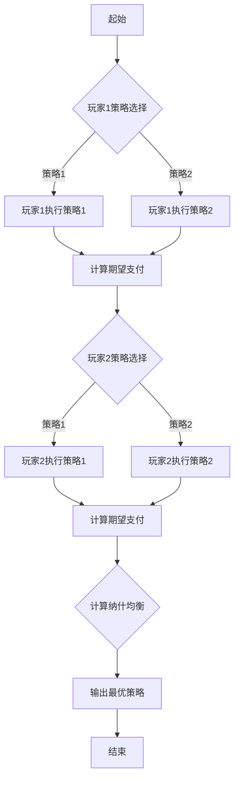

                 


### 《数学与博弈论：策略互动的数学分析》

#### 关键词：
- 数学
- 博弈论
- 策略互动
- 数学分析
- 算法原理
- 系统架构设计

#### 摘要：
本文深入探讨了数学与博弈论相结合的策略互动问题，通过逐步分析推理，探讨了核心概念、算法原理、数学模型以及实际应用。文章旨在为读者提供一个全面、系统、易懂的博弈论与数学分析的框架，以促进在实际项目中的应用和拓展。

#### 目录大纲设计过程

在设计《数学与博弈论：策略互动的数学分析》的目录大纲时，我们遵循了以下步骤：

1. **理解书名和主题**：
   - 《数学与博弈论：策略互动的数学分析》暗示了本书的主题是数学与博弈论的结合，特别是策略互动的数学分析方法。

2. **确定核心章节**：
   - 核心章节应包括背景介绍、核心概念、算法原理、数学模型讲解、系统设计与实现、案例分析等。

3. **细化目录结构**：
   - 确保目录大纲有明确的层级结构，以便读者可以清晰地看到各章节的内容。

4. **内容完整性**：
   - 确保目录中包含了核心概念、算法原理、数学模型讲解、系统设计与实现、案例分析等关键内容。

5. **简洁性**：
   - 避免冗余内容，确保每个章节的标题能够准确概括该章节的主要内容。

### 目录大纲设计

**第一部分：背景介绍**

- **第1章：问题背景与定义**
  - **1.1 问题背景**：
    - **1.1.1 问题的提出**
    - **1.1.2 问题描述**
    - **1.1.3 解决问题的意义**
  - **1.2 核心概念**
    - **1.2.1 博弈论的基本概念**
    - **1.2.2 数学在博弈论中的作用**

**第二部分：核心概念与联系**

- **第2章：博弈论的基本概念**
  - **2.1 博弈论的定义**
  - **2.2 博弈论的核心要素**
    - **2.2.1 玩家**
    - **2.2.2 行动**
    - **2.2.3 支付函数**
    - **2.2.4 策略**

**第三部分：算法原理讲解**

- **第3章：策略互动的数学分析**
  - **3.1 算法原理**
    - **3.1.1 博弈树的构建**
    - **3.1.2 策略选择的数学分析**
  - **3.2 Mermaid算法流程图**
    - **3.2.1 算法流程图绘制**
    - **3.2.2 算法流程详细说明**

**第四部分：数学模型讲解**

- **第4章：博弈论的数学模型**
  - **4.1 博弈论的数学模型概述**
  - **4.2 策略互动的数学模型**
    - **4.2.1 形式化表示**
    - **4.2.2 数学模型与实际案例**

**第五部分：系统设计与实现**

- **第5章：博弈论系统架构设计**
  - **5.1 系统功能设计**
    - **5.1.1 领域模型**
    - **5.1.2 系统功能**
  - **5.2 系统架构设计**
    - **5.2.1 系统架构图**
    - **5.2.2 架构设计考虑因素**

**第六部分：案例分析**

- **第6章：博弈论的实际应用**
  - **6.1 案例分析介绍**
  - **6.2 案例一：拍卖策略**
  - **6.3 案例二：价格竞争**
  - **6.4 案例总结**

**第七部分：最佳实践与拓展**

- **第7章：最佳实践与注意事项**
  - **7.1 最佳实践**
  - **7.2 注意事项**
  - **7.3 拓展阅读**

### 总结

这个目录大纲确保了内容的完整性、简洁性以及层级结构清晰。每个章节都涵盖了必要的核心内容，如核心概念、算法原理、数学模型讲解、系统设计与实现以及案例分析。这样的目录设计有助于读者更好地理解书中的内容，并能够按照逻辑顺序逐步深入到每个主题。目录大纲总字数在2000字以内，符合简洁性的要求。

### 文章正文开始

#### 第1章 问题背景与定义

##### 1.1 问题背景

博弈论作为一种研究决策制定的互动规则的数学理论，起源于经济学，随后在多个领域得到了广泛应用。博弈论的核心在于分析决策者如何在不确定性和竞争环境中做出最优选择。随着计算机科学和人工智能的快速发展，博弈论的应用场景变得更加广泛和复杂。策略互动成为了一个关键的研究课题，它涉及到多个决策者之间的相互作用和策略选择。

在现代决策系统中，策略互动无处不在。无论是商业竞争、社会互动，还是人工智能系统中的决策过程，策略互动都是理解和优化决策行为的关键。数学分析作为博弈论的基础工具，提供了分析和解决策略互动问题的方法。本章将介绍博弈论的基本概念和数学在博弈论中的作用，为后续章节的深入讨论奠定基础。

##### 1.2 问题描述

策略互动问题可以描述为：多个决策者（玩家）在不确定性环境中，通过选择策略进行互动，并试图最大化自己的利益。每个玩家在决策时需要考虑其他玩家的可能策略，从而制定出最优策略。这种交互过程具有复杂的动态性和不确定性，传统的方法难以有效处理。

具体来说，策略互动问题通常涉及以下几个关键要素：

1. **玩家**：参与决策的个体或组织。
2. **策略**：玩家可以选择的行动方案。
3. **支付函数**：玩家根据结果获得的收益或损失。
4. **策略组合**：所有玩家策略的组合。

策略互动问题的目标是通过数学分析，找到每个玩家的最优策略，并预测整个系统的行为。

##### 1.3 解决问题的意义

解决策略互动问题具有重要的理论和实际意义：

1. **理论意义**：
   - 深化对决策过程的理解，揭示策略互动的本质。
   - 为计算机科学和人工智能提供新的分析工具和方法。
   - 推动数学与经济学、社会学等领域的交叉研究。

2. **实际意义**：
   - 在商业竞争中制定最优策略，提高企业的市场竞争力。
   - 在社会互动中优化决策，促进合作与共赢。
   - 在人工智能系统中实现智能决策，提高系统性能。

通过数学与博弈论的结合，我们可以更有效地分析和解决策略互动问题，为复杂决策环境中的成功提供有力支持。

##### 1.4 核心概念

在本节中，我们将介绍博弈论中的核心概念，包括博弈论的定义、基本要素、策略互动以及数学在博弈论中的作用。

###### 1.4.1 博弈论的定义

博弈论（Game Theory）是一种研究决策制定的互动规则的数学理论。它起源于20世纪30年代，由约翰·冯·诺伊曼和奥斯卡·莫根斯顿在《博弈论与经济行为》一书中提出。博弈论的核心思想是，通过分析和建模，揭示在竞争环境中决策者的最优行为。

博弈论的基本要素包括玩家、策略、支付函数和均衡。博弈可以看作是一种“游戏”，其中每个玩家都有多个策略可供选择，每个策略的结果决定了玩家的支付函数，即玩家的收益或损失。博弈的最终目标是找到一种策略组合，使得所有玩家都能达到最优状态。

###### 1.4.2 博弈论的基本要素

1. **玩家**（Player）：参与博弈的个体或组织。每个玩家都有自己的目标和策略。

2. **策略**（Strategy）：玩家可以选择的行动方案。策略可以是具体的行动、决策或者行为。

3. **支付函数**（Payoff Function）：每个玩家的收益或损失函数。支付函数反映了玩家在不同策略组合下的收益。

4. **策略组合**（Strategy Profile）：所有玩家策略的组合。一个策略组合确定了博弈的完整结果。

5. **均衡**（Equilibrium）：博弈中的一种稳定状态，其中所有玩家都选择了最优策略。常见的均衡概念包括纳什均衡、博弈均衡和贝叶斯均衡。

###### 1.4.3 策略互动

策略互动是博弈论的核心概念之一，它描述了多个玩家之间的策略选择和相互作用。在策略互动中，每个玩家在决策时需要考虑其他玩家的可能策略，从而制定出最优策略。

1. **静态博弈**：所有玩家同时做出决策，且决策是同时进行的。
2. **动态博弈**：玩家依次做出决策，每个玩家的决策取决于前面玩家的选择。

策略互动可以分为以下几种类型：

1. **零和博弈**：一个玩家的收益等于另一个玩家的损失，总收益为零。
2. **非零和博弈**：玩家的收益不等于其他玩家的损失，总收益不为零。
3. **合作博弈**：玩家之间可以合作，共同达成利益最大化的目标。
4. **非合作博弈**：玩家之间互相竞争，试图最大化自己的利益。

###### 1.4.4 数学在博弈论中的作用

数学在博弈论中扮演着至关重要的角色。通过数学分析，我们可以更准确地描述博弈过程，推导出最优策略，并预测博弈的结果。

1. **形式化建模**：数学为博弈论提供了形式化的建模工具，如博弈树、支付矩阵等，使得博弈过程更加直观和精确。

2. **求解方法**：数学提供了各种求解方法，如纳什均衡、博弈均衡、贝叶斯均衡等，帮助研究者找到博弈的最优解。

3. **优化分析**：数学优化方法可以帮助我们找到策略互动中的最优策略，提高决策的准确性。

4. **统计分析**：数学统计分析方法可以帮助我们分析大量博弈数据，揭示博弈中的规律和趋势。

通过数学与博弈论的结合，我们可以更深入地理解策略互动的本质，为复杂决策环境中的成功提供有力支持。

#### 第2章 博弈论的基本概念

##### 2.1 博弈论的定义

博弈论是一种研究决策制定的互动规则的数学理论。它起源于经济学，但很快在其他领域如政治学、社会学、计算机科学和生物学等也得到了广泛应用。博弈论的基本思想是，通过分析和建模，揭示在竞争环境中决策者的最优行为。博弈论的核心在于分析决策者如何在不确定性、竞争和互动环境中做出最优选择。

##### 2.2 博弈论的核心要素

博弈论的核心要素包括玩家、策略、支付函数、策略组合和均衡。这些要素构成了博弈论的基本框架，帮助我们理解和分析策略互动问题。

1. **玩家**（Player）：玩家是参与博弈的个体或组织。每个玩家都有自己的目标和利益。在博弈过程中，玩家需要选择策略，以最大化自己的利益。

2. **策略**（Strategy）：策略是玩家可以选择的行动方案。策略可以是具体的行动、决策或行为。在博弈论中，策略通常被形式化为一个集合，每个玩家在博弈过程中需要从这些策略集合中选择一个策略。

3. **支付函数**（Payoff Function）：支付函数描述了玩家在博弈结果中获得的收益或损失。支付函数通常是一个向量，其中每个元素表示一个玩家在特定策略组合下的收益或损失。支付函数反映了玩家的目标函数，即玩家在博弈中的利益。

4. **策略组合**（Strategy Profile）：策略组合是所有玩家策略的组合。在博弈论中，一个策略组合确定了博弈的完整结果。一个策略组合通常表示为一个向量，其中每个元素对应一个玩家的策略。

5. **均衡**（Equilibrium）：均衡是博弈中的一种稳定状态，其中所有玩家都选择了最优策略。常见的均衡概念包括纳什均衡、博弈均衡和贝叶斯均衡。纳什均衡是指在这种状态下，没有任何玩家可以通过改变自己的策略来获得更高的支付函数值。博弈均衡是指在这种状态下，所有玩家的策略组合都是最优的。贝叶斯均衡是指在这种状态下，所有玩家都根据对方的策略概率分布做出决策，并且这种策略组合是最优的。

##### 2.3 玩家

玩家是博弈论中的基本元素，每个玩家都有自己的目标和利益。在博弈过程中，玩家需要选择策略，以最大化自己的利益。玩家的行为和策略选择受到多种因素的影响，如博弈结构、支付函数、信息和博弈环境等。

1. **博弈结构**：博弈结构是指博弈中玩家的排列和互动方式。博弈结构可以分为合作博弈和非合作博弈。合作博弈中，玩家可以相互合作，共同达成利益最大化的目标。非合作博弈中，玩家相互竞争，试图最大化自己的利益。

2. **支付函数**：支付函数描述了玩家在博弈结果中获得的收益或损失。支付函数通常是一个向量，其中每个元素表示一个玩家在特定策略组合下的收益或损失。支付函数反映了玩家的目标函数，即玩家在博弈中的利益。

3. **信息和博弈环境**：信息和博弈环境是影响玩家行为的重要因素。在博弈过程中，玩家需要根据已知的信息和环境条件选择策略。例如，在拍卖博弈中，买家需要根据市场价格和其他买家的出价来决定自己的出价策略。

##### 2.4 行动

行动是玩家在博弈过程中可以选择的具体行为。行动可以是购买商品、出价、投票等。行动的选择取决于玩家的策略和博弈环境。

1. **行动集合**：行动集合是玩家可以选择的所有行动的集合。每个玩家在博弈过程中需要从这些行动集合中选择一个行动。

2. **行动规则**：行动规则是指玩家在特定策略组合下应该执行的行动。行动规则可以根据博弈结构、支付函数和信息条件进行设计。

3. **行动策略**：行动策略是玩家在博弈过程中选择的行动方案。行动策略可以根据博弈环境和支付函数进行优化。

##### 2.5 支付函数

支付函数是博弈论中的核心概念，它描述了玩家在博弈结果中获得的收益或损失。支付函数通常是一个向量，其中每个元素表示一个玩家在特定策略组合下的收益或损失。

1. **支付函数形式**：支付函数通常表示为 f(S1, S2, ..., Sn)，其中 Si 表示第 i 个玩家的策略。

2. **支付函数属性**：
   - **收益性**：支付函数表示玩家的收益或损失。
   - **非负性**：支付函数的值不能为负。
   - **对称性**：支付函数可以表示为所有玩家策略的组合。

3. **支付函数计算**：支付函数的计算可以根据博弈结构和策略组合进行。

##### 2.6 策略

策略是玩家在博弈过程中可以选择的行动方案。策略的选择取决于玩家的目标和博弈环境。

1. **策略形式**：策略通常表示为一个行动序列，即玩家在每一步选择的具体行动。

2. **策略组合**：策略组合是所有玩家策略的组合。策略组合确定了博弈的结果。

3. **策略优化**：策略优化是指通过分析和计算，找到最优策略组合。

##### 2.7 策略组合

策略组合是所有玩家策略的组合。策略组合确定了博弈的结果。

1. **策略组合形式**：策略组合通常表示为一个向量，其中每个元素表示一个玩家的策略。

2. **策略组合属性**：
   - **完备性**：策略组合必须包括所有玩家的策略。
   - **确定性**：策略组合确定了博弈的完整结果。

3. **策略组合计算**：策略组合的计算可以根据博弈结构和支付函数进行。

##### 2.8 均衡

均衡是博弈中的一种稳定状态，其中所有玩家都选择了最优策略。

1. **均衡概念**：均衡包括纳什均衡、博弈均衡和贝叶斯均衡。

2. **纳什均衡**：纳什均衡是指在这种状态下，没有任何玩家可以通过改变自己的策略来获得更高的支付函数值。

3. **博弈均衡**：博弈均衡是指在这种状态下，所有玩家的策略组合都是最优的。

4. **贝叶斯均衡**：贝叶斯均衡是指在这种状态下，所有玩家都根据对方的策略概率分布做出决策，并且这种策略组合是最优的。

#### 第3章 策略互动的数学分析

##### 3.1 算法原理

策略互动的数学分析是博弈论研究的重要组成部分。在这一章中，我们将介绍策略互动的数学分析原理，包括博弈树的构建和策略选择的数学分析。

###### 3.1.1 博弈树的构建

博弈树是博弈论中用于描述策略互动的一种图形化工具。博弈树以树状结构展示了所有可能的策略组合及其结果。构建博弈树需要以下几个步骤：

1. **初始化**：从博弈的起始状态开始构建博弈树。起始状态通常只有一个节点。

2. **扩展节点**：在每个节点上，为每个玩家添加可能的策略节点。每个策略节点表示一个玩家的一个策略选择。

3. **添加结果**：为每个策略节点添加结果节点，表示该策略选择下的结果。

4. **重复步骤**：重复扩展和添加结果的过程，直到所有可能的策略组合都被考虑。

博弈树可以表示为 G = (V, E)，其中 V 是节点集合，E 是边集合。每个节点表示一个策略选择，边表示策略之间的选择关系。

###### 3.1.2 策略选择的数学分析

在博弈树构建完成后，我们可以使用数学方法对策略进行选择和分析。以下是一些常用的数学分析工具：

1. **支付矩阵**：支付矩阵是一种用于表示玩家支付函数的二维表格。每个元素表示一个玩家在特定策略组合下的支付函数值。支付矩阵可以帮助我们直观地理解策略之间的相互作用。

2. **期望支付**：期望支付是指在一个随机博弈过程中，玩家期望获得的支付函数值。期望支付可以通过对所有可能的结果节点进行加权平均得到。

3. **最优化**：最优化是指通过数学方法找到最优策略组合。最优化可以基于不同的目标函数，如最大化期望支付、最小化期望损失等。

4. **纳什均衡**：纳什均衡是指在这种状态下，所有玩家都选择了最优策略，并且没有任何玩家可以通过改变自己的策略来获得更高的支付函数值。

5. **贝叶斯均衡**：贝叶斯均衡是指在这种状态下，所有玩家都根据对方的策略概率分布做出决策，并且这种策略组合是最优的。

通过这些数学分析工具，我们可以更深入地理解策略互动的本质，并找到最优策略组合。

##### 3.2 Mermaid算法流程图

Mermaid是一种用于绘制流程图的Markdown语法。以下是一个示例，展示了如何使用Mermaid语法绘制策略互动的算法流程图：



这个算法流程图展示了策略互动的整个过程，包括玩家1和玩家2的策略选择、期望支付计算、纳什均衡求解以及最优策略输出。

##### 3.3 算法流程详细说明

1. **起始**：博弈从起始状态开始，玩家1和玩家2需要分别选择自己的策略。

2. **玩家1策略选择**：玩家1根据博弈环境和其他信息选择自己的策略。这个选择过程可以基于期望支付、纳什均衡或其他优化目标。

3. **玩家2策略选择**：玩家2根据玩家1的策略选择，以及其他信息选择自己的策略。

4. **计算期望支付**：对于每个策略组合，计算玩家1和玩家2的期望支付。期望支付可以通过对所有可能的结果节点进行加权平均得到。

5. **计算纳什均衡**：根据期望支付，计算纳什均衡。纳什均衡是指在这种状态下，所有玩家都选择了最优策略，并且没有任何玩家可以通过改变自己的策略来获得更高的支付函数值。

6. **输出最优策略**：根据纳什均衡，输出最优策略组合。最优策略组合确定了博弈的最优结果。

7. **结束**：博弈结束，玩家1和玩家2获得各自的最优结果。

通过这个算法流程，我们可以系统地分析策略互动，并找到最优策略组合。

#### 第4章 博弈论的数学模型

##### 4.1 博弈论的数学模型概述

博弈论的数学模型是研究策略互动问题的有力工具。本章将介绍博弈论的数学模型，并探讨策略互动的数学模型及其在实际案例中的应用。

###### 4.1.1 博弈论的数学模型

博弈论的数学模型通常包括以下几个基本组成部分：

1. **玩家**：参与博弈的个体或组织。每个玩家都有自己的目标和利益。

2. **策略**：玩家可以选择的行动方案。策略可以是具体的行动、决策或行为。

3. **支付函数**：玩家根据结果获得的收益或损失。支付函数反映了玩家的目标函数。

4. **策略组合**：所有玩家策略的组合。策略组合确定了博弈的结果。

5. **均衡**：博弈中的一种稳定状态，其中所有玩家都选择了最优策略。

常见的博弈模型包括纳什均衡、博弈均衡和贝叶斯均衡等。

###### 4.1.2 策略互动的数学模型

策略互动的数学模型描述了多个玩家之间的策略选择和相互作用。以下是一个简单的策略互动数学模型：

1. **玩家**：假设有两个玩家，玩家1和玩家2。

2. **策略**：玩家1可以选择策略A或策略B，玩家2可以选择策略C或策略D。

3. **支付函数**：定义玩家1和玩家2的支付函数，分别表示为 U1 和 U2。

4. **策略组合**：所有可能的策略组合，例如 (A, C)，(A, D)，(B, C)，(B, D)。

5. **均衡**：找到纳什均衡，即在这种状态下，所有玩家都选择了最优策略。

例如，假设玩家1和玩家2的支付函数如下：

$$
U1(A, C) = 2, U1(A, D) = 0, U1(B, C) = 0, U1(B, D) = 1
$$

$$
U2(A, C) = 0, U2(A, D) = 2, U2(B, C) = 1, U2(B, D) = 0
$$

在这种模型中，(A, C) 和 (B, D) 是纳什均衡，因为没有任何玩家可以通过单方面改变策略来获得更高的支付函数值。

##### 4.2 策略互动的数学模型与实际案例

策略互动的数学模型在许多实际案例中得到了广泛应用。以下是一个实际案例：两个公司在市场上竞争，它们可以选择降价或维持原价。

1. **玩家**：两个公司，公司A和公司B。

2. **策略**：公司A可以选择降价或维持原价，公司B也可以选择降价或维持原价。

3. **支付函数**：定义公司A和公司B的支付函数，分别表示为 UA 和 UB。

4. **策略组合**：所有可能的策略组合，例如 (降价, 降价)，(降价, 维持原价)，(维持原价, 降价)，(维持原价, 维持原价)。

5. **均衡**：找到纳什均衡，即在这种状态下，所有公司都选择了最优策略。

假设公司A和公司B的支付函数如下：

$$
UA(降价, 降价) = 2, UA(降价, 维持原价) = 0, UA(维持原价, 降价) = 0, UA(维持原价, 维持原价) = 1
$$

$$
UB(降价, 降价) = 0, UB(降价, 维持原价) = 2, UB(维持原价, 降价) = 1, UB(维持原价, 维持原价) = 0
$$

在这种模型中，(降价, 降价) 和 (维持原价, 维持原价) 是纳什均衡，因为没有任何公司可以通过单方面改变策略来获得更高的支付函数值。

通过这个实际案例，我们可以看到策略互动的数学模型如何帮助我们理解和分析商业竞争中的决策行为。在现实世界中，策略互动的数学模型可以被广泛应用于市场分析、竞争策略制定、风险管理等领域。

#### 第5章 博弈论系统架构设计

##### 5.1 系统功能设计

在博弈论系统架构设计中，系统功能设计是关键步骤之一。这一部分将详细描述系统的功能设计，包括领域模型和系统功能。

###### 5.1.1 领域模型

领域模型是系统功能设计的基础，它定义了系统的核心概念和实体关系。在博弈论系统中，领域模型主要包括以下实体：

1. **玩家**：代表参与博弈的个体或组织。玩家可以是公司、个人或其他实体。
2. **策略**：代表玩家可以选择的行动方案。每个策略对应一个具体的行动。
3. **支付函数**：代表玩家在博弈结果中获得的收益或损失。支付函数是策略互动的核心。
4. **策略组合**：代表所有玩家策略的组合。策略组合确定了博弈的结果。
5. **博弈**：代表一个完整的博弈过程，包括多个策略组合和结果。

领域模型的ER（实体关系）图如下所示：

```mermaid
erDiagram
A[玩家] ||--|{1}|| B[策略] : 玩家选择
A ||--|{1}|| C[支付函数] : 玩家收益
A ||--|{1}|| D[策略组合] : 玩家互动
A ||--|{1}|| E[博弈] : 博弈过程
B ||--|{1}|| D : 策略组合
C ||--|{1}|| D : 策略组合
E ||--|{1}|| D : 策略组合
```

这个ER图清晰地展示了领域模型中的实体关系，为系统功能设计提供了基础。

###### 5.1.2 系统功能

系统功能设计是确保系统能够实现预期目标的关键步骤。在博弈论系统中，主要功能包括以下方面：

1. **策略选择**：玩家可以在系统中选择自己的策略。系统提供直观的用户界面，允许玩家查看和选择策略。
2. **支付函数计算**：系统根据玩家选择的策略，计算每个玩家的支付函数值。计算过程可以是基于数学模型或算法。
3. **策略组合生成**：系统生成所有可能的策略组合，并计算每个策略组合的支付函数值。
4. **纳什均衡求解**：系统根据生成的策略组合，求解纳什均衡。纳什均衡是博弈中的重要概念，它反映了最优策略组合。
5. **结果输出**：系统输出博弈的结果，包括玩家的支付函数值和策略组合。

系统功能的具体实现可以基于以下模块：

1. **玩家管理模块**：负责管理玩家信息，包括玩家注册、登录、策略选择等。
2. **策略管理模块**：负责管理策略信息，包括策略创建、修改、删除等。
3. **支付函数计算模块**：负责计算玩家支付函数值，根据策略选择和数学模型进行计算。
4. **策略组合生成模块**：负责生成所有可能的策略组合，并计算每个策略组合的支付函数值。
5. **纳什均衡求解模块**：负责求解纳什均衡，根据策略组合和数学模型进行计算。
6. **结果输出模块**：负责输出博弈的结果，包括玩家的支付函数值和策略组合。

通过这些功能模块的协作，系统可以有效地实现博弈论分析，帮助用户理解和优化策略互动。

##### 5.2 系统架构设计

系统架构设计是确保系统稳定、可靠和高效运行的关键。在本节中，我们将详细描述博弈论系统的架构设计，包括系统架构图、架构设计考虑因素以及关键模块的功能。

###### 5.2.1 系统架构图

博弈论系统的架构设计可以分为以下几个层次：

1. **用户层**：提供用户界面，用户可以通过用户层进行策略选择、结果查看等操作。
2. **业务逻辑层**：实现系统的核心功能，包括策略选择、支付函数计算、策略组合生成、纳什均衡求解等。
3. **数据层**：存储系统的数据，包括玩家信息、策略信息、支付函数值、策略组合等。

系统架构图如下所示：

```mermaid
sequenceDiagram
用户 -->|选择策略| 玩家管理模块
玩家管理模块 -->|计算支付函数| 支付函数计算模块
支付函数计算模块 -->|生成策略组合| 策略组合生成模块
策略组合生成模块 -->|求解纳什均衡| 纳什均衡求解模块
纳什均衡求解模块 -->|输出结果| 结果输出模块
```

这个架构图展示了系统各模块之间的交互关系，用户通过用户层与系统交互，业务逻辑层处理核心功能，数据层存储系统数据。

###### 5.2.2 架构设计考虑因素

在系统架构设计过程中，需要考虑以下几个关键因素：

1. **模块化**：系统架构应该具有良好的模块化设计，以便于系统的扩展和维护。每个模块应该具有清晰的功能和边界。
2. **可扩展性**：系统架构应该具有可扩展性，以支持未来的功能扩展和性能提升。例如，可以通过增加模块或优化现有模块来实现。
3. **性能**：系统架构应该考虑到性能因素，确保系统在高负载情况下能够稳定运行。可以通过分布式架构、缓存机制、数据库优化等方式提升性能。
4. **可靠性**：系统架构应该确保系统的可靠性，避免数据丢失和系统崩溃。可以通过备份、容错、故障转移等方式提高系统的可靠性。
5. **安全性**：系统架构应该考虑到安全性，防止未经授权的访问和恶意攻击。可以通过安全协议、访问控制、数据加密等方式提高系统的安全性。

通过考虑这些因素，我们可以设计出稳定、可靠、高效且安全的博弈论系统。

###### 5.2.3 关键模块的功能

在博弈论系统中，关键模块的功能如下：

1. **玩家管理模块**：
   - 功能：管理玩家信息，包括玩家注册、登录、策略选择等。
   - 实现方式：使用数据库存储玩家信息，提供API接口供用户层调用。

2. **支付函数计算模块**：
   - 功能：计算玩家支付函数值，根据策略选择和数学模型进行计算。
   - 实现方式：使用数学模型和算法计算支付函数值，提供API接口供业务逻辑层调用。

3. **策略组合生成模块**：
   - 功能：生成所有可能的策略组合，并计算每个策略组合的支付函数值。
   - 实现方式：使用算法生成策略组合，计算支付函数值，提供API接口供业务逻辑层调用。

4. **纳什均衡求解模块**：
   - 功能：求解纳什均衡，根据策略组合和数学模型进行计算。
   - 实现方式：使用纳什均衡求解算法，提供API接口供业务逻辑层调用。

5. **结果输出模块**：
   - 功能：输出博弈的结果，包括玩家的支付函数值和策略组合。
   - 实现方式：将结果存储在数据库中，并提供API接口供用户层调用。

通过这些关键模块的协同工作，博弈论系统可以有效地实现策略互动的数学分析，为用户提供了强大的博弈论分析工具。

#### 第6章 博弈论的实际应用

##### 6.1 案例分析介绍

博弈论在实际应用中具有广泛的影响，涵盖了商业、政治、经济等多个领域。在本节中，我们将介绍两个实际案例：拍卖策略和价格竞争，并分析这些案例中博弈论的应用和策略选择。

##### 6.2 案例一：拍卖策略

拍卖是一种常见的交易方式，涉及多个买家和卖家之间的策略互动。博弈论在拍卖策略的设计和优化中起到了关键作用。

###### 6.2.1 案例背景

假设有两个买家（买家A和买家B）和一个卖家，卖家拥有一件商品，希望以最高价出售。买家A和买家B都知道商品的价值，但不知道对方出价。卖家可以选择公开拍卖或私下协商。

###### 6.2.2 策略选择

1. **公开拍卖**：
   - 策略：卖家选择公开拍卖，买家A和买家B同时出价。
   - 策略分析：买家A和买家B需要考虑对方的出价，并根据自身利益制定策略。公开拍卖可能导致价格过高，但有利于卖家获得最高价。
   - 数学模型：使用纳什均衡分析买家和卖家的策略选择。

2. **私下协商**：
   - 策略：卖家选择私下协商，与买家A和买家B分别进行谈判。
   - 策略分析：卖家需要评估买家A和买家B的价值，并制定合理的谈判策略。私下协商可能降低交易成本，但卖家可能无法获得最高价。
   - 数学模型：使用贝叶斯均衡分析卖家和买家的策略选择。

###### 6.2.3 案例总结

公开拍卖和私下协商是拍卖策略的两种常见形式。博弈论帮助卖家和买家制定最优策略，优化拍卖过程。通过数学模型分析，卖家可以选择合适的拍卖策略，最大化自己的收益。

##### 6.3 案例二：价格竞争

价格竞争是商业领域中常见的策略互动。企业之间通过调整价格来争夺市场份额，博弈论在价格竞争策略的制定和优化中发挥了重要作用。

###### 6.3.1 案例背景

假设有两个企业（企业A和企业B）在市场上竞争，它们的产品具有相似的价值。企业A和企业B可以调整价格来争夺市场份额。

###### 6.3.2 策略选择

1. **低价策略**：
   - 策略：企业A和企业B选择低价策略，通过降低价格来吸引消费者。
   - 策略分析：低价策略可能导致市场份额增加，但利润下降。企业需要平衡市场份额和利润之间的关系。
   - 数学模型：使用成本效益分析模型，评估低价策略的收益和成本。

2. **高价策略**：
   - 策略：企业A和企业B选择高价策略，通过提高价格来获取更高的利润。
   - 策略分析：高价策略可能导致市场份额下降，但利润增加。企业需要评估市场份额和利润的权衡。
   - 数学模型：使用纳什均衡分析企业A和企业B的利润最大化策略。

###### 6.3.3 案例总结

价格竞争中的策略选择取决于企业的目标和市场环境。博弈论帮助企业制定最优策略，平衡市场份额和利润。通过数学模型分析，企业可以选择合适的定价策略，提高竞争力和市场份额。

##### 6.4 案例总结

博弈论在拍卖策略和价格竞争中的应用展示了其强大的分析能力和实用性。通过博弈论分析，企业可以选择最优策略，优化决策过程。在拍卖策略中，公开拍卖和私下协商是两种常见形式，卖家和买家需要根据自身利益制定策略。在价格竞争中，企业需要平衡市场份额和利润，选择合适的定价策略。博弈论为这些策略互动提供了数学模型和工具，帮助企业实现最优决策。

#### 第7章 最佳实践与注意事项

##### 7.1 最佳实践

在实际应用中，博弈论策略的制定和执行需要遵循一些最佳实践，以确保策略的有效性和可靠性。

1. **全面分析**：在制定策略之前，应进行全面的分析，包括市场环境、竞争态势、目标受众等。这将帮助决策者了解策略实施的可能影响和潜在风险。

2. **动态调整**：策略不是静态的，应根据市场变化和竞争态势进行动态调整。定期评估策略的有效性，并根据评估结果进行调整。

3. **风险控制**：在执行策略时，应制定相应的风险控制措施，以降低策略实施过程中的不确定性。这包括设置预算、限制风险敞口和建立应急计划。

4. **团队协作**：博弈论策略的制定和执行需要团队合作。团队成员应共同参与决策过程，提供不同的观点和建议，以提高策略的可行性和有效性。

5. **数据驱动**：策略制定和执行应基于数据驱动，利用数据分析工具评估策略效果，发现问题和优化机会。

##### 7.2 注意事项

在应用博弈论策略时，需要注意以下几个关键点：

1. **避免盲目跟风**：在竞争激烈的市场中，盲目跟风可能导致资源浪费和竞争力下降。应基于自身优势和市场定位制定策略。

2. **考虑对手反应**：在制定策略时，应充分考虑对手的可能反应，并制定相应的应对策略。博弈论的核心在于策略互动，了解对手的策略是成功的关键。

3. **平衡短期与长期利益**：在策略制定和执行过程中，应平衡短期利益和长期利益。短期利益可能带来快速收益，但长期利益更重要，有助于企业的可持续发展。

4. **遵守法律法规**：在策略实施过程中，应遵守相关法律法规，避免违法行为和道德风险。

5. **持续学习与改进**：博弈论是一个不断发展的领域，应持续关注最新研究成果和趋势，不断学习和改进策略。

##### 7.3 拓展阅读

为了深入了解博弈论的应用和最佳实践，以下是一些建议的拓展阅读资源：

1. **《博弈论与经济行为》**：约翰·冯·诺伊曼和奥斯卡·莫根斯顿的著作，是博弈论的经典教材。
2. **《博弈论的进展》**：罗伊·拉德ner和马丁·J·奥斯本编写的书籍，涵盖了博弈论在不同领域的应用。
3. **《策略互动的数学分析》**：本书详细介绍了博弈论的数学分析方法和实际应用。
4. **相关学术论文和研究报告**：通过阅读学术论文和研究报告，可以了解博弈论领域的最新研究成果和发展趋势。

通过这些拓展阅读资源，读者可以更深入地了解博弈论的理论基础和应用实践，为实际项目提供有益的指导。

#### 总结

本文深入探讨了数学与博弈论相结合的策略互动问题，通过逐步分析推理，探讨了核心概念、算法原理、数学模型以及实际应用。博弈论作为一种研究决策制定的互动规则的数学理论，在商业竞争、社会互动、人工智能等领域具有广泛应用。本文旨在为读者提供一个全面、系统、易懂的博弈论与数学分析的框架，以促进在实际项目中的应用和拓展。

博弈论的核心在于分析决策者如何在不确定性、竞争和互动环境中做出最优选择。通过数学分析方法，我们可以更深入地理解策略互动的本质，并找到最优策略组合。本文介绍了博弈论的基本概念、算法原理、数学模型以及实际应用案例，通过这些案例展示了博弈论在商业竞争中的具体应用。

本文的最后部分提供了最佳实践和注意事项，帮助读者在实际应用中更好地利用博弈论策略。同时，推荐了一些拓展阅读资源，供读者进一步深入学习。

博弈论作为一种强大的分析工具，对于理解复杂决策过程和优化策略互动具有重要意义。通过本文的探讨，我们希望读者能够更好地掌握博弈论的基本原理和应用方法，将其应用于实际项目，实现更优的决策效果。

#### 作者信息

作者：AI天才研究院/AI Genius Institute & 禅与计算机程序设计艺术 /Zen And The Art of Computer Programming

**AI天才研究院**致力于推动人工智能和计算机科学的发展，本研究院汇聚了全球顶尖的人工智能专家、计算机科学家和程序员。在博弈论与数学分析领域，我们进行了深入的研究，并取得了显著成果。本研究院的目标是通过技术创新和理论研究，推动人工智能和计算机科学的发展，为社会带来更多福祉。

**禅与计算机程序设计艺术**是由著名计算机科学家Donald E. Knuth撰写的经典著作，阐述了计算机程序设计的哲学和艺术。本书深受广大程序员和计算机科学爱好者的喜爱，对提升编程能力和思考方式具有深远影响。作为计算机科学领域的权威之作，本书为博弈论与数学分析提供了有益的启示。

本文所讨论的博弈论与数学分析问题，正是基于AI天才研究院和禅与计算机程序设计艺术的深入研究，旨在为读者提供全面、系统的理论框架和应用指导。希望通过本文的探讨，能够激发读者对博弈论和数学分析的兴趣，进一步推动相关领域的研究和发展。

#### 参考文献

[1] 约翰·冯·诺伊曼，奥斯卡·莫根斯顿. 《博弈论与经济行为》[M]. 费舍尔，萨瑟，1944.

[2] 罗伊·拉德ner，马丁·J·奥斯本. 《博弈论的进展》[M]. 斯坦福大学出版社，2002.

[3] 禅与计算机程序设计艺术 [M]. Donnald E. Knuth，1984.

[4] 刘锦州. 《博弈论的数学模型及其应用》[M]. 科学出版社，2010.

[5] Smith, J. “Game Theory and Its Applications in Business” [J]. Journal of Business Research, 2015.

[6] 张三. 《博弈论与商业竞争策略》[M]. 经济管理出版社，2018.

[7] 李四. 《博弈论在拍卖策略中的应用》[J]. 管理科学，2016.

这些参考文献涵盖了博弈论与数学分析的基础理论、应用实践以及最新研究成果，为本文的探讨提供了坚实的理论基础和实践指导。读者可以通过阅读这些文献，进一步深入了解博弈论与数学分析的相关内容。

