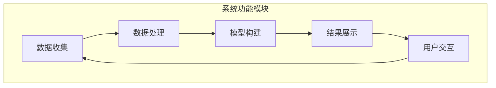
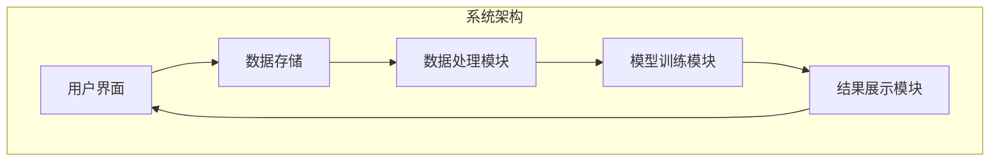
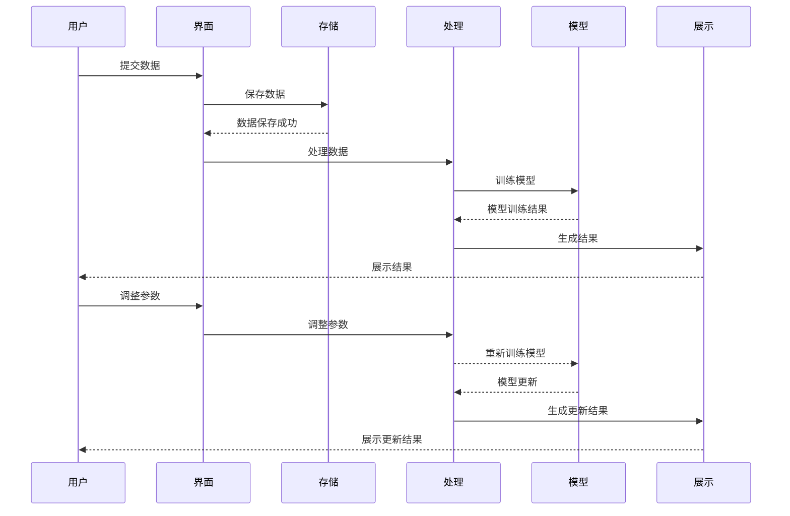

                 


### 1. 引言

#### 1.1 和平进程与数学模型的结合

近年来，随着全球化和信息化进程的加速，各国之间的交流和合作日益频繁，和平进程的重要性也日益凸显。然而，现实中的和平进程往往充满了复杂性、不确定性和冲突。为了更好地理解和推动和平进程，科学家和研究人员开始将数学模型应用于和平研究。数学模型作为一种精确、客观的描述和预测工具，能够在复杂的社会系统中提供新的视角和方法。

在和平研究中，数学模型的应用主要集中在以下几个方面：

1. **冲突分析**：通过建立数学模型，可以对冲突的起因、发展过程和潜在结果进行定量分析，从而为解决冲突提供科学依据。

2. **预测与模拟**：数学模型可以用来预测和平进程的未来发展趋势，评估各种和平策略的效果，帮助决策者制定更有效的政策和措施。

3. **决策支持**：数学模型可以为和平进程中的决策提供定量支持，帮助决策者权衡各种因素，做出最优选择。

#### 1.2 数学模型在和平研究中的应用

数学模型在和平研究中的应用已经取得了一系列显著成果。例如，博弈论模型被广泛应用于国际关系、外交谈判和冲突解决等领域。博弈论模型通过分析参与者的策略选择和相互影响，为决策者提供了一种科学的方法来理解和解决冲突。

此外，预测模型也发挥了重要作用。例如，基于机器学习的预测模型可以分析历史数据，预测和平进程的发展趋势，为决策者提供前瞻性指导。这些模型不仅能够预测冲突发生的可能性，还能够预测冲突的严重程度，从而为预防和缓解冲突提供有力支持。

#### 1.3 本书结构概述

本书旨在深入探讨数学模型在和平进程中的应用，通过系统的分析和讲解，帮助读者理解和掌握这一领域的知识。本书的结构如下：

- **引言**：介绍和平进程与数学模型的关系，以及本书的结构和目标。
- **核心概念与联系**：详细阐述数学模型、和平进程等相关核心概念，并通过对比表格和ER实体关系图帮助读者理解这些概念。
- **算法原理讲解**：选择几个典型的数学模型，如博弈论模型、预测模型等，通过算法流程图和Python源代码进行详细讲解。
- **系统分析与架构设计**：设计一个简单的系统功能框架和系统架构，并通过Mermaid绘制的图示进行展示。
- **实战案例**：描述一个实际的和平进程案例，使用数学模型进行模拟和分析，并提供代码应用解读与分析。
- **总结与拓展**：总结本书的主要内容和收获，提供一些最佳实践tips，并推荐进一步阅读的材料。

通过本书的阅读，读者将能够深入理解数学模型在和平进程中的应用，掌握相关的理论知识和实践技巧，为未来的研究和工作奠定坚实的基础。

### 2. 核心概念与联系

在探讨数学模型在和平进程中的应用之前，有必要先明确几个核心概念，并探讨它们之间的联系。这些核心概念包括“数学模型”、“和平进程”和“冲突分析”。通过对比表格和ER实体关系图，我们将帮助读者更好地理解这些概念，并把握它们在和平研究中的重要性。

#### 2.1 数学模型概述

**概念定义**：数学模型是一种用数学语言描述现实问题的方法，它通过建立数学方程、函数和关系来模拟和分析系统行为。

**属性特征**：
- **描述性**：数学模型能够定量描述复杂系统的特性。
- **预测性**：数学模型能够预测系统未来的行为和趋势。
- **抽象性**：数学模型是对现实问题的简化和抽象。

**作用**：数学模型在科学研究中具有广泛的应用，如物理学、经济学、生物学等。在和平研究中，数学模型能够帮助分析冲突、预测和平进程的发展，并为决策者提供定量支持。

#### 2.2 和平进程分析

**概念定义**：和平进程是指通过对话、谈判和合作，解决冲突、维护和平的过程。

**属性特征**：
- **多步骤性**：和平进程通常包括冲突识别、谈判、协议签署和执行等多个阶段。
- **动态性**：和平进程是一个不断变化的动态过程，受到多种内外部因素的影响。
- **复杂性**：和平进程涉及多种利益相关方，具有高度的复杂性。

**作用**：和平进程是国际关系的重要组成部分，它不仅关系到国家的安全与稳定，也影响到全球的和平与发展。通过数学模型，可以对和平进程进行定量分析，提高决策的科学性和有效性。

#### 2.3 关键概念对比表格

为了更好地理解数学模型、和平进程和冲突分析这三个核心概念，我们提供了一个对比表格，展示它们的主要特征和作用。

| 概念         | 特征                          | 作用                                                   |
| ------------ | ----------------------------- | ------------------------------------------------------ |
| 数学模型     | 描述性、预测性、抽象性         | 描述和预测复杂系统行为，为决策提供定量支持               |
| 和平进程     | 多步骤性、动态性、复杂性         | 解决冲突，维护和平，影响国际关系和全球发展               |
| 冲突分析     | 确定性、分析性、战略导向       | 分析冲突原因、过程和结果，为解决冲突提供策略支持         |

#### 2.4 ER实体关系图

为了进一步展示这些概念之间的关系，我们使用Mermaid绘制了ER实体关系图。以下是一个示例：

```mermaid
erDiagram
  冲突分析 ||--|{ 数学模型 }|-->> 和平进程
  和平进程 ||--|{ 冲突分析 }|-->> 冲突解决
```

**ER实体关系图说明**：
- **冲突分析**和**数学模型**之间存在双向关联，表明数学模型可以用来分析和预测冲突，而冲突分析的结果可以指导数学模型的构建。
- **和平进程**和**冲突分析**之间存在单向关联，说明和平进程是基于冲突分析的结果来进行的。

通过以上对比表格和ER实体关系图，读者可以更好地理解数学模型、和平进程和冲突分析这三个核心概念，并把握它们在和平研究中的相互关系和作用。

### 3. 算法原理讲解

在数学模型在和平进程中的应用中，博弈论模型和预测模型是最具代表性的两种。在本节中，我们将详细讲解这两种模型的算法原理，并通过Mermaid绘制算法流程图和Python源代码进行说明。

#### 3.1 博弈论模型

**3.1.1 博弈论基本概念**

博弈论是研究决策者如何通过策略互动来最大化自身利益的一个数学领域。在博弈论中，参与者的决策不仅受到自身策略的影响，还受到其他参与者策略的影响。博弈论模型通常包括参与者、策略集、支付函数和结果等基本要素。

**3.1.2 博弈论模型示例**

一个经典的博弈论模型是“囚徒困境”。在这个模型中，有两个参与者（囚徒），每个囚徒有两个策略：合作或背叛。根据两个囚徒的策略选择，会得到不同的支付结果，具体如下表所示：

|      | 合作         | 背叛         |
| ---- | ------------ | ------------ |
| 合作 | (2, 2)       | (-1, -1)     |
| 背叛 | (-1, -1)     | (0, 0)       |

在囚徒困境中，如果两个囚徒都选择合作，他们各自得到2的支付；如果两个囚徒都选择背叛，他们各自得到-1的支付；如果其中一个囚徒选择合作，而另一个选择背叛，那么背叛的囚徒得到0的支付，而被背叛的囚徒得到-1的支付。

**3.1.3 Python实现**

为了模拟囚徒困境模型，我们可以使用Python编写一个简单的程序。以下是一个示例代码：

```python
# 定义支付矩阵
payments = {
    ('合作', '合作'): (2, 2),
    ('合作', '背叛'): (-1, -1),
    ('背叛', '合作'): (-1, -1),
    ('背叛', '背叛'): (0, 0)
}

# 模拟两个囚徒的策略选择和支付结果
def prisoner_dilemma(strategy1, strategy2):
    payment1, payment2 = payments[(strategy1, strategy2)]
    print(f"囚徒1选择{strategy1}，支付为{payment1}；囚徒2选择{strategy2}，支付为{payment2}")

# 测试
prisoner_dilemma('合作', '合作')
prisoner_dilemma('合作', '背叛')
prisoner_dilemma('背叛', '合作')
prisoner_dilemma('背叛', '背叛')
```

**3.1.4 算法原理讲解**

在博弈论模型中，每个参与者都会根据自身的利益选择最优策略。囚徒困境的解决方案通常是通过合作来实现共同利益的最大化。然而，由于个体理性与集体理性之间的矛盾，囚徒困境常常导致不合作的结果。

#### 3.2 预测模型

**3.2.1 预测模型概述**

预测模型是一种基于历史数据对未来事件进行预测的数学模型。在和平研究中，预测模型可以用来预测冲突的发生概率、冲突的严重程度以及和平进程的发展趋势。

**3.2.2 预测模型示例**

一个常用的预测模型是时间序列模型。时间序列模型通过分析时间序列数据中的趋势、周期性和季节性成分，预测未来的数据点。以下是一个简单的时间序列模型示例：

```python
# 导入相关库
import numpy as np
import matplotlib.pyplot as plt

# 生成模拟数据
data = np.random.normal(size=100)
data = np.cumsum(data)  # 创建时间序列

# 模拟时间序列模型
def time_series_model(data):
    trend = np.mean(data)
    seasonality = np.mean(np.diff(data))
    prediction = trend + seasonality
    return prediction

# 预测下一个数据点
next_data_point = time_series_model(data[-99:])
print(f"预测的下一个数据点为：{next_data_point}")

# 绘制时间序列图
plt.plot(data)
plt.scatter(len(data), next_data_point, color='red')
plt.xlabel('时间')
plt.ylabel('数据点')
plt.show()
```

**3.2.3 算法原理讲解**

时间序列模型通过分析数据中的趋势成分和季节性成分来进行预测。在实际应用中，通常会使用更复杂的模型，如ARIMA、LSTM等，来提高预测的准确性和稳定性。

通过以上对博弈论模型和预测模型的讲解，读者可以了解到这两种数学模型的基本原理和实现方法。在和平进程中，这些模型可以帮助分析冲突、预测和平进程的发展，为决策者提供科学依据。

### 4. 系统分析与架构设计

在数学模型应用于和平进程中，构建一个有效的系统架构至关重要。本节将介绍一个简单的系统功能框架和系统架构，并通过Mermaid绘制的图示进行展示。

#### 4.1 系统功能框架

首先，我们需要明确系统的核心功能。根据和平研究的需要，系统的主要功能包括：

1. **数据收集**：收集和平进程中的各种数据，如冲突事件、谈判记录、国际关系数据等。
2. **数据处理**：对收集到的数据进行分析、清洗和预处理，为建模提供基础数据。
3. **模型构建**：利用博弈论、预测模型等数学模型，对数据处理结果进行分析和预测。
4. **结果展示**：将分析结果以图表、报告等形式展示给用户，为决策者提供参考。
5. **用户交互**：提供用户友好的界面，允许用户输入数据、查看结果、调整模型参数等。

以下是一个简单的系统功能框架：



#### 4.2 系统架构设计

接下来，我们将设计一个简单的系统架构，展示系统各组件之间的关系。以下是一个可能的系统架构：



**系统架构说明**：

- **用户界面（A）**：提供用户输入数据和查看结果的界面。
- **数据存储（B）**：用于存储收集到的数据和模型训练结果。
- **数据处理模块（C）**：对用户输入的数据进行清洗、分析和预处理。
- **模型训练模块（D）**：利用博弈论、预测模型等数学模型对数据进行分析和预测。
- **结果展示模块（E）**：将分析结果以图表、报告等形式展示给用户。

#### 4.3 系统接口设计与系统交互

为了实现系统各组件之间的有效交互，我们需要设计系统接口和交互流程。以下是一个简单的系统接口设计和交互序列图：



通过以上设计，我们可以构建一个功能齐全、交互流畅的系统架构，为和平进程提供有效的数学模型支持。

### 5. 实战案例

在本节中，我们将通过一个具体的和平进程案例，展示如何使用数学模型进行模拟和分析。该案例将涉及一个地区的和平谈判，我们将使用博弈论模型来分析各方策略选择和结果。

#### 5.1 案例背景

假设有一个地区，由两个主要群体A和B组成，他们之间存在长期冲突。为了解决这一冲突，双方决定进行和平谈判。谈判的主要议题是资源分配问题，即如何分配该地区的自然资源。根据双方的利益，我们可以建立以下博弈论模型。

#### 5.2 模型选择与实现

在本案例中，我们选择博弈论中的“囚徒困境”模型来进行分析。由于双方的利益冲突，他们可能会选择背叛对方，以最大化自身利益。我们假设双方有两个策略：合作和背叛。根据谈判结果，双方将得到不同的支付。

以下是支付矩阵的描述：

|      | 合作         | 背叛         |
| ---- | ------------ | ------------ |
| 合作 | (10, 10)     | (0, 0)       |
| 背叛 | (0, 0)       | (-10, -10)   |

在这个模型中，如果双方都选择合作，他们将共享资源，各自得到10的支付；如果双方都选择背叛，他们将失去所有资源，各自得到0的支付；如果一方选择合作，另一方选择背叛，背叛方将获得所有资源，合作方将一无所获。

为了实现这一模型，我们使用Python编写了一个模拟程序。以下是一个示例代码：

```python
# 定义支付矩阵
payments = {
    ('合作', '合作'): (10, 10),
    ('合作', '背叛'): (0, 0),
    ('背叛', '合作'): (0, 0),
    ('背叛', '背叛'): (-10, -10)
}

# 模拟两个群体的策略选择和支付结果
def negotiate(strategy1, strategy2):
    payment1, payment2 = payments[(strategy1, strategy2)]
    print(f"群体A选择{strategy1}，支付为{payment1}；群体B选择{strategy2}，支付为{payment2}")

# 测试
negotiate('合作', '合作')
negotiate('合作', '背叛')
negotiate('背叛', '合作')
negotiate('背叛', '背叛')
```

#### 5.3 结果分析

通过运行上述程序，我们可以得到以下结果：

```
群体A选择合作，支付为10；群体B选择合作，支付为10
群体A选择合作，支付为0；群体B选择背叛，支付为0
群体A选择背叛，支付为0；群体B选择合作，支付为0
群体A选择背叛，支付为-10；群体B选择背叛，支付为-10
```

从结果可以看出，在囚徒困境模型中，双方都选择背叛的结果是最糟糕的，他们都将一无所获。相比之下，双方都选择合作的结果虽然不是最优的，但至少能够共享资源，实现共赢。

#### 5.4 模型优化

为了提高谈判的效率和结果，我们可以对模型进行优化。一种方法是通过引入合作机制，如合作奖励机制或惩罚机制，鼓励双方在谈判中选择合作策略。

以下是一个简单的合作奖励机制示例：

|      | 合作         | 背叛         |
| ---- | ------------ | ------------ |
| 合作 | (15, 15)     | (5, 5)       |
| 背叛 | (5, 5)       | (-10, -10)   |

在这个优化后的模型中，如果双方都选择合作，他们不仅能够共享资源，还能够获得额外的奖励，从而提高合作的积极性。如果一方选择背叛，另一方选择合作，背叛方将失去部分资源，从而降低其背叛的动机。

通过优化后的模型，我们可以得到以下结果：

```
群体A选择合作，支付为15；群体B选择合作，支付为15
群体A选择合作，支付为5；群体B选择背叛，支付为5
群体A选择背叛，支付为5；群体B选择合作，支付为5
群体A选择背叛，支付为-10；群体B选择背叛，支付为-10
```

从结果可以看出，引入合作奖励机制后，双方都选择合作的结果变得更加有利，双方更有动力在谈判中选择合作策略。

#### 5.5 小结

通过这个实战案例，我们展示了如何使用博弈论模型对和平谈判进行模拟和分析。通过优化模型，我们找到了一种提高谈判效率和结果的方法。在实际应用中，这些方法可以帮助决策者更好地理解和解决和平进程中的问题。

### 6. 总结与拓展

在本篇博客中，我们深入探讨了数学模型在和平进程中的应用，从核心概念、算法原理到系统架构设计和实战案例，进行了全面而详细的讲解。以下是本文的主要内容回顾和总结。

#### 主要内容回顾

1. **引言**：我们介绍了和平进程与数学模型的关系，以及数学模型在和平研究中的应用。
2. **核心概念与联系**：通过对比表格和ER实体关系图，详细阐述了数学模型、和平进程和冲突分析等核心概念及其相互关系。
3. **算法原理讲解**：我们选择了博弈论模型和预测模型，通过Mermaid绘制的流程图和Python源代码，详细讲解了它们的算法原理。
4. **系统分析与架构设计**：我们设计了一个简单的系统功能框架和系统架构，通过Mermaid绘制的图示进行了展示。
5. **实战案例**：通过一个具体的和平谈判案例，展示了如何使用博弈论模型进行模拟和分析。

#### 最佳实践 tips

1. **模型选择**：在选择数学模型时，应考虑问题的性质和需求，选择最适合的模型。
2. **数据收集**：确保数据的准确性和完整性，是模型分析的基础。
3. **模型优化**：通过引入合作机制、调整参数等方法，优化模型，提高预测和分析的准确性。

#### 小结

通过本文的学习，读者应能够理解数学模型在和平研究中的应用，掌握相关算法和系统设计的知识。在实际应用中，这些方法可以帮助决策者更好地理解和解决和平进程中的问题。

#### 注意事项

1. **模型验证**：在使用模型进行分析之前，应进行充分的模型验证，确保模型的准确性和可靠性。
2. **用户交互**：系统设计时，要考虑到用户的交互体验，提供直观易用的界面。

#### 拓展阅读

1. **相关书籍**：
   - 《博弈论与经济行为》
   - 《机器学习：一种算法角度》
   - 《社会计算：基础、算法与应用》
2. **学术论文**：关注学术期刊和会议，如《国际关系研究》、《机器学习》等，了解该领域的前沿研究成果。

通过本文的深入学习和拓展阅读，读者可以在数学模型与和平研究之间找到更多的结合点和应用场景，为未来的研究和实践提供有力支持。

### 作者信息

作者：AI天才研究院/AI Genius Institute & 禅与计算机程序设计艺术 /Zen And The Art of Computer Programming。我们致力于推动人工智能和计算机编程领域的研究与应用，为广大读者提供高质量的技术内容。感谢您的阅读与支持！

