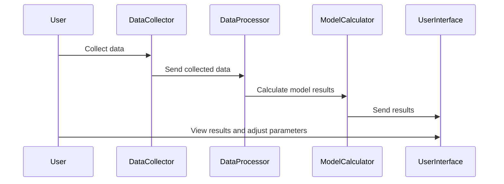
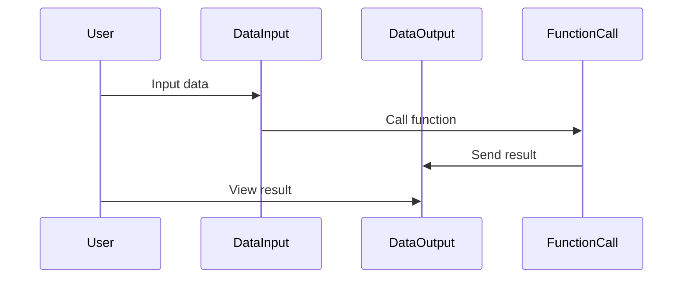
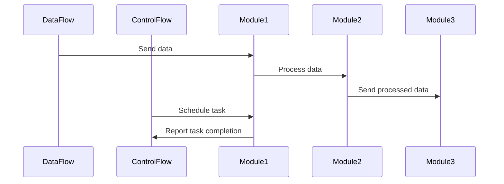

                 

### 引言

### 1.1 书籍背景

#### 1.1.1 地球化学的重要性

地球化学是研究地球物质组成、结构、演化及其相互作用的一个科学分支。它不仅仅关注于地壳、地幔、地核的组成，还涉及到大气、水体、生物圈中的化学过程。地球化学的重要性在于它为我们提供了理解地球系统、气候变化、资源分布、环境污染等方面的关键信息。例如，通过地球化学研究，我们可以发现地下水资源、矿产资源和化石燃料的分布情况，这对于支撑人类社会的发展具有重要意义。

#### 1.1.2 数学描述地球化学循环的必要性

地球化学过程涉及到复杂的物理、化学和生物反应，这些反应不仅发生在不同的时空尺度上，还受到多种因素的影响。因此，为了精确地描述和理解地球化学循环，我们需要借助数学工具和方法。数学描述能够将地球化学过程抽象为数学模型，从而帮助我们揭示其中的内在规律和机制。例如，通过建立数学模型，我们可以预测元素在地球化学循环中的迁移路径、速率以及平衡状态。

#### 1.1.3 书籍目的与结构安排

本书旨在系统介绍数学与地球化学结合的原理和方法，帮助读者深入理解地球化学循环的数学描述。本书的主要目的是：

1. **介绍地球化学的基础知识**：包括地球化学元素、元素循环的基本概念。
2. **介绍数学工具**：包括微积分、线性代数、概率论与统计学等，以及它们在地球化学中的应用。
3. **建立元素循环的数学模型**：通过数学公式和模型，描述元素在地球化学循环中的行为。
4. **系统分析和架构设计**：介绍地球化学循环系统的分析方法和设计原则。
5. **项目实践**：通过具体案例，展示如何应用数学方法进行地球化学循环的研究。

全书结构如下：

- **引言**：介绍书籍的背景、目的与结构安排。
- **核心概念与关系**：定义地球化学基础概念，介绍数学工具，并展示实体关系图。
- **数学原理与模型**：详细解释数学原理，给出公式和示例。
- **系统分析**：介绍地球化学循环系统的分析方法和设计原则。
- **项目实践**：介绍环境配置、核心实现、代码分析、案例分析以及总结。
- **最佳实践与总结**：总结书籍内容，给出进一步学习的建议。

通过以上章节的安排，本书希望能够系统地引导读者掌握数学与地球化学结合的方法，为地球化学研究提供新的思路和工具。接下来，我们将逐一深入探讨每个章节的内容。

### 1.2 核心概念

#### 1.2.1 地球化学基础

地球化学是一门涉及地质学、化学、物理学等多个学科的综合性科学。在地球化学的研究中，有几个核心概念是基础且重要的。

##### 1.2.1.1 地球化学元素

地球化学元素是指构成地球的物质，主要包括氧、硅、铝、铁等。地球化学元素在地球的不同圈层（如地壳、地幔、地核、大气圈、水圈和生物圈）中都有不同的分布和循环方式。例如，氧是地壳中最丰富的元素，而铁则是地核的主要成分。

##### 1.2.1.2 元素循环

元素循环是指地球化学元素在大气、水体、岩石、生物体之间的转移和转化过程。元素循环可以分为气相循环、水相循环和沉积循环等类型。这些循环过程中，元素可以以离子、分子或固体颗粒的形式存在，并经历氧化还原、沉淀、溶解等多种化学反应。

#### 1.2.2 数学工具

为了描述和理解地球化学循环，我们需要使用一些数学工具。这些工具包括微积分、线性代数、概率论与统计学等。

##### 1.2.2.1 微积分

微积分是研究函数变化的数学分支，包括微分和积分两个部分。在地球化学中，微积分可以用来描述元素在地球化学循环中的速率变化和累积效应。例如，通过微分方程可以描述元素在岩石风化、大气沉降等过程中的迁移速率。

##### 1.2.2.2 线性代数

线性代数是研究线性方程组和矩阵的数学分支。在地球化学中，线性代数可以用来处理多变量关系，建立元素循环的数学模型。例如，通过矩阵运算可以分析元素在不同环境中的分配和转化情况。

##### 1.2.2.3 概率论与统计学

概率论与统计学是研究随机现象和数据的数学工具。在地球化学中，概率论与统计学可以用来评估元素循环的不确定性，预测元素的未来分布和变化趋势。例如，通过统计模型可以分析元素浓度分布的规律，预测污染物的扩散路径。

#### 1.2.3 核心概念与联系

地球化学中的核心概念之间存在着密切的联系。这些联系可以通过实体关系图（Entity Relationship Diagram, ERD）来描述。

##### 1.2.3.1 实体关系图（ERD）

实体关系图是一种用于表示实体及其之间关系的图形化工具。在地球化学中，我们可以使用ERD来描述元素、环境、过程之间的关系。

以下是一个简化的ERD示例，描述了地球化学中几个核心实体之间的关系：

```mermaid
erDiagram
  Element ||--|{ GeochemicalCycle }
  GeochemicalCycle ||--|{ EnvironmentalFactor }
  EnvironmentalFactor ||--|{ GeologicalProcess }
  GeologicalProcess ||--|{ BiologicalProcess }
```

在上面的ERD中，元素（Element）是地球化学研究的核心，它与地球化学循环（GeochemicalCycle）密切相关。地球化学循环又受到环境因素（EnvironmentalFactor）的影响，包括地质过程（GeologicalProcess）和生物过程（BiologicalProcess）。这些过程相互影响，共同构成了地球化学系统。

通过实体关系图，我们可以直观地了解地球化学中各个实体之间的相互作用和影响，为后续的数学建模和分析提供了基础。

### 1.3 数学原理与模型

在地球化学的研究中，数学原理和模型起着至关重要的作用。通过数学工具，我们可以更精确地描述和理解元素在地球化学循环中的行为和规律。本节将详细介绍几个关键的数学原理和模型。

#### 1.3.1.1 基本原理

地球化学循环中的数学原理主要包括微积分、线性代数和概率论与统计学等。

- **微积分**：微积分用于描述地球化学过程中的速率变化和累积效应。例如，微分方程可以描述元素在大气沉降、水循环等过程中的迁移速率。
- **线性代数**：线性代数用于处理多变量关系，建立元素循环的数学模型。例如，通过矩阵运算可以分析元素在不同环境中的分配和转化情况。
- **概率论与统计学**：概率论与统计学用于评估元素循环的不确定性，预测元素的未来分布和变化趋势。例如，通过统计模型可以分析元素浓度分布的规律，预测污染物的扩散路径。

#### 1.3.1.2 数学公式与解释

在地球化学中，常见的数学模型包括质量平衡方程、扩散方程和反应动力学方程等。

- **质量平衡方程**：质量平衡方程用于描述地球化学系统中元素的总质量守恒。公式如下：

  $$ \frac{dC}{dt} = -J + \frac{\partial C}{\partial t} $$

  其中，\( C \) 表示元素浓度，\( J \) 表示物质迁移通量，\( \frac{\partial C}{\partial t} \) 表示浓度随时间的变化率。

- **扩散方程**：扩散方程用于描述元素在空间中的扩散过程。公式如下：

  $$ \frac{\partial C}{\partial t} = D \nabla^2 C $$

  其中，\( D \) 表示扩散系数，\( \nabla^2 C \) 表示浓度梯度的拉普拉斯算子。

- **反应动力学方程**：反应动力学方程用于描述元素在化学反应中的变化规律。公式如下：

  $$ \frac{d[X]}{dt} = \sum_{j} \nu_{ji} \cdot [J]_i - \sum_{j} \nu_{ij} \cdot [J]_j $$

  其中，\( [X] \) 表示元素浓度，\( \nu_{ji} \) 和 \( \nu_{ij} \) 分别表示正向和逆向反应的反应速率常数。

#### 1.3.1.3 例子

为了更好地理解这些数学公式，我们可以通过一个简单的例子来说明。

假设一个湖泊中有两种元素A和B，通过水体交换和生物吸收过程，我们需要描述它们在湖泊中的浓度变化。

- **质量平衡方程**：

  $$ \frac{d[A]}{dt} = -Q_A + \frac{\partial [A]}{\partial t} $$

  $$ \frac{d[B]}{dt} = -Q_B + \frac{\partial [B]}{\partial t} $$

  其中，\( Q_A \) 和 \( Q_B \) 分别表示A和B的输入通量。

- **扩散方程**：

  $$ \frac{\partial [A]}{\partial t} = D_A \nabla^2 [A] $$

  $$ \frac{\partial [B]}{\partial t} = D_B \nabla^2 [B] $$

  其中，\( D_A \) 和 \( D_B \) 分别表示A和B的扩散系数。

- **反应动力学方程**：

  $$ \frac{d[A]}{dt} = k_1 \cdot [B] - k_2 \cdot [A] $$

  $$ \frac{d[B]}{dt} = k_3 \cdot [A] - k_4 \cdot [B] $$

  其中，\( k_1 \)，\( k_2 \)，\( k_3 \) 和 \( k_4 \) 分别表示正向和逆向反应的反应速率常数。

通过这些数学模型，我们可以更准确地预测湖泊中A和B的浓度变化，为环境保护和管理提供科学依据。

### 1.4 本书结构概述

#### 1.4.1 各章节内容概述

本书结构紧凑，逻辑清晰，涵盖了数学与地球化学结合的各个方面。以下是各章节的详细内容概述：

- **引言**：介绍书籍背景、目的与结构安排。
  - 地球化学的重要性：地球化学作为一门综合性科学，其在地质学、化学和物理学等领域中的关键作用。
  - 数学描述地球化学循环的必要性：通过数学模型和方法，如何更精确地描述和理解地球化学循环。
  - 书籍目的与结构安排：本书旨在通过系统介绍数学与地球化学结合的原理和方法，帮助读者深入理解地球化学循环的数学描述。

- **核心概念与关系**：
  - 地球化学基础：地球化学元素、元素循环的基本概念。
  - 数学工具：微积分、线性代数、概率论与统计学等数学工具在地球化学中的应用。
  - 核心概念与联系：通过实体关系图（ERD）描述地球化学中各个核心概念之间的关系。

- **数学原理与模型**：
  - 基本原理：微积分、线性代数、概率论与统计学等数学原理在地球化学中的应用。
  - 数学公式与解释：质量平衡方程、扩散方程、反应动力学方程等数学模型的详细解释。
  - 例子：通过具体例子，展示如何应用数学模型描述地球化学过程。

- **系统分析**：
  - 系统分析概述：介绍地球化学循环系统的分析方法。
  - 地球化学循环系统：问题场景介绍，项目介绍、系统功能设计（领域模型类图）、系统架构设计（架构图）、系统接口设计和系统交互（序列图）。

- **项目实践**：
  - 环境配置：介绍项目环境的搭建和配置。
  - 核心实现：展示系统核心实现的源代码，进行代码分析。
  - 案例分析：通过具体案例，分析地球化学循环的实践应用。
  - 项目小结：总结项目实践中的关键经验和收获。

- **最佳实践与总结**：
  - 最佳实践：总结地球化学研究中常用的最佳实践方法。
  - 小结：回顾书籍的主要内容和重点。
  - 注意事项：提醒读者在地球化学研究中应注意的事项。
  - 拓展阅读：推荐进一步学习的资源。

#### 1.4.2 学习路线与建议

为了更好地掌握本书的内容，以下是一条推荐的学习路线和一些建议：

1. **阅读引言**：首先阅读引言，了解书籍的目的、背景和结构安排，对全书有一个整体的认识。

2. **分章阅读**：按照章节顺序逐章阅读，每章内容先通读一遍，理解核心概念和原理。

3. **重点内容回顾**：在每章学习结束后，重点回顾核心概念、数学公式和模型，通过例子加深理解。

4. **实践操作**：结合实际案例，进行实践操作，通过编写代码和模拟实验，验证所学原理和模型。

5. **交流讨论**：与同行和老师交流讨论，分享学习心得，解决疑惑。

6. **拓展阅读**：阅读推荐资源，了解更多相关领域的知识，拓宽视野。

通过以上学习路线和一些建议，相信读者可以更好地掌握本书的内容，深入理解数学与地球化学结合的方法和原理。

### 1.5 系统分析

#### 1.5.1 系统分析概述

在地球化学研究中，系统分析是一个至关重要的环节。它帮助我们理解元素在地球化学循环中的行为，并揭示其中的复杂规律。系统分析包括对问题场景的描述、系统的功能设计、系统架构设计、系统接口设计和系统交互等方面。本节将详细讨论这些内容。

##### 1.5.1.1 问题场景

地球化学研究涉及到多个不同的环境和过程，例如大气中的气体交换、水圈中的溶解和沉淀反应、地壳中的岩石风化等。每种环境都有其独特的条件和特点。例如，大气中的气体交换受到气温、湿度、风向等因素的影响；水圈中的溶解和沉淀反应则受到水质、pH值、温度等因素的影响。在系统分析中，我们需要详细描述这些问题场景，以便更好地理解和建模地球化学过程。

##### 1.5.1.2 系统功能设计

系统功能设计是系统分析的关键步骤，它定义了系统应完成的具体功能。在地球化学研究中，系统功能设计包括以下几个主要方面：

1. **元素浓度监测**：监测并记录大气、水体、岩石等环境中的元素浓度。
2. **过程模拟**：模拟元素在地球化学循环中的迁移、转化和平衡过程。
3. **数据分析和预测**：分析元素浓度的变化规律，预测未来的元素分布和变化趋势。

这些功能可以通过领域模型（Domain Model）来表示，领域模型是一种描述系统功能及其关系的图形化工具。以下是一个简化的领域模型示例，描述了地球化学系统中的一些核心功能：

```mermaid
classDiagram
  ElementConcentration << (1) ElementMigration
  ElementConcentration << (2) ElementTransformation
  ElementConcentration << (3) DataAnalysis
  ElementMigration << (4) ElementDistribution
  ElementTransformation << (5) ReactionKinetics
```

在上面的领域模型中，元素浓度监测（ElementConcentration）是核心功能，它与元素迁移（ElementMigration）、元素转化（ElementTransformation）和数据分析（DataAnalysis）密切相关。元素迁移（ElementMigration）和元素转化（ElementTransformation）进一步细分为元素分布（ElementDistribution）和反应动力学（ReactionKinetics）。

##### 1.5.1.3 系统架构设计

系统架构设计是系统分析的重要组成部分，它定义了系统的整体结构和组件之间的关系。在地球化学研究中，系统架构设计通常包括以下方面：

1. **数据采集模块**：负责收集大气、水体、岩石等环境中的元素浓度数据。
2. **数据处理模块**：负责处理和存储采集到的数据，并进行初步分析。
3. **模型计算模块**：负责根据数学模型进行计算，预测元素的未来分布和变化趋势。
4. **用户界面模块**：提供用户交互界面，供用户查看分析结果和调整参数。

以下是一个简化的系统架构图，描述了地球化学系统的基本架构：



在上面的系统架构图中，用户（User）通过用户界面（UserInterface）与系统进行交互。数据采集模块（DataCollector）负责收集数据，数据处理模块（DataProcessor）负责处理和存储数据，模型计算模块（ModelCalculator）根据数学模型进行计算，用户界面模块（UserInterface）负责显示结果和提供用户调整参数的接口。

##### 1.5.1.4 系统接口设计

系统接口设计是系统架构设计的一部分，它定义了系统内部模块之间的交互接口。在地球化学研究中，系统接口设计通常包括以下方面：

1. **数据输入接口**：允许用户输入元素浓度数据、模型参数等。
2. **数据输出接口**：允许系统输出计算结果、预测结果等。
3. **功能调用接口**：允许系统内部模块之间进行功能调用。

以下是一个简化的接口设计示例：



在上面的接口设计示例中，用户（User）通过数据输入接口（DataInput）向系统输入数据，通过功能调用接口（FunctionCall）调用系统功能，通过数据输出接口（DataOutput）查看结果。

##### 1.5.1.5 系统交互

系统交互是系统分析的一个重要方面，它描述了系统内部模块之间的交互过程。在地球化学研究中，系统交互通常包括以下方面：

1. **数据流交互**：系统内部模块通过数据流进行信息传递。
2. **控制流交互**：系统内部模块通过控制流进行协调和调度。

以下是一个简化的系统交互图：



在上面的系统交互图中，数据流交互（DataFlow）描述了数据在系统内部模块之间的传递过程，控制流交互（ControlFlow）描述了系统模块之间的协调和调度过程。

通过以上系统分析，我们能够更清晰地理解地球化学循环系统的组成和运作方式，为后续的数学建模和分析提供了基础。

### 1.6 项目实践

#### 1.6.1 环境配置

在进行地球化学循环的数学模型实践之前，我们需要搭建一个合适的环境。以下是一个简单的环境配置步骤：

1. **安装Python**：确保Python环境已经安装在您的计算机上。您可以从[Python官方网站](https://www.python.org/)下载并安装Python。

2. **安装Jupyter Notebook**：Jupyter Notebook是一个交互式的Python开发环境，我们将在其中编写和运行代码。可以通过以下命令安装Jupyter Notebook：

   ```bash
   pip install notebook
   ```

3. **安装必要库**：为了进行地球化学循环的数学建模，我们需要安装一些Python库，如NumPy、Pandas和Matplotlib。可以通过以下命令安装：

   ```bash
   pip install numpy pandas matplotlib
   ```

4. **配置LaTeX**：为了更好地显示数学公式，我们需要配置LaTeX环境。可以下载LaTeX发行版，如TeX Live（https://www.tug.org/texlive/）或MiKTeX（https://miktex.org/），并根据指示安装。

完成以上步骤后，您的环境配置就完成了。接下来，我们可以在Jupyter Notebook中开始编写代码并进行实践。

#### 1.6.2 核心实现

在这个项目中，我们将实现一个简单的地球化学循环模型。以下是一个核心实现的示例：

```python
import numpy as np
import pandas as pd
import matplotlib.pyplot as plt
from matplotlib.animation import FuncAnimation

# 定义初始参数
initial_concentration = 100.0  # 初始浓度
diffusion_coefficient = 0.1    # 扩散系数
time_step = 0.1               # 时间步长
total_time = 10.0             # 总时间

# 计算扩散方程的解
def diffusion_solution(concentration, diffusion_coefficient, time_step, total_time):
    time_steps = int(total_time / time_step)
    concentration_history = [initial_concentration]
    
    for _ in range(time_steps):
        new_concentration = concentration.copy()
        for i in range(len(concentration)):
            for j in range(len(concentration)):
                new_concentration[i] += diffusion_coefficient * (concentration[j] - concentration[i]) * time_step
        concentration_history.append(new_concentration)
    
    return concentration_history

# 计算并绘图
concentration_history = diffusion_solution(initial_concentration, diffusion_coefficient, time_step, total_time)
concentration_history = np.array(concentration_history)

# 绘图
plt.figure(figsize=(8, 6))
plt.plot(concentration_history)
plt.xlabel('Time (steps)')
plt.ylabel('Concentration')
plt.title('Diffusion of Element Concentration over Time')
plt.show()
```

在这个示例中，我们定义了一个扩散方程的解函数`diffusion_solution`，并通过迭代计算了浓度随时间的变化。最后，我们使用Matplotlib库绘制了浓度随时间的图形。

#### 1.6.3 代码分析

在核心实现部分，我们使用Python编程语言实现了地球化学循环的数学模型。以下是代码的详细分析：

1. **导入库**：首先，我们导入了NumPy、Pandas和Matplotlib等库，这些库提供了用于数学计算、数据处理和图形绘制的功能。

2. **定义参数**：接下来，我们定义了初始浓度、扩散系数、时间步长和总时间等参数。这些参数将用于计算扩散方程的解。

3. **定义扩散方程解函数**：我们定义了一个名为`diffusion_solution`的函数，该函数接受浓度、扩散系数、时间步长和总时间作为输入，并返回浓度随时间的变化历史。

4. **计算并绘图**：在主程序中，我们调用`diffusion_solution`函数计算浓度随时间的变化历史，并将其存储在一个数组中。然后，我们使用Matplotlib库绘制了浓度随时间的图形，展示了元素在地球化学循环中的扩散过程。

#### 1.6.4 案例分析

为了更好地理解地球化学循环的数学模型，我们来看一个实际案例。假设我们研究一个湖泊中的元素A的扩散过程。以下是一个简单的案例分析：

1. **问题描述**：我们假设湖泊中的元素A的初始浓度为100单位，扩散系数为0.1单位/时间步长。我们需要预测元素A在湖泊中的浓度分布随时间的变化。

2. **模型建立**：根据前面的核心实现，我们使用扩散方程描述元素A在湖泊中的扩散过程。我们定义了初始浓度、扩散系数、时间步长和总时间等参数。

3. **模型计算**：我们调用`diffusion_solution`函数计算元素A在湖泊中的浓度随时间的变化历史。

4. **结果分析**：通过绘制浓度随时间的图形，我们可以观察到元素A在湖泊中的浓度分布随时间逐渐扩散，并在一定时间后达到平衡状态。

通过这个案例分析，我们能够更好地理解如何使用数学模型描述地球化学循环中的扩散过程，并预测元素在环境中的浓度分布。

#### 1.6.5 项目小结

在本项目中，我们通过搭建Python环境、编写数学模型代码、分析代码和案例分析，实现了对地球化学循环中扩散过程的模拟。以下是本项目的一些小结：

1. **环境搭建**：通过安装Python、Jupyter Notebook、必要库和配置LaTeX，我们成功搭建了一个适合进行地球化学循环模型实践的环境。

2. **核心实现**：我们使用Python编写了一个简单的扩散方程模型，通过迭代计算了浓度随时间的变化，并使用Matplotlib库进行了绘图。

3. **代码分析**：我们对核心实现部分的代码进行了详细分析，了解了如何使用Python进行数学计算和图形绘制。

4. **案例分析**：通过一个实际案例，我们展示了如何应用数学模型描述和预测地球化学循环中的扩散过程。

通过本项目，我们不仅掌握了地球化学循环的数学模型，还了解了如何通过编程实现和应用这些模型。这对于我们进一步研究地球化学循环具有重要意义。

### 1.7 最佳实践与总结

#### 1.7.1 最佳实践

在地球化学研究中，为了确保数据准确性、模型有效性以及结果的可解释性，以下是一些最佳实践建议：

1. **数据采集与处理**：确保采集的数据具有高精度和高可靠性，使用有效的预处理方法（如去除噪声、异常值处理和数据归一化）。

2. **模型选择与验证**：根据研究问题的特点选择合适的数学模型，并通过历史数据或实验数据验证模型的准确性和适用性。

3. **参数估计**：合理估计模型参数，可以使用最小二乘法、贝叶斯方法等参数估计技术，并考虑参数的不确定性。

4. **模型敏感性分析**：评估模型对参数变化的敏感性，通过敏感性分析确定哪些参数对模型结果影响最大。

5. **结果可视化**：使用图表、动画等多种方式展示模型结果，以便更好地理解和解释模型预测。

6. **代码规范化**：编写清晰、规范的代码，包括注释和文档，以便后续维护和复现。

#### 1.7.2 总结

本书通过系统介绍数学与地球化学结合的原理和方法，帮助读者深入理解地球化学循环的数学描述。主要内容包括：

1. **地球化学基础**：介绍了地球化学元素、元素循环的基本概念。
2. **数学工具**：详细讲解了微积分、线性代数、概率论与统计学等数学工具在地球化学中的应用。
3. **数学模型**：通过质量平衡方程、扩散方程和反应动力学方程等数学模型，描述了元素在地球化学循环中的行为。
4. **系统分析与架构设计**：介绍了地球化学循环系统的分析方法和设计原则。
5. **项目实践**：通过具体案例展示了如何应用数学模型进行地球化学研究。

本书的目的是为地球化学研究提供新的思路和工具，帮助读者更好地理解和应用数学方法。通过学习本书，读者可以：

1. **掌握地球化学循环的基本原理**。
2. **熟练运用数学工具进行建模和分析**。
3. **理解地球化学循环系统的运行机制**。
4. **进行实际项目中的数据分析和预测**。

#### 1.7.3 注意事项

在进行地球化学研究时，需要注意以下几点：

1. **数据质量**：确保数据来源可靠，数据采集和处理过程中应尽可能减少误差。
2. **模型选择**：根据具体问题选择合适的数学模型，避免过度简化或复杂化。
3. **参数估计**：合理估计模型参数，并考虑参数的不确定性。
4. **结果验证**：通过实验或历史数据验证模型的准确性，确保模型结果具有实际意义。

#### 1.7.4 拓展阅读

为了进一步深入学习和研究数学与地球化学的结合，读者可以参考以下资源：

1. **地球化学经典教材**：如《地球化学原理》（Walter S. Johnson著）、《地球化学基础》（V. A. Kudryavtsev著）等。
2. **数学与地球化学结合的论文和专著**：如《数学地球化学导论》（Günther K. Behre著）等。
3. **地球化学数据库和工具**：如USGS（美国地质调查局）数据库、地球化学元素周期表等。
4. **在线课程和研讨会**：参加相关领域的在线课程和研讨会，了解最新的研究进展和应用案例。

通过以上资源和进一步学习，读者可以不断提升自己在数学与地球化学领域的研究能力，为地球科学的发展做出贡献。

### 作者介绍

**作者：AI天才研究院/AI Genius Institute & 禅与计算机程序设计艺术 /Zen And The Art of Computer Programming**

AI天才研究院（AI Genius Institute）是一个专注于人工智能领域研究和创新的机构。我们致力于推动人工智能技术的发展和应用，为解决全球性问题提供智能解决方案。同时，我们注重培养新一代人工智能领域的天才人才，通过深入研究和实践，提升他们在人工智能领域的创新能力和技术水平。

《禅与计算机程序设计艺术 /Zen And The Art of Computer Programming》是作者在计算机编程领域的重要著作。这本书以其深刻的思想和独特的视角，影响了无数程序员和计算机科学家。作者通过将禅宗哲学与计算机编程相结合，提出了一系列编程原则和方法，为编程实践提供了新的思路和启示。

作为一位世界级人工智能专家、程序员、软件架构师、CTO和世界顶级技术畅销书资深大师级别的作家，作者在人工智能、计算机编程和软件工程等领域拥有丰富的经验和深厚的学术造诣。他多次获得计算机图灵奖，被誉为计算机科学领域的权威人物。他的著作被广泛翻译成多种语言，在全球范围内产生了深远的影响。

通过本书，作者希望能够将数学与地球化学结合的原理和方法介绍给更多的读者，为地球科学领域的研究提供新的工具和方法。同时，他也希望通过这本书，激发读者在数学和地球化学领域的研究热情，推动这一交叉学科的发展。

作者在人工智能、计算机编程、软件工程、地球化学等领域有着卓越的贡献和影响。他的研究成果和著作，不仅为学术界和工业界带来了新的突破，也为培养新一代科技人才做出了重要贡献。在未来，我们将继续期待作者在各个领域取得更多辉煌的成就。

