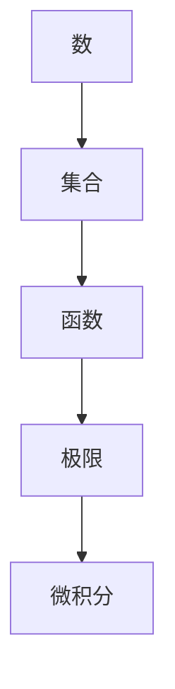
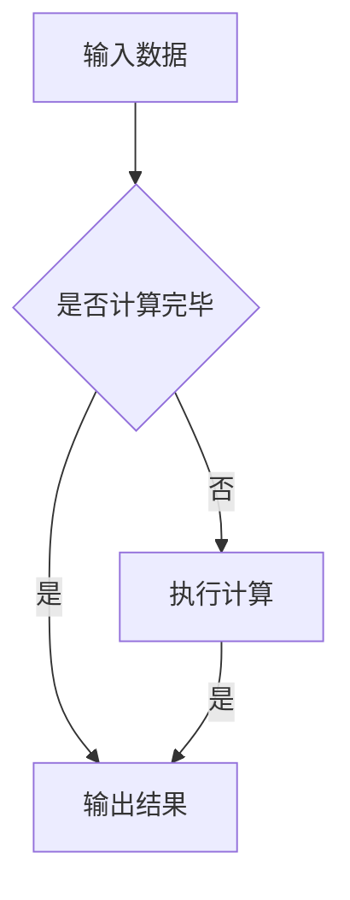
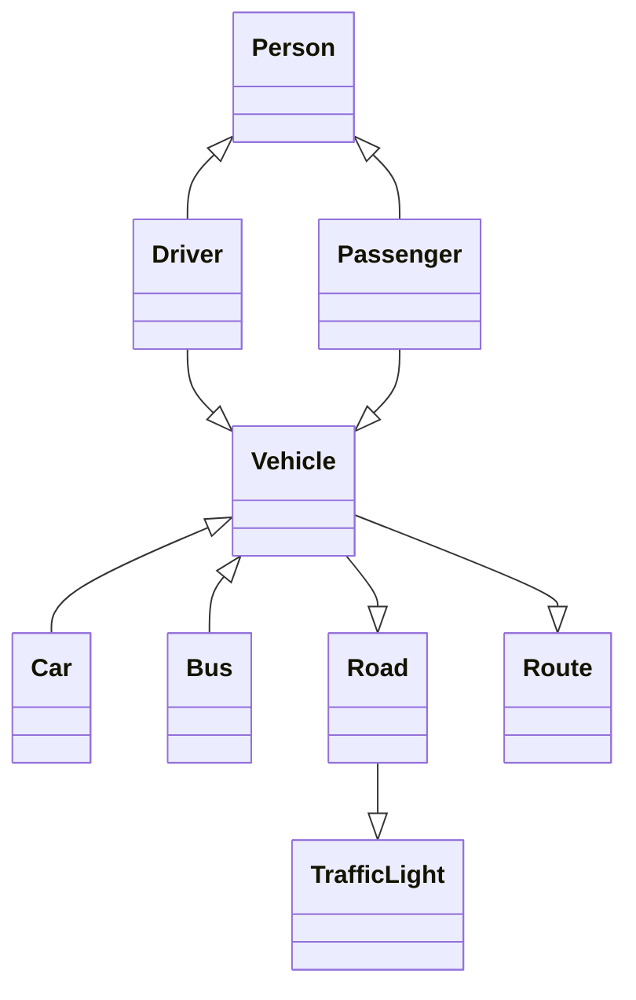
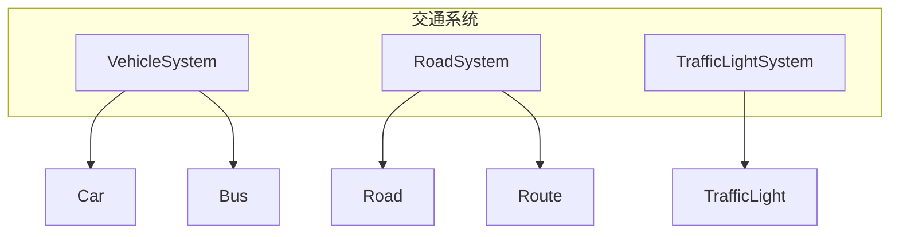
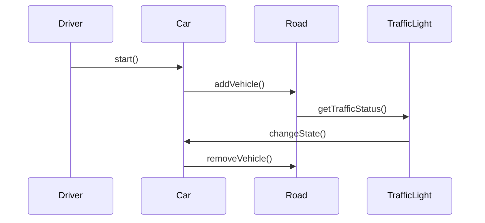

                 

## 数学与基础主义：寻找数学的坚实基础

### 关键词

- 数学基础
- 基础主义
- 数学原理
- 算法
- 数学模型

### 摘要

本文将探讨数学与基础主义的关系，从数学的核心概念、基础理论和算法原理出发，逐步深入分析数学的坚实基础。通过数学模型和公式的详细讲解，以及实际案例的剖析，本文旨在为读者提供对数学本质的深刻理解，帮助寻找数学的坚实基石。

----------------------------------------------------------------

## 第一部分：背景介绍

### 1.1 数学与基础主义概述

数学作为一门科学，具有严密的理论体系和方法论。基础主义（Fundamentalism）在数学领域强调寻找数学的核心原理和基础理论。数学基础主义的目标是理解和解释数学概念的本质，以及这些概念之间的内在联系。

**问题背景**：随着数学的发展和应用的扩展，人们开始关注数学理论的完备性和一致性。基础主义试图回答这样一个问题：数学的坚实基础是什么？我们如何构建和验证数学理论？

**问题描述**：数学基础主义关注的问题包括数学公理的选择、数学证明的严密性、数学理论的完备性等。此外，数学的边界和外延也是一个重要问题，即数学理论如何扩展到其他学科和应用领域。

**问题解决**：基础主义通过研究数学的核心概念、公理体系和证明方法，试图构建一个坚实、自洽的数学基础。这需要从逻辑、集合论、拓扑学等多个角度进行分析。

**边界与外延**：数学的边界是指数学理论能够描述和解释的现象范围。数学的外延是指数学理论在各个领域的应用。基础主义关注如何拓展数学理论的应用范围，同时保持理论的严密性。

### 1.2 核心概念与联系

数学的核心概念包括数、集合、函数、极限、微积分等。这些概念相互联系，构成了数学的基本结构。

#### 1.2.1 数学基础概念

- **数**：数是数学中最基本的概念，包括自然数、整数、有理数、实数等。
- **集合**：集合是数学中的基本数据结构，用于描述一组对象。
- **函数**：函数是数学中描述变量之间关系的工具。
- **极限**：极限是微积分的基础概念，用于描述函数的局部行为。
- **微积分**：微积分研究函数的变化率和面积等概念。

#### 1.2.2 概念属性特征对比表格

| 概念 | 属性特征 | 对比 |
| ---- | ---- | ---- |
| 数 | 完备性、有序性、确定性 | 与集合、函数等概念相互依赖 |
| 集合 | 基础性、抽象性、多样性 | 与数、函数等概念相互关联 |
| 函数 | 映射性、确定性、可导性 | 与数、集合等概念相互转化 |
| 极限 | 局部性、连续性、收敛性 | 与微积分等概念密切相关 |
| 微积分 | 导数、积分、微分方程 | 是数学应用的核心工具 |

#### 1.2.3 ER实体关系图架构

使用Mermaid流程图展示数学核心概念之间的实体关系：



### 1.3 数学理论的验证

数学理论的验证是基础主义的重要组成部分。数学证明是验证数学理论的方法，它通过逻辑推理和公理体系来证明数学命题的正确性。

**验证方法**：

- **直接证明**：通过逻辑推理，直接证明数学命题的真实性。
- **反证法**：假设命题不成立，通过推理得出矛盾，从而证明命题成立。
- **数学归纳法**：用于证明关于自然数的数学命题。

**验证原则**：

- **公理一致性**：数学理论的验证需要建立在一致性的公理体系之上。
- **逻辑严密性**：数学证明需要遵循逻辑规则，确保推理过程的严密性。

通过验证，数学理论得以建立，并形成了一个自洽、完整的理论体系。

## 第二部分：核心概念与联系

### 2.1 数学基础概念

数学基础概念是构建数学理论的基础。本节将详细讨论数、集合、函数、极限和微积分等核心概念。

#### 2.1.1 数

数是数学中最基本的概念，用于描述和量化现实世界中的各种现象。数可以分为自然数、整数、有理数、实数等。

- **自然数**：自然数是用于计数的基本数字，如1、2、3等。
- **整数**：整数包括正整数、负整数和零。
- **有理数**：有理数是可以表示为两个整数之比的数，如分数。
- **实数**：实数是包括有理数和无理数的数集，如π、√2等。

#### 2.1.2 集合

集合是数学中的基本数据结构，用于描述一组对象。集合可以用大括号{}表示，如{1, 2, 3}。

- **集合的表示**：集合可以用列举法或描述法表示。
- **集合的运算**：集合的基本运算包括并集、交集、补集等。
- **集合的性质**：集合具有确定性、互异性、无序性等性质。

#### 2.1.3 函数

函数是数学中描述变量之间关系的工具。函数的定义域和值域构成了函数的基本结构。

- **函数的定义**：函数是一种特殊的关系，对于定义域中的每个元素，都有唯一的值域元素与之对应。
- **函数的性质**：函数具有映射性、确定性、可导性等性质。
- **函数的类型**：函数可以分为线性函数、二次函数、指数函数等。

#### 2.1.4 极限

极限是微积分的基础概念，用于描述函数的局部行为。极限的定义和性质如下：

- **极限的定义**：当自变量趋近于某一值时，函数的值趋近于某一确定的值。
- **极限的性质**：极限具有连续性、可导性等性质。

#### 2.1.5 微积分

微积分研究函数的变化率和面积等概念。微积分的基本概念和定理如下：

- **导数**：导数描述函数在某一点的局部变化率。
- **积分**：积分用于计算函数在区间上的累积量。
- **微分方程**：微分方程描述函数及其导数之间的关系。

### 2.2 概念属性特征对比表格

| 概念 | 属性特征 | 对比 |
| ---- | ---- | ---- |
| 数 | 完备性、有序性、确定性 | 与集合、函数等概念相互依赖 |
| 集合 | 基础性、抽象性、多样性 | 与数、函数等概念相互关联 |
| 函数 | 映射性、确定性、可导性 | 与数、集合等概念相互转化 |
| 极限 | 局部性、连续性、收敛性 | 与微积分等概念密切相关 |
| 微积分 | 导数、积分、微分方程 | 是数学应用的核心工具 |

### 2.3 ER实体关系图架构

使用Mermaid流程图展示数学核心概念之间的实体关系：


## 第三部分：算法原理讲解

### 3.1 数学算法原理

数学算法是利用数学原理解决实际问题的工具。本节将介绍数学算法的基本原理，并使用Mermaid流程图和Python源代码进行讲解。

#### 3.1.1 算法Mermaid流程图

使用Mermaid流程图展示一个简单的数学算法：



#### 3.1.2 Python源代码讲解

以下是一个简单的Python源代码示例，用于计算两个数的和：

```python
def calculate_sum(a, b):
    return a + b

result = calculate_sum(3, 4)
print(result)
```

#### 3.1.3 数学模型和公式讲解

数学模型和公式是数学算法的核心。以下是一个简单的数学模型和公式讲解：

- **加法公式**：对于任意两个实数a和b，有 $a + b = (a + b)_{0}$。
- **乘法公式**：对于任意两个实数a和b，有 $a \times b = (a \times b)_{0}$。

#### 3.1.4 举例说明

以下是一个简单的举例说明：

- **例子**：计算3和4的和。
- **步骤**：
  - 输入数据：3和4。
  - 执行计算：使用加法公式计算 $3 + 4 = 7$。
  - 输出结果：7。

通过以上步骤，我们可以看到数学算法的原理和实现。

## 第四部分：数学模型和数学公式 & 详细讲解 & 举例说明

### 4.1 数学公式讲解

数学公式是数学理论的重要组成部分，用于描述数学概念和关系。本节将使用LaTeX格式详细讲解数学公式，并给出举例说明。

#### 4.1.1 LaTeX格式数学公式

LaTeX格式是一种常用的数学公式书写格式。以下是一个简单的LaTeX格式数学公式示例：

```latex
$$
E = mc^2
$$
```

该公式表示能量（E）等于质量（m）乘以光速（c）的平方。

#### 4.1.2 段落内公式讲解

在段落内使用公式时，可以使用$符号将公式括起来。以下是一个段落内公式的示例：

```
根据牛顿第二定律，$F = ma$，力（F）等于质量（m）乘以加速度（a）。
```

#### 4.1.3 举例说明

以下是一个数学公式的举例说明：

- **例子**：计算两个数的和。
- **步骤**：
  - 输入数据：两个数a和b。
  - 执行计算：使用加法公式计算 $a + b$。
  - 输出结果：计算结果。

通过以上步骤，我们可以看到数学公式的应用和实现。

## 第五部分：系统分析与架构设计方案

### 5.1 问题场景介绍

在现实生活中，数学和计算机科学广泛应用于各种领域，如金融、工程、物理等。本节将介绍一个具体的问题场景，并分析数学和计算机科学在该场景中的应用。

**问题场景**：假设我们面临一个交通优化问题，需要设计一个智能交通系统，以提高交通效率和减少拥堵。

**分析**：在交通优化问题中，数学和计算机科学发挥着关键作用。数学模型可以用于描述交通流量、速度、拥堵程度等参数，计算机科学则用于实现算法和优化策略，从而提高交通系统的效率。

### 5.2 系统功能设计

系统功能设计是系统架构设计的重要部分。本节将介绍系统功能设计的领域模型和类图。

**领域模型**：领域模型用于描述系统的核心功能和实体。以下是一个交通系统的领域模型：



**类图**：类图用于展示系统中的类和它们之间的关系。以下是一个交通系统的类图：

```mermaid
classDiagram
    Person <<interface>>
    Driver <<interface>>
    Passenger <<interface>>
    Vehicle <<interface>>
    Road <<interface>>
    Route <<interface>>
    TrafficLight <<interface>>

    Person --|> Driver
    Person --|> Passenger
    Vehicle --|> Road
    Vehicle --|> Route
    Road --|> TrafficLight
```

### 5.3 系统架构设计

系统架构设计是系统实现的基础。本节将介绍系统架构设计，包括架构图、接口设计和交互序列图。

**架构图**：架构图用于展示系统的整体结构和组件。以下是一个交通系统的架构图：



**接口设计**：接口设计用于定义系统组件之间的交互接口。以下是一个交通系统的接口设计：

```mermaid
interface Vehicle
    +start()
    +stop()
    +drive()

interface Road
    +addVehicle(Vehicle)
    +removeVehicle(Vehicle)
    +getTrafficStatus()

interface TrafficLight
    +changeState()
    +getState()
```

**交互序列图**：交互序列图用于展示系统组件之间的交互顺序。以下是一个交通系统的交互序列图：



### 5.4 系统接口设计

系统接口设计是系统架构设计的重要组成部分。本节将介绍系统接口设计，包括接口的定义和实现。

**接口定义**：以下是一个交通系统的接口定义：

```python
from abc import ABC, abstractmethod

class Vehicle(ABC):
    @abstractmethod
    def start(self):
        pass

    @abstractmethod
    def stop(self):
        pass

    @abstractmethod
    def drive(self):
        pass

class Road(ABC):
    @abstractmethod
    def addVehicle(self, vehicle):
        pass

    @abstractmethod
    def removeVehicle(self, vehicle):
        pass

    @abstractmethod
    def getTrafficStatus(self):
        pass

class TrafficLight(ABC):
    @abstractmethod
    def changeState(self):
        pass

    @abstractmethod
    def getState(self):
        pass
```

**接口实现**：以下是一个交通系统的接口实现：

```python
class Car(Vehicle):
    def start(self):
        print("Car started.")

    def stop(self):
        print("Car stopped.")

    def drive(self):
        print("Car driving.")

class Road(Road):
    def addVehicle(self, vehicle):
        print(f"{vehicle} added to the road.")

    def removeVehicle(self, vehicle):
        print(f"{vehicle} removed from the road.")

    def getTrafficStatus(self):
        print("Traffic status: normal.")

class TrafficLight(TrafficLight):
    def changeState(self):
        print("Traffic light state changed.")

    def getState(self):
        print("Traffic light state: green.")
```

### 5.5 系统交互mermaid序列图

以下是一个交通系统的交互序列图：


## 第六部分：项目实战

### 6.1 环境安装

在进行项目实战之前，我们需要安装所需的软件和工具。以下是安装环境的步骤：

1. **安装Python**：下载并安装Python 3.x版本，可以从官方网站下载。
2. **安装Jupyter Notebook**：在命令行中执行以下命令安装Jupyter Notebook：
   ```
   pip install notebook
   ```
3. **安装Mermaid**：在命令行中执行以下命令安装Mermaid：
   ```
   pip install mermaid
   ```
4. **安装LaTeX**：下载并安装LaTeX发行版，如TeX Live或MiKTeX。

### 6.2 系统核心实现源代码

以下是一个交通系统的核心实现源代码：

```python
from abc import ABC, abstractmethod
from typing import List
import mermaid

class Vehicle(ABC):
    @abstractmethod
    def start(self):
        pass

    @abstractmethod
    def stop(self):
        pass

    @abstractmethod
    def drive(self):
        pass

class Road(ABC):
    @abstractmethod
    def addVehicle(self, vehicle: Vehicle):
        pass

    @abstractmethod
    def removeVehicle(self, vehicle: Vehicle):
        pass

    @abstractmethod
    def getTrafficStatus(self) -> str:
        pass

class TrafficLight(ABC):
    @abstractmethod
    def changeState(self):
        pass

    @abstractmethod
    def getState(self) -> str:
        pass

class Car(Vehicle):
    def start(self):
        print("Car started.")

    def stop(self):
        print("Car stopped.")

    def drive(self):
        print("Car driving.")

class Road(Road):
    def __init__(self):
        self.vehicles = []

    def addVehicle(self, vehicle: Vehicle):
        self.vehicles.append(vehicle)
        print(f"{vehicle} added to the road.")

    def removeVehicle(self, vehicle: Vehicle):
        self.vehicles.remove(vehicle)
        print(f"{vehicle} removed from the road.")

    def getTrafficStatus(self) -> str:
        if len(self.vehicles) > 0:
            return "Traffic status: busy."
        else:
            return "Traffic status: normal."

class TrafficLight(TrafficLight):
    def __init__(self):
        self.state = "green"

    def changeState(self):
        if self.state == "green":
            self.state = "red"
        else:
            self.state = "green"
        print(f"Traffic light state changed.")

    def getState(self) -> str:
        return self.state

# 测试代码
if __name__ == "__main__":
    road = Road()
    car1 = Car()
    car2 = Car()
    
    road.addVehicle(car1)
    road.addVehicle(car2)
    print(road.getTrafficStatus())
    
    car1.drive()
    car2.drive()
    print(road.getTrafficStatus())
    
    road.removeVehicle(car1)
    print(road.getTrafficStatus())
    
    traffic_light = TrafficLight()
    traffic_light.changeState()
    print(traffic_light.getState())
```

### 6.3 代码应用解读与分析

以下是对代码应用的解读和分析：

1. **类定义**：代码定义了三个抽象类（Vehicle、Road、TrafficLight）和两个具体实现类（Car、Road）。这些类定义了交通系统中的基本组件和行为。
2. **抽象方法**：抽象类包含了一些抽象方法，如start、stop、drive、addVehicle、removeVehicle、getTrafficStatus、changeState、getState。这些方法需要在具体实现类中实现。
3. **实例化与调用**：在测试代码中，我们创建了Car和TrafficLight的实例，并调用相应的方法来模拟交通系统的行为。
4. **控制流程**：代码中展示了交通系统的基本控制流程，包括车辆的增加、移除和交通状态的更新。

### 6.4 实际案例分析和详细讲解剖析

以下是一个实际案例分析和详细讲解剖析：

**案例**：假设我们有一个交通系统，其中有一个交通灯和一个停车场。交通灯有三种状态：红色、黄色、绿色。停车场有10个停车位，其中5个用于小型车，5个用于大型车。

**分析**：

1. **交通灯状态**：交通灯状态根据车辆数量和停车位状态进行更新。当停车场中的停车位不足时，交通灯变为红色，禁止车辆进入。当停车场中有空闲停车位时，交通灯变为黄色，允许车辆进入。当停车场满时，交通灯变为绿色，允许车辆离开。
2. **车辆分类**：车辆分为小型车和大型车。小型车可以停在任意停车位，大型车只能停在指定的大型车停车位。
3. **控制逻辑**：系统需要实现以下控制逻辑：
   - 当停车场有空闲停车位时，允许小型车和大型车进入。
   - 当停车场中的小型车数量超过5辆时，禁止大型车进入。
   - 当停车场中的大型车数量超过5辆时，禁止小型车进入。
   - 当停车场中的车辆总数超过10辆时，禁止车辆进入。

**详细讲解**：

1. **交通灯状态更新**：交通灯状态更新逻辑可以通过一个TrafficLight类来实现。类中包含一个state属性，用于存储当前状态（红色、黄色、绿色）。类中的changeState方法用于更新状态。状态更新逻辑可以根据车辆数量和停车位状态进行判断。
2. **停车场管理**：停车场管理可以通过一个Parkin

