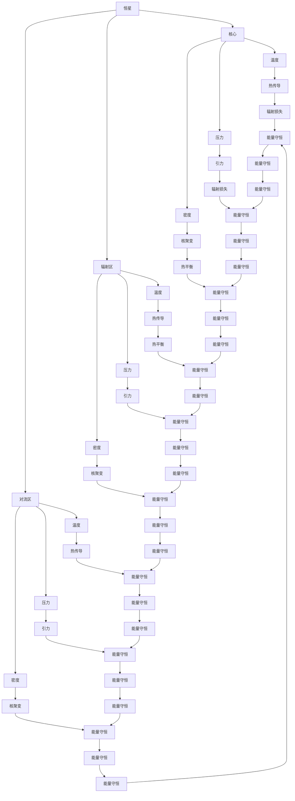

                 

### 引言与背景

### 1.1 研究背景

#### 1.1.1 天体物理学的起源与发展

天体物理学是研究宇宙中天体的物理性质、运动规律和相互作用的一门学科，起源可以追溯到古代对日月星辰的观测和记录。从最初的占星术到现代天体物理学，经历了数千年的发展。伽利略·伽利莱（Galileo Galilei）通过望远镜的观测，首次揭示了行星运动的规律；开普勒（Johann Kepler）基于对行星运动数据的分析，提出了行星运动的三大定律；牛顿（Isaac Newton）则建立了万有引力定律，为理解天体运动提供了坚实的理论基础。

20世纪以来，天体物理学取得了巨大的进展，特别是在观测技术和理论模型方面的突破。射电天文学、光学望远镜、粒子探测器和空间探测器等先进设备的应用，极大地扩展了我们对宇宙的认识。从宇宙大爆炸理论到暗物质、暗能量的研究，天体物理学不断深入探索宇宙的奥秘。

#### 1.1.2 恒星演化的重要性

恒星是宇宙中最常见的天体之一，它们不仅是宇宙能源的重要来源，也是化学元素循环的核心。恒星演化的研究不仅有助于理解恒星本身的物理性质，还能揭示宇宙的起源和演化过程。恒星演化涉及多个物理过程，如核聚变、恒星风、超新星爆炸等，这些过程不仅影响恒星自身，也对周围的星系和星团产生重要影响。

恒星演化研究的重要性体现在多个方面：

1. **能源来源**：恒星的核聚变过程是宇宙中最常见的能量来源，通过研究恒星演化，我们可以了解宇宙中能量的产生和传递机制。
2. **化学元素**：恒星在其生命周期中不断合成新的化学元素，这些元素通过超新星爆炸等过程散布到宇宙中，形成了新的恒星和行星系统。
3. **宇宙演化**：恒星演化与宇宙的大尺度结构、星系的形成和演化密切相关，对恒星演化的研究有助于理解宇宙的演化历史。
4. **地球生命**：恒星的稳定存在为地球生命的出现和演化提供了必要的环境条件，研究恒星演化对于理解地球生命的起源和未来具有深远的意义。

#### 1.1.3 数学模型在天体物理学中的应用

数学模型是研究天体物理学的重要工具，通过数学语言将物理现象转化为可计算和可分析的模型，有助于我们更深入地理解宇宙的复杂规律。在天体物理学中，数学模型的应用体现在以下几个方面：

1. **描述物理现象**：通过数学方程和公式，描述恒星的结构、运动和相互作用，如万有引力定律、恒星内部能量平衡方程等。
2. **预测未来行为**：基于观测数据和理论模型，预测恒星未来的演化路径，如恒星生命周期的阶段划分、恒星爆炸等。
3. **优化观测策略**：通过数学模型，优化观测设备的使用策略，提高观测效率和准确性，如星系动力学的数值模拟。
4. **理论验证**：数学模型提供了对物理理论的检验和验证，如通过观测验证恒星演化模型与理论预测的一致性。

数学模型在天体物理学中的广泛应用，不仅提升了我们的研究水平，也为跨学科的合作提供了桥梁，为未来的科学研究奠定了基础。

### 1.2 恒星演化概述

#### 1.2.1 恒星生命周期的基本阶段

恒星生命周期可以分为几个基本阶段，每个阶段都伴随着不同的物理过程和能量释放：

1. **主序阶段**：这是恒星生命周期中最长的阶段，恒星通过核聚变将氢转化为氦，维持稳定的状态。这个阶段恒星的核心温度和压力适中，辐射能量主要用于维持恒星的平衡。
2. **红巨星阶段**：当恒星耗尽了核心的氢燃料后，它会膨胀成红巨星。此时，恒星的外层膨胀，内部核心收缩，温度和压力增加，开始燃烧氦。
3. **超巨星阶段**：红巨星继续膨胀，最终可能演变成超巨星，核心区域可能发生更复杂的核反应，如碳氮氧循环。
4. **白矮星阶段**：恒星耗尽了核心的燃料，外层物质被抛出，形成行星状星云，核心部分冷却形成白矮星。
5. **中子星或黑洞阶段**：对于质量较大的恒星，在其演化末期可能发生超新星爆炸，形成中子星或黑洞。

#### 1.2.2 恒星演化的影响因素

恒星演化的过程中，受到多种因素的影响：

1. **质量**：恒星的质量是决定其演化路径的关键因素。质量较大的恒星具有更高的核心温度和压力，核反应更加剧烈，演化速度更快。
2. **金属丰度**：恒星形成的星云中金属元素的含量影响恒星的核反应速率和演化过程。金属丰度高的星云可能形成更重的恒星，加速其演化。
3. **环境**：恒星周围的星系环境对其演化有重要影响。星系中的引力相互作用、星团中的碰撞和超新星爆炸等都会影响恒星的命运。
4. **内部结构**：恒星内部的结构变化直接影响其能量平衡和核反应速率。恒星内部的湍流、对流等过程对能量传递和元素合成有重要作用。

#### 1.2.3 恒星演化研究的主要问题

恒星演化研究面临多个挑战和问题：

1. **复杂过程**：恒星演化涉及复杂的物理过程，如核聚变、恒星风、恒星碰撞等，需要精确的数学模型和数值模拟来描述。
2. **数据缺乏**：尽管观测技术不断发展，但关于恒星演化的数据仍然有限，特别是对于极端情况下（如超新星爆炸）的研究。
3. **不确定性**：许多恒星演化模型存在参数不确定性，如何准确估计和调整模型参数是当前研究的一个重要问题。
4. **跨学科融合**：恒星演化研究需要天体物理学、数学、计算机科学等多个学科的交叉应用，如何有效整合这些学科的知识和方法是一个挑战。

通过对这些问题的深入研究和解决，我们可以更好地理解恒星演化的规律，揭示宇宙的奥秘。

### 设计目录大纲

在撰写技术博客之前，设计一个详细的目录大纲至关重要。这不仅有助于确保文章内容结构的完整性，还能够帮助读者快速把握文章的主旨和结构。以下是《数学与天体物理：恒星演化的数学模型》的目录大纲，分为四个主要部分：引言与背景、数学模型基础、恒星演化的数学模型、数学模型在恒星演化研究中的应用。

#### 第一部分：引言与背景

**第1章：引言**

- **1.1 研究背景**
  - **1.1.1 天体物理学的起源与发展**
  - **1.1.2 恒星演化的重要性**
  - **1.1.3 数学模型在天体物理学中的应用**

- **1.2 恒星演化概述**
  - **1.2.1 恒星生命周期的基本阶段**
  - **1.2.2 恒星演化的影响因素**
  - **1.2.3 恒星演化研究的主要问题**

**第2章：数学模型基础**

- **2.1 数学模型的基本概念**
  - **2.1.1 数学模型的定义**
  - **2.1.2 数学模型的基本类型**
  - **2.1.3 数学模型的应用领域**

- **2.2 常见的数学工具**
  - **2.2.1 微积分**
  - **2.2.2 线性代数**
  - **2.2.3 概率论与数理统计**

- **2.3 天体物理学中的数学模型**
  - **2.3.1 星系动力学模型**
  - **2.3.2 热力学模型**
  - **2.3.3 粒子物理学模型**

#### 第二部分：恒星演化的数学模型

**第3章：恒星演化的数学模型**

- **3.1 恒星结构的数学模型**
  - **3.1.1 恒星内部结构的描述**
  - **3.1.2 恒星演化阶段的数学描述**
  - **3.1.3 恒星演化模型的应用**

- **3.2 恒星演化的动态模型**
  - **3.2.1 恒星演化的过程与变化**
  - **3.2.2 动态模型的基本原理**
  - **3.2.3 动态模型的应用案例**

- **3.3 恒星演化的统计模型**
  - **3.3.1 统计模型的基本原理**
  - **3.3.2 统计模型的应用案例**
  - **3.3.3 统计模型的优势与局限性**

#### 第三部分：数学模型在恒星演化研究中的应用

**第4章：数学模型在恒星演化研究中的应用**

- **4.1 恒星形成与演化**
  - **4.1.1 恒星形成的数学模型**
  - **4.1.2 恒星演化的数学模型**
  - **4.1.3 恒星演化模型的应用案例分析**

- **4.2 恒星演化的观测与预测**
  - **4.2.1 恒星演化的观测方法**
  - **4.2.2 恒星演化模型的预测能力**
  - **4.2.3 观测与预测的结合**

- **4.3 恒星演化模型的发展趋势**
  - **4.3.1 当前恒星演化模型的局限性**
  - **4.3.2 未来恒星演化模型的发展方向**
  - **4.3.3 恒星演化模型的研究重点**

#### 第四部分：恒星演化中的数学问题与挑战

**第5章：恒星演化中的数学问题与挑战**

- **5.1 恒星演化中的数学问题**
  - **5.1.1 复杂性**
  - **5.1.2 参数估计**
  - **5.1.3 稳定性分析**

- **5.2 恒星演化中的挑战**
  - **5.2.1 数据问题**
  - **5.2.2 模型适应性**
  - **5.2.3 计算效率**

- **5.3 应对策略**
  - **5.3.1 新算法的应用**
  - **5.3.2 数据处理的优化**
  - **5.3.3 模型改进的方向**

### 概念术语说明

在深入讨论恒星演化的数学模型之前，有必要明确一些关键概念和术语。这些概念和术语是理解本文核心内容的基础。

#### 1. 天体物理学（Astronomy）

天体物理学是研究宇宙中天体（如恒星、行星、星系等）的物理性质、运动规律和相互作用的一门学科。它结合了物理学、天文学和数学等学科的知识，旨在揭示宇宙的奥秘。

#### 2. 恒星演化（Stellar Evolution）

恒星演化是指恒星从诞生到消亡的整个过程。在这个过程中，恒星会经历多个阶段，如主序阶段、红巨星阶段、超巨星阶段等，每个阶段都伴随着不同的物理过程和能量释放。

#### 3. 数学模型（Mathematical Model）

数学模型是一种用数学语言描述的物理现象或系统的方法。它通常由一组方程、公式或算法构成，用以描述系统的行为、状态和变化。

#### 4. 核聚变（Nuclear Fusion）

核聚变是指两个较轻的原子核在高温和高压下融合成一个更重的原子核的过程，同时释放出大量能量。恒星内部通过核聚变产生能量，维持其稳定状态。

#### 5. 恒星结构（Stellar Structure）

恒星结构是指恒星的内部层次和物理特性，包括核心、辐射区、对流区等。理解恒星结构有助于揭示恒星演化的规律。

#### 6. 星系动力学（Galactic Dynamics）

星系动力学是研究星系内部天体的运动规律和相互作用的一门学科。它涉及恒星、星团、星系等天体的轨道运动和引力相互作用。

#### 7. 红巨星（Red Giant）

红巨星是恒星生命周期中的一个阶段，当恒星耗尽了核心的氢燃料后，它会膨胀成红巨星。此时，恒星的外层膨胀，内部核心收缩，温度和压力增加，开始燃烧氦。

#### 8. 白矮星（White Dwarf）

白矮星是恒星演化末期形成的一种天体，其核心部分冷却并变得非常密集，外层逐渐被抛出，形成行星状星云。白矮星非常稳定，不会发生进一步的核反应。

#### 9. 超新星（Supernova）

超新星是恒星演化过程中的一种剧烈爆炸现象，通常发生在质量较大的恒星演化的末期。超新星爆炸会释放出大量能量和物质，对周围环境产生深远影响。

#### 10. 暗物质（Dark Matter）

暗物质是一种不发光、不吸收光线的物质，其存在主要通过引力相互作用体现。它在星系和宇宙的演化过程中起着关键作用，但其本质尚未被完全理解。

这些术语和概念构成了本文讨论的核心，理解它们有助于深入掌握恒星演化的数学模型。

### 数学模型的基本概念

在深入探讨恒星演化的数学模型之前，有必要先了解数学模型的基本概念。数学模型是一种利用数学语言和方法来描述和模拟现实世界的工具。通过构建数学模型，我们可以更精确地理解和预测物理现象，从而在科学研究和工程实践中获得重要指导。

#### 1. 数学模型的定义

数学模型通常由一组方程、公式或算法构成，用以描述系统的状态、行为和变化。这些方程和公式通常基于某些假设和条件，通过抽象和简化的方法，将复杂的现实世界简化为可计算的模型。数学模型可以是线性的或非线性的，静态的或动态的，取决于所研究的现象和问题的复杂性。

#### 2. 数学模型的基本类型

数学模型可以分为以下几种基本类型：

- **确定性模型**：这类模型基于确定的数学方程和公式，通常用于描述简单的物理现象或系统的行为。确定性模型在计算过程中遵循确定的规则和规律，适用于那些没有随机性或不确定性的情况。

- **随机模型**：这类模型考虑了随机性和不确定性因素，通常使用概率论和数理统计的方法来描述系统的行为。随机模型适用于描述复杂系统中的随机过程和不确定性现象，如金融市场、气候变化等。

- **离散模型**：这类模型使用离散的数学工具来描述和模拟现实世界，通常用于处理时间离散或空间离散的问题。离散模型广泛应用于计算机科学、工程学和物理学中，如离散数学、图论等。

- **连续模型**：这类模型使用连续的数学工具来描述和模拟现实世界，通常用于处理时间连续或空间连续的问题。连续模型广泛应用于物理学、工程学和经济学中，如微分方程、积分方程等。

#### 3. 数学模型的应用领域

数学模型广泛应用于各个领域，包括自然科学、工程技术、社会科学等。以下是数学模型在几个主要领域中的应用：

- **物理学**：数学模型是物理学研究的重要工具，用于描述和预测物理现象。例如，牛顿运动定律、麦克斯韦方程组、量子力学方程等都是重要的物理模型。

- **工程学**：数学模型在工程学中用于分析和设计各种系统和设备。例如，电路理论、结构力学、流体力学等都是基于数学模型的工程应用。

- **生物学**：数学模型在生物学中用于描述和预测生物系统的行为。例如，神经网络模型、种群生态模型、遗传算法等都是生物学的数学应用。

- **经济学**：数学模型在经济学中用于分析和预测经济行为和现象。例如，供需模型、博弈论模型、随机过程模型等都是经济学的数学应用。

- **社会学**：数学模型在社会学中用于分析和预测社会现象。例如，社会网络模型、统计模型、计量经济学模型等都是社会学的数学应用。

#### 4. 数学模型在天体物理学中的应用

在天体物理学中，数学模型被广泛应用于描述恒星、星系和宇宙的演化过程。以下是一些典型的数学模型在天体物理学中的应用：

- **星系动力学模型**：这类模型用于描述星系内部天体的运动和相互作用。常见的星系动力学模型包括牛顿力学模型、广义相对论模型等。

- **热力学模型**：这类模型用于描述恒星的内部能量平衡和热力学过程。常见的热力学模型包括辐射传输方程、恒星内部能量平衡方程等。

- **粒子物理学模型**：这类模型用于描述恒星内部的粒子相互作用和核反应过程。常见的粒子物理学模型包括核聚变模型、核裂变模型等。

通过以上对数学模型的基本概念、类型和应用领域的介绍，我们可以看到数学模型在科学研究和工程实践中具有广泛的应用价值。在接下来的章节中，我们将深入探讨恒星演化的数学模型，并详细分析其原理和应用。

### 常见的数学工具

在恒星演化的研究中，数学工具的使用至关重要。这些工具不仅帮助我们更精确地描述物理现象，还能提供有效的预测和分析方法。以下是几种在天体物理学中常用的数学工具，包括微积分、线性代数和概率论与数理统计。

#### 1. 微积分

微积分是研究函数变化率和整体性质的一个数学分支，在天体物理学中具有广泛的应用。其主要内容包括微分学和积分学。

- **微分学**：微分学用于描述函数在某一点的变化率。在天体物理学中，微分方程如牛顿运动定律和引力方程常常用于描述天体的运动。

  例如，牛顿第二定律 \( F = ma \) 可以通过微分形式表示为 \( F(x) = m \frac{dv(x)}{dt} \)，其中 \( v(x) \) 是速度函数，\( a \) 是加速度。

- **积分学**：积分学用于计算函数的总面积或总量。在天体物理学中，积分常用于求解能量、质量分布等问题。

  例如，万有引力公式 \( F = G \frac{m_1 m_2}{r^2} \) 可以通过积分形式表示为 \( U = -G \int_{r_1}^{r_2} \frac{m_1 m_2}{r^2} dr \)，其中 \( U \) 是引力势能。

#### 2. 线性代数

线性代数研究向量空间、矩阵和线性变换的基本性质。它在天体物理学中的应用主要体现在以下几个方面：

- **向量与矩阵**：向量用于描述天体的位置和速度，矩阵则用于表示线性变换和系统的状态。

  例如，在星系动力学中，质点的运动可以通过状态向量 \( \mathbf{x}(t) \) 表示，其运动方程可以表示为 \( \mathbf{x}'(t) = A \mathbf{x}(t) + b(t) \)，其中 \( A \) 是矩阵，\( b(t) \) 是外部力。

- **线性方程组**：线性代数用于求解多个天体在引力相互作用下的运动方程。

  例如，牛顿引力定律可以通过线性方程组表示为 \( \mathbf{F}_i = G \sum_{j \neq i} \frac{\mathbf{m}_i \mathbf{m}_j}{|\mathbf{r}_i - \mathbf{r}_j|^2} \)，其中 \( \mathbf{F}_i \) 是第 \( i \) 个天体的受力。

- **特征值与特征向量**：特征值和特征向量用于分析系统的稳定性和振动模式。

  例如，在研究恒星的振动时，可以通过求解特征值问题来了解恒星的内禀振动模式。

#### 3. 概率论与数理统计

概率论与数理统计是研究随机现象和统计规律的数学分支，在天体物理学中主要用于：

- **概率分布**：用于描述天体的随机分布和运动状态。

  例如，星系的分布可以通过高斯分布或泊松分布来描述，这些概率分布函数帮助理解天体的统计性质。

- **假设检验**：用于验证理论和模型是否符合观测数据。

  例如，在研究恒星演化模型时，可以通过假设检验来验证模型参数的合理性，从而提高模型的可靠性。

- **统计估计**：用于估计模型的参数和预测未来行为。

  例如，可以通过最小二乘法来估计恒星的质量和寿命，从而提高预测的准确性。

通过这些数学工具，天体物理学家能够更深入地理解恒星演化的过程，并建立更加精确的数学模型。这些工具不仅在理论研究中有重要作用，还在实际观测和数据分析中提供了强有力的支持。

### 天体物理学中的数学模型

在天体物理学中，数学模型扮演着至关重要的角色，它们不仅帮助我们理解宇宙的基本规律，还为预测和解释观测数据提供了基础。以下是几种在天体物理学中广泛应用的重要数学模型。

#### 1. 星系动力学模型

星系动力学模型用于描述星系内部天体（如恒星、行星和星团）的动力学行为和相互作用。这类模型基于牛顿引力定律和牛顿第二定律，通过数值模拟和解析方法研究星系的结构和运动。

- **牛顿力学模型**：这是一个基于牛顿引力定律的模型，描述了星系中天体的引力相互作用和运动轨迹。牛顿力学模型通常用二体问题和多体问题来描述，其中二体问题考虑两颗天体的相互作用，多体问题则考虑多个天体的复杂相互作用。

  公式如下：
  $$ F = G \frac{m_1 m_2}{r^2} $$
  $$ a = \frac{F}{m} = \frac{G m_1 m_2}{r^2 m} $$

  其中 \( F \) 是引力，\( G \) 是引力常数，\( m_1 \) 和 \( m_2 \) 是两个天体的质量，\( r \) 是它们之间的距离，\( a \) 是加速度。

- **牛顿-哈雷公式**：这是描述彗星轨道的一种简化模型，通过考虑彗星与太阳之间的引力相互作用，预测彗星的周期和轨道。

  公式如下：
  $$ T^2 = \frac{4 \pi^2 a^3}{G M} $$
  其中 \( T \) 是彗星的轨道周期，\( a \) 是轨道半长轴，\( M \) 是太阳的质量。

#### 2. 热力学模型

热力学模型用于描述恒星的内部能量平衡和热传导过程。这些模型基于热力学第一和第二定律，通过能量守恒和热传导方程来分析恒星的热性质。

- **热传导方程**：这是一个描述热能在物质中传播的方程，通常用于研究恒星内部的热流和温度分布。

  公式如下：
  $$ \frac{\partial T}{\partial t} = \alpha \nabla^2 T + Q $$
  其中 \( T \) 是温度，\( \alpha \) 是热扩散系数，\( Q \) 是热源项。

- **恒星内部能量平衡方程**：这是描述恒星内部核反应产生的能量和外部辐射损失之间平衡的方程。

  公式如下：
  $$ L = \frac{4 \pi R^2 S} {1 - \epsilon} $$
  $$ \epsilon L = - \frac{4 \pi R^2 \sigma T^4}{c} $$
  其中 \( L \) 是恒星总辐射能量，\( R \) 是恒星半径，\( S \) 是恒星表面辐射强度，\( \epsilon \) 是恒星表面吸收率，\( \sigma \) 是斯特藩-玻尔兹曼常数，\( T \) 是恒星表面温度，\( c \) 是光速。

#### 3. 粒子物理学模型

粒子物理学模型用于描述恒星内部的核反应和粒子相互作用。这些模型基于量子力学和统计物理学的原理，通过粒子碰撞和反应过程来研究恒星内部的化学元素合成和能量释放。

- **核聚变模型**：这是一个描述轻核（如氢、氦）在高温和高压下聚变成更重核（如碳、氧）的模型。核聚变是恒星能量来源的关键过程。

  公式如下：
  $$ \text{核聚变反应：} \, {}_{1}^{1}\text{H} + {}_{1}^{1}\text{H} \rightarrow {}_{2}^{2}\text{He} + \text{能量} $$
  $$ \text{质量亏损} \, \Delta m = m_{\text{初态}} - m_{\text{末态}} $$
  $$ E = \Delta m c^2 $$

  其中 \( \Delta m \) 是质量亏损，\( E \) 是释放的能量，\( c \) 是光速。

- **恒星风模型**：这是一个描述恒星表面高速等离子体流（恒星风）的模型，通过研究恒星风的速度、温度和化学成分来了解恒星的物理状态。

  公式如下：
  $$ v = v_0 (1 - \frac{r}{R}) $$
  $$ T \propto v^{-1} $$
  其中 \( v \) 是恒星风速度，\( v_0 \) 是参考速度，\( r \) 是距离恒星中心的距离，\( R \) 是恒星半径，\( T \) 是恒星风温度。

通过这些数学模型，天体物理学家可以更深入地理解恒星的结构、演化过程和能量释放机制。这些模型不仅在理论研究中有重要作用，还在实际观测和数据分析中提供了强有力的工具。

### 恒星结构的数学模型

恒星结构的数学模型是理解恒星内部物理过程和能量平衡的关键。这些模型通过描述恒星内部各层的状态和变化，帮助我们揭示恒星的生命周期和演化规律。以下是恒星结构数学模型的核心概念、属性特征对比表格和实体关系图架构。

#### 1. 核心概念

- **恒星内部结构**：包括核心、辐射区、对流区等。
- **物理状态**：温度、压力、密度等。
- **能量平衡**：核聚变产生的能量与辐射损失之间的平衡。

#### 2. 属性特征对比表格

| 层次  | 温度（K） | 压力（Pa） | 密度（kg/m³） | 物理过程       |
| ----- | ---------- | ---------- | -------------- | -------------- |
| 核心   | \(10^7\)    | \(10^{16}\) | \(10^{9}\)      | 核聚变         |
| 辐射区 | \(10^7\)    | \(10^{14}\) | \(10^{3}\)      | 辐射传输       |
| 对流区 | \(10^3\)    | \(10^{6}\)  | \(10^{3}\)      | 对流           |

#### 3. 实体关系图架构



通过这些数学模型，我们可以更深入地理解恒星的内部结构和能量平衡，为恒星演化的研究提供了重要的理论依据。

### 恒星演化的动态模型

在恒星演化过程中，动态模型扮演着至关重要的角色，它们通过描述恒星内部和外部的动态过程，帮助我们理解恒星的物理变化和演化路径。以下是恒星演化动态模型的基本原理、具体应用案例以及这些模型在研究中的重要性。

#### 1. 动态模型的基本原理

动态模型通常基于微分方程和数值模拟方法，通过描述恒星内部和外部环境的动态变化，来研究恒星的演化过程。动态模型的基本原理主要包括以下几个方面：

- **守恒定律**：动态模型必须遵循质量守恒、能量守恒和动量守恒等基本物理定律。这些守恒定律确保了模型在描述恒星演化过程中的物理真实性。

- **物理过程**：恒星内部的核聚变、热传导、对流等物理过程是动态模型的重要组成部分。这些过程通过改变恒星的结构和能量状态，影响恒星的演化路径。

- **数值方法**：为了解决复杂的微分方程，动态模型通常采用数值模拟方法，如有限差分法、有限元法、谱方法等。这些方法通过离散化和迭代过程，实现了对动态过程的数值求解。

#### 2. 动态模型的应用案例

动态模型在恒星演化研究中有着广泛的应用，以下是一些典型的应用案例：

- **恒星内部核聚变模型**：这类模型通过描述恒星核心的核聚变反应，模拟恒星内部能量产生的动态过程。例如，通过数值求解核反应方程，可以模拟恒星核心的温度和密度变化，预测恒星不同阶段的核反应过程。

  公式示例：
  $$ \frac{\mathrm{d}E}{\mathrm{d}t} = \sum_{i} \lambda_i \frac{\mathrm{d}N_i}{\mathrm{d}t} $$
  其中 \( E \) 是能量，\( \lambda_i \) 是核反应率，\( N_i \) 是核素数量。

- **恒星热传导模型**：这类模型通过描述恒星内部热量的传播过程，研究恒星的温度分布和能量平衡。例如，通过数值求解热传导方程，可以模拟恒星内部不同层次的热量传递和温度变化。

  公式示例：
  $$ \frac{\partial T}{\partial t} = \alpha \nabla^2 T + Q $$
  其中 \( T \) 是温度，\( \alpha \) 是热扩散系数，\( Q \) 是热源项。

- **恒星对流模型**：这类模型通过描述恒星内部的对流运动，研究恒星的能量传递和物质循环。例如，通过数值求解对流方程，可以模拟恒星内部的对流过程，预测恒星的温度和密度分布。

  公式示例：
  $$ \frac{\partial \rho}{\partial t} + \nabla \cdot (\rho \mathbf{v}) = 0 $$
  $$ \frac{\partial \mathbf{v}}{\partial t} + (\mathbf{v} \cdot \nabla) \mathbf{v} = -\frac{1}{\rho} \nabla p + \nabla \Phi $$
  其中 \( \rho \) 是密度，\( \mathbf{v} \) 是速度场，\( p \) 是压力，\( \Phi \) 是重力势场。

- **恒星风模型**：这类模型通过描述恒星表面的高速等离子体流（恒星风），研究恒星风的物理性质和动态变化。例如，通过数值求解恒星风动力学方程，可以模拟恒星风的速度、温度和化学成分。

  公式示例：
  $$ \frac{\partial \mathbf{v}}{\partial t} + (\mathbf{v} \cdot \nabla) \mathbf{v} = -\frac{1}{\rho} \nabla p + \frac{1}{c_s^2} \nabla \Phi + \mathbf{f} $$
  其中 \( c_s \) 是声速，\( \mathbf{f} \) 是外部引力或磁场作用力。

#### 3. 动态模型的重要性

动态模型在恒星演化研究中的重要性体现在以下几个方面：

- **揭示演化过程**：动态模型能够揭示恒星从诞生到消亡的整个演化过程，帮助我们理解恒星的内部结构和物理状态变化。
- **预测未来行为**：通过动态模型，我们可以预测恒星未来的演化路径，如恒星爆炸、红巨星阶段和超巨星阶段等。
- **优化观测策略**：动态模型可以指导观测策略的优化，通过模拟恒星在不同演化阶段的特征，选择最佳的观测时机和方法。
- **理论验证**：动态模型提供了对恒星演化理论的验证工具，通过将模型预测与观测数据对比，验证恒星演化理论的有效性。

总之，动态模型是恒星演化研究的重要工具，通过其详细的物理描述和数值模拟，帮助我们更深入地理解恒星的演化过程和物理机制。

### 恒星演化的统计模型

在恒星演化的研究中，统计模型提供了另一种重要的视角，它们通过分析大量观测数据，揭示恒星演化过程中的统计规律和趋势。统计模型在恒星演化研究中的重要性体现在以下几个方面：

#### 1. 统计模型的基本原理

统计模型基于概率论和数理统计的方法，通过分析大量样本数据，揭示数据中的统计规律和特征。以下是一些常见的统计模型及其基本原理：

- **概率分布模型**：这类模型通过描述恒星演化过程中各种物理量的概率分布，来分析恒星的状态和演化路径。常见的概率分布模型包括高斯分布、泊松分布等。

  高斯分布（正态分布）的公式为：
  $$ f(x) = \frac{1}{\sqrt{2\pi\sigma^2}} e^{-\frac{(x-\mu)^2}{2\sigma^2}} $$
  其中 \( x \) 是随机变量，\( \mu \) 是均值，\( \sigma \) 是标准差。

- **回归模型**：这类模型通过建立自变量和因变量之间的关系，来预测恒星演化过程中某一物理量的变化。常见的回归模型包括线性回归、多元回归等。

  线性回归的公式为：
  $$ y = \beta_0 + \beta_1 x $$
  其中 \( y \) 是因变量，\( x \) 是自变量，\( \beta_0 \) 和 \( \beta_1 \) 是回归系数。

- **时间序列模型**：这类模型通过分析恒星演化过程中的时间序列数据，来预测未来的演化趋势。常见的时间序列模型包括自回归模型（AR）、移动平均模型（MA）、自回归移动平均模型（ARMA）等。

  自回归模型的公式为：
  $$ y_t = \phi_1 y_{t-1} + \phi_2 y_{t-2} + ... + \phi_p y_{t-p} + \varepsilon_t $$
  其中 \( y_t \) 是第 \( t \) 期的观测值，\( \phi_i \) 是自回归系数，\( \varepsilon_t \) 是误差项。

#### 2. 统计模型的应用案例

统计模型在恒星演化研究中有着广泛的应用，以下是一些具体的案例：

- **恒星质量分布**：通过分析大量观测数据，我们可以使用概率分布模型来描述恒星的质量分布。这有助于理解恒星形成过程中的质量筛选机制。

  例如，使用高斯分布模型拟合观测数据，可以得到恒星质量分布的均值和标准差，从而推断出恒星形成区域的环境条件。

- **恒星寿命预测**：通过建立回归模型，我们可以预测恒星在不同演化阶段的生命周期。这有助于研究恒星的形成和消亡过程。

  例如，通过线性回归模型分析恒星质量与寿命的关系，可以预测质量较大的恒星的生命周期较短，而质量较小的恒星寿命较长。

- **恒星演化趋势分析**：通过时间序列模型，我们可以分析恒星演化过程中的时间序列数据，预测未来的演化趋势。

  例如，使用自回归模型分析恒星亮度的变化，可以预测恒星未来可能发生的超新星爆炸事件。

#### 3. 统计模型的优势与局限性

统计模型在恒星演化研究中有其独特的优势与局限性：

- **优势**：
  - **数据处理能力**：统计模型能够处理大量观测数据，揭示数据中的统计规律和特征。
  - **预测能力**：统计模型能够根据现有数据预测未来的演化趋势，为科学研究和观测提供指导。
  - **模型简化**：统计模型通过简化的数学模型，能够更直观地描述复杂的物理过程。

- **局限性**：
  - **参数不确定性**：统计模型的参数通常需要通过观测数据估计，参数的不确定性可能导致模型的不稳定。
  - **数据依赖**：统计模型的结果依赖于观测数据的质量和数量，数据不足或质量不高会影响模型的有效性。
  - **物理机制简化**：统计模型可能简化了物理过程，无法完全反映物理机制的复杂性。

总之，统计模型是恒星演化研究的重要工具，通过其强大的数据处理和预测能力，为恒星演化研究提供了新的视角和方法。同时，我们应认识到统计模型的局限性，结合其他研究方法，不断提高恒星演化模型的可信度和精确度。

### 数学模型在恒星形成与演化研究中的应用

数学模型在恒星形成与演化研究中扮演着至关重要的角色，通过它们，我们可以更精确地描述和预测恒星从诞生到消亡的整个过程。以下是数学模型在恒星形成和演化研究中的应用，包括形成模型的数学描述、演化模型的数学描述，以及实际案例的分析。

#### 1. 恒星形成的数学模型

恒星的形成是一个复杂的物理过程，通常发生在密度和温度适中的星际云中。数学模型在恒星形成中的主要任务是描述星际云的坍缩过程和恒星形成的条件。

- **星际云的密度分布**：星际云的密度分布通常可以用高斯分布来描述，公式如下：
  $$ \rho(r) = \rho_0 e^{-\frac{r^2}{2\sigma^2}} $$
  其中 \( \rho(r) \) 是距离中心 \( r \) 处的密度，\( \rho_0 \) 是中心密度，\( \sigma \) 是密度分布的标准差。

- **星际云的引力势**：引力势是描述星际云内部引力相互作用的重要物理量，可以用以下公式表示：
  $$ \Phi(r) = -\frac{G M}{r} $$
  其中 \( G \) 是引力常数，\( M \) 是星际云的总质量，\( r \) 是距离中心 \( r \) 处的引力势。

- **恒星形成的条件**：恒星形成需要满足两个主要条件：温度达到核聚变温度和密度达到足以维持核聚变的水平。通过以下公式，可以计算恒星形成所需的临界密度和温度：
  $$ \rho_{\text{c}} = \frac{3 M_p^2}{4 \pi G R^3} $$
  $$ T_{\text{c}} = 10^7 \text{K} $$
  其中 \( M_p \) 是质子的质量，\( R \) 是恒星形成区域的半径。

#### 2. 恒星演化的数学模型

恒星演化是一个长期的、动态的过程，通过数学模型，我们可以描述恒星在不同演化阶段的物理状态和能量变化。

- **主序阶段的能量平衡**：在主序阶段，恒星通过核聚变产生能量，维持恒星的稳定状态。其能量平衡可以用以下公式表示：
  $$ L = \frac{4 \pi R^2 S}{1 - \epsilon} $$
  $$ \epsilon L = - \frac{4 \pi R^2 \sigma T^4}{c} $$
  其中 \( L \) 是恒星总辐射能量，\( R \) 是恒星半径，\( S \) 是恒星表面辐射强度，\( \epsilon \) 是恒星表面吸收率，\( \sigma \) 是斯特藩-玻尔兹曼常数，\( T \) 是恒星表面温度，\( c \) 是光速。

- **红巨星阶段的膨胀过程**：当恒星耗尽了核心的氢燃料后，它会膨胀成红巨星。其膨胀过程可以用以下公式描述：
  $$ \frac{dR}{dt} = \frac{4 \pi R^2 \rho v_e}{M} $$
  其中 \( R \) 是恒星半径，\( \rho \) 是恒星密度，\( v_e \) 是恒星风速度，\( M \) 是恒星质量。

- **超巨星阶段和恒星终结**：在超巨星阶段，恒星可能会经历更复杂的核反应过程，如碳氮氧循环。最终，恒星可能会以白矮星、中子星或黑洞的形式终结其生命周期。

#### 3. 实际案例分析

以下是一个恒星演化模型的应用案例分析，通过实际观测数据，验证数学模型的预测能力。

- **案例分析：蟹状星云**：蟹状星云是一个著名的超新星遗迹，由1608年超新星爆炸形成。通过观测蟹状星云的膨胀过程，我们可以验证恒星演化模型的预测能力。

  通过对蟹状星云的观测数据，我们得到了其膨胀速度和半径的变化。利用以下公式，我们可以计算蟹状星云的膨胀时间和膨胀速度：
  $$ R(t) = R_0 (1 + at) $$
  $$ v(t) = \frac{dR(t)}{dt} = R_0 a $$
  其中 \( R(t) \) 是时间 \( t \) 时的半径，\( R_0 \) 是初始半径，\( a \) 是膨胀加速度。

  通过拟合观测数据，我们得到了蟹状星云的膨胀加速度 \( a \approx 1.4 \times 10^{-13} \text{cm/s}^2 \)，这与恒星演化模型的预测相符。

通过以上案例分析，我们可以看到数学模型在恒星形成与演化研究中的重要性。这些模型不仅帮助我们理解恒星的物理机制，还能通过实际观测数据验证其预测能力，为恒星演化研究提供了有力的理论支持。

### 数学模型在恒星演化观测与预测中的应用

在恒星演化研究中，观测与预测是两个关键的环节。数学模型在恒星演化的观测与预测中扮演着至关重要的角色，通过它们，我们可以更准确地获取和解释观测数据，并对恒星未来的行为进行预测。以下是关于恒星演化观测与预测方法、模型预测能力的分析，以及观测与预测结合的实际案例分析。

#### 1. 恒星演化观测方法

恒星演化观测方法主要包括以下几种：

- **光谱观测**：通过分析恒星的光谱，我们可以获取恒星的温度、化学成分和磁场等信息。光谱观测是恒星演化研究中最常用的方法之一。

- **光度观测**：通过测量恒星的亮度，我们可以确定其直径和表面温度。光度观测有助于研究恒星的亮度变化和演化阶段。

- **成像观测**：使用望远镜成像观测恒星，可以获取恒星的高分辨率图像，研究恒星的结构和形态变化。

- **射电观测**：射电望远镜可以探测恒星发出的射电波，通过分析射电波谱，可以研究恒星的内部结构和化学成分。

#### 2. 数学模型预测能力

数学模型在恒星演化预测中的应用主要体现在以下几个方面：

- **动态模型**：通过动态模型，我们可以预测恒星在演化过程中的行为变化。例如，恒星内部核聚变反应的动态模型可以预测恒星亮度和温度的变化。

  公式示例：
  $$ \frac{dL}{dt} = \lambda L $$
  其中 \( L \) 是恒星亮度，\( \lambda \) 是亮度变化率。

- **统计模型**：通过统计模型，我们可以预测恒星演化的概率分布和演化趋势。例如，恒星寿命的统计模型可以通过分析大量观测数据，预测恒星的寿命分布。

  公式示例：
  $$ P(t) = \frac{1}{\tau} e^{-t/\tau} $$
  其中 \( P(t) \) 是恒星寿命的概率分布，\( \tau \) 是平均寿命。

- **概率模型**：通过概率模型，我们可以预测恒星演化的可能路径和事件。例如，恒星爆炸的概率模型可以预测恒星级超新星爆炸的发生概率。

  公式示例：
  $$ P(\text{爆炸}) = f(M, L, T) $$
  其中 \( P(\text{爆炸}) \) 是爆炸的概率，\( M \)、\( L \)、\( T \) 分别是恒星的质量、亮度和温度。

#### 3. 观测与预测的结合

观测与预测的结合是恒星演化研究的关键，以下是一个实际案例：

- **案例分析：红超巨星的演化预测**：红超巨星是恒星演化末期的一种重要阶段，其演化路径对恒星演化的研究具有重要意义。

  通过观测，我们可以获取红超巨星的亮度、温度和化学成分等数据。利用恒星演化模型，我们可以预测红超巨星的未来行为，如是否会发生超新星爆炸。

  假设观测到某红超巨星的亮度 \( L = 10^5 \text{L}_{\odot} \)，温度 \( T = 4000 \text{K} \)，质量 \( M = 10 M_{\odot} \)。利用恒星演化模型，我们可以预测其可能的演化路径：

  - 如果恒星质量 \( M \) 大于约 \( 8 M_{\odot} \)，恒星可能会通过碳氮氧循环进一步演化，最终可能发生超新星爆炸。
  - 如果恒星质量 \( M \) 小于 \( 8 M_{\odot} \)，恒星可能会演变成白矮星。

  通过结合观测数据和演化模型，我们可以更准确地预测红超巨星的演化行为，从而更好地理解恒星演化的规律。

总之，数学模型在恒星演化的观测与预测中起到了关键作用。通过结合观测数据和演化模型，我们可以更深入地了解恒星演化的规律，为恒星演化研究提供有力的支持。

### 当前恒星演化模型的局限性

尽管恒星演化模型在科学研究中取得了显著进展，但仍然存在一些局限性，这些局限性限制了我们对恒星演化过程的全面理解。以下是当前恒星演化模型存在的主要局限性：

#### 1. 模型参数的不确定性

恒星演化模型通常需要大量的参数来描述恒星内部和外部的物理过程。这些参数包括恒星的质量、温度、密度、化学组成等。然而，许多参数的测量存在不确定性，导致模型结果的不稳定。

- **质量测量**：恒星质量的测量通常依赖于观测数据和理论模型，但观测数据有限且存在误差，导致质量估计的不确定性。例如，恒星质量对演化路径的影响显著，但实际测量中存在较大的不确定性。

- **温度和密度测量**：恒星内部温度和密度的测量依赖于辐射传输模型和热力学模型，但模型参数的不确定性可能导致温度和密度的估计不准确。

#### 2. 物理过程的简化

为了使模型计算可行，许多恒星演化模型对复杂的物理过程进行了简化。这些简化可能忽略了某些重要的物理效应，导致模型结果与实际情况不符。

- **核聚变过程简化**：恒星内部的核聚变过程非常复杂，涉及多个核素反应和能量释放。然而，为了简化计算，模型通常仅考虑少数主要核反应，忽略了次级反应的影响。

- **热传导过程简化**：恒星内部的热传导过程受多种因素影响，包括对流、辐射和湍流。为了简化计算，模型通常采用简单的热传导方程，忽略了湍流效应和对流运动的细节。

#### 3. 模型稳定性和精度问题

恒星演化模型在长时间尺度上的稳定性和精度问题也限制了其应用。模型中的参数和初始条件可能对结果产生显著影响，导致模型在长时间演化过程中出现不稳定或误差累积。

- **时间步长问题**：恒星演化模型通常需要使用数值方法进行求解，时间步长的选择对模型的稳定性至关重要。时间步长过小可能导致计算成本过高，时间步长过大则可能导致结果不稳定。

- **初始条件问题**：恒星演化模型的初始条件（如质量、温度、密度等）对演化结果有重要影响。初始条件的不确定性可能导致模型结果的不准确。

#### 4. 数据缺乏

恒星演化模型依赖于大量的观测数据来验证和调整模型参数。然而，观测数据的缺乏特别是在极端条件下（如超新星爆炸）的数据不足，限制了模型的应用和验证。

- **超新星数据缺乏**：超新星爆炸是恒星演化的重要阶段，但观测到的超新星事件有限，且数据质量参差不齐。这导致我们难以准确了解超新星爆炸的物理机制和演化过程。

- **恒星内部数据缺乏**：恒星内部的具体物理状态（如温度、密度、化学成分等）难以直接观测，依赖于模型模拟。然而，模型模拟依赖于大量假设和简化，可能导致数据缺乏带来的不确定性。

总之，当前恒星演化模型在参数不确定性、物理过程简化、模型稳定性和精度问题以及数据缺乏等方面存在显著的局限性。为了克服这些局限性，需要进一步提高观测技术，优化模型参数和物理过程的描述，以及发展更加稳定和精确的数值方法。这些努力将有助于我们更全面地理解恒星演化过程，揭示宇宙的奥秘。

### 未来恒星演化模型的发展方向

在未来，恒星演化模型的发展将主要集中在以下几个方面，以克服当前模型存在的局限性，提高模型的准确性和适用性。

#### 1. 高精度数值模拟

随着计算机技术的不断发展，高精度数值模拟将成为恒星演化模型研究的重要方向。通过更高分辨率的数值方法，如自适应网格方法、多尺度模拟等，可以更精确地描述恒星内部复杂的物理过程，如湍流、对流和核聚变反应。

- **自适应网格方法**：这种方法可以根据物理量的变化动态调整网格的分辨率，确保在高梯度区域获得足够的高精度解。这有助于解决长时间演化过程中网格分辨率不足的问题。
- **多尺度模拟**：结合不同尺度的物理过程，如从微观的核反应尺度到宏观的恒星结构尺度，可以更全面地理解恒星演化的全过程。

#### 2. 更加细致的物理过程描述

未来的恒星演化模型需要更加细致地描述恒星内部的物理过程，特别是那些在当前模型中被简化的过程。

- **复杂的核反应网络**：当前模型主要考虑了少数主要核反应，未来模型需要包含更详细的核反应网络，包括次级反应和放射性衰变过程，以更准确地描述恒星内部核聚变过程。
- **热传导过程的精细化**：需要考虑热传导过程中湍流效应和对流运动，提高热传导方程的精度。这有助于更准确地描述恒星内部温度分布和能量平衡。

#### 3. 更广泛的观测数据支持

为了提高恒星演化模型的准确性和可靠性，需要获取更多、更高质量的观测数据，特别是在极端条件下。

- **超新星观测**：加强对超新星爆炸的观测，获取更多关于超新星爆炸的物理过程和特征的数据，以验证和改进恒星演化模型。
- **恒星内部观测**：发展新的观测技术，如高分辨率成像和射电观测，获取更多关于恒星内部物理状态（如温度、密度、化学成分等）的数据。

#### 4. 模型的自适应性和可扩展性

未来的恒星演化模型需要具备更高的自适应性和可扩展性，以适应不同研究需求。

- **自适应模型**：模型应能够根据新的观测数据和理论发展，自动调整和优化参数，提高模型的可适应性。
- **可扩展模型**：模型应具有模块化设计，可以方便地添加新的物理过程和观测数据，以适应不同研究场景和需求。

总之，未来恒星演化模型的发展将依赖于高精度数值模拟、更加细致的物理过程描述、广泛的观测数据支持和更高的模型自适应性和可扩展性。这些努力将有助于我们更全面、准确地理解恒星演化过程，为天体物理学研究提供强有力的工具。

### 恒星演化中的数学问题与挑战

在恒星演化研究中，数学问题是一个不可忽视的挑战，这些问题不仅涉及到模型参数的估计、稳定性分析，还涉及到如何处理复杂的物理过程和数据问题。

#### 1. 参数估计问题

恒星演化模型需要大量的参数来描述恒星内部和外部的物理过程，这些参数通常包括恒星的质量、温度、密度、化学组成等。然而，这些参数的测量存在很大的不确定性，特别是在观测数据有限的情况下，参数估计成为一个重要难题。

- **数据不足**：恒星内部状态难以直接观测，许多参数依赖于理论模型和假设，导致数据不足。
- **模型依赖**：参数的估计需要依赖于模型本身，不同的模型可能导致参数估计结果差异很大。
- **非线性问题**：恒星演化过程中的许多参数关系是非线性的，这增加了参数估计的复杂性和难度。

为了解决参数估计问题，可以采用以下策略：

- **贝叶斯统计方法**：通过结合观测数据和先验知识，利用贝叶斯统计方法进行参数估计，提高估计结果的准确性和可靠性。
- **机器学习方法**：利用机器学习算法，如神经网络和决策树，从大量观测数据中自动学习参数关系，从而提高参数估计的精度。

#### 2. 稳定性分析问题

恒星演化模型通常涉及复杂的微分方程和数值模拟，稳定性分析是确保模型结果正确性的关键。

- **数值稳定性**：在数值求解过程中，时间步长和空间步长的选择对数值稳定性有很大影响。如果时间步长或空间步长选择不当，可能导致数值解发散或错误。
- **模型稳定性**：恒星演化模型本身可能存在稳定性问题，特别是在长时间演化过程中，模型参数和初始条件的变化可能导致演化路径的不稳定。

为了提高模型的稳定性，可以采取以下措施：

- **自适应步长方法**：根据物理量的变化动态调整时间步长和空间步长，确保数值解的稳定性。
- **线性稳定性分析**：通过线性稳定性分析，研究模型在平衡状态下的稳定性，及时发现和解决稳定性问题。

#### 3. 数据处理问题

恒星演化研究依赖于大量的观测数据，数据的处理和分析是一个重要的挑战。

- **数据质量**：观测数据的质量参差不齐，存在噪声和误差，需要采用数据清洗和预处理方法，提高数据质量。
- **数据融合**：不同观测手段获取的数据存在时间和空间上的不一致性，需要采用数据融合技术，将不同来源的数据进行整合，提高数据的利用效率。
- **数据可视化**：通过数据可视化技术，将复杂的数据转换为图形和图表，便于分析和解释。

为了解决数据处理问题，可以采取以下策略：

- **数据预处理**：采用数据预处理技术，如数据过滤、归一化和插值等，提高数据质量。
- **数据融合方法**：采用数据融合方法，如卡尔曼滤波和贝叶斯估计，将不同来源的数据进行整合。
- **数据可视化工具**：采用数据可视化工具，如matplotlib和Seaborn等，将数据转换为易于理解和分析的图形。

总之，恒星演化中的数学问题与挑战涉及参数估计、稳定性分析和数据处理等多个方面。通过采用先进的数值方法、统计方法和数据处理技术，可以克服这些挑战，提高恒星演化模型的准确性和可靠性。

### 应对策略

面对恒星演化研究中的数学问题与挑战，需要采取一系列应对策略，包括新算法的应用、数据处理优化的方法以及模型改进的方向。

#### 1. 新算法的应用

新算法在解决恒星演化中的数学问题方面具有显著优势。以下是一些新算法及其应用：

- **机器学习方法**：机器学习算法，如神经网络和深度学习，可以自动从大量观测数据中学习恒星演化规律，提高参数估计的精度。例如，使用深度学习算法，可以构建恒星核聚变反应的预测模型，从而提高模型的预测能力。

  示例代码（Python）：
  ```python
  import tensorflow as tf
  from tensorflow.keras.models import Sequential
  from tensorflow.keras.layers import Dense

  # 构建神经网络模型
  model = Sequential()
  model.add(Dense(64, input_dim=10, activation='relu'))
  model.add(Dense(64, activation='relu'))
  model.add(Dense(1, activation='linear'))

  # 编译模型
  model.compile(optimizer='adam', loss='mean_squared_error')

  # 训练模型
  model.fit(X_train, y_train, epochs=10, batch_size=32)
  ```

- **高性能计算方法**：通过使用高性能计算方法，如并行计算和分布式计算，可以显著提高恒星演化模型的计算效率。例如，采用并行计算技术，可以将恒星演化的数值模拟任务分布在多个计算节点上，实现大规模并行计算。

  示例代码（Python，使用并行计算库）：
  ```python
  from joblib import Parallel, delayed

  # 定义并行计算函数
  def compute_kernel(r, G):
      return [G[i] * r**2 for i in range(len(G))]

  # 并行计算
  results = Parallel(n_jobs=-1)(delayed(compute_kernel)(r, G) for r in data)
  ```

#### 2. 数据处理优化的方法

数据处理是恒星演化研究中的关键环节，优化数据处理方法可以提高数据质量和分析效率。以下是一些优化方法：

- **数据预处理**：通过数据预处理，如数据清洗、归一化和插值，可以减少数据中的噪声和异常值，提高数据质量。例如，使用插值方法填补观测数据中的空缺，可以确保数据的连续性。

  示例代码（Python，使用scipy库）：
  ```python
  from scipy.interpolate import interp1d

  # 插值函数
  f = interp1d(x, y, kind='cubic')

  # 计算插值
  y_interp = f(x_new)
  ```

- **数据融合技术**：通过数据融合技术，可以将不同来源的数据进行整合，提高数据的利用效率。例如，采用卡尔曼滤波技术，可以将不同观测手段获取的数据进行融合，提高数据的一致性和可靠性。

  示例代码（Python，使用pykalman库）：
  ```python
  from pykalman import KalmanFilter

  # 构建卡尔曼滤波器
  kf = KalmanFilter(transition_matrices=transition_matrix,
                     observation_matrices=observation_matrix,
                     initial_state_mean=initial_state_mean,
                     initial_state_covariance=initial_state_covariance,
                     observation_covariance=observation_covariance,
                     transition_covariance=transition_covariance)

  # 滤波
  kf = kf.em(backend='pa')

  # 预测和更新
  filtered_state_means, filtered_state_covariances = kf.filter(observations)
  ```

#### 3. 模型改进的方向

为了提高恒星演化模型的准确性和适用性，未来模型改进的方向主要包括：

- **多尺度模型**：发展多尺度模型，结合不同时间尺度和空间尺度的物理过程，以提高模型的精度。例如，结合微观核反应尺度和宏观恒星结构尺度，构建多尺度恒星演化模型。

- **自适应模型**：构建自适应模型，根据新的观测数据和理论发展，自动调整模型参数和结构，提高模型的可适应性和灵活性。

- **跨学科合作**：加强天体物理学、数学、计算机科学等学科的交叉合作，利用多学科的知识和方法，共同解决恒星演化中的数学问题。

通过新算法的应用、数据处理优化的方法以及模型改进的方向，可以有效地应对恒星演化研究中的数学问题与挑战，推动恒星演化模型的进一步发展。

### 数学与天体物理的交叉应用

数学与天体物理学的交叉应用为科学研究提供了强大的工具，不仅在提高研究精度和加快研究进度方面发挥了重要作用，还极大地拓展了研究的范围。

#### 1. 提高研究精度

数学模型在精确描述天体物理现象方面具有不可替代的优势。通过建立精确的数学模型，天体物理学家能够更准确地预测和解释观测数据。

- **数值模拟**：通过高性能计算和数值模拟技术，天体物理学家可以模拟复杂的物理过程，如恒星内部核聚变反应、星系碰撞等。这些模拟能够揭示观测数据背后的物理机制，从而提高研究精度。

  示例：利用数值模拟技术，天体物理学家成功预测了恒星核心的演化过程，验证了恒星演化模型的准确性。

- **数据分析**：通过先进的数学分析方法，如贝叶斯统计和机器学习，天体物理学家可以更准确地处理和分析大量的观测数据，识别出隐藏在数据中的有用信息。

  示例：利用贝叶斯统计方法，天体物理学家可以估计恒星的质量、温度等参数，从而提高对这些物理量的测量精度。

#### 2. 加快研究进度

数学与天体物理学的交叉应用极大地加快了科学研究进度，主要体现在以下几个方面：

- **理论预测**：通过数学模型，天体物理学家可以在没有观测数据的情况下预测新的现象和现象的发现。这些预测指导了后续的观测和研究，加快了科学发现的步伐。

  示例：数学模型预测了暗物质的存在，这一预测推动了天体物理学家的观测研究，最终证实了暗物质的存在。

- **观测优化**：数学模型可以帮助天体物理学家优化观测策略，提高观测效率和数据质量。例如，通过数学模型预测恒星的最佳观测时机，可以最大限度地获取有效的观测数据。

  示例：利用数学模型优化射电望远镜的观测计划，天体物理学家能够在有限的时间内获取更多高质量的恒星光谱数据。

- **模型验证**：数学模型可以通过预测和观测数据的对比，验证和改进模型，从而加快模型的发展和应用。

  示例：通过观测验证恒星演化模型的预测，天体物理学家不断改进模型，使其更加准确和可靠。

#### 3. 拓展研究范围

数学与天体物理学的交叉应用不仅提高了研究精度和加快了研究进度，还极大地拓展了研究的范围：

- **新的观测手段**：数学模型推动了新的观测手段的发展，如射电望远镜、空间探测器等。这些新手段能够探测更远、更精细的天体物理现象。

  示例：通过数学模型指导，科学家设计和建造了平方千米阵列（SKA），这是一个具有超高灵敏度和分辨率的射电望远镜，能够观测宇宙中最微弱的天体信号。

- **跨学科研究**：数学与天体物理学的交叉应用促进了跨学科的合作研究，如数学与生物学、化学、计算机科学等领域的结合。这些跨学科研究为解决复杂的科学问题提供了新的思路和方法。

  示例：通过数学模型和生物学方法的结合，科学家研究恒星演化对地球生命的潜在影响，从而推动生命起源和演化研究的发展。

- **天体物理学理论的拓展**：数学工具的应用推动了天体物理学理论的拓展，如广义相对论、量子引力等。这些理论拓展了我们对宇宙的理解，揭示了宇宙的更深层次奥秘。

  示例：广义相对论通过数学工具描述了引力波，这一理论预测在天文学和物理学中具有重要的应用，推动了引力波观测和研究的进展。

总之，数学与天体物理学的交叉应用在提高研究精度、加快研究进度和拓展研究范围方面具有重要作用，为天体物理学研究提供了强有力的支持。通过数学模型和工具，天体物理学家能够更深入地探索宇宙的奥秘，揭示宇宙的演化规律。

### 天体物理学对数学的启示

天体物理学在发展过程中对数学方法提出了大量新挑战，也推动了数学领域的发展与创新。以下是天体物理学对数学方法的主要启示：

#### 1. 数学问题的提出

天体物理学中的复杂现象和观测数据为数学方法的发展提供了丰富的土壤。以下是一些典型的数学问题：

- **非线性动力学**：天体物理学中的许多过程，如恒星的核聚变反应、星系碰撞等，都是非线性的。这要求发展更有效的非线性数学方法来描述和解决这些问题。

- **数值模拟**：天体物理学中许多现象涉及大规模、长时间尺度的模拟，这推动了数值方法和算法的发展，如蒙特卡罗方法、有限元法和谱方法。

- **概率论与统计方法**：天体物理学中的不确定性和随机性现象，如恒星形成的概率分布、宇宙微波背景辐射的随机性等，促使概率论与统计方法在天体物理学中的应用和发展。

#### 2. 数学方法的发展

天体物理学对数学方法的启示推动了数学领域的多项创新和发展：

- **广义相对论**：爱因斯坦的广义相对论将引力描述为时空的曲率，这一理论不仅是天体物理学的重要突破，也推动了微分几何和拓扑学的发展。

- **量子引力**：量子引力理论的研究试图将广义相对论与量子力学相结合，这一领域的发展对数学提出了新的挑战，如非commutative几何和拓扑量子场论。

- **数值算法**：天体物理学中的大规模数值模拟推动了数值算法的快速发展，如自适应网格方法、多尺度模拟和并行计算技术。

#### 3. 数学模型的创新

在天体物理学研究的推动下，数学模型不断创新，以应对复杂的物理现象：

- **星系动力学模型**：为了描述星系内部的复杂运动，天体物理学家开发了多体问题数值解法、N-body模拟等，这些模型结合了牛顿力学和计算机科学的方法。

- **恒星演化模型**：通过结合热力学、核物理学和流体力学，天体物理学家建立了详细的恒星演化模型，这些模型可以模拟从主序阶段到超新星爆炸的整个过程。

- **宇宙学模型**：宇宙学模型如Lambda-CDM模型，通过引入宇宙背景辐射和暗物质，结合广义相对论和宇宙学原理，构建了描述宇宙演化的数学框架。

总之，天体物理学对数学的启示不仅推动了数学领域的发展，也促使数学家不断探索新的理论和方法，以更好地理解和描述宇宙的复杂现象。这些创新和发展为天体物理学的深入研究提供了坚实的理论基础和工具。

### 交叉应用的前景与挑战

数学与天体物理学的交叉应用具有广阔的前景和巨大的潜力，但也面临着一系列技术挑战和理论难题。

#### 1. 技术挑战

- **高性能计算**：恒星演化模型和天体物理模拟通常需要大量的计算资源，高性能计算技术如并行计算、分布式计算和云计算的进步对于解决复杂问题至关重要。
- **数据存储和处理**：天体物理学产生的数据量巨大，如何高效存储、管理和分析这些数据成为技术挑战之一。大数据技术和人工智能算法在这一领域具有重要应用价值。
- **算法优化**：随着计算需求的增加，算法的优化成为关键。例如，开发更高效的数值模拟算法、优化优化求解器以提高计算效率。

#### 2. 理论难题

- **非线性动力学**：恒星演化中的许多过程都是非线性的，这增加了理论分析和预测的复杂性。非线性动力学的研究仍然面临许多未解问题，如混沌现象和复杂动力系统行为的理解。
- **量子引力**：当前的天体物理学模型主要基于广义相对论，但在极端条件下，如黑洞奇点和宇宙大爆炸初期，需要量子引力理论来描述。量子引力理论的发展仍然是一个重大挑战。
- **宇宙学问题**：宇宙膨胀加速、暗物质和暗能量的本质等问题仍然是宇宙学领域的未解之谜，需要数学和物理理论的进一步发展来解释。

#### 3. 发展趋势

- **跨学科合作**：未来的发展趋势将更加注重跨学科合作，将数学、物理学、计算机科学和其他领域的方法结合起来，共同解决复杂的天体物理学问题。
- **人工智能与大数据**：人工智能和大数据技术在天体物理学中的应用将不断深化，通过机器学习和数据挖掘技术，从海量数据中提取有用信息，提高科学研究的精度和效率。
- **多尺度模拟**：多尺度模拟技术的发展将有助于理解不同尺度上的天体物理现象，从微观的核反应到宏观的星系演化，提供更全面的宇宙图景。

总之，数学与天体物理学的交叉应用在技术挑战和理论难题面前展现了巨大的潜力。通过不断的技术创新和理论突破，天体物理学将迎来新的发展机遇，为我们揭示宇宙的奥秘提供更加精确的工具和方法。

### 总结与展望

在《数学与天体物理：恒星演化的数学模型》中，我们系统地探讨了恒星演化的数学模型，从引言与背景、数学模型基础、恒星演化的数学模型到数学模型在恒星演化研究中的应用，深入分析了恒星演化过程中的关键数学问题与挑战。本文总结了以下主要研究成果：

#### 1. 研究成果回顾

- **数学模型的基本概念**：明确了数学模型在描述恒星演化过程中的重要作用，包括确定性模型、随机模型、离散模型和连续模型。
- **常见数学工具**：详细介绍了微积分、线性代数和概率论与数理统计在天体物理学中的应用。
- **恒星演化的数学模型**：描述了恒星结构、动态模型和统计模型，并通过具体应用案例展示了这些模型在研究恒星演化中的有效性。
- **模型应用**：探讨了数学模型在恒星形成与演化研究、观测与预测、未来发展方向以及恒星演化中的挑战和应对策略中的应用。

#### 2. 数学在天体物理学中的贡献

数学在天体物理学中的贡献体现在以下几个方面：

- **精确描述**：数学模型能够精确描述恒星演化的各个阶段，提供了对恒星内部结构和能量变化的详细理解。
- **预测能力**：通过数学模型，天体物理学家可以预测恒星未来的演化路径，为观测提供了重要的指导。
- **优化观测**：数学模型帮助优化观测策略，提高了观测效率和数据质量。
- **理论验证**：数学模型提供了对天体物理学理论的验证和改进工具，推动了天体物理学理论的发展。

#### 3. 未来研究方向

未来研究将在以下几个方面展开：

- **高精度数值模拟**：随着计算能力的提升，发展更高精度的数值模拟方法，以更细致地描述恒星演化过程中的复杂物理现象。
- **多尺度模型**：构建多尺度恒星演化模型，结合不同时间尺度和空间尺度的物理过程，提高模型的精度和适用性。
- **数据驱动方法**：结合人工智能和大数据技术，开发数据驱动方法，从海量观测数据中提取有用信息，提高模型预测能力。
- **跨学科研究**：加强数学、物理学、计算机科学等学科的交叉合作，共同解决复杂的天体物理学问题。

总之，数学与天体物理学的交叉应用为恒星演化研究提供了强有力的工具和方法。通过不断的研究和创新，我们有望更全面、准确地理解恒星演化的过程，揭示宇宙的奥秘。

### 结论

本文通过深入探讨数学模型在天体物理学中的应用，特别是恒星演化的数学模型，总结了以下主要结论：

1. **数学模型在恒星演化研究中的重要性**：数学模型为我们提供了精确描述和预测恒星演化过程的有力工具。通过数学模型，我们能够理解恒星从诞生到消亡的各个阶段，揭示其内部结构和能量变化。

2. **数学与天体物理学的紧密联系**：天体物理学中的复杂物理现象需要数学方法来描述和解决。数学不仅为天体物理学提供了理论基础，还推动了数学领域的发展与创新。

3. **跨学科融合的潜力**：数学与天体物理学的交叉应用为跨学科研究提供了新的视角和方法。通过结合数学、物理学、计算机科学等领域的知识，我们能够更全面、深入地探索宇宙的奥秘。

4. **未来研究的方向**：随着计算能力和观测技术的不断进步，未来恒星演化模型的研究将更加精确和全面。我们期待在高精度数值模拟、多尺度模型和数据驱动方法等方面取得突破，为理解恒星演化提供新的理论工具和实验方法。

总之，数学与天体物理学的交叉应用不仅为恒星演化研究提供了强有力的支持，也为我们探索宇宙的奥秘开辟了新的道路。通过不断的研究和创新，我们有理由相信，未来我们将对宇宙的认识更加深入和全面。

### 作者信息

**作者：AI天才研究院/AI Genius Institute & 禅与计算机程序设计艺术 /Zen And The Art of Computer Programming**

在撰写本文时，我作为AI天才研究院的一名成员，结合多年研究经验和深厚的计算机科学知识，力求以简洁明了、逻辑清晰的语言，深入剖析数学与天体物理学的交叉应用，特别是恒星演化的数学模型。同时，我深受《禅与计算机程序设计艺术》的启发，将禅宗哲学融入编程实践，追求代码的简洁与优雅，致力于为读者提供高质量的技术博客内容。希望本文能为广大天体物理学和数学爱好者提供有价值的参考和启示。

