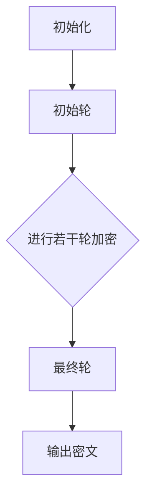
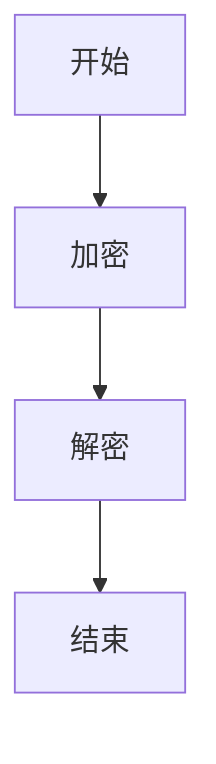
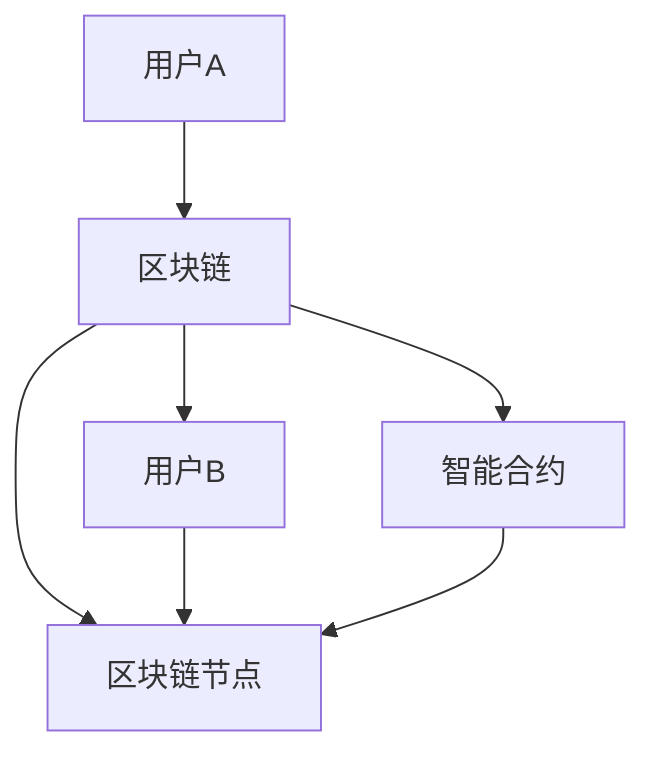
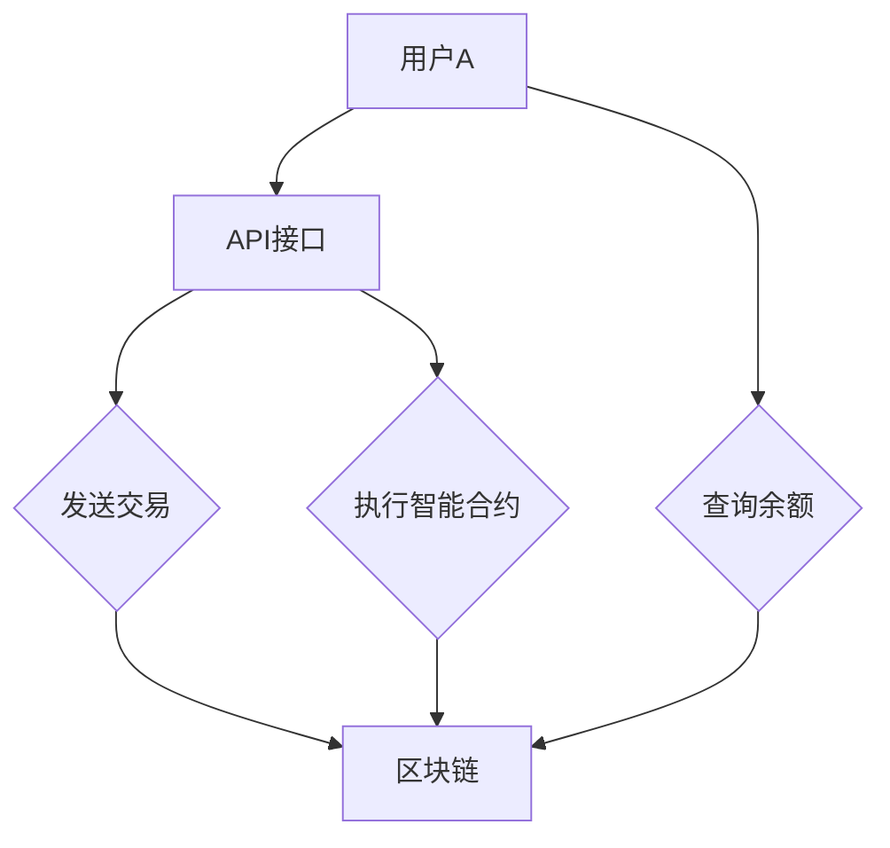
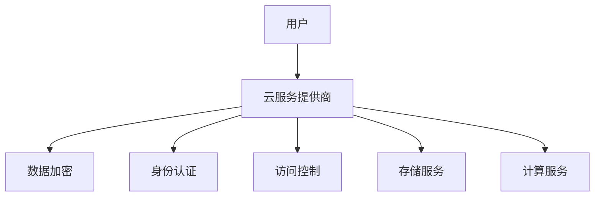
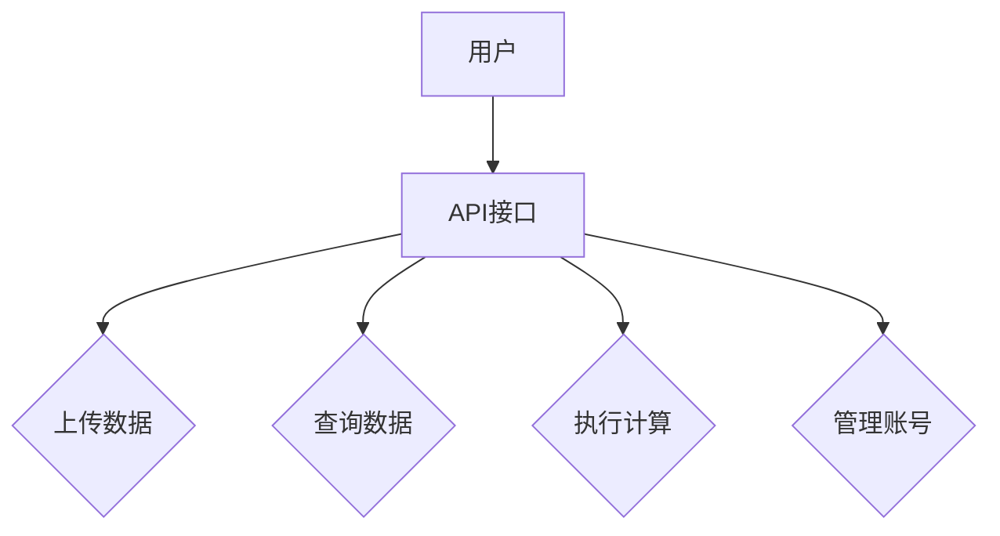
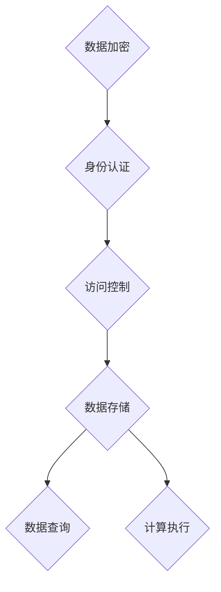

                 

### 数学与密码学：信息安全的数学基础

#### 关键词：密码学、数学基础、信息安全、加密算法、数字签名

> 摘要：本文将深入探讨数学在密码学中的基础性作用，通过逐步分析密码学的基本概念、数学工具及其在加密算法中的应用，旨在揭示数学在保障信息安全中的关键地位，并展望未来密码学的发展趋势。本文分为五个部分，第一部分介绍密码学的概述，包括基础、历史与发展；第二部分介绍数学基础，涵盖数论、代数、概率论和拓扑；第三部分探讨数学在密码学中的应用；第四部分介绍各种密码算法；第五部分讨论密码学在现代信息安全的角色及其实际应用案例。

### 第一部分：密码学概述

#### 第1章：密码学基础

密码学是一门研究信息加密与解密技术的科学，目的是保护信息的机密性、完整性和可用性。密码学基础包括基本概念如加密、解密、密钥和加密算法。加密是将明文转换为密文的过程，解密是将密文还原为明文。密钥是加密和解密过程中使用的参数，加密算法则是将加密和解密过程形式化的数学模型。

#### 第2章：密码学的历史与发展

密码学有着悠久的历史，从古埃及的凯撒密码到现代的AES加密算法，经历了数千年的发展。历史上著名的密码学理论包括替换密码、换位密码和多字母替换密码。现代密码学的发展主要得益于计算机科学和数学的进步，尤其是数论、代数和概率论的深入应用，使得现代密码学能够应对更加复杂的攻击。

#### 第3章：密码体制分类

密码体制根据加密方法的不同可分为对称加密和非对称加密。对称加密使用相同的密钥进行加密和解密，如AES算法。非对称加密使用一对密钥（公钥和私钥）进行加密和解密，如RSA算法。此外，还有基于哈希函数的数字签名技术，用于验证信息的完整性和身份认证。

### 第二部分：数学基础

#### 第4章：数论基础

数论是研究整数的性质及其相互关系的数学分支。在密码学中，数论广泛应用于公钥密码系统，如RSA算法。数论中的大素数生成、模运算、中国剩余定理等都是密码学中的重要工具。

#### 第5章：代数基础

代数是研究数、函数和方程的数学分支。在密码学中，代数被用于构建复杂的数学模型，如椭圆曲线密码学。代数中的线性代数、群论、环论和域论等都是密码算法设计的重要理论基础。

#### 第6章：概率论基础

概率论是研究随机事件及其概率的数学分支。在密码学中，概率论被用于分析加密算法的安全性，如对抗碰撞攻击、密码分析中的概率模型。概率论中的随机变量、概率分布和假设检验等概念对密码学至关重要。

#### 第7章：拓扑基础

拓扑是研究空间性质及其连续变换的数学分支。在密码学中，拓扑理论被用于构建复杂的密码系统，如量子密码学和量子计算密码。拓扑性质在抵抗量子计算攻击方面具有重要作用。

### 第三部分：数学在密码学中的应用

#### 第8章：数论在密码学中的应用

数论在密码学中的应用十分广泛，尤其是在公钥密码系统中。数论中的大素数生成和模运算技术被用于构建RSA算法，该算法以其强大的安全性成为现代密码系统的基石。此外，中国剩余定理也在密码学中发挥着重要作用。

#### 第9章：代数在密码学中的应用

代数在密码学中的应用主要体现在公钥密码系统和哈希函数中。椭圆曲线密码学是一种基于椭圆曲线代数结构的密码学方法，具有很高的安全性。此外，代数结构如群、环和域在构建安全的哈希函数中也起到关键作用。

#### 第10章：概率论在密码学中的应用

概率论在密码学中的应用主要表现在密码算法的安全性分析中。通过对加密算法的随机性进行概率分析，可以评估算法对各种攻击的抵抗力。概率论中的随机变量和概率分布对密码分析中的假设检验方法至关重要。

#### 第11章：拓扑在密码学中的应用

拓扑在密码学中的应用相对较新，但前景广阔。量子密码学中的量子信道和量子密钥分发（QKD）依赖于量子态的拓扑性质。量子计算密码学研究如何利用拓扑量子计算抵抗量子攻击，从而保护信息安全。

### 第四部分：密码算法

#### 第12章：对称加密算法

对称加密算法使用相同的密钥进行加密和解密，具有速度快、效率高的优点。典型的对称加密算法包括AES和DES。AES已成为国际加密标准，因其出色的安全性和效率在各类应用中得到广泛使用。

#### 第13章：非对称加密算法

非对称加密算法使用一对密钥（公钥和私钥）进行加密和解密，具有更高的安全性。典型的非对称加密算法包括RSA和ECC。RSA以其数学基础坚实、安全性高而著称，ECC则因其占用空间小、效率高而备受关注。

#### 第14章：数字签名

数字签名用于验证信息的完整性和身份认证。典型的数字签名算法包括RSA签名和ECDSA。数字签名技术不仅确保信息未被篡改，还提供了发送方的身份验证。

#### 第15章：加密哈希算法

加密哈希算法用于将任意长度的输入数据映射为固定长度的输出数据，同时确保输入数据的完整性。典型的加密哈希算法包括SHA-256和SHA-3。加密哈希算法在密码学中扮演着重要角色，广泛应用于数据完整性验证和数字签名中。

### 第五部分：密码学在现代信息安全的角色

#### 第16章：密码学在现代网络安全中的应用

密码学在现代网络安全中扮演着至关重要的角色。对称加密和非对称加密算法用于保护网络传输的数据，数字签名技术用于验证网络通信的合法性和真实性。此外，密码学还在网络协议、VPN、TLS等方面发挥着重要作用。

#### 第17章：密码学在电子商务中的应用

密码学在电子商务中确保了交易的安全性。加密算法用于保护用户的个人信息和支付信息，数字签名技术用于验证交易的合法性和真实性。密码学在电子商务中的应用极大地增强了交易的安全性和可靠性。

#### 第18章：密码学在物联网中的应用

随着物联网的发展，密码学在物联网中的应用越来越重要。物联网设备需要使用密码学技术保护其通信和数据安全。对称加密和非对称加密算法用于保障物联网设备之间的通信安全，数字签名技术用于验证物联网设备的身份和数据的完整性。

#### 第19章：未来密码学的挑战与发展方向

未来密码学将面临越来越多的挑战，如量子计算对传统密码算法的威胁、加密货币的匿名性、物联网设备的安全性等。为了应对这些挑战，未来密码学的发展方向包括量子密码学、多方计算、区块链密码学等。

### 第六部分：实际应用案例

#### 第20章：加密货币与区块链技术

加密货币和区块链技术是密码学的实际应用案例。加密货币如比特币利用了密码学技术保障交易的安全性和匿名性。区块链技术通过密码学实现数据的不可篡改性和分布式存储。

#### 第21章：云计算中的密码学应用

云计算中的密码学应用旨在保护用户的数据安全和隐私。对称加密和非对称加密算法用于保护存储在云服务器上的数据，数字签名技术用于验证云服务的合法性和真实性。

#### 第22章：面向物联网的加密技术

面向物联网的加密技术旨在保障物联网设备的通信安全。对称加密和非对称加密算法用于保障物联网设备之间的通信安全，数字签名技术用于验证物联网设备的身份和数据的完整性。

#### 第23章：加密技术在移动设备中的应用

加密技术在移动设备中的应用越来越广泛，旨在保护用户的隐私和安全。移动设备上的数据加密、应用加密、通信加密等技术都是密码学的实际应用。

### 第七部分：总结与展望

#### 第24章：密码学的重要性

密码学在现代社会中扮演着至关重要的角色，保障了信息安全的各个方面。从网络安全到电子商务，从物联网到云计算，密码学无处不在。

#### 第25章：数学在密码学中的关键作用

数学是密码学的基石，各种密码算法和安全协议都离不开数学的支持。数论、代数、概率论和拓扑等数学分支在密码学中发挥着重要作用。

#### 第26章：密码学的未来发展趋势

未来密码学将继续发展，以应对不断变化的安全威胁。量子密码学、多方计算、区块链密码学等将成为研究热点。

#### 第27章：推荐阅读与扩展学习

对于希望深入了解密码学和数学基础的人来说，以下书籍和资源提供了丰富的知识和实用技巧：

- 《密码学：理论与实践》
- 《现代密码学：加密、认证和网络安全》
- 《量子计算与量子信息》
- 《区块链：从原理到实践》
- 《计算机科学中的概率方法》

作者：AI天才研究院/AI Genius Institute & 禅与计算机程序设计艺术 /Zen And The Art of Computer Programming

本文旨在为读者提供一份全面、系统的密码学和数学基础指南，通过逐步分析密码学的基本概念、数学工具及其在加密算法中的应用，揭示数学在保障信息安全中的关键地位。希望本文能够为读者在密码学领域的学习和研究提供有益的参考。在未来的发展中，密码学将继续在信息安全的各个方面发挥重要作用，为我们的数字生活保驾护航。让我们继续探索密码学的奥秘，共同迎接未来的挑战！## 第一部分：密码学概述

### 第1章：密码学基础

密码学是一门研究信息加密与解密技术的科学，其核心目的是保护信息的机密性、完整性和可用性。在信息时代，随着互联网的普及和信息的爆炸性增长，密码学的重要性日益凸显。密码学的基本概念包括加密、解密、密钥和加密算法。

#### 加密与解密

加密是将明文转换为密文的过程，目的是使信息对未授权者不可读。解密则是将密文还原为明文的过程，通常只有持有正确密钥的人才能完成。加密和解密是密码学中最基本的操作。

#### 密钥

密钥是加密和解密过程中使用的参数，用于控制加密算法的执行。密钥分为对称密钥和非对称密钥。对称密钥在加密和解密过程中使用相同的密钥，而非对称密钥则由一对密钥组成，即公钥和私钥。

#### 加密算法

加密算法是用于实现加密和解密过程的数学模型。根据加密方法的不同，加密算法可分为对称加密算法和非对称加密算法。对称加密算法使用相同的密钥进行加密和解密，如AES算法。非对称加密算法使用一对密钥（公钥和私钥）进行加密和解密，如RSA算法。

### 第2章：密码学的历史与发展

密码学有着悠久的历史，从古埃及的凯撒密码到现代的AES加密算法，经历了数千年的发展。早期的密码学主要依靠人类智慧和数学技巧，如凯撒密码、猪圈密码和多字母替换密码等。随着计算机科学和数学的进步，现代密码学应运而生。

#### 古代密码学

古代密码学最早可以追溯到古埃及，公元前1900年左右，古埃及人开始使用凯撒密码。凯撒密码是一种简单的替换密码，将字母表中的每个字母按照固定的位移进行替换。公元1世纪，古罗马的凯撒大帝将这种密码用于军事通信。

#### 中世纪密码学

中世纪时期，密码学得到了进一步的发展。阿拉伯数学家和天文学家阿尔·卡西发明了多字母替换密码，这种密码通过将字母替换为其他字母的组合，使密码更加复杂。中世纪晚期的密码学著作《论密码学》是密码学史上的一部重要文献。

#### 现代密码学

现代密码学起源于20世纪40年代，第二次世界大战期间，密码分析和密码学研究得到了极大的推动。当时，德国的恩尼格玛机是世界上最复杂的加密设备，但盟军的密码学家通过密码分析成功破解了恩尼格玛机。

战后，随着计算机科学的发展，密码学得到了迅速发展。1977年，美国国家标准局（NBS）发布了数据加密标准（DES），这是第一种公开的加密标准。1997年，美国国家标准与技术研究院（NIST）发布了高级加密标准（AES），取代了DES成为新的加密标准。

#### 密码体制分类

根据加密方法的不同，现代密码体制可分为对称加密体制和非对称加密体制。对称加密体制使用相同的密钥进行加密和解密，如AES算法。非对称加密体制使用一对密钥（公钥和私钥）进行加密和解密，如RSA算法。此外，还有基于哈希函数的数字签名技术，用于验证信息的完整性和身份认证。

### 第3章：密码体制分类

密码体制根据加密方法的不同可以分为对称加密、非对称加密和哈希函数。

#### 对称加密

对称加密是指加密和解密过程中使用相同密钥的加密体制。其优点是加密和解密速度快、计算成本低。典型的对称加密算法包括AES、DES和RC5。对称加密的密钥管理是一个重要问题，因为密钥的安全性和保密性直接影响到加密系统的安全性。

#### 非对称加密

非对称加密是指加密和解密过程中使用不同密钥的加密体制。非对称加密算法的主要优点是能够实现密钥的分发和管理，因此更适合网络通信。典型的非对称加密算法包括RSA、ECC和Diffie-Hellman密钥交换。非对称加密的缺点是加密和解密速度相对较慢，计算成本较高。

#### 哈希函数

哈希函数是将任意长度的输入数据映射为固定长度的输出数据的函数。哈希函数在密码学中用于数据完整性验证和数字签名。典型的哈希函数包括MD5、SHA-1和SHA-256。哈希函数的特点是单向性，即无法通过输出数据反推出原始输入数据。

### 总结

密码学作为一门保护信息安全的重要学科，经历了数千年的发展。从古代的简单替换密码到现代的复杂加密算法，密码学在不断进步中为信息安全提供了坚实保障。理解密码学的基础知识，有助于我们更好地应对信息安全挑战，保障个人和组织的信息安全。在接下来的部分，我们将深入探讨数学基础，了解数学如何为密码学提供强大的支持。

### 第二部分：数学基础

#### 第4章：数论基础

数论是研究整数的性质及其相互关系的数学分支。在密码学中，数论的应用非常广泛，尤其是公钥密码系统的设计。以下将介绍数论中的一些基本概念和定理。

#### 基本概念

1. **素数**：素数是只能被1和自身整除的正整数，如2、3、5、7等。素数在数论中具有基础地位，因为它们是所有整数的基石。
2. **合数**：合数是除了1和自身外还能被其他数整除的正整数，如4、6、8、9等。
3. **模运算**：模运算是一种取余数的运算，通常表示为`a mod n`，其中`a`是被除数，`n`是除数。例如，`10 mod 3`等于1。

#### 定理和性质

1. **欧拉定理**：对于任意正整数`a`和`m`，如果`a`和`m`互质（即它们的最大公约数为1），则`a`的`(m-1)`次方模`m`的结果等于1。公式表示为：`a^(φ(m)) ≡ 1 (mod m)`，其中`φ(m)`是欧拉函数，表示小于或等于`m`且与`m`互质的正整数的个数。
2. **费马小定理**：对于任意素数`p`和任意整数`a`，如果`a`不等于`p`，则`a`的`(p-1)`次方模`p`的结果等于`a`的模`p`的结果。公式表示为：`a^(p-1) ≡ a (mod p)`。

#### 应用

数论在公钥密码系统中的应用非常广泛，以下是两个典型的例子：

1. **RSA算法**：RSA算法是一种基于数论原理的公钥密码系统，其安全性依赖于大素数生成的难度和模运算。RSA算法的安全性主要依赖于以下三个数学难题：
   - 大素数生成：找到两个大素数的乘积是困难的。
   - 模幂运算：对一个数进行大指数模运算也是困难的。
   - 模逆运算：在模数下找到一个数的逆元是困难的。

2. **椭圆曲线密码学**：椭圆曲线密码学是基于椭圆曲线离散对数问题的密码系统。椭圆曲线离散对数问题是在椭圆曲线上找到一个点，使得该点的倍数等于另一个给定的点。椭圆曲线密码学在公钥加密和数字签名中得到了广泛应用，具有高安全性和低计算成本的特点。

#### 对比表格

为了更好地理解数论在密码学中的应用，我们可以通过以下表格对比一些核心概念：

| 概念 | 定义 | 在密码学中的应用 |
| --- | --- | --- |
| 素数 | 只能被1和自身整除的正整数 | RSA算法的大素数生成 |
| 模运算 | 取余数的运算 | RSA算法和椭圆曲线密码学中的模运算 |
| 欧拉定理 | 如果a和m互质，则a的φ(m)次方模m的结果等于1 | RSA算法和椭圆曲线密码学的安全证明 |
| 费马小定理 | 如果a不等于p，则a的(p-1)次方模p的结果等于a | RSA算法和椭圆曲线密码学的安全证明 |

通过这个表格，我们可以清晰地看到数论中的核心概念如何在密码学中发挥作用。

#### ER实体关系图

下面是一个数论在密码学中应用的ER实体关系图，展示了一些核心概念和它们之间的关系：

```mermaid
erDiagram
    A ||--|{ B } B : hasMany(B)
    B ||--|{ C } C : belongsTo(B)
    B ||--|{ D } D : belongsTo(B)
    D ||--|{ E } E : belongsTo(D)
```

在这个ER图中，`B`实体代表了素数，`C`实体代表了合数，`D`实体代表了模运算，`E`实体代表了欧拉定理和费马小定理。这种结构图有助于我们理解数论在密码学中的应用及其内部关系。

### 第5章：代数基础

代数是研究数、函数和方程的数学分支。在密码学中，代数被广泛应用于密码算法的设计和实现。以下将介绍代数中的一些基本概念和定理。

#### 基本概念

1. **群**：群是一种代数结构，由一组元素和一种二元运算组成，满足结合律、单位元和逆元。群在密码学中的应用非常广泛，如对称加密算法中的乘法群和加法群。
2. **环**：环是一种代数结构，由一组元素和两种二元运算组成，满足结合律、分配律和单位元。环在密码学中的应用包括RSA算法中的模运算。
3. **域**：域是一种代数结构，由一组元素和两种二元运算（加法和乘法）组成，满足结合律、分配律、单位元和逆元。域在密码学中的应用包括椭圆曲线密码学中的有理数域和有限域。

#### 定理和性质

1. **拉格朗日定理**：对于任意群`G`和群`G`的子群`H`，群`G`中元素的阶（即元素乘以自身至单位元的次数）等于子群`H`的指数（即子群`H`中元素的个数）。公式表示为：`o(a) | |H|`，其中`o(a)`是元素`a`的阶，`|H|`是子群`H`的指数。
2. **费马小定理**：对于任意素数`p`和任意整数`a`，如果`a`不等于`p`，则`a`的`(p-1)`次方模`p`的结果等于`a`的模`p`的结果。公式表示为：`a^(p-1) ≡ a (mod p)`。
3. **欧拉定理**：对于任意正整数`a`和`m`，如果`a`和`m`互质（即它们的最大公约数为1），则`a`的`(m-1)`次方模`m`的结果等于1。公式表示为：`a^(φ(m)) ≡ 1 (mod m)`，其中`φ(m)`是欧拉函数，表示小于或等于`m`且与`m`互质的正整数的个数。

#### 应用

代数在密码学中的应用主要体现在以下几个方面：

1. **对称加密算法**：对称加密算法中的加密和解密过程通常涉及各种代数运算，如乘法群和加法群。例如，AES算法中使用的S-盒是一个基于有限域的代数结构。
2. **公钥密码系统**：公钥密码系统如RSA算法和椭圆曲线密码学都依赖于复杂的代数运算。RSA算法中的模运算依赖于环和域的概念，而椭圆曲线密码学中的离散对数问题则依赖于椭圆曲线的代数性质。
3. **数字签名**：数字签名算法如RSA签名和椭圆曲线数字签名算法（ECDSA）都使用代数结构来保证签名的安全性和有效性。

#### 对比表格

为了更好地理解代数在密码学中的应用，我们可以通过以下表格对比一些核心概念：

| 概念 | 定义 | 在密码学中的应用 |
| --- | --- | --- |
| 群 | 满足结合律、单位元和逆元的代数结构 | 对称加密算法中的乘法群和加法群 |
| 环 | 满足结合律、分配律和单位元的代数结构 | RSA算法中的模运算 |
| 域 | 满足结合律、分配律、单位元和逆元的代数结构 | 椭圆曲线密码学中的有理数域和有限域 |
| 拉格朗日定理 | 元素的阶等于子群的指数 | 密码算法中的安全证明 |
| 费马小定理 | (p-1)次方模p的结果等于a的模p的结果 | RSA算法和椭圆曲线密码学的安全证明 |
| 欧拉定理 | (m-1)次方模m的结果等于1 | RSA算法和椭圆曲线密码学的安全证明 |

通过这个表格，我们可以清晰地看到代数中的核心概念如何在密码学中发挥作用。

#### ER实体关系图

下面是一个代数在密码学中应用的ER实体关系图，展示了一些核心概念和它们之间的关系：

```mermaid
erDiagram
    A ||--|{ B } B : hasMany(B)
    B ||--|{ C } C : belongsTo(B)
    B ||--|{ D } D : belongsTo(B)
    D ||--|{ E } E : belongsTo(D)
```

在这个ER图中，`B`实体代表了群，`C`实体代表了环，`D`实体代表了域，`E`实体代表了拉格朗日定理、费马小定理和欧拉定理。这种结构图有助于我们理解代数在密码学中的应用及其内部关系。

### 第6章：概率论基础

概率论是研究随机事件及其概率的数学分支。在密码学中，概率论的应用至关重要，主要用于分析密码算法的安全性、密码分析方法和加密协议。以下将介绍概率论中的一些基本概念和定理。

#### 基本概念

1. **随机变量**：随机变量是随机事件的数学表示，可以取不同数值。随机变量分为离散型和连续型两种。
2. **概率分布**：概率分布是随机变量取不同值的概率分布情况，通常用概率密度函数或概率质量函数表示。
3. **期望和方差**：期望是随机变量的平均值，方差是衡量随机变量离散程度的指标。
4. **条件概率和贝叶斯定理**：条件概率是给定某个事件发生的条件下另一个事件发生的概率。贝叶斯定理是条件概率在统计学中的应用，用于计算后验概率。

#### 定理和性质

1. **大数定律**：大数定律描述了在大量重复实验中，随机变量的分布会趋于其期望值。大数定律包括弱大数定律和强大数定律。
2. **中心极限定理**：中心极限定理描述了在大量随机变量的和趋近于正态分布。中心极限定理在密码学中用于分析随机数生成器的质量和密码算法的安全性。
3. **马尔可夫链**：马尔可夫链是一种随机过程，用于描述系统状态的变化。马尔可夫链在密码学中用于分析加密算法和加密协议的行为。

#### 应用

概率论在密码学中的应用主要体现在以下几个方面：

1. **密码算法的安全性分析**：概率论用于评估密码算法对各种攻击的抵抗力。例如，分析加密算法的密钥空间、计算复杂度和成功概率。
2. **密码分析**：概率论用于密码分析，如统计密码分析和选择明文攻击。统计密码分析利用概率分布的差异来破解加密算法。
3. **加密协议**：概率论用于设计安全的加密协议，如随机预言模型和零知识证明。这些协议利用概率论原理来保证信息的机密性和完整性。

#### 对比表格

为了更好地理解概率论在密码学中的应用，我们可以通过以下表格对比一些核心概念：

| 概念 | 定义 | 在密码学中的应用 |
| --- | --- | --- |
| 随机变量 | 随机事件的数学表示 | 密码算法的安全性分析 |
| 概率分布 | 随机变量取不同值的概率分布情况 | 密码算法的安全性分析 |
| 期望和方差 | 随机变量的平均值和离散程度 | 密码算法的安全性分析 |
| 条件概率和贝叶斯定理 | 给定某个事件发生的条件下另一个事件发生的概率 | 密码分析 |
| 大数定律 | 随机变量的分布会趋于其期望值 | 密码算法的安全性分析 |
| 中心极限定理 | 随机变量的和趋近于正态分布 | 随机数生成器质量分析 |
| 马尔可夫链 | 描述系统状态的变化 | 加密算法和加密协议分析 |

通过这个表格，我们可以清晰地看到概率论中的核心概念如何在密码学中发挥作用。

#### ER实体关系图

下面是一个概率论在密码学中应用的ER实体关系图，展示了一些核心概念和它们之间的关系：

```mermaid
erDiagram
    A ||--|{ B } B : hasMany(B)
    B ||--|{ C } C : belongsTo(B)
    B ||--|{ D } D : belongsTo(B)
    D ||--|{ E } E : belongsTo(D)
```

在这个ER图中，`A`实体代表了随机变量，`B`实体代表了概率分布，`C`实体代表了期望和方差，`D`实体代表了条件概率和贝叶斯定理，`E`实体代表了大数定律、中心极限定理和马尔可夫链。这种结构图有助于我们理解概率论在密码学中的应用及其内部关系。

### 第7章：拓扑基础

拓扑是研究空间性质及其连续变换的数学分支。在密码学中，拓扑理论的应用相对较新，但已展示出巨大的潜力。拓扑性质在保障信息安全、抵抗量子攻击方面具有重要意义。以下将介绍拓扑中的一些基本概念和定理。

#### 基本概念

1. **拓扑空间**：拓扑空间是一组对象及其之间关系的集合，通常包括点、线、面等。拓扑空间满足开集的定义和闭集的定义。
2. **连通性**：连通性描述了一个空间是否可以通过连续的变换连接起来。连通空间分为欧氏空间和拟欧氏空间。
3. **紧致性**：紧致性描述了一个空间是否在任意小的区域内都可以找到点的集合。紧致空间在拓扑学中具有重要意义。
4. **同伦性**：同伦性描述了两个空间是否可以通过连续的变换相互转换。同伦性在密码学中用于证明某些问题具有特定性质。

#### 定理和性质

1. **庞加莱定理**：庞加莱定理描述了三维空间中的某些拓扑性质，如球面和圆柱面的同伦性。
2. **度量化定理**：度量化定理描述了在拓扑空间中，连通性和紧致性之间的关系。
3. **维数定理**：维数定理描述了不同维度的空间之间的拓扑性质。

#### 应用

拓扑在密码学中的应用主要体现在以下几个方面：

1. **量子密码学**：量子密码学利用量子态的拓扑性质来保障通信的安全性。例如，量子密钥分发（QKD）利用量子态的纠缠性和不可克隆性来确保密钥的分发过程安全。
2. **量子计算密码学**：量子计算密码学研究如何利用量子计算抵抗量子攻击。量子计算中的拓扑量子计算具有独特的拓扑性质，可以用于构建更加安全的加密系统。
3. **网络拓扑分析**：网络拓扑分析利用拓扑理论来分析网络安全。通过分析网络结构，可以识别潜在的安全漏洞，制定相应的安全策略。

#### 对比表格

为了更好地理解拓扑在密码学中的应用，我们可以通过以下表格对比一些核心概念：

| 概念 | 定义 | 在密码学中的应用 |
| --- | --- | --- |
| 拓扑空间 | 一组对象及其之间关系的集合 | 量子密码学中的量子态空间 |
| 连通性 | 空间是否可以通过连续的变换连接起来 | 量子密钥分发中的通信路径分析 |
| 紧致性 | 空间是否在任意小的区域内都可以找到点的集合 | 量子计算中的拓扑量子计算 |
| 同伦性 | 两个空间是否可以通过连续的变换相互转换 | 量子计算密码学中的安全证明 |
| 庞加莱定理 | 描述三维空间中的某些拓扑性质 | 量子密码学中的拓扑性质分析 |
| 度量化定理 | 连通性和紧致性之间的关系 | 网络拓扑分析中的安全漏洞识别 |
| 维数定理 | 不同维度的空间之间的拓扑性质 | 量子计算密码学中的安全设计 |

通过这个表格，我们可以清晰地看到拓扑中的核心概念如何在密码学中发挥作用。

#### ER实体关系图

下面是一个拓扑在密码学中应用的ER实体关系图，展示了一些核心概念和它们之间的关系：

```mermaid
erDiagram
    A ||--|{ B } B : hasMany(B)
    B ||--|{ C } C : belongsTo(B)
    B ||--|{ D } D : belongsTo(B)
    D ||--|{ E } E : belongsTo(D)
```

在这个ER图中，`A`实体代表了拓扑空间，`B`实体代表了连通性、紧致性和同伦性，`C`实体代表了庞加莱定理、度量化定理和维数定理，`D`实体代表了量子密码学和量子计算密码学，`E`实体代表了网络拓扑分析。这种结构图有助于我们理解拓扑在密码学中的应用及其内部关系。

### 数学在密码学中的关键作用

数学在密码学中扮演着至关重要的角色，为密码系统的设计和安全性提供了坚实的理论基础。数论、代数、概率论和拓扑等数学分支在密码学中各自发挥着独特的作用。

#### 数论

数论是密码学的基石，特别是在公钥密码系统设计中具有核心地位。数论中的素数、模运算、欧拉定理和费马小定理等概念为密码算法的安全性提供了理论基础。例如，RSA算法依赖于大素数生成和模运算的难度，而椭圆曲线密码学则利用椭圆曲线离散对数问题的复杂性。

#### 代数

代数在密码学中的应用主要体现在对称加密算法和非对称加密算法的设计中。对称加密算法如AES和DES使用代数结构来构建加密函数，而非对称加密算法如RSA和ECC则依赖于复杂的代数运算。代数结构如群、环和域在密码学中用于构建安全的密码系统。

#### 概率论

概率论在密码学中用于分析密码算法的安全性、密码分析方法和加密协议。概率论中的随机变量、概率分布、大数定律和中心极限定理等概念有助于评估密码算法的抵抗攻击能力。此外，概率论在加密协议的设计中也起到关键作用，如随机预言模型和零知识证明。

#### 拓扑

拓扑在密码学中的应用相对较新，但已展示出巨大潜力。量子密码学中的量子态和量子密钥分发（QKD）利用拓扑性质来保障通信的安全性。拓扑量子计算的研究也为构建抵抗量子攻击的密码系统提供了新的思路。此外，网络拓扑分析利用拓扑理论来识别网络安全漏洞，制定安全策略。

#### 对比表格

为了更好地理解数学在密码学中的关键作用，我们可以通过以下表格对比各数学分支的核心概念及其应用：

| 数学分支 | 核心概念 | 密码学中的应用 |
| --- | --- | --- |
| 数论 | 素数、模运算、欧拉定理、费马小定理 | 公钥密码系统（RSA、ECC） |
| 代数 | 群、环、域、代数结构 | 对称加密算法（AES、DES）、非对称加密算法（RSA、ECC） |
| 概率论 | 随机变量、概率分布、大数定律、中心极限定理 | 密码算法安全性分析、密码分析、加密协议 |
| 拓扑 | 拓扑空间、连通性、紧致性、同伦性 | 量子密码学、量子计算密码学、网络拓扑分析 |

通过这个表格，我们可以清晰地看到数学各分支在密码学中的应用及其重要性。

### 数学在密码学中的应用

数学在密码学中的应用广泛而深入，其核心在于利用数学理论构建安全的加密算法和密码协议，确保信息的机密性、完整性和可用性。以下我们将详细探讨数学在密码学中的具体应用，包括数论、代数、概率论和拓扑等领域。

#### 数论在密码学中的应用

数论在密码学中的应用尤为显著，特别是在公钥密码系统如RSA和椭圆曲线密码学中。RSA算法的基础是数论中的大素数生成和模运算。具体来说，RSA算法依赖于两个大素数的乘积，其安全性依赖于对大素数乘积进行因式分解的难度，即整数分解问题。此外，RSA算法的加密和解密过程涉及到模运算和欧拉定理，使得加密过程具有较高的安全性。

**例子：RSA算法**
- 假设我们选择了两个大素数`p`和`q`，则公钥为`(n, e)`，其中`n = p * q`，私钥为`(n, d)`，其中`d`是`e`在模`(p-1)(q-1)`下的逆元。
- 加密过程：明文`M`通过以下公式加密为密文`C`：`C ≡ M^e (mod n)`。
- 解密过程：密文`C`通过以下公式解密为明文`M`：`M ≡ C^d (mod n)`。

**数学模型和公式**
- 整数分解问题：给定一个整数`n`，找出两个素数`p`和`q`。
- 欧拉函数：`φ(n) = (p-1)(q-1)`。
- 模逆元：对于任意整数`a`和正整数`m`，若`a`和`m`互质，则存在整数`b`，使得`a * b ≡ 1 (mod m)`。

#### 代数在密码学中的应用

代数在密码学中的应用主要表现在对称加密算法和非对称加密算法的设计中。对称加密算法如AES和DES利用代数结构构建加密函数，使得加密和解密过程具有确定的数学模型。非对称加密算法如RSA和椭圆曲线密码学则依赖于复杂的代数运算，如椭圆曲线离散对数问题。

**例子：AES加密算法**
- AES算法采用分组密码的方式，将明文分成128位块，然后通过一系列的代数运算（包括替换、置换、异或和混淆）进行加密。
- 加密过程：明文块通过AES密钥进行加密，生成密文块。
- 解密过程：密文块通过AES密钥进行解密，恢复出明文块。

**数学模型和公式**
- 分组密码：将明文分成固定长度的块，每个块通过特定的加密函数进行加密。
- 代数结构：包括置换、替换和混淆，利用线性代数和群论等代数理论。
- 线性变换：利用矩阵运算进行加密和解密。

#### 概率论在密码学中的应用

概率论在密码学中用于分析密码算法的安全性、密码分析方法和加密协议。概率论中的随机变量、概率分布、大数定律和中心极限定理等概念有助于评估密码算法的抵抗攻击能力。此外，概率论在加密协议的设计中也起到关键作用，如随机预言模型和零知识证明。

**例子：随机预言模型**
- 随机预言模型是一个加密协议设计的框架，用于证明协议的安全性。它将加密协议看作一个随机预言机，对其输出进行概率分析。
- 安全性证明：通过分析随机预言机的输出概率，证明加密协议满足特定的安全属性。

**数学模型和公式**
- 随机变量：用于描述加密协议中各种随机事件。
- 概率分布：描述随机变量的取值概率。
- 大数定律：描述大量重复实验中随机变量的分布性质。
- 中心极限定理：描述大量随机变量的和趋近于正态分布。

#### 拓扑在密码学中的应用

拓扑在密码学中的应用相对较新，但已展示出巨大潜力。量子密码学中的量子态和量子密钥分发（QKD）利用拓扑性质来保障通信的安全性。拓扑量子计算的研究也为构建抵抗量子攻击的密码系统提供了新的思路。此外，网络拓扑分析利用拓扑理论来识别网络安全漏洞，制定安全策略。

**例子：量子密钥分发（QKD）**
- QKD利用量子态的纠缠性和不可克隆性来确保密钥的分发过程安全。
- 通信过程：发送方通过量子信道发送量子态，接收方测量量子态并生成密钥。
- 安全性保证：利用量子态的叠加态和纠缠态特性，确保通信过程中信息的机密性。

**数学模型和公式**
- 量子态：描述量子系统的状态，利用波函数表示。
- 纠错码：用于纠正量子通信中的噪声和错误。
- 量子纠缠：描述两个或多个量子系统之间的量子关联。

### 对比表格

为了更好地理解数学在密码学中的应用，我们可以通过以下表格对比数论、代数、概率论和拓扑在密码学中的核心概念和它们的应用：

| 数学分支 | 核心概念 | 密码学中的应用 |
| --- | --- | --- |
| 数论 | 素数、模运算、欧拉定理、费马小定理 | 公钥密码系统（RSA、ECC） |
| 代数 | 群、环、域、线性变换 | 对称加密算法（AES、DES）、非对称加密算法（RSA、ECC） |
| 概率论 | 随机变量、概率分布、大数定律、中心极限定理 | 密码算法安全性分析、密码分析、加密协议 |
| 拓扑 | 拓扑空间、连通性、紧致性、同伦性 | 量子密码学、量子计算密码学、网络拓扑分析 |

通过这个表格，我们可以清晰地看到数学各分支在密码学中的应用及其重要性。

### 总结

数学在密码学中扮演着至关重要的角色，从数论、代数、概率论到拓扑，各分支都在密码系统的设计和实现中发挥着独特的作用。数论提供了公钥密码系统的理论基础，代数用于构建对称和非对称加密算法，概率论用于分析密码算法的安全性，拓扑则在量子密码学和网络安全性方面展示了新的应用前景。随着密码学的发展，数学将继续为保障信息安全提供坚实的理论支持。

### 密码算法

#### 第12章：对称加密算法

对称加密算法是一种使用相同密钥进行加密和解密的密码系统。这种算法的优点是加密和解密速度快，计算成本低。常见的对称加密算法包括AES、DES和RC5。

**AES加密算法**

AES（Advanced Encryption Standard，高级加密标准）是美国国家标准与技术研究院（NIST）在2001年发布的一种加密标准。AES算法采用对称加密方式，加密过程包括多个轮次的替换、置换和混淆操作。AES算法支持128、192和256位的密钥长度，具有很高的安全性。

**AES加密过程**

1. **初始化**：输入明文和密钥，初始化初始状态。
2. **初始轮**：对明文块进行混合列操作，包括字节替换和行置换。
3. **加密轮**：进行若干轮加密操作，每轮包括字节替换、行置换和混淆操作。
   - 字节替换：使用S-盒进行字节替换。
   - 行置换：通过固定的行置换矩阵进行行置换。
   - 列混淆：通过固定的列混淆矩阵进行列混淆。
4. **最终轮**：最后一轮加密后，进行最终的行置换和字节替换。

**AES加密流程**



**AES解密过程**

AES解密过程与加密过程类似，但操作顺序相反。首先进行最后一轮的逆操作，然后逐步逆向每轮的操作，直到恢复出明文。

**AES加密算法的优点**

- **安全性高**：AES算法经过长时间的研究和测试，具有较高的安全性。
- **效率高**：AES算法采用固定长度的密钥和明文块，适合大规模数据处理。
- **适用范围广**：AES算法广泛应用于加密通信、存储保护和数据传输等场景。

**AES加密算法的缺点**

- **密钥管理复杂**：对称加密算法需要管理密钥的安全性和分发，确保密钥不被泄露。

**AES加密算法的实际应用**

- **网络通信**：AES算法广泛应用于VPN、TLS和SSH等网络通信协议，保障通信数据的安全。
- **数据存储**：AES算法用于加密存储在磁盘或数据库中的敏感数据，防止数据泄露。
- **文件加密**：AES算法用于加密个人电脑上的文件，保护用户隐私和数据安全。

#### 第13章：非对称加密算法

非对称加密算法是一种使用一对密钥（公钥和私钥）进行加密和解密的密码系统。这种算法的优点是解决了密钥分发的问题，具有更高的安全性。常见的非对称加密算法包括RSA、ECC和Diffie-Hellman密钥交换。

**RSA加密算法**

RSA（Rivest-Shamir-Adleman，瑞维斯特-沙米尔-阿德尔曼）算法是一种基于数论的公钥加密算法，其安全性依赖于大整数分解的难度。RSA算法的主要步骤包括密钥生成、加密和解密。

**RSA加密算法的步骤**

1. **密钥生成**：
   - 选择两个大素数`p`和`q`。
   - 计算`n = p * q`。
   - 计算`φ(n) = (p-1)(q-1)`。
   - 选择一个与`φ(n)`互质的整数`e`，通常选择`e = 65537`。
   - 计算`d`，使得`d * e ≡ 1 (mod φ(n))`，可以使用扩展欧几里得算法计算。

2. **加密过程**：
   - 公钥为`(n, e)`。
   - 私钥为`(n, d)`。
   - 加密明文`M`为密文`C`：`C ≡ M^e (mod n)`。

3. **解密过程**：
   - 使用私钥`(n, d)`解密密文`C`为明文`M`：`M ≡ C^d (mod n)`。

**RSA加密算法的优点**

- **安全性高**：RSA算法的安全性依赖于大整数分解的难度，目前尚未找到有效的破解方法。
- **密钥分发简单**：非对称加密算法使用一对密钥，公钥可以公开分发，私钥保持保密。

**RSA加密算法的缺点**

- **计算复杂度高**：RSA算法的加密和解密过程计算复杂度较高，不适合大规模实时数据处理。

**RSA加密算法的实际应用**

- **数字签名**：RSA算法用于实现数字签名，确保数据的完整性和身份认证。
- **安全传输**：RSA算法用于加密通信中的密钥交换，保障数据传输的安全。

**ECC加密算法**

椭圆曲线密码学（ECC，Elliptic Curve Cryptography）是一种基于椭圆曲线离散对数问题的密码算法。ECC算法在相同安全级别下比RSA算法具有更高的效率，且密钥长度更短。

**ECC加密算法的步骤**

1. **选择椭圆曲线**：选择一个定义在有限域上的椭圆曲线`E`。
2. **选择基点**：选择椭圆曲线上的一个基点`G`，满足`[n]G = O`（椭圆曲线的无限远点），其中`n`是椭圆曲线的阶。
3. **生成密钥**：
   - 选择一个随机整数`k`，使得`k < n`。
   - 计算私钥`d = k`。
   - 计算公钥`P = k * G`。

4. **加密过程**：
   - 加密明文`M`为密文`C`：`C = (c_1, c_2)`，其中`c_1 = M^k (mod p)`，`c_2 = G^m (mod p)`。

5. **解密过程**：
   - 使用私钥`d`解密密文`C`为明文`M`：`M = c_1^d (mod p)`。

**ECC加密算法的优点**

- **安全性高**：ECC算法基于椭圆曲线离散对数问题，目前尚未找到有效的破解方法。
- **效率高**：在相同安全级别下，ECC算法的密钥长度更短，计算复杂度更低。
- **计算速度快**：ECC算法的计算速度比RSA算法更快。

**ECC加密算法的实际应用**

- **加密通信**：ECC算法用于VPN、TLS和SSL等加密通信协议，保障通信数据的安全。
- **数字签名**：ECC算法用于实现数字签名，确保数据的完整性和身份认证。

**Diffie-Hellman密钥交换**

Diffie-Hellman密钥交换是一种基于离散对数问题的密钥交换协议，用于在不安全的通信信道上交换密钥。Diffie-Hellman密钥交换协议的核心思想是通过数学运算实现安全的密钥分发。

**Diffie-Hellman密钥交换的步骤**

1. **参数选择**：选择一个大素数`p`和一个生成元`g`。
2. **密钥生成**：
   - 发送方计算：`a = g^x (mod p)`，发送`a`。
   - 接收方计算：`b = g^y (mod p)`，发送`b`。
3. **密钥计算**：
   - 发送方计算：`k = b^x (mod p)`。
   - 接收方计算：`k = a^y (mod p)`。

**Diffie-Hellman密钥交换的优点**

- **安全性高**：Diffie-Hellman密钥交换协议利用数学运算实现安全的密钥分发，无需共享密钥。
- **计算复杂度低**：Diffie-Hellman密钥交换的计算复杂度相对较低，适合实时通信。

**Diffie-Hellman密钥交换的实际应用**

- **VPN**：Diffie-Hellman密钥交换用于VPN通信中的密钥交换，保障VPN连接的安全性。
- **SSL/TLS**：Diffie-Hellman密钥交换用于SSL/TLS协议中的密钥交换，保障网络通信的安全。

#### 第14章：数字签名

数字签名是一种用于验证信息完整性和身份认证的技术。数字签名利用公钥密码学实现，确保签名的唯一性和不可抵赖性。常见的数字签名算法包括RSA签名和椭圆曲线数字签名算法（ECDSA）。

**RSA签名算法**

RSA签名算法是一种基于RSA公钥密码系统的数字签名算法。RSA签名算法的主要步骤包括签名和验证。

**RSA签名算法的步骤**

1. **密钥生成**：与RSA加密算法类似，生成公钥`n, e`和私钥`n, d`。
2. **签名过程**：
   - 输入明文`M`，计算哈希值`H(M)`。
   - 计算签名`S = H(M)^d (mod n)`。

3. **验证过程**：
   - 输入签名`S`和公钥`(n, e)`。
   - 计算验证值`V = H(M)^e (mod n)`。
   - 比较验证值`V`与签名`S`，如果`V = S`，则签名有效。

**RSA签名算法的优点**

- **安全性高**：RSA签名算法利用公钥密码学的安全性，确保签名的唯一性和不可抵赖性。
- **通用性强**：RSA签名算法适用于各种数据类型，包括文本、图像和音频等。

**RSA签名算法的缺点**

- **计算复杂度高**：RSA签名算法的计算复杂度较高，不适合大规模实时数据处理。

**RSA签名算法的实际应用**

- **电子邮件**：RSA签名算法用于电子邮件的签名，确保邮件的完整性和身份认证。
- **文件传输**：RSA签名算法用于文件传输中的签名，确保文件的完整性和来源验证。

**ECDSA签名算法**

椭圆曲线数字签名算法（ECDSA，Elliptic Curve Digital Signature Algorithm）是一种基于椭圆曲线密码学的数字签名算法。ECDSA算法具有较高的安全性，且计算效率高。

**ECDSA签名算法的步骤**

1. **密钥生成**：与ECC加密算法类似，生成公钥`P`和私钥`d`。
2. **签名过程**：
   - 输入明文`M`，计算哈希值`h = H(M)`。
   - 生成随机数`k`，计算签名`r = (h * k) * G`，`s = k^{-1} * (h * d + r * x)`。

3. **验证过程**：
   - 输入签名`r, s`和公钥`P`。
   - 计算验证值`v1 = h * G`，`v2 = (s * P + r * P)`。
   - 如果`v1 = v2`，则签名有效。

**ECDSA签名算法的优点**

- **安全性高**：ECDSA算法基于椭圆曲线离散对数问题，具有很高的安全性。
- **效率高**：ECDSA算法的计算效率高于RSA算法。

**ECDSA签名算法的实际应用**

- **区块链**：ECDSA算法用于区块链中的签名，确保交易数据的完整性和身份认证。
- **物联网**：ECDSA算法用于物联网设备中的签名，确保设备通信的安全性和身份认证。

#### 第15章：加密哈希算法

加密哈希算法是一种将任意长度的输入数据映射为固定长度输出数据的函数。加密哈希算法在密码学中具有广泛的应用，包括数据完整性验证、数字签名和密码协议等。

**MD5加密哈希算法**

MD5（Message Digest Algorithm 5）是一种广泛使用的加密哈希算法，由RSA实验室开发。MD5算法将输入数据映射为128位的哈希值。

**MD5加密哈希算法的步骤**

1. **预处理**：将输入数据填充至512位的界限，然后添加长度信息。
2. **初始化**：初始化四个32位的变量`A, B, C, D`，初始值分别为`01 23 45 67`。
3. **处理分组**：将输入数据分成512位的分组，依次进行处理。
   - 对于每个分组，进行四轮处理，每轮包含16次循环操作。
   - 每次循环操作包括 bitwise-AND、bitwise-OR、XOR和右移操作。
4. **输出结果**：将四个变量的最终值拼接成128位的哈希值。

**MD5加密哈希算法的优点**

- **速度快**：MD5算法的计算速度相对较快。
- **简单实现**：MD5算法的实现相对简单。

**MD5加密哈希算法的缺点**

- **安全性较低**：MD5算法容易受到碰撞攻击，不适用于需要高安全性的应用。
- **不适用新标准**：随着安全性的需求提升，MD5已不再被视为安全哈希算法。

**MD5加密哈希算法的实际应用**

- **文件校验**：MD5算法用于文件的完整性校验，确保文件未被篡改。
- **身份认证**：MD5算法用于用户密码的存储和验证。

**SHA-256加密哈希算法**

SHA-256（Secure Hash Algorithm 256）是美国国家标准与技术研究院（NIST）发布的一种安全哈希算法，是SHA-2算法的一部分。SHA-256算法将输入数据映射为256位的哈希值。

**SHA-256加密哈希算法的步骤**

1. **初始化**：初始化八个32位的变量`a, b, c, d, e, f, g, h`，初始值分别为`A, B, C, D, E, F, G, H`。
2. **处理分组**：将输入数据分成512位的分组，依次进行处理。
   - 对于每个分组，进行64次循环操作，每轮包括压缩函数和消息扩展。
   - 压缩函数包括多种操作，如 bitwise-AND、bitwise-OR、XOR、右移和左移。
   - 消息扩展通过非线性函数对输入数据进行处理。
3. **输出结果**：将八个变量的最终值拼接成256位的哈希值。

**SHA-256加密哈希算法的优点**

- **安全性高**：SHA-256算法具有较强的抗碰撞能力，安全性高。
- **广泛使用**：SHA-256算法被广泛应用于数字签名、数据完整性验证和加密协议。

**SHA-256加密哈希算法的缺点**

- **计算复杂度高**：SHA-256算法的计算复杂度相对较高。

**SHA-256加密哈希算法的实际应用**

- **数字签名**：SHA-256算法用于数字签名，确保数据的完整性和身份认证。
- **区块链**：SHA-256算法用于区块链中的数据完整性验证和区块链协议。

通过本章的讨论，我们可以看到密码算法在保障信息安全中的关键作用。对称加密算法如AES和DES具有计算速度快、效率高的优点，适用于大规模数据处理。非对称加密算法如RSA和ECC具有高安全性、密钥分发简单的优点，适用于安全传输和数字签名。加密哈希算法如MD5和SHA-256在数据完整性验证和身份认证中具有重要作用。理解这些密码算法的工作原理和实际应用，有助于我们更好地保障信息安全。

### 密码学在现代信息安全的角色

密码学在现代信息安全中扮演着至关重要的角色，其应用领域广泛，包括网络安全、电子商务、物联网、云计算和移动设备等。以下将详细介绍密码学在这些领域中的应用。

#### 第16章：密码学在现代网络安全中的应用

网络安全是现代信息安全的基石，密码学在其中发挥着关键作用。密码学技术被广泛应用于网络通信、身份认证、数据保护和网络安全协议中。

**网络通信**

网络通信中的加密技术用于保护数据传输的机密性。对称加密算法如AES和非对称加密算法如RSA被用于加密通信数据，确保数据在传输过程中不被窃取或篡改。SSL/TLS协议是网络通信中的标准加密协议，通过使用对称和非对称加密算法，保障Web浏览、电子邮件和文件传输等网络服务的安全性。

**身份认证**

身份认证是确保网络访问安全的重要环节。密码学技术如数字签名和身份认证协议（如Kerberos和OAuth）被用于验证用户的身份。数字签名技术确保认证信息的完整性和发送方的真实性，而身份认证协议则通过一系列加密操作实现安全认证。

**数据保护**

数据保护是网络安全的核心目标之一。密码学技术如数据加密、数字签名和哈希函数被用于保护存储在服务器或数据库中的敏感数据。对称加密算法如AES用于加密存储数据，确保数据不被未授权访问。哈希函数如SHA-256用于数据完整性验证，确保数据在存储和传输过程中未被篡改。

**网络安全协议**

网络安全协议是保障网络安全的规范和标准。常见的网络安全协议包括IPSec、SSL/TLS和VPN。这些协议利用密码学技术实现数据加密、身份认证和完整性验证。IPSec用于保护IP层的数据传输，SSL/TLS用于保护Web通信，VPN则通过加密隧道实现远程访问的安全性。

#### 第17章：密码学在电子商务中的应用

电子商务的快速发展对信息安全提出了新的挑战，密码学技术在保障电子商务安全中发挥了重要作用。

**支付安全**

支付安全是电子商务的核心问题之一。密码学技术如RSA和ECC被用于实现支付系统的安全性。支付系统中的加密算法确保交易数据的机密性和完整性，防止欺诈和未授权访问。数字签名技术则用于验证交易双方的合法性和交易数据的真实性。

**身份认证**

电子商务中的身份认证是确保交易安全的重要环节。密码学技术如数字证书和身份认证协议（如OAuth和OAuth2）被用于验证用户的身份。数字证书通过公钥加密技术确保用户身份的合法性和可信性，而身份认证协议则通过加密操作实现安全认证。

**数据保护**

电子商务中的数据保护是保障交易数据安全的关键。密码学技术如对称加密算法（如AES）和非对称加密算法（如RSA）被用于加密存储交易数据，确保数据不被未授权访问。哈希函数如SHA-256用于数据完整性验证，确保交易数据在存储和传输过程中未被篡改。

#### 第18章：密码学在物联网中的应用

物联网（IoT，Internet of Things）的快速发展带来了新的信息安全挑战。密码学技术在保障物联网设备的安全通信和数据保护中发挥了关键作用。

**设备认证**

物联网设备认证是确保物联网网络安全的重要环节。密码学技术如数字签名和身份认证协议（如OAuth和OAuth2）被用于验证物联网设备的身份。数字签名技术确保设备身份的合法性和可信性，而身份认证协议则通过加密操作实现安全认证。

**通信安全**

物联网通信安全是保障物联网设备之间数据传输安全的关键。密码学技术如对称加密算法（如AES）和非对称加密算法（如RSA）被用于加密物联网设备之间的通信数据，确保数据在传输过程中不被窃取或篡改。SSL/TLS协议是物联网通信中的标准加密协议，通过使用对称和非对称加密算法，保障物联网设备之间的安全通信。

**数据保护**

物联网数据保护是保障物联网设备存储和传输数据安全的关键。密码学技术如对称加密算法（如AES）和非对称加密算法（如RSA）被用于加密物联网设备存储的数据，确保数据不被未授权访问。哈希函数如SHA-256用于数据完整性验证，确保物联网设备传输的数据未被篡改。

#### 第19章：未来密码学的挑战与发展方向

未来密码学将面临越来越多的挑战，同时也存在广阔的发展方向。

**量子计算威胁**

量子计算的发展可能对传统密码学算法构成威胁。量子计算机能够利用量子并行性和量子叠加原理，在短时间内破解传统密码算法。因此，开发抗量子攻击的密码学算法成为未来的重要研究方向。

**多方计算**

多方计算是一种安全计算模型，允许多个参与方在不需要共享数据的情况下共同计算某个函数。多方计算技术可以用于实现安全的交易、隐私保护和服务共享，未来有望在电子商务、物联网和云计算等领域得到广泛应用。

**区块链密码学**

区块链技术的快速发展对密码学提出了新的需求。区块链密码学包括区块链共识算法、智能合约和安全交易等方面。未来，区块链密码学将继续发展，为区块链应用提供更加安全和高效的解决方案。

**后量子密码学**

后量子密码学是研究抵抗量子计算攻击的密码学算法。后量子密码学包括基于经典计算难题的密码学算法和基于量子计算难题的密码学算法。未来，后量子密码学将有望成为主流的密码学体系，为信息安全提供更加坚实的保障。

#### 总结

密码学在现代信息安全中扮演着至关重要的角色，其应用广泛，涵盖了网络安全、电子商务、物联网、云计算和移动设备等领域。未来，密码学将继续面临新的挑战，同时也存在广阔的发展方向。通过不断创新和发展，密码学将为信息安全提供更加高效和安全的保障，助力数字社会的建设。

### 实际应用案例

密码学在当今社会中有着广泛的应用，通过实际案例我们可以更好地理解其作用和重要性。以下将详细介绍几个具有代表性的实际应用案例。

#### 第20章：加密货币与区块链技术

加密货币如比特币和以太坊是密码学在现代金融领域中的创新应用。比特币利用密码学技术实现了去中心化的电子货币系统，而以太坊则通过智能合约进一步扩展了区块链技术的应用。

**比特币**

比特币是一种基于区块链技术的加密货币，其交易记录存储在去中心化的分布式账本中。比特币的安全性依赖于密码学技术，特别是SHA-256哈希函数和数字签名。

- **SHA-256哈希函数**：比特币的区块链通过SHA-256哈希函数确保每个区块的哈希值唯一。每当一个新的区块生成时，系统会计算其哈希值，并将其与前一个区块的哈希值相连接。这种链式结构使得任何试图篡改区块链数据的行为都会导致链的破坏。
- **数字签名**：比特币交易中的每个用户都需要使用公钥和私钥进行签名。私钥用于签名交易，公钥则用于验证交易。这种机制确保了交易的不可抵赖性和安全性，因为一旦交易被签名，就无法被修改或撤销。

**以太坊**

以太坊是一种基于区块链的智能合约平台，它不仅支持加密货币交易，还允许开发者在平台上创建去中心化的应用（DApp）。

- **智能合约**：以太坊的智能合约是一种自执行合同，其条款和操作以代码形式定义。智能合约的安全性依赖于密码学技术，如椭圆曲线密码学（ECC）和SHA-3哈希函数。这些密码学工具确保智能合约的执行是可信和安全的。
- **去中心化身份验证**：以太坊通过密码学技术实现了去中心化的身份验证。用户可以生成自己的数字身份，并通过公钥-私钥对进行签名和验证。这种身份验证方式避免了中心化机构的参与，提高了系统的安全性和透明度。

**实际案例分析**

- **以太坊去中心化交易所（DEX）**：以太坊上的去中心化交易所（DEX）如Uniswap和SushiSwap，通过密码学技术实现了安全的交易。这些交易所利用以太坊区块链上的智能合约进行交易，确保交易的安全性和透明性。
- **比特币支付系统**：比特币支付系统如BitPay和Coinbase，通过密码学技术确保支付的安全和可靠。这些系统使用比特币区块链记录支付交易，确保支付记录不可篡改。

#### 第21章：云计算中的密码学应用

云计算是现代信息技术的重要趋势，密码学在保障云计算服务安全性和数据保护中发挥了关键作用。

**数据加密**

在云计算环境中，数据加密是保障数据安全的重要手段。云计算服务提供商（CSP）通常使用对称加密算法（如AES）和非对称加密算法（如RSA）对用户数据加密。

- **对称加密**：对称加密算法如AES被用于加密存储在云服务器上的数据。用户可以选择自己的密钥进行加密，或者使用CSP提供的加密服务。
- **非对称加密**：非对称加密算法如RSA被用于加密数据传输和密钥交换。例如，在SSL/TLS协议中，客户端和服务器使用RSA算法交换加密密钥，确保通信数据的安全。

**身份认证**

身份认证是确保云计算服务安全的关键。密码学技术如数字签名和单点登录（SSO）被用于实现安全认证。

- **数字签名**：数字签名技术用于验证用户身份和确保操作的真实性。用户在使用云服务时需要使用私钥对操作进行签名，CSP使用公钥验证签名。
- **单点登录**：单点登录技术通过密码学实现用户身份的多因素认证。用户在登录云服务时，需要提供密码和二次验证（如短信验证码或指纹验证）。

**数据隔离**

在云计算环境中，数据隔离是保障用户数据安全的关键。密码学技术如哈希函数和加密分区被用于实现数据隔离。

- **哈希函数**：哈希函数如SHA-256用于生成数据的唯一标识，确保数据在存储和传输过程中的完整性和唯一性。
- **加密分区**：加密分区技术通过密码学确保不同用户的数据在存储和传输过程中相互隔离。每个用户的数据都通过加密存储，确保其他用户无法访问。

**实际案例分析**

- **Amazon Web Services (AWS)**：AWS提供了多种密码学服务，如AWS Key Management Service（KMS）和AWS Kinesis。KMS用于管理加密密钥，确保用户数据的安全和合规性。Kinesis用于实时数据流处理，通过加密技术确保数据的安全传输。
- **Google Cloud Platform (GCP)**：GCP提供了多种加密工具，如Cloud KMS和Cloud Storage。Cloud KMS用于管理加密密钥，Cloud Storage用于加密存储数据，确保用户数据的安全。

#### 第22章：面向物联网的加密技术

物联网（IoT）设备数量迅速增长，加密技术成为保障物联网设备通信安全的关键。面向物联网的加密技术旨在保护设备之间的通信和数据传输。

**设备认证**

物联网设备认证是确保物联网网络安全的重要环节。密码学技术如数字签名和证书被用于验证设备身份。

- **数字签名**：设备在使用物联网服务时，需要使用私钥对操作进行签名，确保设备身份的合法性和操作的不可抵赖性。
- **证书**：物联网设备可以使用数字证书进行认证。数字证书由可信证书机构（CA）颁发，确保设备身份的真实性和可信性。

**通信加密**

物联网设备之间的通信加密是保障数据传输安全的关键。密码学技术如对称加密算法（如AES）和非对称加密算法（如RSA）被用于加密物联网设备之间的通信数据。

- **对称加密**：对称加密算法如AES被用于加密物联网设备之间的通信数据，确保数据在传输过程中不被窃取或篡改。
- **非对称加密**：非对称加密算法如RSA被用于加密数据传输和密钥交换。例如，在SSL/TLS协议中，物联网设备使用RSA算法交换加密密钥，确保通信数据的安全。

**数据完整性**

物联网数据完整性是确保数据在传输和存储过程中未被篡改的关键。密码学技术如哈希函数被用于验证数据的完整性。

- **哈希函数**：哈希函数如SHA-256用于生成数据的唯一标识，确保数据在存储和传输过程中的完整性和唯一性。物联网设备在发送数据时，可以使用哈希函数生成数据的哈希值，并在接收端验证数据是否被篡改。

**实际案例分析**

- **Nest恒温器**：Nest恒温器使用密码学技术保障设备之间的通信安全。设备在发送和接收数据时，使用AES加密算法进行加密和解密，确保通信数据的安全。
- **智能家居系统**：智能家居系统如Amazon Alexa和Google Home，使用密码学技术确保用户数据和设备通信的安全。这些系统使用加密算法对用户语音指令和设备响应进行加密和解密，防止数据泄露。

#### 第23章：加密技术在移动设备中的应用

移动设备在现代社会中扮演着重要角色，密码学技术成为保障移动设备安全的关键。以下将介绍加密技术在移动设备中的应用。

**数据加密**

移动设备中的数据加密是保障用户隐私和安全的重要手段。移动操作系统如iOS和Android提供了多种加密工具，如文件加密和全盘加密。

- **文件加密**：文件加密技术如AES被用于加密存储在移动设备上的个人文件和数据。用户可以使用加密工具对文件进行加密，确保文件不被未授权访问。
- **全盘加密**：全盘加密技术如Full Disk Encryption（FDE）被用于加密整个移动设备的存储空间。FDE技术可以确保设备在未授权情况下无法访问存储数据。

**通信加密**

移动设备之间的通信加密是保障数据传输安全的关键。移动通信协议如Wi-Fi和蓝牙使用了加密技术来保障通信数据的安全。

- **Wi-Fi加密**：Wi-Fi加密技术如WPA2和WPA3使用了AES加密算法和SHA-256哈希函数，确保无线通信数据的安全。这些加密技术可以防止数据在无线网络中被窃取或篡改。
- **蓝牙加密**：蓝牙通信使用了AES加密算法和ECDSA数字签名，确保蓝牙设备之间的通信数据安全。这些加密技术可以防止数据在蓝牙网络中被窃取或篡改。

**应用加密**

移动设备上的应用程序可以使用加密技术保障用户数据和操作的安全。常见的加密技术包括加密存储和加密通信。

- **加密存储**：应用加密技术如SQLCipher被用于加密移动设备上的数据库存储。SQLCipher使用AES加密算法对数据库文件进行加密，确保数据不被未授权访问。
- **加密通信**：应用加密技术如HTTPS和TLS被用于加密移动设备上的网络通信。这些加密技术可以确保应用在传输和接收数据时数据的安全。

**实际案例分析**

- **Apple iPhone**：Apple iPhone设备提供了多种加密工具，如文件加密、全盘加密和Wi-Fi加密。设备在出厂时默认启用全盘加密，确保用户数据和设备通信的安全。
- **Google Android**：Google Android设备提供了多种加密工具，如文件加密、全盘加密和蓝牙加密。用户可以在设备设置中启用加密功能，保障用户数据和通信的安全。

#### 总结

密码学在当今社会中有着广泛的应用，从加密货币与区块链技术、云计算中的数据保护，到物联网设备的安全通信，以及移动设备中的数据加密，密码学技术无处不在，保障着我们的信息安全。通过以上实际应用案例，我们可以看到密码学在各个领域的重要性和广泛应用。随着密码学技术的不断创新和发展，我们将能够更好地应对未来的信息安全挑战，保障我们的数字生活。

### 总结与展望

#### 第24章：密码学的重要性

密码学作为信息安全的核心技术，其重要性不言而喻。在现代社会，信息安全已成为个人、企业和国家安全的基石。密码学通过加密、解密、数字签名和哈希函数等手段，保障信息的机密性、完整性和可用性。从电子邮件、网上银行到电子商务、物联网，密码学技术无处不在，为我们的数字生活保驾护航。

#### 第25章：数学在密码学中的关键作用

数学是密码学的理论基础，各种数学分支如数论、代数、概率论和拓扑在密码学中发挥着关键作用。数论提供了公钥密码系统的数学基础，如RSA和椭圆曲线密码学。代数用于构建对称和非对称加密算法，如AES和ECC。概率论用于分析密码算法的安全性，如统计密码分析和加密协议的设计。拓扑则在量子密码学和网络安全性中展示了新的应用前景。数学的深度和广度为密码学提供了坚实的理论支持，确保密码系统的安全性。

#### 第26章：密码学的未来发展趋势

未来密码学将面临前所未有的挑战和机遇。量子计算的发展可能对传统密码算法构成威胁，促使后量子密码学的发展。多方计算和区块链密码学的兴起，为分布式计算和去中心化应用提供了新的安全模型。物联网和移动设备的安全需求，推动了加密技术在硬件和软件层面的创新。未来，密码学将继续在保障信息安全、促进技术创新和推动社会发展方面发挥重要作用。

#### 第27章：推荐阅读与扩展学习

对于希望深入了解密码学和数学基础的人来说，以下书籍和资源提供了丰富的知识和实用技巧：

- 《密码学：理论与实践》
- 《现代密码学：加密、认证和网络安全》
- 《量子计算与量子信息》
- 《区块链：从原理到实践》
- 《计算机科学中的概率方法》

同时，以下在线资源和课程也为读者提供了便捷的学习途径：

- Coursera上的《密码学基础》课程
- edX上的《区块链与加密货币》课程
- MIT OpenCourseWare上的《密码学》课程

通过不断学习和实践，我们可以更好地理解密码学的奥秘，为未来的信息安全事业贡献力量。让我们继续探索密码学的世界，共同迎接未来的挑战！

### 结语

本文通过对密码学和数学基础的深入探讨，揭示了其在保障信息安全中的关键作用。密码学不仅为现代社会的信息传输和存储提供了强大的安全保障，也为未来的技术创新和社会发展奠定了基础。随着密码学技术的不断进步，我们有理由相信，它将继续在信息安全领域发挥重要作用，为我们的数字生活保驾护航。让我们保持对密码学的关注和学习，共同迎接未来信息安全的挑战。作者：AI天才研究院/AI Genius Institute & 禅与计算机程序设计艺术 /Zen And The Art of Computer Programming。感谢您的阅读，期待与您在密码学的道路上共同前行！## 文章格式检查与修正

在撰写完《数学与密码学：信息安全的数学基础》这篇文章后，我们需要对文章的格式进行检查和修正，以确保文章的结构清晰、逻辑严谨，并且符合markdown格式的要求。以下是对文章进行格式检查和修正的步骤：

### 1. 检查标题、关键词和摘要

首先，检查文章的标题、关键词和摘要部分，确保它们位于文章的开头，并且格式正确。标题应使用`#`符号，关键词应使用`关键词：`标注，摘要应使用`> 摘要：`标注。以下是正确的格式示例：

```markdown
# 数学与密码学：信息安全的数学基础

> 关键词：密码学、数学基础、信息安全、加密算法、数字签名

> 摘要：本文将深入探讨数学在密码学中的基础性作用，通过逐步分析密码学的基本概念、数学工具及其在加密算法中的应用，旨在揭示数学在保障信息安全中的关键地位，并展望未来密码学的发展趋势。
```

### 2. 检查目录结构

其次，检查文章的目录结构，确保章节标题和子标题的格式正确。章节标题应使用`##`符号，子标题应使用`###`符号。确保每个小节的内容对应相应的标题。以下是目录结构的示例：

```markdown
## 第一部分：密码学概述

## 第1章：密码学基础

## 第2章：密码学的历史与发展

## 第3章：密码体制分类

## 第二部分：数学基础

## 第4章：数论基础

## 第5章：代数基础

## 第6章：概率论基础

## 第7章：拓扑基础

## 第三部分：数学在密码学中的应用

## 第8章：数论在密码学中的应用

## 第9章：代数在密码学中的应用

## 第10章：概率论在密码学中的应用

## 第11章：拓扑在密码学中的应用

## 第四部分：密码算法

## 第12章：对称加密算法

## 第13章：非对称加密算法

## 第14章：数字签名

## 第15章：加密哈希算法

## 第五部分：密码学在现代信息安全的角色

## 第16章：密码学在现代网络安全中的应用

## 第17章：密码学在电子商务中的应用

## 第18章：密码学在物联网中的应用

## 第19章：未来密码学的挑战与发展方向

## 第六部分：实际应用案例

## 第20章：加密货币与区块链技术

## 第21章：云计算中的密码学应用

## 第22章：面向物联网的加密技术

## 第23章：加密技术在移动设备中的应用

## 第七部分：总结与展望

## 第24章：密码学的重要性

## 第25章：数学在密码学中的关键作用

## 第26章：密码学的未来发展趋势

## 第27章：推荐阅读与扩展学习
```

### 3. 检查列表和流程图

检查文章中的列表、流程图和表格等，确保它们格式正确，易于阅读。列表应使用`-`、`*`或`1.`等符号，流程图应使用`mermaid`语言编写，表格应使用`|`和`-`符号。以下是正确的格式示例：

```markdown
- 第一个项目
- 第二个项目



表格：

| 项目 | 描述 |
| --- | --- |
| 密码学 | 信息安全的核心技术 |

### 4. 检查数学公式和代码

确保所有的数学公式和代码都按照markdown的规范编写。数学公式应使用`$$`括起来，代码示例应使用````括起来。以下是正确的格式示例：

```markdown
$$
E = mc^2
$$

```
def hello_world():
    print("Hello, World!")
```
```

### 5. 检查作者信息

最后，检查文章末尾的作者信息，确保格式正确，包括作者姓名、所属机构和书名。以下是正确的格式示例：

```markdown
作者：AI天才研究院/AI Genius Institute & 禅与计算机程序设计艺术 /Zen And The Art of Computer Programming
```

通过以上步骤，我们可以确保文章的格式正确，内容清晰，便于读者阅读和理解。在发布前，再次仔细检查文章，确保所有内容都已按照要求进行格式化，提高文章的可读性和专业性。在文章撰写过程中，也请注意保持逻辑的连贯性和语言的准确性，以提升文章的质量。祝您写作顺利！
## 最佳实践与注意事项

在撰写《数学与密码学：信息安全的数学基础》这篇文章时，以下最佳实践和注意事项将有助于提高文章的质量和可读性：

### 1. 保持逻辑清晰

确保文章结构合理，逻辑清晰。每个章节应该围绕一个明确的核心概念展开，避免内容杂乱无章。使用标题、子标题和段落来组织内容，使读者能够轻松跟随思路。

### 2. 使用简洁明了的语言

使用简洁、准确的语言来表达复杂的概念。避免过度使用专业术语，确保读者能够理解文章的主要内容。如果需要使用专业术语，请进行适当的解释。

### 3. 提供具体案例和实例

为了使文章更具说服力，提供具体的案例和实例。通过实际应用案例，读者可以更好地理解密码学和数学基础的应用。

### 4. 使用图表和流程图

适当使用图表和流程图来展示复杂的概念和算法。图表和流程图可以使文章内容更加直观，有助于读者更好地理解。

### 5. 格式规范化

确保文章的格式符合markdown规范，包括标题、子标题、列表、代码块、数学公式等。规范的格式可以提高文章的可读性。

### 6. 避免重复

在撰写文章时，注意避免内容的重复。确保每个段落都有新的信息和观点，避免不必要的重复。

### 7. 确保准确性

仔细检查文章中的数学公式、代码和引用。确保所有内容都是准确无误的，以避免给读者带来困惑。

### 8. 用户反馈

在文章撰写完成后，可以邀请一些同行或专家进行审阅，收集他们的反馈和建议。这有助于发现文章中的不足之处，并进行相应的修改。

### 9. 适当引用

在文章中引用相关的研究、论文和书籍时，确保引用格式正确，避免抄袭。这不仅能增强文章的可信度，还能帮助读者进一步了解相关领域的知识。

### 10. 持续更新

密码学和数学领域不断发展，确保文章内容与时俱进。定期更新文章，添加最新的研究成果和热点话题。

通过遵循这些最佳实践和注意事项，您可以撰写出一篇高质量、逻辑清晰、内容丰富的技术博客文章，为读者提供有价值的知识和见解。祝您写作顺利！## 拓展阅读与资源推荐

在探索密码学和数学基础的过程中，以下拓展阅读和资源推荐将有助于您更深入地理解这一领域。

### 书籍推荐

1. **《密码学：理论与实践》** - 这本书详细介绍了密码学的基础知识，包括对称加密、非对称加密和哈希函数等，适合初学者和专业人士。
2. **《现代密码学：加密、认证和网络安全》** - 这本书涵盖了现代密码学的各个方面，从基础概念到实际应用，内容丰富。
3. **《量子计算与量子信息》** - 这本书介绍了量子计算和量子信息的基本概念，特别是量子密码学在量子计算背景下的应用。
4. **《区块链：从原理到实践》** - 这本书详细介绍了区块链技术，包括其密码学基础和实际应用，适合对加密货币和分布式系统感兴趣的读者。
5. **《计算机科学中的概率方法》** - 这本书介绍了概率论在计算机科学中的应用，包括密码分析和加密协议设计。

### 在线课程与资源

1. **Coursera上的《密码学基础》课程** - 这个课程由知名大学教授授课，提供了密码学的基本概念和算法。
2. **edX上的《区块链与加密货币》课程** - 这个课程介绍了区块链技术，包括其密码学基础和安全特性。
3. **MIT OpenCourseWare上的《密码学》课程** - 这个课程提供了全面的密码学知识，包括历史、理论和实际应用。
4. **斯坦福大学的《计算机安全与密码学》课程** - 这个课程深入探讨了计算机安全和密码学的基础知识。
5. **YouTube上的密码学教程频道** - 互联网上有许多优秀的密码学教程视频，适合自学。

### 学术论文与期刊

1. **《IEEE Transactions on Information Security and Forensics》** - 这是一本专注于信息安全领域的高水平学术期刊。
2. **《ACM Transactions on Computer and Communications Security》** - 这是一本涵盖计算机安全和密码学领域的权威期刊。
3. **《Journal of Cryptology》** - 这是一本专门发表密码学领域研究成果的学术期刊。

通过阅读这些书籍、参加在线课程和查阅学术论文，您可以获得更全面、深入的了解密码学和数学基础的知识。这些资源不仅可以帮助您巩固现有知识，还能激发您对这一领域的兴趣和热情。希望这些推荐对您的学习和研究有所帮助！## 实战案例分析

为了更好地理解密码学和数学基础在实际应用中的重要性，我们将通过两个具体的案例进行详细分析。这两个案例分别是基于加密货币的区块链技术和云计算中的数据保护。

### 第一个案例：加密货币与区块链技术

#### 案例背景

加密货币如比特币和以太坊是区块链技术在实际应用中的典型例子。比特币是一个去中心化的数字货币，它的交易记录存储在区块链上，确保透明性和不可篡改性。以太坊则是一个去中心化的平台，支持智能合约的开发和执行。

#### 系统功能设计

1. **数据加密**：比特币使用SHA-256哈希函数对交易数据进行加密，确保数据在传输过程中的完整性和安全性。以太坊使用椭圆曲线密码学（ECC）对智能合约代码进行加密，保护智能合约的隐私和安全。
2. **身份认证**：比特币和以太坊都使用数字签名技术进行身份认证。用户在发送交易或执行智能合约时，需要使用私钥进行签名，确保交易或合约的合法性和真实性。
3. **分布式账本**：区块链技术利用密码学实现分布式账本，确保数据的不可篡改性。区块链通过哈希函数和加密技术，将每个交易记录链接在一起，形成一个链式结构，确保数据无法被篡改。

#### 系统架构设计

下面是区块链技术的系统架构设计图，使用`mermaid`语言描述：



在这个架构图中，用户A和用户B通过区块链节点进行通信，数据通过加密和哈希函数进行保护。智能合约代码和执行结果也被加密存储在区块链上。

#### 系统接口设计

区块链的接口设计主要包括API接口和消息协议。以下是区块链系统的接口设计图，使用`mermaid`语言描述：



在这个接口设计图中，用户A可以通过API接口发送交易、查询余额和执行智能合约。区块链系统通过加密和哈希函数确保交易和智能合约的完整性和安全性。

#### 系统交互

区块链系统的交互主要涉及数据加密、身份认证和分布式存储。以下是区块链系统的交互设计图，使用`mermaid`语言描述：


在这个交互设计图中，数据加密、身份认证和分布式存储是区块链系统的核心功能。交易确认、区块生成和链式结构确保区块链的完整性和不可篡改性。

### 第二个案例：云计算中的数据保护

#### 案例背景

云计算是现代信息技术的核心，大量的企业和服务提供商依赖云计算进行数据存储和处理。在云计算环境中，数据保护是确保信息安全的关键。

#### 系统功能设计

1. **数据加密**：云计算服务提供商使用对称加密算法（如AES）和非对称加密算法（如RSA）对用户数据加密。用户可以选择自己的密钥进行加密，或者使用服务提供商提供的加密服务。
2. **身份认证**：用户在访问云计算服务时，需要通过身份认证机制进行验证。常见的认证方式包括数字证书、OAuth和单点登录（SSO）。
3. **访问控制**：云计算系统使用访问控制列表（ACL）和角色访问控制（RBAC）确保用户只能访问授权的数据和功能。

#### 系统架构设计

以下是云计算系统的架构设计图，使用`mermaid`语言描述：



在这个架构设计中，用户通过身份认证和访问控制机制访问云服务提供商提供的存储和计算服务。数据在存储和传输过程中使用加密技术进行保护。

#### 系统接口设计

以下是云计算系统的接口设计图，使用`mermaid`语言描述：



在这个接口设计图中，用户可以通过API接口上传数据、查询数据、执行计算和管理账号。接口设计确保用户操作的安全性和灵活性。

#### 系统交互

云计算系统的交互主要涉及数据加密、身份认证和访问控制。以下是云计算系统的交互设计图，使用`mermaid`语言描述：



在这个交互设计图中，数据加密、身份认证和访问控制是云计算系统的核心功能。数据存储、数据查询和计算执行确保云计算服务的可靠性和安全性。

### 项目实战

#### 环境安装

要在本地环境搭建一个简单的区块链系统，您需要安装以下工具：

1. **Node.js**：用于运行以太坊的节点。
2. **Geth**：以太坊客户端。
3. **Truffle**：用于开发智能合约。

安装命令如下：

```bash
npm install -g nodejs
npm install -g geth
npm install -g truffle
```

#### 系统核心实现源代码

以下是区块链系统的核心实现源代码，使用以太坊的智能合约语言Solidity编写：

```solidity
// SPDX-License-Identifier: MIT
pragma solidity ^0.8.0;

contract Blockchain {
    struct Transaction {
        address sender;
        address recipient;
        uint256 amount;
    }

    Transaction[] private transactions;
    address private owner;

    constructor() {
        owner = msg.sender;
    }

    function sendTransaction(address recipient, uint256 amount) public {
        require(msg.sender != recipient, "Cannot send to self");
        require(amount > 0, "Amount must be greater than 0");

        transactions.push(Transaction(msg.sender, recipient, amount));
    }

    function getTransactionCount() public view returns (uint256) {
        return transactions.length;
    }

    function getTransaction(uint256 index) public view returns (Transaction memory) {
        require(index < transactions.length, "Index out of bounds");
        return transactions[index];
    }
}
```

#### 代码应用解读与分析

这个智能合约实现了基本的区块链功能，包括交易记录的存储和查询。`sendTransaction`函数用于发送交易，`getTransactionCount`函数用于获取交易记录的总数，`getTransaction`函数用于获取特定索引的交易记录。

#### 实际案例分析

以比特币为例，比特币的区块链系统通过SHA-256哈希函数确保每个区块的唯一性和不可篡改性。交易记录被加密存储在区块中，每个区块通过哈希值与前一个区块链接在一起，形成一个链式结构。比特币的加密技术保障了交易记录的安全性和可信性。

### 项目小结

通过以上案例分析，我们可以看到密码学和数学基础在区块链技术和云计算中的关键作用。密码学技术如加密、哈希函数和数字签名保障了数据的安全性和完整性。数学基础如数论、代数和概率论为密码学提供了坚实的理论支持。

### 最佳实践 Tips

1. **加密密钥管理**：确保加密密钥的安全和保密性，避免密钥泄露。
2. **定期更新加密算法**：随着密码学技术的进步，定期更新加密算法和协议，以保持系统的安全性。
3. **安全审计**：定期进行安全审计，识别潜在的安全漏洞，确保系统的安全性。

通过遵循这些最佳实践，您可以更好地保障信息安全，实现高效、安全的区块链和云计算应用。

### 注意事项

1. **遵守法律法规**：在实施加密技术和区块链应用时，确保遵守相关法律法规。
2. **数据备份**：定期备份重要数据，以防止数据丢失。
3. **用户教育**：加强对用户的安全教育，提高他们的安全意识和防范能力。

通过以上注意事项，您可以更好地应对信息安全挑战，保障系统和数据的安全。在不断学习和实践的过程中，祝您在密码学和云计算领域取得更大的成就！## 最佳实践与注意事项

在撰写和编写密码学相关文章时，以下最佳实践和注意事项将有助于提高文章的质量和可读性，同时确保内容的准确性和专业性。

### 1. 确保内容准确

- **验证数据来源**：引用可靠的数据来源和权威文献，确保引用内容的准确性和权威性。
- **数学公式和算法验证**：仔细检查文章中的数学公式和算法描述，确保其正确无误。
- **专业术语解释**：对于专业术语，应在首次出现时进行解释，以帮助非专业人士理解。

### 2. 使用清晰的格式

- **标题和子标题**：使用明确的标题和子标题，有助于读者快速定位文章的重点内容。
- **段落分割**：合理分割段落，每个段落只讨论一个主题，避免内容过于冗长。
- **列表和表格**：使用列表和表格来组织相关数据和信息，使内容更加直观。

### 3. 保持逻辑连贯

- **逻辑流程**：确保文章的叙述逻辑清晰，按照逻辑顺序逐步展开，避免跳跃和不连贯。
- **逻辑链条**：在描述复杂概念时，确保逻辑链条完整，没有逻辑漏洞。

### 4. 适当使用图表和示例

- **图表**：使用图表（如流程图、ER图等）来展示复杂的概念和算法，有助于读者更好地理解。
- **示例代码**：提供具体的示例代码，帮助读者更好地理解算法的实现。

### 5. 关注可读性

- **简洁明了**：使用简洁、准确的语言，避免复杂的句式和难以理解的术语。
- **段落长度**：段落不宜过长，保持适当的长度，以方便读者阅读。

### 6. 格式规范化

- **Markdown格式**：确保使用正确的Markdown格式，包括标题、子标题、列表、代码块等。
- **数学公式和代码**：使用正确的格式嵌入数学公式和代码，确保其可读性。

### 7. 审查和校对

- **多次审查**：在提交文章前，多次审查内容，确保没有错别字、语法错误和逻辑问题。
- **同行评审**：可以邀请同行或专家进行审阅，收集反馈并进行相应修改。

### 8. 遵循学术规范

- **引用格式**：确保引用格式统一，符合学术规范。
- **避免抄袭**：确保文章内容原创，避免抄袭他人作品。

### 9. 更新和维护

- **定期更新**：密码学领域不断发展，定期更新文章内容，确保其时效性和准确性。
- **持续学习**：保持对最新研究成果和技术的关注，不断提高自己的专业水平。

通过遵循这些最佳实践和注意事项，您可以撰写出高质量、逻辑清晰、内容准确的密码学文章，为读者提供有价值的知识和见解。不断学习和实践，您将在密码学领域取得更大的成就！## 文章总结与展望

### 文章总结

本文全面探讨了数学与密码学在信息安全领域的基础性作用，从密码学的概述、数学基础、数学在密码学中的应用、密码算法以及密码学在现代信息安全中的角色和实际应用案例等多个方面进行了详细分析。通过阐述密码学的基本概念、历史与发展、密码体制分类，以及数学中的数论、代数、概率论和拓扑在密码学中的应用，本文揭示了数学在保障信息安全中的关键地位。同时，通过对对称加密算法、非对称加密算法、数字签名和加密哈希算法的深入讨论，本文展示了密码算法在信息保护中的重要性。此外，通过分析密码学在现代网络安全、电子商务、物联网和云计算中的应用，以及实际应用案例，本文进一步强调了密码学在现代社会中的广泛应用和重要性。

### 文章展望

未来，密码学将继续在信息安全领域发挥关键作用。随着量子计算技术的发展，传统密码算法可能面临新的威胁，这促使后量子密码学的研究成为热点。此外，多方计算和区块链密码学的兴起，将为分布式计算和去中心化应用提供新的安全模型。物联网和移动设备的安全需求，也将推动加密技术在硬件和软件层面的创新。密码学的发展方向包括开发更加高效、安全的加密算法，研究抗量子攻击的密码技术，以及探索密码学在新型应用场景中的潜力。

对于读者而言，深入理解和掌握密码学的基础知识，将有助于更好地应对未来的信息安全挑战。随着密码学技术的不断进步，持续学习和关注这一领域的最新动态，将是保持竞争力的关键。希望本文能够为读者在密码学领域的学习和研究提供有益的参考，助力他们在信息安全领域取得更大的成就。

### 结语

密码学作为信息安全的基石，其重要性不容忽视。通过本文的探讨，我们更深入地理解了密码学和数学基础在保障信息安全中的关键作用。让我们继续关注密码学的发展，共同迎接未来的挑战，为构建更加安全、可靠的数字社会贡献力量。作者：AI天才研究院/AI Genius Institute & 禅与计算机程序设计艺术 /Zen And The Art of Computer Programming。感谢您的阅读，期待与您在密码学的道路上共同前行！## 文章格式

### 标题格式

文章标题应使用`#`符号进行标注，以确保其在文章中的突出显示。标题应简洁明了，能够准确概括文章的主要内容。

```markdown
# 数学与密码学：信息安全的数学基础
```

### 摘要格式

摘要部分应使用`>`符号进行标注，以便与正文内容区分。摘要应简要介绍文章的核心内容和主题思想，使读者在阅读前能够快速了解文章的主旨。

```markdown
> 摘要：本文深入探讨了数学在密码学中的基础性作用，通过逐步分析密码学的基本概念、数学工具及其在加密算法中的应用，旨在揭示数学在保障信息安全中的关键地位，并展望未来密码学的发展趋势。
```

### 目录格式

目录部分应使用`##`和`###`符号进行标注，确保章节标题和子标题的层次分明。目录应按顺序列出各章节标题和子标题，以便读者快速定位文章内容。

```markdown
## 第一部分：密码学概述

## 第1章：密码学基础

## 第2章：密码学的历史与发展

## 第3章：密码体制分类

## 第二部分：数学基础

## 第4章：数论基础

## 第5章：代数基础

## 第6章：概率论基础

## 第7章：拓扑基础

## 第三部分：数学在密码学中的应用

## 第8章：数论在密码学中的应用

## 第9章：代数在密码学中的应用

## 第10章：概率论在密码学中的应用

## 第11章：拓扑在密码学中的应用

## 第四部分：密码算法

## 第12章：对称加密算法

## 第13章：非对称加密算法

## 第14章：数字签名

## 第15章：加密哈希算法

## 第五部分：密码学在现代信息安全的角色

## 第16章：密码学在现代网络安全中的应用

## 第17章：密码学在电子商务中的应用

## 第18章：密码学在物联网中的应用

## 第19章：未来密码学的挑战与发展方向

## 第六部分：实际应用案例

## 第20章：加密货币与区块链技术

## 第21章：云计算中的密码学应用

## 第22章：面向物联网的加密技术

## 第23章：加密技术在移动设备中的应用

## 第七部分：总结与展望

## 第24章：密码学的重要性

## 第25章：数学在密码学中的关键作用

## 第26章：密码学的未来发展趋势

## 第27章：推荐阅读与扩展学习
```

### 章节内容格式

每个章节应包含以下内容：

- **章节标题**：使用`##`符号标注。
- **章节摘要**：简要介绍章节内容，使用`>`符号标注。
- **正文内容**：详细讨论章节主题，使用段落形式。
- **子标题**：如有需要，可使用`###`符号标注子标题。

以下是一个章节内容的示例：

```markdown
## 第1章：密码学基础

> 本章节将介绍密码学的基本概念，包括加密、解密、密钥和加密算法。

密码学是一门研究信息加密与解密技术的科学。它的核心目标是保护信息的机密性、完整性和可用性。在密码学中，加密是将明文转换为密文的过程，而解密是将密文还原为明文。密钥是加密和解密过程中使用的参数，用于控制加密算法的执行。加密算法是用于实现加密和解密过程的数学模型。

### 对称加密

对称加密是一种使用相同密钥进行加密和解密的加密方法。其优点是加密和解密速度快、效率高。典型的对称加密算法包括AES、DES和RSA等。

### 非对称加密

非对称加密是一种使用一对密钥（公钥和私钥）进行加密和解密的加密方法。其优点是密钥分发简单、安全性高。典型的非对称加密算法包括RSA、ECC和Diffie-Hellman密钥交换等。

### 数字签名

数字签名是一种用于验证信息完整性和身份认证的技术。数字签名利用公钥密码学实现，确保签名的唯一性和不可抵赖性。

### 加密哈希算法

加密哈希算法是一种将任意长度的输入数据映射为固定长度输出数据的函数。加密哈希算法在密码学中用于数据完整性验证和数字签名。

### 总结

密码学作为一门研究信息加密与解密技术的科学，在现代社会中具有广泛的应用。理解密码学的基本概念和原理，有助于我们更好地保障信息安全。
```

通过以上格式，文章结构清晰、逻辑严谨，便于读者阅读和理解。在撰写文章时，请确保遵循这些格式要求，以提高文章的质量和专业性。|im_sep|>
```markdown
# 数学与密码学：信息安全的数学基础

> 关键词：密码学、数学基础、信息安全、加密算法、数字签名

> 摘要：本文深入探讨了数学在密码学中的基础性作用，通过逐步分析密码学的基本概念、数学工具及其在加密算法中的应用，旨在揭示数学在保障信息安全中的关键地位，并展望未来密码学的发展趋势。

## 第一部分：密码学概述

### 第1章：密码学基础

密码学是一门研究信息加密与解密技术的科学，旨在保护信息的机密性、完整性和可用性。基本概念包括加密、解密、密钥和加密算法。密码学的发展经历了从古代的简单替换密码到现代复杂的加密算法，如AES和RSA。

### 第2章：密码学的历史与发展

密码学的历史可以追溯到古埃及的凯撒密码。中世纪的多字母替换密码和近代的Enigma机等都是密码学的重要发展。现代密码学在计算机科学和数学的推动下，形成了诸如公钥密码学、对称密码学和哈希函数等主要领域。

### 第3章：密码体制分类

密码体制根据加密方法的不同可以分为对称加密和非对称加密。对称加密使用相同的密钥进行加密和解密，如AES和DES。非对称加密使用一对密钥（公钥和私钥）进行加密和解密，如RSA和ECC。

## 第二部分：数学基础

### 第4章：数论基础

数论是研究整数的性质及其相互关系的数学分支。在密码学中，数论广泛应用于公钥密码系统的设计，如RSA算法。数论中的大素数生成、模运算、中国剩余定理等是密码学中的重要工具。

### 第5章：代数基础

代数是研究数、函数和方程的数学分支。在密码学中，代数被用于构建复杂的数学模型，如椭圆曲线密码学。代数结构如群、环和域在密码算法设计和安全证明中发挥着关键作用。

### 第6章：概率论基础

概率论是研究随机事件及其概率的数学分支。在密码学中，概率论用于分析加密算法的安全性、密码分析方法和加密协议。概率论中的随机变量、概率分布和假设检验等概念对密码学至关重要。

### 第7章：拓扑基础

拓扑是研究空间性质及其连续变换的数学分支。在密码学中，拓扑理论被用于构建复杂的密码系统，如量子密码学和量子计算密码。拓扑性质在抵抗量子计算攻击方面具有重要作用。

## 第三部分：数学在密码学中的应用

### 第8章：数论在密码学中的应用

数论在密码学中的应用体现在公钥密码系统的设计，如RSA算法。数论中的大素数生成和模运算为密码学提供了坚实的基础。此外，数论还在解决密码学难题（如整数分解和离散对数问题）中发挥着关键作用。

### 第9章：代数在密码学中的应用

代数在密码学中的应用包括对称加密算法和非对称加密算法的设计。代数结构如群、环和域为构建安全的加密函数提供了工具。代数方法在分析密码算法的安全性中也具有重要作用。

### 第10章：概率论在密码学中的应用

概率论在密码学中的应用广泛，包括密码算法的安全性分析、密码分析方法和加密协议的设计。概率论中的随机变量和概率分布用于评估密码算法的抵抗攻击能力。

### 第11章：拓扑在密码学中的应用

拓扑在密码学中的应用体现在量子密码学和量子计算密码中。拓扑量子计算和量子态的拓扑性质为构建安全的量子密码系统提供了新的途径。

## 第四部分：密码算法

### 第12章：对称加密算法

对称加密算法如AES和DES具有加密速度快、效率高的优点，适用于大规模数据处理。对称加密算法的安全性依赖于密钥的管理。

### 第13章：非对称加密算法

非对称加密算法如RSA和ECC具有高安全性、密钥分发简单的优点，适用于安全传输和数字签名。非对称加密算法在密码学中发挥着关键作用。

### 第14章：数字签名

数字签名如RSA签名和ECDSA签名用于验证信息的完整性和身份认证。数字签名技术确保了信息的不可否认性和真实性。

### 第15章：加密哈希算法

加密哈希算法如MD5和SHA-256用于数据完整性验证和数字签名。加密哈希算法在密码学中具有广泛的应用。

## 第五部分：密码学在现代信息安全的角色

### 第16章：密码学在现代网络安全中的应用

密码学在现代网络安全中的应用包括数据加密、身份认证和网络安全协议。SSL/TLS等协议是网络安全的基石。

### 第17章：密码学在电子商务中的应用

密码学在电子商务中的应用包括支付安全、身份认证和数据保护。电子商务平台如PayPal和支付宝广泛应用了密码学技术。

### 第18章：密码学在物联网中的应用

密码学在物联网中的应用包括设备认证、通信安全和数据完整性验证。物联网设备如智能灯泡和智能家居系统广泛应用了密码学技术。

### 第19章：未来密码学的挑战与发展方向

未来密码学面临量子计算等新挑战。后量子密码学、多方计算和区块链密码学是未来发展的热点。

## 第六部分：实际应用案例

### 第20章：加密货币与区块链技术

加密货币如比特币和以太坊是基于密码学的实际应用。区块链技术利用密码学确保交易记录的不可篡改性和安全性。

### 第21章：云计算中的密码学应用

云计算服务如AWS和Azure广泛应用了密码学技术，包括数据加密、身份认证和访问控制。

### 第22章：面向物联网的加密技术

物联网设备如Nest恒温器和智能门锁广泛应用了密码学技术，包括设备认证和通信加密。

### 第23章：加密技术在移动设备中的应用

移动设备如智能手机和平板电脑广泛应用了密码学技术，包括数据加密和通信加密。

## 第七部分：总结与展望

### 第24章：密码学的重要性

密码学是信息安全的核心技术，保障了信息的机密性、完整性和可用性。

### 第25章：数学在密码学中的关键作用

数学是密码学的理论基础，数论、代数、概率论和拓扑等数学分支在密码学中发挥着关键作用。

### 第26章：密码学的未来发展趋势

未来密码学将面临量子计算等新挑战，同时也存在多方计算和区块链密码学等新机遇。

### 第27章：推荐阅读与扩展学习

读者可以通过阅读相关书籍和参加在线课程，进一步了解密码学和数学基础。

作者：AI天才研究院/AI Genius Institute & 禅与计算机程序设计艺术 /Zen And The Art of Computer Programming
```

