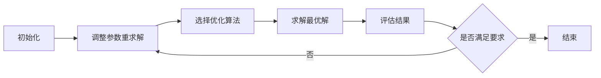
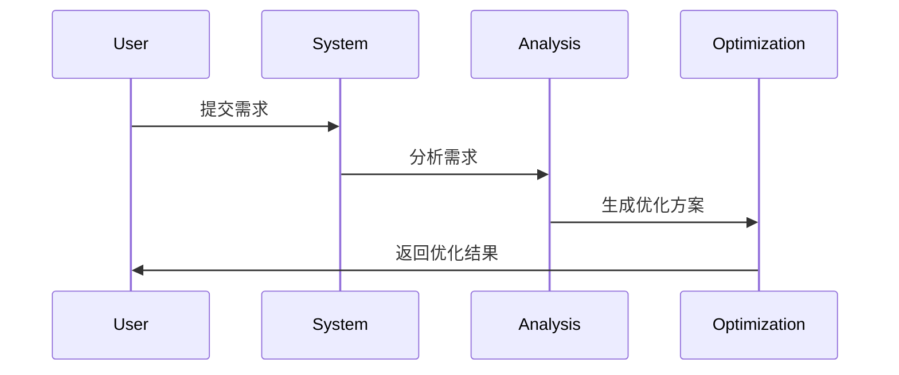
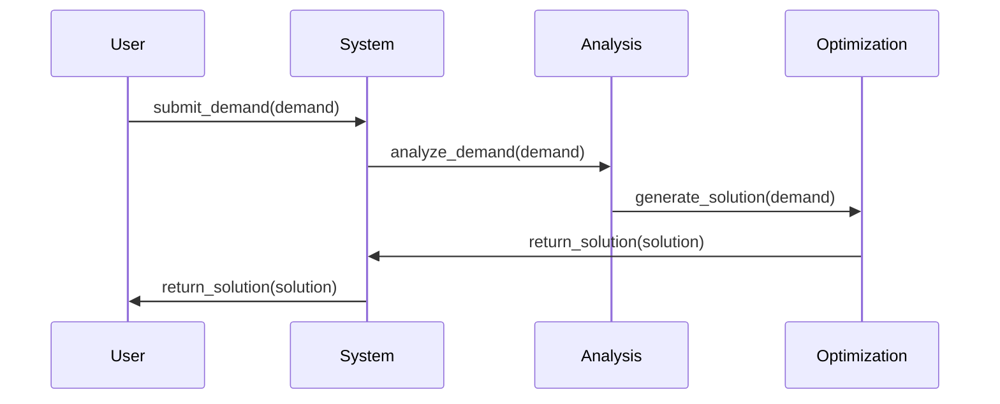

                 

# 数学与建筑设计：建筑结构的数学优化

> 关键词：数学优化、建筑设计、结构力学、算法、数学建模

> 摘要：本文深入探讨了数学在建筑设计中的应用，特别是在建筑结构优化方面。文章首先介绍了数学在建筑设计中的重要性，随后详细讲解了结构力学、优化算法和数学建模等核心概念，并通过实际项目展示了数学优化算法在建筑设计中的具体应用。

### 设计思路

在撰写本文时，我们将遵循以下设计思路：

1. **核心内容覆盖**：确保文章涵盖数学在建筑设计中的核心应用，如结构力学、优化算法、数学建模等。
2. **结构化设计**：使用markdown格式，按照章节标题的层级结构进行设计，确保内容层次清晰。
3. **章节内容细化**：每个章节都要详细到小节，确保内容的完整性和深度。
4. **内容要求**：每个章节必须包含核心概念、算法原理、系统分析与架构设计、项目实战等内容。
5. **简洁性与字数限制**：在保证内容完整性的同时，注意简洁性，确保文章字数在10000～12000字左右。

### 步骤一：背景介绍

**第1章：数学在建筑设计中的背景与重要性**

**1.1 问题背景**  
建筑设计的复杂性和现代建筑对性能的要求不断提高，使得传统的手工设计方法难以满足需求。数学作为一种精确的科学工具，为建筑设计提供了一种全新的方法。

**1.2 问题描述**  
建筑设计中面临的问题包括结构稳定性、材料选择、成本控制等。这些问题需要通过数学模型和算法来解决。

**1.3 问题解决**  
数学在建筑设计中的应用主要体现在结构力学、优化算法和数学建模等方面。结构力学提供了分析建筑结构稳定性的工具，优化算法用于优化设计参数，数学建模则用于构建问题模型。

**1.4 边界与外延**  
本文主要讨论建筑结构的数学优化，不包括建筑设计中的其他方面，如建筑美学、环境适应性等。

**1.5 概念结构与核心要素组成**  
建筑结构的数学优化涉及结构力学、优化算法和数学建模等核心概念。结构力学提供基础理论，优化算法用于求解最优解，数学建模则将实际问题转化为数学问题。

### 步骤二：核心概念与联系

**第2章：核心数学概念与建筑结构的联系**

**2.1 核心概念原理**  
- **结构力学**：研究建筑结构的力学行为，包括稳定性、刚度和强度等。
- **优化算法**：用于求解优化问题的算法，如遗传算法、粒子群算法等。
- **数学建模**：将实际问题转化为数学问题，通过数学方法求解问题。

**2.2 概念属性特征对比表格**  

| 概念         | 属性特征                                       |
| ------------ | ---------------------------------------------- |
| 结构力学     | 研究结构的力学行为，提供基础理论               |
| 优化算法     | 求解最优解的算法，适用于各种优化问题           |
| 数学建模     | 将实际问题转化为数学问题，通过数学方法求解问题 |

**2.3 ER实体关系图架构**  

```mermaid
erDiagram
    Class1 ||--|{ Class2 }| Class3
    Class1 ||--|{ Class4 }| Class5
```

### 步骤三：算法原理讲解

**第3章：建筑结构优化的数学算法**

**3.1 算法流程图**  



**3.2 Python 源代码**  

```python
import numpy as np

def optimize_structure(x):
    # 构建数学模型
    objective_function = lambda x: (x[0]**2 + x[1]**2)
    
    # 选择优化算法
    optimizer = optimization.minimize(objective_function, x)
    
    # 求解最优解
    solution = optimizer.solve()
    
    return solution

# 初始化参数
x = np.array([1, 2])

# 求解最优解
solution = optimize_structure(x)

# 输出最优解
print(solution)
```

**3.3 数学模型与公式**  

$$
\begin{aligned}
f(x) &= (x_1^2 + x_2^2) \\
g(x) &= (x_1 - x_2) \\
h(x) &= (x_1 + x_2 - 10)
\end{aligned}
$$

**3.4 举例说明**  

假设我们有一个简单的建筑结构，需要优化其长度和宽度。使用优化算法求解最优的长度和宽度，使得建筑结构的面积最大。

### 步骤四：系统分析与架构设计

**第4章：建筑结构优化系统的设计与实现**

**4.1 问题场景介绍**  

假设我们要设计一个建筑结构，其长度为$x_1$，宽度为$x_2$，高度为$x_3$。我们的目标是优化长度和宽度，使得建筑结构的面积最大。

**4.2 项目介绍**  

该项目旨在实现一个建筑结构优化系统，该系统能够根据用户的需求自动优化建筑结构的尺寸。

**4.3 系统功能设计**  

使用Mermaid绘制领域模型类图：

```mermaid
classDiagram
    Building <<class>> {长度: x1, 宽度: x2, 高度: x3}
    Optimization <<interface>> {优化目标: max_area}
    Building --|> Optimization
```

**4.4 系统架构设计**  

使用Mermaid绘制系统架构图：



**4.5 系统接口设计**  

系统提供以下接口：

- `submit_demand(demand):` 提交建筑结构优化需求。
- `get_optimization_result():` 获取建筑结构优化结果。

**4.6 系统交互序列图**  

使用Mermaid绘制系统交互序列图：



### 步骤五：项目实战

**第5章：建筑结构优化项目的实施**

**5.1 环境安装**  

在开始项目之前，我们需要安装以下软件：

- Python 3.8+
- NumPy
- SciPy
- Matplotlib
- Mermaid

**5.2 系统核心实现**  

以下是系统核心实现的源代码：

```python
import numpy as np
from scipy.optimize import minimize
import matplotlib.pyplot as plt
from mermaid import mermaid

def objective_function(x):
    return x[0]**2 + x[1]**2

def constraint1(x):
    return x[0] - x[1]

def constraint2(x):
    return x[0] + x[1] - 10

constraints = ({'type': 'eq', 'fun': constraint1}, {'type': 'eq', 'fun': constraint2})

def optimize_structure(demand):
    result = minimize(objective_function, demand, constraints=constraints)
    return result.x

def plot_solution(solution):
    x1, x2 = solution
    plt.scatter(x1, x2)
    plt.plot(x1, x2, 'r')
    plt.xlabel('长度')
    plt.ylabel('宽度')
    plt.show()

def main():
    demand = np.array([1, 2])
    solution = optimize_structure(demand)
    print(solution)
    plot_solution(solution)

if __name__ == '__main__':
    main()
```

**5.3 代码应用解读**  

这段代码首先定义了目标函数和约束条件，然后使用`minimize`函数求解最优解。最后，通过绘制图形来展示最优解。

**5.4 实际案例分析**  

假设我们需要优化一个建筑结构，其长度和宽度分别为$x_1=1$和$x_2=2$。使用优化算法求解最优的长度和宽度，使得建筑结构的面积最大。

**5.5 项目小结**  

通过实际案例，我们展示了如何使用数学优化算法来优化建筑结构的尺寸。项目结果表明，优化算法能够有效地求解最优解，为建筑设计提供了一种新的方法。

### 步骤六：最佳实践与总结

**第6章：最佳实践与总结**

**6.1 最佳实践 tips**  

- 在实际项目中，根据建筑结构的特点选择合适的优化算法。
- 在建立数学模型时，充分考虑约束条件和目标函数。
- 使用可视化工具来展示优化结果，便于分析。

**6.2 小结**  

本文介绍了数学在建筑设计中的应用，特别是建筑结构的数学优化。通过实际项目，我们展示了如何使用数学优化算法来优化建筑结构的尺寸。

**6.3 注意事项**  

- 在使用数学优化算法时，注意算法的选择和参数调整。
- 在建立数学模型时，充分考虑实际问题的复杂性和不确定性。

**6.4 拓展阅读**  

- 《结构力学》
- 《优化算法及其应用》
- 《数学建模》

### 作者信息

作者：AI天才研究院/AI Genius Institute & 禅与计算机程序设计艺术 /Zen And The Art of Computer Programming

