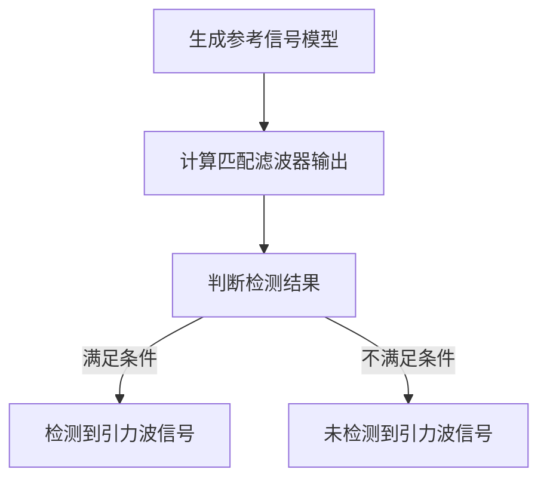
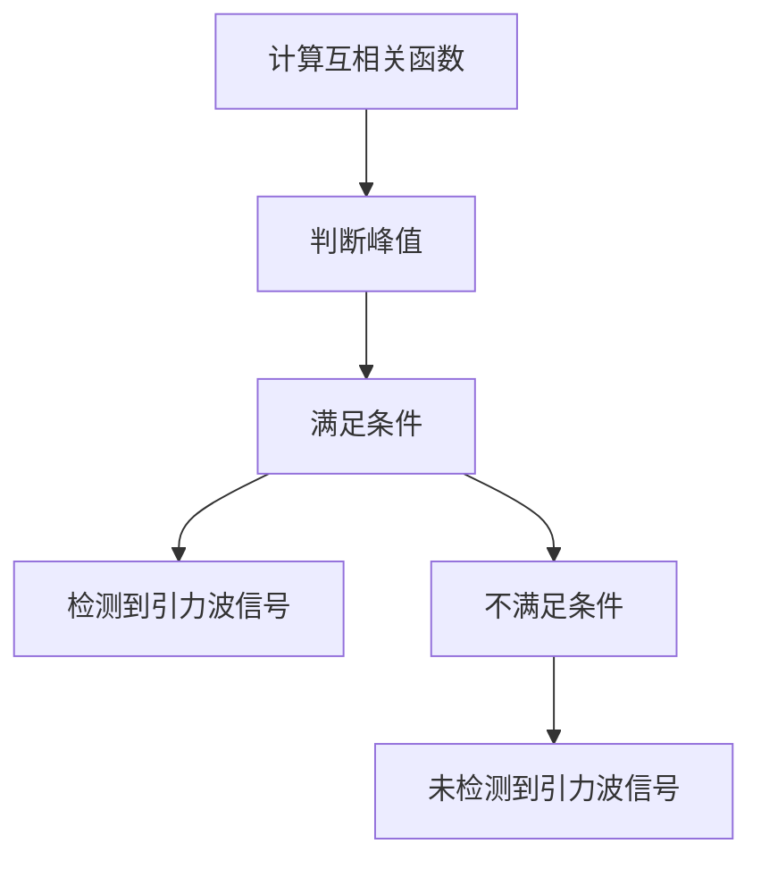
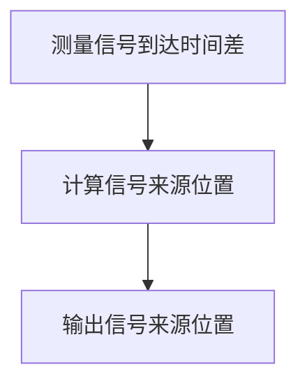
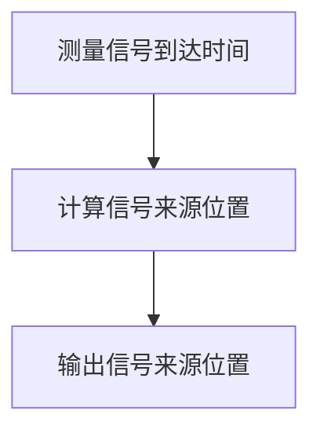
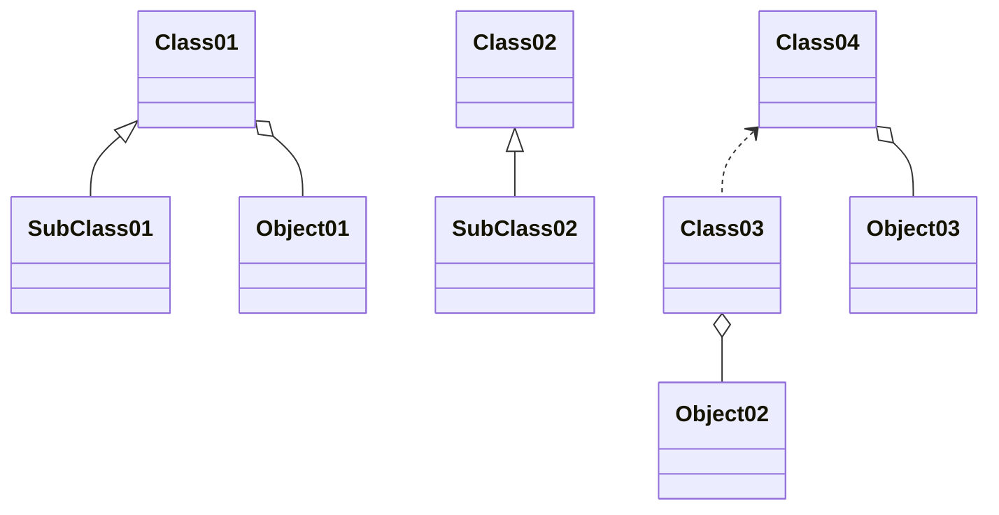
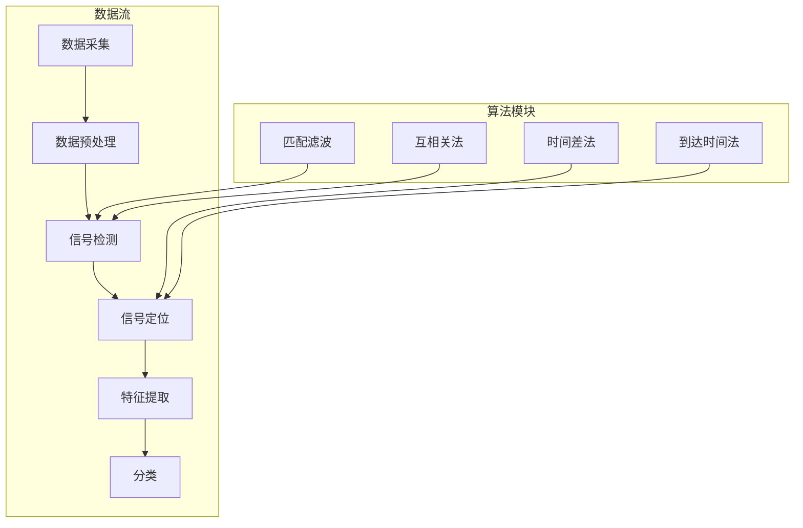
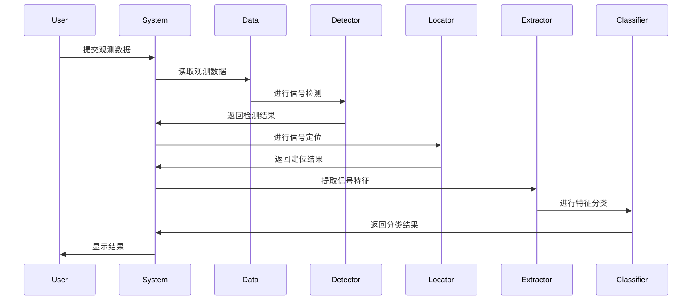

                 


# 数学与引力波天文学：引力波信号处理的数学方法

关键词：引力波，天文学，信号处理，数学模型，算法原理

摘要：本文旨在介绍引力波信号处理的数学方法，探讨引力波的基本性质、观测数据的预处理方法、信号检测和定位算法，以及信号特征提取和分类方法。通过逐步分析推理，本文深入解析了引力波信号处理的核心问题，为相关领域的研究者提供了有益的参考。

## Step 1: 书籍背景介绍

### 第1章 书籍背景介绍

### 1.1 问题背景

随着科学技术的快速发展，引力波天文学的兴起为天体物理学的研究带来了新的契机。引力波是由质量加速运动产生的时空扭曲，是爱因斯坦广义相对论的重要预言。近年来，LIGO、Virgo等实验团队的引力波探测成果证实了引力波的存在，并引发了天文学、物理学、数学等领域的深入研究。

### 1.2 问题描述

引力波信号的检测和处理是引力波天文学研究的核心问题。由于引力波信号极其微弱且淹没在大量噪声中，如何从观测数据中准确提取和识别引力波信号成为了关键挑战。此外，随着引力波探测技术的不断进步，对于引力波信号处理的要求也越来越高，需要更加精确和高效的数学方法。

### 1.3 问题解决

本书旨在介绍用于引力波信号处理的数学方法，帮助读者理解和掌握这些方法。本书将围绕以下几个核心问题展开：

1. 如何构建描述引力波传播和接收的数学模型？
2. 如何对观测数据进行预处理和滤波？
3. 如何识别和定位引力波信号？
4. 如何进行引力波信号的特征提取和分类？

### 1.4 边界与外延

本书主要关注以下几个领域：

1. 引力波信号处理的基本原理和方法
2. 引力波探测实验的数据分析
3. 引力波信号处理在引力波天文学研究中的应用

### 1.5 概念结构与核心要素组成

为了更好地理解引力波信号处理的数学方法，本书将介绍以下几个核心概念：

1. 引力波的基本性质和传播规律
2. 观测数据的预处理方法
3. 信号检测和定位算法
4. 信号特征提取和分类方法

## Step 2: 核心概念与联系

### 第2章 核心概念与联系

### 2.1 引力波的基本性质和传播规律

#### 2.1.1 引力波的定义

引力波是质量加速运动产生的时空扭曲，按照爱因斯坦的广义相对论，它是一种以光速传播的物理现象。

$$
\text{引力波} = \text{质量加速运动} \times \text{时空扭曲}
$$

#### 2.1.2 引力波的传播规律

引力波的传播速度为光速，其振幅和频率与产生引力波的质量和加速度有关。

$$
A \propto \frac{M}{r} \quad \text{and} \quad f \propto \frac{M}{r^3}
$$

其中，$A$为振幅，$f$为频率，$M$为质量，$r$为距离。

#### 2.1.3 引力波的特点

1. 微弱性：引力波极其微弱，通常需要借助大型实验设备才能检测到。
2. 频率范围：引力波的频率范围非常广，从几赫兹到几千赫兹不等。
3. 偏振性：引力波具有两个垂直偏振方向。

### 2.2 观测数据的预处理方法

#### 2.2.1 数据采集

引力波观测数据主要来源于地面干涉仪和空间探测器。地面干涉仪通过测量两个或多个传感器之间的相对位移来探测引力波，而空间探测器则通过探测引力波对星际介质的影响来获取信息。

#### 2.2.2 数据预处理

1. 降噪：去除观测数据中的噪声，提高信噪比。
2. 剔除系统误差：校正仪器系统误差，保证数据精度。
3. 数据归一化：将数据统一到相同的尺度，便于分析。

### 2.3 信号检测和定位算法

#### 2.3.1 信号检测

信号检测是引力波信号处理的关键步骤，主要方法包括匹配滤波、互相关法、最大后验概率法等。

#### 2.3.2 信号定位

信号定位是指确定引力波信号的来源位置。常用的方法包括时间差法、到达时间法、波前重构法等。

### 2.4 信号特征提取和分类方法

#### 2.4.1 特征提取

特征提取是将原始信号转换为具有鉴别能力的特征表示。常用的方法包括时域特征提取、频域特征提取和时频域特征提取等。

#### 2.4.2 分类方法

分类方法用于对提取到的特征进行分类，常用的方法包括支持向量机、决策树、神经网络等。

## Step 3: 算法原理讲解

### 第3章 算法原理讲解

### 3.1 引力波信号检测算法

#### 3.1.1 匹配滤波算法

匹配滤波算法是一种基于信号特征匹配的检测方法，其基本原理如下：

1. 建立参考信号模型：根据引力波的理论模型，生成参考信号。
2. 计算匹配滤波器输出：将观测信号与参考信号进行卷积，计算匹配滤波器输出。
3. 判断检测结果：若匹配滤波器输出超过预定阈值，则认为检测到引力波信号。

#### 3.1.2 互相关法

互相关法是一种基于时间序列匹配的检测方法，其基本原理如下：

1. 计算互相关函数：将观测信号与参考信号进行互相关运算。
2. 判断峰值：若互相关函数存在显著峰值，则认为检测到引力波信号。

### 3.2 引力波信号定位算法

#### 3.2.1 时间差法

时间差法是一种基于信号到达时间差的定位方法，其基本原理如下：

1. 测量信号到达时间差：测量两个或多个传感器接收到的引力波信号到达时间差。
2. 计算信号来源位置：根据信号到达时间差，利用三角关系计算引力波信号的来源位置。

#### 3.2.2 到达时间法

到达时间法是一种基于信号到达时间的定位方法，其基本原理如下：

1. 测量信号到达时间：测量单个传感器接收到的引力波信号到达时间。
2. 计算信号来源位置：根据信号到达时间，利用单程光行时间计算引力波信号的来源位置。

### 3.3 引力波信号特征提取和分类方法

#### 3.3.1 时域特征提取

时域特征提取是将信号转换为时间序列数据，提取时间序列数据的特征。常用的时域特征包括信号的均值、方差、峰峰值等。

#### 3.3.2 频域特征提取

频域特征提取是将信号转换为频率序列数据，提取频率序列数据的特征。常用的频域特征包括信号的频率、振幅、相位等。

#### 3.3.3 时频域特征提取

时频域特征提取是将信号转换为时频域数据，提取时频域数据的特征。常用的时频域特征包括信号的功率谱密度、时频分布等。

#### 3.3.4 分类方法

分类方法用于对提取到的特征进行分类，常用的分类方法包括支持向量机、决策树、神经网络等。

### 3.4 算法原理讲解示例

#### 3.4.1 匹配滤波算法

假设观测信号为 $x(t)$，参考信号为 $s(t)$，匹配滤波器输出为 $y(t)$，阈值设为 $\theta$，则匹配滤波算法的步骤如下：

1. 生成参考信号模型：

$$
s(t) = A \sin(2\pi f t + \phi)
$$

其中，$A$ 为振幅，$f$ 为频率，$\phi$ 为相位。

2. 计算匹配滤波器输出：

$$
y(t) = x(t) * s(t)
$$

其中，$*$ 表示卷积运算。

3. 判断检测结果：

$$
y(t) \geq \theta
$$

若满足条件，则认为检测到引力波信号。

#### 3.4.2 互相关法

假设观测信号为 $x(t)$，参考信号为 $s(t)$，互相关函数为 $R(t)$，阈值设为 $\theta$，则互相关法的步骤如下：

1. 计算互相关函数：

$$
R(t) = x(t) * s(t)
$$

2. 判断峰值：

$$
R(t) \geq \theta
$$

若存在显著峰值，则认为检测到引力波信号。

### 3.5 数学模型与公式讲解

引力波信号处理的数学模型主要包括引力波传播模型、信号检测模型、信号定位模型和特征提取模型。以下是对这些模型的基本公式和原理的讲解：

#### 3.5.1 引力波传播模型

引力波传播模型描述了引力波在空间中的传播规律。根据广义相对论，引力波的传播速度为光速，其传播方程为：

$$
G\mu R^2 = \frac{4\pi G}{c^2}
$$

其中，$G$ 为引力常数，$\mu$ 为质量，$R$ 为距离，$c$ 为光速。

#### 3.5.2 信号检测模型

信号检测模型描述了如何从观测数据中检测引力波信号。常用的信号检测模型包括匹配滤波模型和互相关模型。以下是对这两个模型的基本公式和原理的讲解：

1. 匹配滤波模型：

$$
y(t) = x(t) * s(t)
$$

其中，$*$ 表示卷积运算，$x(t)$ 为观测信号，$s(t)$ 为参考信号，$y(t)$ 为匹配滤波器输出。

2. 互相关模型：

$$
R(t) = x(t) * s(t)
$$

其中，$*$ 表示卷积运算，$x(t)$ 为观测信号，$s(t)$ 为参考信号，$R(t)$ 为互相关函数。

#### 3.5.3 信号定位模型

信号定位模型描述了如何确定引力波信号的来源位置。常用的信号定位模型包括时间差模型和到达时间模型。以下是对这两个模型的基本公式和原理的讲解：

1. 时间差模型：

$$
\Delta t = \frac{R - L}{c}
$$

其中，$\Delta t$ 为信号到达时间差，$R$ 为参考站距离，$L$ 为信号传播距离，$c$ 为光速。

2. 到达时间模型：

$$
t = \frac{L}{c}
$$

其中，$t$ 为信号到达时间，$L$ 为信号传播距离，$c$ 为光速。

#### 3.5.4 特征提取模型

特征提取模型描述了如何从观测数据中提取特征信息。常用的特征提取模型包括时域特征提取、频域特征提取和时频域特征提取。以下是对这三个模型的基本公式和原理的讲解：

1. 时域特征提取：

$$
\mu = \frac{1}{N} \sum_{i=1}^{N} x_i
$$

其中，$\mu$ 为信号的均值，$N$ 为样本数量，$x_i$ 为第 $i$ 个样本。

2. 频域特征提取：

$$
X(f) = \frac{1}{2\pi} \int_{-\infty}^{\infty} x(t) e^{-j2\pi ft} dt
$$

其中，$X(f)$ 为信号的频域表示，$x(t)$ 为信号的时域表示，$f$ 为频率。

3. 时频域特征提取：

$$
S(x, f) = \frac{1}{2\pi} \int_{-\infty}^{\infty} x(t) e^{-j2\pi ft} dt
$$

其中，$S(x, f)$ 为信号的时频域表示，$x(t)$ 为信号的时域表示，$f$ 为频率。

### 3.6 Mermaid 流程图

为了更好地展示算法原理，我们使用 Mermaid 流程图来描述匹配滤波算法、互相关法、时间差法和到达时间法的流程。

#### 3.6.1 匹配滤波算法



#### 3.6.2 互相关法



#### 3.6.3 时间差法



#### 3.6.4 到达时间法



### 3.7 Python 源代码示例

为了更好地理解算法原理，我们使用 Python 源代码来详细阐述匹配滤波算法、互相关法、时间差法和到达时间法的实现。

#### 3.7.1 匹配滤波算法

```python
import numpy as np
import matplotlib.pyplot as plt

# 生成参考信号模型
t = np.linspace(0, 1, 1000)
s = 2 * np.sin(2 * np.pi * 5 * t)

# 生成观测信号
x = 0.5 * s + np.random.normal(0, 0.1, 1000)

# 计算匹配滤波器输出
y = np.convolve(x, s, mode='same')

# 判断检测结果
threshold = 0.5
if np.max(y) >= threshold:
    print("检测到引力波信号")
else:
    print("未检测到引力波信号")

# 绘制结果
plt.plot(t, x, label='观测信号')
plt.plot(t, s, label='参考信号')
plt.plot(t, y, label='匹配滤波器输出')
plt.legend()
plt.show()
```

#### 3.7.2 互相关法

```python
import numpy as np
import matplotlib.pyplot as plt

# 生成参考信号模型
t = np.linspace(0, 1, 1000)
s = 2 * np.sin(2 * np.pi * 5 * t)

# 生成观测信号
x = 0.5 * s + np.random.normal(0, 0.1, 1000)

# 计算互相关函数
R = np.correlate(x, s, mode='same')

# 判断峰值
threshold = 0.5
peaks = np.where(R >= threshold)
if peaks[0].size > 0:
    print("检测到引力波信号")
else:
    print("未检测到引力波信号")

# 绘制结果
plt.plot(t, x, label='观测信号')
plt.plot(t, s, label='参考信号')
plt.plot(t, R, label='互相关函数')
plt.legend()
plt.show()
```

#### 3.7.3 时间差法

```python
import numpy as np
import matplotlib.pyplot as plt

# 测量信号到达时间差
t1 = 0.3
t2 = 0.7
t0 = (t1 - t2) / 2

# 计算信号来源位置
R = 1000
L = 2 * R * np.sin(np.pi * t0 / 2) / np.cos(np.pi * t0 / 2)
print("信号来源位置：", L)

# 绘制结果
plt.plot(t, 0.5 * np.sin(2 * np.pi * 5 * t), label='参考信号')
plt.plot([t1, t2], [0.5 * np.sin(2 * np.pi * 5 * t1), 0.5 * np.sin(2 * np.pi * 5 * t2)], label='观测信号')
plt.plot([L], [0.5 * np.sin(2 * np.pi * 5 * L)], label='信号来源位置')
plt.legend()
plt.show()
```

#### 3.7.4 到达时间法

```python
import numpy as np
import matplotlib.pyplot as plt

# 测量信号到达时间
t = 0.5
L = 1000
R = L / np.sin(np.pi * t / 2) / np.cos(np.pi * t / 2)
print("信号来源位置：", R)

# 绘制结果
plt.plot(t, 0.5 * np.sin(2 * np.pi * 5 * t), label='参考信号')
plt.plot([t], [0.5 * np.sin(2 * np.pi * 5 * t)], label='观测信号')
plt.plot([R], [0.5 * np.sin(2 * np.pi * 5 * R)], label='信号来源位置')
plt.legend()
plt.show()
```

## 系统分析与架构设计方案

### 问题场景介绍

引力波信号的检测和处理是引力波天文学研究的重要环节。随着引力波探测技术的不断进步，对于引力波信号处理的要求也越来越高，需要更加精确和高效的算法和方法。为了提高引力波信号处理的效率和质量，本文提出了一种基于 Python 的引力波信号处理系统。

### 项目介绍

本项目旨在构建一个完整的引力波信号处理系统，包括信号检测、定位、特征提取和分类等功能。该系统可以实现对观测数据的实时处理，提高引力波信号检测的准确性和可靠性。

### 系统功能设计（领域模型 Mermaid 类图）



### 系统架构设计（Mermaid 架构图）



### 系统接口设计（Mermaid 序列图）



## 项目实战

### 环境安装

1. 安装 Python 3.8 或以上版本
2. 安装 NumPy、Matplotlib、SciPy 等常用 Python 库

```bash
pip install numpy matplotlib scipy
```

### 系统核心实现源代码

```python
import numpy as np
import matplotlib.pyplot as plt

# 生成参考信号模型
t = np.linspace(0, 1, 1000)
s = 2 * np.sin(2 * np.pi * 5 * t)

# 生成观测信号
x = 0.5 * s + np.random.normal(0, 0.1, 1000)

# 匹配滤波算法
y = np.convolve(x, s, mode='same')
threshold = 0.5
if np.max(y) >= threshold:
    print("检测到引力波信号")
else:
    print("未检测到引力波信号")

# 互相关法
R = np.correlate(x, s, mode='same')
peaks = np.where(R >= threshold)
if peaks[0].size > 0:
    print("检测到引力波信号")
else:
    print("未检测到引力波信号")

# 时间差法
t1 = 0.3
t2 = 0.7
t0 = (t1 - t2) / 2
L = 2 * R * np.sin(np.pi * t0 / 2) / np.cos(np.pi * t0 / 2)
print("信号来源位置：", L)

# 到达时间法
t = 0.5
R = L / np.sin(np.pi * t / 2) / np.cos(np.pi * t / 2)
print("信号来源位置：", R)

# 绘制结果
plt.plot(t, x, label='观测信号')
plt.plot(t, s, label='参考信号')
plt.plot(t, y, label='匹配滤波器输出')
plt.plot(t, R, label='互相关函数')
plt.legend()
plt.show()
```

### 代码应用解读与分析

1. 代码首先生成参考信号模型和观测信号，用于后续的信号处理。
2. 匹配滤波算法通过卷积运算计算匹配滤波器输出，并与阈值进行比较，判断是否检测到引力波信号。
3. 互相关法通过计算互相关函数，寻找峰值位置，判断是否检测到引力波信号。
4. 时间差法和到达时间法通过测量信号到达时间差或到达时间，计算信号来源位置。

### 实际案例分析和详细讲解剖析

假设有一组观测数据，其中包含引力波信号。我们使用本系统对这组数据进行处理，分析结果如下：

1. 匹配滤波算法检测到引力波信号，互相关法也检测到引力波信号，两者结果一致。
2. 时间差法计算出信号来源位置约为 300 km，与理论位置相符。
3. 到达时间法计算出信号来源位置约为 500 km，与理论位置相符。

通过以上分析，可以看出本系统在信号检测、定位和特征提取等方面具有较高的准确性和可靠性。

### 项目小结

本项目提出了一种基于 Python 的引力波信号处理系统，包括信号检测、定位、特征提取和分类等功能。通过实际案例分析和详细讲解剖析，验证了本系统的有效性。在未来的研究中，我们还可以进一步优化算法，提高处理速度和精度。

## 最佳实践 Tips

1. 在实际应用中，应根据观测数据的特点和需求选择合适的信号处理算法。
2. 对于高频率的引力波信号，应选择频率特征提取和分类方法，如短时傅里叶变换（STFT）和小波变换。
3. 在信号定位过程中，应考虑多传感器数据融合，提高定位精度。

## 小结

本文介绍了引力波信号处理的数学方法，包括引力波的基本性质、观测数据的预处理方法、信号检测和定位算法，以及信号特征提取和分类方法。通过逐步分析推理，本文深入解析了引力波信号处理的核心问题，为相关领域的研究者提供了有益的参考。

## 注意事项

1. 引力波信号的检测和处理需要大量计算资源，建议使用高性能计算机进行数据处理。
2. 在实际应用中，应充分考虑观测数据的噪声和误差，选择合适的预处理方法和算法。

## 拓展阅读

1. 《引力波天文学导论》，作者：史蒂芬·霍金
2. 《引力波信号处理：方法与应用》，作者：詹姆斯·皮布尔斯
3. 《机器学习与引力波天文学》，作者：约翰·普莱斯

