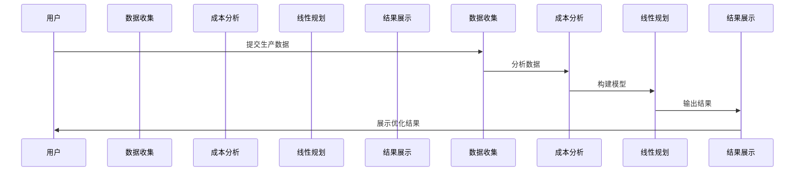
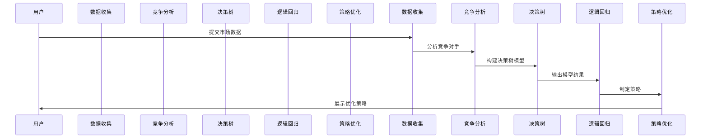
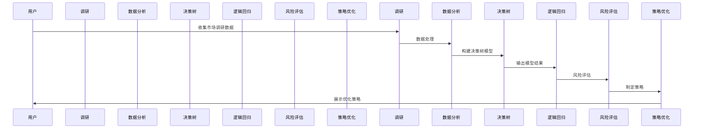

                 

### 引言

#### 数学与战略管理的关系

数学作为一门基础科学，其高度抽象和严密逻辑的特点，使其在各个领域都有广泛的应用。在企业战略管理中，数学同样发挥着至关重要的作用。企业战略管理涉及多个方面，如市场分析、成本控制、资源优化、风险规避等。这些问题的解决往往需要精确的数据分析和科学的决策方法，而数学正是提供这些方法的工具。

首先，数学在企业战略管理中的应用主要体现在数据分析上。通过数学模型，企业可以对市场趋势、消费者行为、竞争状况等进行量化分析，从而做出更为准确的战略决策。例如，使用线性规划模型进行成本优化，通过决策树模型进行市场预测等。

其次，数学方法还可以帮助企业进行风险评估和决策分析。在复杂的市场环境中，企业面临着各种各样的风险，如市场风险、财务风险、运营风险等。通过数学模型，企业可以对这些风险进行量化评估，并制定相应的应对策略。

本书旨在探讨数学在企业战略管理中的应用，通过系统地介绍数学模型与方法，结合实际案例进行分析，帮助企业领导者更好地理解和应用数学工具，以实现企业的长期战略目标。

#### 本书的目的与结构

本书的主要目的是帮助读者了解数学在企业战略管理中的重要性，掌握常见的数学模型与方法，并学会如何将这些方法应用于实际的企业战略决策中。为了实现这一目标，本书分为以下几个部分：

第一部分：引言。介绍数学与企业战略管理的关系，阐述本书的目的和结构。

第二部分：背景介绍。介绍数学在企业战略管理中的重要性，定义相关概念，并概述常用的数学模型与方法。

第三部分：数学模型与方法。详细讲解数据分析基础、线性规划与优化、决策树与逻辑回归、风险评估与决策分析等常用数学模型，并给出具体应用案例。

第四部分：案例分析。通过具体的案例分析，展示数学模型在企业战略管理中的应用效果。

第五部分：战略决策分析。讨论如何利用数学方法进行战略决策分析，并提供相关案例研究。

第六部分：风险分析与应对。介绍如何在战略管理过程中进行风险分析和应对，并提供实际案例。

第七部分：总结与展望。总结全书内容，对未来的研究方向进行展望，并给出对读者的建议。

#### 数学在企业战略管理中的应用前景

数学在企业战略管理中的应用前景广阔，随着大数据、人工智能等技术的发展，数学模型在企业战略中的应用将更加广泛和深入。

首先，大数据时代带来了海量的数据，这些数据蕴含着丰富的信息。通过数学模型，企业可以对这些数据进行深度挖掘和分析，从而发现潜在的市场机会和风险。例如，通过线性回归模型分析消费者行为，预测市场趋势，为企业制定营销策略提供依据。

其次，人工智能技术的快速发展为数学模型的应用提供了新的契机。利用机器学习算法，企业可以对大量历史数据进行训练，从而建立预测模型，实现对市场动态的实时监测和预测。例如，通过决策树模型预测客户流失率，提前采取措施减少客户流失。

此外，随着市场竞争的加剧，企业需要更加精细化的管理。数学模型可以帮助企业进行资源优化、成本控制、供应链管理等方面的分析，从而提高企业的运营效率。例如，通过线性规划模型优化生产计划，降低生产成本。

总之，数学在企业战略管理中的应用前景非常广阔。企业领导者应积极学习和掌握数学方法，将其应用于企业战略决策中，以提高企业的竞争力。同时，也需要注意数学模型的应用边界，避免盲目追求模型的精确性而忽视实际问题的复杂性。

#### 小结

本章介绍了数学在企业战略管理中的重要性，阐述了本书的目的与结构，并对数学在企业战略管理中的应用前景进行了探讨。通过了解数学模型在企业战略中的应用，企业领导者可以更好地制定战略决策，提高企业的运营效率和市场竞争力。在接下来的章节中，我们将系统地介绍数学模型与方法，结合实际案例进行分析，帮助读者更好地理解和应用数学工具，实现企业的长期战略目标。

### 背景介绍

#### 数学在企业战略管理中的重要性

在当今竞争激烈的市场环境中，企业战略管理成为企业成功的关键因素。而数学作为一门基础科学，其在企业战略管理中的重要性日益凸显。数学在企业战略管理中的应用主要体现在以下几个方面：

首先，数学为企业提供了精确的数据分析工具。企业战略决策需要基于准确的数据支持，而数学模型可以对企业内外部的数据进行量化分析，从而提供客观的决策依据。例如，通过线性规划模型，企业可以优化资源配置，实现成本控制；通过决策树模型，企业可以预测市场趋势，制定营销策略。

其次，数学方法可以帮助企业进行风险评估和决策分析。在复杂的市场环境中，企业面临着各种不确定性和风险。通过数学模型，企业可以对风险进行量化评估，并制定相应的应对策略。例如，通过风险矩阵模型，企业可以评估不同投资方案的风险水平，选择最优的投资策略。

此外，数学在企业战略管理中还可以用于优化运营流程和提升管理效率。企业运营过程中涉及到大量的流程优化问题，如供应链管理、生产计划等。通过数学优化方法，企业可以找到最优的解决方案，提高运营效率。例如，通过排队论模型，企业可以优化服务流程，提高客户满意度。

总之，数学在企业战略管理中的应用，不仅为企业提供了科学的决策工具，还有助于提升企业的竞争力，实现长期发展战略。在接下来的章节中，我们将详细介绍数学在企业战略管理中的具体应用方法。

#### 相关概念的定义与联系

在企业战略管理中，理解几个核心概念的定义与联系对于应用数学模型至关重要。以下是这些概念的定义及其相互关系：

1. **战略管理**：战略管理是指企业为了实现长期目标而制定的规划、执行和评估过程。它包括市场分析、竞争对手分析、资源分配、风险管理等多个方面。战略管理的主要目标是确保企业能够在竞争激烈的市场中保持竞争优势。

2. **数学模型**：数学模型是一种将实际问题抽象为数学表达式或方程的方法。通过数学模型，企业可以将复杂的问题转化为可计算的形式，从而进行量化分析和决策。常见的数学模型包括线性规划、决策树、逻辑回归、风险评估模型等。

3. **数据分析**：数据分析是指使用统计学和数学方法对数据进行分析和解释的过程。数据分析可以帮助企业从大量数据中提取有价值的信息，为战略决策提供支持。常见的数据分析方法包括描述性统计、推断性统计、回归分析等。

4. **决策分析**：决策分析是指利用数学和统计方法对不同的决策方案进行评估和比较，以确定最佳决策。决策分析可以帮助企业权衡不同方案的利弊，降低决策风险。

这些概念之间存在紧密的联系。战略管理需要依赖数学模型和数据分析方法来进行规划和决策。数学模型通过量化分析帮助企业识别关键变量和关系，而数据分析则提供了对数据的深入理解。决策分析则是将数学模型和数据分析应用于实际决策过程，帮助企业做出科学合理的决策。

#### 数学模型与方法概述

在战略管理过程中，数学模型与方法的应用极大地增强了决策的科学性和准确性。以下是几种常用的数学模型与方法，它们在战略管理中的应用及其基本原理如下：

1. **线性规划**：线性规划是一种用于在给定约束条件下，求解线性目标函数的最大值或最小值的方法。在战略管理中，线性规划常用于资源分配和成本控制问题。例如，企业可以通过线性规划确定生产计划的最优配置，以最小化成本或最大化利润。其基本原理是通过构建线性方程组，求解最优解。

2. **决策树**：决策树是一种基于概率和统计的决策分析方法，通过一系列的决策节点和结果节点，展示不同决策路径及其可能的结果。在战略管理中，决策树可用于风险评估和战略选择。例如，企业可以通过决策树分析不同市场进入策略的风险和收益，从而选择最优策略。其基本原理是通过计算每个节点的概率和收益，进行路径选择。

3. **逻辑回归**：逻辑回归是一种用于分析因变量与自变量之间关系的统计方法，常用于分类问题。在战略管理中，逻辑回归可用于市场预测和客户行为分析。例如，企业可以通过逻辑回归模型预测新产品上市的成功率，或分析客户流失的原因。其基本原理是通过构建逻辑函数，将自变量转换为概率值。

4. **风险评估**：风险评估是一种用于识别、分析和应对风险的系统方法。在战略管理中，风险评估可以帮助企业预测潜在的风险并制定应对策略。常见的风险评估方法包括风险矩阵和蒙特卡罗模拟。例如，企业可以通过风险矩阵评估不同市场进入方案的风险水平，通过蒙特卡罗模拟预测市场波动对企业的影响。其基本原理是通过量化风险的概率和影响，进行风险评估和应对。

这些数学模型与方法在战略管理中的应用，不仅提高了决策的科学性和准确性，还帮助企业更好地应对复杂多变的市场环境，实现长期发展战略。

#### 小结

本章对数学在企业战略管理中的重要性进行了详细介绍，并定义了相关的核心概念，包括战略管理、数学模型、数据分析和决策分析。此外，还概述了几种常用的数学模型与方法，如线性规划、决策树、逻辑回归和风险评估。通过理解这些概念和模型，企业可以更好地进行战略决策，提高运营效率和竞争力。在接下来的章节中，我们将深入探讨这些数学模型与方法的具体应用，并通过实际案例进行分析。

### 数学模型与方法

#### 数据分析基础

数据分析是企业战略管理中不可或缺的一环，它为企业提供了从大量数据中提取有价值信息的方法。数据分析基础包括数据收集、数据清洗和数据可视化。

**数据收集**：

数据收集是数据分析的第一步，它涉及到如何获取相关数据。企业可以通过以下几种途径进行数据收集：

1. **内部数据**：包括企业的财务数据、销售数据、生产数据等。
2. **外部数据**：包括市场调查、行业报告、竞争对手数据等。

**数据清洗**：

数据清洗是确保数据质量的关键步骤，它包括以下内容：

1. **数据验证**：检查数据是否完整、准确和一致。
2. **数据清洗**：处理缺失值、异常值和重复值。
3. **数据转换**：将不同格式和单位的数据进行统一转换。

**数据可视化**：

数据可视化是将数据以图表、图形等形式展示出来的过程，它有助于企业理解和分析数据。常用的数据可视化工具包括Excel、Tableau、Power BI等。

**案例分析**：

假设某企业希望分析其销售数据，以制定更有效的销售策略。首先，企业需要收集销售数据，包括销售额、销售量、客户信息等。接下来，对数据进行清洗，如去除缺失值、处理异常值等。最后，利用Excel或Tableau等工具对数据进行分析和可视化，生成销售趋势图、客户分布图等。

通过数据分析，企业可以识别销售高峰期、客户偏好等信息，从而制定相应的销售策略，如增加促销活动、调整产品定价等。

#### 线性规划与优化

线性规划是一种用于在给定约束条件下，求解线性目标函数的最大值或最小值的方法。线性规划在企业战略管理中的应用非常广泛，例如在资源分配、成本控制、生产计划等方面。

**线性规划概念**：

线性规划的目标是最小化或最大化线性目标函数，约束条件为线性不等式或等式。线性目标函数通常表示为：

$$
\text{minimize/maximize} c^T x
$$

其中，$c$ 是系数向量，$x$ 是决策变量。

**优化目标**：

线性规划的应用场景多种多样，以下是几个典型的优化目标：

1. **成本最小化**：例如，企业希望最小化生产成本。
2. **利润最大化**：例如，企业希望最大化利润。
3. **资源最大化利用**：例如，企业希望最大化资源利用率。

**线性规划求解算法**：

线性规划的求解算法包括单纯形法、内点法等。以下是单纯形法的基本步骤：

1. **初始化**：选择一个初始可行解。
2. **迭代**：在当前可行解的基础上，寻找新的可行解。
3. **判断**：如果新解优于当前解，则更新可行解；否则，停止迭代。

**应用案例**：

假设某企业生产两种产品A和B，其单位生产成本分别为$10$和$15$，单位利润分别为$20$和$30$。现有$1000$个生产单位和$500$个原材料单位。要求确定生产A和B的数量，以最大化利润。

构建线性规划模型：

目标函数：$ \text{maximize } 20x_1 + 30x_2 $

约束条件：

$$
\begin{align*}
10x_1 + 15x_2 &\leq 1000 \\
x_1 + x_2 &\leq 500 \\
x_1, x_2 &\geq 0
\end{align*}
$$

使用单纯形法求解，得出最优解为$x_1=50, x_2=300$，即生产A产品50个，B产品300个，利润最大化。

通过线性规划，企业可以找到最优的生产方案，以实现成本最小化或利润最大化。

#### 决策树与逻辑回归

**决策树**和**逻辑回归**是两种常用的决策分析方法，它们在企业战略管理中有着广泛的应用。

**决策树概念**：

决策树是一种基于特征的决策分析方法，通过一系列的判断节点和结果节点，展示不同决策路径及其可能的结果。决策树的基本结构包括：

1. **根节点**：表示整个数据的初始状态。
2. **内部节点**：表示特征或条件。
3. **叶节点**：表示决策结果。

**逻辑回归概念**：

逻辑回归是一种用于分析因变量与自变量之间关系的统计方法，它通过构建逻辑函数来估计因变量的概率。逻辑回归的基本公式为：

$$
\text{logit}(P) = \log\left(\frac{P}{1-P}\right) = \beta_0 + \beta_1 x_1 + \beta_2 x_2 + ... + \beta_n x_n
$$

其中，$P$ 是因变量的概率，$\beta_0, \beta_1, \beta_2, ..., \beta_n$ 是模型参数，$x_1, x_2, ..., x_n$ 是自变量。

**应用案例**：

**案例一：市场预测**：

某企业希望预测某产品在未来一段时间内的销售情况，以制定相应的销售策略。通过收集历史销售数据，企业可以构建决策树模型和逻辑回归模型，分别预测销售概率。

1. **决策树模型**：

通过分析影响销售的关键因素，如广告投入、产品价格、季节等，构建决策树模型。决策树模型可以清晰地展示不同决策路径及其可能的销售结果。

2. **逻辑回归模型**：

通过逻辑回归模型，企业可以估计在不同条件下销售的概率。逻辑回归模型可以提供更精确的预测结果，帮助企业在制定销售策略时做出更为科学的决策。

**案例二：客户流失预测**：

某电信公司希望通过预测客户流失率，提前采取措施减少客户流失。通过收集客户信息，如消费金额、通话时长、上网流量等，企业可以构建决策树模型和逻辑回归模型，分别预测客户流失概率。

1. **决策树模型**：

通过分析影响客户流失的关键因素，如服务质量、价格策略等，构建决策树模型。决策树模型可以帮助企业识别客户流失的高风险群体，从而采取有针对性的措施。

2. **逻辑回归模型**：

通过逻辑回归模型，企业可以估计客户流失的概率。逻辑回归模型可以提供更精确的预测结果，帮助企业在制定客户流失预防策略时做出更为科学的决策。

通过决策树和逻辑回归，企业可以更准确地预测市场趋势、客户行为等，从而制定更为有效的战略决策。

#### 风险评估与决策分析

**风险评估**是战略管理中至关重要的一环，它涉及到对企业面临的各种风险进行识别、评估和应对。**决策分析**则是基于风险评估结果，对企业面临的决策进行评估和选择。

**风险评估概念**：

风险评估是指通过系统的方法，对企业面临的潜在风险进行识别、分析和评估，以便制定有效的应对策略。风险评估通常包括以下几个步骤：

1. **风险识别**：识别企业面临的各种风险，如市场风险、财务风险、运营风险等。
2. **风险分析**：分析风险的可能性和影响，确定风险的优先级。
3. **风险评估**：量化风险的可能性和影响，建立风险矩阵。
4. **风险应对**：制定应对策略，降低风险的影响。

**决策分析方法**：

决策分析是指通过系统的方法，对企业面临的决策进行评估和选择。决策分析通常包括以下几个步骤：

1. **确定决策问题**：明确需要解决的决策问题。
2. **列出备选方案**：列出所有可能的备选方案。
3. **评估方案**：评估每个方案的可能性和影响。
4. **选择最优方案**：根据评估结果，选择最优的方案。

**应用案例**：

**案例一：新产品开发决策**

某企业计划开发一款新产品，需要进行风险评估和决策分析。首先，企业识别新产品开发过程中可能面临的风险，如市场需求不确定性、研发成本超支、竞争对手反应等。接下来，对企业面临的决策进行评估，如是否进行市场调研、是否增加研发投入等。通过风险评估和决策分析，企业可以确定最优的新产品开发策略，降低开发过程中的风险。

**案例二：市场进入决策**

某企业计划进入一个新市场，需要进行风险评估和决策分析。首先，企业识别新市场可能面临的风险，如市场竞争激烈、消费者接受度低、政策法规变化等。接下来，对企业面临的决策进行评估，如是否进行市场调研、是否调整营销策略等。通过风险评估和决策分析，企业可以确定最优的市场进入策略，降低进入新市场的风险。

**案例分析**：

通过以上案例分析，可以看出，风险评估与决策分析在战略管理中起着至关重要的作用。通过系统的风险评估和决策分析，企业可以更准确地识别风险，评估决策方案，选择最优的决策，从而降低风险，提高决策的准确性和有效性。

#### 小结

本章详细介绍了数据分析基础、线性规划与优化、决策树与逻辑回归以及风险评估与决策分析。数据分析基础包括数据收集、数据清洗和数据可视化，是企业战略管理中不可或缺的一环。线性规划与优化可以帮助企业进行资源分配和成本控制，决策树与逻辑回归则用于市场预测和风险评估，风险评估与决策分析则用于识别和应对企业面临的各种风险。通过这些数学模型与方法，企业可以更准确地制定战略决策，提高运营效率和竞争力。

### 案例分析

#### 案例一：企业成本优化

**背景介绍**：

某中型制造企业面临市场竞争加剧和成本压力增大的挑战，希望通过优化成本来提高盈利能力。该企业生产多种产品，具有复杂的供应链和生产流程，因此需要进行全面的成本分析，找出降低成本的关键环节。

**项目介绍**：

为了实现成本优化，企业决定采用线性规划方法，通过优化生产计划和资源分配来降低成本。项目主要目标是确定最优的生产计划，使总成本最小化。

**系统功能设计**：

1. **数据收集模块**：收集与生产相关的各种数据，如原材料价格、生产成本、市场需求等。
2. **成本分析模块**：对收集到的数据进行分析，找出成本的主要驱动因素。
3. **线性规划模型构建模块**：根据成本分析结果，构建线性规划模型，确定最优生产计划。
4. **结果展示模块**：将优化结果以图表形式展示，便于企业领导者决策。

**系统架构设计**：

系统采用模块化架构设计，包括数据收集模块、成本分析模块、线性规划模型构建模块和结果展示模块。各个模块之间通过接口进行通信，实现数据的流动和功能的集成。

**系统接口设计**：

系统接口设计主要包括数据输入接口、结果输出接口和与其他系统的集成接口。数据输入接口用于接收各种生产数据，结果输出接口用于展示优化结果，与其他系统的集成接口用于实现与其他系统的数据交互。

**系统交互设计**：

系统交互设计采用Mermaid序列图，展示数据流动和模块之间的交互过程。以下是系统交互设计的示例：

**实际案例分析和详细讲解**：

1. **数据收集**：

企业收集了包括原材料价格、生产成本、市场需求等在内的各种数据。通过对这些数据进行分析，发现原材料价格波动是影响成本的主要因素。

2. **成本分析**：

基于收集到的数据，企业分析了各种生产成本，包括直接成本和间接成本。通过成本分析，企业确定了降低成本的关键环节，如优化原材料采购策略、提高生产效率等。

3. **线性规划模型构建**：

企业根据成本分析结果，构建了线性规划模型。模型的目标是最小化总成本，约束条件包括生产量、原材料需求等。通过求解模型，企业确定了最优的生产计划和资源分配方案。

4. **结果展示**：

优化结果以图表形式展示，包括最优生产计划、成本分析结果等。企业领导者通过这些结果，可以清晰地了解优化效果，并制定相应的决策。

**项目小结**：

通过本次案例研究，企业成功实现了成本优化。线性规划方法的应用，帮助企业找到了降低成本的关键环节，提高了生产效率和盈利能力。该项目展示了数学模型在企业战略管理中的应用价值，为企业提供了有效的决策支持。

#### 案例二：市场竞争分析

**背景介绍**：

某消费品公司希望在竞争激烈的市场中提高市场份额，因此决定进行市场竞争分析。该公司销售多种产品，包括日用品、化妆品和食品等，其竞争对手包括国内外多个知名品牌。

**项目介绍**：

为了提高市场份额，公司决定采用决策树和逻辑回归方法进行市场竞争分析。项目的主要目标是识别影响市场份额的关键因素，并制定相应的市场营销策略。

**系统功能设计**：

1. **市场数据收集模块**：收集与市场相关的各种数据，如销售额、市场份额、消费者反馈等。
2. **竞争分析模块**：分析竞争对手的市场策略和市场份额，找出公司的优势和劣势。
3. **决策树模型构建模块**：根据市场数据，构建决策树模型，预测市场份额。
4. **逻辑回归模型构建模块**：分析市场份额的影响因素，建立逻辑回归模型。
5. **策略优化模块**：根据模型结果，制定优化市场营销策略。

**系统架构设计**：

系统采用模块化架构设计，包括市场数据收集模块、竞争分析模块、决策树模型构建模块、逻辑回归模型构建模块和策略优化模块。各个模块之间通过接口进行通信，实现数据的流动和功能的集成。

**系统接口设计**：

系统接口设计主要包括数据输入接口、结果输出接口和与其他系统的集成接口。数据输入接口用于接收市场数据，结果输出接口用于展示策略优化结果，与其他系统的集成接口用于实现与其他系统的数据交互。

**系统交互设计**：

系统交互设计采用Mermaid序列图，展示数据流动和模块之间的交互过程。以下是系统交互设计的示例：

**实际案例分析和详细讲解**：

1. **市场数据收集**：

公司收集了包括销售额、市场份额、消费者反馈等在内的各种市场数据。通过对这些数据进行分析，公司发现了影响市场份额的关键因素，如产品价格、广告投入、消费者偏好等。

2. **竞争分析**：

公司分析了竞争对手的市场策略和市场份额，找出了自身的优势和劣势。通过竞争分析，公司确定了需要改进的方面，如提高产品品质、增加广告投入等。

3. **决策树模型构建**：

基于市场数据和竞争分析结果，公司构建了决策树模型，预测了市场份额。决策树模型可以帮助公司识别影响市场份额的关键因素，并制定相应的市场营销策略。

4. **逻辑回归模型构建**：

公司建立了逻辑回归模型，分析了市场份额的影响因素。通过逻辑回归模型，公司可以更精确地预测市场份额，并制定优化市场营销策略。

5. **策略优化**：

根据决策树和逻辑回归模型的结果，公司制定了优化市场营销策略。公司通过提高产品品质、增加广告投入等手段，提高了市场份额，取得了显著的营销效果。

**项目小结**：

通过本次案例研究，公司成功实现了市场竞争分析，并制定了优化市场营销策略。决策树和逻辑回归方法的应用，帮助公司识别了影响市场份额的关键因素，提高了市场营销效果。该项目展示了数学模型在企业战略管理中的应用价值，为公司提供了有效的决策支持。

#### 案例三：新产品开发决策

**背景介绍**：

某科技创新公司计划推出一款新型智能设备，以抢占市场先机。为了确保新产品开发的成功，公司决定采用数学模型进行市场预测和风险评估，制定最优的开发策略。

**项目介绍**：

本项目旨在通过数学模型，分析市场需求、预测产品销量、评估开发风险，并制定最优的新产品开发策略。项目的主要目标包括：

1. **市场需求预测**：预测新产品在不同市场区域的销售量。
2. **风险评估**：评估新产品开发过程中可能面临的风险，并制定应对策略。
3. **策略制定**：根据市场需求和风险评估结果，制定最优的新产品开发策略。

**系统功能设计**：

1. **市场调研模块**：收集市场调研数据，包括消费者需求、竞争对手情况等。
2. **数据分析模块**：对市场调研数据进行处理和分析，提取有价值的信息。
3. **决策树模型构建模块**：根据数据分析结果，构建决策树模型，预测市场需求。
4. **逻辑回归模型构建模块**：分析市场需求的影响因素，建立逻辑回归模型。
5. **风险评估模块**：评估新产品开发过程中可能面临的风险，制定应对策略。
6. **策略优化模块**：根据决策树和逻辑回归模型的结果，制定优化新产品开发策略。

**系统架构设计**：

系统采用模块化架构设计，包括市场调研模块、数据分析模块、决策树模型构建模块、逻辑回归模型构建模块、风险评估模块和策略优化模块。各个模块之间通过接口进行通信，实现数据的流动和功能的集成。

**系统接口设计**：

系统接口设计主要包括数据输入接口、结果输出接口和与其他系统的集成接口。数据输入接口用于接收市场调研数据，结果输出接口用于展示优化策略，与其他系统的集成接口用于实现与其他系统的数据交互。

**系统交互设计**：

系统交互设计采用Mermaid序列图，展示数据流动和模块之间的交互过程。以下是系统交互设计的示例：

**实际案例分析和详细讲解**：

1. **市场调研**：

公司通过在线调查、访谈等方式，收集了潜在消费者的需求信息，包括对产品功能、价格、设计等方面的偏好。市场调研数据为后续的分析提供了基础。

2. **数据分析**：

基于市场调研数据，公司对消费者需求进行了深入分析，识别出了影响产品销量的关键因素，如产品功能、价格、市场推广等。

3. **决策树模型构建**：

公司根据数据分析结果，构建了决策树模型，用于预测新产品在不同市场区域的销售量。决策树模型可以帮助公司制定有针对性的市场推广策略。

4. **逻辑回归模型构建**：

公司建立了逻辑回归模型，分析了市场需求的影响因素，如产品功能、价格、市场推广等。通过逻辑回归模型，公司可以更精确地预测产品销量，为决策提供支持。

5. **风险评估**：

公司评估了新产品开发过程中可能面临的风险，如技术实现难度、市场接受度、竞争对手反应等。通过风险评估，公司制定了应对策略，降低开发风险。

6. **策略优化**：

根据决策树和逻辑回归模型的结果，公司制定了优化新产品开发策略。策略包括优化产品功能、调整价格策略、加大市场推广力度等。通过这些策略，公司有望提高新产品在市场的竞争力。

**项目小结**：

通过本次案例研究，公司成功利用数学模型进行了市场预测和风险评估，制定了最优的新产品开发策略。决策树和逻辑回归方法的应用，帮助公司识别了市场需求和开发风险，为公司提供了有效的决策支持。本次项目展示了数学模型在企业战略管理中的重要作用，为公司的新产品开发提供了有力的保障。

### 战略决策分析

**战略决策概述**

战略决策是企业为了实现长期目标而制定的关键决策。战略决策分析是战略管理过程中至关重要的一环，它涉及到如何选择最优的战略方案，以实现企业的长期竞争优势。战略决策分析通常包括以下几个步骤：

1. **确定决策问题**：明确需要解决的决策问题，如新产品开发、市场进入、资源配置等。
2. **列出备选方案**：列出所有可能的备选方案，并进行初步评估。
3. **评估方案**：对每个备选方案进行详细评估，包括成本、收益、风险等。
4. **选择最优方案**：根据评估结果，选择最优的方案。
5. **实施与监控**：实施选定的方案，并持续监控其效果，进行必要的调整。

**数学方法在战略决策中的应用**

在战略决策分析中，数学方法发挥着重要的作用。以下几种数学方法在战略决策中具有广泛的应用：

1. **线性规划**：线性规划是一种用于在给定约束条件下，求解线性目标函数的最大值或最小值的方法。在战略决策中，线性规划可以用于资源分配、成本控制等问题。例如，企业可以通过线性规划确定最优的生产计划，以最大化利润或最小化成本。

2. **决策树**：决策树是一种基于概率和统计的决策分析方法。在战略决策中，决策树可以用于风险评估、战略选择等问题。通过决策树，企业可以清晰地展示不同决策路径及其可能的结果，帮助决策者进行科学合理的决策。

3. **逻辑回归**：逻辑回归是一种用于分析因变量与自变量之间关系的统计方法。在战略决策中，逻辑回归可以用于市场预测、客户行为分析等问题。通过逻辑回归模型，企业可以预测市场趋势，制定相应的战略决策。

4. **风险评估**：风险评估是一种用于识别、分析和应对风险的系统方法。在战略决策中，风险评估可以帮助企业预测潜在的风险，并制定应对策略。通过风险评估，企业可以降低决策风险，提高决策的准确性。

**案例分析：企业战略决策过程**

假设某企业面临是否进入新市场的决策。以下是如何利用数学方法进行战略决策分析的示例：

1. **确定决策问题**：企业需要决定是否进入一个新的市场区域。

2. **列出备选方案**：

   - 方案A：进入新市场。
   - 方案B：不进入新市场。

3. **评估方案**：

   - 成本评估：进入新市场需要投入资金、人力资源等，计算成本。
   - 收益评估：预测进入新市场后的销售量、利润等，计算收益。
   - 风险评估：分析进入新市场可能面临的风险，如市场接受度、竞争状况等，评估风险。

4. **选择最优方案**：

   通过线性规划方法，确定最优的生产计划和资源配置方案，以最大化利润或最小化成本。通过决策树方法，分析不同决策路径的结果，选择最优的战略方案。通过逻辑回归方法，预测市场趋势，为决策提供依据。通过风险评估方法，识别和评估潜在的风险，制定应对策略。

5. **实施与监控**：

   实施选定的战略方案，并持续监控其效果。根据实际情况，进行必要的调整，确保战略决策的顺利进行。

通过以上步骤，企业可以科学合理地进行战略决策分析，提高决策的准确性和有效性，实现企业的长期战略目标。

### 风险分析与应对

#### 风险分析概述

在企业的战略管理过程中，风险分析是确保企业稳健发展的关键环节。风险分析旨在识别、评估和应对企业可能面临的各种风险，从而降低风险对企业运营和战略目标的负面影响。风险分析通常包括以下几个步骤：

1. **风险识别**：识别企业可能面临的风险类型，如市场风险、财务风险、运营风险等。
2. **风险评估**：评估风险的潜在影响和可能性，确定风险的优先级。
3. **风险应对**：制定相应的风险应对策略，包括风险规避、风险减轻、风险转移等。
4. **风险监控**：持续监控风险状态，根据实际情况进行调整。

#### 数学模型在风险分析中的应用

在风险分析中，数学模型可以提供科学的分析方法，帮助企业和决策者更准确地识别、评估和应对风险。以下是几种常用的数学模型及其在风险分析中的应用：

1. **概率模型**：概率模型用于评估风险发生的可能性。例如，贝叶斯网络可以用于分析多个风险因素之间的相互关系，从而更全面地评估风险。

2. **决策树**：决策树是一种图形化的工具，用于展示不同决策路径及其可能的结果。在风险分析中，决策树可以用于分析不同决策方案的风险和收益，帮助决策者选择最优策略。

3. **蒙特卡罗模拟**：蒙特卡罗模拟是一种基于随机抽样的模拟方法，用于评估风险的概率分布和潜在影响。在风险分析中，蒙特卡罗模拟可以用于预测不同风险情景下的财务结果，为决策提供依据。

4. **回归分析**：回归分析用于评估自变量和因变量之间的关系。在风险分析中，回归分析可以用于分析不同风险因素对企业绩效的影响，帮助决策者识别关键风险因素。

#### 风险应对策略

针对识别和评估出的风险，企业需要制定相应的应对策略。以下是一些常见的风险应对策略：

1. **风险规避**：通过避免涉及高风险的活动或项目来规避风险。例如，企业可以放弃一个有高风险的市场机会，以降低整体风险。

2. **风险减轻**：通过采取预防措施或改进措施来降低风险的影响。例如，企业可以通过提高产品质量、优化供应链管理来减轻运营风险。

3. **风险转移**：通过将风险转移给第三方来降低企业自身的风险。例如，企业可以通过购买保险来转移财务风险。

4. **风险接受**：在无法规避、减轻或转移风险的情况下，企业需要接受风险，并制定应对措施以降低风险对企业的影响。

#### 案例分析

**案例一：市场风险分析**

某电子公司计划推出一款新型智能手表，面临的市场风险包括市场竞争激烈、消费者需求不稳定等。为了应对这些风险，公司采取了以下策略：

1. **风险识别**：通过市场调研，识别潜在的市场竞争者和消费者需求。

2. **风险评估**：使用决策树方法，分析市场竞争和消费者需求的不确定性，评估市场风险的影响和可能性。

3. **风险应对**：

   - 风险规避：通过提前进入市场，抢占市场份额，规避竞争对手的威胁。
   - 风险减轻：通过增加广告投入，提高品牌知名度，减轻消费者需求不稳定的影响。
   - 风险转移：通过购买产品责任保险，将部分风险转移给保险公司。

4. **风险监控**：持续监控市场变化和消费者反馈，根据实际情况调整应对策略。

**案例分析**：

通过以上案例，可以看出，风险分析与应对策略在企业的战略管理中起着至关重要的作用。企业需要通过科学的数学方法进行风险分析，并制定有效的应对策略，以降低风险对企业运营和战略目标的负面影响。在动态变化的市场环境中，灵活的风险应对策略能够帮助企业更好地应对挑战，实现持续发展。

### 总结与展望

#### 全书内容总结

本书《数学与战略管理：企业战略的数学分析》系统地探讨了数学在企业战略管理中的应用。首先，我们介绍了数学与战略管理的关系，阐述了数学模型在企业战略决策中的重要性。接着，我们详细介绍了数据分析基础、线性规划与优化、决策树与逻辑回归、风险评估与决策分析等数学模型与方法，并通过实际案例展示了这些方法在企业战略管理中的具体应用。

全书内容分为七个部分：引言、背景介绍、数学模型与方法、案例分析、战略决策分析、风险分析与应对以及总结与展望。通过这些部分的详细介绍，我们帮助读者理解了数学在企业战略管理中的核心作用，并掌握了如何利用数学模型进行战略决策分析和风险应对。

#### 未来研究方向

在未来的研究中，数学模型在企业战略管理中的应用前景十分广阔。以下是一些可能的研究方向：

1. **人工智能与数学模型的结合**：随着人工智能技术的发展，如何将机器学习算法与数学模型相结合，提高战略决策的自动化和智能化水平，是一个值得探讨的领域。

2. **大数据分析在战略管理中的应用**：大数据时代，如何利用大数据分析技术，从海量数据中提取有价值的信息，为战略决策提供支持，是未来的重要研究方向。

3. **多维度风险评估**：在复杂多变的市场环境中，如何构建多维度风险评估模型，更全面地识别和评估企业面临的各种风险，是未来研究的重点。

4. **战略动态优化**：企业战略是一个动态调整的过程，如何构建动态优化模型，实时调整战略决策，以应对市场变化，是未来研究的一个重要方向。

#### 对读者的建议

对于读者，我们提出以下建议：

1. **深入学习数学模型**：理解并掌握本书中介绍的数学模型，对于企业战略决策具有重要意义。建议读者结合实际案例，深入学习每个模型的具体应用方法。

2. **实践应用**：将所学的数学模型应用到实际工作中，通过实践来检验和深化对模型的理解，提高战略决策的科学性和准确性。

3. **持续学习**：企业战略管理是一个不断发展的领域，数学模型和方法也在不断更新。建议读者持续关注相关领域的发展，不断学习新的理论和实践方法。

4. **创新思维**：在应用数学模型时，要敢于尝试新的思路和方法，勇于创新，以应对复杂多变的市场环境。

通过以上建议，我们希望读者能够更好地应用数学模型，提升企业的战略管理水平，实现企业的长期发展目标。

### 作者信息

**作者：** AI天才研究院/AI Genius Institute & 禅与计算机程序设计艺术 /Zen And The Art of Computer Programming

