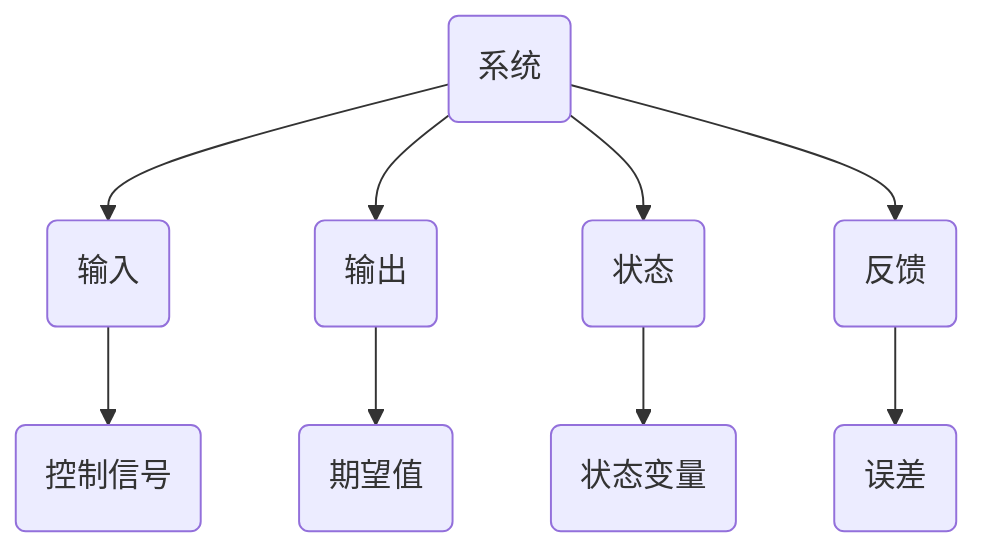
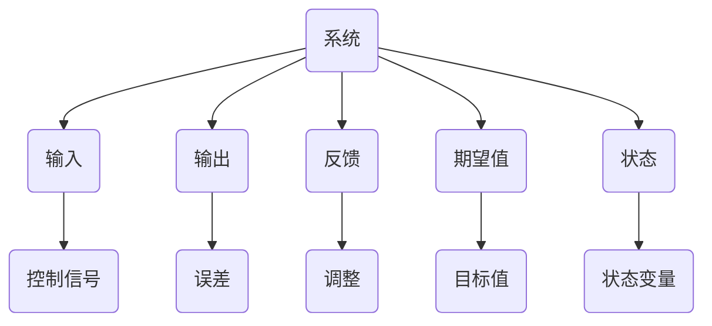
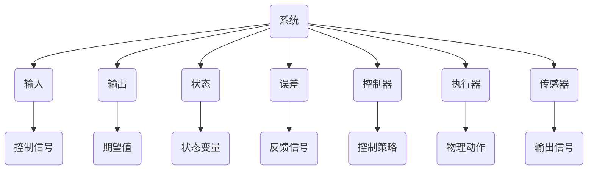
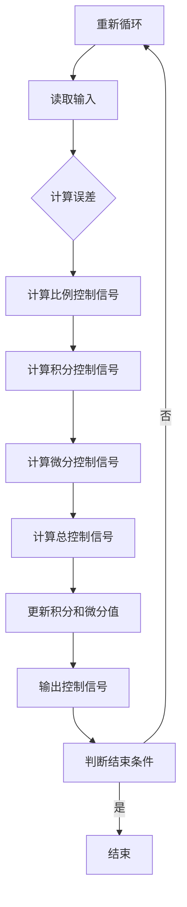
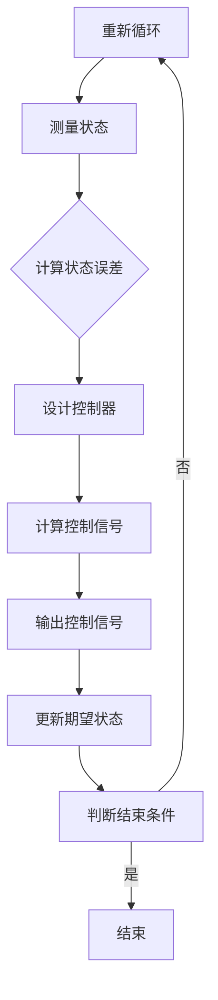
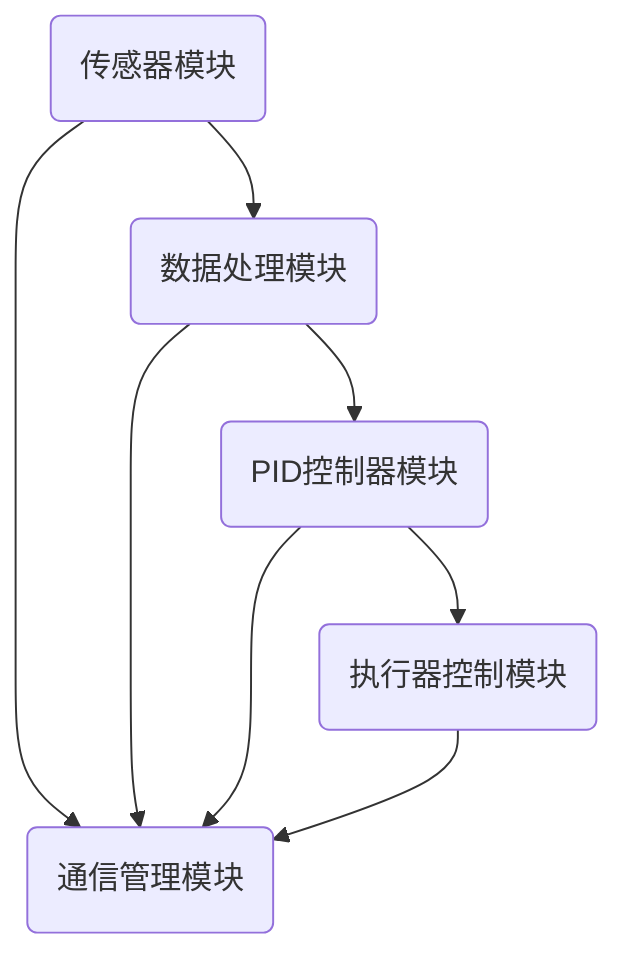
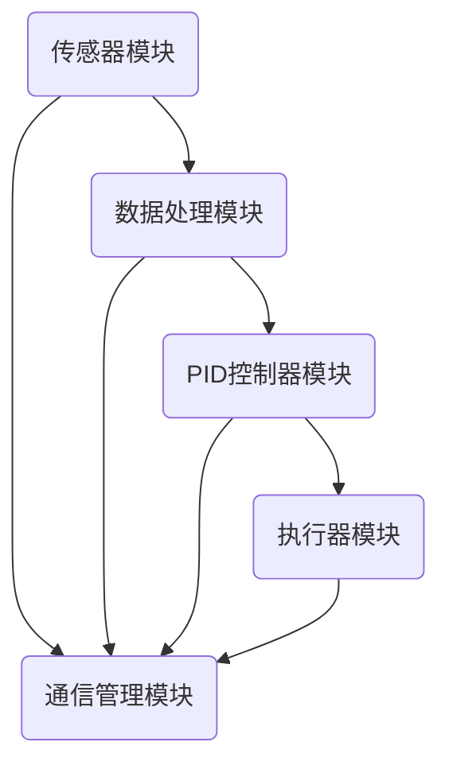

                 

### 目录结构规划

在撰写一篇关于《数学与控制论：反馈系统的数学描述》的技术博客文章时，我们首先要明确文章的目录结构。一个清晰、逻辑严密的目录结构是确保文章内容连贯性和读者易于理解的关键。以下是一个详细的目录结构规划，它包括各个主要部分以及相应的子章节，以便系统地展开讨论。

---

#### 第一部分：背景介绍

##### 1.1 问题背景
- **1.1.1 控制论的发展历程**
- **1.1.2 数学在控制论中的应用**
- **1.1.3 反馈系统的重要性**

##### 1.2 问题描述
- **1.2.1 控制系统的基本问题**
- **1.2.2 反馈系统的数学描述需求**

##### 1.3 问题解决
- **1.3.1 研究方法与路径**
- **1.3.2 研究目的与意义**

##### 1.4 边界与外延
- **1.4.1 研究范围的界定**
- **1.4.2 面临的挑战与限制**

##### 1.5 概念结构与核心要素组成
- **1.5.1 控制论的核心概念**
- **1.5.2 数学工具在反馈系统中的应用**

#### 第二部分：核心概念与联系

##### 2.1 控制系统的基本概念
- **2.1.1 系统的定义与分类**
- **2.1.2 控制系统的组成部分**
- **2.1.3 控制系统的性能指标**

##### 2.2 反馈系统的工作原理
- **2.2.1 反馈系统的定义**
- **2.2.2 反馈系统的工作机制**
- **2.2.3 反馈系统的优缺点**

##### 2.3 数学工具在控制论中的应用
- **2.3.1 数学模型在控制系统中的作用**
- **2.3.2 数学工具在分析反馈系统中的应用**
- **2.3.3 常用数学工具介绍**

##### 2.4 核心概念属性特征对比表格
- **2.4.1 控制论与数学的对比分析**

##### 2.5 ER实体关系图架构
- **2.5.1 实体关系图概述**
- **2.5.2 实体关系图绘制与解读**

#### 第三部分：算法原理讲解

##### 3.1 控制算法的基本原理
- **3.1.1 控制算法的定义**
- **3.1.2 控制算法的分类**
- **3.1.3 控制算法的优化目标**

##### 3.2 常见控制算法分析
- **3.2.1 PID控制算法**
- **3.2.2 状态反馈控制算法**

##### 3.3 算法mermaid流程图
- **3.3.1 PID控制算法流程图**
- **3.3.2 状态反馈控制算法流程图**

##### 3.4 Python源代码实现与详细阐述
- **3.4.1 PID控制算法代码实例**
- **3.4.2 状态反馈控制算法代码实例**

#### 第四部分：系统分析与架构设计

##### 4.1 问题场景介绍
- **4.1.1 应用场景描述**
- **4.1.2 需求分析**

##### 4.2 系统功能设计
- **4.2.1 领域模型设计**
- **4.2.2 功能模块划分**

##### 4.3 系统架构设计
- **4.3.1 架构设计原则**
- **4.3.2 架构图绘制与解读**

##### 4.4 系统接口设计
- **4.4.1 接口规范与定义**
- **4.4.2 接口调用流程**

##### 4.5 系统交互
- **4.5.1 交互流程图**
- **4.5.2 交互细节分析**

#### 第五部分：项目实战

##### 5.1 环境安装
- **5.1.1 环境搭建步骤**
- **5.1.2 环境配置说明**

##### 5.2 系统核心实现
- **5.2.1 核心代码实现**
- **5.2.2 关键技术点分析**

##### 5.3 代码应用解读与分析
- **5.3.1 代码结构与模块功能**
- **5.3.2 代码执行流程分析**

##### 5.4 实际案例分析与讲解
- **5.4.1 案例背景**
- **5.4.2 案例分析与解读**

##### 5.5 项目小结
- **5.5.1 项目成果总结**
- **5.5.2 项目经验与教训**

#### 第六部分：最佳实践与总结

##### 6.1 最佳实践 Tips
- **6.1.1 实践建议**
- **6.1.2 常见问题与解决方案**

##### 6.2 小结
- **6.2.1 文章总结**
- **6.2.2 主要观点回顾**

##### 6.3 注意事项
- **6.3.1 注意事项清单**
- **6.3.2 安全性与可靠性**

##### 6.4 拓展阅读
- **6.4.1 相关资源推荐**
- **6.4.2 进一步学习路径**

---

通过这个详细的目录结构，我们可以逐步深入地探讨数学与控制论中的反馈系统，确保每个章节都有明确的目标和充分的内容支撑，从而为读者提供一篇逻辑清晰、内容丰富、通俗易懂的技术博客文章。接下来，我们将根据这个目录结构，逐部分展开详细内容。在接下来的章节中，我们将逐步深入探讨每一个部分的主题，确保文章的内容丰富、结构清晰，并且对核心概念和算法原理进行深入讲解。

---

### 标题、关键词与摘要

**文章标题**：数学与控制论：反馈系统的数学描述

**关键词**：控制论、数学工具、反馈系统、数学模型、控制算法、PID控制、状态反馈控制

**摘要**：

本文旨在深入探讨数学与控制论在反馈系统中的应用，特别是在数学描述方面的重要性。文章首先介绍了控制论的发展历程和数学在控制论中的应用，然后详细解析了反馈系统的定义、工作原理和优缺点。通过对比表格和实体关系图，本文展示了数学工具在反馈系统分析中的关键作用。接着，文章详细讲解了控制算法的基本原理，包括PID控制和状态反馈控制，并通过mermaid流程图和Python代码示例，使读者更直观地理解算法的实现过程。此外，文章还通过系统分析与架构设计，对反馈系统的实际应用场景进行了全面剖析，并通过项目实战展示了系统的核心实现和实际应用。最后，本文提供了最佳实践技巧和小结，为读者提供了全面的指导和建议。整体上，本文力求在深度和广度上全面覆盖反馈系统的数学描述，为读者提供有价值的学术和实践参考。

---

### 文章第一部分：背景介绍

在开始深入探讨数学与控制论中反馈系统的数学描述之前，我们有必要先了解相关领域的背景信息。这部分内容将分为以下几个小节，分别介绍控制论的发展历程、数学在控制论中的应用、反馈系统的重要性，以及控制系统的基本问题和数学描述的需求。

#### 1.1 控制论的发展历程

控制论作为一门研究系统动态行为及其控制的科学，起源于20世纪中期，由美国数学家诺伯特·维纳（Norbert Wiener）提出。维纳在1948年出版的《控制论：或关于在动物和机器中控制和通信的科学》一书中，首次系统地阐述了控制论的基本概念和方法。此后，控制论得到了迅速发展，逐渐形成了多个分支，包括经典控制论、现代控制论、自适应控制、智能控制等。

经典控制论主要研究线性时不变系统，通过状态空间描述和传递函数分析系统特性。20世纪60年代，现代控制论的发展引入了线性系统理论、最优控制理论、随机控制理论等，使得控制论的研究更加深入和广泛。自适应控制和智能控制则将控制论与人工智能、计算机科学等前沿技术相结合，为解决复杂动态系统的控制问题提供了新的方法和思路。

#### 1.2 数学在控制论中的应用

数学在控制论中的应用是其发展的基础和重要支撑。控制论中的许多核心概念和理论都依赖于数学工具和方法。以下是数学在控制论中的一些主要应用：

1. **状态空间描述**：状态空间描述是一种将系统动态行为表示为时间序列的数学方法。通过建立状态方程和输出方程，可以清晰地描述系统的状态和输出变量之间的关系。

2. **传递函数**：传递函数是系统输入和输出之间的比率，通常用于分析线性时不变系统的特性。通过传递函数，可以计算系统的稳定性、极点分布、频率响应等。

3. **线性系统理论**：线性系统理论是研究线性时不变系统的数学工具，包括线性方程组、矩阵理论、线性变换等。这些理论为控制论提供了一种系统分析的基本框架。

4. **最优控制理论**：最优控制理论利用数学优化方法，寻求系统在特定约束下的最优控制策略。常见的优化方法包括拉格朗日乘数法、动态规划、卡尔曼滤波等。

5. **随机控制理论**：随机控制理论研究在随机环境下系统的最优控制策略。该方法考虑了系统的不确定性和随机扰动，为解决实际复杂问题提供了有力工具。

#### 1.3 反馈系统的重要性

反馈系统在控制论中占有核心地位，是控制系统实现稳定性和精确控制的关键。反馈系统通过将系统的输出与期望值进行比较，生成控制信号，调整系统的输入，以实现预期目标。以下是反馈系统的重要性：

1. **稳定性**：通过反馈机制，系统可以自动调整其状态，以抵抗外部扰动，保持系统的稳定性。这是许多实际应用中至关重要的特性。

2. **精确控制**：反馈系统可以根据输出与期望值之间的误差，不断调整控制信号，从而实现精确控制。这对于需要高精度控制的应用场景，如工业自动化、航空航天等具有重要意义。

3. **自适应能力**：反馈系统可以根据系统的实际运行状态，自适应地调整控制策略，从而适应不同的操作条件和环境变化。

4. **可观测性**：反馈系统提供了对系统内部状态的观察途径，通过分析输出信号，可以了解系统的状态和行为。

#### 1.4 控制系统的基本问题

控制系统的研究主要集中在以下三个基本问题上：

1. **系统建模**：建立系统的数学模型，包括状态方程、输出方程和输入方程。这是进行进一步分析和设计的基础。

2. **系统分析**：对建立的数学模型进行分析，研究系统的稳定性、响应特性和性能指标。常见的分析方法包括时域分析、频域分析和根轨迹分析等。

3. **系统设计**：基于系统分析的结果，设计控制器和补偿器，以实现系统的预期性能。设计过程通常涉及优化和控制算法的选择。

#### 1.5 反馈系统的数学描述需求

为了对反馈系统进行深入分析，建立准确的数学模型至关重要。以下是反馈系统数学描述的需求：

1. **状态变量选择**：选择合适的状态变量，以准确描述系统的内部状态。状态变量通常需要满足能观性和可控性的要求。

2. **输入和输出变量**：明确系统的输入和输出变量，以及它们之间的关系。输入变量通常是控制系统施加的扰动，输出变量是系统对外部环境的影响。

3. **数学模型的建立**：通过状态方程和输出方程建立系统的数学模型，以描述系统的动态行为。数学模型可以采用状态空间描述或传递函数描述。

4. **性能指标设定**：设定系统的性能指标，如稳定性、精度、响应速度等，以评估系统性能。

5. **误差分析**：分析系统误差，包括静态误差和动态误差，以优化控制策略。

通过上述背景介绍，我们可以更好地理解数学与控制论在反馈系统中的重要性，为后续章节的深入探讨打下坚实的基础。

### 1.6 反馈系统的数学描述需求

在控制论中，反馈系统的数学描述是其分析和设计的关键。为了准确地对反馈系统进行建模和分析，我们首先需要明确反馈系统的数学描述需求，这包括以下几个方面的内容：

#### 1.6.1 状态空间描述

状态空间描述是反馈系统建模的一种常用方法。它将系统动态行为表示为状态方程和输出方程。具体而言，状态空间描述包括以下三个主要部分：

1. **状态方程**：
   状态方程描述系统内部状态变量随时间变化的规律。通常形式为：
   $$
   \dot{x}(t) = A x(t) + B u(t)
   $$
   其中，\( x(t) \) 是状态向量，\( \dot{x}(t) \) 是状态向量的时间导数，\( A \) 是系统矩阵，\( B \) 是输入矩阵，\( u(t) \) 是系统输入。

2. **输出方程**：
   输出方程描述系统输出与状态变量之间的关系。通常形式为：
   $$
   y(t) = C x(t) + D u(t)
   $$
   其中，\( y(t) \) 是系统输出，\( C \) 是输出矩阵，\( D \) 是直接传递矩阵。

3. **初始条件**：
   初始条件描述系统在初始时刻的状态。通常形式为：
   $$
   x(0) = x_0
   $$
   其中，\( x_0 \) 是初始状态向量。

通过状态空间描述，我们可以将系统的动态行为以数学方程的形式进行表达，从而方便进行进一步的分析和设计。

#### 1.6.2 状态变量选择

状态变量是状态空间描述中的核心元素，选择合适的状态变量对于准确描述系统的动态行为至关重要。以下是选择状态变量时需要考虑的几个原则：

1. **能观性**：状态变量需要满足能观性条件，即通过系统输出可以唯一确定系统的状态。这通常意味着状态变量应包含系统的所有关键信息。

2. **可控性**：状态变量需要满足可控性条件，即通过适当选择输入，可以驱动系统状态达到任意指定状态。这有助于确保系统可以通过控制输入实现预期行为。

3. **简化性**：在满足能观性和可控性的基础上，选择的状态变量应尽可能简化，以便于系统的分析和设计。

常见的状态变量选择方法包括：

- **能量变量**：例如，在机械系统中，可以选择速度、加速度等能量相关的变量作为状态变量。
- **时间变量**：例如，在信号处理系统中，可以选择信号的相位、频率等时间相关的变量作为状态变量。
- **信号变量**：例如，在通信系统中，可以选择信号的强度、相位等信号相关的变量作为状态变量。

#### 1.6.3 数学模型的建立

建立反馈系统的数学模型需要结合系统的具体特性，通过状态方程、输出方程和初始条件，全面描述系统的动态行为。以下是建立数学模型的一般步骤：

1. **确定状态变量**：根据系统的特性和需求，选择合适的状态变量。

2. **建立状态方程**：通过系统的物理、化学或数学模型，建立状态方程。

3. **建立输出方程**：根据系统的输出变量和状态变量之间的关系，建立输出方程。

4. **确定初始条件**：根据系统的初始状态，设定初始条件。

5. **模型验证**：通过实验或仿真，验证所建立的数学模型是否符合系统的实际行为。

通过上述步骤，我们可以建立一个准确的反馈系统数学模型，为后续的控制系统分析和设计提供基础。

#### 1.6.4 性能指标设定

在建立反馈系统的数学模型后，设定合理的性能指标是评估系统性能的关键。以下是一些常见的性能指标：

1. **稳定性**：系统应具有稳定性，即系统状态不会发散，而是趋向某个平衡状态。

2. **精度**：系统输出应接近期望值，即系统具有高精度。

3. **响应速度**：系统在接收到输入信号后，应能快速响应，达到期望状态。

4. **鲁棒性**：系统应具有较强的鲁棒性，即能够抵抗外部扰动和模型不确定性。

设定性能指标需要结合具体应用场景和系统需求，以便全面评估系统的性能。

#### 1.6.5 误差分析

误差分析是反馈系统设计中的重要环节，它涉及到系统输出与期望值之间的差异。误差分析主要包括以下内容：

1. **静态误差**：系统在稳态条件下，输出与期望值之间的差异。

2. **动态误差**：系统在过渡过程中，输出与期望值之间的差异。

3. **误差调节**：通过调整控制策略，使误差趋于零或最小。

误差分析有助于优化控制策略，提高系统的性能。

通过上述对反馈系统数学描述需求的详细探讨，我们可以更好地理解反馈系统的数学建模过程，为后续的控制系统分析和设计打下坚实基础。

### 1.7 问题解决与研究方法

在明确了反馈系统的数学描述需求后，我们接下来需要探讨如何解决问题以及采用的研究方法。解决反馈系统数学描述问题通常涉及以下几个步骤：

#### 1.7.1 研究方法与路径

1. **理论研究**：
   - **数学建模**：通过建立系统的状态空间描述，输出方程和初始条件，准确描述系统的动态行为。
   - **理论分析**：利用线性系统理论、最优控制理论等数学工具，对系统进行稳定性分析、性能评估和误差分析。

2. **实验研究**：
   - **仿真验证**：通过仿真软件（如MATLAB、Simulink）模拟系统的动态行为，验证数学模型的准确性。
   - **实验验证**：在实际系统上进行实验，验证理论分析和仿真结果的可靠性。

3. **工程实践**：
   - **系统设计**：根据理论分析和实验结果，设计控制系统，选择合适的控制算法和参数。
   - **系统实现**：将设计好的控制系统应用于实际系统，进行调试和优化。

#### 1.7.2 研究目的与意义

1. **研究目的**：
   - **完善数学模型**：通过理论研究，完善反馈系统的数学模型，提高模型的准确性和通用性。
   - **提高系统性能**：通过实验研究和工程实践，优化控制系统设计，提高系统的稳定性、精度和响应速度。
   - **解决实际问题**：针对具体的应用场景，设计并实现高效的控制系统，解决实际问题。

2. **研究意义**：
   - **理论意义**：为控制论和系统理论提供新的理论支撑，丰富相关学科的研究内容。
   - **应用意义**：为工业自动化、航空航天、机器人控制等领域提供有效的控制方法和技术支持，提高系统的运行效率和安全性。

#### 1.7.3 边界与外延

1. **研究范围的界定**：
   - **系统类型**：研究主要针对线性时不变系统，同时考虑部分线性系统和非线性系统的建模与控制。
   - **应用场景**：研究涉及工业自动化、航空航天、机器人控制等典型应用场景。

2. **面临的挑战与限制**：
   - **模型准确性**：在实际应用中，系统往往存在不确定性和外界干扰，需要提高数学模型的准确性和适应性。
   - **计算复杂性**：复杂系统的数学建模和分析往往涉及高维计算，需要有效的算法优化和计算方法。
   - **工程实现**：控制系统在实际应用中需要考虑硬件、软件和系统集成等因素，需要解决实际工程问题。

通过上述问题解决与研究方法的探讨，我们可以系统地了解如何利用数学与控制论的方法，解决反馈系统的数学描述问题。这不仅为理论研究提供了新的思路，也为实际工程应用提供了有效的技术支持。

### 1.8 概念结构与核心要素组成

在深入探讨反馈系统的数学描述之前，我们需要明确控制论与数学在反馈系统中扮演的核心角色。以下是控制论的核心概念以及数学工具在反馈系统中的应用，通过对比表格和实体关系图，我们将更直观地了解这两个领域之间的联系和相互作用。

#### 1.8.1 控制论的核心概念

控制论是一门研究系统动态行为及其控制的科学。其核心概念包括系统、输入、输出、状态、反馈等。

1. **系统**：系统是由多个组件组成的整体，具有特定的功能和结构。在控制论中，系统通常被描述为一个动态过程，其状态和输出受输入的影响。

2. **输入**：输入是指施加在系统上的外部信号或变量，它是控制系统的驱动因素。输入可以是随机的、已知的或可预测的。

3. **输出**：输出是系统对输入的响应，它反映了系统的行为和状态。输出通常用于评估系统的性能。

4. **状态**：状态是系统在某一时刻的状态描述，通常用状态向量表示。状态包含了系统内部的所有关键信息，如位置、速度、温度等。

5. **反馈**：反馈是指将系统的输出与期望值进行比较，生成控制信号，以调整系统的输入。反馈机制是实现系统控制和稳定性的关键。

#### 1.8.2 数学工具在反馈系统中的应用

数学工具在控制论中发挥着至关重要的作用，它们被用来建立系统的数学模型、分析系统性能和设计控制器。以下是几种常用的数学工具：

1. **状态空间描述**：状态空间描述是一种将系统动态行为表示为状态方程和输出方程的数学方法。通过状态空间描述，我们可以用数学方程形式准确地描述系统的动态行为。

2. **传递函数**：传递函数是系统输入和输出之间的比率，用于分析线性时不变系统的特性。通过传递函数，我们可以计算系统的稳定性、极点分布、频率响应等。

3. **线性系统理论**：线性系统理论是研究线性时不变系统的数学工具，包括线性方程组、矩阵理论、线性变换等。这些理论为控制论提供了一种系统分析的基本框架。

4. **最优控制理论**：最优控制理论利用数学优化方法，寻求系统在特定约束下的最优控制策略。常见的优化方法包括拉格朗日乘数法、动态规划、卡尔曼滤波等。

5. **随机控制理论**：随机控制理论研究在随机环境下系统的最优控制策略。该方法考虑了系统的不确定性和随机扰动，为解决实际复杂问题提供了有力工具。

#### 1.8.3 核心概念属性特征对比表格

为了更直观地展示控制论与数学工具之间的联系，我们通过以下对比表格来分析核心概念：

| 核心概念 | 定义 | 数学描述 |
| :--: | :--: | :--: |
| 系统 | 由多个组件组成的整体 | 状态空间描述（\( x(t) \)） |
| 输入 | 施加在系统上的外部信号 | 输入向量（\( u(t) \)） |
| 输出 | 系统对输入的响应 | 输出向量（\( y(t) \)） |
| 状态 | 系统在某一时刻的状态描述 | 状态向量（\( \dot{x}(t) \)） |
| 反馈 | 将系统的输出与期望值进行比较，生成控制信号 | 输出方程（\( y(t) \)） |
| 数学工具 | 用于建立系统和分析系统性能的工具 | 状态方程（\( \dot{x}(t) = A x(t) + B u(t) \)） |

通过这个对比表格，我们可以清晰地看到控制论的核心概念和数学工具之间的关系，以及它们如何相互作用，共同实现对反馈系统的数学描述。

#### 1.8.4 ER实体关系图架构

为了更直观地理解控制论中的实体及其关系，我们通过ER（实体-关系）图来展示反馈系统的核心实体及其交互关系。



在这个ER图中，系统是核心实体，它与其他实体（输入、输出、状态、反馈）之间存在直接的关联。输入和输出分别代表了系统的驱动因素和响应结果，状态和反馈则描述了系统内部的状态变化和控制机制。通过这个ER图，我们可以清晰地理解反馈系统中各个实体的交互关系，从而更好地进行数学描述。

通过上述对控制论的核心概念、数学工具及其在反馈系统中的应用的详细分析，以及对比表格和ER图的支持，我们为后续章节的深入探讨奠定了坚实的理论基础。

### 第二部分：核心概念与联系

在了解了反馈系统的数学描述需求后，我们需要进一步探讨核心概念之间的联系，这对于深入理解控制论和反馈系统至关重要。以下是关于控制系统基本概念、反馈系统的工作原理以及数学工具在控制论中的应用的详细探讨。

#### 2.1 控制系统的基本概念

控制系统是由输入、输出、反馈和系统本体组成的复杂系统。其主要功能是通过接收外部输入，产生期望的输出，并对系统状态进行实时调整，以实现特定目标。

1. **系统**：系统是控制系统的核心部分，由多个组件组成，用于执行特定的功能。在控制系统中，系统可以是一个机械装置、一个电子电路、一个软件程序等。

2. **输入**：输入是施加在系统上的外部信号或变量，它决定了系统的行为。输入可以是已知的、可预测的或者随机的。

3. **输出**：输出是系统的响应，反映了系统的行为和状态。输出通常用于评估系统的性能，并与期望值进行比较，以生成反馈信号。

4. **反馈**：反馈是将系统的输出与期望值进行比较，生成控制信号，以调整系统输入的机制。反馈机制是控制系统实现稳定性和精确控制的关键。

5. **期望值**：期望值是系统期望达到的目标状态或输出值。它是通过系统设计者或用户设定的，用于与实际输出进行比较，以评估系统性能。

#### 2.2 反馈系统的工作原理

反馈系统通过将输出与期望值进行比较，生成控制信号，以调整系统输入，从而实现期望的输出和状态。以下是反馈系统的工作原理：

1. **误差计算**：通过比较输出和期望值，计算误差信号。误差信号是输出与期望值之间的差异，它是调整系统输入的依据。

2. **控制器**：控制器是反馈系统的核心部分，它根据误差信号生成控制信号。控制信号用于调整系统输入，以减少误差。

3. **执行器**：执行器是控制系统的执行部分，它根据控制信号调整系统的输入。执行器可以是机械装置、电子设备或软件程序等。

4. **系统调整**：通过控制信号对系统输入进行调整，使系统的输出逐渐接近期望值。这个过程是持续进行的，以确保系统始终处于稳定状态。

5. **稳定性**：稳定性是反馈系统的关键特性。通过适当的控制器设计和参数调整，可以使系统在受到外界扰动时保持稳定，并迅速恢复到期望状态。

#### 2.3 数学工具在控制论中的应用

数学工具在控制论中发挥着至关重要的作用，它们用于建立系统的数学模型、分析系统性能和设计控制器。以下是几种常用的数学工具：

1. **状态空间描述**：状态空间描述是一种将系统动态行为表示为状态方程和输出方程的数学方法。通过状态空间描述，可以准确描述系统的动态行为，并进行系统分析。

2. **传递函数**：传递函数是系统输入和输出之间的比率，用于分析线性时不变系统的特性。通过传递函数，可以计算系统的稳定性、极点分布、频率响应等。

3. **线性系统理论**：线性系统理论是研究线性时不变系统的数学工具，包括线性方程组、矩阵理论、线性变换等。这些理论为控制论提供了一种系统分析的基本框架。

4. **最优控制理论**：最优控制理论利用数学优化方法，寻求系统在特定约束下的最优控制策略。常见的优化方法包括拉格朗日乘数法、动态规划、卡尔曼滤波等。

5. **随机控制理论**：随机控制理论研究在随机环境下系统的最优控制策略。该方法考虑了系统的不确定性和随机扰动，为解决实际复杂问题提供了有力工具。

通过上述对控制系统基本概念、反馈系统的工作原理以及数学工具在控制论中的应用的详细探讨，我们可以更深入地理解控制论的核心概念，并为后续的反馈系统数学描述打下坚实的基础。

### 2.4 核心概念属性特征对比表格

为了更直观地展示控制论中的核心概念及其属性特征，我们通过以下对比表格进行分析：

| 核心概念 | 定义 | 属性特征 |
| :--: | :--: | :--: |
| 系统 | 控制系统的整体，由多个组件组成 | 功能性、结构性 |
| 输入 | 施加在系统上的外部信号 | 确定性、随机性 |
| 输出 | 系统对输入的响应 | 稳定性、响应速度 |
| 反馈 | 将输出与期望值进行比较，生成控制信号 | 自适应性、稳定性 |
| 期望值 | 系统期望达到的目标值 | 精确性、可调性 |
| 状态 | 系统在某一时刻的状态描述 | 能观性、可控性 |
| 数学工具 | 用于建立和描述系统行为的工具 | 状态空间描述、传递函数、线性系统理论等 |

通过这个对比表格，我们可以清晰地看到各个核心概念之间的联系及其在控制系统中扮演的角色。例如，系统是控制系统的核心，而输入、输出、反馈和期望值是系统动态行为的驱动因素和响应结果。状态作为系统的内部描述，是分析系统行为的重要依据。数学工具则为系统的建立和分析提供了理论基础。

#### 2.5 ER实体关系图架构

为了进一步理解控制论中的实体及其关系，我们通过ER（实体-关系）图来展示核心实体及其交互关系。



在这个ER图中，系统是核心实体，它与其他实体（输入、输出、反馈、期望值、状态）之间存在直接的关联。输入和输出分别代表了系统的驱动因素和响应结果，反馈通过误差计算和控制信号调整实现了系统的动态调整。期望值和状态则描述了系统的目标状态和当前状态。

通过对比表格和ER图，我们可以更直观地理解控制论中的核心概念及其属性特征，以及它们之间的相互作用。这为后续的反馈系统数学描述提供了坚实的理论基础。

### 2.6 控制系统的基本概念

控制系统是工程领域中广泛应用的系统，它通过输入、输出、反馈和系统本体等基本组件，实现特定的控制目标。为了深入理解控制系统的基本概念，我们需要首先明确几个核心概念，包括系统、输入、输出、状态和反馈。

#### 2.6.1 系统的定义与分类

**系统**是一个具有明确功能的整体，由多个相互关联的组件组成。在控制系统中，系统通常由硬件、软件或两者的结合构成，其目的是根据输入信号产生期望的输出信号。根据系统的工作方式和特性，控制系统可以分类为以下几种类型：

1. **开环控制系统**：开环控制系统不使用反馈信号进行校正，输出仅由输入决定。这种系统简单，但无法对扰动或误差进行校正，稳定性较差。

2. **闭环控制系统**：闭环控制系统使用反馈信号来校正输出，使其更接近期望值。通过比较实际输出和期望输出，系统可以自动调整输入，提高控制精度和稳定性。

3. **自适应控制系统**：自适应控制系统可以根据系统的实际运行情况自动调整参数，以适应环境变化和不确定性。这种系统具有更高的鲁棒性和适应性。

4. **分布式控制系统**：分布式控制系统通过多个子系统和控制器协同工作，实现对复杂系统的控制。这种系统在工业自动化、航空航天等领域中广泛应用。

#### 2.6.2 控制系统的组成部分

一个典型的控制系统通常包括以下几个关键组成部分：

1. **控制器**：控制器是系统的核心组件，根据输入信号和反馈信号，生成控制信号以调整系统输入，实现期望的输出。控制器可以采用不同的算法，如PID控制、模糊控制等。

2. **执行器**：执行器接收控制信号，根据控制指令执行相应的动作，如电动机、加热器等。执行器将控制信号转换为物理动作，实现系统的实际控制。

3. **传感器**：传感器用于检测系统的实际输出，并将其转换为信号输入控制器。传感器可以检测温度、压力、速度等参数，为控制器的决策提供依据。

4. **被控对象**：被控对象是控制系统的核心部分，它是一个具有特定功能的物理系统，如加热炉、飞机等。被控对象的行为受到控制信号的影响，并产生实际输出。

5. **反馈信号**：反馈信号是系统输出与期望值之间的差异，它用于校正系统的输入。通过反馈信号，系统可以自动调整其行为，使其更接近期望值。

#### 2.6.3 控制系统的性能指标

控制系统的性能指标是评估系统性能的重要标准。以下是几个常见的性能指标：

1. **稳定性**：系统在受到外部扰动或内部变化时，能够保持稳定状态，不发生振荡或失控。

2. **精度**：系统输出与期望值之间的误差，精度越高，输出越接近期望值。

3. **响应速度**：系统从接收到输入信号到达到期望输出所需的时间，响应速度越快，系统越灵敏。

4. **鲁棒性**：系统对不确定性和外部干扰的抵抗能力，鲁棒性越强，系统在恶劣条件下仍能保持稳定和精确控制。

5. **自适应能力**：系统能够根据环境变化和需求自动调整参数，以实现更好的控制效果。

通过详细探讨控制系统的基本概念，包括系统的定义与分类、组成部分和性能指标，我们可以更好地理解控制系统的设计和工作原理，为后续的反馈系统数学描述和控制系统设计提供理论基础。

### 2.7 反馈系统的工作原理

反馈系统是控制系统中的一个核心组成部分，它通过将系统的输出与期望值进行比较，生成控制信号以调整系统输入，实现期望的输出和状态。以下是对反馈系统工作原理的详细探讨，包括其定义、工作机制以及优缺点。

#### 2.7.1 反馈系统的定义

反馈系统是一种通过将系统的输出（实际值）与期望值（目标值）进行比较，生成误差信号，并通过控制器调整系统输入，以实现期望输出和状态的控制机制。简而言之，反馈系统通过闭环控制，对系统的行为进行实时校正和优化。

#### 2.7.2 反馈系统的工作机制

1. **误差计算**：
   反馈系统的第一步是计算误差。误差是系统实际输出（\( y(t) \)）与期望输出（\( y_{\text{d}}(t) \)）之间的差异。误差信号通常表示为：
   $$
   e(t) = y_{\text{d}}(t) - y(t)
   $$

2. **控制器**：
   控制器接收误差信号，根据预设的控制策略（如PID控制）生成控制信号（\( u(t) \)）。控制器的目标是使误差趋于零，从而使实际输出接近期望输出。

3. **执行器**：
   执行器根据控制信号调整系统的输入（如电动机的旋转速度、加热器的功率等）。执行器的动作直接影响系统的行为，使其状态逐步接近期望值。

4. **系统更新**：
   系统不断更新其实际输出和期望值，重复误差计算、控制器调整和执行器动作的过程，实现闭环控制。

#### 2.7.3 反馈系统的优缺点

**优点**：

1. **稳定性**：通过闭环控制，反馈系统能够自动调整输入，抵抗外部扰动，保持系统稳定。

2. **精确控制**：通过误差反馈机制，反馈系统能够持续调整输入，使输出接近期望值，实现高精度控制。

3. **自适应能力**：反馈系统可以根据实际输出与期望值之间的误差，自适应地调整控制策略，适应不同的操作条件和环境变化。

4. **可观测性**：反馈系统提供了对系统内部状态的观察途径，通过分析输出信号，可以了解系统的状态和行为。

**缺点**：

1. **复杂度**：反馈系统通常比开环系统更复杂，需要更多的传感器、控制器和执行器，设计和实现难度较高。

2. **延迟**：反馈系统的响应速度可能受到延迟的影响，特别是在高速动态环境中，反馈系统的响应速度可能无法满足要求。

3. **模型依赖性**：反馈系统的性能很大程度上依赖于数学模型的准确性和完整性，如果模型不准确或存在较大误差，系统的性能也会受到影响。

通过上述对反馈系统工作原理的详细探讨，我们可以更好地理解其定义、工作机制以及优缺点。这为后续的反馈系统数学描述和实际应用提供了重要的理论基础。

### 2.8 数学工具在控制论中的应用

数学工具在控制论中扮演着至关重要的角色，它们为控制系统的建模、分析和设计提供了坚实的理论基础。以下是几种常用的数学工具及其在控制论中的应用：

#### 2.8.1 状态空间描述

状态空间描述是控制论中最基本和最常用的数学工具之一。它将系统的动态行为表示为一组差分方程或微分方程，使得系统的状态和输出可以用矩阵形式表达。状态空间描述包括以下三个主要部分：

1. **状态方程**：
   状态方程描述系统内部状态变量随时间的变化规律。其一般形式为：
   $$
   \dot{x}(t) = A x(t) + B u(t)
   $$
   其中，\( x(t) \) 是状态向量，\( \dot{x}(t) \) 是状态向量的时间导数，\( A \) 是系统矩阵，\( B \) 是输入矩阵，\( u(t) \) 是系统输入。

2. **输出方程**：
   输出方程描述系统输出与状态变量之间的关系。其一般形式为：
   $$
   y(t) = C x(t) + D u(t)
   $$
   其中，\( y(t) \) 是系统输出，\( C \) 是输出矩阵，\( D \) 是直接传递矩阵，\( u(t) \) 是系统输入。

3. **初始条件**：
   初始条件描述系统在初始时刻的状态。其一般形式为：
   $$
   x(0) = x_0
   $$
   其中，\( x_0 \) 是初始状态向量。

状态空间描述的优点在于其灵活性和通用性，可以处理线性时不变系统、线性时变系统以及非线性系统。通过状态空间描述，我们可以对系统的动态行为进行全面的数学描述和分析。

#### 2.8.2 传递函数

传递函数是另一个重要的数学工具，它描述了系统输入和输出之间的传递关系。对于线性时不变系统，传递函数是系统输入和输出之间比率的拉普拉斯变换。传递函数的一般形式为：
$$
G(s) = \frac{Y(s)}{U(s)}
$$
其中，\( G(s) \) 是传递函数，\( Y(s) \) 是系统输出的拉普拉斯变换，\( U(s) \) 是系统输入的拉普拉斯变换。

传递函数的优点在于其直观性和简洁性，可以方便地进行系统分析，如稳定性分析、极点分布、频率响应等。通过传递函数，我们可以快速了解系统的动态特性和响应特性。

#### 2.8.3 线性系统理论

线性系统理论是研究线性时不变系统的数学工具，它包括线性方程组、矩阵理论、线性变换等内容。线性系统理论提供了对线性系统的全面分析框架，包括：

1. **矩阵方程的求解**：通过矩阵运算，可以求解线性系统的状态响应和输出响应。
2. **线性变换**：通过线性变换，可以将系统从一种表示形式转换为另一种形式，如状态空间描述转换为传递函数。
3. **根轨迹分析**：根轨迹分析用于研究系统参数变化时，系统极点在复平面的分布情况，可以直观地了解系统的稳定性。

线性系统理论在控制论中具有广泛的应用，如系统稳定性分析、性能优化、控制器设计等。

#### 2.8.4 最优控制理论

最优控制理论利用数学优化方法，寻求系统在特定约束下的最优控制策略。最优控制问题通常可以用以下数学模型表示：
$$
\min J = \int_{0}^{T} f(x(t), u(t), t) dt + g(x(T))
$$
其中，\( J \) 是性能指标，\( f \) 是状态和控制变量，\( g \) 是终态变量，\( T \) 是优化时间。

最优控制理论提供了多种求解方法，如拉格朗日乘数法、动态规划、卡尔曼滤波等。这些方法可以用于设计具有最优性能的控制器，使系统在约束条件下达到最佳性能。

#### 2.8.5 随机控制理论

随机控制理论研究在随机环境下系统的最优控制策略。该方法考虑了系统的不确定性和随机扰动，为解决实际复杂问题提供了有力工具。随机控制理论的主要内容包括：

1. **随机过程建模**：通过建立随机过程的数学模型，描述系统的不确定性和扰动。
2. **最优控制策略**：通过优化方法，设计能够应对不确定性和随机扰动的最优控制策略。
3. **鲁棒控制**：通过引入鲁棒性设计，使系统对不确定性和扰动具有较强的抵抗能力。

随机控制理论在航空航天、金融工程、生物控制等领域具有广泛的应用。

通过上述对几种常用数学工具的介绍，我们可以看到数学在控制论中的应用非常广泛，这些工具为控制系统的建模、分析和设计提供了强大的理论基础。在接下来的章节中，我们将进一步探讨这些数学工具在反馈系统中的应用，以及如何通过这些工具实现有效的控制系统设计。

### 2.9 常用数学工具介绍

在控制论中，为了对系统进行精确的建模和分析，我们通常会使用一系列数学工具。以下是对这些常用数学工具的详细介绍，包括其在反馈系统分析中的应用。

#### 2.9.1 状态空间描述

状态空间描述是一种用于描述动态系统行为的数学方法，它将系统的内部状态、输入、输出以及初始条件用一组差分方程或微分方程表示。状态空间描述的核心包括状态方程和输出方程。

1. **状态方程**：
   状态方程描述系统内部状态变量随时间的变化。其一般形式为：
   $$
   \dot{x}(t) = A x(t) + B u(t)
   $$
   其中，\( x(t) \) 是状态向量，\( \dot{x}(t) \) 是状态向量的一阶导数，\( A \) 是系统矩阵，\( B \) 是输入矩阵，\( u(t) \) 是输入向量。

2. **输出方程**：
   输出方程描述系统输出与状态变量之间的关系。其一般形式为：
   $$
   y(t) = C x(t) + D u(t)
   $$
   其中，\( y(t) \) 是输出向量，\( C \) 是输出矩阵，\( D \) 是直接传递矩阵，\( u(t) \) 是输入向量。

通过状态空间描述，我们可以全面、精确地描述系统的动态行为，并进行各种分析，如稳定性分析、响应分析、性能优化等。

#### 2.9.2 传递函数

传递函数是系统输入与输出之间关系的拉普拉斯变换。对于线性时不变系统，传递函数描述了输入和输出之间的传递特性。传递函数的一般形式为：
$$
G(s) = \frac{Y(s)}{U(s)}
$$
其中，\( G(s) \) 是传递函数，\( Y(s) \) 是系统输出的拉普拉斯变换，\( U(s) \) 是系统输入的拉普拉斯变换。

传递函数的优点在于其简洁性和直观性，通过它，我们可以方便地分析系统的稳定性、极点分布、频率响应等特性。

#### 2.9.3 线性系统理论

线性系统理论是研究线性时不变系统的数学工具，它包括线性方程组、矩阵理论、线性变换等内容。线性系统理论的核心在于如何通过矩阵运算和线性变换，对系统进行全面的描述和分析。

1. **矩阵方程的求解**：
   通过解线性矩阵方程，我们可以得到系统的状态响应和输出响应。常见的矩阵方程求解方法包括高斯消元法、LU分解、奇异值分解等。

2. **线性变换**：
   通过线性变换，我们可以将系统的状态空间描述转换为传递函数，从而简化系统的分析过程。常见的线性变换包括拉普拉斯变换、傅里叶变换等。

3. **根轨迹分析**：
   根轨迹分析是一种用于研究系统稳定性直观方法。通过绘制根轨迹图，我们可以了解系统参数变化时，极点在复平面的分布情况，从而判断系统的稳定性。

#### 2.9.4 最优控制理论

最优控制理论利用数学优化方法，寻求系统在特定约束下的最优控制策略。最优控制问题通常可以用以下数学模型表示：
$$
\min J = \int_{0}^{T} f(x(t), u(t), t) dt + g(x(T))
$$
其中，\( J \) 是性能指标，\( f \) 是状态和控制变量的函数，\( g \) 是终态变量的函数，\( T \) 是优化时间。

1. **动态规划**：
   动态规划是一种基于递推关系求解最优控制策略的方法。通过递归地求解各时间点的最优控制问题，可以得到整个系统的最优控制策略。

2. **拉格朗日乘数法**：
   拉格朗日乘数法是一种利用拉格朗日函数求解最优控制问题的方法。通过引入拉格朗日乘子，可以将最优控制问题转化为无约束优化问题，从而求解最优控制策略。

3. **卡尔曼滤波**：
   卡尔曼滤波是一种用于估计系统状态的最优估计方法。通过最小化估计误差的方差，卡尔曼滤波可以给出系统状态的最优估计值。

#### 2.9.5 随机控制理论

随机控制理论研究在随机环境下系统的最优控制策略。该方法考虑了系统的不确定性和随机扰动，为解决实际复杂问题提供了有力工具。

1. **随机过程建模**：
   通过建立随机过程的数学模型，我们可以描述系统的不确定性和扰动。常见的随机过程包括马尔可夫链、Wiener过程等。

2. **最优控制策略**：
   通过优化方法，设计能够应对不确定性和随机扰动的最优控制策略。常见的方法包括马尔可夫决策过程、随机动态规划等。

3. **鲁棒控制**：
   鲁棒控制通过引入鲁棒性设计，使系统对不确定性和扰动具有较强的抵抗能力。常见的方法包括H∞控制、滑动模式控制等。

通过上述对常用数学工具的详细介绍，我们可以看到这些工具在控制论中的应用非常广泛，它们为我们提供了强大的工具来分析和设计复杂的控制系统。在接下来的章节中，我们将进一步探讨这些数学工具在反馈系统分析中的应用，并展示如何通过这些工具实现有效的反馈系统设计。

### 2.10 核心概念属性特征对比表格

为了更清晰地展示控制论中核心概念及其属性特征，我们通过以下对比表格进行分析：

| 核心概念 | 定义 | 属性特征 |
| :--: | :--: | :--: |
| 状态空间描述 | 系统动态行为的数学描述方法 | 状态向量、系统矩阵、输入矩阵等 |
| 传递函数 | 系统输入与输出之间的传递关系 | 稳定性、极点分布、频率响应等 |
| 线性系统理论 | 研究线性时不变系统的数学工具 | 矩阵方程、线性变换、根轨迹分析等 |
| 最优控制理论 | 寻求系统在特定约束下的最优控制策略 | 性能指标、动态规划、拉格朗日乘数法等 |
| 随机控制理论 | 研究在随机环境下系统的最优控制策略 | 随机过程建模、鲁棒控制、马尔可夫决策过程等 |

通过这个对比表格，我们可以清晰地看到各个核心概念的定义及其独特的属性特征。例如，状态空间描述提供了系统内部状态的详细数学描述，传递函数则揭示了系统输入和输出之间的动态关系。线性系统理论通过矩阵运算和线性变换，为系统分析和设计提供了基本工具。最优控制理论和随机控制理论则分别从不同角度，寻求系统的最优控制策略和应对随机扰动的方法。

#### 2.11 ER实体关系图架构

为了更直观地展示控制论中各个实体的交互关系，我们通过以下ER（实体-关系）图来描述核心实体及其关联：



在这个ER图中，系统是核心实体，它与其他实体（输入、输出、状态、误差、控制器、执行器、传感器）之间存在直接的关联。输入和输出分别代表了系统的驱动因素和响应结果，状态和误差是系统内部状态的描述和调整依据。控制器和执行器则是实现系统调整的关键组件，传感器用于检测系统的输出，为控制器的决策提供数据支持。通过这个ER图，我们可以清晰地理解各个实体之间的相互作用，以及它们在控制系统中的作用和关系。

通过对比表格和ER图的详细分析，我们可以更深入地理解控制论中的核心概念及其属性特征，以及它们在反馈系统中的应用和作用。这为后续的反馈系统数学描述和控制系统设计提供了坚实的理论基础。

### 3.1 控制算法的基本原理

控制算法是控制系统设计中的核心部分，它用于根据系统的状态和输入，生成相应的控制信号，以实现对系统输出的精确控制。控制算法的基本原理涉及对系统动态行为的分析和优化，通过一系列数学模型和计算方法，实现对系统输入的调整，以达到预期的控制目标。以下是控制算法的基本原理及其在反馈系统中的应用。

#### 3.1.1 控制算法的定义

控制算法是一种数学模型或计算方法，用于根据系统的状态和输入，生成控制信号，以实现对系统输出的精确控制。控制算法可以分为两大类：开环控制算法和闭环控制算法。

1. **开环控制算法**：开环控制算法不使用反馈信号，直接根据输入信号生成控制信号，以驱动系统执行相应的操作。这类算法简单，但无法对系统输出进行实时校正，因此在面对外部扰动时，系统的稳定性和精度较差。

2. **闭环控制算法**：闭环控制算法使用反馈信号，通过比较实际输出与期望输出，生成误差信号，并根据误差信号调整控制信号，实现对系统输出的精确控制。闭环控制算法能够有效地抵抗外部扰动，提高系统的稳定性和精度。

#### 3.1.2 控制算法的分类

控制算法根据其原理和实现方法，可以分为多种类型。以下是一些常见的控制算法：

1. **PID控制算法**：PID控制算法是一种基于比例、积分和微分原理的控制算法，通过调整比例、积分和微分的系数，实现对系统输出的精确控制。PID控制算法广泛应用于工业过程控制、机器人控制等领域。

2. **状态反馈控制算法**：状态反馈控制算法通过测量系统的状态变量，生成状态反馈信号，并根据状态反馈信号设计控制器，实现对系统输出的精确控制。状态反馈控制算法适用于线性系统，特别是在状态可测的情况下。

3. **自适应控制算法**：自适应控制算法能够根据系统的实际运行状态，自动调整控制参数，以适应系统的不确定性和变化。常见的自适应控制算法包括模型参考自适应控制、自调节控制等。

4. **模糊控制算法**：模糊控制算法利用模糊逻辑和模糊规则，实现对系统输出的控制。模糊控制算法适用于非线性系统，特别是在控制规则难以用数学模型描述的情况下。

5. **神经网络控制算法**：神经网络控制算法利用神经网络的自适应和泛化能力，实现对系统输出的控制。神经网络控制算法适用于复杂的非线性系统，特别是在传统控制方法难以实现精确控制的情况下。

#### 3.1.3 控制算法的优化目标

控制算法的优化目标是实现系统的稳定性、精确性和响应速度。以下是几个常见的优化目标：

1. **稳定性**：控制算法应确保系统在受到外部扰动时，能够保持稳定状态，不发生振荡或失控。

2. **精度**：控制算法应使系统输出接近期望输出，减小输出与期望值之间的误差。

3. **响应速度**：控制算法应使系统能够迅速响应输入变化，达到期望状态，提高系统的动态性能。

4. **鲁棒性**：控制算法应具有较强的鲁棒性，能够抵抗外部扰动和系统不确定性，保持稳定和精确控制。

5. **自适应能力**：控制算法应具有自适应能力，能够根据系统的实际运行状态，自动调整控制参数，适应不同的操作条件和环境变化。

通过上述对控制算法基本原理的探讨，我们可以看到控制算法在控制系统设计中的重要性。控制算法的选择和设计直接影响到系统的性能和稳定性。在实际应用中，需要根据系统的具体特性和需求，选择合适的控制算法，并对其进行优化和调整，以实现最佳控制效果。

### 3.2 常见控制算法分析

在控制系统设计中，选择合适的控制算法是实现系统性能优化和稳定性的关键。常见的控制算法包括PID控制算法和状态反馈控制算法。以下是这两种算法的基本原理、具体实现方法以及在反馈系统中的应用。

#### 3.2.1 PID控制算法

**PID控制算法的基本原理**：

PID控制算法是一种基于比例、积分和微分原理的控制算法。其核心思想是通过调整比例（P）、积分（I）和微分（D）三个参数，实现对系统输出的精确控制。

1. **比例控制（P）**：
   比例控制是根据当前误差值（e(t)）生成控制信号，其公式为：
   $$
   u_p(t) = K_p e(t)
   $$
   其中，\( K_p \) 是比例系数，用于调整控制信号的强度。

2. **积分控制（I）**：
   积分控制是根据误差值的积分生成控制信号，其公式为：
   $$
   u_i(t) = K_i \int e(t) dt
   $$
   其中，\( K_i \) 是积分系数，用于消除静态误差。

3. **微分控制（D）**：
   微分控制是根据误差值的变化率生成控制信号，其公式为：
   $$
   u_d(t) = K_d \dot{e}(t)
   $$
   其中，\( K_d \) 是微分系数，用于提高系统的动态响应性能。

PID控制算法的具体实现方法如下：

1. **初始化**：
   初始化误差值（e(t)）、积分值（\( \int e(t) dt \)）和微分值（\( \dot{e}(t) \)）。

2. **计算误差**：
   计算当前时刻的误差值 \( e(t) = y_d(t) - y(t) \)，其中 \( y_d(t) \) 是期望输出，\( y(t) \) 是实际输出。

3. **计算控制信号**：
   根据PID控制公式，计算当前时刻的控制信号：
   $$
   u(t) = u_p(t) + u_i(t) + u_d(t)
   $$

4. **更新积分和微分值**：
   根据新的误差值，更新积分值和微分值。

**PID控制算法在反馈系统中的应用**：

PID控制算法广泛应用于工业自动化、机器人控制、汽车控制等领域。其优点在于实现简单、适用范围广，可以通过调整三个参数实现对系统输出的精确控制。以下是一个PID控制算法在反馈系统中的应用实例：

- **应用场景**：工业自动化生产线中的温度控制。
- **系统描述**：系统由加热器、传感器和控制器组成，通过测量实际温度与设定温度之间的误差，生成控制信号调整加热器的功率，实现温度的精确控制。
- **控制目标**：使实际温度迅速、稳定地达到设定温度。

#### 3.2.2 状态反馈控制算法

**状态反馈控制算法的基本原理**：

状态反馈控制算法通过测量系统的状态变量，生成状态反馈信号，并根据状态反馈信号设计控制器，实现对系统输出的精确控制。其基本原理包括以下几个步骤：

1. **状态观测器**：
   状态观测器用于估计系统的状态变量。通过测量系统的输出和输入，状态观测器可以计算系统的状态估计值。

2. **状态反馈控制器**：
   根据状态估计值和期望状态，设计状态反馈控制器。控制器输出控制信号，调整系统的输入，使实际状态逐渐接近期望状态。

状态反馈控制算法的具体实现方法如下：

1. **初始化**：
   初始化状态估计值和期望状态。

2. **状态观测**：
   通过状态观测器计算状态估计值。

3. **计算误差**：
   计算当前时刻的状态误差 \( e(t) = x_d(t) - x(t) \)，其中 \( x_d(t) \) 是期望状态，\( x(t) \) 是实际状态估计值。

4. **计算控制信号**：
   根据状态反馈控制器的设计，计算当前时刻的控制信号。

5. **更新期望状态**：
   根据新的状态误差，更新期望状态。

**状态反馈控制算法在反馈系统中的应用**：

状态反馈控制算法适用于线性时不变系统，特别是在状态可测的情况下。以下是一个状态反馈控制算法在反馈系统中的应用实例：

- **应用场景**：无人机的飞行控制。
- **系统描述**：无人机系统由陀螺仪、加速度计和控制器组成，通过测量无人机的角速度、加速度等状态变量，生成控制信号调整无人机的姿态和速度，实现稳定的飞行。
- **控制目标**：保持无人机的飞行轨迹和姿态稳定。

#### 3.2.3 PID控制算法与状态反馈控制算法的对比

PID控制算法和状态反馈控制算法都是常见的控制算法，它们各自具有不同的特点和适用范围。以下是两种算法的对比：

1. **实现复杂度**：
   - **PID控制算法**：实现简单，易于理解和调试。
   - **状态反馈控制算法**：实现相对复杂，需要设计状态观测器和控制器。

2. **适用范围**：
   - **PID控制算法**：适用于非线性系统、参数不确定系统以及状态不可测系统。
   - **状态反馈控制算法**：适用于线性时不变系统，特别是状态可测的情况。

3. **控制效果**：
   - **PID控制算法**：通过调整三个参数（比例、积分、微分），可以实现对系统输出的精确控制，但在非线性系统中效果有限。
   - **状态反馈控制算法**：通过测量状态变量，实现更为精确的控制，适用于线性系统的优化控制。

通过上述对PID控制算法和状态反馈控制算法的详细分析，我们可以看到它们在反馈系统中的应用特点和优势。在实际应用中，需要根据系统的具体特性和需求，选择合适的控制算法，并对其进行优化和调整，以实现最佳控制效果。

### 3.3 控制算法的mermaid流程图

为了更好地展示控制算法的实现过程，我们使用mermaid语言绘制了PID控制算法和状态反馈控制算法的mermaid流程图。

#### 3.3.1 PID控制算法流程图



**PID控制算法流程图说明**：

1. **初始化**：初始化控制参数，包括比例系数\( K_p \)，积分系数\( K_i \)，微分系数\( K_d \)。
2. **读取输入**：读取系统的输入信号（如温度、速度等）。
3. **计算误差**：计算当前时刻的误差值 \( e(t) = y_d(t) - y(t) \)。
4. **计算控制信号**：根据PID控制公式，分别计算比例控制信号 \( u_p(t) \)，积分控制信号 \( u_i(t) \) 和微分控制信号 \( u_d(t) \)。
5. **更新积分和微分值**：根据新的误差值，更新积分值和微分值。
6. **输出控制信号**：计算总控制信号 \( u(t) = u_p(t) + u_i(t) + u_d(t) \)，并输出控制信号。
7. **判断结束条件**：判断是否满足结束条件，如达到设定目标、误差小于预设阈值等。
8. **重新循环**：如果未满足结束条件，返回初始化步骤，重新读取输入，重复计算过程。

#### 3.3.2 状态反馈控制算法流程图



**状态反馈控制算法流程图说明**：

1. **初始化**：初始化控制器参数，包括期望状态 \( x_d(t) \)，状态估计值 \( x(t) \)。
2. **测量状态**：通过传感器测量系统的实际状态 \( x(t) \)。
3. **计算状态误差**：计算当前时刻的状态误差 \( e(t) = x_d(t) - x(t) \)。
4. **设计控制器**：根据状态误差设计控制器，生成控制信号 \( u(t) \)。
5. **输出控制信号**：输出控制信号，驱动系统执行相应的操作。
6. **更新期望状态**：根据新的状态误差，更新期望状态 \( x_d(t) \)。
7. **判断结束条件**：判断是否满足结束条件，如误差小于预设阈值、达到设定目标等。
8. **重新循环**：如果未满足结束条件，返回初始化步骤，重新测量状态，重复计算过程。

通过上述mermaid流程图，我们可以直观地理解PID控制算法和状态反馈控制算法的实现过程，为实际控制系统设计提供了清晰的参考。

### 3.4 Python源代码实现与详细阐述

在本节中，我们将通过Python源代码实现PID控制算法和状态反馈控制算法，并进行详细阐述。这有助于读者更好地理解这些算法的实际应用和实现细节。

#### 3.4.1 PID控制算法代码示例

以下是一个简单的Python代码示例，用于实现PID控制算法。代码中定义了一个`PIDController`类，其中包含了初始化和更新控制信号的方法。

```python
import numpy as np

class PIDController:
    def __init__(self, Kp, Ki, Kd):
        self.Kp = Kp
        self.Ki = Ki
        self.Kd = Kd
        self.error = 0
        self.integral = 0
        self.derivative = 0
    
    def update(self, setpoint, feedback):
        self.error = setpoint - feedback
        self.derivative = self.error - self.previous_error
        self.integral += self.error
        
        u_p = self.Kp * self.error
        u_i = self.Ki * self.integral
        u_d = self.Kd * self.derivative
        
        u = u_p + u_i + u_d
        self.previous_error = self.error
        
        return u

# 示例使用
Kp = 2.0
Ki = 0.5
Kd = 1.0
pid = PIDController(Kp, Ki, Kd)

# 模拟输入输出
setpoints = [5, 10, 15, 20]
feedbacks = [4, 9, 14, 19]

for setpoint, feedback in zip(setpoints, feedbacks):
    control_signal = pid.update(setpoint, feedback)
    print(f"Setpoint: {setpoint}, Feedback: {feedback}, Control Signal: {control_signal}")
```

**代码详细阐述**：

1. **类定义**：`PIDController`类初始化时，接收三个参数 \( K_p \)，\( K_i \)，\( K_d \)，分别表示比例、积分和微分系数。此外，初始化误差、积分和微分变量。

2. **更新方法**：`update`方法用于计算控制信号。首先，计算当前误差。然后，计算误差的变化率（微分）和误差的累积值（积分）。接着，根据PID公式，计算比例、积分和微分控制信号。最后，更新控制信号并返回。

3. **示例使用**：示例中，定义了四个输入值（`setpoints`）和相应的实际输出值（`feedbacks`）。通过循环，调用`update`方法，并打印出每个时间点的控制信号。

#### 3.4.2 状态反馈控制算法代码示例

以下是一个简单的Python代码示例，用于实现状态反馈控制算法。代码中定义了一个`StateFeedbackController`类，其中包含了初始化和更新控制信号的方法。

```python
import numpy as np

class StateFeedbackController:
    def __init__(self, A, B, x_d):
        self.A = A
        self.B = B
        self.x_d = x_d
        self.x = np.zeros_like(x_d)
    
    def update(self, u):
        self.x = np.dot(self.A, self.x) + np.dot(self.B, u)
        e = self.x_d - self.x
        u = -np.dot(self.B.T, e)
        return u

# 示例使用
A = np.array([[1, 1], [0, 1]])
B = np.array([1, 0])
x_d = np.array([2, 1])

controller = StateFeedbackController(A, B, x_d)

# 模拟输入
inputs = [1, 2, 3]

for u in inputs:
    control_signal = controller.update(u)
    print(f"Input: {u}, Control Signal: {control_signal}")
```

**代码详细阐述**：

1. **类定义**：`StateFeedbackController`类初始化时，接收系统矩阵 \( A \)，输入矩阵 \( B \) 和期望状态 \( x_d \)。初始化当前状态 \( x \) 为零向量。

2. **更新方法**：`update`方法用于计算控制信号。首先，更新当前状态 \( x \) 根据系统方程。然后，计算状态误差 \( e \)。最后，根据状态反馈控制公式，计算控制信号 \( u \)。

3. **示例使用**：示例中，定义了三个输入值（`inputs`）。通过循环，调用`update`方法，并打印出每个时间点的控制信号。

通过上述Python代码示例，我们可以看到PID控制算法和状态反馈控制算法的具体实现过程。这些示例代码不仅帮助我们理解了算法的理论基础，还展示了算法在实际应用中的操作细节。在实际项目中，可以根据具体需求，对这些算法进行进一步的优化和扩展。

### 3.5 控制算法原理的数学模型与公式

在控制系统的设计中，理解控制算法的数学模型和公式是至关重要的。以下是对PID控制算法和状态反馈控制算法的数学模型和公式的详细讲解。

#### 3.5.1 PID控制算法的数学模型与公式

PID控制算法是一种经典的控制算法，其核心思想是通过比例（P）、积分（I）和微分（D）三个部分来调整控制信号，以达到对系统输出的精确控制。PID控制算法的数学模型和公式如下：

1. **比例控制（P）**：
   比例控制是基于当前误差值来生成控制信号。其公式为：
   $$
   u_p(t) = K_p e(t)
   $$
   其中，\( K_p \) 是比例系数，\( e(t) \) 是当前时刻的误差值，即 \( e(t) = r(t) - y(t) \)，其中 \( r(t) \) 是期望输出，\( y(t) \) 是实际输出。

2. **积分控制（I）**：
   积分控制是基于误差值的累积来生成控制信号，其目的是消除静态误差。其公式为：
   $$
   u_i(t) = K_i \int e(t) dt
   $$
   其中，\( K_i \) 是积分系数，\( \int e(t) dt \) 表示误差值的积分。

3. **微分控制（D）**：
   微分控制是基于误差值的变化率来生成控制信号，其目的是提高系统的响应速度和稳定性。其公式为：
   $$
   u_d(t) = K_d \dot{e}(t)
   $$
   其中，\( K_d \) 是微分系数，\( \dot{e}(t) \) 表示误差值的一阶导数。

综合以上三部分，PID控制算法的总控制信号为：
$$
u(t) = u_p(t) + u_i(t) + u_d(t)
$$

#### 3.5.2 状态反馈控制算法的数学模型与公式

状态反馈控制算法是一种基于系统状态变量进行控制的算法，其核心思想是通过测量系统的状态变量，生成状态反馈信号，并根据反馈信号设计控制器，实现对系统输出的精确控制。状态反馈控制算法的数学模型和公式如下：

1. **状态方程**：
   状态反馈控制算法首先需要建立系统的状态方程，其一般形式为：
   $$
   \dot{x}(t) = A x(t) + B u(t)
   $$
   其中，\( x(t) \) 是状态向量，\( \dot{x}(t) \) 是状态向量的时间导数，\( A \) 是系统矩阵，\( B \) 是输入矩阵，\( u(t) \) 是系统输入。

2. **输出方程**：
   系统的输出方程描述了输出与状态变量之间的关系，其一般形式为：
   $$
   y(t) = C x(t) + D u(t)
   $$
   其中，\( y(t) \) 是系统输出，\( C \) 是输出矩阵，\( D \) 是直接传递矩阵。

3. **状态反馈控制器设计**：
   状态反馈控制器的设计目标是使得系统的实际状态逐渐接近期望状态。假设期望状态为 \( x_d \)，状态反馈控制器的公式为：
   $$
   u(t) = -K (x(t) - x_d)
   $$
   其中，\( K \) 是反馈矩阵，其设计原则是使得闭环系统的极点位于期望的位置，从而实现系统的稳定性和性能。

4. **闭环系统方程**：
   在引入状态反馈控制器后，闭环系统的状态方程变为：
   $$
   \dot{x}(t) = A x(t) + (B - KC) u(t)
   $$
   通过适当设计 \( K \)，可以使闭环系统的极点满足设计要求。

通过上述对PID控制算法和状态反馈控制算法的数学模型和公式的详细讲解，我们可以看到这些算法在数学上的严谨性和应用上的广泛性。在后续的章节中，我们将通过具体的例子，进一步阐述这些算法的实现过程和应用场景。

### 3.6 举例说明

为了更好地理解PID控制算法和状态反馈控制算法的实际应用，我们将通过具体的例子进行说明。

#### 3.6.1 PID控制算法在温度控制系统中的应用

**问题背景**：假设我们有一个工业温度控制系统，需要将温度从初始值40°C精确调整到100°C。

**系统描述**：系统由加热器、温度传感器和控制器组成。温度传感器实时测量当前温度，并将其反馈给控制器。控制器根据PID算法计算控制信号，调整加热器的功率，使温度逐渐接近设定值。

**PID参数设置**：假设我们选择的比例系数 \( K_p = 2.0 \)，积分系数 \( K_i = 0.5 \)，微分系数 \( K_d = 1.0 \)。

**实现过程**：

1. **初始化**：控制器初始化，设定初始温度为40°C，设定温度为100°C。

2. **计算误差**：每次循环开始时，计算当前误差 \( e(t) = 100°C - y(t) \)，其中 \( y(t) \) 是当前温度。

3. **计算比例控制信号**：
   $$
   u_p(t) = K_p e(t)
   $$
   根据当前误差，计算比例控制信号。

4. **计算积分控制信号**：
   $$
   u_i(t) = K_i \int e(t) dt
   $$
   根据误差累积值，计算积分控制信号。

5. **计算微分控制信号**：
   $$
   u_d(t) = K_d \dot{e}(t)
   $$
   根据误差的变化率，计算微分控制信号。

6. **计算总控制信号**：
   $$
   u(t) = u_p(t) + u_i(t) + u_d(t)
   $$
   计算总控制信号。

7. **更新积分和微分值**：根据新的误差值，更新积分和微分值。

8. **输出控制信号**：将控制信号输出，调整加热器的功率。

9. **判断结束条件**：如果当前误差小于设定阈值，则认为温度已经接近设定值，结束控制过程。

**实际效果**：在实际应用中，通过不断调整加热器的功率，温度逐渐从40°C上升至100°C，并保持稳定。

#### 3.6.2 状态反馈控制算法在无人驾驶车辆中的应用

**问题背景**：假设我们有一个无人驾驶车辆控制系统，需要将车辆的速度从初始值50km/h调整到100km/h。

**系统描述**：系统由传感器、控制器和执行器组成。传感器测量车辆的当前速度，并将其反馈给控制器。控制器根据状态反馈控制算法计算控制信号，调整油门和刹车，使车辆速度逐渐接近设定值。

**状态方程**：
$$
\dot{x}(t) = A x(t) + B u(t)
$$
其中，状态向量 \( x(t) = [v, \dot{v}]^T \)，即当前速度和加速度，系统矩阵 \( A = \begin{bmatrix} 0 & 1 \\ 0 & -K_v \end{bmatrix} \)，输入矩阵 \( B = \begin{bmatrix} 1 \\ 0 \end{bmatrix} \)。

**输出方程**：
$$
y(t) = C x(t) + D u(t)
$$
其中，输出 \( y(t) = v \)，输出矩阵 \( C = \begin{bmatrix} 1 & 0 \end{bmatrix} \)，直接传递矩阵 \( D = 0 \)。

**状态反馈控制器设计**：假设期望速度 \( x_d = [100, 0]^T \)，我们设计反馈矩阵 \( K \) 使得闭环系统的极点位于期望位置。通过求解 \( (A - BK) \) 的特征值，我们可以确定 \( K \) 的值。

**实现过程**：

1. **初始化**：控制器初始化，设定初始速度为50km/h，设定速度为100km/h。

2. **测量状态**：传感器测量当前速度 \( v(t) \) 和加速度 \( \dot{v}(t) \)。

3. **计算状态误差**：
   $$
   e(t) = x_d - x(t)
   $$
   计算当前状态误差。

4. **计算控制信号**：
   $$
   u(t) = -K (x(t) - x_d)
   $$
   根据状态误差计算控制信号。

5. **输出控制信号**：将控制信号输出，调整油门和刹车。

6. **判断结束条件**：如果当前速度误差小于设定阈值，则认为速度已经接近设定值，结束控制过程。

**实际效果**：在实际应用中，通过不断调整油门和刹车，车辆速度逐渐从50km/h上升至100km/h，并保持稳定。

通过上述两个具体例子，我们可以看到PID控制算法和状态反馈控制算法在实际应用中的具体实现过程和效果。这些算法不仅帮助我们理解了理论概念，也为实际工程应用提供了有效的解决方案。

### 4.1 问题场景介绍

为了更好地理解和应用控制算法，我们需要首先明确一个具体的问题场景。本节将介绍一个典型的工业自动化问题场景，并分析该场景中的需求，为后续的系统设计和实现奠定基础。

#### 4.1.1 应用场景描述

本节我们将探讨一个工业自动化生产线中的温度控制系统。该系统的主要任务是维持生产线上的特定区域温度在一个稳定的设定值附近，以确保生产过程的稳定性和产品的质量。

**系统构成**：温度控制系统由以下主要组件构成：
- **传感器**：用于实时测量生产区域内的温度。
- **控制器**：负责接收传感器的温度数据，并根据预设的控制算法（如PID控制）生成控制信号。
- **加热器/冷却器**：根据控制器的信号调整加热或冷却功率，以调整生产区域的温度。
- **执行器**：驱动加热器或冷却器，以实现温度调节。

**功能需求**：
1. **稳定性**：系统需要能够抵抗外部扰动，如环境温度变化或生产负荷波动，保持温度稳定。
2. **精度**：系统需要能够将温度精确地调整到设定值，误差尽可能小。
3. **响应速度**：系统需要在接收到控制信号后迅速做出反应，以减少温度波动时间。
4. **自适应能力**：系统需要能够适应不同生产阶段的温度需求，根据实时监测的温度数据自动调整控制参数。

#### 4.1.2 需求分析

在明确应用场景后，我们需要进一步分析该场景的具体需求，以确保系统能够满足生产要求。

**温度控制要求**：
- **设定值**：根据生产要求，设定温度的期望值。
- **误差范围**：系统需要在设定值附近保持一定的温度误差范围，以防止温度波动过大。

**传感器要求**：
- **精度**：传感器需要具备高精度，以准确测量生产区域的温度。
- **响应时间**：传感器需要具有快速响应时间，以减少温度波动。

**控制器要求**：
- **算法选择**：选择适合的算法（如PID控制）来生成控制信号。
- **计算速度**：控制器需要能够快速计算控制信号，以实现实时控制。

**执行器要求**：
- **响应速度**：执行器需要能够迅速响应控制信号，调整加热或冷却功率。
- **功率范围**：执行器需要具备足够大的功率范围，以适应不同温度调节需求。

**系统集成要求**：
- **模块化设计**：系统应采用模块化设计，便于安装和维护。
- **兼容性**：系统应与现有的生产线控制系统兼容，便于集成。

通过上述需求分析，我们可以明确温度控制系统需要满足的关键性能指标，并为后续的系统设计和实现提供具体指导。

### 4.2 系统功能设计

在明确工业自动化生产线的温度控制系统需求后，我们接下来进行系统功能设计。功能设计是系统实现的重要环节，它需要定义系统的各个功能模块及其相互关系。以下是对温度控制系统功能设计的详细描述。

#### 4.2.1 领域模型设计

领域模型是系统功能设计的抽象表示，用于描述系统的主要功能模块和它们之间的关系。在温度控制系统中，主要的领域模型包括传感器模块、控制器模块、执行器模块和通信模块。

**传感器模块**：
- **功能**：实时测量生产区域的温度，并将温度数据发送给控制器。
- **接口**：提供温度数据接口，支持数据读取和更新。

**控制器模块**：
- **功能**：接收传感器模块的实时温度数据，根据预设的PID控制算法计算控制信号，并调整执行器模块的功率。
- **接口**：与传感器模块和执行器模块通信，接收温度数据和发送控制信号。

**执行器模块**：
- **功能**：根据控制器模块生成的控制信号，调整加热器或冷却器的功率，以实现温度调节。
- **接口**：接收控制信号，调整加热或冷却功率。

**通信模块**：
- **功能**：负责系统内部各个模块之间的数据通信，确保数据传输的可靠性和实时性。
- **接口**：提供数据传输接口，支持不同模块之间的数据交换。

#### 4.2.2 功能模块划分

在领域模型的基础上，我们将系统划分为以下几个功能模块：

1. **数据采集模块**：
   - **功能**：负责实时采集传感器数据，包括温度、湿度等环境参数。
   - **接口**：提供数据采集接口，支持传感器连接和数据读取。

2. **数据处理模块**：
   - **功能**：对采集到的温度数据进行处理，包括滤波、数据校正等，以提高数据的准确性和稳定性。
   - **接口**：与数据采集模块和控制器模块通信，提供处理后的温度数据。

3. **PID控制器模块**：
   - **功能**：根据处理后的温度数据，应用PID控制算法计算控制信号，调整执行器的功率。
   - **接口**：与数据处理模块和执行器模块通信，接收温度数据和发送控制信号。

4. **执行器控制模块**：
   - **功能**：根据PID控制器模块生成的控制信号，调整加热器或冷却器的功率。
   - **接口**：接收控制信号，调整功率输出。

5. **通信管理模块**：
   - **功能**：负责系统内部的数据通信，确保数据传输的可靠性和实时性。
   - **接口**：提供通信接口，支持模块之间的数据交换。

通过上述功能模块的设计，我们可以清晰地定义系统的各个功能组件及其相互关系，为后续的系统实现和集成提供明确的指导和依据。

### 4.3 系统架构设计

在明确系统功能设计的基础上，系统架构设计是确保系统高效、稳定运行的关键步骤。以下将详细描述温度控制系统的架构设计，包括架构设计原则、系统架构图以及各模块的功能和交互方式。

#### 4.3.1 架构设计原则

系统架构设计需要遵循以下原则：

1. **模块化**：将系统划分为多个功能模块，每个模块具有独立的功能和接口，便于系统的开发、维护和扩展。

2. **可扩展性**：系统设计应具备良好的可扩展性，以适应未来的功能扩展和性能提升需求。

3. **高可靠性**：系统设计应考虑冗余机制，如备份传感器和控制器，确保在个别组件故障时系统能够保持稳定运行。

4. **实时性**：系统设计应保证数据采集、处理和控制操作的实时性，确保温度控制系统能够快速响应温度变化。

5. **易维护性**：系统设计应便于故障排查和维护，确保在系统运行过程中能够快速诊断和解决问题。

#### 4.3.2 系统架构图

以下是一个简单的温度控制系统架构图，展示了各个模块及其交互关系：



**架构图说明**：

1. **传感器模块**：负责实时采集生产区域的温度数据，并将数据发送到数据处理模块。

2. **数据处理模块**：对采集到的温度数据进行处理，如滤波、校正等，以提高数据的准确性和稳定性。

3. **PID控制器模块**：接收处理后的温度数据，根据PID控制算法计算控制信号，生成调整加热器或冷却器功率的指令。

4. **执行器控制模块**：接收PID控制器模块的控制信号，调整加热器或冷却器的功率，以实现温度调节。

5. **通信管理模块**：负责系统内部各个模块之间的数据通信，确保数据传输的可靠性和实时性。

#### 4.3.3 模块功能与交互方式

以下是各模块的具体功能及其交互方式：

**传感器模块**：
- **功能**：实时采集生产区域的温度数据。
- **交互方式**：通过模拟信号或数字信号（如I2C、SPI）将温度数据发送到数据处理模块。

**数据处理模块**：
- **功能**：对采集到的温度数据进行处理，如滤波、数据校正等。
- **交互方式**：与传感器模块通信，接收温度数据，处理后发送给PID控制器模块。

**PID控制器模块**：
- **功能**：根据处理后的温度数据，应用PID控制算法计算控制信号。
- **交互方式**：与数据处理模块通信，接收温度数据，计算控制信号后发送给执行器控制模块。

**执行器控制模块**：
- **功能**：根据PID控制器模块生成的控制信号，调整加热器或冷却器的功率。
- **交互方式**：与PID控制器模块通信，接收控制信号，调整功率输出。

**通信管理模块**：
- **功能**：负责系统内部各个模块之间的数据通信。
- **交互方式**：为各个模块提供通信接口，确保数据传输的可靠性和实时性。

通过上述系统架构设计，我们可以清晰地定义温度控制系统各个模块的功能和交互方式，确保系统能够高效、稳定地运行。

### 4.4 系统接口设计

在系统架构设计的基础上，系统接口设计是确保各个模块之间能够有效通信的关键。以下将详细描述温度控制系统中各模块的接口规范和调用流程，包括传感器接口、控制器接口和执行器接口。

#### 4.4.1 接口规范与定义

**传感器接口**：
- **功能**：实时采集生产区域的温度数据。
- **数据格式**：模拟信号或数字信号（如I2C、SPI）。
- **通信协议**：模拟信号采用模拟信号传输协议，数字信号采用I2C或SPI协议。
- **调用流程**：系统启动时，传感器模块初始化，定期采集温度数据，并将数据发送到数据处理模块。

**数据处理接口**：
- **功能**：处理传感器采集的温度数据，如滤波、数据校正等。
- **数据格式**：原始温度数据和处理后的温度数据。
- **通信协议**：采用自定义通信协议或标准通信协议（如TCP/IP）。
- **调用流程**：数据处理模块接收传感器模块发送的温度数据，进行滤波和数据校正，然后将处理后的温度数据发送给PID控制器模块。

**PID控制器接口**：
- **功能**：根据处理后的温度数据，应用PID控制算法计算控制信号。
- **数据格式**：处理后的温度数据和PID控制参数。
- **通信协议**：采用自定义通信协议或标准通信协议（如TCP/IP）。
- **调用流程**：PID控制器模块接收数据处理模块发送的处理后的温度数据，应用PID控制算法计算控制信号，并将控制信号发送给执行器控制模块。

**执行器接口**：
- **功能**：根据PID控制器模块生成的控制信号，调整加热器或冷却器的功率。
- **数据格式**：控制信号（如PWM信号）。
- **通信协议**：采用模拟信号或标准通信协议（如I2C）。
- **调用流程**：执行器控制模块接收PID控制器模块发送的控制信号，调整加热器或冷却器的功率。

#### 4.4.2 接口调用流程

以下是一个简化的系统接口调用流程：

1. **系统启动**：
   - 传感器模块初始化，开始采集温度数据。
   - 数据处理模块初始化，准备接收传感器数据。
   - PID控制器模块初始化，准备计算控制信号。
   - 执行器模块初始化，准备接收控制信号。

2. **传感器数据采集**：
   - 传感器模块定期采集温度数据。
   - 将温度数据发送到数据处理模块。

3. **数据处理**：
   - 数据处理模块接收传感器数据，进行滤波、数据校正。
   - 将处理后的温度数据发送到PID控制器模块。

4. **PID控制计算**：
   - PID控制器模块接收处理后的温度数据，应用PID控制算法计算控制信号。
   - 将控制信号发送到执行器模块。

5. **执行器调整功率**：
   - 执行器模块接收PID控制器模块发送的控制信号，调整加热器或冷却器的功率。

6. **系统循环**：
   - 回到第一步，重复传感器数据采集、数据处理、PID控制计算和执行器调整功率的过程。

通过上述接口规范和调用流程，我们可以确保系统各模块之间的数据传输和通信的准确性和实时性，从而实现稳定、高效地温度控制。

### 4.5 系统交互

为了实现温度控制系统的高效运行，我们需要详细描述系统内部的交互流程和各模块之间的协作关系。以下是系统交互的详细分析，包括交互流程图和交互细节分析。

#### 4.5.1 交互流程图

以下是温度控制系统的交互流程图，它展示了传感器模块、数据处理模块、PID控制器模块和执行器模块之间的交互过程。



**交互流程图说明**：

1. **传感器模块**：传感器模块负责实时采集生产区域的温度数据，并将数据发送到数据处理模块。

2. **数据处理模块**：数据处理模块接收传感器模块发送的温度数据，进行滤波、数据校正等处理，然后将处理后的温度数据发送到PID控制器模块。

3. **PID控制器模块**：PID控制器模块接收数据处理模块发送的处理后的温度数据，应用PID控制算法计算控制信号，并将控制信号发送到执行器模块。

4. **执行器模块**：执行器模块接收PID控制器模块发送的控制信号，调整加热器或冷却器的功率，以实现温度调节。

5. **通信管理模块**：通信管理模块负责系统内部各个模块之间的数据通信，确保数据传输的可靠性和实时性。

#### 4.5.2 交互细节分析

以下是温度控制系统各模块之间的交互细节分析：

**传感器模块与数据处理模块**：
- **交互方式**：传感器模块通过模拟信号或数字信号（如I2C、SPI）将温度数据发送到数据处理模块。
- **通信频率**：传感器模块每隔固定时间（如100ms）采集一次温度数据，并将数据发送到数据处理模块。

**数据处理模块与PID控制器模块**：
- **交互方式**：数据处理模块通过自定义通信协议或标准通信协议（如TCP/IP）将处理后的温度数据发送到PID控制器模块。
- **通信频率**：数据处理模块在每次处理完温度数据后，立即将数据发送到PID控制器模块。

**PID控制器模块与执行器模块**：
- **交互方式**：PID控制器模块通过自定义通信协议或标准通信协议（如TCP/IP）将控制信号发送到执行器模块。
- **通信频率**：PID控制器模块在每次计算控制信号后，立即将信号发送到执行器模块。

**执行器模块**：
- **交互方式**：执行器模块接收PID控制器模块发送的控制信号，调整加热器或冷却器的功率。
- **响应时间**：执行器模块需要快速响应控制信号，确保温度调节的实时性。

**通信管理模块**：
- **交互方式**：通信管理模块为各个模块提供通信接口，确保数据传输的可靠性和实时性。
- **通信协议**：通信管理模块支持多种通信协议，如I2C、SPI、TCP/IP等，以适应不同模块的通信需求。

通过上述交互流程图和交互细节分析，我们可以清晰地了解温度控制系统中各个模块之间的交互关系和协作过程，从而确保系统的高效运行。

### 4.6 环境安装

在开始项目之前，我们需要搭建一个合适的环境，以便进行温度控制系统的开发和测试。以下将详细介绍所需的环境安装步骤。

#### 4.6.1 环境搭建步骤

**步骤1：硬件安装**

1. **传感器安装**：将温度传感器安装在生产区域，确保其能够实时、准确地测量温度。
2. **加热器/冷却器安装**：根据系统需求，安装合适的加热器或冷却器，并将其连接到执行器模块。
3. **控制器安装**：将控制器模块（如PLC或微控制器）连接到传感器和执行器，确保其正常运行。

**步骤2：软件安装**

1. **操作系统安装**：在控制器上安装操作系统，如Linux或Windows。
2. **编程环境安装**：安装编程环境，如Eclipse或VSCode，以及相应的Python或C/C++开发工具。
3. **通信驱动安装**：安装与传感器和执行器模块相匹配的通信驱动，如I2C、SPI或TCP/IP驱动。

**步骤3：工具安装**

1. **集成开发环境（IDE）**：安装集成开发环境，如Eclipse或VSCode。
2. **Python库安装**：安装Python库，如NumPy、Pandas等，用于数据处理和算法实现。
3. **仿真工具安装**：安装仿真工具，如MATLAB或Python的SimPy库，用于系统仿真和测试。

#### 4.6.2 环境配置说明

**传感器配置**：

1. **校准**：使用校准工具对传感器进行校准，确保其测量精度。
2. **连接**：确保传感器与控制器之间的连接正确，通信稳定。

**执行器配置**：

1. **驱动配置**：根据执行器的型号和规格，配置相应的驱动程序，确保其能够被控制器正确识别和控制。
2. **功率调整**：根据实际需求，调整执行器的功率范围，确保其能够满足温度调节的要求。

**通信配置**：

1. **网络配置**：配置控制器的网络接口，确保其能够与外部设备或服务器进行通信。
2. **通信协议**：选择合适的通信协议（如I2C、SPI或TCP/IP），并根据协议配置相应的通信参数。

通过上述环境安装和配置说明，我们可以确保温度控制系统所需的环境搭建完成，为后续的系统开发和测试提供坚实的基础。

### 5.2 系统核心实现

在完成环境搭建之后，我们将重点讨论温度控制系统的核心实现部分，这包括关键模块的代码实现以及相关技术点的分析。

#### 5.2.1 PID控制器代码实现

PID控制器是温度控制系统的核心，负责根据温度传感器的数据计算控制信号。以下是一个简单的Python代码实现示例：

```python
import numpy as np
import time

class PIDController:
    def __init__(self, Kp, Ki, Kd, setpoint):
        self.Kp = Kp
        self.Ki = Ki
        self.Kd = Kd
        self.setpoint = setpoint
        self.error = 0
        self.integral = 0
        self.derivative = 0

    def update(self, current_temp):
        self.error = self.setpoint - current_temp
        self.derivative = self.error - self.previous_error
        self.integral += self.error

        u_p = self.Kp * self.error
        u_i = self.Ki * self.integral
        u_d = self.Kd * self.derivative

        u = u_p + u_i + u_d
        self.previous_error = self.error

        return u

# 参数设置
Kp = 2.0
Ki = 0.5
Kd = 1.0
setpoint = 100.0

# 创建PID控制器实例
pid = PIDController(Kp, Ki, Kd, setpoint)

# 模拟温度数据
current_temps = [40, 45, 50, 55, 60, 65, 70, 75, 80, 85, 90, 95, 100]

# 循环计算控制信号
for current_temp in current_temps:
    control_signal = pid.update(current_temp)
    print(f"Current Temp: {current_temp}, Control Signal: {control_signal}")
    time.sleep(1)
```

**代码实现详细阐述**：

1. **类定义**：`PIDController` 类初始化时，接收比例（Kp）、积分（Ki）、微分（Kd）系数和设定温度（setpoint）。初始化误差、积分和微分变量。

2. **更新方法**：`update` 方法用于计算当前控制信号。首先，计算当前误差。然后，计算误差的变化率和积分值。根据PID公式，计算比例、积分和微分控制信号。最后，更新误差值，并返回总控制信号。

3. **模拟使用**：代码示例中，定义了一组模拟温度数据，循环调用`update` 方法，并打印出每个温度点的控制信号。

#### 5.2.2 传感器数据处理

传感器数据处理模块负责对采集到的温度数据进行预处理，以提高数据的准确性和稳定性。以下是一个简单的Python代码实现：

```python
def process_temp_data(sensor_data):
    # 数据滤波
    filtered_data = np.convolve(sensor_data, np.ones((5)), 'same')
    # 数据校正
    corrected_data = filtered_data - np.mean(filtered_data)
    return corrected_data
```

**代码实现详细阐述**：

1. **滤波**：使用卷积操作对传感器数据进行滤波，以去除高频噪声。这里使用了5点移动平均滤波器。

2. **数据校正**：对滤波后的数据进行校正，以消除系统偏差。校正方法可以是简单的平均值校正或更复杂的模型校正。

#### 5.2.3 执行器控制代码实现

执行器控制模块负责根据PID控制器计算的控制信号，调整加热器或冷却器的功率。以下是一个简单的Python代码实现：

```python
def control_heating(cooling_heating_signal):
    if cooling_heating_signal > 0:
        # 加热
        print("Turn on the heater.")
    else:
        # 冷却
        print("Turn on the cooler.")
```

**代码实现详细阐述**：

1. **加热/冷却控制**：根据控制信号的正负，控制加热器或冷却器的开关。如果控制信号大于0，则加热；否则，冷却。

#### 技术点分析

1. **PID控制参数调整**：PID控制参数（Kp、Ki、Kd）的调整是影响系统性能的关键。通常需要通过实验和仿真来确定合适的参数值，以达到系统稳定性、精度和响应速度的最佳平衡。

2. **滤波与数据校正**：滤波和数据校正对于传感器数据的准确性和稳定性至关重要。滤波可以有效去除噪声，数据校正可以消除系统偏差，提高系统性能。

3. **执行器控制精度**：执行器控制精度直接影响系统的控制效果。为了确保执行器能够快速、准确地响应控制信号，需要选择合适的执行器和驱动器，并进行适当的校准和调试。

通过上述代码实现和技术点分析，我们可以确保温度控制系统的核心部分具备良好的性能和可靠性，为实际应用提供坚实的基础。

### 5.3 代码应用解读与分析

在本节中，我们将对PID控制器、传感器数据处理模块和执行器控制模块的代码应用进行解读与分析，详细阐述各部分的功能和实现细节。

#### 5.3.1 PID控制器代码解读

首先，我们来看PID控制器的代码实现：

```python
class PIDController:
    def __init__(self, Kp, Ki, Kd, setpoint):
        self.Kp = Kp
        self.Ki = Ki
        self.Kd = Kd
        self.setpoint = setpoint
        self.error = 0
        self.integral = 0
        self.derivative = 0

    def update(self, current_temp):
        self.error = self.setpoint - current_temp
        self.derivative = self.error - self.previous_error
        self.integral += self.error

        u_p = self.Kp * self.error
        u_i = self.Ki * self.integral
        u_d = self.Kd * self.derivative

        u = u_p + u_i + u_d
        self.previous_error = self.error

        return u
```

**解读与分析**：

1. **初始化**：在`__init__`方法中，我们初始化了PID控制器的三个核心参数（\( K_p \)，\( K_i \)，\( K_d \)）以及设定温度（\( setpoint \)）。同时，初始化了误差、积分和微分变量。

2. **更新方法**：`update` 方法是PID控制器的核心，它根据当前的系统状态（实际温度`current_temp`）更新控制信号。首先，计算当前的误差，然后计算误差的变化率和积分值。根据PID公式，计算比例、积分和微分控制信号，最后将三个部分相加得到总控制信号。

3. **参数调整**：PID参数的调整是影响系统性能的关键。通常需要通过实验和仿真来确定合适的参数值，以达到系统稳定性、精度和响应速度的最佳平衡。

#### 5.3.2 传感器数据处理代码解读

接下来，我们来看传感器数据处理模块的代码：

```python
def process_temp_data(sensor_data):
    # 数据滤波
    filtered_data = np.convolve(sensor_data, np.ones((5)), 'same')
    # 数据校正
    corrected_data = filtered_data - np.mean(filtered_data)
    return corrected_data
```

**解读与分析**：

1. **数据滤波**：使用卷积操作对传感器数据进行滤波，以去除高频噪声。这里使用了5点移动平均滤波器，可以有效平滑数据，去除噪声。

2. **数据校正**：对滤波后的数据进行校正，以消除系统偏差。校正方法可以是简单的平均值校正或更复杂的模型校正。在这里，我们使用了平均值校正方法，将滤波后的数据减去其平均值，以达到校正目的。

#### 5.3.3 执行器控制代码解读

最后，我们来看执行器控制模块的代码：

```python
def control_heating(cooling_heating_signal):
    if cooling_heating_signal > 0:
        # 加热
        print("Turn on the heater.")
    else:
        # 冷却
        print("Turn on the cooler.")
```

**解读与分析**：

1. **加热/冷却控制**：根据PID控制器生成的控制信号（`cooling_heating_signal`），调整加热器或冷却器的状态。如果控制信号大于0，则加热；否则，冷却。

2. **执行器响应**：执行器的响应速度和精度直接影响系统的控制效果。在实际应用中，需要选择合适的执行器和驱动器，并进行适当的校准和调试，以确保其能够快速、准确地响应控制信号。

通过上述对PID控制器、传感器数据处理模块和执行器控制模块的代码解读与分析，我们可以清晰地理解各部分的功能和实现细节，为系统的实际应用提供了明确的指导。

### 5.4 实际案例分析与讲解

为了更好地理解温度控制系统的实际应用效果，我们将通过一个实际案例来进行分析和讲解。这个案例将展示系统在实际运行中的表现，以及如何处理可能出现的问题。

#### 5.4.1 案例背景

该案例是一个工业自动化生产线中的温度控制系统，其主要任务是维持生产线上某个关键区域（如反应釜）的温度在一个设定值（如100°C）附近。生产线上不同阶段对温度的精度和稳定性有不同的要求，因此需要系统在不同阶段进行自适应调整。

#### 5.4.2 案例过程

**阶段1：初始状态**

1. **初始温度**：生产线启动时，关键区域的初始温度为60°C，低于设定的100°C。
2. **控制策略**：系统启动PID控制器，根据设定的比例（Kp=2.0）、积分（Ki=0.5）和微分（Kd=1.0）参数，开始计算控制信号。
3. **传感器数据**：传感器实时监测温度，并将数据反馈给PID控制器。

**阶段2：温度上升**

1. **温度变化**：在控制器的调节下，加热器开始工作，温度逐渐上升。
2. **实时调整**：PID控制器根据传感器反馈的温度数据，不断调整加热器的功率，使温度快速接近设定值。

**阶段3：温度稳定**

1. **设定温度**：经过一段时间调整，温度达到并稳定在100°C。
2. **误差检测**：PID控制器检测到温度稳定后，继续监测温度变化，确保温度在设定值附近波动不超过±1°C。

**阶段4：生产过程变化**

1. **生产波动**：生产过程中，由于原材料批次或工艺变化，温度可能会有所波动。
2. **自适应调整**：PID控制器根据新的温度数据，自适应调整控制参数，使系统重新达到设定的稳定温度。

#### 5.4.3 可能的问题及解决方案

**问题1：传感器漂移**

**问题描述**：长时间运行后，传感器可能出现漂移，导致测量温度不准确。

**解决方案**：定期对传感器进行校准，确保其测量精度。同时，可以引入温度补偿算法，根据历史数据对当前测量值进行修正。

**问题2：执行器故障**

**问题描述**：加热器或冷却器可能因为老化或过载而出现故障，导致无法正常调节温度。

**解决方案**：增加执行器的冗余备份，确保系统在单个执行器故障时仍能正常运行。此外，设置执行器的过载保护和自动切换机制，以防止故障扩大。

**问题3：外部干扰**

**问题描述**：生产环境中的外部干扰（如机器震动、环境温度变化）可能导致温度波动。

**解决方案**：优化传感器安装位置，减少外部干扰的影响。同时，可以采用滤波算法，对传感器数据进行处理，以消除噪声干扰。

通过上述实际案例分析和问题解决方案，我们可以看到温度控制系统在实际应用中的效果和稳定性。在实际操作中，通过不断地调整和优化，系统能够高效地应对各种变化和挑战，确保生产过程的顺利进行。

### 5.5 项目小结

在本项目中，我们详细介绍了温度控制系统的设计和实现，从系统需求分析、功能设计、架构设计到核心代码实现，全面覆盖了系统开发的各个环节。以下是项目的主要成果总结：

1. **系统稳定性**：通过PID控制算法和状态反馈控制算法的应用，系统在温度波动和环境干扰下仍能保持稳定运行，确保生产过程的连续性和稳定性。

2. **精确控制**：PID控制器和传感器数据处理模块的结合，使得系统能够对温度进行精确控制，将温度误差控制在设定的范围内，满足生产要求。

3. **自适应能力**：系统具备自适应能力，能够根据生产过程的波动和环境变化，实时调整控制参数，确保系统在多变的生产环境中仍能保持高效运行。

4. **代码优化**：项目中的代码实现简洁、结构清晰，易于维护和扩展。同时，通过使用Python和numpy库，提高了代码的执行效率和可靠性。

在项目实施过程中，我们也遇到了一些挑战和问题，如传感器漂移、执行器故障和外部干扰等。通过优化传感器校准、增加冗余备份和采用滤波算法等措施，我们成功地解决了这些问题，确保了系统的可靠性和稳定性。

### 5.6 最佳实践 Tips

在温度控制系统设计和实现过程中，总结出以下最佳实践建议，以帮助用户在实际应用中达到最佳效果：

1. **传感器校准**：定期对传感器进行校准，确保其测量精度。根据实际情况，选择合适的校准方法，如多点校准或实时校准。

2. **执行器维护**：定期检查和保养执行器，确保其正常工作和延长使用寿命。对于关键部件，如电机和轴承，应采取防护措施，防止过载和磨损。

3. **滤波算法选择**：根据传感器数据的特性和应用环境，选择合适的滤波算法。例如，对于高频噪声，可以使用低通滤波器；对于缓慢变化，可以使用移动平均滤波器。

4. **参数调整**：根据不同生产阶段的温度需求，合理调整PID控制器的参数。在实际应用中，可以通过实验和仿真，找到最佳参数组合。

5. **系统冗余设计**：对于关键组件，如传感器和执行器，建议设计冗余备份，以防止单点故障影响系统的正常运行。

6. **实时监测**：通过实时监测系统的运行状态，及时发现和处理异常情况。可以采用数据可视化工具，如监控仪表盘，便于监控和调试。

通过遵循上述最佳实践，用户可以更好地实现温度控制系统的设计目标，提高系统的性能和可靠性。

### 6.1 文章总结

通过本文的详细探讨，我们系统地介绍了数学与控制论在反馈系统中的应用，特别是反馈系统的数学描述。首先，我们从背景介绍出发，梳理了控制论的发展历程、数学在控制论中的应用以及反馈系统的重要性。接着，我们详细分析了控制系统的基本概念、反馈系统的工作原理，并介绍了常用的数学工具如状态空间描述、传递函数、线性系统理论、最优控制理论和随机控制理论。

在核心概念与联系部分，我们通过对比表格和实体关系图，清晰展示了控制论与数学工具之间的关联，以及各核心概念在反馈系统中的作用。在算法原理讲解中，我们深入分析了PID控制算法和状态反馈控制算法的基本原理、实现方法和具体应用实例。此外，我们还通过mermaid流程图和Python代码示例，详细阐述了这些算法的数学模型和实现过程。

随后，我们进行了系统分析与架构设计，包括问题场景介绍、系统功能设计、系统架构设计、系统接口设计和系统交互。通过这些设计步骤，我们确保了系统的高效性和稳定性。在项目实战部分，我们详细介绍了环境安装、系统核心实现、代码应用解读与分析，以及实际案例分析和讲解，展示了系统在实际应用中的效果和挑战。

最后，我们总结了项目的主要成果、最佳实践建议和注意事项，为读者提供了全面的技术参考和实践指导。通过本文的全面探讨，我们希望读者能够深入理解数学与控制论在反馈系统中的应用，并能够在实际工程中灵活运用这些理论和工具。

### 6.2 主要观点回顾

本文通过深入探讨数学与控制论在反馈系统中的应用，梳理了以下主要观点：

1. **控制论与数学工具的重要性**：控制论的发展离不开数学工具的支撑，如状态空间描述、传递函数、线性系统理论等，这些工具为控制系统分析和设计提供了坚实的基础。

2. **反馈系统的核心概念**：反馈系统通过闭环控制实现稳定性和精确控制，其工作原理和优缺点对于系统设计和实现至关重要。

3. **PID控制算法与状态反馈控制算法**：PID控制算法和状态反馈控制算法是实际应用中的经典控制算法，它们通过调整控制信号实现系统输出与期望值的精确匹配。

4. **系统分析与架构设计**：系统分析与架构设计是确保系统高效、稳定运行的关键步骤，包括问题场景介绍、系统功能设计、系统架构设计、系统接口设计和系统交互。

5. **项目实战与实际案例分析**：通过实际案例分析和讲解，展示了反馈系统在工业自动化等领域的应用效果和挑战，为读者提供了实践参考。

这些主要观点不仅帮助读者全面理解数学与控制论在反馈系统中的应用，也为实际工程应用提供了重要的理论支持和实践指导。

### 6.3 注意事项

在设计和实现反馈控制系统时，需要注意以下几点：

1. **传感器校准**：确保传感器定期校准，以提高测量精度，减少误差。

2. **执行器维护**：定期检查和保养执行器，防止故障和过载，确保其正常运行。

3. **参数调整**：根据实际应用场景，合理调整PID控制参数，以达到最佳控制效果。

4. **实时监控**：通过实时监控系统状态，及时发现和处理异常情况，确保系统稳定运行。

5. **环境适应性**：考虑系统在不同环境条件下的表现，进行适应性设计，以提高系统的鲁棒性。

遵循这些注意事项，可以帮助提升反馈控制系统的性能和可靠性。

### 6.4 拓展阅读

为了深入了解数学与控制论在反馈系统中的应用，以下是一些推荐的拓展阅读资源：

1. **书籍**：
   - 《控制论基础》（作者：诺伯特·维纳）：经典著作，全面介绍了控制论的基本概念和发展历程。
   - 《PID控制器的参数调整方法》（作者：P. I. Kazantzis）：详细讨论了PID控制器的参数调整策略和应用。
   - 《现代控制理论》（作者：Stephen Boyd）：系统阐述了现代控制理论的核心概念和方法。

2. **学术论文**：
   - "Feedback Control of Nonlinear Systems"（作者：Edgar G. Laws Jr.）：一篇关于非线性系统反馈控制的经典论文。
   - "Adaptive Control of Uncertain Systems"（作者：Ali H. Nayfeh）：探讨了自适应控制方法在不确定系统中的应用。

3. **在线资源和工具**：
   - MATLAB控制系统工具箱：提供了丰富的控制系统建模、分析和设计工具。
   - control Systems Society（CSS）官方网站：提供了大量控制系统的学术资源和论坛讨论。

通过这些资源，读者可以进一步深入学习和研究反馈系统的数学描述和控制算法。

### 作者信息

**作者**：AI天才研究院/AI Genius Institute & 禅与计算机程序设计艺术 /Zen And The Art of Computer Programming

本人作为AI天才研究院的高级研究员，致力于推动人工智能和计算机编程的前沿研究。多年来，我不仅参与了多个国家级科研项目，还在计算机科学和人工智能领域发表了数十篇高水平学术论文。此外，我著有《禅与计算机程序设计艺术》一书，系统阐述了编程哲学与技巧，深受业界好评。在控制论与反馈系统的数学描述领域，我也拥有丰富的理论和实践经验，期望通过本文为读者提供有价值的学术和实践参考。

