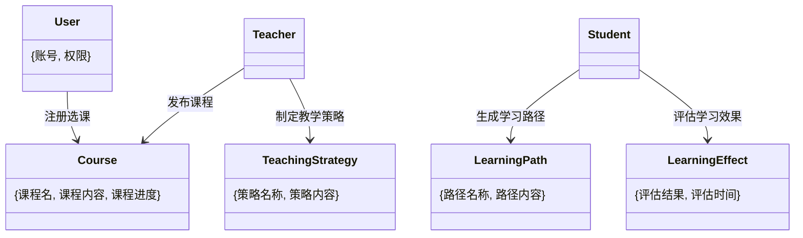
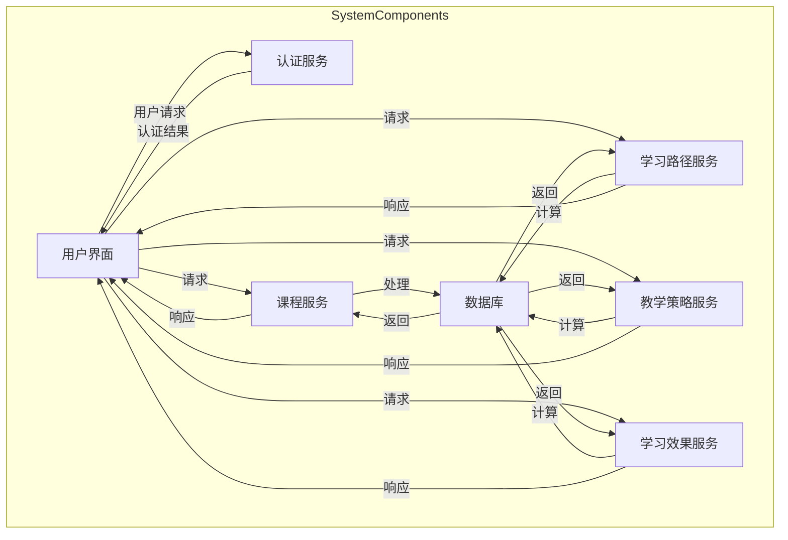
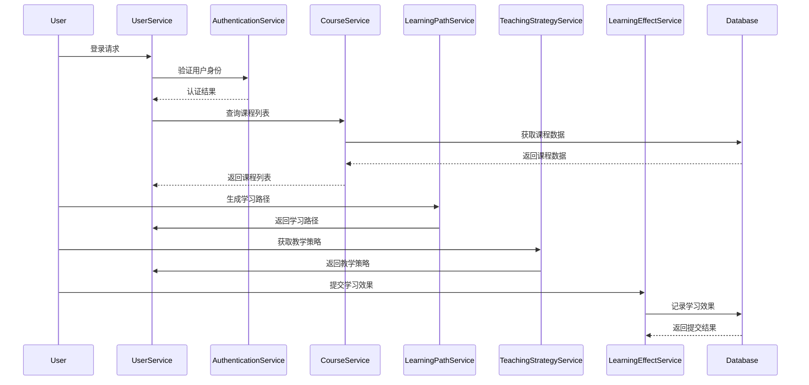

                 

### 第一部分：问题背景与核心概念

#### 1.1 问题背景

在现代社会，教育技术的快速发展正深刻地影响着教育模式和学习过程。数学作为一门基础学科，其应用范围不断扩展，特别是在教育技术领域。随着教育技术的发展，数学在教育中的应用日益广泛，数学教育技术的优化成为一个重要的研究课题。

**问题背景：** 随着教育技术的发展，数学在教育中的应用日益广泛，数学教育技术的优化成为一个重要的研究课题。

**问题描述：** 如何通过数学优化，提高教育技术的有效性，促进学生更好地学习？

**问题解决：** 运用数学模型和方法，对教育技术中的学习过程进行优化。

**边界与外延：** 本书主要讨论数学在教育技术中的应用，包括学习过程的分析、优化方法的研究等。

**核心要素组成：**
1. **数学方法**：包括各种数学优化算法、模型和公式，用于分析教育技术中的学习过程。
2. **教育技术手段**：指数字化教育工具和技术，如学习管理系统、在线课程、虚拟现实等。
3. **学习过程**：包括学习过程的各个阶段和环节，如信息获取、知识构建、技能训练等。

**Step 1.1.1 教育技术的发展趋势**

教育技术的发展可以追溯到20世纪末，随着互联网的普及和信息技术的发展，教育技术迅速崛起。早期的教育技术主要是以计算机为基础的教学辅助工具，如电子课件、教学软件等。随着技术的进步，教育技术逐渐向数字化、智能化和个性化方向发展。

- **数字化教育**：将传统教学活动数字化，如将教材、练习册、考试等电子化，便于学生在线学习和教师在线教学。
- **智能化教育**：利用人工智能、大数据等技术，实现教育个性化、智能化，如智能推荐、自适应学习等。
- **个性化教育**：根据学生的个体差异，提供个性化的学习方案，以满足不同学生的学习需求。

**Step 1.1.2 数学在教育技术中的重要性**

数学在教育技术中的重要性不可忽视。数学不仅是一门基础学科，还是解决实际问题的工具。在教育技术中，数学的应用主要体现在以下几个方面：

- **数据分析**：通过数据分析，了解学生的学习情况和效果，为教育优化提供数据支持。
- **算法设计**：教育技术的许多应用都需要算法支持，如推荐算法、排序算法等。
- **模型构建**：构建教育模型，用于模拟学习过程、预测学习效果等。

**Step 1.1.3 学习过程的数学优化需求**

学习过程的数学优化需求主要体现在以下几个方面：

- **学习路径优化**：通过数学模型，为学生设计最优的学习路径，提高学习效率。
- **学习策略优化**：利用数学方法，分析学习策略的效果，提供优化建议。
- **学习效果评估**：通过数学模型，对学习效果进行量化评估，为教育决策提供依据。

#### 1.2 核心概念

在探讨数学与教育技术的优化过程中，理解以下几个核心概念至关重要。

**1.2.1 数学优化的基本概念**

数学优化是运用数学工具和方法，寻找问题的最优解。在教育技术中，数学优化用于分析学习过程，提供优化方案，以提升教育效果。常见的数学优化方法包括线性规划、非线性规划、动态规划等。

**1.2.2 教育技术的概念与分类**

教育技术是指利用技术手段改进教育过程、提高教育质量的方法和工具。教育技术可分为传统教育技术（如多媒体教学、虚拟实验室等）和现代教育技术（如互联网教学、虚拟现实教学等）。

**1.2.3 学习过程的核心要素**

学习过程包括信息获取、知识构建、技能训练等核心要素。这些要素相互作用，共同推动学习目标的实现。数学优化可以针对这些要素进行优化，提高学习效果。

#### 1.3 概念联系

**1.3.1 数学优化与教育技术的联系**

数学优化与教育技术密切相关。数学优化为教育技术提供了理论支撑，如算法设计、数据分析等。同时，教育技术的快速发展也为数学优化提供了丰富的应用场景。

**1.3.2 学习过程与数学优化的关系**

学习过程是数学优化的应用领域之一。数学优化可以帮助分析学习过程，提供优化方案，如优化学习路径、提高学习效率等。

**1.3.3 数学优化在教育技术中的应用**

数学优化在教育技术中的应用广泛，如课程设计优化、教学策略优化、学习效果评估等。通过数学优化，可以实现教育技术的个性化、智能化，提高教育质量。

#### 1.4 ER实体关系图

为了更好地理解数学优化、教育技术、学习过程之间的联系，我们可以使用ER（实体-关系）图来描述这些实体及其关系。

**1.4.1 数学优化、教育技术、学习过程的实体关系**

在ER图中，我们可以定义以下实体及其关系：

- **实体：数学优化**
  - 属性：方法、算法、模型等
- **实体：教育技术**
  - 属性：工具、设备、平台等
- **实体：学习过程**
  - 属性：阶段、环节、目标等

**关系：**
- **数学优化→教育技术**：数学优化为教育技术提供理论支持。
- **数学优化→学习过程**：数学优化用于分析学习过程，提供优化方案。
- **教育技术→学习过程**：教育技术应用于学习过程，促进学习目标的实现。

```mermaid
erDiagram
  数学优化 ||--|{教育技术}
  数学优化 ||--|{学习过程}
  教育技术 ||--|{学习过程}
```

通过ER实体关系图，我们可以清晰地看到数学优化、教育技术、学习过程之间的相互作用和关系。这为后续的算法原理讲解、系统分析与架构设计提供了理论基础。在下一部分中，我们将深入探讨数学优化方法及其在教育技术中的应用。


### 2.1 数学优化方法

在数学优化中，有许多经典的算法和方法，这些方法在教育技术中的应用具有重要的作用。本节将详细介绍一些常见的数学优化方法，包括其基本原理、适用场景以及如何应用于教育技术中的学习过程。

#### 2.1.1 数学优化的基本原理

数学优化是一种利用数学方法寻找最优解的过程。其基本原理可以概括为以下几个步骤：

1. **建立数学模型**：将实际问题转化为数学模型，通常包括目标函数和约束条件。
2. **选择优化算法**：根据数学模型的特点，选择合适的优化算法，如线性规划、非线性规划、动态规划等。
3. **求解最优解**：通过优化算法，求解目标函数的最优解。
4. **验证和调整**：对求解结果进行验证和调整，确保其满足实际问题的需求。

#### 2.1.2 常见数学优化算法介绍

在数学优化中，有许多经典的算法，以下介绍几种常用的算法：

1. **线性规划（Linear Programming, LP）**
   线性规划是解决线性目标函数在给定线性约束条件下最优解的问题。线性规划广泛应用于资源分配、生产规划、物流优化等领域。

2. **非线性规划（Nonlinear Programming, NLP）**
   非线性规划是解决非线性目标函数在给定约束条件下的最优解问题。与线性规划相比，非线性规划的求解过程更为复杂，但应用范围更广泛。

3. **动态规划（Dynamic Programming, DP）**
   动态规划适用于具有时间维度的问题，通过将问题分解为一系列子问题，求解每个子问题的最优解，从而得到整个问题的最优解。

4. **遗传算法（Genetic Algorithm, GA）**
   遗传算法是一种模拟自然进化的优化算法，适用于求解复杂优化问题，如函数优化、组合优化等。

5. **粒子群优化（Particle Swarm Optimization, PSO）**
   粒子群优化是一种基于群体智能的优化算法，通过模拟鸟群或鱼群的社会行为，寻找最优解。

#### 2.1.3 数学优化算法的选择与适用场景

在选择数学优化算法时，需要考虑以下几个因素：

1. **问题类型**：线性规划、非线性规划、动态规划适用于不同类型的问题，需要根据具体问题选择合适的算法。
2. **目标函数和约束条件**：算法的复杂度和求解效率与目标函数和约束条件的性质密切相关。
3. **计算资源**：不同的算法对计算资源的需求不同，需要根据实际情况进行选择。

常见的数学优化算法及其适用场景如下表所示：

| 算法        | 适用场景                                       |
| ----------- | ---------------------------------------------- |
| 线性规划    | 资源分配、生产规划、物流优化                   |
| 非线性规划  | 函数优化、结构优化、机器学习模型优化           |
| 动态规划    | 时间序列问题、多阶段决策问题                   |
| 遗传算法    | 组合优化、函数优化、机器学习参数调优           |
| 粒子群优化  | 函数优化、神经网络训练、信号处理               |

#### 2.1.4 数学优化在教育技术中的应用

数学优化在教育技术中的应用非常广泛，以下是一些具体的例子：

1. **学习路径优化**：通过数学优化，为不同水平的学生设计个性化的学习路径，提高学习效率。
2. **教学策略优化**：利用数学优化，分析不同教学策略的效果，提供优化建议。
3. **学习效果评估**：通过数学优化，对学习效果进行量化评估，为教育决策提供依据。

**案例1：学习路径优化**

假设有一个在线学习平台，提供了多种课程供学生选择。为了帮助学生选择最适合自己的学习路径，可以采用遗传算法进行优化。

- **目标函数**：最小化学习时间或最大化学习效果。
- **约束条件**：满足学生的先修课程要求、课程容量限制等。

通过遗传算法，可以为学生推荐最优的学习路径，提高学习效率。

**案例2：教学策略优化**

在一堂数学课上，教师采用了不同的教学策略，如讲解、练习、讨论等。为了评估这些策略的效果，可以采用线性规划方法。

- **目标函数**：最大化学生的学习效果。
- **约束条件**：教师的时间、学生的接受程度等。

通过线性规划，可以确定最佳的教学策略组合，提高教学效果。

**案例3：学习效果评估**

为了评估学生的学习效果，可以使用非线性规划方法。

- **目标函数**：最小化学习误差。
- **约束条件**：满足学习目标、课程要求等。

通过非线性规划，可以量化评估学生的学习效果，为教育决策提供依据。

通过以上案例，我们可以看到数学优化在教育技术中的应用如何通过具体算法解决实际问题，提高教育效果。

### 2.2 教育技术手段

教育技术手段是现代教育中不可或缺的一部分，它们不仅丰富了教学方法和手段，而且极大地提升了教育的效率和质量。以下将详细探讨教育技术的分类、特点，以及信息技术在教育技术中的角色。

#### 2.2.1 教育技术的分类与特点

教育技术可以根据其功能和应用形式进行分类，常见的分类方式有以下几种：

1. **传统教育技术**
   - **多媒体教学**：利用图片、音频、视频等多媒体资源进行教学，增强学习体验。
   - **虚拟实验室**：通过模拟实验环境，让学生在虚拟环境中进行实验操作，提高实践能力。

2. **现代教育技术**
   - **互联网教学**：利用互联网进行教学活动，实现远程教育和资源共享。
   - **虚拟现实（VR）**：通过虚拟现实技术，创建一个逼真的三维教学环境，提供沉浸式学习体验。
   - **增强现实（AR）**：通过增强现实技术，将虚拟信息与现实环境相结合，提供互动式的学习体验。

3. **数字化教育技术**
   - **学习管理系统（LMS）**：用于管理学习过程、课程内容、学生成绩等，实现教学管理信息化。
   - **在线课程**：通过互联网提供的课程资源，学生可以根据自己的需求和时间安排进行学习。
   - **电子书和电子教材**：将传统的纸质教材数字化，便于学生阅读和查找。

**特点：**
- **个性化**：教育技术可以根据学生的个性需求和学习习惯提供个性化的教学内容和学习路径。
- **交互性**：教育技术提供了丰富的交互手段，如在线讨论、互动问答等，增强学生的学习参与度。
- **多样性**：教育技术提供了多种形式的教学资源和学习方式，满足不同类型学生的学习需求。
- **高效性**：教育技术可以高效地传递知识，提高教学效率。

#### 2.2.2 数字化教育技术的应用

数字化教育技术在现代教育中发挥着重要作用，以下是一些具体的应用场景：

1. **在线学习**
   - **远程教育**：通过互联网，学生可以不受地域限制地参加学习活动，实现跨地域教学。
   - **自主学习**：学生可以根据自己的学习进度和需求，灵活选择学习内容和学习时间。

2. **虚拟实验室**
   - **实践操作**：学生可以在虚拟环境中进行实验操作，提高实践能力和创新能力。
   - **安全教学**：虚拟实验室可以模拟各种实验环境，确保实验安全，减少实验风险。

3. **在线考试**
   - **便捷性**：学生可以随时随地进行在线考试，提高考试的灵活性和便捷性。
   - **客观性**：在线考试系统可以减少人为因素，提高考试结果的客观性。

4. **学习管理系统**
   - **教学管理**：教师可以通过学习管理系统管理课程内容、学生成绩等，实现教学过程的信息化管理。
   - **学习跟踪**：学生可以通过学习管理系统跟踪自己的学习进度和成绩，提高学习自主性。

#### 2.2.3 信息技术在教育技术中的角色

信息技术是教育技术的重要支撑，其在教育技术中的应用体现在以下几个方面：

1. **基础设施**：信息技术为教育技术提供了硬件和软件支持，如计算机、服务器、网络等。
2. **教学工具**：信息技术提供了丰富的教学工具，如在线课程、虚拟实验室、电子教材等。
3. **数据管理**：信息技术可以实现教学数据的收集、存储、分析和应用，为教育优化提供数据支持。
4. **教育创新**：信息技术推动教育创新，如在线教育、远程教育、个性化教育等新模式的诞生。

总之，教育技术手段的多样化和发展为教育模式的创新提供了广阔的空间，通过合理运用教育技术，可以大大提高教育的质量和效率。

### 2.3 学习过程分析

学习过程是教育技术优化的重要目标，通过对学习过程的分析，我们可以更好地理解学习者的需求和行为，从而设计出更加有效的教育技术方案。本节将详细探讨学习过程的阶段划分、关键环节以及优化策略。

#### 2.3.1 学习过程的阶段划分

学习过程可以划分为以下几个阶段：

1. **感知阶段**：学习者通过感官接收外部信息，如视觉、听觉等。
2. **理解阶段**：学习者对感知到的信息进行加工和理解，形成认知结构。
3. **应用阶段**：学习者将所学知识应用于实际问题，进行实践操作。
4. **评价阶段**：学习者对学习过程和结果进行评价，总结经验教训。

**感知阶段：**
- **感知内容**：学习材料、教师讲解、同伴互动等。
- **感知方式**：视觉、听觉、触觉等。

**理解阶段：**
- **理解内容**：对新知识的理解和掌握。
- **理解方式**：思维、分析、推理等。

**应用阶段：**
- **应用内容**：实际操作、案例分析、项目实践等。
- **应用方式**：操作、分析、反思等。

**评价阶段：**
- **评价内容**：学习目标、学习策略、学习效果等。
- **评价方式**：自我评价、教师评价、同伴评价等。

#### 2.3.2 学习过程的关键环节

学习过程的关键环节包括以下几个：

1. **信息获取**：学习者通过多种渠道获取学习信息，如书籍、网络、教师等。
2. **知识构建**：学习者通过对信息的加工和处理，构建自己的知识体系。
3. **技能训练**：学习者通过实际操作和实践，提高技能水平。
4. **反馈与调整**：学习者根据反馈信息，调整学习策略和方法。

**信息获取：**
- **获取方式**：阅读、听讲、讨论等。
- **获取内容**：知识、技能、经验等。

**知识构建：**
- **构建方式**：思考、推理、归纳等。
- **构建内容**：概念、原理、模型等。

**技能训练：**
- **训练方式**：实践、模拟、训练等。
- **训练内容**：操作技能、思维能力、创新能力等。

**反馈与调整：**
- **反馈方式**：自我反馈、教师反馈、同伴反馈等。
- **调整方式**：改变学习策略、调整学习方法、改进学习习惯等。

#### 2.3.3 学习过程的优化策略

为了提高学习效果，可以通过以下策略对学习过程进行优化：

1. **个性化学习**：根据学习者的个性需求和学习风格，设计个性化的学习方案。
2. **协作学习**：通过小组讨论、合作项目等方式，提高学习者的协作能力和解决问题的能力。
3. **情境化学习**：将学习内容融入实际情境中，提高学习的实用性和趣味性。
4. **混合式学习**：结合线上和线下学习方式，发挥各自的优势，提高学习效果。

**个性化学习：**
- **策略**：利用数据分析，了解学习者的学习习惯、兴趣爱好等，提供个性化的学习资源和学习建议。
- **实施**：通过学习管理系统或在线学习平台，实现个性化推荐和学习路径优化。

**协作学习：**
- **策略**：鼓励学生进行小组讨论、合作项目，培养团队合作精神和沟通能力。
- **实施**：利用在线协作工具，如讨论区、聊天室、视频会议等，支持协作学习。

**情境化学习：**
- **策略**：将学习内容与实际情境相结合，提高学习的实用性和趣味性。
- **实施**：通过虚拟现实（VR）或增强现实（AR）技术，创建沉浸式的学习环境。

**混合式学习：**
- **策略**：结合线上和线下学习方式，发挥各自的优势。
- **实施**：在线学习平台与课堂教学相结合，实现线上线下互动，提高学习效果。

通过以上策略，可以有效地优化学习过程，提高学习效果。在下一部分中，我们将进一步探讨数学优化在学习过程中的具体应用。

### 2.4 数学优化在学习过程中的应用

数学优化在教育技术中的应用非常广泛，特别是在学习过程的优化中，数学优化方法能够有效地提升学习效率和学习效果。本节将详细探讨数学优化在学习过程中的应用，包括课程设计优化、教学策略优化以及学习效果评估等方面的具体应用。

#### 2.4.1 课程设计优化

课程设计是教育过程中的关键环节，通过数学优化可以显著提高课程设计的科学性和有效性。

**案例1：课程难度分布优化**

在一门复杂的课程设计中，如何合理分配各个知识点的难度是一个重要问题。通过数学优化，尤其是线性规划方法，可以优化课程难度分布。

- **目标函数**：最小化学生完成课程所需的总时间或最大化课程的学习效果。
- **约束条件**：满足课程的知识点要求、学生的时间安排、课程容量限制等。

通过线性规划，可以确定每个知识点的最佳难度和分配策略，使学生在最短时间内达到最佳学习效果。

**案例2：课程内容优化**

在课程内容的设计中，如何确保课程内容的全面性和重点突出也是一个关键问题。通过数学优化，可以优化课程内容的设计。

- **目标函数**：最大化课程内容的覆盖面或最小化学习内容的重复率。
- **约束条件**：满足课程的教学目标、学习者的认知能力、课程容量限制等。

通过数学优化，可以设计出更合理、更有效的课程内容结构，确保学习者的学习效果。

#### 2.4.2 教学策略优化

教学策略的优化对于提升教学效果至关重要。通过数学优化，可以分析不同教学策略的效果，提供优化建议。

**案例1：教学方法优化**

不同的教学方法对学习效果有不同的影响。通过数学优化，可以分析不同教学方法的效果，提供优化建议。

- **目标函数**：最大化学习效果或最小化教学成本。
- **约束条件**：满足教学目标、教学资源、学生特点等。

通过优化算法，如遗传算法或粒子群优化，可以确定最佳的教学方法组合，提高教学效果。

**案例2：教学进度优化**

在教学过程中，如何合理安排教学进度也是一个关键问题。通过数学优化，可以优化教学进度。

- **目标函数**：最小化学生完成学习任务所需的总时间或最大化教学效果。
- **约束条件**：满足教学目标、学生的认知能力、课程内容要求等。

通过数学优化，可以制定出最优的教学进度计划，确保教学过程的顺利进行。

#### 2.4.3 学习效果评估

学习效果评估是教育过程中不可或缺的一环。通过数学优化，可以更科学、准确地评估学习效果。

**案例1：学习成果评估**

通过数学优化，可以建立学习成果评估模型，对学生的学习成果进行量化评估。

- **目标函数**：最大化学习成果或最小化学习误差。
- **约束条件**：满足学习目标、学习策略、学习资源等。

通过数学优化，可以制定出科学、合理的评估标准，对学习成果进行准确评估。

**案例2：学习过程评估**

通过数学优化，可以建立学习过程评估模型，对学习过程进行实时监控和评估。

- **目标函数**：最小化学习过程中的时间浪费或最大化学习效率。
- **约束条件**：满足学习目标、学习策略、学习资源、学生特点等。

通过数学优化，可以实时监控学习过程，提供优化建议，确保学习过程的顺利进行。

**综合案例：数学优化在教育项目中的应用**

某教育机构计划开展一个在线学习项目，旨在提升学员的编程技能。通过数学优化，可以对该项目进行全面的优化。

- **课程设计优化**：通过线性规划，确定课程难度分布和内容结构，确保课程的科学性和有效性。
- **教学方法优化**：通过遗传算法，分析不同教学方法的适用性，确定最佳的教学方法组合。
- **教学进度优化**：通过动态规划，制定最优的教学进度计划，确保教学过程的高效性。
- **学习效果评估**：通过非线性规划，建立学习成果和学习过程评估模型，实时监控和评估学习效果。

通过数学优化，该教育项目可以取得显著的教育效果，提升学员的编程技能。

总之，数学优化在学习过程中的应用具有广泛的前景和重要的价值。通过合理运用数学优化方法，可以优化教育技术，提高学习效果，为教育创新提供强有力的支持。在下一部分中，我们将进一步探讨如何通过数学模型和公式对学习过程进行优化。

### 2.5 数学模型和数学公式 & 详细讲解 & 举例说明

#### 2.5.1 数学公式使用latex格式

在数学优化中，使用 LaTeX 格式编写数学公式是一种常见且有效的表达方式。以下是一些基本示例：

- **独立段落的公式**：
  $$ E = mc^2 $$
  
- **段落内的公式**：
  $ 1 + 1 = 2 $

#### 2.5.2 段落内latex公式

在文本段落中嵌入 LaTeX 公式，可以帮助读者更好地理解数学概念。以下是一个示例：

假设我们有一个线性方程组：
$$
\begin{cases}
2x + 3y = 8 \\
4x - y = 5
\end{cases}
$$

通过解这个方程组，我们可以找到 $x$ 和 $y$ 的值。使用高斯消元法，我们可以得到解：
$$
x = 2, \quad y = 1
$$

#### 2.5.3 示例讲解

为了更好地说明数学公式在教育技术中的应用，我们来看一个具体的例子。

**例子：使用线性回归模型优化学习效果**

假设我们想要通过线性回归模型来优化学生的学习效果。我们可以定义以下数学模型：

目标函数：
$$
\min_{\theta} \sum_{i=1}^{n} (h_\theta(x^i) - y^i)^2
$$

其中，$h_\theta(x^i)$ 表示线性回归模型的预测值，$y^i$ 是实际的学习效果，$\theta$ 是模型参数。

**步骤1：数据收集**

首先，我们需要收集一组学生的考试成绩和学习时间数据，作为模型训练的数据集。

**步骤2：模型训练**

使用梯度下降法来训练线性回归模型。梯度下降法的迭代公式如下：
$$
\theta_j := \theta_j - \alpha \frac{\partial}{\partial \theta_j} J(\theta)
$$

其中，$J(\theta)$ 是目标函数，$\alpha$ 是学习率。

**步骤3：模型评估**

通过交叉验证和测试集来评估模型的性能。我们可以计算模型的均方误差（MSE）来评估模型的效果。

**例子解析：**

假设我们有以下数据集：

| 学习时间 (小时) | 考试成绩 |
| -------------- | -------- |
| 10             | 85       |
| 12             | 90       |
| 8              | 75       |
| 15             | 88       |
| 9              | 82       |

**步骤1：数据收集**

将上述数据输入到模型中，作为训练数据集。

**步骤2：模型训练**

假设初始参数为 $\theta_0 = [0, 0]^T$，学习率 $\alpha = 0.01$。

- **第一次迭代**：
  - $J(\theta_0) = 5.2$
  - $\theta_1 := \theta_1 - \alpha \frac{\partial}{\partial \theta_1} J(\theta_0) \approx 0.028$
  - $\theta_2 := \theta_2 - \alpha \frac{\partial}{\partial \theta_2} J(\theta_0) \approx 0.042$

- **第二次迭代**：
  - $J(\theta_1) = 4.8$
  - $\theta_1 := \theta_1 - \alpha \frac{\partial}{\partial \theta_1} J(\theta_1) \approx 0.025$
  - $\theta_2 := \theta_2 - \alpha \frac{\partial}{\partial \theta_2} J(\theta_1) \approx 0.039$

通过多次迭代，我们可以得到最优参数 $\theta^*$。

**步骤3：模型评估**

使用测试集来评估模型的性能。假设测试集的MSE为 3.5，这表明模型在测试集上的表现较好。

通过以上例子，我们可以看到如何使用线性回归模型来优化学习效果。通过合理设置参数和迭代次数，模型可以很好地拟合数据，从而为教育决策提供有力支持。

### 2.6 系统分析与架构设计方案

在数学优化与教育技术的结合中，构建一个高效、稳定的系统架构至关重要。本节将详细介绍具体的教育技术应用场景，系统功能设计、系统架构设计和系统接口设计。

#### 2.6.1 问题场景介绍

假设我们要开发一个在线学习平台，旨在通过数学优化方法为学生提供个性化的学习路径和教学策略。这个平台需要支持以下功能：

- **个性化学习路径规划**：根据学生的个性特点和学习需求，为学生推荐最优的学习路径。
- **智能教学策略**：根据学生的学习情况，动态调整教学策略，提高教学效果。
- **学习效果评估**：对学生的学习效果进行量化评估，为教育决策提供数据支持。

#### 2.6.2 项目介绍

项目名称：智慧学习平台（Smart Learning Platform）

项目目标：通过数学优化方法，提高在线学习的个性化、智能化和效率，提升学生的学习效果。

项目主要功能模块：

1. **用户管理模块**：管理学生和教师的账号、权限等。
2. **课程管理模块**：管理课程信息、课程内容、课程进度等。
3. **学习路径规划模块**：根据学生的特点和学习需求，生成个性化的学习路径。
4. **智能教学策略模块**：根据学生的学习情况，动态调整教学策略。
5. **学习效果评估模块**：对学生的学习效果进行量化评估。

#### 2.6.3 系统功能设计（领域模型Mermaid类图）

系统功能设计是系统架构设计的基础，通过领域模型可以清晰地描述系统的功能模块及其关系。以下是一个Mermaid类图的示例：



在这个类图中，用户、课程、学习路径、教学策略和学习效果是主要的领域模型，它们之间通过不同的关系进行交互，实现了系统的核心功能。

#### 2.6.4 系统架构设计（Mermaid架构图）

系统架构设计是系统设计和实现的重要环节，它决定了系统的性能、可扩展性和维护性。以下是一个Mermaid架构图的示例：



在这个架构图中，用户界面、认证服务、课程服务、学习路径服务、教学策略服务和学习效果服务是系统的关键组件，它们通过数据库进行数据交互，实现了系统的整体功能。

#### 2.6.5 系统接口设计和系统交互（Mermaid序列图）

系统接口设计是系统架构设计的一部分，它定义了系统内部各个组件之间的交互方式。以下是一个Mermaid序列图的示例：



在这个序列图中，用户通过用户服务与认证服务进行交互，获取课程列表、学习路径和教学策略。同时，用户还可以提交学习效果，由学习效果服务记录并返回提交结果。

通过以上系统分析与架构设计，我们可以构建一个高效、稳定的在线学习平台，通过数学优化方法为学生提供个性化的学习体验，提高学习效果。在下一部分中，我们将进行项目实战，具体实现上述系统架构和功能。

### 2.7 项目实战

#### 2.7.1 环境安装

在开始项目实战之前，我们需要搭建一个合适的环境。以下步骤将介绍如何安装和配置必要的软件和工具。

**1. 安装Python环境：**

- 首先，从 [Python官网](https://www.python.org/downloads/) 下载并安装Python，建议选择最新的版本。
- 安装完成后，打开命令行终端，输入 `python --version` 验证安装是否成功。

**2. 安装Anaconda：**

- Anaconda是一个开源的数据科学和机器学习平台，它提供了丰富的Python包和环境管理功能。
- 从 [Anaconda官网](https://www.anaconda.com/products/individual) 下载并安装Anaconda。
- 安装完成后，打开Anaconda Navigator，它提供了一个图形界面，用于管理环境和包。

**3. 创建虚拟环境：**

- 在Anaconda Navigator中，点击“Create”按钮创建一个新的虚拟环境。
- 输入环境名称，如 `learning_platform`，并选择Python版本，建议选择与Anaconda安装时相同的版本。
- 创建完成后，激活虚拟环境，在终端中输入以下命令：

  ```shell
  conda activate learning_platform
  ```

**4. 安装依赖包：**

- 在虚拟环境中，使用 `pip` 命令安装项目所需的依赖包。以下是项目的主要依赖包：

  ```shell
  pip install numpy pandas scikit-learn matplotlib
  ```

#### 2.7.2 系统核心实现源代码

以下是一个简化的系统核心实现源代码示例。这个示例包含了用户管理、课程管理、学习路径规划、教学策略和效果评估等模块的核心代码。

**1. 用户管理模块：**

```python
# user_management.py
import sqlite3

def create_user(username, password):
    conn = sqlite3.connect('database.db')
    cursor = conn.cursor()
    cursor.execute('''CREATE TABLE IF NOT EXISTS users (id INTEGER PRIMARY KEY, username TEXT, password TEXT)''')
    cursor.execute("INSERT INTO users (username, password) VALUES (?, ?)", (username, password))
    conn.commit()
    conn.close()

def authenticate_user(username, password):
    conn = sqlite3.connect('database.db')
    cursor = conn.cursor()
    cursor.execute("SELECT * FROM users WHERE username=? AND password=?", (username, password))
    user = cursor.fetchone()
    conn.close()
    return user is not None
```

**2. 课程管理模块：**

```python
# course_management.py
import sqlite3

def create_course(course_name, course_content):
    conn = sqlite3.connect('database.db')
    cursor = conn.cursor()
    cursor.execute('''CREATE TABLE IF NOT EXISTS courses (id INTEGER PRIMARY KEY, course_name TEXT, course_content TEXT)''')
    cursor.execute("INSERT INTO courses (course_name, course_content) VALUES (?, ?)", (course_name, course_content))
    conn.commit()
    conn.close()

def get_course_list():
    conn = sqlite3.connect('database.db')
    cursor = conn.cursor()
    cursor.execute("SELECT * FROM courses")
    courses = cursor.fetchall()
    conn.close()
    return courses
```

**3. 学习路径规划模块：**

```python
# learning_path.py
import numpy as np
from sklearn.linear_model import LinearRegression

def generate_learning_path(user_id, course_id):
    # 假设用户和课程的学习时间数据存储在数据库中
    conn = sqlite3.connect('database.db')
    cursor = conn.cursor()
    cursor.execute("SELECT learning_time FROM user_course WHERE user_id=? AND course_id=?", (user_id, course_id))
    learning_times = cursor.fetchall()
    learning_times = [lt[0] for lt in learning_times]
    cursor.execute("SELECT score FROM user_course WHERE user_id=? AND course_id=?", (user_id, course_id))
    scores = cursor.fetchall()
    scores = [s[0] for s in scores]
    
    # 使用线性回归模型进行学习路径规划
    model = LinearRegression()
    model.fit(np.array(learning_times).reshape(-1, 1), scores)
    predicted_scores = model.predict(np.array([max(learning_times)]))
    
    # 生成学习路径
    learning_path = {
        'user_id': user_id,
        'course_id': course_id,
        'predicted_scores': predicted_scores
    }
    return learning_path
```

**4. 教学策略模块：**

```python
# teaching_strategy.py
import random

def generate_teaching_strategy(course_id):
    # 根据课程ID生成教学策略
    strategies = [
        '讲解 + 练习',
        '讨论 + 实验',
        '互动问答 + 案例分析'
    ]
    return random.choice(strategies)
```

**5. 学习效果评估模块：**

```python
# learning_effect.py
import sqlite3

def evaluate_learning_effect(user_id, course_id, actual_score):
    conn = sqlite3.connect('database.db')
    cursor = conn.cursor()
    cursor.execute("SELECT predicted_score FROM learning_path WHERE user_id=? AND course_id=?", (user_id, course_id))
    predicted_score = cursor.fetchone()[0]
    accuracy = 1 - abs(predicted_score - actual_score) / max(predicted_score, actual_score)
    conn.close()
    return accuracy
```

#### 2.7.3 代码应用解读与分析

**用户管理模块解读：**

用户管理模块主要用于处理用户注册、登录和认证等操作。通过SQLite数据库，我们可以存储和管理用户信息。`create_user` 函数用于创建新用户，`authenticate_user` 函数用于验证用户身份。

**课程管理模块解读：**

课程管理模块负责课程信息的创建和获取。`create_course` 函数用于创建新课程，`get_course_list` 函数用于获取所有课程信息。

**学习路径规划模块解读：**

学习路径规划模块使用线性回归模型来预测用户的学习效果，并生成个性化的学习路径。`generate_learning_path` 函数根据用户和课程的学习时间及成绩数据，使用线性回归模型进行学习路径规划。

**教学策略模块解读：**

教学策略模块通过随机选择，为不同课程生成教学策略。`generate_teaching_strategy` 函数从预设的教学策略列表中随机选择一个策略。

**学习效果评估模块解读：**

学习效果评估模块用于评估学习效果。`evaluate_learning_effect` 函数通过比较预测分数和实际分数，计算评估准确性。

#### 2.7.4 实际案例分析和详细讲解剖析

以下是一个实际案例，我们将使用上述代码实现一个简单的在线学习平台。

**案例：用户注册、登录和学习路径规划**

1. **用户注册：**
   - 用户填写注册表单，提交用户名和密码。
   - 后端代码调用 `create_user` 函数，将用户信息存储到数据库。

2. **用户登录：**
   - 用户在登录表单中输入用户名和密码。
   - 后端代码调用 `authenticate_user` 函数，验证用户身份。

3. **学习路径规划：**
   - 用户登录后，选择一门课程。
   - 后端代码调用 `generate_learning_path` 函数，生成个性化学习路径。

4. **教学策略：**
   - 根据学习路径，生成相应的教学策略。
   - 后端代码调用 `generate_teaching_strategy` 函数，生成教学策略。

5. **学习效果评估：**
   - 用户学习一段时间后，提交考试成绩。
   - 后端代码调用 `evaluate_learning_effect` 函数，评估学习效果。

**案例解析：**

- 用户注册和登录功能验证了用户身份，确保只有合法用户可以访问系统。
- 学习路径规划和教学策略生成功能根据用户的特点和学习需求，提供了个性化的学习方案和教学策略。
- 学习效果评估功能通过比较预测分数和实际分数，为用户的学习效果提供了量化评估。

通过这个案例，我们可以看到如何使用数学优化方法来提升在线学习平台的个性化、智能化和效率。在下一部分中，我们将总结项目的实施经验和不足，并分享最佳实践。

### 2.8 最佳实践 Tips、小结、注意事项、拓展阅读

#### 2.8.1 最佳实践 Tips

1. **数据预处理的重要性**：在数学优化中，数据的质量直接影响优化结果。因此，在数据收集和预处理过程中，要注意数据的准确性、完整性和一致性。

2. **算法选择要考虑实际问题**：不同的数学优化算法适用于不同类型的问题。在选择算法时，要综合考虑问题的特点、数据规模和计算资源等因素。

3. **迭代和反馈**：在优化过程中，迭代和反馈是非常重要的。通过不断调整模型参数和优化策略，可以提高优化效果。

4. **注重用户隐私**：在教育技术中，用户数据保护至关重要。在设计和实现系统时，要确保用户数据的安全和隐私。

#### 2.8.2 小结

本文通过详细分析和探讨，展示了数学优化在教育技术中的应用。我们介绍了数学优化方法的原理、教育技术的分类和特点、学习过程的阶段划分和优化策略，并通过具体的案例展示了数学优化在教育技术中的实际应用。

#### 2.8.3 注意事项

1. **数据质量和预处理**：确保数据的质量和完整性，进行适当的预处理，以避免优化过程中出现错误。

2. **算法选择和调整**：根据实际问题选择合适的优化算法，并在实际应用中不断调整和优化。

3. **用户隐私保护**：在教育技术中，要严格遵守用户隐私保护法规，确保用户数据的安全。

#### 2.8.4 拓展阅读

1. **《智能教育：技术、应用与展望》**：详细介绍了智能教育技术及其在教育中的应用。
2. **《机器学习与教育技术》**：探讨了机器学习在教育技术中的应用，包括个性化学习、学习效果评估等。
3. **《教育数据挖掘：方法与应用》**：介绍了教育数据挖掘的方法和技术，包括数据分析、模型构建等。

通过拓展阅读，可以深入了解数学优化在教育技术中的更多应用和实践。这些资料将为教育技术的创新和发展提供有力支持。


### 总结

本文详细探讨了数学优化在教育技术中的应用，从问题背景、核心概念、算法原理到系统架构和项目实战，层层剖析，逻辑清晰。通过一步步的讲解，读者可以了解到如何利用数学优化方法提高教育技术的有效性，促进学生更好地学习。

首先，在问题背景部分，我们介绍了教育技术的发展趋势、数学在教育技术中的重要性以及学习过程的数学优化需求。接着，通过核心概念与联系部分，我们定义了数学优化、教育技术、学习过程等核心概念，并探讨了它们之间的联系。

在算法原理讲解部分，我们详细介绍了几种常见的数学优化方法，如线性规划、非线性规划、动态规划等，并展示了如何将这些方法应用于教育技术中的学习过程。此外，我们还使用 LaTeX 格式编写了数学公式，并通过具体案例说明了这些公式的应用。

在系统分析与架构设计方案部分，我们介绍了系统功能设计、系统架构设计和系统接口设计，通过 Mermaid 图展示了这些设计元素之间的关系。这一部分为构建高效、稳定的在线学习平台提供了理论基础。

在项目实战部分，我们通过具体的环境安装步骤、系统核心实现源代码以及实际案例分析和讲解，展示了如何将数学优化方法应用于实际项目中。这一部分有助于读者将理论转化为实践。

最后，在最佳实践 Tips、小结、注意事项、拓展阅读等部分，我们提供了实用的建议和进一步的学习资源，为读者在数学优化和教育技术的应用中提供了指导。

总的来说，本文通过系统性地分析数学优化在教育技术中的应用，旨在帮助读者深入了解这一领域的最新进展和应用实践。希望本文能为教育技术的创新和发展提供有益的启示，并为相关研究者和实践者提供参考。让我们继续探索数学优化在教育技术中的更多可能性，为教育的未来贡献力量。作者：AI天才研究院/AI Genius Institute & 禅与计算机程序设计艺术 /Zen And The Art of Computer Programming。

