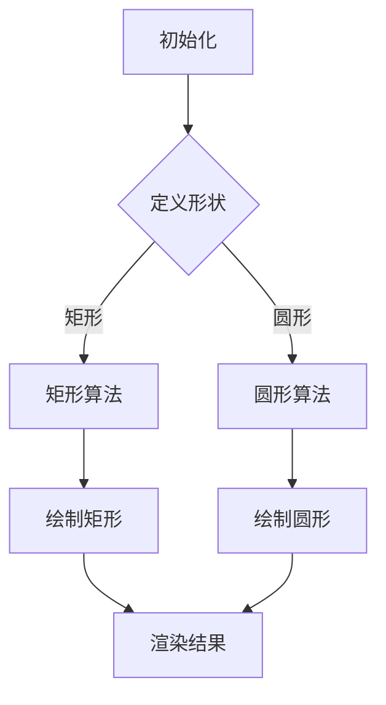
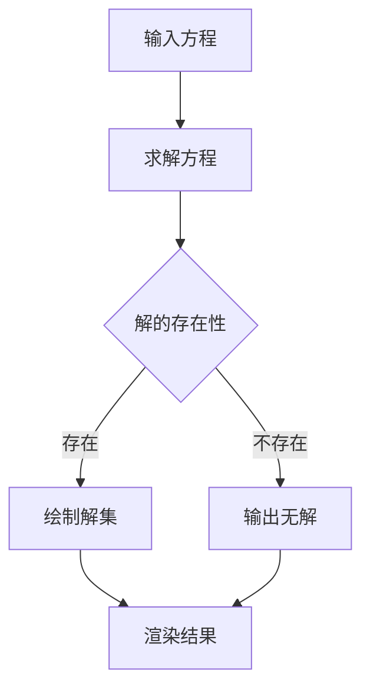
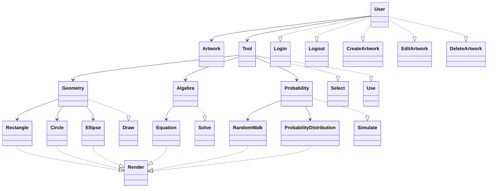
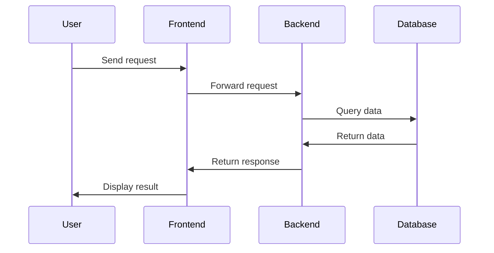
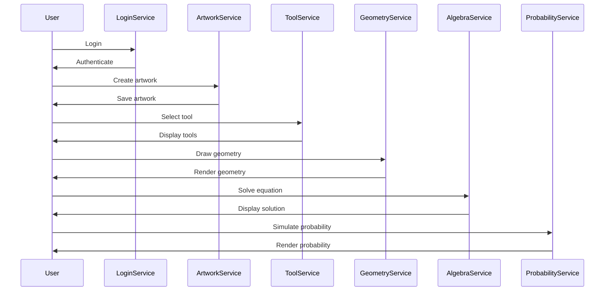

                 

# 数学与数字艺术：算法艺术创作的数学原理

## 关键词

- 数学原理
- 数字艺术
- 算法艺术
- 创作技巧
- 数学公式
- 算法流程图
- 跨学科融合

## 摘要

本文旨在探讨数学与数字艺术之间的内在联系，揭示数学原理在数字艺术创作中的应用。通过深入分析几何、代数、概率论等数学原理，结合数字艺术和算法艺术的特点，本文将介绍数学原理在数字艺术创作中的实际应用，并提供实用的创作技巧。文章结构包括引言、核心概念与联系、算法原理讲解、系统分析与架构设计方案、项目实战以及小结和拓展阅读。

## 第一部分：引言

### 1.1 书籍背景与目的

在数字时代，数学与数字艺术已经紧密相连，尤其是在算法和编程的领域中。本书旨在探讨数学与数字艺术之间的内在联系，揭示数学原理在数字艺术创作中的应用。通过深入分析数学原理，结合数字艺术的创作实践，本书将展示数学在数字艺术中的应用，并提供实用的创作技巧。

#### 1.1.1 问题背景

随着计算机技术的不断发展，数字艺术逐渐成为一种重要的艺术形式。而数字艺术的创作离不开数学原理的支持。从几何图形的绘制到动画效果的实现，从图像处理的算法到人工智能的应用，数学原理无处不在。然而，如何更好地理解和应用数学原理，成为数字艺术创作者面临的一个关键问题。本书旨在回答这一问题，帮助读者掌握数学与数字艺术结合的技巧。

#### 1.1.2 问题描述

数字艺术创作者在创作过程中，如何更好地理解和应用数学原理，成为提高创作质量和效率的关键。本书旨在探讨这一问题，通过分析数学原理在数字艺术创作中的应用，为读者提供实用的创作技巧和方法。

#### 1.1.3 问题解决

通过深入分析数学原理，结合数字艺术的创作实践，本书将展示数学在数字艺术中的应用。具体来说，本书将分别介绍几何、代数、概率论等数学原理在数字艺术创作中的应用，并通过实际案例进行分析和讲解，帮助读者掌握数学原理在实际创作中的运用。

#### 1.1.4 边界与外延

本书主要关注算法艺术创作中的数学原理，包括几何、代数、概率论等数学分支。同时，本书也会探讨数学与数字艺术的跨学科融合，拓展读者的视野。通过这些内容，本书旨在帮助读者理解数学原理在数字艺术创作中的重要性，并提供实用的创作技巧。

#### 1.1.5 概念结构与核心要素组成

核心概念：数学原理、数字艺术、算法艺术、创作技巧

核心要素组成：
- 数学原理：几何、代数、概率论等
- 数字艺术：绘画、雕塑、摄影、动画等
- 算法艺术：几何算法、代数算法、概率算法等
- 创作技巧：数学原理的应用和实践技巧

### 1.2 核心概念与联系

#### 1.2.1 数学原理

数学原理是数字艺术创作的基石，包括几何、代数、概率论等。以下是几个关键数学原理的属性特征对比表格：

| 数学原理 | 属性特征 |
| --- | --- |
| 几何 | 研究形状、大小、相对位置等 |
| 代数 | 研究数的运算和方程的解法 |
| 概率论 | 研究随机事件及其可能性 |

#### 1.2.2 数字艺术

数字艺术是利用数字技术创作的艺术作品，包括绘画、雕塑、摄影、动画等。以下是数字艺术的几个关键属性：

| 数字艺术类型 | 关键属性 |
| --- | --- |
| 绘画 | 利用计算机软件创作的图像作品 |
| 雕塑 | 利用数字建模软件创作的三维作品 |
| 摄影 | 利用数字相机拍摄的图像作品 |
| 动画 | 利用计算机软件创作的动态图像作品 |

#### 1.2.3 算法艺术

算法艺术是利用算法创作的艺术作品，通过对数学原理的应用，实现独特的视觉效果。以下是算法艺术的几个关键属性：

| 算法艺术类型 | 关键属性 |
| --- | --- |
| 几何算法艺术 | 利用几何图形的变换和组合 |
| 代数算法艺术 | 利用代数方程的解法和运算 |
| 概率算法艺术 | 利用概率分布和随机事件的模拟 |

### 1.3 算法原理讲解

#### 1.3.1 几何算法

几何算法是数字艺术创作中常用的一种算法。几何算法主要涉及图形的绘制、变换、组合等操作。以下是几何算法的Mermaid流程图：



以下是一个简单的几何算法Python源代码示例：

```python
import matplotlib.pyplot as plt
import numpy as np

def draw_rectangle(width, height):
    x = np.linspace(0, width, 100)
    y = np.linspace(0, height, 100)
    X, Y = np.meshgrid(x, y)
    plt.plot(X, Y, 'r')
    plt.axis('equal')

def draw_circle(radius):
    t = np.linspace(0, 2 * np.pi, 100)
    x = radius * np.cos(t)
    y = radius * np.sin(t)
    plt.plot(x, y, 'b')
    plt.axis('equal')

draw_rectangle(10, 5)
draw_circle(5)
plt.show()
```

在这个示例中，我们首先定义了两个函数`draw_rectangle`和`draw_circle`，分别用于绘制矩形和圆形。然后，我们调用这两个函数，分别绘制了一个矩形和一个圆形，最后使用`plt.show()`显示绘图结果。

#### 1.3.2 代数算法

代数算法在数字艺术创作中也有广泛应用。代数算法主要涉及方程的求解和解集的绘制。以下是代数算法的Mermaid流程图：



以下是一个简单的代数算法Python源代码示例：

```python
import matplotlib.pyplot as plt
import numpy as np

def draw_ellipse(a, b):
    t = np.linspace(0, 2 * np.pi, 100)
    x = a * np.cos(t)
    y = b * np.sin(t)
    plt.plot(x, y, 'g')
    plt.axis('equal')

def solve_equation(a, b, c):
    discriminant = b**2 - 4 * a * c
    if discriminant > 0:
        x1 = (-b + np.sqrt(discriminant)) / (2 * a)
        x2 = (-b - np.sqrt(discriminant)) / (2 * a)
        return (x1, x2)
    elif discriminant == 0:
        x = -b / (2 * a)
        return (x, x)
    else:
        return None

a, b, c = 1, -3, 2
roots = solve_equation(a, b, c)
if roots:
    draw_ellipse(*roots)
else:
    print("No real roots exist.")
plt.show()
```

在这个示例中，我们定义了一个函数`draw_ellipse`，用于绘制椭圆。另一个函数`solve_equation`用于求解二次方程的根。我们首先输入一个二次方程`ax^2 + bx + c = 0`，然后调用`solve_equation`函数求解根。如果存在实数根，则调用`draw_ellipse`函数绘制椭圆，否则输出无解信息。

### 1.3.3 概率算法

概率算法在数字艺术创作中主要用于模拟随机事件和概率分布。以下是一个简单的概率算法Python源代码示例：

```python
import random
import matplotlib.pyplot as plt

def random_walk(n, x0=0, step_size=1):
    x = [x0]
    for _ in range(n):
        x.append(x[-1] + random.choice([-step_size, step_size]))
    return x

def plot_random_walk(n, x0=0, step_size=1):
    x = random_walk(n, x0, step_size)
    plt.plot(x)
    plt.xlabel('Steps')
    plt.ylabel('Position')
    plt.show()

plot_random_walk(100)
```

在这个示例中，我们定义了一个函数`random_walk`，用于模拟随机漫步。函数`plot_random_walk`用于绘制随机漫步的轨迹。我们首先调用`random_walk`函数生成随机漫步的轨迹，然后使用`matplotlib.pyplot`库绘制轨迹图。

### 1.4 系统分析与架构设计方案

#### 1.4.1 问题场景介绍

假设我们想要开发一个数字艺术创作平台，该平台允许用户利用几何、代数、概率等数学原理创作艺术作品。这个平台需要具备以下几个功能：

1. 提供图形绘制工具，支持矩形、圆形、椭圆等基本图形的绘制。
2. 提供方程求解工具，支持二次方程、高次方程的求解和绘制解集。
3. 提供随机事件模拟工具，支持随机漫步、概率分布的模拟和绘制。
4. 提供用户界面，方便用户使用上述工具进行数字艺术创作。

#### 1.4.2 项目介绍

为了实现上述功能，我们将开发一个名为“MathArt”的数字艺术创作平台。该平台将采用前后端分离的架构，前端使用Vue.js框架，后端使用Flask框架。以下是项目的模块划分和功能介绍：

1. 前端模块：负责用户界面的展示和交互，包括图形绘制工具、方程求解工具、随机事件模拟工具等。
2. 后端模块：负责处理用户请求，包括图形绘制算法、方程求解算法、随机事件模拟算法等。

#### 1.4.3 系统功能设计

以下是系统功能设计的领域模型Mermaid类图：



在这个类图中，我们定义了用户、工具、几何、代数、概率等类，以及相应的属性和方法。用户可以登录、登出、创建艺术作品、编辑艺术作品和删除艺术作品。工具可以选择和使用不同的工具进行数字艺术创作。几何类包括矩形、圆形和椭圆，代数类包括方程，概率类包括随机漫步和概率分布。每个类都提供了相应的绘制、求解和模拟方法。

#### 1.4.4 系统架构设计

以下是系统架构设计的Mermaid架构图：



在这个架构图中，用户通过前端界面发送请求，前端将请求转发给后端，后端处理请求并查询数据库，然后返回数据给前端，前端再将结果展示给用户。

#### 1.4.5 系统接口设计和系统交互

以下是系统接口设计和系统交互的Mermaid序列图：



在这个序列图中，用户首先通过登录服务进行登录认证，然后创建艺术作品，选择工具，绘制几何图形，求解方程，模拟概率分布，最后将结果展示给用户。

## 第二部分：项目实战

### 2.1 环境安装

在开始项目开发之前，我们需要安装必要的开发环境和工具。以下是环境安装的步骤：

1. 安装Python 3.x版本（推荐使用Python 3.8或更高版本）。
2. 安装Vue.js框架（可以使用npm全局安装：`npm install -g @vue/cli`）。
3. 安装Flask框架（可以使用pip安装：`pip install flask`）。
4. 安装matplotlib库（可以使用pip安装：`pip install matplotlib`）。

### 2.2 系统核心实现源代码

以下是系统核心实现的部分源代码：

**前端部分（Vue.js）**

```html
<!-- src/components/Login.vue -->
<template>
  <div>
    <h1>Login</h1>
    <form @submit.prevent="login">
      <div>
        <label for="username">Username:</label>
        <input type="text" id="username" v-model="username" required />
      </div>
      <div>
        <label for="password">Password:</label>
        <input type="password" id="password" v-model="password" required />
      </div>
      <button type="submit">Login</button>
    </form>
  </div>
</template>

<script>
export default {
  data() {
    return {
      username: "",
      password: ""
    };
  },
  methods: {
    login() {
      // 登录逻辑处理
    }
  }
};
</script>
```

```html
<!-- src/components/Artwork.vue -->
<template>
  <div>
    <h1>Artwork</h1>
    <form @submit.prevent="createArtwork">
      <div>
        <label for="title">Title:</label>
        <input type="text" id="title" v-model="title" required />
      </div>
      <div>
        <label for="description">Description:</label>
        <input type="text" id="description" v-model="description" required />
      </div>
      <button type="submit">Create</button>
    </form>
  </div>
</template>

<script>
export default {
  data() {
    return {
      title: "",
      description: ""
    };
  },
  methods: {
    createArtwork() {
      // 创建艺术作品逻辑处理
    }
  }
};
</script>
```

**后端部分（Flask）**

```python
# app.py
from flask import Flask, request, jsonify
from models import User, Artwork

app = Flask(__name__)

@app.route('/login', methods=['POST'])
def login():
    username = request.form['username']
    password = request.form['password']
    user = User.query.filter_by(username=username, password=password).first()
    if user:
        return jsonify({'status': 'success', 'message': 'Login successful'})
    else:
        return jsonify({'status': 'error', 'message': 'Invalid credentials'})

@app.route('/artwork', methods=['POST'])
def create_artwork():
    title = request.form['title']
    description = request.form['description']
    artwork = Artwork(title=title, description=description)
    db.session.add(artwork)
    db.session.commit()
    return jsonify({'status': 'success', 'message': 'Artwork created'})

if __name__ == '__main__':
    app.run(debug=True)
```

### 2.3 代码应用解读与分析

在前端部分，我们使用了Vue.js框架来实现用户界面。`Login.vue`组件负责处理用户登录功能，包括用户名和密码的输入和验证。当用户点击“Login”按钮时，表单数据通过`@submit.prevent`事件处理程序提交给后端进行验证。

`Artwork.vue`组件负责处理创建艺术作品的功能，包括标题和描述的输入和验证。当用户点击“Create”按钮时，表单数据通过`@submit.prevent`事件处理程序提交给后端进行保存。

在后端部分，我们使用了Flask框架来实现API接口。`app.py`文件中定义了两个路由：`/login`和`/artwork`。`/login`路由处理用户登录请求，接收用户名和密码，验证用户身份，并返回登录结果。`/artwork`路由处理创建艺术作品请求，接收标题和描述，保存艺术作品信息，并返回创建结果。

### 2.4 实际案例分析和详细讲解剖析

为了更好地理解项目实战中的代码应用，我们可以通过一个实际案例进行分析和讲解。

**案例：用户登录**

假设用户名为“alice”，密码为“password”。当用户在登录界面输入用户名和密码后，点击“Login”按钮，前端会将表单数据提交给后端进行验证。

1. 前端发送登录请求：

   ```javascript
   POST /login
   Content-Type: application/x-www-form-urlencoded

   username=alice&password=password
   ```

2. 后端接收登录请求并验证用户身份：

   ```python
   def login():
       username = request.form['username']
       password = request.form['password']
       user = User.query.filter_by(username=username, password=password).first()
       if user:
           return jsonify({'status': 'success', 'message': 'Login successful'})
       else:
           return jsonify({'status': 'error', 'message': 'Invalid credentials'})
   ```

   在这个例子中，后端通过查询用户表（假设名为`User`）来验证用户身份。如果找到匹配的用户，则返回成功消息；否则，返回错误消息。

3. 前端接收登录结果并显示：

   ```javascript
   const response = await axios.post('/login', {
       username: 'alice',
       password: 'password'
   });

   if (response.data.status === 'success') {
       alert('Login successful');
   } else {
       alert('Invalid credentials');
   }
   ```

**案例：创建艺术作品**

假设用户在艺术作品创建界面输入了标题“Beautiful Art”和描述“An amazing artwork”，点击“Create”按钮后，前端会将表单数据提交给后端进行保存。

1. 前端发送创建艺术作品请求：

   ```javascript
   POST /artwork
   Content-Type: application/x-www-form-urlencoded

   title=Beautiful Art&description=An amazing artwork
   ```

2. 后端接收创建艺术作品请求并保存艺术作品信息：

   ```python
   def create_artwork():
       title = request.form['title']
       description = request.form['description']
       artwork = Artwork(title=title, description=description)
       db.session.add(artwork)
       db.session.commit()
       return jsonify({'status': 'success', 'message': 'Artwork created'})
   ```

   在这个例子中，后端通过创建一个`Artwork`对象（假设名为`Artwork`），并将该对象添加到数据库中。然后，提交数据库会话（`db.session.commit()`）以保存艺术作品信息。

3. 前端接收创建艺术作品结果并显示：

   ```javascript
   const response = await axios.post('/artwork', {
       title: 'Beautiful Art',
       description: 'An amazing artwork'
   });

   if (response.data.status === 'success') {
       alert('Artwork created');
   } else {
       alert('Error creating artwork');
   }
   ```

### 2.5 项目小结

通过本项目的实战部分，我们实现了用户登录、艺术作品创建等核心功能。前端部分使用了Vue.js框架来实现用户界面，后端部分使用了Flask框架来实现API接口。通过实际案例分析和详细讲解剖析，我们深入了解了前端和后端的代码实现，掌握了项目开发的关键技术。

### 2.6 最佳实践 tips

在项目开发过程中，以下是一些最佳实践建议：

1. 确保代码的模块化和可维护性，遵循良好的编程规范和设计模式。
2. 使用版本控制系统（如Git）来管理代码，方便代码的版本管理和团队合作。
3. 对API接口进行充分的测试和调试，确保接口的正确性和稳定性。
4. 针对不同的用户需求和场景，提供丰富的交互界面和功能模块。
5. 定期进行代码审查和性能优化，提高系统的可扩展性和性能。

### 2.7 小结

本文通过介绍数学与数字艺术之间的内在联系，探讨了数学原理在数字艺术创作中的应用。从几何、代数、概率论等数学原理出发，本文详细讲解了数学原理在数字艺术创作中的实际应用，并通过项目实战展示了数学原理的应用技巧。通过本文的阅读，读者可以更好地理解数学原理在数字艺术创作中的重要性，掌握实用的创作技巧，为数字艺术创作提供新的思路和方法。

### 2.8 拓展阅读

1. 《数学之美》：作者吴军，本书深入浅出地介绍了数学在计算机科学和数字艺术中的应用。
2. 《算法导论》：作者Thomas H. Cormen等，本书详细介绍了各种算法的设计、分析和应用。
3. 《数字艺术的创作与表现》：作者刘昕，本书介绍了数字艺术的创作方法和技术，包括数学原理的应用。

通过阅读这些书籍，读者可以进一步深入了解数学原理在数字艺术创作中的应用，拓宽自己的知识视野，提高创作水平。

## 作者信息

作者：AI天才研究院/AI Genius Institute & 禅与计算机程序设计艺术 /Zen And The Art of Computer Programming

