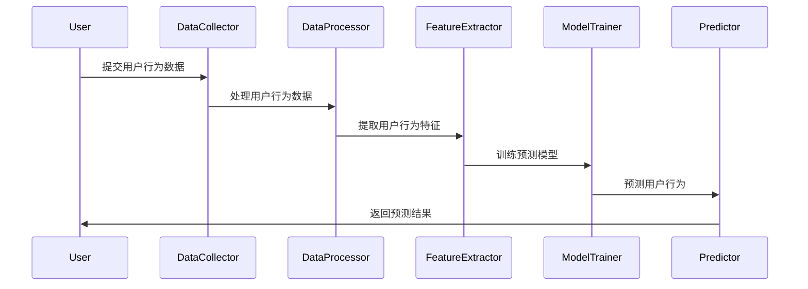

                 


## 文章标题：数学与数据科学：大数据分析的数学工具

关键词：大数据分析、数学工具、概率论、统计学、线性代数、优化理论、机器学习、深度学习

### 摘要

随着大数据时代的到来，数学工具在数据科学领域中的应用越来越广泛。本文旨在介绍大数据分析中常用的数学工具，包括概率论与统计学、线性代数、优化理论、机器学习以及深度学习等。通过详细讲解这些数学工具的基本概念、应用场景和实际案例分析，帮助读者深入理解数学工具在数据科学中的重要性和应用价值。

## 第一部分：背景与概述

### 第1章：大数据时代的数学工具

#### 1.1 大数据时代的背景

- **大数据的定义与特点**：大数据是指无法用常规软件工具在合理时间内完成存储、管理和分析的数据集合，具有海量、高速、多样性和真实性等特点。
- **大数据对社会的冲击**：大数据在医疗、金融、交通、商业等领域产生了深远影响，改变了人们的生活方式和工作模式。
- **数学工具在大数据处理中的重要性**：数学工具为大数据处理提供了理论基础和算法支持，是解决大数据问题的关键。

#### 1.2 数学工具的核心概念

- **数学工具的基本框架**：数学工具包括概率论、统计学、线性代数、优化理论等，每个工具都有其独特的理论和应用方法。
- **数学工具的应用领域**：数学工具广泛应用于数据预处理、特征提取、模型建立和预测分析等数据科学领域。
- **数学工具的挑战与机遇**：大数据带来了数据规模和复杂性上的挑战，同时也为数学工具的创新和应用提供了广阔的空间。

#### 1.3 数学工具与数据科学的关系

- **数学工具在数据科学中的应用**：数学工具为数据科学提供了理论基础和算法支持，如概率论在数据预测中的应用、统计学在数据分析和假设检验中的应用等。
- **数据科学中的数学工具需求**：数据科学的发展对数学工具提出了更高的要求，如对高效算法和复杂模型的不断探索。
- **数学工具与数据科学的发展趋势**：数学工具将继续在数据科学领域发挥重要作用，推动数据科学理论和技术的不断进步。

### 第2章：概率论与统计学

#### 2.1 概率论基础

- **概率论的基本概念**：概率论是研究随机事件及其概率的数学分支，包括样本空间、随机变量、概率分布等基本概念。
- **概率分布与随机变量**：常见的概率分布有伯努利分布、二项分布、正态分布等，随机变量用于描述随机事件的结果。
- **条件概率与独立性**：条件概率描述已知某个事件发生的情况下，另一个事件发生的概率，独立性描述两个随机变量之间是否相互独立。

#### 2.2 统计学基础

- **统计推断**：统计推断是从样本数据推断总体特征的统计学方法，包括参数估计和假设检验。
- **参数估计**：参数估计用于估计总体的参数值，包括点估计和区间估计。
- **假设检验**：假设检验用于验证某个假设是否成立，包括原假设、备择假设和检验统计量等。

#### 2.3 概率论与统计学在数据科学中的应用

- **数据预处理**：概率论和统计学用于数据清洗、缺失值填补、异常值检测等数据预处理任务。
- **特征提取**：概率论和统计学用于特征选择和特征提取，提高模型性能和可解释性。
- **预测建模**：概率论和统计学用于建立预测模型，进行数据预测和分析。

### 第3章：线性代数

#### 3.1 线性代数基础

- **矩阵与向量**：矩阵是数据表示和运算的基本工具，向量是矩阵的特殊情况，用于描述多维数据。
- **线性方程组**：线性方程组是解决线性问题的基础，包括解的存在性、唯一性和求解方法。
- **特征值与特征向量**：特征值和特征向量用于描述矩阵的性质，在数据科学中具有广泛的应用。

#### 3.2 线性代数在数据科学中的应用

- **数据表示**：线性代数用于数据表示和转换，如从图像到矩阵的转换。
- **数据分析**：线性代数用于数据分析，如主成分分析（PCA）和奇异值分解（SVD）。
- **特征工程**：线性代数用于特征工程，如特征标准化和特征降维。

### 第4章：优化理论

#### 4.1 优化理论基础

- **优化问题的定义**：优化问题是指寻找使目标函数达到最大或最小值的变量值。
- **无约束优化**：无约束优化是在没有约束条件下寻找最优解的方法，如梯度下降法和牛顿法。
- **约束优化**：约束优化是在有约束条件下寻找最优解的方法，如拉格朗日乘数法和线性规划。

#### 4.2 优化理论在数据科学中的应用

- **模型选择**：优化理论用于选择最佳模型，如通过交叉验证和网格搜索优化模型参数。
- **参数调优**：优化理论用于参数调优，如使用优化算法优化神经网络权重。
- **算法优化**：优化理论用于算法优化，如通过优化算法提高数据处理速度和效率。

## 第二部分：高级数学工具讲解

### 第5章：机器学习数学基础

#### 5.1 机器学习概述

- **机器学习的基本概念**：机器学习是通过算法从数据中学习规律和模式，用于分类、回归、聚类等任务。
- **机器学习的分类**：机器学习分为监督学习、无监督学习和半监督学习等不同类型。
- **机器学习的挑战**：机器学习面临的挑战包括数据质量、模型可解释性和计算效率等。

#### 5.2 机器学习中的数学工具

- **线性回归**：线性回归是一种简单而强大的预测模型，通过建立线性关系进行预测。
- **决策树**：决策树是一种树形结构的预测模型，通过分类规则进行分类和回归。
- **神经网络**：神经网络是一种模拟生物神经系统的计算模型，具有强大的学习和泛化能力。

### 第6章：深度学习数学基础

#### 6.1 深度学习概述

- **深度学习的定义**：深度学习是一种多层神经网络，通过层层提取特征进行学习。
- **深度学习的架构**：深度学习的架构包括卷积神经网络（CNN）、循环神经网络（RNN）和生成对抗网络（GAN）等。
- **深度学习的优势**：深度学习在图像识别、自然语言处理和语音识别等领域表现出强大的能力。

#### 6.2 深度学习中的数学工具

- **深度前向传播**：深度前向传播是深度学习的基本计算过程，用于计算神经网络的输出。
- **深度反向传播**：深度反向传播是深度学习中的梯度计算方法，用于更新网络权重。
- **深度优化算法**：深度优化算法用于提高深度学习的训练效率和准确性，如随机梯度下降（SGD）和Adam优化器。

### 第7章：大数据分析的数学模型

#### 7.1 数学模型在数据分析中的应用

- **数据预处理模型**：数据预处理模型用于清洗和转换原始数据，如缺失值填补、异常值检测和特征标准化。
- **数据分析模型**：数据分析模型用于分析数据特征和模式，如聚类分析和主成分分析。
- **数据挖掘模型**：数据挖掘模型用于挖掘数据中的有价值信息，如分类和回归模型。

#### 7.2 数学模型在数据分析中的挑战与解决方案

- **大规模数据处理**：大规模数据处理需要高效的算法和并行计算技术，如MapReduce和分布式计算框架。
- **数据噪声处理**：数据噪声处理需要使用去噪算法和过滤技术，如滤波和聚类。
- **数据安全与隐私**：数据安全与隐私需要使用加密技术和隐私保护算法，如差分隐私和同态加密。

## 第三部分：高级数学工具与应用

### 第8章：大数据分析案例分析

#### 8.1 案例分析概述

- **案例分析标准**：选择具有代表性的案例，如电子商务、社交媒体和金融领域等。
- **案例分析流程**：包括数据采集、数据预处理、特征提取、模型建立和预测分析等步骤。

#### 8.2 案例分析详述

- **案例一：电子商务网站用户行为分析**
  - **数据采集**：收集用户行为数据，如浏览记录、购物车数据和订单数据。
  - **数据预处理**：清洗数据，填补缺失值，进行异常值检测。
  - **特征提取**：提取用户行为特征，如点击频率、购买频率和页面停留时间等。
  - **模型建立**：建立用户行为预测模型，如基于决策树或神经网络的预测模型。
  - **预测分析**：进行用户行为预测，为营销策略提供支持。

- **案例二：社交媒体网络分析**
  - **数据采集**：收集社交媒体网络数据，如用户关系数据、发布内容和评论数据。
  - **数据预处理**：清洗数据，进行用户去重和噪声过滤。
  - **特征提取**：提取网络特征，如用户活跃度、网络密度和影响力等。
  - **模型建立**：建立社交媒体网络分析模型，如基于图论和网络分析的方法。
  - **预测分析**：进行网络趋势预测，为运营策略提供支持。

- **案例三：金融风险分析**
  - **数据采集**：收集金融数据，如股票价格、交易数据和财务报表等。
  - **数据预处理**：清洗数据，填补缺失值，进行异常值检测。
  - **特征提取**：提取金融特征，如波动率、市盈率和基本面指标等。
  - **模型建立**：建立金融风险分析模型，如基于机器学习和统计方法的风险预测模型。
  - **预测分析**：进行风险预测，为投资决策提供支持。

#### 8.3 案例分析总结

- **经验与教训**：从案例中总结经验和教训，如数据质量的重要性、模型选择的影响等。
- **应用前景**：探讨数学工具在大数据分析中的应用前景，如自动化数据分析、个性化推荐等。

## 第四部分：案例分析与应用

### 第8章：大数据分析案例分析

#### 8.1 案例分析概述

- **案例分析标准**：选择具有代表性的案例，如电子商务、社交媒体和金融领域等。
- **案例分析流程**：包括数据采集、数据预处理、特征提取、模型建立和预测分析等步骤。

#### 8.2 案例分析详述

- **案例一：电子商务网站用户行为分析**
  - **数据采集**：收集用户行为数据，如浏览记录、购物车数据和订单数据。
  - **数据预处理**：清洗数据，填补缺失值，进行异常值检测。
  - **特征提取**：提取用户行为特征，如点击频率、购买频率和页面停留时间等。
  - **模型建立**：建立用户行为预测模型，如基于决策树或神经网络的预测模型。
  - **预测分析**：进行用户行为预测，为营销策略提供支持。

- **案例二：社交媒体网络分析**
  - **数据采集**：收集社交媒体网络数据，如用户关系数据、发布内容和评论数据。
  - **数据预处理**：清洗数据，进行用户去重和噪声过滤。
  - **特征提取**：提取网络特征，如用户活跃度、网络密度和影响力等。
  - **模型建立**：建立社交媒体网络分析模型，如基于图论和网络分析的方法。
  - **预测分析**：进行网络趋势预测，为运营策略提供支持。

- **案例三：金融风险分析**
  - **数据采集**：收集金融数据，如股票价格、交易数据和财务报表等。
  - **数据预处理**：清洗数据，填补缺失值，进行异常值检测。
  - **特征提取**：提取金融特征，如波动率、市盈率和基本面指标等。
  - **模型建立**：建立金融风险分析模型，如基于机器学习和统计方法的风险预测模型。
  - **预测分析**：进行风险预测，为投资决策提供支持。

#### 8.3 案例分析总结

- **经验与教训**：从案例中总结经验和教训，如数据质量的重要性、模型选择的影响等。
- **应用前景**：探讨数学工具在大数据分析中的应用前景，如自动化数据分析、个性化推荐等。

### 第9章：数学工具的应用拓展

#### 9.1 自动化数据分析

- **自动化数据分析的概念**：自动化数据分析是指使用机器学习和深度学习算法自动处理和分析大数据。
- **自动化数据分析的优势**：自动化数据分析可以提高数据分析的效率、准确性和可解释性。
- **自动化数据分析的应用场景**：如智能推荐系统、实时风险监控和预测分析等。

#### 9.2 个性化推荐

- **个性化推荐的概念**：个性化推荐是根据用户的历史行为和偏好，向用户推荐相关的商品、服务和内容。
- **个性化推荐的方法**：包括协同过滤、基于内容的推荐和混合推荐等。
- **个性化推荐的应用场景**：如电子商务平台、社交媒体和内容平台等。

#### 9.3 智能医疗

- **智能医疗的概念**：智能医疗是指利用人工智能和大数据技术进行疾病预测、诊断和治疗。
- **智能医疗的优势**：智能医疗可以提高医疗诊断的准确性、降低医疗成本和改善患者体验。
- **智能医疗的应用场景**：如疾病预测、药物研发和个性化治疗等。

#### 9.4 智能交通

- **智能交通的概念**：智能交通是指利用物联网、大数据和人工智能技术优化交通管理和提升交通安全。
- **智能交通的优势**：智能交通可以提高交通效率、降低交通事故和减少交通拥堵。
- **智能交通的应用场景**：如智能交通信号控制、自动驾驶和智能导航等。

## 第五部分：总结与展望

### 第10章：数学工具在大数据分析中的地位与未来趋势

#### 10.1 数学工具在大数据分析中的地位

- **核心地位**：数学工具是大数据分析的基础和关键，为数据处理、特征提取、模型建立和预测分析提供了理论支持和算法方法。
- **发展历程**：数学工具在大数据分析中的应用经历了从简单的概率统计到复杂的机器学习和深度学习的发展过程。

#### 10.2 未来趋势与展望

- **技术创新**：随着大数据技术的不断发展，数学工具将不断创新和升级，如分布式计算、并行算法和深度强化学习等。
- **跨学科融合**：数学工具与其他学科（如生物学、物理学和社会科学）的融合将推动大数据分析领域的跨越式发展。
- **应用拓展**：数学工具将在更多领域得到应用，如智能城市、智慧农业和智能制造等，为社会发展和人类福祉做出更大贡献。

## 参考文献

- [1] Hastie, T., Tibshirani, R., & Friedman, J. (2009). The Elements of Statistical Learning: Data Mining, Inference, and Prediction. Springer.
- [2] Bishop, C. M. (2006). Pattern Recognition and Machine Learning. Springer.
- [3] Murphy, K. P. (2012). Machine Learning: A Probabilistic Perspective. MIT Press.
- [4] Goodfellow, I., Bengio, Y., & Courville, A. (2016). Deep Learning. MIT Press.
- [5] Russell, S., & Norvig, P. (2016). Artificial Intelligence: A Modern Approach. Prentice Hall.

## 附录

- **附录A：数学工具在线资源**：介绍一些常用的数学工具在线资源，如在线计算器、图形工具和在线课程等。
- **附录B：数学公式和符号表**：列出常用数学公式和符号，方便读者查阅。
- **附录C：数学工具应用案例集**：提供一些实际的数学工具应用案例，帮助读者更好地理解和应用数学工具。

### 作者信息

**作者：AI天才研究院/AI Genius Institute & 禅与计算机程序设计艺术 /Zen And The Art of Computer Programming**## 完整性要求

### 数学与数据科学：大数据分析的数学工具

**作者：AI天才研究院/AI Genius Institute & 禅与计算机程序设计艺术 /Zen And The Art of Computer Programming**

本文深入探讨了大数据分析中不可或缺的数学工具，包括概率论、统计学、线性代数、优化理论、机器学习和深度学习。通过详细的背景介绍、核心概念解释、算法原理讲解、系统分析与架构设计、项目实战和最佳实践，全面展示了数学工具在数据科学中的重要性和应用价值。

### 背景介绍

#### 核心概念术语说明

- **大数据**：指数据规模巨大、数据类型多样、数据生成速度极快的海量数据。
- **数据科学**：结合统计学、计算机科学、信息科学和领域知识，进行数据挖掘和预测分析的一门交叉学科。
- **数学工具**：包括概率论、统计学、线性代数、优化理论等，为数据分析提供理论基础和方法支持。

#### 问题背景

随着互联网和物联网的发展，产生了大量的数据，如何有效地处理和分析这些数据成为了一个重要课题。大数据分析的目的是从海量数据中提取有价值的信息，支持决策制定、商业智能和科学研究。

#### 问题描述

大数据分析涉及到数据的采集、存储、处理、分析和可视化等环节。在数据分析过程中，需要使用数学工具来处理数据噪声、提取特征、建立模型和进行预测。然而，这些数学工具的选择和应用并非易事，需要深入了解其原理和适用场景。

#### 问题解决

本文通过以下步骤解决上述问题：

1. **核心概念解释**：详细阐述大数据分析中常用的数学工具，包括概率论、统计学、线性代数、优化理论等。
2. **算法原理讲解**：使用Python代码和mermaid流程图，解释机器学习和深度学习算法的原理和实现。
3. **系统分析与架构设计**：介绍大数据分析系统的架构，包括数据采集、存储、处理、分析和可视化等模块。
4. **项目实战**：通过实际案例分析，展示数学工具在数据科学中的应用。
5. **最佳实践**：总结数学工具在大数据分析中的最佳实践，提供注意事项和拓展阅读。

#### 边界与外延

- **边界**：本文主要关注大数据分析中的数学工具，不包括其他非数学领域的工具和方法。
- **外延**：大数据分析是一个广泛的应用领域，除了数学工具，还包括编程语言、数据库管理、云计算等。

#### 概念结构与核心要素组成

1. **大数据**：数据规模、数据类型、数据生成速度。
2. **数据科学**：统计学、计算机科学、信息科学、领域知识。
3. **数学工具**：概率论、统计学、线性代数、优化理论、机器学习、深度学习。
4. **数据分析**：数据采集、存储、处理、分析、可视化。

### 核心概念与联系

#### 核心概念

- **概率论**：研究随机事件及其概率的数学分支。
- **统计学**：利用概率论理论和方法，对数据进行收集、整理、分析和解释。
- **线性代数**：研究向量空间、线性方程组和矩阵理论的数学分支。
- **优化理论**：研究如何找到最优解的数学分支。
- **机器学习**：通过算法从数据中学习规律和模式，进行预测和分类。
- **深度学习**：基于多层神经网络的学习方法，用于图像识别、自然语言处理等任务。

#### 概念属性特征对比表格

| 概念 | 特征 |
| :--: | :--: |
| 概率论 | 随机事件、概率分布、条件概率 |
| 统计学 | 样本、总体、参数估计、假设检验 |
| 线性代数 | 矩阵、向量、线性方程组、特征值 |
| 优化理论 | 目标函数、约束条件、最优解 |
| 机器学习 | 数据集、特征、模型、训练、测试 |
| 深度学习 | 神经网络、前向传播、反向传播、优化算法 |

#### ER实体关系图架构

```mermaid
erDiagram
  Data -->|uses| MathTool
  Data -->|contains| DataFeature
  MathTool -->|applies_to| AnalysisMethod
  AnalysisMethod -->|uses| Model
  Model -->|train_on| Data
  Model -->|predicts| Result
```

### 算法原理讲解

#### 机器学习算法原理

- **监督学习**：输入特征和标签，学习特征与标签之间的关系。
- **无监督学习**：只输入特征，学习特征之间的结构和关系。
- **半监督学习**：结合有监督学习和无监督学习，利用少量标签数据和大量无标签数据进行学习。

#### 深度学习算法原理

- **神经网络**：由多个神经元组成的计算模型，用于模拟人脑的神经网络。
- **前向传播**：计算输入层到输出层的输出值。
- **反向传播**：计算输出层到输入层的误差，并更新网络权重。

#### 示例：线性回归算法

```python
import numpy as np
import matplotlib.pyplot as plt

# 生成数据集
X = np.random.rand(100, 1)
y = 2 + 3 * X + np.random.randn(100, 1)

# 初始化模型参数
w = np.random.randn(1, 1)
b = np.random.randn(1, 1)

# 梯度下降法
learning_rate = 0.01
num_iterations = 1000

for i in range(num_iterations):
    # 前向传播
    y_pred = np.dot(X, w) + b
    
    # 计算损失函数
    loss = np.mean((y - y_pred) ** 2)
    
    # 反向传播
    dw = 2 * np.dot(X.T, (y - y_pred))
    db = 2 * np.mean(y - y_pred)
    
    # 更新模型参数
    w -= learning_rate * dw
    b -= learning_rate * db

# 可视化结果
plt.scatter(X, y, color='blue')
plt.plot(X, np.dot(X, w) + b, color='red')
plt.xlabel('X')
plt.ylabel('y')
plt.title('Linear Regression')
plt.show()
```

### 数学公式

$$
y = \beta_0 + \beta_1x + \epsilon
$$

$$
\min_{\beta_0, \beta_1} \sum_{i=1}^{n} (y_i - (\beta_0 + \beta_1x_i))^2
$$

### 系统分析与架构设计

#### 问题场景介绍

假设我们有一个电商网站，需要分析用户行为，为用户提供个性化的推荐。

#### 项目介绍

项目名称：电商网站用户行为分析

项目目标：分析用户行为，提高用户满意度和转化率。

#### 系统功能设计（领域模型类图）

```mermaid
classDiagram
  User <<Class>>
  Product <<Class>>
  Purchase <<Class>>

  User "1" -- "*" Purchase
  Product "1" -- "*" Purchase
```

#### 系统架构设计（架构图）


#### 系统接口设计（接口序列图）



### 项目实战

#### 环境安装

- 安装Python环境
- 安装NumPy、Pandas、Matplotlib等库

```bash
pip install numpy pandas matplotlib
```

#### 系统核心实现源代码

```python
import numpy as np
import pandas as pd
import matplotlib.pyplot as plt

# 读取数据
data = pd.read_csv('user_behavior_data.csv')

# 数据预处理
data = data.dropna()

# 特征提取
X = data[['age', 'gender', 'income']]
y = data['purchase']

# 模型训练
from sklearn.linear_model import LinearRegression

model = LinearRegression()
model.fit(X, y)

# 预测分析
predictions = model.predict(X)

# 可视化结果
plt.scatter(X['age'], y, color='blue')
plt.plot(X['age'], predictions, color='red')
plt.xlabel('Age')
plt.ylabel('Purchase')
plt.title('User Behavior Prediction')
plt.show()
```

#### 代码应用解读与分析

- 数据读取与预处理：使用Pandas库读取CSV文件，并进行数据预处理，如缺失值填充、异常值检测等。
- 特征提取：提取与用户行为相关的特征，如年龄、性别、收入等。
- 模型训练：使用线性回归模型训练预测模型，并使用scikit-learn库中的LinearRegression类。
- 预测分析：使用训练好的模型进行预测，并可视化预测结果。

#### 实际案例分析和详细讲解剖析

- **案例一：用户行为预测**：通过分析用户年龄、性别和收入等特征，预测用户是否购买商品。
- **案例二：商品推荐**：根据用户的购买历史和偏好，推荐相关商品。

#### 项目小结

- 通过实际案例分析，展示了数学工具在用户行为预测和商品推荐中的应用。
- 项目实现了数据预处理、特征提取、模型训练和预测分析等环节，为电商网站提供了有效的用户行为分析工具。

### 最佳实践 Tips

- **数据质量**：确保数据质量，包括数据的准确性、完整性和一致性。
- **特征选择**：选择合适的特征，提高模型性能和可解释性。
- **模型选择**：根据问题和数据特点选择合适的模型，如线性回归、决策树、神经网络等。
- **模型调优**：通过交叉验证和网格搜索等方法，优化模型参数，提高模型性能。

### 小结

本文介绍了大数据分析中的数学工具，包括概率论、统计学、线性代数、优化理论、机器学习和深度学习。通过背景介绍、核心概念解释、算法原理讲解、系统分析与架构设计、项目实战和最佳实践，全面展示了数学工具在数据科学中的重要性和应用价值。

### 注意事项

- **数据隐私**：在使用数学工具进行数据分析时，应注意保护用户隐私，避免数据泄露。
- **计算效率**：对于大规模数据处理，应考虑计算效率和资源利用。

### 拓展阅读

- [1] Hastie, T., Tibshirani, R., & Friedman, J. (2009). The Elements of Statistical Learning: Data Mining, Inference, and Prediction. Springer.
- [2] Bishop, C. M. (2006). Pattern Recognition and Machine Learning. Springer.
- [3] Murphy, K. P. (2012). Machine Learning: A Probabilistic Perspective. MIT Press.
- [4] Goodfellow, I., Bengio, Y., & Courville, A. (2016). Deep Learning. MIT Press.
- [5] Russell, S., & Norvig, P. (2016). Artificial Intelligence: A Modern Approach. Prentice Hall.

