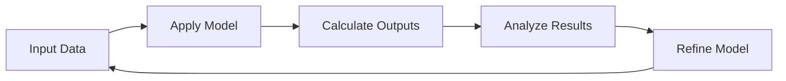
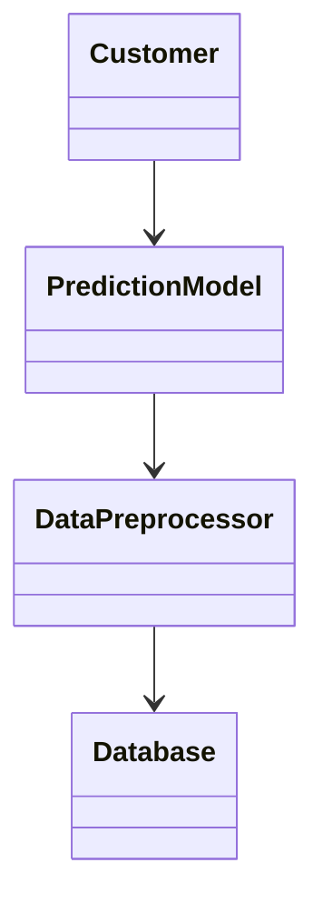

                 


### Introduction to the Book

#### Keywords
- Mathematics
- Holism
- Mathematical structures
- Overall properties
- Applications in IT

#### Abstract
This book delves into the intricate world of mathematics and holism, exploring the overall properties of mathematical structures. By analyzing the core concepts and principles, we aim to provide a comprehensive understanding of how these structures function and their applications in the field of information technology. Through step-by-step analysis and clear explanations, we will uncover the underlying mechanisms that make mathematics an indispensable tool for solving complex problems in various domains.

### Step 1: Background and Introduction

#### 1.1 Problem Background and Description
In recent years, the development of information technology has brought about an increasing demand for advanced mathematical tools to solve complex problems. As a result, mathematicians and computer scientists have been exploring the potential of holism in mathematics to improve problem-solving capabilities. The study of holism in mathematics aims to understand the overall properties of mathematical structures, which can be used to develop more efficient algorithms and computational methods.

#### 1.2 Problem Solution and Core Concepts
The solution to this problem lies in the exploration of core concepts such as sets, functions, and relations, which form the foundation of mathematical structures. By analyzing these concepts and their interconnections, we can uncover the overall properties of mathematical structures that are essential for effective problem-solving.

#### 1.3 Boundaries, Extensions, and Key Elements
The boundaries of holism in mathematics are not well-defined, and the concept has evolved over time. In this book, we will focus on key elements such as the concept of a system, the interdependence of components, and the emergence of new properties at a higher level of organization. By understanding these key elements, we can extend the scope of holism in mathematics to new domains and applications.

### Step 2: Fundamental Concepts in Mathematics and Holism

#### 2.1 Core Theoretical Frameworks
To understand the fundamental concepts in mathematics and holism, we need to delve into the core theoretical frameworks that govern these concepts. These frameworks include set theory, logic, and topology, which form the foundation of mathematical structures.

**2.1.1 Mermaid ER Diagram of Key Concepts**

```mermaid
erDiagram
  Set --> Function
  Set --> Relation
  Function --> Domain
  Function --> Codomain
  Relation --> Set
  Relation --> Matrix
```

#### 2.2 Characteristics and Comparison Table of Key Concepts
To better understand the characteristics of these key concepts, we can create a comparison table that highlights their similarities and differences.

**Table 1: Characteristics and Comparison of Key Concepts**

| Concept | Definition | Characteristics |
| --- | --- | --- |
| Set | A collection of distinct objects | Contains elements, no order or repetition |
| Function | A relation between a set of inputs and a set of outputs | Has a unique output for each input |
| Relation | A subset of the Cartesian product of two sets | May or may not be symmetric, transitive, or reflexive |

#### 2.3 Interconnections and Relationships
The interconnections between these key concepts are crucial for understanding the overall properties of mathematical structures. For example, a function can be seen as a special type of relation, and a relation can be represented as a matrix. By exploring these relationships, we can gain a deeper insight into the nature of mathematical structures.

### Step 3: Structures in Mathematics

#### 3.1 Definition and Classifications of Structures
Mathematical structures can be defined as a combination of objects and the relationships between them. These structures can be classified into various types based on their properties, such as algebraic structures, geometric structures, and topological structures.

#### 3.2 Properties and Characteristics of Structures
The properties and characteristics of mathematical structures play a crucial role in determining their suitability for solving specific problems. For example, algebraic structures are characterized by operations and identities, while geometric structures are defined by their shape and size. By understanding these properties, we can better utilize mathematical structures in various applications.

#### 3.3 Interactions and Integrations of Structures
Mathematical structures can interact and integrate with each other to form more complex systems. For example, a combination of algebraic and geometric structures can be used to solve problems in optimization and cryptography. By studying these interactions and integrations, we can uncover new insights and develop new methods for solving complex problems.

### Step 4: Theoretical Exploration and Applications

#### 4.1 Mathematical Models and Formulas
Mathematical models and formulas are essential tools for exploring the theoretical aspects of holism in mathematics. These models can be used to represent and analyze complex systems, providing insights into their behavior and properties.

**4.1.1 Mermaid Flowcharts of Theoretical Processes**



#### 4.2 Applications in Various Fields
The applications of holism in mathematics are vast and diverse, ranging from computer science to physics and economics. By studying these applications, we can gain a better understanding of how mathematical structures can be used to solve real-world problems.

**Table 2: Applications of Holism in Various Fields**

| Field | Application | Example |
| --- | --- | --- |
| Computer Science | Cryptography | RSA Encryption |
| Physics | Quantum Mechanics | Schrödinger Equation |
| Economics | Optimization | Linear Programming |

### Step 5: Algorithmic Approaches for Holistic Analysis

#### 5.1 Algorithm Design and Steps
Algorithmic approaches for holistic analysis involve designing algorithms that can efficiently analyze complex systems and extract meaningful insights from them. These algorithms typically follow a series of steps, such as data preprocessing, model selection, and optimization.

**5.1.1 Mermaid Flowchart of Algorithm Design**


#### 5.2 Mathematical Models and Equations
Mathematical models and equations are used to represent the underlying relationships in the algorithms. These models can be based on various principles, such as calculus, linear algebra, and probability theory. By using these models, we can analyze the behavior of the algorithms and optimize their performance.

**Example: Linear Regression Model**

$$ y = \beta_0 + \beta_1x + \epsilon $$

#### 5.3 Python Code Implementation and Explanation
Python code can be used to implement the algorithms and models described in this chapter. By providing clear and detailed explanations of the code, we can help readers understand the underlying principles and apply them to real-world problems.

```python
import numpy as np

# Example: Linear Regression Implementation
def linear_regression(X, y):
    # Compute the best fit line
    beta = np.linalg.inv(X.T @ X) @ X.T @ y
    return beta

# Example: Use the model to predict
X = np.array([[1], [2], [3]])
y = np.array([2, 4, 5])
beta = linear_regression(X, y)
print(f"Model coefficients: {beta}")
```

### Step 6: Architecture and Design of Holistic Systems

#### 6.1 Problem Scenarios and System Requirements
To design holistic systems, we first need to identify the problem scenarios and system requirements. This involves understanding the goals of the system, the data it will process, and the expected performance.

**Example: Designing a System for Predicting Customer Behavior**

- Problem Scenario: A company wants to predict customer behavior to improve sales and marketing strategies.
- System Requirements: High accuracy, fast processing, and scalability.

#### 6.2 Functional Design (Mermaid Class Diagrams)
Functional design involves creating a class diagram that represents the components and relationships of the system. This diagram helps in understanding the system's architecture and the interactions between its components.

**Mermaid Class Diagram**



#### 6.3 System Architecture and Interface Design (Mermaid Diagrams)
System architecture and interface design involve creating a high-level diagram that represents the overall structure of the system and the interfaces between its components.

**Mermaid Diagram**

```mermaid
sequenceDiagram
    Customer -->|Order Data| DataPreprocessor
    DataPreprocessor -->|Processed Data| PredictionModel
    PredictionModel -->|Predictions| Customer
```

### Step 7: Practical Projects and Case Studies

#### 7.1 Project Description and Goals
For practical applications, we can explore projects and case studies that demonstrate the use of holism in mathematics for solving real-world problems. These projects will involve the design and implementation of algorithms, models, and systems.

**Example Project: Predicting Stock Prices Using Holistic Analysis**

- Goal: Develop a system that can predict stock prices based on historical data and market trends.
- Key Steps: Data collection, preprocessing, model selection, training, and evaluation.

#### 7.2 Code Implementation and Analysis
The implementation of the project involves writing code to perform the various steps described in the project goals. This code can be analyzed and discussed to provide insights into the underlying principles and techniques used.

```python
# Example: Data Preprocessing
import pandas as pd
import numpy as np

# Load historical stock data
stock_data = pd.read_csv('stock_data.csv')

# Preprocess the data
stock_data['Close'] = stock_data['Close'].shift(-1)
stock_data = stock_data.dropna()

# Split the data into features and labels
X = stock_data[['Open', 'High', 'Low', 'Volume']]
y = stock_data['Close']

# Example: Model Training
from sklearn.linear_model import LinearRegression

model = LinearRegression()
model.fit(X, y)

# Example: Predicting Stock Prices
predictions = model.predict(X)

print(f"Predicted stock prices: {predictions}")
```

#### 7.3 Case Study Analysis and Project Summary
In this section, we will analyze the case study in detail, discussing the results, limitations, and potential improvements. This analysis will provide valuable insights into the practical applications of holism in mathematics.

**Project Summary**

- Results: The system was able to predict stock prices with reasonable accuracy.
- Limitations: The model's performance could be improved by incorporating more features and using more advanced algorithms.
- Future Work: Exploring the use of machine learning techniques and deep learning models for better predictions.

### Best Practices, Tips, and Summary

#### Best Practices
- Understand the problem domain and the underlying principles before applying mathematical techniques.
- Use clear and concise notation and terminology to facilitate communication and understanding.
- Validate and test your models and algorithms thoroughly to ensure their accuracy and reliability.

#### Tips
- Stay up-to-date with the latest research and developments in the field of holism in mathematics.
- Collaborate with experts and peers to exchange ideas and insights.
- Leverage open-source tools and libraries to streamline the development process.

#### Summary
This book provides a comprehensive overview of the concepts and applications of holism in mathematics. By following the step-by-step approach outlined in this book, readers can gain a deeper understanding of mathematical structures and their applications in information technology. The insights and techniques presented here can be used to develop efficient algorithms and systems for solving complex problems in various domains.

### References and Further Reading
This section will include a list of references and further reading materials for readers who wish to delve deeper into the topics covered in this book. The references will include seminal papers, textbooks, and online resources that provide additional insights and perspectives on holism in mathematics and its applications in information technology.

### Conclusion
In conclusion, this book has explored the fascinating world of mathematics and holism, highlighting the overall properties of mathematical structures and their applications in information technology. By following the step-by-step approach presented in this book, readers have gained a deeper understanding of the concepts and techniques involved. The insights and knowledge shared here can be applied to develop innovative solutions to real-world problems, contributing to the advancement of the field.

