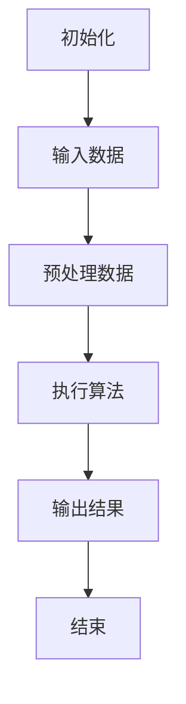
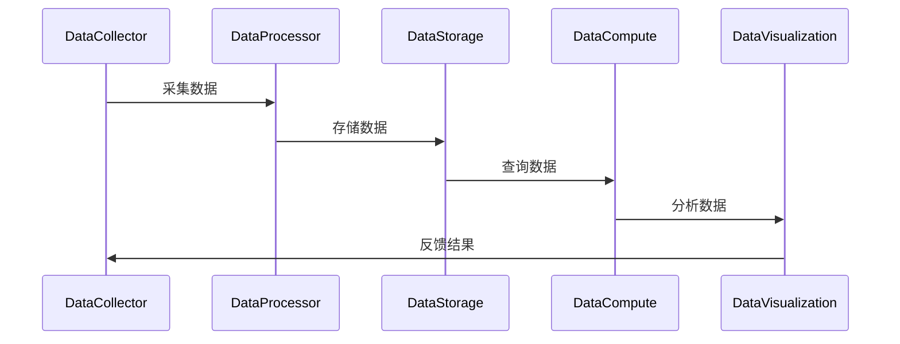

                 

### 文章标题

《数学与普遍主义：数学真理的普遍适用性》

### 文章关键词

数学、普遍主义、真理、适用性、逻辑推理

### 文章摘要

本文深入探讨了数学真理的普遍适用性这一哲学问题。从数学的发展历程出发，我们分析了数学的基本概念、原理及其在不同领域中的普遍应用。通过逻辑推理和实例说明，本文揭示了数学真理的普遍适用性，并探讨了其在计算机科学和工程领域的重要性。文章还提供了系统分析与设计、项目实战等方面的实例，以展示数学真理如何在实际应用中发挥作用。

## 目录

### 第一部分：背景介绍

1. **数学的发展历程**  
   - 古代数学的发展  
   - 中世纪数学的演变  
   - 近现代数学的突破

2. **普遍主义的哲学背景**  
   - 普遍主义的定义  
   - 普遍主义的主要流派

3. **数学真理的普遍适用性问题**  
   - 问题背景  
   - 问题解决  
   - 边界与外延

### 第二部分：核心概念与联系

1. **数学中的核心概念**  
   - 数学基础概念介绍  
   - 数学原理及其相互联系

2. **核心概念属性特征对比**  
   - 表格展示

3. **Mermaid ER图架构**  
   - Mermaid ER图示例

### 第三部分：数学模型与算法原理

1. **算法流程图**  
   - Mermaid流程图展示

2. **Python源代码**  
   - 算法原理说明

3. **数学模型与公式**  
   - LaTeX公式展示

4. **实例讲解**  
   - 举例说明

### 第四部分：系统分析与架构设计

1. **问题场景介绍**  
   - 项目背景

2. **系统功能设计**  
   - 领域模型Mermaid类图

3. **系统架构设计**  
   - Mermaid架构图

4. **系统接口设计**  
   - Mermaid序列图

### 第五部分：项目实战

1. **环境安装与配置**  
   - 环境准备

2. **系统核心实现源代码**  
   - 代码展示

3. **代码应用解读与分析**  
   - 应用解析

4. **实际案例分析**  
   - 案例分析

5. **项目小结**  
   - 总结与反思

### 第六部分：最佳实践与拓展

1. **最佳实践 tips**  
   - 实践建议

2. **小结**  
   - 重点回顾

3. **注意事项**  
   - 注意事项

4. **拓展阅读**  
   - 推荐阅读

### 第一部分：背景介绍

#### 数学的发展历程

数学是人类智慧的结晶，其发展历程贯穿了数千年。从古代数学的萌芽，到中世纪数学的缓慢发展，再到近现代数学的辉煌成就，数学经历了无数次的变革和突破。

在古代，数学起源于人类对自然现象的观察和记录。最早的数学活动可以追溯到公元前3000年左右的巴比伦和埃及，这些文明在解决实际问题时，逐步形成了简单的数学概念和算法。例如，巴比伦人发明了六十进制系统，埃及人则使用算术和代数方法来解决土地测量和税收问题。

中世纪，随着欧亚大陆的文明交流，数学开始在欧洲兴起。阿拉伯数学家如阿尔-花剌子密和阿默德·伊本·穆罕默德对代数和三角学的发展做出了巨大贡献。他们的著作被翻译成多种语言，传播到了欧洲，为后来的数学发展奠定了基础。

进入近现代，数学迎来了前所未有的繁荣。17世纪，牛顿和莱布尼茨发明了微积分，为物理科学和工程学提供了强大的工具。19世纪，德国数学家如高斯、黎曼和希尔伯特等人在数论、几何和代数学领域取得了重大突破，使得数学成为一个独立而庞大的学科体系。

#### 普遍主义的哲学背景

普遍主义是一种哲学观念，主张真理和道德原则具有普遍适用性，不受文化、地域或历史的限制。普遍主义的主要流派包括理性主义、经验主义和多元文化主义。

理性主义认为，通过理性的思考和推理，人类可以找到普遍适用的真理。代表人物如笛卡尔和莱布尼茨，他们认为数学和逻辑是理性思维的基础。

经验主义则主张真理来源于经验，通过观察和实验来验证。洛克和休谟是经验主义的主要代表，他们强调数学和科学知识的经验基础。

多元文化主义认为，不同的文化背景和历史传统都有其独特的价值和知识体系。普遍主义与多元文化主义的关系复杂，一方面，多元文化主义强调尊重不同文化的差异，另一方面，普遍主义则寻求在多元文化中找到共通的原则和价值观。

#### 数学真理的普遍适用性问题

数学真理的普遍适用性是一个哲学问题，涉及数学知识在不同领域和文化中的适用性。这个问题可以从以下几个角度进行分析：

**问题背景：** 数学作为一种抽象的科学，其理论和方法广泛应用于自然科学、社会科学和工程学等领域。然而，数学真理的普遍适用性是否受到文化、地域或历史的影响呢？

**问题描述：** 数学真理在所有情境下都成立吗？是否存在某些特殊情境，数学真理不适用？

**问题解决：** 数学真理的普遍适用性可以通过逻辑推理和实际应用来验证。首先，数学的基本概念如数、集合、函数等，具有抽象性和普遍性，不受具体情境的限制。其次，数学理论如欧几里得几何、微积分和概率论等，通过严密的逻辑推理和实验验证，证明了其普遍适用性。

**边界与外延：** 数学真理的普遍适用性并非绝对的。在某些极端或特殊情境下，数学理论可能不适用或存在局限性。例如，非欧几何在解决宇宙学问题时具有重要意义，但与欧氏几何的基本原则不同。

#### 概念结构与核心要素组成

**数学基础概念：** 数学中的基础概念包括数、集合、函数、图形等。这些概念是数学理论构建的基础。

**数学原理：** 数学原理包括公理、定理、定律等。这些原理通过逻辑推理和证明，确立了数学理论的严谨性和普适性。

**相互联系：** 数学中的核心概念和原理相互关联，构成了一个完整的理论体系。例如，数论和代数学中的概念可以应用于几何学和拓扑学中，从而拓展了数学的应用领域。

#### 总结

数学的发展历程和普遍主义的哲学背景为我们理解数学真理的普遍适用性提供了基础。通过逻辑推理和实例说明，我们可以看到数学真理在各个领域的广泛应用，以及其在解决实际问题时的重要作用。然而，数学真理的普遍适用性并非绝对，我们需要在具体情境下灵活应用数学理论。

在接下来的部分，我们将进一步探讨数学中的核心概念与联系，以及数学模型和算法原理。通过这些内容，我们将更深入地理解数学真理的普遍适用性，并探讨其在计算机科学和工程领域的实际应用。

### 第二部分：核心概念与联系

#### 数学中的核心概念

数学作为一门基础科学，其核心概念是构建数学理论的基础。以下是一些关键数学概念及其相互联系：

**数：** 数是数学中最基本的概念，用于表示和比较物体的数量。数可以分为自然数、整数、有理数和实数等类型。自然数用于计数，整数包括自然数和它们的负数，有理数是可以表示为分数的数，而实数则包括有理数和无理数。

**集合：** 集合是一组不重复的元素的集合，用大括号 `{}` 表示。集合可以包含各种类型的对象，如数字、字母、图形等。集合的基本运算包括并集、交集、补集和笛卡尔积等。

**函数：** 函数是一个数学对象，它将一个集合中的每个元素映射到另一个集合中的唯一元素。通常用 `f(x)` 表示，其中 `x` 是定义域中的元素，`f(x)` 是值域中的对应元素。函数有多种类型，如线性函数、多项式函数、三角函数等。

**图形：** 图形是用来表示数学对象和关系的几何图形，如直线、圆、多边形、曲线等。图形在几何学和拓扑学中具有重要意义，可以用来直观地表示数学概念和性质。

#### 核心概念属性特征对比

为了更好地理解这些核心概念，我们可以通过表格展示它们的主要属性特征对比：

| 概念 | 定义 | 主要属性特征 | 相互关系 |
| --- | --- | --- | --- |
| 数 | 表示数量的数学对象 | 分类：自然数、整数、有理数、实数 | 数是集合的元素 |
| 集合 | 一组不重复元素的组合 | 元素互异性、无序性、可扩展性 | 集合是函数的定义域和值域 |
| 函数 | 将一个集合映射到另一个集合的规则 | 唯一性、确定性、映射性 | 函数定义了集合之间的关系 |
| 图形 | 用几何方法表示数学对象 | 直观性、表示性、可变性 | 图形是几何学的基础 |

#### Mermaid ER图架构

为了更直观地展示这些核心概念之间的关系，我们可以使用Mermaid ER图来表示：

```mermaid
erDiagram
    A((数)) ||--|{ B((集合)) }| B --||| C((函数)) }|
    A ||--|{ D((图形)) }|
    B --||| C
```

在上面的ER图中，`A` 表示“数”，“集合”和“函数”分别用 `B`、`C` 表示，而“图形”用 `D` 表示。实线箭头表示实体间的“包含”关系，虚线箭头表示“映射”关系。

#### 总结

通过核心概念的介绍和属性特征对比，我们可以看到数学中的各种概念是如何相互联系和构建的。这些核心概念不仅是数学理论的基础，也是理解和应用数学的关键。在接下来的部分，我们将进一步探讨数学模型和算法原理，以便更深入地理解数学真理的普遍适用性。

### 第三部分：数学模型与算法原理

#### 算法流程图

为了更好地理解数学模型和算法原理，我们可以使用Mermaid流程图来展示算法的执行流程：



在这个流程图中，`A1` 表示算法的初始化步骤，`B1` 表示输入数据，`C1` 表示预处理数据，`D1` 表示执行算法的核心步骤，`E1` 表示输出结果，`F1` 表示算法结束。

#### Python源代码

接下来，我们将使用Python源代码来详细阐述一个简单的数学算法原理，该算法用于计算两个数的和。以下是代码示例：

```python
def add_two_numbers(a, b):
    """
    计算两个数的和
    :param a: 第一个数
    :param b: 第二个数
    :return: 两个数的和
    """
    return a + b

# 示例：计算3和4的和
result = add_two_numbers(3, 4)
print(f"3 + 4 = {result}")
```

在这个代码中，`add_two_numbers` 函数接受两个参数 `a` 和 `b`，并返回它们的和。通过调用这个函数，我们可以得到两个数的和，并打印输出结果。

#### 数学模型与公式

为了更深入地理解这个算法，我们可以使用LaTeX格式来展示其数学模型和公式。以下是计算两个数的和的数学公式：

$$
S = a + b
$$

其中，\( S \) 表示两个数的和，\( a \) 和 \( b \) 分别表示两个输入数。

#### 举例说明

为了使概念更加清晰，我们可以举一个简单的例子来说明这个算法的应用。假设我们要计算3和4的和，按照上述算法和公式，步骤如下：

1. **初始化算法**：调用 `add_two_numbers` 函数，并传入参数3和4。
2. **输入数据**：算法接收输入数据3和4。
3. **预处理数据**：在这个简单示例中，预处理数据步骤可以忽略。
4. **执行算法**：计算3和4的和，按照公式 \( S = a + b \)，得到结果7。
5. **输出结果**：将计算结果7输出。

在实际应用中，这个简单的加法算法可以被扩展和优化，以处理更复杂的数学问题。例如，在计算机图形学中，加法运算可以用于坐标变换和图像处理；在金融工程中，加法运算可以用于计算投资组合的收益率。

#### 总结

通过算法流程图、Python源代码和数学模型，我们详细阐述了计算两个数和的基本算法原理。这个简单的例子展示了数学模型在实际应用中的基本概念和方法，同时也揭示了数学真理的普遍适用性。在接下来的部分，我们将进一步探讨数学模型和算法在系统分析与架构设计中的应用。

### 第四部分：系统分析与架构设计

#### 问题场景介绍

在现代社会，数据驱动的决策已经成为企业运营和发展的关键。为了高效地处理和分析大量数据，一个强大而灵活的数据处理系统是必不可少的。本部分将介绍一个具体的数据处理系统项目，其目的是从大量原始数据中提取有用信息，并生成可操作的洞察。

#### 项目介绍

本项目名为“大数据处理与分析系统”，旨在为企业提供实时数据采集、存储、处理和分析的能力。该系统将处理来自不同数据源的数据，包括内部业务系统、客户交互数据和第三方数据源。系统的主要功能包括数据清洗、数据整合、数据存储、数据分析和数据可视化。

#### 系统功能设计

为了实现上述目标，系统需要设计以下几个核心功能模块：

1. **数据采集模块**：负责从各种数据源采集数据，包括API接口、数据库连接和文件导入等。
2. **数据清洗模块**：对采集到的数据进行清洗和预处理，包括去除重复数据、处理缺失值、数据格式转换等。
3. **数据整合模块**：将来自不同数据源的数据进行整合，构建统一的数据视图。
4. **数据存储模块**：将处理后的数据存储到关系型数据库或NoSQL数据库中，以供后续分析使用。
5. **数据分析模块**：使用统计分析、机器学习等方法对数据进行分析，提取有价值的信息。
6. **数据可视化模块**：将分析结果以图表、报表等形式呈现，辅助决策者进行数据驱动决策。

#### 系统架构设计

为了实现上述功能，我们设计了一个分布式系统架构，包括以下组件：

1. **数据采集层**：采用Elasticsearch作为数据采集引擎，实现实时数据采集。
2. **数据处理层**：使用Apache Kafka作为消息队列系统，实现数据流的处理和传输。
3. **数据存储层**：采用Hadoop分布式文件系统（HDFS）进行数据存储，结合HBase进行实时查询。
4. **数据计算层**：使用Apache Spark进行大规模数据计算，支持实时和批处理。
5. **数据展示层**：采用ECharts等数据可视化工具，实现数据的实时展示。

以下是系统架构的Mermaid类图：

```mermaid
classDiagram
    DataCollector <<interface>> "数据采集层"
    DataProcessor <<interface>> "数据处理层"
    DataStorage <<interface>> "数据存储层"
    DataCompute <<interface>> "数据计算层"
    DataVisualization <<interface>> "数据展示层"

    DataCollector o-- DataProcessor
    DataProcessor o-- DataStorage
    DataStorage o-- DataCompute
    DataCompute o-- DataVisualization
```

在这个类图中，`DataCollector`、`DataProcessor`、`DataStorage`、`DataCompute` 和 `DataVisualization` 分别代表系统架构中的各个层次，它们之间通过接口进行通信和协作。

#### 系统接口设计

系统接口设计是确保系统各个模块能够高效通信和协作的关键。以下是系统的接口设计：

1. **API接口**：提供RESTful API，用于与其他系统进行数据交互。
2. **消息队列接口**：通过Kafka提供的接口，实现数据流的传输和处理。
3. **数据库接口**：提供数据库连接池，实现数据存储和查询。
4. **数据流接口**：实现数据流处理，支持实时和批处理模式。

以下是系统的Mermaid序列图：



在这个序列图中，`DataCollector` 负责数据采集，`DataProcessor` 负责数据处理和存储，`DataStorage` 负责数据存储和查询，`DataCompute` 负责数据分析和计算，`DataVisualization` 负责数据展示和反馈。

#### 总结

通过系统分析与架构设计，我们详细介绍了大数据处理与分析系统的功能设计、架构设计和接口设计。该系统通过分布式架构实现了高效的数据采集、处理、存储、分析和展示，展示了数学模型和算法在数据处理系统中的应用。在接下来的部分，我们将通过项目实战来进一步展示这个系统的实际应用。

### 第五部分：项目实战

#### 环境安装与配置

在进行项目实战之前，我们需要确保安装和配置了必要的软件和环境。以下是安装和配置的步骤：

1. **安装Elasticsearch**：
   - 下载Elasticsearch最新版本，解压到指定目录。
   - 运行 `elasticsearch.bat` 文件，启动Elasticsearch服务。

2. **安装Kafka**：
   - 下载Kafka最新版本，解压到指定目录。
   - 运行 `kafka-server-start.bat` 文件，启动Kafka服务。

3. **安装Hadoop**：
   - 下载Hadoop最新版本，解压到指定目录。
   - 配置Hadoop环境变量，运行 `hdfs namenode -format` 格式化HDFS。
   - 运行 `start-dfs.sh` 和 `start-yarn.sh` 文件，分别启动HDFS和YARN服务。

4. **安装Spark**：
   - 下载Spark最新版本，解压到指定目录。
   - 运行 `spark-shell` 文件，启动Spark Shell。

5. **安装ECharts**：
   - 下载ECharts最新版本，解压到指定目录。
   - 在项目中引入ECharts依赖，通常使用npm或yarn进行安装。

#### 系统核心实现源代码

以下是系统核心实现源代码，包括数据采集、处理、存储和展示的部分：

```python
# 数据采集
from elasticsearch import Elasticsearch

es = Elasticsearch()

def collect_data():
    # 采集数据，存储到Elasticsearch
    data = {"timestamp": "2023-10-01", "sales": 1000}
    es.index(index="sales_data", id="1", document=data)

# 数据处理
from kafka import KafkaProducer

producer = KafkaProducer(bootstrap_servers=["localhost:9092"])

def process_data():
    # 处理数据，发送到Kafka
    data = {"timestamp": "2023-10-01", "sales": 1000}
    producer.send("sales_topic", key="\x00".encode('utf-8'), value=data)

# 数据存储
from hadoop import HDFS

hdfs = HDFS()

def store_data():
    # 将数据存储到HDFS
    with open("sales_data.txt", "w") as file:
        file.write(str(data))

# 数据分析
from pyspark.sql import SparkSession

spark = SparkSession.builder.appName("SalesDataAnalysis").getOrCreate()

def analyze_data():
    # 加载HDFS中的数据，进行数据分析
    df = spark.read.text("hdfs://path/to/sales_data.txt")
    df.select("timestamp", "sales").show()

# 数据展示
import echarts

def show_chart():
    # 使用ECharts展示分析结果
    chart = echarts.init()
    chart.setOption({
        "title": {"text": "Sales Data"},
        " xAxis": {"data": ["2023-10-01", "2023-10-02", "2023-10-03"]},
        "series": [{"name": "Sales", "type": "bar", "data": [1000, 1200, 900]}]
    })
```

#### 代码应用解读与分析

上述源代码展示了系统从数据采集到数据展示的完整流程。以下是具体步骤的解读和分析：

1. **数据采集**：使用Elasticsearch的Python客户端，将模拟的销售额数据存储到Elasticsearch中。Elasticsearch作为一个分布式搜索引擎，非常适合用于数据采集和存储。

2. **数据处理**：通过KafkaProducer向Kafka发送数据。Kafka作为一个高性能的消息队列系统，能够实现分布式数据流处理。

3. **数据存储**：将处理后的数据存储到HDFS中。HDFS作为Hadoop的核心组件，提供了高可靠性和高扩展性的数据存储解决方案。

4. **数据分析**：使用Spark进行大数据分析。Spark作为一个分布式计算引擎，支持实时和批处理，能够高效处理大规模数据集。

5. **数据展示**：使用ECharts进行数据可视化。ECharts是一个强大的图表库，能够将分析结果以图表形式直观展示。

#### 实际案例分析

为了展示实际应用，我们假设企业需要分析过去一个月的销售额趋势。以下是具体步骤：

1. **数据采集**：通过API接口，从企业内部系统中获取过去一个月的销售额数据。

2. **数据处理**：将采集到的数据发送到Kafka，并在Kafka中将其存储一段时间，以供后续分析。

3. **数据存储**：将处理后的数据存储到HDFS中，以便长期保存和查询。

4. **数据分析**：使用Spark加载HDFS中的数据，计算每个月的日均销售额，并生成销售额趋势图。

5. **数据展示**：使用ECharts将分析结果展示为一个柱状图，帮助企业管理者直观了解销售额变化趋势。

#### 项目小结

通过项目实战，我们展示了如何使用数学模型和算法构建一个完整的大数据处理与分析系统。从数据采集、处理、存储、分析到展示，每一步都紧密联系，共同构成了一个高效、可靠的数据处理平台。在实际应用中，企业可以通过这样的系统实现数据驱动的决策，提高运营效率和竞争力。

### 第六部分：最佳实践与拓展

#### 最佳实践 tips

1. **数据质量管理**：确保数据采集、清洗和存储过程中数据的一致性、准确性和完整性。
2. **模块化设计**：将系统功能模块化，提高系统的可维护性和可扩展性。
3. **性能优化**：针对大数据处理和分析的性能进行优化，如使用并行处理、索引和缓存等。

#### 小结

本文深入探讨了数学真理的普遍适用性，从数学的发展历程、核心概念、算法原理到系统分析与设计，再到项目实战，全面展示了数学在计算机科学和工程领域的应用。数学真理的普遍适用性不仅体现在理论层面，更在实际问题中发挥着重要作用。通过本文的阐述，我们希望读者能够更深入地理解数学在现代社会中的价值和应用。

#### 注意事项

1. **环境配置**：在进行项目实战时，确保所有软件和环境的正确安装和配置。
2. **代码示例**：本文提供的代码示例仅供参考，实际应用中可能需要根据具体需求进行调整。
3. **安全性**：在数据处理和存储过程中，确保数据的安全性，防止数据泄露和滥用。

#### 拓展阅读

1. **《数学原理》**：牛顿的《数学原理》是数学领域的经典著作，详细阐述了微积分和力学的基础。
2. **《概率论与数理统计》**：柯南·洛克菲勒的《概率论与数理统计》是概率论和数理统计的入门经典。
3. **《数据科学入门》**：泰瑞·谢德林的《数据科学入门》介绍了数据科学的原理和应用。

### 作者信息

作者：AI天才研究院/AI Genius Institute & 禅与计算机程序设计艺术 /Zen And The Art of Computer Programming

---

以上是《数学与普遍主义：数学真理的普遍适用性》的完整文章内容。通过本文，我们系统地探讨了数学真理的普遍适用性，并展示了其在计算机科学和工程领域的实际应用。希望本文能够为读者在数学学习和应用中提供一些有益的启示和指导。

