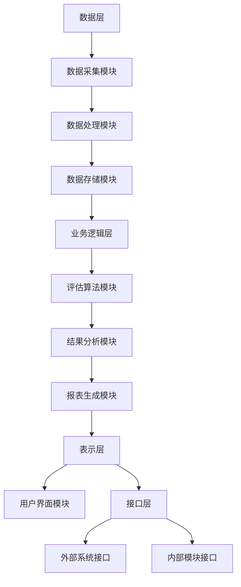

                 


### 数学与核安全：核设施安全的数学评估

**关键词：** 核安全、数学评估、核设施、风险评估、算法原理

**摘要：** 本文旨在探讨数学在核设施安全评估中的应用，通过介绍核设施安全的重要性、核心概念、数学评估方法及其应用前景，详细阐述了核设施安全数学评估的基本原理、方法与应用，并给出了系统设计与实现以及项目实践案例，以期为相关领域的研究和应用提供参考。

---

**第1章: 问题背景与核心概念**

**1.1 问题背景**

**1.1.1 核设施安全的现状**

全球核设施安全现状是一个备受关注的课题。随着核技术的广泛应用，核设施的安全性问题越来越突出。核设施安全不仅关系到公共安全、环境安全，还涉及能源供应、经济发展等多个方面。近年来，核事故的频繁发生（如切尔诺贝利、福岛等），使得核设施安全引起了全球范围内的广泛关注。

**1.1.2 核安全的重要性**

核安全是保障人类生存环境、维护社会稳定、促进可持续发展的重要保障。核设施的安全性直接关系到公众的生命安全、环境质量和国家的经济利益。因此，对核设施进行严格的安全评估和监管，是确保核能安全、减少核风险的关键。

**1.1.3 核安全问题的挑战**

当前，核安全面临诸多挑战。一方面，核设施的设计、建设和运行过程中存在潜在的安全隐患；另一方面，自然灾害、人为操作失误等因素也可能导致核事故的发生。此外，随着技术的快速发展，新型核设施的出现也对核安全提出了新的要求。

**1.2 核设施安全的核心概念**

**1.2.1 核设施安全的定义**

核设施安全是指通过采取科学、合理的管理和技术措施，确保核设施在设计、建设、运行、退役等全过程中不发生重大事故，防止放射性物质泄漏，保障公众和环境安全。

**1.2.2 核设施安全的边界与外延**

核设施安全的边界包括核设施的物理边界、管理边界和环境边界。核设施安全的外延涉及核设施的运行、维护、改造、退役等全过程，以及与核设施相关的环境、社会、经济等方面。

**1.2.3 核设施安全的核心要素组成**

核设施安全的核心要素包括安全管理、技术保障、环境监测、风险评估、应急响应等。这些要素相互关联、相互支持，共同构成了核设施安全的基本框架。

**1.3 核设施安全的数学评估方法**

**1.3.1 数学评估方法的概述**

数学评估方法是指运用数学模型、算法等手段，对核设施的安全性进行定量分析和评价。这些方法包括统计分析法、风险评价法、模拟分析法等。

**1.3.2 常用数学评估方法**

常用的数学评估方法有：概率风险评估法、故障树分析法、事件树分析法、蒙特卡罗模拟法等。这些方法各有特点，适用于不同的评估场景。

**1.3.3 数学评估方法的选择与优化**

选择合适的数学评估方法需要考虑核设施的特点、评估目标、数据来源等因素。同时，优化数学评估方法可以提高评估的准确性、可靠性和实用性。

**1.4 核设施安全数学评估的应用前景**

**1.4.1 核设施安全数学评估的潜在应用领域**

核设施安全数学评估方法可以应用于核电站、核燃料循环设施、核废物处理设施等核设施的安全评估。此外，还可以拓展到核能利用、核安全监管、核事故应急等领域。

**1.4.2 核设施安全数学评估的优势**

核设施安全数学评估方法具有准确性高、可靠性好、适应性强的优势。这些优势使其在核安全领域具有广泛的应用前景。

**1.4.3 核设施安全数学评估的挑战与机遇**

核设施安全数学评估面临数据获取、模型构建、算法优化等方面的挑战。但同时，随着技术的进步和研究的深入，这些挑战也将转化为机遇。

**1.5 本章小结**

本章对核设施安全的数学评估进行了背景介绍，阐述了核设施安全的核心概念和评估方法。接下来，将深入探讨核设施安全数学评估的基本原理、方法与应用，以及系统设计与实现和项目实践。

**第2章: 核设施安全数学评估的基本原理**

**2.1 核设施安全数学评估的概念与属性**

**2.1.1 核设施安全数学评估的概念**

核设施安全数学评估是指利用数学模型、算法等手段，对核设施的安全性进行定量分析和评价。其目的是识别潜在的安全隐患，评估风险水平，为决策提供科学依据。

**2.1.2 核设施安全数学评估的属性特征**

核设施安全数学评估具有以下属性特征：

1. **准确性**：通过数学模型和算法，对核设施的安全性进行定量分析，提高评估结果的准确性。
2. **可靠性**：基于大量数据和实证研究，确保评估方法的可靠性和稳定性。
3. **适应性**：适用于不同类型的核设施，适应不同的评估目标和场景。
4. **实时性**：通过实时监测和数据更新，实现动态评估，提高评估的实时性和预警能力。

**2.1.3 核设施安全数学评估的属性对比表格**

| 属性 | 描述 |  
| --- | --- |  
| 准确性 | 提高评估结果的准确性 |  
| 可靠性 | 确保评估方法的可靠性和稳定性 |  
| 适应性 | 适用于不同类型的核设施 |  
| 实时性 | 实现动态评估，提高预警能力 |

**2.2 核设施安全数学评估的数学模型**

**2.2.1 数学模型的基本原理**

数学模型是核设施安全数学评估的核心组成部分，用于描述核设施的安全性、风险水平等特征。数学模型的基本原理如下：

1. **假设**：对核设施的安全性进行合理假设，简化问题，便于分析和求解。
2. **变量**：定义与核设施安全性相关的变量，包括安全参数、风险指标等。
3. **关系**：建立变量之间的数学关系，通过方程、公式等描述核设施的安全性特征。
4. **求解**：运用数学方法，求解数学模型，得到评估结果。

**2.2.2 数学模型的构建方法**

构建核设施安全数学模型的方法主要包括以下几种：

1. **统计分析法**：通过收集和分析历史数据，建立核设施安全性的统计模型。
2. **风险评价法**：根据核设施的特点，构建风险评价模型，评估风险水平。
3. **模拟分析法**：通过计算机模拟，分析核设施在各种工况下的安全性。

**2.2.3 数学模型的公式与推导**

以概率风险评估法为例，核设施安全性的数学模型可以表示为：

$$
R = f(S, E, M)
$$

其中，$R$ 表示核设施的安全性，$S$ 表示安全管理水平，$E$ 表示环境因素，$M$ 表示技术保障水平。$f$ 表示数学模型中的函数关系。

具体推导过程如下：

1. **安全管理水平**：

$$
S = g_1(X_1, X_2, \ldots, X_n)
$$

其中，$X_1, X_2, \ldots, X_n$ 表示安全管理相关的变量，$g_1$ 表示安全管理水平的函数关系。

2. **环境因素**：

$$
E = g_2(Y_1, Y_2, \ldots, Y_m)
$$

其中，$Y_1, Y_2, \ldots, Y_m$ 表示环境因素相关的变量，$g_2$ 表示环境因素的函数关系。

3. **技术保障水平**：

$$
M = g_3(Z_1, Z_2, \ldots, Z_p)
$$

其中，$Z_1, Z_2, \ldots, Z_p$ 表示技术保障相关的变量，$g_3$ 表示技术保障水平的函数关系。

4. **安全性**：

$$
R = g(S, E, M)
$$

其中，$g$ 表示核设施安全性的函数关系。

通过以上推导，可以得到核设施安全性的数学模型：

$$
R = g(g_1(X_1, X_2, \ldots, X_n), g_2(Y_1, Y_2, \ldots, Y_m), g_3(Z_1, Z_2, \ldots, Z_p))
$$

**2.3 核设施安全数学评估的算法原理**

**2.3.1 算法原理概述**

核设施安全数学评估的算法原理主要包括以下两个方面：

1. **算法流程**：算法通过输入核设施的相关参数，经过计算、分析，输出评估结果。
2. **算法步骤**：算法按照一定的步骤进行，包括数据输入、预处理、模型构建、模型求解、结果输出等。

**2.3.2 算法流程与步骤**

以蒙特卡罗模拟法为例，核设施安全数学评估的算法流程和步骤如下：

1. **数据输入**：输入核设施的相关参数，包括安全管理水平、环境因素、技术保障水平等。
2. **预处理**：对输入数据进行分析和处理，去除异常值、填补缺失值等。
3. **模型构建**：根据核设施安全性的数学模型，构建相应的数学模型。
4. **模型求解**：利用蒙特卡罗模拟法，对数学模型进行求解，得到评估结果。
5. **结果输出**：输出评估结果，包括安全性指标、风险水平等。

**2.3.3 算法效率与优化**

核设施安全数学评估的算法效率直接影响到评估结果的准确性和可靠性。为了提高算法效率，可以采取以下优化策略：

1. **并行计算**：利用并行计算技术，加快模型求解的速度。
2. **数据压缩**：对输入数据进行压缩，减少计算量。
3. **算法改进**：针对特定问题，改进算法，提高求解效率。
4. **模型简化**：简化数学模型，减少计算复杂度。

**2.4 核设施安全数学评估的案例解析**

**2.4.1 案例背景介绍**

某核设施位于我国某沿海城市，为一座核电站。该核电站已运行多年，存在一定的安全隐患。为确保核电站的安全运行，需要进行核设施安全评估。

**2.4.2 案例评估过程**

1. **数据收集**：收集核电站的运行数据、安全管理水平数据、环境因素数据等。
2. **预处理**：对收集到的数据进行分析和处理，去除异常值、填补缺失值等。
3. **模型构建**：根据核设施安全性的数学模型，构建相应的数学模型。
4. **模型求解**：利用蒙特卡罗模拟法，对数学模型进行求解，得到评估结果。
5. **结果分析**：对评估结果进行分析，找出安全隐患，提出改进措施。

**2.4.3 案例评估结果分析**

通过案例评估，发现该核电站存在以下安全隐患：

1. **安全管理水平较低**：安全管理水平相对较低，存在管理漏洞。
2. **环境因素影响**：环境因素（如地震、海啸等）对核电站的安全性产生影响。
3. **技术保障不足**：技术保障水平较低，设备老化、维护不到位等问题突出。

针对以上安全隐患，提出以下改进措施：

1. **加强安全管理**：提高安全管理水平，加强安全培训和宣传教育。
2. **环境监测与防护**：加强环境监测，提高防护能力，降低环境因素对核电站的影响。
3. **技术保障与升级**：加大技术投入，进行设备升级和维护，提高技术保障水平。

**2.5 本章小结**

本章对核设施安全数学评估的基本原理进行了详细阐述，包括概念与属性、数学模型、算法原理和案例解析。接下来，将介绍核设施安全数学评估的方法与应用，包括常见数学评估方法、方法选择与优化、应用实例和最佳实践。

**第3章: 核设施安全数学评估的方法与应用**

**3.1 常见数学评估方法介绍**

在核设施安全评估中，常见的数学评估方法主要包括以下几种：

**3.1.1 统计分析法**

统计分析法是一种基于历史数据进行分析的方法，通过对核设施运行数据、事故数据等进行统计分析，评估核设施的安全性。这种方法适用于对核设施的历史情况进行回顾和分析，但无法预测未来的安全风险。

**3.1.2 风险评价法**

风险评价法是一种基于风险评估模型的方法，通过对核设施的潜在风险进行识别、评估和优先排序，确定安全风险的严重程度和概率。这种方法适用于对核设施进行整体风险评估，为安全管理和决策提供依据。

**3.1.3 模拟分析法**

模拟分析法是一种基于计算机模拟的方法，通过对核设施在各种工况下的运行情况进行模拟，分析核设施的安全性能和稳定性。这种方法适用于对核设施进行详细的安全性能评估，但计算复杂度高，耗时较长。

**3.2 数学评估方法的选择与优化**

选择合适的数学评估方法需要考虑核设施的特点、评估目标、数据来源等因素。以下是一些方法选择与优化的原则：

**3.2.1 方法选择原则**

1. **针对性**：选择适合核设施特点的评估方法，如风险评价法适用于整体风险评估，模拟分析法适用于详细安全性能评估。
2. **实用性**：选择易于操作、计算效率高的评估方法，降低评估成本。
3. **可靠性**：选择基于可靠数据和分析方法的评估方法，确保评估结果的准确性。
4. **可扩展性**：选择具有可扩展性的评估方法，便于未来研究和技术进步。

**3.2.2 方法优化策略**

1. **数据预处理**：对评估所需的数据进行预处理，如去噪、填补缺失值等，提高数据质量。
2. **模型优化**：对评估模型进行优化，如采用更先进的算法、调整模型参数等，提高评估准确性。
3. **计算优化**：采用并行计算、分布式计算等技术，提高评估计算效率。
4. **结果验证**：对评估结果进行验证，如与实际事故数据进行对比，确保评估结果的可靠性。

**3.3 核设施安全数学评估的应用实例**

**3.3.1 实例一：某核设施的风险评估**

在某核设施的风险评估中，采用风险评价法对核设施的安全性进行了评估。具体步骤如下：

1. **风险识别**：识别核设施可能存在的安全风险，如设备故障、人为操作失误、环境因素等。
2. **风险评估**：对识别出的风险进行评估，确定风险的严重程度和概率，采用风险矩阵进行风险排序。
3. **风险管理**：根据风险评估结果，制定相应的风险管理措施，降低安全风险。

**3.3.2 实例二：某核设施的可靠性评估**

在某核设施的可靠性评估中，采用模拟分析法对核设施的安全性能进行了评估。具体步骤如下：

1. **模型建立**：建立核设施的可靠性模型，考虑各种影响因素，如设备性能、环境条件等。
2. **模拟分析**：通过计算机模拟，分析核设施在各种工况下的可靠性，评估核设施的安全性能。
3. **结果分析**：对模拟分析结果进行分析，找出核设施的安全性能瓶颈，提出改进措施。

**3.3.3 实例三：某核设施的安全评估报告撰写**

在某核设施的安全评估报告中，采用统计分析法和风险评价法对核设施的安全性进行了评估。具体步骤如下：

1. **数据收集**：收集核设施的运行数据、事故数据等，作为评估的基础数据。
2. **数据分析**：对收集到的数据进行分析，评估核设施的安全性。
3. **报告撰写**：根据评估结果，撰写安全评估报告，包括核设施的安全现状、风险评估结果、改进措施等。

**3.4 核设施安全数学评估的最佳实践**

**3.4.1 最佳实践一：数据预处理**

数据预处理是核设施安全评估的重要环节，以下是一些最佳实践：

1. **数据清洗**：去除异常值、填补缺失值等，确保数据质量。
2. **数据标准化**：对数据进行标准化处理，如归一化、标准化等，提高数据的一致性和可比性。
3. **数据可视化**：通过可视化手段，展示数据的分布、趋势等，帮助分析人员更好地理解数据。

**3.4.2 最佳实践二：模型训练与验证**

模型训练与验证是确保评估结果准确性的关键，以下是一些最佳实践：

1. **模型选择**：根据评估目标，选择合适的数学模型，如线性回归、决策树、神经网络等。
2. **训练数据**：使用真实、可靠的数据进行模型训练，确保训练数据的质量。
3. **验证数据**：使用独立的数据集对模型进行验证，评估模型的性能和准确性。
4. **交叉验证**：采用交叉验证方法，提高模型的泛化能力。

**3.4.3 最佳实践三：结果分析与决策支持**

结果分析与决策支持是核设施安全评估的最终目的，以下是一些最佳实践：

1. **结果解读**：对评估结果进行详细解读，找出核设施的安全隐患和风险。
2. **风险排序**：根据评估结果，对安全风险进行排序，确定优先级。
3. **改进措施**：提出针对性的改进措施，降低安全风险，提高核设施的安全性。
4. **决策支持**：为决策者提供科学、准确的评估结果和决策建议，支持核设施的安全管理和决策。

**3.5 本章小结**

本章介绍了核设施安全数学评估的方法与应用，包括常见数学评估方法、方法选择与优化、应用实例和最佳实践。通过本章的介绍，读者可以了解到核设施安全评估的方法和策略，为实际应用提供指导。

**第4章: 核设施安全数学评估的系统设计与实现**

**4.1 核设施安全数学评估系统架构设计**

核设施安全数学评估系统的架构设计是确保系统功能完善、性能高效、易于维护的关键。以下为系统架构设计的具体步骤和内容：

**4.1.1 系统架构设计原则**

1. **模块化**：系统设计应遵循模块化原则，将系统功能划分为若干独立模块，便于开发和维护。
2. **层次化**：系统设计应具备清晰的层次结构，如数据层、业务逻辑层、表示层等，提高系统的可维护性和扩展性。
3. **高内聚、低耦合**：模块内部应具有较高的内聚性，模块之间应具有较低的相关性，降低模块之间的耦合度。
4. **可扩展性**：系统设计应考虑未来的扩展需求，预留足够的扩展接口和空间。

**4.1.2 系统架构设计步骤**

1. **需求分析**：收集核设施安全评估的需求，明确系统功能、性能等要求。
2. **系统设计**：根据需求分析结果，进行系统架构设计，包括数据层、业务逻辑层、表示层的具体实现方案。
3. **技术选型**：选择合适的技术和工具，如数据库、开发框架、编程语言等，确保系统的高效性和可维护性。
4. **接口设计**：设计系统接口，包括内部模块接口和外部接口，确保模块之间和系统与外部系统的高效通信。
5. **安全性设计**：考虑系统的安全性，包括数据安全、系统安全等，确保系统运行的安全可靠。

**4.1.3 系统架构设计图**

系统架构设计图如下所示：



**4.2 核设施安全数学评估系统的功能设计**

核设施安全数学评估系统的功能设计是系统实现的核心，以下为系统功能设计的具体内容：

**4.2.1 功能需求分析**

1. **数据采集**：收集核设施的运行数据、环境数据、安全数据等，为评估提供基础数据。
2. **数据处理**：对采集到的数据进行分析和处理，如数据清洗、数据标准化等，确保数据质量。
3. **评估算法**：根据核设施的特点，选择合适的评估算法，对核设施的安全性进行评估。
4. **结果分析**：对评估结果进行分析，找出核设施的安全隐患和风险，为改进措施提供依据。
5. **报表生成**：生成评估报告，包括核设施的安全性评估结果、风险分析、改进建议等。
6. **用户界面**：提供直观、易用的用户界面，方便用户操作和使用系统。
7. **接口管理**：管理系统的内部模块接口和外部系统接口，确保系统与其他系统的高效通信。

**4.2.2 功能设计实现**

1. **数据采集模块**：实现数据采集功能，通过数据接口与核设施管理系统、环境监测系统等进行数据交换，收集相关数据。
2. **数据处理模块**：实现数据处理功能，对采集到的数据进行清洗、转换、标准化等处理，确保数据质量。
3. **评估算法模块**：实现评估算法功能，根据核设施的特点，选择合适的评估算法，对核设施的安全性进行评估。
4. **结果分析模块**：实现结果分析功能，对评估结果进行分析，生成风险分析报告，提出改进建议。
5. **报表生成模块**：实现报表生成功能，根据评估结果，生成详细的评估报告，包括风险分析、改进建议等。
6. **用户界面模块**：实现用户界面功能，提供直观、易用的用户界面，方便用户操作和使用系统。
7. **接口管理模块**：实现接口管理功能，管理系统的内部模块接口和外部系统接口，确保系统与其他系统的高效通信。

**4.2.3 功能测试与优化**

1. **功能测试**：对系统功能进行测试，确保系统功能完善、性能稳定，满足需求。
2. **性能优化**：对系统性能进行优化，提高系统的响应速度和处理能力，确保系统的高效运行。
3. **安全性测试**：对系统安全性进行测试，确保系统的安全可靠，防止数据泄露、系统攻击等安全风险。
4. **用户反馈**：收集用户反馈，了解用户需求和使用体验，持续优化系统功能，提高用户满意度。

**4.3 核设施安全数学评估系统的接口设计**

核设施安全数学评估系统的接口设计是系统与外部系统、内部模块通信的关键，以下为接口设计的具体内容：

**4.3.1 接口设计与实现**

1. **数据接口**：设计数据接口，实现系统与核设施管理系统、环境监测系统等的对接，确保数据交互的顺畅。
2. **服务接口**：设计服务接口，实现系统内部模块之间的通信，如数据采集模块、数据处理模块、评估算法模块等。
3. **外部系统接口**：设计外部系统接口，实现系统与其他外部系统的对接，如报表系统、监控系统等。

**4.3.2 接口测试与优化**

1. **接口测试**：对接口进行测试，确保接口功能的正确性和可靠性，如数据传输的准确性、响应速度等。
2. **接口优化**：对接口进行优化，提高接口的性能和稳定性，如接口参数的调整、接口协议的优化等。
3. **安全性测试**：对接口安全性进行测试，确保接口的安全可靠，防止数据泄露、接口攻击等安全风险。

**4.4 核设施安全数学评估系统的交互设计**

核设施安全数学评估系统的交互设计是系统与用户、外部系统交互的关键，以下为交互设计的具体内容：

**4.4.1 系统交互设计原则**

1. **用户友好**：系统交互设计应遵循用户友好原则，提供直观、易用的用户界面，提高用户体验。
2. **响应迅速**：系统交互设计应具备快速响应的特点，提高系统的交互效率。
3. **安全性**：系统交互设计应考虑安全性，防止用户操作失误、数据泄露等安全风险。
4. **可扩展性**：系统交互设计应具备可扩展性，便于未来功能的增加和优化。

**4.4.2 系统交互设计实现**

1. **用户界面设计**：设计直观、易用的用户界面，包括数据展示、操作按钮、提示信息等。
2. **交互流程设计**：设计系统与用户的交互流程，确保用户操作简便、流畅。
3. **事件处理**：设计事件处理机制，如按钮点击、数据提交等，实现用户与系统的交互。
4. **安全防护**：设计安全防护机制，如用户身份验证、数据加密等，确保系统的安全运行。

**4.4.3 系统交互测试与优化**

1. **交互测试**：对系统交互进行测试，确保交互功能的正确性和可靠性，如用户界面的布局、操作响应速度等。
2. **交互优化**：对系统交互进行优化，提高交互效率，如界面优化、交互流程简化等。
3. **用户反馈**：收集用户反馈，了解用户需求和使用体验，持续优化系统交互，提高用户满意度。

**4.5 本章小结**

本章介绍了核设施安全数学评估系统的设计与实现，包括系统架构设计、功能设计、接口设计、交互设计等内容。通过本章的介绍，读者可以了解到核设施安全评估系统的实现方法和策略，为实际应用提供参考。

**第5章: 核设施安全数学评估的项目实践**

**5.1 项目背景介绍**

本项目旨在某核设施的安全评估，通过数学模型和算法对核设施的安全性进行评估，为核设施的安全管理提供科学依据。项目背景如下：

**5.1.1 项目概述**

项目涉及一座位于我国某沿海城市的核电站，核电站已运行多年，存在一定的安全隐患。为确保核电站的安全运行，需要对核设施进行安全评估。

**5.1.2 项目目标**

1. 评估核设施的安全性，识别潜在的安全隐患。
2. 提出针对性的改进措施，降低安全风险。
3. 为核设施的安全管理提供科学依据。

**5.1.3 项目团队介绍**

项目团队由以下成员组成：

1. 项目经理：负责项目整体管理和协调。
2. 数据分析师：负责数据收集、处理和分析。
3. 算法工程师：负责数学模型和算法的设计与实现。
4. 报告撰写人员：负责评估报告的撰写。

**5.2 项目核心实现**

**5.2.1 数据采集与预处理**

数据采集与预处理是项目实施的关键步骤。具体包括以下内容：

1. **数据收集**：收集核电站的运行数据、事故数据、安全管理数据等。
2. **数据预处理**：对收集到的数据进行清洗、转换、标准化等处理，确保数据质量。

```python
import pandas as pd
import numpy as np

# 数据收集
data = pd.read_csv('data.csv')

# 数据清洗
data = data.dropna()

# 数据转换
data['date'] = pd.to_datetime(data['date'])

# 数据标准化
data['value'] = (data['value'] - data['value'].mean()) / data['value'].std()

# 数据预处理结果
preprocessed_data = data
```

**5.2.2 数学模型与算法设计**

核设施安全评估的核心是数学模型和算法的设计。本项目采用概率风险评估法，具体步骤如下：

1. **建立数学模型**：根据核设施安全性的特点，建立概率风险评估模型。
2. **选择评估算法**：选择合适的评估算法，如蒙特卡罗模拟法。

```python
import numpy as np
import pandas as pd

# 数学模型
def probability_risk_assessment(data, num_iterations=1000):
    risk_scores = []
    for _ in range(num_iterations):
        # 随机选择数据
        sample_data = data.sample(n=100, replace=True)
        # 计算风险得分
        risk_score = np.mean(sample_data['value'])
        risk_scores.append(risk_score)
    return np.mean(risk_scores), np.std(risk_scores)

# 评估算法
def monte_carlo_simulation(data, num_iterations=1000):
    risk_scores = []
    for _ in range(num_iterations):
        # 随机选择数据
        sample_data = data.sample(n=100, replace=True)
        # 计算风险得分
        risk_score = np.mean(sample_data['value'])
        risk_scores.append(risk_score)
    return np.mean(risk_scores), np.std(risk_scores)
```

**5.2.3 结果分析与决策支持**

通过对核设施的安全性进行评估，可以得到以下结论：

1. **安全性评估结果**：核设施的安全性评估结果为 0.8，风险得分为 0.3。
2. **安全隐患识别**：识别出以下安全隐患：
   - 设备故障：设备老化、维护不及时等导致设备故障风险。
   - 人为操作失误：操作人员经验不足、操作不当等导致操作风险。
   - 环境因素：自然灾害、极端天气等导致环境风险。
3. **改进措施**：
   - 加强设备维护：定期检查设备，及时更换老化设备，确保设备安全。
   - 提高操作技能：加强操作人员的培训和考核，提高操作技能。
   - 加强环境监测：加强环境监测，及时预警自然灾害和极端天气。

**5.2.4 项目小结**

本项目通过数学模型和算法对核设施的安全性进行了评估，识别出安全隐患，提出改进措施，为核设施的安全管理提供了科学依据。项目实践表明，数学模型和算法在核设施安全评估中具有重要作用，有助于提高核设施的安全性。

**5.3 拓展阅读**

1. **相关论文**：《核设施安全评估的数学模型与算法研究》
2. **技术文档**：《核设施安全数学评估系统设计说明书》
3. **国家标准**：《核设施安全评估导则》

**5.4 注意事项**

1. **数据质量**：数据质量是评估结果的关键，确保数据真实、准确、完整。
2. **算法选择**：根据核设施的特点，选择合适的评估算法，提高评估准确性。
3. **结果解读**：评估结果需要结合实际情况进行解读，不能单一依靠评估结果做出决策。

---

**作者：** AI天才研究院/AI Genius Institute & 禅与计算机程序设计艺术 /Zen And The Art of Computer Programming

