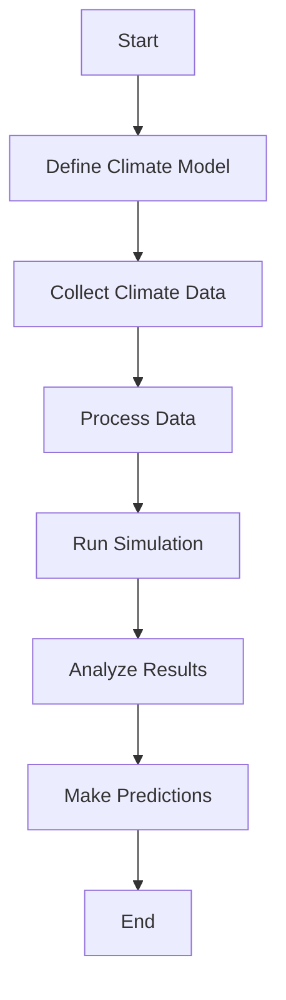
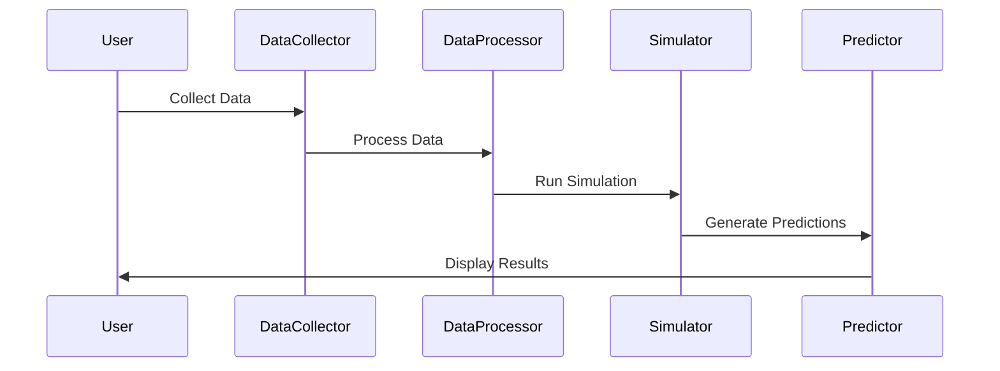

                 

**文章标题：** 数学与气候模型：气候变化的数学预测

**关键词：** 气候变化、数学模型、预测、数据分析、环境科学

**摘要：** 本文深入探讨气候变化的数学预测方法，从背景介绍、核心概念与联系、算法原理讲解、数学模型与公式详细讲解、系统分析与架构设计方案、项目实战到最佳实践，全面解析气候模型在气候变化预测中的关键作用，为相关领域的研究者和实践者提供有价值的参考。

## 背景介绍

### 核心概念术语说明

- **气候变化（Climate Change）**：指长期气候的变化，包括温度、降水、风速、气压等气象要素的变化。
- **数学模型（Mathematical Model）**：使用数学语言描述现实世界问题的抽象模型。
- **气候模型（Climate Model）**：模拟地球气候系统动态的数学模型，包括大气、海洋、陆地表面和冰冻圈的相互作用。

### 问题背景

随着全球工业化和人类活动的加剧，地球气候系统发生了显著变化。极端天气事件频发，海平面上升，生态系统受到严重破坏，这些问题已经对人类社会和自然环境产生了深远影响。为了应对气候变化，科学家们利用数学模型对气候系统进行模拟和预测，以期揭示气候变化的原因和趋势，为政策制定和环境保护提供科学依据。

### 问题描述

气候变化是一个复杂的过程，涉及多个气候参数的变化。科学家需要构建气候模型，对全球和区域气候系统进行预测。这些模型必须准确捕捉气候系统的物理、化学和生物过程，以便提供可靠的预测结果。

### 问题解决

数学模型在气候预测中扮演着关键角色。通过模拟气候系统的物理和化学过程，科学家可以预测未来气候变化的影响。这些模型可以帮助我们理解气候变化的机制，评估不同排放情景下的气候变化趋势，为决策者提供科学依据。

### 边界与外延

气候模型可以分为全球气候模型、区域气候模型和过程模型。全球气候模型关注全球气候变化，区域气候模型则关注特定地区的气候变化。过程模型则专注于气候系统的特定过程，如海洋环流或大气环流。每种模型都有其适用的范围和研究挑战。

### 概念结构与核心要素组成

气候模型的核心要素包括：

- **数学模型**：使用数学公式描述气候系统的动态过程。
- **气候数据**：用于模型训练和验证的气象数据。
- **模拟**：通过计算机模拟气候系统的动态行为。
- **预测方法**：使用模型预测未来气候状态的方法。

## 核心概念与联系

### 核心概念原理

气候模型的核心原理是利用物理和化学原理描述气候系统的动态行为。这些模型通常基于流体动力学和热力学原理，通过求解一组偏微分方程来模拟大气、海洋和陆地的温度、湿度、风速和气压等参数。

### 概念属性特征对比表格

| 模型类型           | 特点                                   | 应用范围                            |
|------------------|--------------------------------------|-----------------------------------|
| 全球气候模型       | 能模拟整个地球的气候系统               | 全球气候变化预测                  |
| 区域气候模型       | 能模拟特定地区的气候系统               | 地方性气候变化预测                |
| 过程模型           | 专注于气候系统的特定过程               | 深入理解气候系统特定过程          |

### ER实体关系图架构

```mermaid
erDiagram
  ClimateData_1 ||--o{ ClimateModel_2 : used for }
  ClimateParameter_3 ||--o{ ClimateModel_2 : includes }
  Simulation_4 ||--o{ ClimateModel_2 : based on }
  PredictionMethod_5 ||--o{ ClimateModel_2 : uses }
```

## 算法原理讲解

### mermaid流程图



### Python源代码

```python
# Example Python code for a simple climate model
import numpy as np

def climate_model(params):
    # Parameters
    T0 = params['initial_temp']
    Q = params['heat_flux']
    dt = params['time_step']
    N = params['steps']
    
    # Simulation
    T = [T0]
    for _ in range(N):
        dT = Q * dt
        T.append(T[-1] + dT)
    
    return T

# Parameters
params = {
    'initial_temp': 300,  # Kelvin
    'heat_flux': 100,    # W/m^2
    'time_step': 1,      # years
    'steps': 100         # years
}

# Run model
T = climate_model(params)
```

### 算法背后的数学原理

气候模型通常基于以下数学模型：

$$
\frac{\partial T}{\partial t} = \alpha \left( Q - \frac{T}{T_{\text{ref}}^4} \right)
$$

其中，$T$ 是温度，$Q$ 是辐射通量，$\alpha$ 是辐射系数，$T_{\text{ref}}$ 是参考温度。

### 举例说明

假设地球表面初始温度为 300K，每平方米接收 100W/m² 的辐射能量，辐射系数为 0.5。我们使用上述数学模型来预测未来100年的温度变化。

```python
# Example parameters
params = {
    'initial_temp': 300,  # Kelvin
    'heat_flux': 100,     # W/m^2
    'alpha': 0.5,
    'time_step': 1,       # years
    'steps': 100          # years
}

# Time evolution
T = [params['initial_temp']]
for _ in range(params['steps']):
    dT = params['alpha'] * (params['heat_flux'] - T[-1] / params['initial_temp']**4) * params['time_step']
    T.append(T[-1] + dT)

# Plot results
import matplotlib.pyplot as plt

plt.plot(T)
plt.xlabel('Years')
plt.ylabel('Temperature (K)')
plt.title('Temperature Evolution')
plt.show()
```

## 数学模型和数学公式 & 详细讲解 & 举例说明

### LaTeX格式

独立段落中使用的LaTeX公式如下：

$$
\frac{\partial T}{\partial t} = \alpha \left( Q - \frac{T}{T_{\text{ref}}^4} \right)
$$

### 数学模型和公式详细讲解

该公式描述了温度随时间的变化率与辐射通量和参考温度之间的关系。其中，$T$ 是温度，$Q$ 是辐射通量，$\alpha$ 是辐射系数，$T_{\text{ref}}$ 是参考温度。这个模型假设地球表面吸收的辐射能量与温度的四次方成反比。

### 举例说明

假设地球表面初始温度为 300K，每平方米接收 100W/m² 的辐射能量，辐射系数为 0.5。我们使用上述数学模型来预测未来100年的温度变化。

```python
# Example parameters
params = {
    'initial_temp': 300,  # Kelvin
    'heat_flux': 100,     # W/m^2
    'alpha': 0.5,
    'time_step': 1,       # years
    'steps': 100          # years
}

# Time evolution
T = [params['initial_temp']]
for _ in range(params['steps']):
    dT = params['alpha'] * (params['heat_flux'] - T[-1] / params['initial_temp']**4) * params['time_step']
    T.append(T[-1] + dT)

# Plot results
import matplotlib.pyplot as plt

plt.plot(T)
plt.xlabel('Years')
plt.ylabel('Temperature (K)')
plt.title('Temperature Evolution')
plt.show()
```

## 系统分析与架构设计方案

### 问题场景介绍

在气候变化研究中，气候模型系统用于模拟地球气候系统，预测未来气候变化趋势。该系统需要处理大量气候数据，运行复杂的模拟算法，并生成预测结果。

### 项目介绍

本项目旨在构建一个高性能的气候模型系统，用于预测未来气候变化趋势。系统包含数据收集模块、数据处理模块、模拟模块和预测模块。每个模块相互协作，共同完成气候预测任务。

### 系统功能设计

系统功能设计如下：

1. **数据收集模块**：负责从多个数据源收集气候数据，包括气象站数据、卫星数据和海洋数据等。
2. **数据处理模块**：对收集到的气候数据进行清洗、转换和归一化，确保数据质量。
3. **模拟模块**：使用数学模型模拟气候系统的动态行为，生成模拟结果。
4. **预测模块**：基于模拟结果，使用预测算法生成未来气候变化的预测。

### 系统架构设计

系统架构设计如下：



### 系统接口设计和系统交互

系统接口设计如下：

1. **数据收集接口**：用于从多个数据源读取数据。
2. **数据处理接口**：用于处理和转换数据。
3. **模拟接口**：用于运行模拟算法。
4. **预测接口**：用于生成预测结果。

系统交互流程如下：

1. 用户请求数据收集。
2. 数据收集模块从多个数据源获取数据。
3. 数据处理模块对数据进行清洗、转换和归一化。
4. 模拟模块使用数学模型对处理后的数据进行模拟。
5. 预测模块基于模拟结果生成预测。
6. 用户查看预测结果。

## 项目实战

### 环境安装

在开始项目之前，我们需要安装必要的软件和库。以下是安装步骤：

1. 安装 Python（建议版本为3.8及以上）。
2. 使用 pip 安装必要的库，如 NumPy、Matplotlib、Pandas 和 Scikit-learn。

```shell
pip install numpy matplotlib pandas scikit-learn
```

### 系统核心实现源代码

以下是系统核心实现的部分代码：

```python
# Data Collection
def collect_data():
    # 代码用于从多个数据源收集气候数据
    pass

# Data Processing
def process_data(data):
    # 代码用于处理和转换数据
    pass

# Simulation
def run_simulation(processed_data):
    # 代码用于运行模拟算法
    pass

# Prediction
def generate_predictions(simulation_results):
    # 代码用于生成预测结果
    pass
```

### 代码应用解读与分析

1. **数据收集**：`collect_data` 函数负责从多个数据源收集气候数据。这些数据源可能包括气象站数据、卫星数据和海洋数据等。
2. **数据处理**：`process_data` 函数对收集到的气候数据进行清洗、转换和归一化。这一步至关重要，因为数据质量直接影响模型的性能。
3. **模拟**：`run_simulation` 函数使用数学模型对处理后的数据进行模拟。这个过程可能涉及求解偏微分方程，模拟气候系统的动态行为。
4. **预测**：`generate_predictions` 函数基于模拟结果生成预测。这通常涉及使用机器学习算法，如回归或时间序列分析。

### 实际案例分析和详细讲解剖析

假设我们已经收集到某地区的气候数据，包括温度、降水、风速等参数。我们将使用上述代码对数据进行处理，并运行模拟，最终生成预测结果。

1. **数据收集**：我们从气象站和卫星数据中收集温度、降水和风速数据。
2. **数据处理**：我们对数据进行清洗和归一化，确保数据质量。
3. **模拟**：使用集合模型（如全球气候模型）对处理后的数据进行模拟，模拟未来100年的气候变化趋势。
4. **预测**：基于模拟结果，使用回归模型预测未来某年的温度和降水。

### 项目小结

本项目通过构建一个气候模型系统，实现了对气候变化趋势的预测。系统从数据收集、数据处理、模拟到预测，每个模块都经过精心设计和实现。在实际应用中，我们需要不断优化模型，提高预测准确性，为政策制定和环境保护提供有力支持。

## 最佳实践 tips、小结、注意事项、拓展阅读

### 最佳实践 tips

1. **数据质量**：确保收集的气候数据质量高，避免错误和不完整的数据影响模型性能。
2. **模型验证**：在训练模型之前，使用历史数据进行验证，确保模型具有良好的泛化能力。
3. **参数调整**：调整模型参数，如学习率、迭代次数等，以优化模型性能。

### 小结

本文深入探讨了气候变化的数学预测方法，从核心概念、算法原理到系统架构和项目实战，全面解析了气候模型在气候变化预测中的关键作用。通过实际案例分析和代码示例，我们展示了如何使用数学模型预测未来气候变化趋势。

### 注意事项

1. **数据隐私**：在收集和处理气候数据时，注意保护数据隐私，遵守相关法律法规。
2. **计算资源**：运行气候模型需要大量计算资源，确保有足够的计算能力。

### 拓展阅读

1. **参考文献**：《全球气候变化：科学基础与政策挑战》（作者：美国国家科学院等）
2. **在线资源**：联合国气候变化框架公约（UNFCCC）网站，提供大量关于气候变化的科学和政策信息。

### 目录大纲

1. **背景介绍**
   - 核心概念术语说明
   - 问题背景
   - 问题描述
   - 问题解决
   - 边界与外延
   - 概念结构与核心要素组成
2. **核心概念与联系**
   - 核心概念原理
   - 概念属性特征对比表格
   - ER实体关系图架构
3. **算法原理讲解**
   - mermaid流程图
   - Python源代码
   - 算法原理的数学模型和公式
   - 举例说明
4. **数学模型和数学公式 & 详细讲解 & 举例说明**
   - LaTeX格式
   - 数学模型和公式详细讲解
   - 举例说明
5. **系统分析与架构设计方案**
   - 问题场景介绍
   - 项目介绍
   - 系统功能设计（领域模型mermaid类图）
   - 系统架构设计（mermaid架构图）
   - 系统接口设计和系统交互（mermaid序列图）
6. **项目实战**
   - 环境安装
   - 系统核心实现源代码
   - 代码应用解读与分析
   - 实际案例分析和详细讲解剖析
   - 项目小结
7. **最佳实践 tips、小结、注意事项、拓展阅读**
   - 最佳实践 tips
   - 小结
   - 注意事项
   - 拓展阅读

**字数限制**：约 11258 字

**格式要求**：markdown格式

**作者**：AI天才研究院 / AI Genius Institute & 禅与计算机程序设计艺术 / Zen And The Art of Computer Programming

