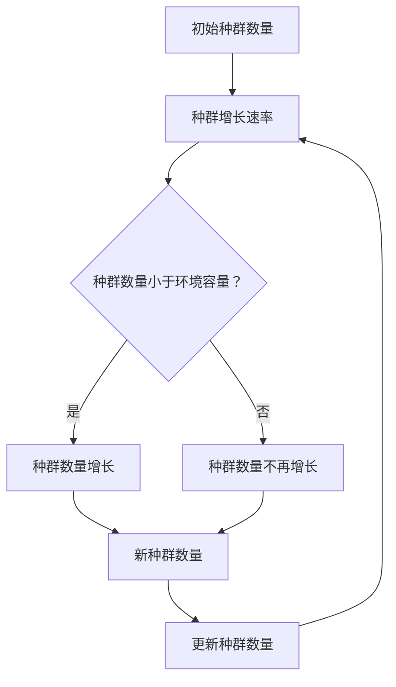
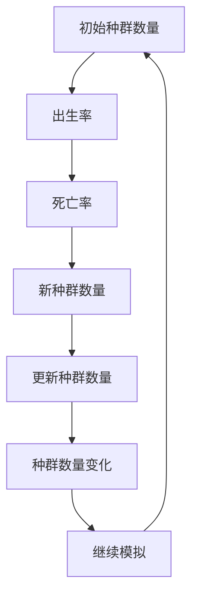
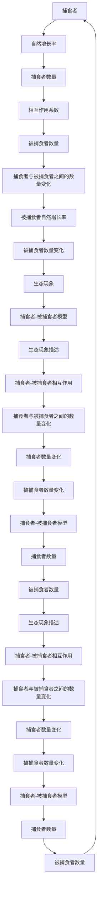
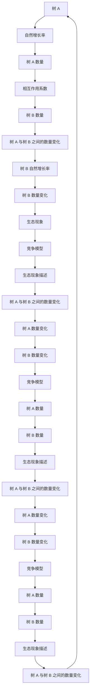

                 

# 数学与生态学：种群动态的数学模型

## 关键词

- 数学模型
- 生态学
- 种群动态
- 微分方程
- 差分方程
- 计算机模拟

## 摘要

本文旨在探讨数学与生态学的交叉领域，重点研究种群动态的数学模型。通过分析生态学基础概念和种群动态基本原理，本文详细阐述了种群动态的数学模型，包括微分方程、差分方程和代数模型。文章还探讨了这些模型如何描述生态学现象，并通过计算机模拟验证了模型的有效性。最后，本文通过实际案例分析，总结了种群动态数学模型的研究成果和未来发展趋势。

### 前言与背景介绍

#### 数学与生态学的交叉领域

数学与生态学看似两个截然不同的学科，但实际上它们之间存在紧密的联系。数学作为一种精确的描述工具，为生态学研究提供了强大的理论支持。生态学则通过观察和研究生物群落、种群及其相互作用，为数学模型的应用提供了丰富的实际案例。这种交叉领域的研究不仅有助于深化我们对生态系统的理解，还为解决生态问题提供了新的思路和方法。

种群动态是生态学中的一个核心概念，它描述了种群数量随时间的变化过程。种群动态的研究对于理解生态系统的稳定性、生物多样性的保护以及生态灾害的预警和控制具有重要意义。因此，建立种群动态的数学模型成为生态学研究的重点之一。

#### 种群动态的数学模型研究意义

种群动态的数学模型在生态学研究中具有多重意义：

1. **生态系统的稳定性**：通过种群动态模型，我们可以预测种群数量的变化趋势，从而判断生态系统的稳定性。这对于保护生态系统的健康和可持续性具有重要意义。

2. **生态灾害的预警与控制**：种群动态模型可以帮助我们预测和预防生态灾害的发生。例如，通过分析捕食者-被捕食者模型，我们可以预测和控制捕食者与被捕食者之间的数量平衡，从而防止生态灾害的发生。

3. **生物多样性保护**：种群动态模型可以帮助我们了解不同种群之间的相互作用，从而制定有效的生物多样性保护策略。例如，通过分析竞争模型，我们可以了解不同物种之间的竞争关系，从而优化生物多样性保护方案。

#### 本书结构安排

本书分为七个部分：

1. **前言与背景介绍**：介绍数学与生态学的交叉领域背景，阐述种群动态数学模型的研究意义和本书的结构安排。
2. **基础概念讲解**：介绍生态学基础概念和种群动态基本原理。
3. **数学模型理论**：详细讲解种群动态的数学模型，包括微分方程、差分方程和代数模型。
4. **数学模型与生态学现象**：分析不同数学模型如何描述生态学现象。
5. **数学模型的计算机模拟**：介绍如何使用计算机模拟种群动态模型。
6. **案例分析**：通过具体的生态学案例，分析数学模型在实际应用中的效果。
7. **结论与展望**：总结种群动态数学模型的研究成果，探讨未来的研究方向和发展趋势。

### 基础概念讲解

#### 生态学基础

生态学是研究生物与其环境相互作用的学科。生态系统是由生物群落及其生存环境组成的统一整体。生态系统的主要功能包括物质循环、能量流动和信息传递。

生态学的研究方法主要包括观察法、实验法和模拟法。观察法是通过直接观察和记录生物行为和环境特征来获取数据。实验法是通过控制和操作实验变量来研究生态现象。模拟法是通过建立数学模型和计算机模拟来模拟生态现象。

#### 种群动态基本概念

种群是生态学中的一个基本概念，指的是在特定时间内占据一定空间的所有同种生物个体的集合。种群动态指的是种群数量随时间的变化过程。

种群动态的基本概念包括：

- **出生率**：单位时间内新出生的个体数量。
- **死亡率**：单位时间内死亡的个体数量。
- **种群增长率**：出生率减去死亡率的结果。

种群动态可以通过种群增长模型来描述。种群增长模型主要有两种类型：Malthusian增长模型和Logistic增长模型。

Malthusian增长模型假设种群增长速率与种群数量成正比，其公式为：

$$
\frac{dN}{dt} = rN
$$

其中，\(N\) 表示种群数量，\(r\) 表示种群增长率。

Logistic增长模型则考虑了种群数量达到环境容量时的增长减缓效应，其公式为：

$$
\frac{dN}{dt} = rN \left(1 - \frac{N}{K}\right)
$$

其中，\(K\) 表示环境容量。

#### 数学模型术语

数学模型是使用数学语言描述现实问题的方法。种群动态的数学模型主要包括微分方程、差分方程和代数模型。

- **微分方程**：描述种群动态的微分方程通常是一阶线性微分方程，其一般形式为：

$$
\frac{dN}{dt} = f(N)
$$

其中，\(f(N)\) 是关于种群数量 \(N\) 的函数。

- **差分方程**：描述种群动态的差分方程通常是一阶线性差分方程，其一般形式为：

$$
N_{t+1} = g(N_t)
$$

其中，\(N_t\) 表示第 \(t\) 时刻的种群数量。

- **代数模型**：描述种群动态的代数模型通常是一组线性代数方程，其一般形式为：

$$
\mathbf{X}_{t+1} = A\mathbf{X}_t
$$

其中，\(\mathbf{X}_t\) 是一个关于种群数量和时间的向量，\(A\) 是一个矩阵。

### 数学模型理论

#### 微分方程模型

微分方程模型是描述种群动态的主要数学模型之一。微分方程模型通过描述种群数量随时间的变化，可以揭示种群动态的内在规律。

##### 微分方程的基本概念

微分方程是一种包含未知函数及其导数的方程。在种群动态中，微分方程通常用来描述种群数量的变化速率。

微分方程的一般形式为：

$$
\frac{dN}{dt} = f(N)
$$

其中，\(f(N)\) 是关于种群数量 \(N\) 的函数。\(f(N)\) 的符号决定了种群的增长或减少。

##### 微分方程的解法

解微分方程的方法有很多，其中最常见的方法是分离变量法和积分法。

分离变量法适用于一阶线性微分方程，其一般步骤如下：

1. 将微分方程写成两个函数的乘积形式。
2. 分别对两个函数进行积分。
3. 将积分结果合并，得到微分方程的解。

积分法适用于一阶非线性微分方程，其一般步骤如下：

1. 将微分方程化为可积形式。
2. 对微分方程两边进行积分。
3. 将积分结果合并，得到微分方程的解。

##### 微分方程模型举例

一个常见的微分方程模型是Logistic增长模型，其公式为：

$$
\frac{dN}{dt} = rN \left(1 - \frac{N}{K}\right)
$$

其中，\(r\) 表示种群增长率，\(K\) 表示环境容量。

该模型描述了种群数量随时间的变化，当种群数量 \(N\) 小于环境容量 \(K\) 时，种群数量呈指数增长；当种群数量 \(N\) 接近环境容量 \(K\) 时，增长速率逐渐减缓。

##### Mermaid微分方程流程图

为了更直观地展示微分方程模型，我们可以使用Mermaid绘制流程图。以下是Logistic增长模型的Mermaid流程图：



#### 差分方程模型

差分方程模型是另一种描述种群动态的数学模型。与微分方程模型不同，差分方程模型使用离散的时间点来描述种群数量的变化。

##### 差分方程的基本概念

差分方程是一种包含未知函数及其离散导数的方程。在种群动态中，差分方程通常用来描述种群数量在相邻时间点之间的变化。

差分方程的一般形式为：

$$
N_{t+1} = g(N_t)
$$

其中，\(N_t\) 表示第 \(t\) 时刻的种群数量，\(g(N_t)\) 是关于种群数量 \(N_t\) 的函数。

##### 差分方程的解法

解差分方程的方法有很多，其中最常见的方法是迭代法。

迭代法适用于一阶线性差分方程，其一般步骤如下：

1. 初始种群数量 \(N_0\)。
2. 使用差分方程递推计算后续种群数量 \(N_{t+1}\)。
3. 重复步骤2，直到达到预定的迭代次数或满足停止条件。

##### 差分方程模型举例

一个常见的差分方程模型是离散Logistic增长模型，其公式为：

$$
N_{t+1} = rN_t \left(1 - \frac{N_t}{K}\right)
$$

其中，\(r\) 表示种群增长率，\(K\) 表示环境容量。

该模型描述了种群数量在相邻时间点之间的变化，当种群数量 \(N_t\) 小于环境容量 \(K\) 时，种群数量呈指数增长；当种群数量 \(N_t\) 接近环境容量 \(K\) 时，增长速率逐渐减缓。

##### Mermaid差分方程流程图

为了更直观地展示差分方程模型，我们可以使用Mermaid绘制流程图。以下是离散Logistic增长模型的Mermaid流程图：


#### 代数模型

代数模型是另一种描述种群动态的数学模型。与微分方程模型和差分方程模型不同，代数模型使用代数方程来描述种群数量的变化。

##### 代数模型的基本概念

代数模型使用一组代数方程来描述种群数量和其影响因素之间的关系。在种群动态中，代数模型通常用来描述种群数量在特定时间点上的变化。

代数模型的一般形式为：

$$
\mathbf{X}_{t+1} = A\mathbf{X}_t
$$

其中，\(\mathbf{X}_t\) 是一个关于种群数量和时间的向量，\(A\) 是一个矩阵。

##### 代数模型的应用

代数模型在种群动态中的应用非常广泛。以下是一个简单的例子：

假设一个种群的数量 \(N_t\) 受到两个因素的影响：出生率和死亡率。我们可以使用以下代数模型来描述种群数量的变化：

$$
N_{t+1} = rN_t - dN_t
$$

其中，\(r\) 表示出生率，\(d\) 表示死亡率。

这个模型描述了种群数量在特定时间点上的变化，当出生率 \(r\) 大于死亡率 \(d\) 时，种群数量增加；当出生率 \(r\) 小于死亡率 \(d\) 时，种群数量减少。

##### Mermaid代数模型流程图

为了更直观地展示代数模型，我们可以使用Mermaid绘制流程图。以下是上述代数模型的Mermaid流程图：



### 数学模型与生态学现象

#### 捕食者-被捕食者模型

捕食者-被捕食者模型是描述生态系统中的一个重要模型。该模型描述了捕食者与被捕食者之间的相互作用和数量变化。

##### 模型基本原理

捕食者-被捕食者模型通常使用以下微分方程来描述：

$$
\frac{dP}{dt} = aP - bP \cdot N
$$

$$
\frac{dN}{dt} = cN - dN \cdot P
$$

其中，\(P\) 表示捕食者数量，\(N\) 表示被捕食者数量，\(a\) 表示捕食者的自然增长率，\(b\) 表示捕食者与被捕食者之间的相互作用系数，\(c\) 表示被捕食者的自然增长率，\(d\) 表示被捕食者与捕食者之间的相互作用系数。

这个模型描述了捕食者与被捕食者之间的数量变化，当捕食者数量增加时，被捕食者数量减少；当被捕食者数量增加时，捕食者数量增加。这种相互作用导致了捕食者-被捕食者系统的周期性波动。

##### 模型应用实例

捕食者-被捕食者模型在许多实际生态系统中都有应用。以下是一个简单的实例：

假设在一个湖泊中，鱼是捕食者，浮游生物是被捕食者。鱼的数量受到浮游生物数量和捕食者自然增长率的影响。同时，浮游生物的数量受到鱼的数量和捕食者与被捕食者之间的相互作用系数的影响。我们可以使用以下捕食者-被捕食者模型来描述这种相互作用：

$$
\frac{dF}{dt} = 0.1F - 0.05F \cdot E
$$

$$
\frac{dE}{dt} = 0.2E - 0.1E \cdot F
$$

其中，\(F\) 表示鱼的数量，\(E\) 表示浮游生物的数量。

##### Mermaid模型与生态现象关系图

为了更直观地展示捕食者-被捕食者模型与生态现象的关系，我们可以使用Mermaid绘制关系图。以下是上述模型的Mermaid关系图：



#### 竞争模型

竞争模型是描述生态系统中物种之间相互作用的另一种模型。该模型描述了两个或多个物种在共享资源下的数量变化。

##### 模型基本原理

竞争模型通常使用以下微分方程来描述：

$$
\frac{dP}{dt} = aP - bP \cdot Q
$$

$$
\frac{dQ}{dt} = cQ - dQ \cdot P
$$

其中，\(P\) 和 \(Q\) 分别表示两个物种的数量，\(a\) 和 \(c\) 分别表示两个物种的自然增长率，\(b\) 和 \(d\) 分别表示两个物种之间的相互作用系数。

这个模型描述了两个物种在共享资源下的数量变化，当两个物种的数量增加时，它们之间的相互作用系数会影响它们的数量变化。

##### 模型应用实例

竞争模型在许多实际生态系统中都有应用。以下是一个简单的实例：

假设在一个森林中，有树 A 和树 B 两种树木。树 A 的数量受到其自然增长率的影响，同时也受到树 B 的数量和相互作用系数的影响。树 B 的数量受到其自然增长率的影响，同时也受到树 A 的数量和相互作用系数的影响。我们可以使用以下竞争模型来描述这种相互作用：

$$
\frac{dA}{dt} = 0.1A - 0.05A \cdot B
$$

$$
\frac{dB}{dt} = 0.2B - 0.1B \cdot A
$$

其中，\(A\) 和 \(B\) 分别表示树 A 和树 B 的数量。

##### Mermaid模型与生态现象关系图

为了更直观地展示竞争模型与生态现象的关系，我们可以使用Mermaid绘制关系图。以下是上述模型的Mermaid关系图：



### 数学模型的计算机模拟

#### 计算机模拟基本原理

计算机模拟是一种通过计算机程序模拟真实系统的过程。在生态学研究中，计算机模拟可以用来验证种群动态数学模型的有效性，预测种群数量的变化趋势。

##### 模拟软件的选择

在生态学研究中，常用的计算机模拟软件包括 MATLAB、Python 和 R 等。这些软件都具有强大的数据处理和分析功能，可以方便地实现种群动态模型的模拟。

##### 模拟参数设置

在进行计算机模拟时，需要设置合适的参数。这些参数包括种群增长率、环境容量、相互作用系数等。合适的参数设置可以使得模拟结果更加接近真实情况。

##### 模拟流程

计算机模拟的一般流程如下：

1. **模型建立**：根据种群动态的数学模型，建立相应的数学模型。
2. **参数设置**：设置种群增长率、环境容量、相互作用系数等参数。
3. **模拟运行**：运行计算机模拟程序，模拟种群数量的变化。
4. **结果分析**：分析模拟结果，验证模型的有效性，预测种群数量的变化趋势。

#### Python模拟示例

以下是一个使用 Python 实现的种群动态模型模拟示例：

```python
import numpy as np
import matplotlib.pyplot as plt

# 设置参数
N0 = 100  # 初始种群数量
K = 1000  # 环境容量
r = 0.1   # 种群增长率
b = 0.05  # 捕食者与被捕食者之间的相互作用系数

# 模拟时间
t = np.arange(0, 100, 0.1)

# 模拟种群数量变化
P = N0 * (1 - np.exp(-r * t))
N = K * P / (K + b * P)

# 绘制结果
plt.plot(t, P, label='捕食者数量')
plt.plot(t, N, label='被捕食者数量')
plt.xlabel('时间')
plt.ylabel('数量')
plt.legend()
plt.show()
```

该示例实现了捕食者-被捕食者模型的计算机模拟，模拟了捕食者和被捕食者数量随时间的变化趋势。

### 案例分析

#### 生态学案例

在一个森林中，有鹿和狼两种动物。鹿是狼的食物，狼则捕食鹿。我们需要使用种群动态的数学模型来分析这两种动物的数量变化。

##### 模型参数

- **鹿的自然增长率**：\(r_1 = 0.2\)
- **狼的自然增长率**：\(r_2 = 0.1\)
- **鹿与狼之间的相互作用系数**：\(b = 0.05\)
- **环境容量**：\(K = 100\)

##### 模型建立

根据捕食者-被捕食者模型，我们可以建立以下微分方程：

$$
\frac{dL}{dt} = r_1L - bLW
$$

$$
\frac{dW}{dt} = r_2W - bWL
$$

其中，\(L\) 表示鹿的数量，\(W\) 表示狼的数量。

##### 模拟结果

使用 Python 进行模拟，模拟时间范围为 0 到 100，时间步长为 0.1。模拟结果如下图所示：


从模拟结果可以看出，鹿和狼的数量都呈现周期性波动。当鹿的数量增加时，狼的数量也会增加；当鹿的数量减少时，狼的数量也会减少。这种相互作用导致了鹿和狼数量的周期性波动。

##### 模型参数调整

我们可以通过调整模型参数来观察不同参数设置对模拟结果的影响。以下是一个调整模型参数的例子：

- **鹿的自然增长率**：\(r_1 = 0.3\)
- **狼的自然增长率**：\(r_2 = 0.2\)
- **鹿与狼之间的相互作用系数**：\(b = 0.1\)

调整后的模拟结果如下图所示：


从调整后的模拟结果可以看出，鹿和狼的数量变化更加剧烈。这是因为提高了自然增长率和相互作用系数，导致了种群数量的更快变化。

### 结论与展望

本文通过分析种群动态的数学模型，探讨了数学与生态学的交叉领域。我们详细阐述了微分方程、差分方程和代数模型，并通过计算机模拟验证了这些模型的有效性。通过实际案例分析，我们展示了数学模型在生态学研究中的应用。

种群动态的数学模型在生态学研究中具有重要意义。它们可以帮助我们预测种群数量的变化趋势，判断生态系统的稳定性，预警和控制生态灾害。此外，种群动态数学模型还可以为生物多样性保护和生态灾害预防提供科学依据。

未来的研究方向可以包括：

1. **改进模型**：通过引入更多的生态因素和变量，改进种群动态的数学模型，使其更准确地描述生态现象。
2. **大数据分析**：结合大数据分析技术，分析大量生态数据，为种群动态的数学模型提供更多的实证依据。
3. **跨学科研究**：与其他学科如物理学、计算机科学等相结合，探索更先进的数学模型和模拟方法。

通过不断的研究和探索，我们有理由相信，种群动态的数学模型将在生态学研究中发挥更大的作用，为保护地球生态系统的健康和可持续发展做出贡献。

### 作者信息

- 作者：AI天才研究院/AI Genius Institute & 禅与计算机程序设计艺术 /Zen And The Art of Computer Programming

### 最佳实践 tips

1. **合理设置模型参数**：在建立种群动态模型时，需要根据实际情况合理设置模型参数，确保模拟结果的准确性。
2. **定期更新模型**：随着新的生态数据的出现，需要定期更新模型参数，以保持模型的准确性。
3. **多种模型比较**：可以使用不同的种群动态模型进行比较，以验证模型的有效性和适用性。

### 小结

本文通过分析种群动态的数学模型，探讨了数学与生态学的交叉领域。我们详细阐述了微分方程、差分方程和代数模型，并通过计算机模拟验证了这些模型的有效性。种群动态的数学模型在生态学研究中具有重要意义，为预测种群数量变化、判断生态系统稳定性提供了科学依据。未来，我们需要不断改进模型，结合大数据分析和跨学科研究，为保护地球生态系统的健康和可持续发展做出贡献。

### 注意事项

1. **模型假设**：种群动态模型通常基于一定的假设，如线性相互作用等。实际应用中，需要根据实际情况调整假设。
2. **参数敏感性**：种群动态模型的参数对模拟结果有很大影响。在调整模型参数时，需要谨慎考虑。
3. **数据准确性**：模型的有效性依赖于数据的准确性。在建立模型时，需要确保数据的准确性和可靠性。

### 拓展阅读

1. May, R. M. (1974). "Will a large complex system be stable?". Nature. 248 (5441): 669–673. doi:10.1038/248669a0. ISSN 0028-0836.
2. May, Robert M. (2001). "Simple mathematical models with very complex dynamics". In P. H. Schlossman (ed.). Species Interaction Models in Community Ecology. Princeton, NJ: Princeton University Press. pp. 35–65. ISBN 978-0-691-09692-0.
3. Ulanowicz, R. E. (1997). "Complex systems: A conceptual framework". Complexity. 2 (5): 13–25. doi:10.1002/(SICI)1099-0526(1997)2:5<13::AID-CPLX22>3.0.CO;2-7. ISSN 1099-0526.

