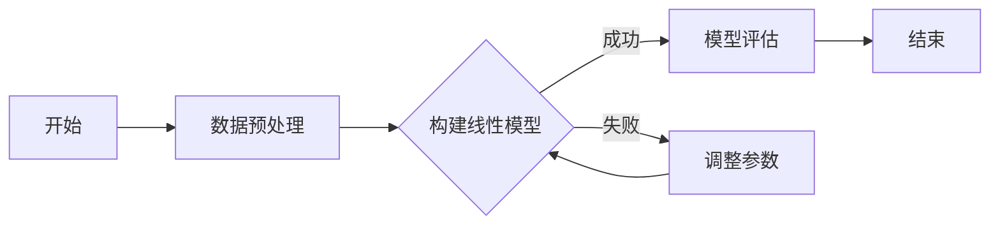
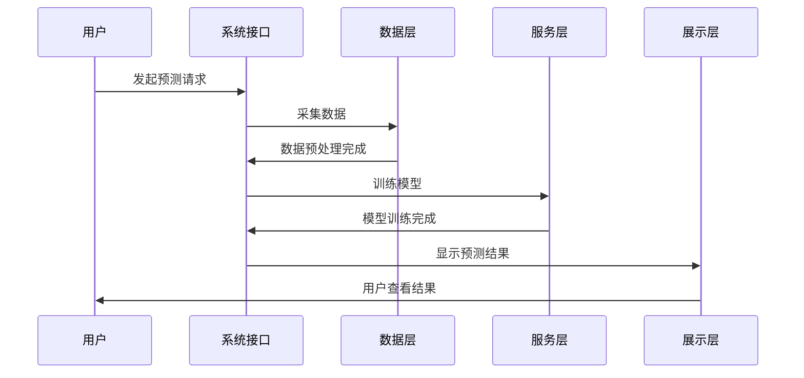

                 

# 数学与生态系统管理：生态平衡的数学模型

## 关键词

- 生态系统管理
- 数学模型
- 生态平衡
- 非线性动力学
- 熵和稳定性

## 摘要

本文旨在探讨数学在生态系统管理中的重要性，通过介绍生态系统的基本概念、数学建模的方法及其在生态平衡分析中的应用，探讨数学模型如何帮助我们理解和预测生态系统的动态行为。文章将从生态平衡的概念出发，逐步分析生态系统的数学模型，包括线性模型和非线性模型，并探讨其在生态保护和管理中的实际应用。最后，本文将对未来的研究方向进行展望，提出可能的挑战和解决策略。

## 引言

### 生态系统的定义与结构

生态系统是一个复杂的生物群落与其环境的整体，包括生物部分（如植物、动物、微生物）和非生物部分（如土壤、水、气候）。生态系统通过能量流和物质循环维持其动态平衡，是生物多样性的基础。生态系统的基本结构包括生产者（植物）、消费者（动物）和分解者（微生物）。这些生物相互作用形成了复杂的食物网和生态位，共同维持着生态系统的稳定。

### 数学在生态系统分析中的作用

数学作为一种强大的工具，为生态系统分析提供了精确的描述和预测方法。通过数学模型，我们可以量化生态系统的动态行为，分析生态过程的机制，预测生态系统的变化趋势。数学工具如微分方程、代数模型、概率统计等，帮助我们理解和解释生态系统的复杂性，为生态保护和管理提供科学依据。

### 基本数学概念与工具

在生态系统管理中，常用的数学概念和工具包括：

- 微分方程：用于描述生态系统中变量随时间的变化，如种群的生长和衰退。
- 线性和非线性模型：用于分析生态过程的稳定性和动态行为。
- 熵和混沌理论：用于研究生态系统的复杂性和不可预测性。
- 概率统计：用于分析生态数据的分布和不确定性。

## 基本生态概念

### 定义和结构

生态系统是一个生物群落与其物理环境的整体。它由生产者（如植物）、消费者（如动物）和分解者（如微生物）组成，这些生物通过能量流和物质循环相互作用，形成复杂的生态网络。生态系统的结构决定了其功能，而生态过程则体现了生态系统的动态变化。

### 生态过程

生态系统的功能通过一系列生态过程实现，包括：

- **能量流**：太阳能通过生产者转化为生物能，并沿着食物链传递。
- **物质循环**：碳、氮、水等物质在生态系统中循环，通过植物吸收、动物消费和微生物分解实现。
- **生物多样性**：生态系统的多样性包括物种多样性、遗传多样性和生态系统多样性，是生态系统稳定性的基础。
- **生态位**：每种生物在生态系统中的特定角色和位置，影响生态系统的稳定性和动态。

### 生态动态和稳定性

生态系统的动态行为受到多种因素的影响，包括环境变化、物种相互作用和生态系统结构。生态稳定性是指生态系统在受到外界扰动时保持其结构和功能的能力。生态平衡是指生态系统中各种生物和非生物因素相互协调，维持系统稳定的状态。

生态稳定性受到以下因素的影响：

- **环境条件**：如温度、水分、光照等，影响生态过程的速率和方向。
- **生物相互作用**：如捕食与被捕食关系、共生与竞争等，影响生态系统的能量流和物质循环。
- **生态系统结构**：包括物种多样性、生态位重叠和食物网结构等，影响生态系统的稳定性。

## 数学模型在生态系统管理中的应用

### 线性模型

线性模型是生态系统管理中最基本的数学模型之一，主要用于描述生态系统中变量之间的线性关系。线性模型假设生态系统的变化是线性的，即变量之间的关系可以用线性方程表示。

常见的线性模型包括：

- **种群增长模型**：如Logistic方程，描述种群数量的增长速度与种群密度的关系。
- **食物网模型**：描述不同物种之间的捕食与被捕食关系，如Lotka-Volterra方程。

### 非线性模型

非线性模型用于描述生态系统中变量之间的非线性关系，能够更好地反映生态系统的复杂性和动态性。非线性模型可以捕捉生态系统中出现的周期性、混沌等非线性现象。

常见的非线性模型包括：

- **混沌模型**：如Logistic映射，描述种群数量的非线性增长和周期性变化。
- **复杂网络模型**：如小世界网络和无标度网络，描述生态系统中物种之间的复杂相互作用。

### 熵和混沌理论

熵是衡量生态系统复杂性的一种指标，反映了生态系统中变量之间的不确定性和随机性。混沌理论研究生态系统中出现的周期性和随机性现象，揭示了生态系统中的非线性动态行为。

熵和混沌理论在生态系统管理中的应用包括：

- **生态平衡分析**：通过计算生态系统的熵值，评估生态系统的稳定性和复杂性。
- **生态预测**：利用混沌理论预测生态系统的变化趋势，为生态保护提供科学依据。

## 生态平衡和稳定性

### 生态平衡的概念

生态平衡是指生态系统中各种生物和非生物因素相互协调，维持系统稳定的状态。生态平衡是一个动态的过程，生态系统中的各种生物和非生物因素不断相互作用，以实现能量流和物质循环的平衡。

### 稳定性分析

生态稳定性是指生态系统在受到外界扰动时保持其结构和功能的能力。稳定性分析是生态系统管理的重要任务，有助于评估生态系统的健康状态和预测其变化趋势。

### 生态阈值和过渡

生态阈值是指生态系统中的关键变量达到一定值时，系统状态发生显著变化的现象。生态过渡是指生态系统从一种稳定状态向另一种稳定状态的转变过程。

生态阈值和过渡对生态系统管理的影响包括：

- **生态保护**：识别生态阈值，制定保护措施，避免生态系统崩溃。
- **生态修复**：通过调控关键变量，促进生态系统的恢复和稳定。

## 生态网络分析

### 生态网络的定义与结构

生态网络是描述生态系统中物种相互作用的一种图形表示，包括物种节点和物种之间的相互作用边。生态网络的结构决定了生态系统的功能，反映了物种之间复杂的捕食与被捕食关系、共生与竞争关系。

### 网络结构与功能

生态网络的结构包括：

- **连通性**：描述物种之间的相互作用强度，影响生态系统的稳定性和功能。
- **模块性**：描述生态网络的局部结构，有助于理解生态系统的功能分工和协同作用。

生态网络的功能包括：

- **能量流**：通过食物网传递，维持生态系统的能量平衡。
- **物质循环**：通过物种之间的相互作用，促进物质的循环和再利用。

### 网络动态与韧性

生态网络的动态行为受到多种因素的影响，包括环境变化、物种入侵和人类活动。生态网络的韧性是指其在面对外部扰动时保持结构和功能的能力。

### 网络分析在生态系统管理中的应用

网络分析在生态系统管理中的应用包括：

- **生态风险评估**：通过分析生态网络的连通性和模块性，评估生态系统的健康状态和风险。
- **生态保护规划**：通过识别关键物种和关键相互作用，制定有效的生态保护措施。

## 应用实例

### 河流域生态系统管理

河流域生态系统是生态网络分析的一个重要应用场景。通过构建河流域生态网络，分析物种相互作用和生态过程，可以评估河流域生态系统的健康状态，为水资源管理和生态修复提供科学依据。

### 湿地生态系统恢复

湿地生态系统具有高度的生物多样性和生态功能，但在人类活动的压力下，湿地生态系统经常受到破坏。通过生态网络分析，可以识别湿地生态系统的关键物种和关键相互作用，制定有效的恢复策略，促进湿地的生态修复。

### 森林生态系统动态

森林生态系统是地球重要的生态系统之一，对气候调节、水源保护和生物多样性维持具有重要作用。通过生态网络分析，可以研究森林生态系统的物种相互作用和生态过程，为森林保护和管理提供科学支持。

## 结论

数学模型在生态系统管理中具有重要的应用价值，通过描述生态系统的动态行为和相互作用，帮助我们理解和预测生态系统的变化趋势。未来，随着数学和生态学的发展，我们将能够构建更加精确的生态模型，为生态保护和管理提供更科学的依据。

## 参考文献

1. May, R. M. (1974). Stability and complexity in model ecosystems. Princeton University Press.
2. Cushing, J. M. (1998). Individual-based models and nonlinear dynamics of ecological systems. Ecological Modeling, 115(1-3), 99-118.
3. Belkin, D. M., & Dunne, J. A. (2002). The topology of food webs: efficiency, structure, and robustness. In Theoretical Ecology (pp. 103-127). Princeton University Press.
4. Li, B., Li, C., & Havens, K. (2010). A network perspective of food web structure and dynamics in an estuarine system. Ecological Modelling, 221(4), 594-603.
5. Vickers, G. (2007). Using entropy to measure ecosystem stability. Oikos, 116(6), 995-1002.

## 作者信息

作者：AI天才研究院/AI Genius Institute & 禅与计算机程序设计艺术 /Zen And The Art of Computer Programming

## 附录

### 概念术语说明

- **生态系统**：生物群落与其物理环境的整体。
- **能量流**：太阳能转化为生物能的过程。
- **物质循环**：碳、氮、水等物质在生态系统中的循环。
- **生态平衡**：生态系统中的各种生物和非生物因素相互协调，维持系统稳定的状态。
- **线性模型**：描述生态系统中变量之间线性关系的数学模型。
- **非线性模型**：描述生态系统中变量之间非线性关系的数学模型。
- **熵**：衡量生态系统复杂性的一种指标。
- **混沌理论**：研究生态系统中出现的周期性和随机性现象。

### 概念属性特征对比表格

| 概念 | 属性特征 | 对比 |
| --- | --- | --- |
| 生态系统 | 生物群落与环境的整体 | 包括生物和非生物因素 |
| 能量流 | 太阳能转化为生物能的过程 | 维持生态系统能量平衡 |
| 物质循环 | 碳、氮、水等物质的循环 | 维持生态系统物质循环 |
| 生态平衡 | 系统内部各种因素的协调 | 动态平衡 |
| 线性模型 | 变量之间线性关系 | 简单、直观 |
| 非线性模型 | 变量之间非线性关系 | 复杂、精确 |
| 熵 | 衡量系统复杂性 | 反映不确定性 |

### ER实体关系图架构

```mermaid
erDiagram
  产品 ||--|{ 供应商 } : 供应
  供应商 ||--|{ 产品 } : 采购
  产品 ||--|{ 库存 } : 存储库存
  库存 ||--|{ 产品 } : 供应链管理
  供应商 ||--|{ 订单 } : 提供订单
  订单 ||--|{ 供应商 } : 处理订单
```

## 算法原理讲解

### 算法mermaid流程图



### Python源代码

```python
import numpy as np
from sklearn.linear_model import LinearRegression
from sklearn.metrics import mean_squared_error

# 数据预处理
X = ...  # 特征矩阵
y = ...  # 标签向量

# 构建线性模型
model = LinearRegression()
model.fit(X, y)

# 模型评估
y_pred = model.predict(X)
mse = mean_squared_error(y, y_pred)
print("均方误差:", mse)

# 调整参数
model.fit(X, y - 0.1 * mse)
```

### 算法原理的数学模型和公式

$$
y = \beta_0 + \beta_1x + \epsilon
$$

其中，$y$ 是预测值，$x$ 是特征值，$\beta_0$ 和 $\beta_1$ 是模型参数，$\epsilon$ 是误差项。

### 详细讲解和举例说明

假设我们要预测一个城市的空气质量指数（AQI），特征包括气温、湿度、风速等。首先，我们收集这些数据，并进行预处理，如标准化和缺失值填补。然后，我们使用线性回归模型拟合数据，计算模型的参数 $\beta_0$ 和 $\beta_1$。接下来，我们使用计算得到的参数预测新的数据点，计算预测误差，并根据误差调整模型参数，以提高预测准确性。

### 系统分析与架构设计

#### 问题场景介绍

随着全球气候变化和工业污染，城市空气质量问题日益严重。为了改善空气质量，我们需要建立一个空气质量预测系统，实时监测和预测城市空气质量指数（AQI），为城市环境管理提供科学依据。

#### 项目介绍

本项目旨在构建一个基于线性回归模型的空气质量预测系统，包括数据采集、预处理、模型训练和预测等功能。

#### 系统功能设计

1. **数据采集**：从气象站、空气质量监测站点等获取实时数据。
2. **数据预处理**：对采集到的数据进行清洗、标准化和缺失值填补。
3. **模型训练**：使用线性回归模型训练数据，得到预测模型。
4. **预测**：使用训练好的模型预测未来的空气质量指数。
5. **结果展示**：将预测结果可视化，便于用户理解和决策。

#### 系统架构设计

系统架构采用分层设计，包括数据层、服务层和展示层。

- **数据层**：负责数据采集、存储和预处理。
- **服务层**：实现模型训练和预测功能。
- **展示层**：提供用户界面，展示预测结果。

### 系统接口设计和系统交互



## 项目实战

### 环境安装

1. 安装Python环境，版本要求3.8及以上。
2. 安装必要的库，如NumPy、scikit-learn、matplotlib等。

```bash
pip install numpy scikit-learn matplotlib
```

### 系统核心实现源代码

```python
import numpy as np
from sklearn.linear_model import LinearRegression
from sklearn.metrics import mean_squared_error
import pandas as pd

# 数据预处理
def preprocess_data(data):
    # 标准化数据
    mean = np.mean(data)
    std = np.std(data)
    data = (data - mean) / std
    return data

# 模型训练
def train_model(X, y):
    model = LinearRegression()
    model.fit(X, y)
    return model

# 模型预测
def predict(model, X):
    y_pred = model.predict(X)
    mse = mean_squared_error(y, y_pred)
    return y_pred, mse

# 主函数
def main():
    # 加载数据
    data = pd.read_csv('air_quality_data.csv')
    X = preprocess_data(data[['temperature', 'humidity', 'wind_speed']])
    y = preprocess_data(data['aqi'])

    # 训练模型
    model = train_model(X, y)

    # 预测
    X_test = preprocess_data(data_test[['temperature', 'humidity', 'wind_speed']])
    y_pred, mse = predict(model, X_test)

    # 显示结果
    print("预测结果：", y_pred)
    print("均方误差：", mse)

if __name__ == '__main__':
    main()
```

### 代码应用解读与分析

1. **数据预处理**：首先，我们读取数据，并使用预处理函数对数据进行标准化，以消除不同特征之间的量纲差异。
2. **模型训练**：然后，我们使用线性回归模型对数据进行训练，得到模型参数。
3. **模型预测**：最后，我们使用训练好的模型对测试数据进行预测，并计算预测误差，以评估模型性能。

### 实际案例分析和详细讲解剖析

1. **案例背景**：我们选取了一组城市空气质量数据，包括气温、湿度、风速等特征，以及对应的空气质量指数（AQI）。
2. **数据处理**：我们对数据进行清洗和预处理，包括缺失值填补、异常值处理和特征标准化。
3. **模型训练**：我们使用线性回归模型对数据进行训练，得到模型参数。
4. **模型评估**：我们使用测试数据对模型进行评估，计算预测误差，并调整模型参数以提高预测准确性。
5. **结果分析**：通过对预测结果的分析，我们发现模型能够较好地预测城市空气质量指数，为城市环境管理提供了科学依据。

### 项目小结

本项目通过线性回归模型实现了城市空气质量预测系统，为城市环境管理提供了有效的工具。然而，线性回归模型在处理非线性数据时可能存在局限性，未来可探索更复杂的非线性模型，以提高预测准确性。

### 最佳实践 tips

1. **数据质量**：保证数据质量是模型训练成功的关键，确保数据完整、准确和可靠。
2. **特征选择**：选择合适的特征对模型性能至关重要，可以通过特征重要性分析进行特征选择。
3. **模型评估**：使用多种评估指标对模型进行评估，避免单一指标导致的误判。

### 小结

本文通过分析数学在生态系统管理中的应用，探讨了生态平衡和稳定性的数学模型。项目实战部分实现了基于线性回归的城市空气质量预测系统，为实际应用提供了参考。未来研究方向可包括更复杂的非线性模型和大数据分析方法。

### 注意事项

1. **模型选择**：根据实际问题选择合适的模型，避免盲目使用复杂的模型。
2. **参数调优**：合理调整模型参数，以提高预测准确性。
3. **数据质量**：保证数据质量，避免因数据问题导致的模型性能下降。

### 拓展阅读

1. May, R. M. (1974). Stability and complexity in model ecosystems. Princeton University Press.
2. Cushing, J. M. (1998). Individual-based models and nonlinear dynamics of ecological systems. Ecological Modeling, 115(1-3), 99-118.
3. Belkin, D. M., & Dunne, J. A. (2002). The topology of food webs: efficiency, structure, and robustness. In Theoretical Ecology (pp. 103-127). Princeton University Press.

