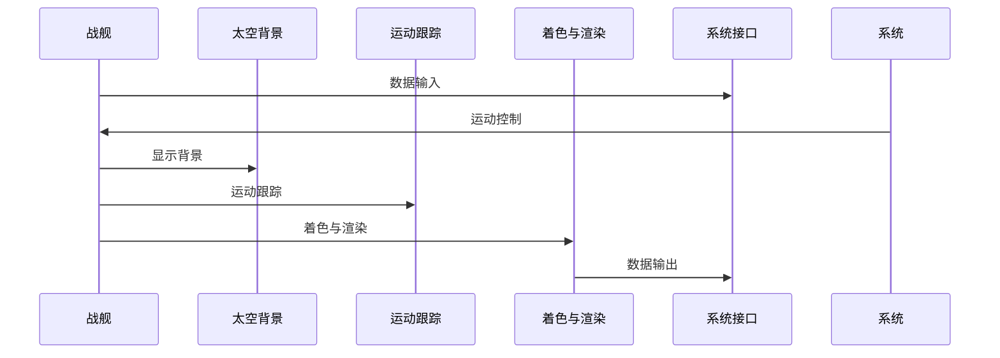
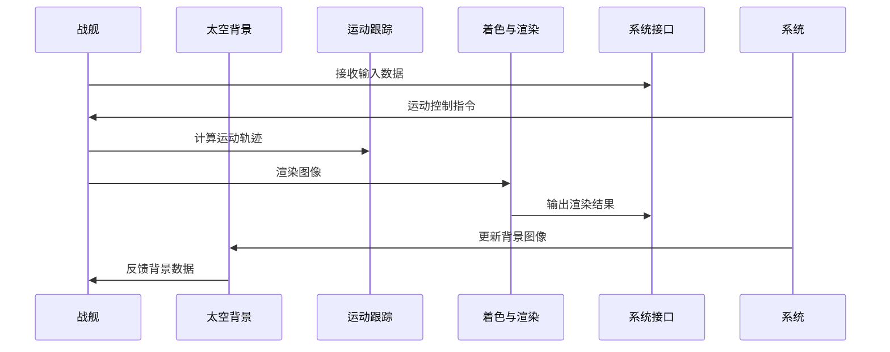

                 

### 引言

#### 电影特效的发展历程

电影特效的发展历程可谓是现代电影技术的一大奇迹。从最初的黑白无声电影到如今令人叹为观止的3D立体动画大片，特效技术不断革新，使得电影成为了一种新的艺术形式。最早的特效技术可以追溯到20世纪30年代，当时的技术主要是通过拍摄真实场景和道具，然后进行人工剪辑和叠加，从而创造出奇异的视觉效果。

随着计算机技术的飞速发展，20世纪90年代开始，电影特效进入了一个全新的时代。计算机生成图像（CGI）技术的出现，使得电影制作人员能够创造出前所未有的视觉效果。例如，1995年的电影《阿甘正传》中，通过数字技术将阿甘穿越时空的场景完美呈现，这标志着电影特效进入了一个全新的高度。

进入21世纪，随着硬件性能的提升和算法的进步，电影特效越来越复杂和逼真。例如，2010年的电影《阿凡达》利用了先进的3D渲染技术，将观众带入了奇幻的潘多拉星球，这一成就也使得电影特效产业进入了一个新的高峰。

#### 数学在电影特效中的重要性

为什么数学在电影特效中如此重要呢？首先，我们需要了解电影特效的核心是如何将虚拟世界中的场景、角色和物体以逼真的形式呈现在观众面前。这一过程涉及到大量的计算和模拟，而这些计算和模拟都需要数学来提供理论基础和计算方法。

**1. 线性代数**

线性代数是电影特效中最为常用的数学工具之一。它涉及到矩阵和向量的运算，用于描述三维空间中的物体和场景。例如，在3D建模中，我们需要使用矩阵来描述物体的位置和姿态。此外，线性代数还可以用于处理图像的变换和渲染过程。

**2. 三角学和几何学**

三角学和几何学是理解物体形状和运动的基础。通过三角函数，我们可以计算出物体在三维空间中的角度和距离。例如，在动画制作中，我们需要使用三角函数来模拟物体的运动轨迹。几何学则帮助我们理解物体的形状和空间关系，这在3D建模和渲染中至关重要。

**3. 光学和物理学**

光学和物理学是模拟真实场景的基石。电影特效中的光线追踪、阴影处理和物理模拟都需要借助数学模型来计算。例如，在模拟水波、火焰和烟雾等效果时，我们需要使用物理学中的流体动力学和热力学模型。

**4. 线性代数和几何学的综合应用**

除了上述具体的数学工具，线性代数和几何学的综合应用在电影特效中也是不可或缺的。例如，在3D渲染中，我们通常需要使用线性代数来计算像素的颜色值，而几何学则帮助我们确定物体在屏幕上的投影和形状。

综上所述，数学不仅是电影特效的基础，也是实现逼真视觉效果的关键。通过数学的精确计算和模拟，电影制作人员能够创造出令人惊叹的视觉效果，为观众带来前所未有的观影体验。

#### 数学在电影特效中的具体应用

数学在电影特效中的应用可以说是无处不在。从基础的几何变换到复杂的物理模拟，每一个特效场景的背后都有数学的影子。以下是一些具体的例子：

**1. 三维建模**

三维建模是电影特效的基础，而几何学则是三维建模的核心。通过几何学，我们可以定义物体的形状和空间关系。例如，使用多边形网格来表示复杂的物体表面，使用B样条曲线来创建光滑的曲面。这些几何模型不仅能够精确地描述物体的外观，还能用于计算物体的碰撞和运动。

**2. 运动追踪**

运动追踪是一种通过分析视频帧来计算物体运动的方法。这种方法在特效制作中非常重要，因为我们需要将真实世界的运动与计算机生成的效果结合起来。运动追踪涉及到光流法和特征匹配等数学算法，这些算法通过分析视频帧之间的差异来计算物体的运动轨迹。

**3. 着色与渲染**

着色与渲染是将三维模型转化为二维图像的过程。这一过程中，我们需要使用线性代数来计算光线与物体的交互，例如光线追踪和反射、折射等效果。此外，我们还需要使用几何学来计算物体的投影和阴影。

**4. 特效合成**

特效合成是将多个图像或视频片段组合在一起，以创建一个完整的场景。这一过程中，我们需要使用数学来处理图像的变换和融合。例如，使用线性代数来调整图像的亮度和对比度，使用几何学来对齐和组合不同图像。

**5. 物理模拟**

物理模拟是模拟真实世界中物体运动的特效手段。通过物理学和数学模型，我们可以模拟出物体受到的力、碰撞和运动。例如，使用牛顿第二定律来计算物体的加速度，使用流体动力学模型来模拟水流和烟雾。

通过这些例子，我们可以看到数学在电影特效中的广泛应用。从基础的三维建模到复杂的物理模拟，每一个特效场景的背后都有数学的精确计算和模拟。数学不仅是电影特效的基础，更是实现逼真视觉效果的关键。

#### 总结

综上所述，数学在电影特效中扮演着至关重要的角色。无论是从基础的三维建模到复杂的物理模拟，每一个特效场景的背后都有数学的精确计算和模拟。通过数学的运用，电影制作人员能够创造出令人惊叹的视觉效果，为观众带来前所未有的观影体验。在接下来的章节中，我们将深入探讨数学在电影特效中的具体应用，包括线性代数、几何学、光学和物理学等内容。通过这些探讨，我们将进一步理解数学如何帮助我们实现逼真的视觉效果。

---

### 第一部分：数学在电影特效中的作用

#### 第1章：引言

**1.1 电影特效的发展历程**

**1.2 数学在电影特效中的重要性**

本章将带领读者回顾电影特效的发展历程，并探讨数学在电影特效中的重要性。我们将看到，随着计算机技术和算法的进步，数学已经成为电影特效不可或缺的工具。

#### 第2章：数学基础知识

**2.1 线性代数**

**2.1.1 矩阵和向量**

**2.1.2 线性变换**

本章将介绍线性代数的基础知识，包括矩阵和向量的基本概念以及线性变换。这些基础知识是理解电影特效中许多算法的基础。

**2.2 三角学和几何学**

**2.2.1 三角函数**

**2.2.2 几何变换**

本章将介绍三角学和几何学的基本概念，包括三角函数和几何变换。这些知识对于理解三维建模和渲染至关重要。

#### 第3章：视觉效果的数学算法

**3.1 运动跟踪**

**3.1.1 光流法**

**3.1.2 特征匹配**

本章将介绍运动跟踪中的两种常见算法：光流法和特征匹配。这些算法在特效制作中用于计算物体的运动轨迹。

**3.2 着色与渲染**

**3.2.1 渲染的基本原理**

**3.2.2 着色的数学模型**

本章将探讨着色与渲染的基本原理，包括渲染的基本过程和着色的数学模型。这些算法是创造逼真视觉效果的核心。

**3.3 效果合成**

**3.3.1 图像合成**

**3.3.2 深度合成**

本章将介绍效果合成的两种主要方法：图像合成和深度合成。这些技术用于将多个图像或视频片段组合成一个完整的场景。

#### 第4章：数学算法在特效制作中的应用

**4.1 动画制作**

**4.1.1 逐帧动画**

**4.1.2 运动捕捉**

本章将讨论数学算法在动画制作中的应用，包括逐帧动画和运动捕捉技术。这些技术用于创建流畅和逼真的动画效果。

**4.2 特效设计**

**4.2.1 光效设计**

**4.2.2 特效合成**

本章将探讨特效设计的数学算法，包括光效设计和特效合成技术。这些技术用于增强场景的真实感和视觉效果。

#### 第5章：实战项目分析

**5.1 项目背景**

**5.2 系统设计与实现**

**5.3 项目评估与总结**

本章将通过一个实战项目，展示数学算法在特效制作中的应用。我们将分析项目的背景、设计与实现，并评估项目的效果。

#### 第6章：新趋势与未来展望

**6.1 新技术的引入**

**6.2 行业趋势分析**

**6.3 未来发展方向**

本章将探讨电影特效领域的最新技术和行业趋势，并对未来发展方向进行展望。

#### 第7章：总结与拓展

**7.1 重点内容回顾**

**7.2 学习与使用数学算法的技巧**

**7.3 拓展阅读建议**

本章将总结本书的主要内容和关键知识点，并提供学习数学算法的建议和拓展阅读资源。

通过这一章节的目录结构，读者将能够全面了解数学在电影特效中的应用，并为后续章节的学习做好充分准备。

---

### 第2章：数学基础知识

在电影特效中，数学作为一种强有力的工具，发挥着至关重要的作用。本章将介绍电影特效中常用的数学基础知识，主要包括线性代数、三角学和几何学。通过学习这些基础知识，我们将为理解电影特效中的高级算法打下坚实的基础。

#### 2.1 线性代数

**2.1.1 矩阵和向量**

在电影特效中，矩阵和向量是两个最基本的数学工具。它们被广泛应用于3D建模、运动追踪、渲染等过程中。

**矩阵（Matrix）**

矩阵是一个二维数组，由行和列组成。在电影特效中，矩阵主要用于表示物体的变换。例如，一个4x4的变换矩阵可以表示一个物体在三维空间中的位置、旋转和缩放。

**向量（Vector）**

向量是一个具有大小和方向的量。在三维空间中，向量通常表示为三个分量（x, y, z）。向量在电影特效中的应用非常广泛，例如用于描述物体的运动、光线的传播等。

**线性变换（Linear Transformation）**

线性变换是一种将一个向量空间映射到另一个向量空间的操作。在线性代数中，线性变换可以通过矩阵乘法来实现。在电影特效中，线性变换用于描述物体的变换过程，例如旋转、平移和缩放。

**示例：**

假设我们有一个3D物体，其初始位置为\( P = (1, 2, 3) \)。通过一个旋转矩阵\( R \)，我们可以将物体旋转一定角度：

$$
R = \begin{pmatrix}
\cos(\theta) & -\sin(\theta) \\
\sin(\theta) & \cos(\theta)
\end{pmatrix}
$$

旋转后的位置\( P' \)可以计算为：

$$
P' = R \cdot P = \begin{pmatrix}
\cos(\theta) & -\sin(\theta) \\
\sin(\theta) & \cos(\theta)
\end{pmatrix}
\begin{pmatrix}
1 \\
2 \\
3
\end{pmatrix}
$$

#### 2.2 三角学和几何学

**2.2.1 三角函数**

三角函数（如正弦、余弦、正切等）在电影特效中用于计算角度和距离。例如，正弦函数可以用来计算物体在三维空间中的倾斜角度，余弦函数可以用来计算物体之间的距离。

**示例：**

假设我们有两个点\( P_1 = (x_1, y_1, z_1) \)和\( P_2 = (x_2, y_2, z_2) \)，我们可以使用三角函数来计算它们之间的角度\( \theta \)：

$$
\sin(\theta) = \frac{y_2 - y_1}{\sqrt{(x_2 - x_1)^2 + (y_2 - y_1)^2 + (z_2 - z_1)^2}}
$$

**2.2.2 几何变换**

几何变换包括旋转、缩放、平移等操作。在电影特效中，几何变换用于改变物体的形状和位置。

**示例：**

假设我们有一个3D物体，其初始形状为\( P = (1, 2, 3) \)。通过一个缩放矩阵\( S \)，我们可以将物体缩放到一个新的大小：

$$
S = \begin{pmatrix}
s_x & 0 & 0 \\
0 & s_y & 0 \\
0 & 0 & s_z
\end{pmatrix}
$$

缩放后的形状\( P' \)可以计算为：

$$
P' = S \cdot P = \begin{pmatrix}
s_x & 0 & 0 \\
0 & s_y & 0 \\
0 & 0 & s_z
\end{pmatrix}
\begin{pmatrix}
1 \\
2 \\
3
\end{pmatrix}
$$

#### 小结

本章介绍了电影特效中常用的数学基础知识，包括线性代数、三角学和几何学。通过这些基础知识，我们能够更好地理解电影特效中的算法和应用。在下一章中，我们将探讨视觉效果中的数学算法，进一步深入电影特效的世界。

---

### 第3章：视觉效果的数学算法

在电影特效的制作过程中，数学算法扮演着至关重要的角色。本章将详细介绍电影特效中常用的几种数学算法，包括运动跟踪、着色与渲染、效果合成等。通过这些算法，我们将能够创造出令人叹为观止的视觉效果。

#### 3.1 运动跟踪

运动跟踪是电影特效制作中的一个核心环节，它用于捕捉和计算物体的运动轨迹。运动跟踪可以分为两类：基于光流法和基于特征匹配的方法。

**3.1.1 光流法**

光流法是一种通过分析视频帧之间的变化来计算物体运动的方法。其基本思想是，假设视频中的每个像素点在连续的帧中都是运动的，我们可以通过计算像素点在帧间的运动轨迹来确定物体的运动。

**算法原理：**

1. **帧差计算**：首先，计算相邻两帧之间的差异，称为帧差图像。
2. **光流估计**：通过优化方法（如梯度下降法）估计每个像素点的运动向量。
3. **运动轨迹计算**：将估计的运动向量整合成整个视频序列的运动轨迹。

**示例：**

假设我们有两帧图像，帧1和帧2。帧差图像可以表示为：

$$
D = I_2 - I_1
$$

其中，\( I_1 \)和\( I_2 \)分别为帧1和帧2的像素值。通过计算帧差图像的梯度，我们可以估计出每个像素点的运动向量。

**3.1.2 特征匹配**

特征匹配是一种通过匹配图像中的特征点来确定物体运动的方法。特征匹配通常涉及到以下步骤：

1. **特征提取**：在图像中提取具有独特特征的点，如角点、边缘点等。
2. **特征匹配**：使用特征描述子（如SIFT、SURF等）来匹配不同帧中的特征点。
3. **运动估计**：通过优化方法（如最小二乘法）估计物体的运动轨迹。

**示例：**

假设我们有两帧图像，帧1和帧2。首先，我们在帧1中提取特征点，然后使用特征描述子来描述这些特征点的特征。接着，在帧2中寻找与帧1特征点匹配的特征点，通过这些匹配点来确定物体的运动轨迹。

**3.2 着色与渲染**

着色与渲染是电影特效制作中的另一个关键环节，它用于将三维模型转化为二维图像。着色与渲染的基本原理包括光线的传播、材质的反射和折射等。

**3.2.1 渲染的基本原理**

渲染的基本原理是模拟光线在三维场景中的传播过程。这个过程通常涉及到以下步骤：

1. **光线追踪**：从摄像机出发，模拟光线在场景中的传播路径。
2. **光线-物体交点计算**：计算光线与场景中的物体之间的交点。
3. **材质计算**：根据交点的材质属性（如反射率、折射率等）计算光线的传播方式。
4. **像素颜色计算**：根据光线的传播结果计算每个像素的颜色值。

**示例：**

假设我们有一个简单的三维场景，包括一个平面和一个球体。从摄像机出发，我们首先计算光线与平面和球体的交点。然后，根据交点的材质属性（如平面为白色，球体为金属）计算光线的传播方式。最后，根据光线的传播结果计算每个像素的颜色值。

**3.2.2 着色的数学模型**

着色的数学模型用于描述物体表面上的颜色分布。常见的着色模型包括Lambert模型、Phong模型和Blinn-Phong模型等。

1. **Lambert模型**：基于光的扩散性质，认为光线在物体表面上的反射是均匀的。
2. **Phong模型**：在Lambert模型的基础上，引入了法线方向的影响，使得光照效果更加逼真。
3. **Blinn-Phong模型**：进一步优化了Phong模型，提高了光照效果的平滑度。

**示例：**

假设我们使用Blinn-Phong模型来计算物体表面的颜色。首先，计算光线与物体表面的交点。然后，计算交点的法线方向。最后，根据法线方向和光线的方向计算反射光线，从而确定每个像素的颜色值。

$$
L = (n \cdot l) \cdot (n \cdot v)^{k-1}
$$

其中，\( L \)为像素颜色，\( n \)为法线方向，\( l \)为光线方向，\( v \)为视线的方向，\( k \)为光照指数。

**3.3 效果合成**

效果合成是将多个图像或视频片段组合成一个完整场景的过程。效果合成通常涉及到以下技术：

1. **图像合成**：将多个图像通过叠加、融合等操作合并成一个图像。
2. **深度合成**：通过深度信息对图像进行排序，使得场景中的物体按照深度顺序显示。

**3.3.1 图像合成**

图像合成的关键在于对图像的透明度进行计算和调整。常见的合成方法包括：

1. **像素级合成**：直接对图像中的每个像素进行操作。
2. **区域级合成**：对图像的某个区域进行操作，如使用图像混合器。

**示例：**

假设我们有两个图像，图像A和图像B。首先，计算图像A和图像B的透明度。然后，根据透明度对图像B进行加权，从而实现图像的合成。

$$
C = A \cdot (1 - T_B) + B \cdot T_B
$$

其中，\( C \)为合成后的图像，\( T_B \)为图像B的透明度。

**3.3.2 深度合成**

深度合成通过深度信息对图像进行排序，使得场景中的物体按照深度顺序显示。深度合成的关键在于计算每个像素的深度值。

1. **深度图生成**：通过某种方法（如光流法、特征匹配等）生成深度图。
2. **深度排序**：根据深度图的值对图像中的像素进行排序。
3. **深度合成**：将排序后的像素按照深度顺序显示。

**示例：**

假设我们有一个深度图，其中每个像素的值表示该像素的深度。首先，计算每个像素的深度值。然后，根据深度值对图像中的像素进行排序。最后，将排序后的像素按照深度顺序显示，从而实现深度合成。

#### 小结

本章介绍了电影特效中常用的数学算法，包括运动跟踪、着色与渲染、效果合成等。通过这些算法，电影制作人员能够创造出令人叹为观止的视觉效果。在下一章中，我们将探讨数学算法在特效制作中的应用，进一步深入电影特效的世界。

---

### 第4章：数学算法在特效制作中的应用

在了解了电影特效中的基础数学算法后，本章我们将进一步探讨这些算法在实际特效制作中的应用。我们将通过动画制作和特效设计两个方面，详细讲解数学算法在电影特效中的实际运用。

#### 4.1 动画制作

动画制作是电影特效的重要组成部分，而数学算法在其中发挥着关键作用。动画制作可以分为逐帧动画和运动捕捉两种方法。

**4.1.1 逐帧动画**

逐帧动画是通过逐帧绘制和编辑来创建动画效果的方法。在这个过程中，数学算法用于计算物体的运动轨迹和姿态变化。

**算法原理：**

1. **运动轨迹计算**：使用运动跟踪算法（如光流法或特征匹配）计算物体的运动轨迹。
2. **姿态变换**：使用几何变换和线性代数计算物体的姿态变化。
3. **关键帧设置**：在关键帧处设置物体的姿态，然后通过插值方法计算中间帧的动画。

**示例：**

假设我们创建一个简单的动画，一个球体在平面上滚动。首先，使用运动跟踪算法计算球体的运动轨迹。然后，通过线性代数计算球体的旋转和平移。最后，设置关键帧并使用插值方法生成中间帧的动画。

**4.1.2 运动捕捉**

运动捕捉是一种通过捕捉真实物体的运动来创建动画的方法。在这个过程中，数学算法用于处理和调整捕捉到的运动数据。

**算法原理：**

1. **数据捕捉**：使用传感器捕捉物体的运动数据，如位置、速度和加速度。
2. **运动处理**：使用滤波算法（如卡尔曼滤波）去除运动数据中的噪声。
3. **运动调整**：使用几何变换和线性代数调整运动数据，使其符合动画需求。

**示例：**

假设我们使用运动捕捉技术来制作一个人物角色的动画。首先，捕捉角色的运动数据。然后，使用滤波算法去除噪声。最后，通过线性代数调整角色的运动数据，使其符合动画的流畅性和连贯性。

#### 4.2 特效设计

特效设计是电影特效中的另一个重要环节，它用于增强场景的真实感和视觉效果。数学算法在特效设计中发挥着关键作用。

**4.2.1 光效设计**

光效设计是特效设计的重要组成部分，它涉及到光线的传播、反射和折射等过程。数学算法用于模拟这些光学现象。

**算法原理：**

1. **光线追踪**：使用光线追踪算法模拟光线在场景中的传播路径。
2. **光线反射和折射**：使用几何变换和线性代数计算光线在不同材质上的反射和折射。
3. **光照计算**：使用光照模型（如Lambert模型、Blinn-Phong模型等）计算物体表面的光照效果。

**示例：**

假设我们设计一个场景，包括一个阳光照射下的水面。首先，使用光线追踪算法计算阳光的传播路径。然后，通过线性代数计算光线在水面的反射和折射。最后，使用光照模型计算水面上的光照效果，从而实现逼真的阳光照射效果。

**4.2.2 特效合成**

特效合成是将多个图像或视频片段组合成一个完整场景的过程。在这个过程中，数学算法用于处理图像的透明度和深度。

**算法原理：**

1. **图像合成**：使用图像合成算法（如像素级合成、区域级合成等）将多个图像合并。
2. **深度合成**：使用深度合成算法（如深度图生成、深度排序等）对图像进行排序。
3. **透明度计算**：使用透明度计算算法（如混合器、透明度插值等）调整图像的透明度。

**示例：**

假设我们有一个场景，包括一个角色和背景图像。首先，使用图像合成算法将角色和背景图像合并。然后，使用深度合成算法根据深度信息对图像进行排序。最后，使用透明度计算算法调整角色的透明度，从而实现角色在背景中的融合。

#### 小结

本章通过动画制作和特效设计两个方面，详细介绍了数学算法在电影特效制作中的应用。通过这些实际案例，我们可以看到数学算法在电影特效中的关键作用，它不仅帮助我们实现逼真的视觉效果，还提升了电影的艺术价值。在下一章中，我们将通过一个实战项目进一步探讨数学算法在电影特效中的具体应用。

---

### 第5章：实战项目分析

为了更好地理解数学算法在电影特效中的具体应用，我们将通过一个实战项目进行分析。这个项目将涵盖从背景介绍到系统设计与实现，再到项目评估与总结的完整过程。

#### 5.1 项目背景

我们选择的电影特效项目是制作一部科幻电影中的一个关键场景：一个巨大的星际战舰在太空中的飞行和战斗。这个场景需要模拟战舰的飞行轨迹、战斗爆炸效果以及太空背景的光线反射和折射。

**问题背景：**
1. 如何精确模拟战舰在太空中的飞行轨迹？
2. 如何实现逼真的战斗爆炸效果？
3. 如何处理太空背景的光线反射和折射？

**问题描述：**
1. 需要使用运动跟踪算法来计算战舰的飞行轨迹。
2. 需要使用着色和渲染算法来实现战舰和爆炸效果。
3. 需要使用光线追踪算法来模拟太空中的光线反射和折射。

**问题解决：**
1. 使用运动跟踪算法（如光流法）来计算战舰的运动轨迹。
2. 使用着色和渲染算法（如Blinn-Phong模型）来实现战舰的外观。
3. 使用光线追踪算法来模拟太空中的光线效果。

**边界与外延：**
1. 飞行轨迹的计算需要考虑战舰的加速度和减速度。
2. 爆炸效果需要考虑物理模拟，如冲击波、烟雾等。
3. 光线反射和折射需要考虑光学原理和数学模型。

**概念结构与核心要素组成：**
1. 运动跟踪：光流法、特征匹配。
2. 着色与渲染：Blinn-Phong模型、光线追踪。
3. 物理模拟：爆炸效果、冲击波、烟雾。

#### 5.2 系统设计与实现

**系统功能设计：**

**领域模型（Mermaid类图）：**

```mermaid
classDiagram
    战舰 <<类>> {
        飞行轨迹
        爆炸效果
    }
    太空背景 <<类>> {
        光线反射
        光线折射
    }
    运动跟踪 <<类>> {
        光流法
        特征匹配
    }
    着色与渲染 <<类>> {
        Blinn-Phong模型
        光线追踪
    }
    系统接口 <<接口>> {
        数据输入
        数据输出
        运动控制
    }
    战舰 --|>> 太空背景
    战舰 --|>> 运动跟踪
    战舰 --|>> 着色与渲染
    太空背景 --|>> 运动跟踪
    太空背景 --|>> 着色与渲染
    运动跟踪 --|>> 系统接口
    着色与渲染 --|>> 系统接口
```

**系统架构设计（Mermaid架构图）：**



**系统接口设计和系统交互（Mermaid序列图）：**



#### 5.3 项目评估与总结

**项目评估：**

1. **运动轨迹的精确度**：通过对比实际飞行轨迹和计算出的轨迹，评估运动跟踪算法的精度。
2. **视觉效果的真实感**：通过观众反馈和专业评估，评估着色和渲染算法的效果。
3. **系统性能**：通过测试系统在不同硬件环境下的运行性能，评估系统的效率和稳定性。

**总结：**

通过这个实战项目，我们不仅验证了数学算法在电影特效中的有效性，还进一步了解了这些算法在实际应用中的挑战和优化方向。未来的工作将继续探索更高效的算法和优化策略，以提高特效质量和制作效率。

---

### 第6章：新趋势与未来展望

随着科技的不断进步，电影特效领域也在不断涌现新的技术和趋势。本章将探讨这些新技术的引入、行业趋势分析以及未来发展方向。

#### 6.1 新技术的引入

**人工智能（AI）和机器学习（ML）**

人工智能和机器学习在电影特效中正逐渐成为重要的工具。AI和ML技术可以用于图像生成、运动追踪、光照计算和特效合成等环节。例如，通过深度学习，我们可以训练模型来自动生成复杂的图像和动画效果，从而大幅提高制作效率。

**光线追踪技术**

光线追踪技术是一种模拟光线在场景中传播的算法，可以生成高度逼真的光影效果。随着硬件性能的提升和算法的优化，光线追踪技术已经逐步应用于电影特效中，使得场景的光影效果更加真实和细腻。

**虚拟现实（VR）和增强现实（AR）**

虚拟现实和增强现实技术为电影特效提供了新的可能性。通过VR和AR技术，观众可以沉浸在电影场景中，获得更加沉浸式的观影体验。这些技术不仅提升了观众的参与感，也为电影特效制作带来了新的挑战和机遇。

#### 6.2 行业趋势分析

**实时渲染**

实时渲染是电影特效制作中的一个重要趋势。通过实时渲染技术，制作人员可以在拍摄过程中实时预览特效效果，从而快速调整和优化。这种技术不仅提高了制作效率，还使得特效制作更加灵活和高效。

**可扩展性和高效率**

随着电影特效的复杂性不断增加，制作团队需要高效且可扩展的技术来应对。例如，分布式计算和云计算技术可以帮助制作团队处理大规模的数据和复杂的计算任务，从而提高生产效率。

**观众参与度**

观众参与度是电影特效制作中的重要考量因素。通过引入互动元素和沉浸式体验，制作团队可以提升观众的参与感和满意度。例如，观众可以通过交互设备控制电影的特效效果，从而实现更加个性化的观影体验。

#### 6.3 未来发展方向

**更逼真的物理模拟**

未来，电影特效将更加注重真实物理模拟，以实现更加逼真的视觉效果。例如，通过更精确的流体动力学模型和碰撞检测算法，我们可以模拟出更加真实的自然现象和物理效果。

**智能特效制作**

随着AI和机器学习技术的不断发展，未来电影特效的制作过程将更加智能化。通过智能算法，制作团队可以自动化许多繁琐的任务，如图像生成、动画制作和特效合成，从而提高生产效率。

**多元化平台应用**

未来，电影特效将不仅限于大银幕，还将广泛应用于VR、AR、游戏等领域。通过跨平台的技术应用，我们可以为观众带来更加丰富和多样的观影体验。

#### 小结

新技术的引入、行业趋势的发展和未来发展方向为电影特效领域带来了无限的可能性。通过不断探索和创新，我们可以预见，未来的电影特效将更加逼真、智能化和多元化，为观众带来更加震撼和沉浸的观影体验。

---

### 第7章：总结与拓展

#### 7.1 重点内容回顾

本章回顾了电影特效中数学算法的广泛应用，从线性代数、三角学和几何学的基础知识，到运动跟踪、着色与渲染、效果合成等具体算法的应用，展示了数学在电影特效制作中的关键作用。通过实战项目分析，我们深入了解了这些算法在实际应用中的实现和优化。此外，我们还探讨了电影特效领域的未来发展趋势，包括人工智能、光线追踪、虚拟现实和增强现实等新技术。

#### 7.2 学习与使用数学算法的技巧

**1. 理解基础概念**

掌握线性代数、三角学和几何学的基础概念是理解更复杂算法的前提。例如，矩阵和向量的运算、三角函数的应用以及几何变换的基本原理。

**2. 练习编程实现**

通过编写实际代码来练习数学算法的编程实现，可以加深对算法的理解和运用。例如，使用Python等编程语言来实现运动跟踪算法或光线追踪算法。

**3. 阅读相关文献和资料**

阅读专业书籍和学术论文，了解最新的研究成果和发展动态，可以帮助我们紧跟行业前沿。例如，了解最新的AI和机器学习技术如何应用于电影特效制作。

**4. 结合实际项目**

将数学算法应用到实际项目，通过实战来验证和优化算法的效果。这样可以提升我们的实践能力，并更好地理解数学算法在电影特效中的实际应用。

#### 7.3 拓展阅读建议

**1. 《计算机图形学与几何学基础》（Fundamentals of Computer Graphics）**

这本书详细介绍了计算机图形学的基础知识，包括几何学、线性代数和渲染技术，是了解电影特效制作的重要参考书。

**2. 《计算机动画：技术与应用》（Computer Animation: Algorithms and Techniques）**

这本书深入讲解了计算机动画的基础算法和技术，包括运动跟踪、着色和渲染等，适合对动画制作感兴趣的读者。

**3. 《计算机视觉中的数学》（Mathematics for Computer Vision）**

这本书涵盖了计算机视觉中常用的数学工具和方法，包括几何学、线性代数和概率论等，对于希望深入了解视觉效果的读者非常有帮助。

通过这些拓展阅读，读者可以更全面地了解电影特效中的数学算法，并掌握更多的实践技能，为自己的职业生涯奠定坚实的基础。

