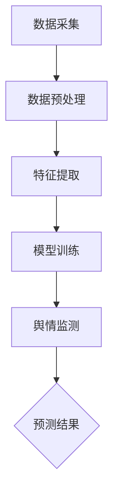
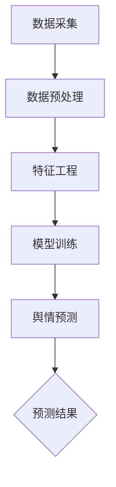
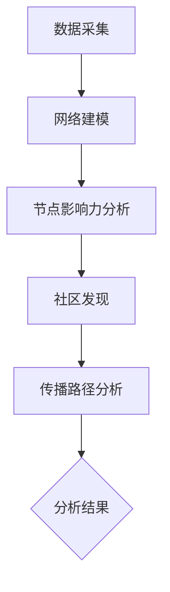
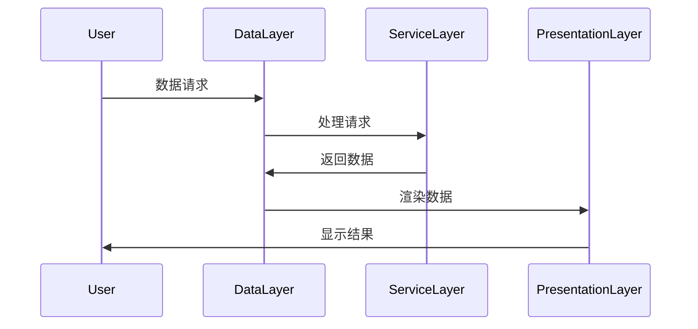
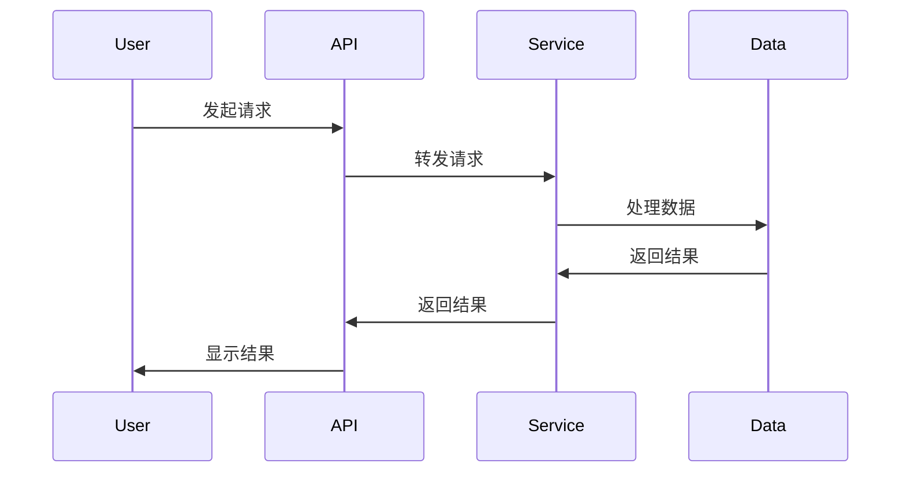

                 

### 《数学与社交媒体分析：网络舆情的数学模型》

> 关键词：社交媒体分析、网络舆情、数学模型、舆情监测、舆情预测

> 摘要：随着社交媒体的快速发展，网络舆情分析成为了一个重要的研究领域。本文通过介绍社交媒体分析的基本原理和数学模型，探讨了网络舆情监测和预测的算法原理及其应用。文章首先阐述了社交媒体分析在舆情分析中的重要性，然后详细讲解了舆情监测、舆情预测和社交网络分析的相关算法原理，并运用具体的数学模型进行了详细阐述。最后，文章通过实例分析和系统架构设计，展示了这些算法在实际应用中的效果和意义。

---

## 《数学与社交媒体分析：网络舆情的数学模型》目录大纲

### 第一部分：背景介绍

### 第1章：问题背景  
## 1.1 问题的提出

### 1.1.1 社交媒体的发展

### 1.1.2 社交媒体分析的重要性

## 1.2 问题描述

### 1.2.1 网络舆情的特点

### 1.2.2 网络舆情分析的目标

## 1.3 问题解决

### 1.3.1 数学模型在社交媒体分析中的应用

### 1.3.2 数学模型在舆情分析中的优势

## 1.4 边界与外延

### 1.4.1 社交媒体分析的应用领域

### 1.4.2 数学模型的应用范围

## 1.5 概念结构与核心要素组成

### 1.5.1 社交媒体分析的核心概念

### 1.5.2 数学模型的基本要素

## 1.6 本章小结

### 第二部分：核心概念与联系

### 第2章：核心概念原理

## 2.1 社交媒体分析的基本原理

### 2.1.1 社交媒体信息采集

### 2.1.2 社交媒体信息处理

### 2.1.3 社交媒体信息分析

## 2.2 数学模型的基本原理

### 2.2.1 数学模型的定义

### 2.2.2 数学模型的类型

### 2.2.3 数学模型的应用

## 2.3 概念属性特征对比表格

### 2.3.1 社交媒体分析模型特征

### 2.3.2 数学模型特征

## 2.4 ER实体关系图架构

### 2.4.1 社交媒体分析实体关系图

### 2.4.2 数学模型实体关系图

## 2.5 本章小结

### 第三部分：算法原理讲解

### 第3章：算法原理讲解

## 3.1 舆情监测算法原理

### 3.1.1 舆情监测算法的定义

### 3.1.2 舆情监测算法的类型

### 3.1.3 舆情监测算法的原理

## 3.2 舆情预测算法原理

### 3.2.1 舆情预测算法的定义

### 3.2.2 舆情预测算法的类型

### 3.2.3 舆情预测算法的原理

## 3.3 社交网络分析算法原理

### 3.3.1 社交网络分析算法的定义

### 3.3.2 社交网络分析算法的类型

### 3.3.3 社交网络分析算法的原理

## 3.4 算法mermaid流程图

### 3.4.1 舆情监测算法mermaid流程图

### 3.4.2 舆情预测算法mermaid流程图

### 3.4.3 社交网络分析算法mermaid流程图

## 3.5 算法原理详细讲解

### 3.5.1 舆情监测算法原理详细讲解

### 3.5.2 舆情预测算法原理详细讲解

### 3.5.3 社交网络分析算法原理详细讲解

## 3.6 通俗易懂地举例说明

### 3.6.1 舆情监测算法举例

### 3.6.2 舆情预测算法举例

### 3.6.3 社交网络分析算法举例

## 3.7 本章小结

### 第四部分：数学模型与公式

### 第4章：数学模型和公式

## 4.1 舆情监测数学模型

### 4.1.1 基本数学模型

### 4.1.2 复杂数学模型

## 4.2 舆情预测数学模型

### 4.2.1 基本数学模型

### 4.2.2 复杂数学模型

## 4.3 社交网络分析数学模型

### 4.3.1 基本数学模型

### 4.3.2 复杂数学模型

## 4.4 数学公式详细讲解

### 4.4.1 舆情监测数学公式

### 4.4.2 舆情预测数学公式

### 4.4.3 社交网络分析数学公式

## 4.5 举例说明

### 4.5.1 舆情监测举例

### 4.5.2 舆情预测举例

### 4.5.3 社交网络分析举例

## 4.6 本章小结

### 第五部分：系统分析与架构设计

### 第5章：系统分析与架构设计

## 5.1 问题场景介绍

### 5.1.1 社交媒体舆情分析应用场景

### 5.1.2 社交媒体舆情分析项目介绍

## 5.2 系统功能设计

### 5.2.1 领域模型mermaid类图

### 5.2.2 系统功能设计

## 5.3 系统架构设计

### 5.3.1 系统架构设计mermaid架构图

### 5.3.2 系统模块划分

## 5.4 系统接口设计

### 5.4.1 系统接口设计

### 5.4.2 接口规范与参数设计

## 5.5 系统交互mermaid序列图

### 5.5.1 系统交互mermaid序列图

### 5.5.2 系统交互流程讲解

## 5.6 本章小结

### 第六部分：项目实战

### 第6章：项目实战

## 6.1 环境安装

### 6.1.1 环境安装概述

### 6.1.2 环境安装步骤

## 6.2 系统核心实现源代码

### 6.2.1 系统核心实现概述

### 6.2.2 系统核心源代码

## 6.3 代码应用解读与分析

### 6.3.1 代码应用解读

### 6.3.2 代码分析与优化

## 6.4 实际案例分析

### 6.4.1 实际案例概述

### 6.4.2 案例分析和解读

## 6.5 详细讲解剖析

### 6.5.1 详细讲解和剖析

### 6.5.2 技术难点和解决方法

## 6.6 项目小结

### 第七部分：最佳实践 Tips、小结、注意事项、拓展阅读

### 第7章：最佳实践 Tips、小结、注意事项、拓展阅读

## 7.1 最佳实践 Tips

### 7.1.1 社交媒体分析最佳实践

### 7.1.2 数学模型应用最佳实践

## 7.2 小结

### 7.2.1 文章总结

### 7.2.2 未来展望

## 7.3 注意事项

### 7.3.1 舆情分析注意事项

### 7.3.2 数学模型应用注意事项

## 7.4 拓展阅读

### 7.4.1 相关书籍推荐

### 7.4.2 相关论文推荐

---

### 第一部分：背景介绍

### 第1章：问题背景

在当今数字化时代，社交媒体已成为人们获取信息、交流观点和表达情感的重要平台。从微博、微信到Twitter、Facebook，无数用户在这些平台上分享着他们的生活点滴、观点和情感。然而，这种信息的快速传播和大量积累，也给网络舆情分析带来了前所未有的挑战和机遇。

## 1.1 问题的提出

随着社交媒体的迅猛发展，网络舆情分析成为了一个备受关注的研究领域。网络舆情，指的是在互联网上关于某一事件、话题或现象的公众观点和情绪的综合体现。网络舆情的特点包括传播速度快、参与人群广泛、信息量巨大、情绪化等。这些特点使得网络舆情分析具有非常重要的意义。

首先，网络舆情分析可以帮助政府、企业和组织及时了解公众对某一事件或产品的看法和情绪，从而做出科学的决策。例如，在重大自然灾害、社会事件或经济危机等情况下，网络舆情分析可以帮助政府和相关部门快速掌握公众的情绪和需求，采取有效的应对措施。

其次，网络舆情分析可以帮助企业和品牌监测市场动态，了解消费者的需求和偏好，从而优化产品和营销策略。例如，通过分析社交媒体上的用户评论和反馈，企业可以及时发现产品的问题，改进产品设计和用户体验。

最后，网络舆情分析可以帮助媒体和新闻机构更好地了解公众的关注点和热点话题，从而制定更有效的新闻报道策略，提高新闻传播的效率和影响力。

## 1.2 问题描述

网络舆情分析的核心目标是准确捕捉、分析和理解网络舆情的变化趋势和情绪波动。具体来说，网络舆情分析需要解决以下几个问题：

1. **舆情监测**：实时捕捉网络上的热点事件和话题，及时了解公众的观点和情绪。
2. **舆情预测**：基于历史数据和对当前舆情趋势的分析，预测未来的舆情变化和情绪波动。
3. **舆情评估**：对网络舆情进行分析和评估，判断公众的观点和情绪对事件或产品的影响程度。

## 1.3 问题解决

为了解决上述问题，我们可以利用数学模型来进行网络舆情分析。数学模型是一种抽象的数学结构，用于描述和分析现实世界的现象和问题。在社交媒体分析中，数学模型可以帮助我们有效地捕捉和处理海量数据，提取有价值的信息。

数学模型在社交媒体分析中的应用优势主要体现在以下几个方面：

1. **高效性**：数学模型可以快速处理大量数据，提高舆情分析的速度和效率。
2. **准确性**：通过数学模型，我们可以更准确地捕捉舆情变化趋势和情绪波动，提高舆情预测的准确性。
3. **灵活性**：数学模型可以根据不同的问题和需求进行灵活调整，适用于多种应用场景。

## 1.4 边界与外延

社交媒体分析的应用领域非常广泛，包括但不限于以下几个方面：

1. **公共安全**：通过网络舆情分析，可以及时发现潜在的社会风险和安全隐患，为政府和社会组织提供预警和应对策略。
2. **市场营销**：网络舆情分析可以帮助企业了解消费者需求和市场动态，优化产品设计和营销策略。
3. **品牌管理**：网络舆情分析可以帮助企业监测品牌形象和口碑，及时应对负面舆论，维护品牌声誉。
4. **新闻传播**：网络舆情分析可以帮助媒体机构了解公众关注的热点话题，优化新闻报道和传播策略。

数学模型的应用范围也非常广泛，包括但不限于以下几个方面：

1. **机器学习**：数学模型是机器学习算法的核心，用于训练模型、预测结果和优化性能。
2. **数据挖掘**：数学模型可以帮助我们挖掘数据中的隐藏模式和关联关系，提取有价值的信息。
3. **统计分析**：数学模型可以用于统计分析，帮助我们从数据中获取可靠的结论和洞察。

## 1.5 概念结构与核心要素组成

网络舆情分析的核心概念包括舆情监测、舆情预测和舆情评估。这些概念相互关联，构成了一个完整的网络舆情分析体系。

1. **舆情监测**：舆情监测是网络舆情分析的基础，通过实时捕捉网络上的热点事件和话题，了解公众的观点和情绪。舆情监测的核心要素包括数据采集、数据清洗和数据分析。
2. **舆情预测**：舆情预测是基于历史数据和对当前舆情趋势的分析，预测未来的舆情变化和情绪波动。舆情预测的核心要素包括数据预处理、模型训练和预测结果评估。
3. **舆情评估**：舆情评估是对网络舆情进行分析和评估，判断公众的观点和情绪对事件或产品的影响程度。舆情评估的核心要素包括舆情分析、评估指标设计和结果输出。

数学模型的基本要素包括模型定义、模型参数、模型训练和模型预测。这些要素相互关联，构成了一个完整的数学模型体系。

1. **模型定义**：模型定义是数学模型的基础，用于描述问题的数学结构。模型定义的核心要素包括变量、函数和关系。
2. **模型参数**：模型参数是数学模型的关键，用于调整和优化模型性能。模型参数的核心要素包括权重、超参数和调整策略。
3. **模型训练**：模型训练是数学模型的核心步骤，通过训练数据和模型参数，使模型能够适应问题和数据。模型训练的核心要素包括数据预处理、训练算法和模型优化。
4. **模型预测**：模型预测是数学模型的应用步骤，通过模型和预测数据，生成预测结果。模型预测的核心要素包括预测数据预处理、模型输入和预测结果输出。

## 1.6 本章小结

本章介绍了网络舆情分析的问题背景、问题描述、问题解决方法和边界与外延。通过分析社交媒体分析在舆情分析中的重要性，我们提出了利用数学模型来解决网络舆情分析问题的思路。在接下来的章节中，我们将进一步探讨社交媒体分析的基本原理和数学模型，详细讲解舆情监测、舆情预测和社交网络分析的相关算法原理，并运用具体的数学模型进行详细阐述。通过实例分析和系统架构设计，我们将展示这些算法在实际应用中的效果和意义。

---

### 第二部分：核心概念与联系

### 第2章：核心概念原理

在探讨网络舆情分析时，理解核心概念和原理是至关重要的。本章将详细探讨社交媒体分析的基本原理，数学模型的基本原理，以及它们之间的关联。

## 2.1 社交媒体分析的基本原理

社交媒体分析涉及数据的采集、处理和分析，其核心原理包括信息采集、信息处理和信息分析。

### 2.1.1 社交媒体信息采集

社交媒体信息采集是舆情分析的第一步。它包括从社交媒体平台获取用户的发言、评论、点赞、分享等信息。这些数据通常以文本、图片、视频等多种形式存在。

1. **数据来源**：社交媒体平台如微博、微信、Twitter、Facebook等，提供了丰富的数据接口，可以通过API（应用程序接口）进行数据采集。
2. **采集策略**：采集策略包括时间范围、关键词筛选、用户群体等，以确定需要采集的数据类型和范围。

### 2.1.2 社交媒体信息处理

信息处理是对采集到的原始数据进行的预处理，以提高数据质量和可用性。处理步骤通常包括数据清洗、去重、分词、词性标注等。

1. **数据清洗**：去除重复数据、垃圾信息、无效信息，确保数据质量。
2. **文本预处理**：分词、去停用词、词干提取等，将原始文本转换为结构化的数据形式。
3. **特征提取**：从处理后的文本中提取关键词、主题、情感等特征，用于后续分析。

### 2.1.3 社交媒体信息分析

信息分析是对预处理后的数据进行深层次的挖掘和分析，以提取有价值的信息和洞察。

1. **主题分析**：通过文本分析，识别文本中的主题和关键词，了解用户关注的热点话题。
2. **情感分析**：对文本的情感倾向进行分析，判断用户的情绪和态度，如正面、负面、中性等。
3. **关系网络分析**：分析用户之间的互动关系，构建社交网络，了解信息传播的路径和影响力。

## 2.2 数学模型的基本原理

数学模型是用于描述和分析现实世界问题的抽象数学结构。在社交媒体分析中，数学模型帮助我们理解和预测舆情变化。

### 2.2.1 数学模型的定义

数学模型是一种将现实世界问题抽象为数学形式的方法，通常包括变量、方程和约束条件。数学模型可以分为统计模型、微分方程模型、图论模型等。

1. **变量**：表示问题的不同特征和参数。
2. **方程**：描述变量之间的关系和约束条件。
3. **约束条件**：限制变量取值范围，确保模型的有效性。

### 2.2.2 数学模型的类型

在社交媒体分析中，常用的数学模型包括以下几种：

1. **线性回归模型**：用于分析自变量和因变量之间的线性关系。
2. **逻辑回归模型**：用于分类问题，预测目标变量的概率分布。
3. **时序模型**：用于分析时间序列数据，预测未来的趋势和变化。
4. **图论模型**：用于分析社交网络中的关系和影响力。

### 2.2.3 数学模型的应用

数学模型在社交媒体分析中的应用主要体现在以下方面：

1. **舆情监测**：通过数学模型对实时数据进行分析，监测舆情变化和热点话题。
2. **舆情预测**：利用历史数据和数学模型，预测未来的舆情走势和情绪波动。
3. **社交网络分析**：通过图论模型，分析社交网络中的节点关系和影响力传播。

## 2.3 概念属性特征对比表格

为了更好地理解社交媒体分析模型和数学模型的特点，我们通过一个对比表格来展示它们的主要属性特征：

| 特征       | 社交媒体分析模型 | 数学模型           |
|------------|----------------|-------------------|
| 目的       | 提取信息、洞察舆情 | 描述、预测现象     |
| 数据形式   | 文本、图片、视频   | 数值、方程、关系   |
| 应用领域   | 社交媒体分析     | 自然科学、工程、经济等 |
| 算法类型   | 文本处理、分类、聚类 | 线性回归、逻辑回归、时序等 |
| 实时性     | 高             | 可实时，也可批量处理   |
| 预测能力   | 中             | 强               |
| 复杂度     | 中到高          | 较高             |

## 2.4 ER实体关系图架构

为了更清晰地展示社交媒体分析模型和数学模型之间的关系，我们使用ER（实体关系）图来描述它们的核心要素和关系。

### 2.4.1 社交媒体分析实体关系图

```mermaid
erDiagram
    User ||--|{ Post }|-- Publication
    Post ||--|{ Comment }|-- Publication
    User ||--|{ Like }|-- Interaction
    Post ||--|{ Share }|-- Interaction
    Comment ||--|{ Reply }|-- Interaction
```

在这个ER图中，用户（User）发布了帖子（Post）和评论（Comment），构成了发表和互动关系。帖子（Post）和评论（Comment）都是 Publications 的一部分，而用户（User）之间的互动（Like、Share、Reply）构成了交互（Interaction）关系。

### 2.4.2 数学模型实体关系图

```mermaid
erDiagram
    Model ||--|{ Input }|-- Dataset
    Model ||--|{ Output }|-- Prediction
    Model ||--|{ Parameter }|-- Configuration
```

在这个ER图中，数学模型（Model）接收输入数据（Input），通过参数（Parameter）配置和训练，生成预测结果（Output）。参数（Parameter）是配置数学模型的关键要素。

## 2.5 本章小结

本章介绍了社交媒体分析的基本原理，包括信息采集、处理和分析，以及数学模型的基本原理，包括定义、类型和应用。通过对比表格和ER实体关系图，我们更清晰地理解了两者之间的联系和区别。在下一章中，我们将深入探讨舆情监测、舆情预测和社交网络分析的具体算法原理，并运用数学模型进行详细讲解。

---

### 第三部分：算法原理讲解

### 第3章：算法原理讲解

在网络舆情分析中，舆情监测、舆情预测和社交网络分析是三个核心算法，它们各自有着不同的原理和应用。本章将详细讲解这些算法的原理，包括其定义、类型和应用。

## 3.1 舆情监测算法原理

舆情监测是指实时捕捉网络上的热点事件和话题，及时了解公众的观点和情绪。舆情监测算法可以分为以下几种类型：

### 3.1.1 舆情监测算法的定义

舆情监测算法是一类用于从大量社交媒体数据中提取有价值信息，实时监测和评估网络舆情动态的算法。

### 3.1.2 舆情监测算法的类型

1. **文本分类算法**：用于将社交媒体文本分类到预定义的类别中，如新闻、娱乐、体育等。常见的文本分类算法包括朴素贝叶斯、支持向量机、随机森林等。
   
2. **情感分析算法**：用于分析社交媒体文本的情感倾向，判断用户的情绪和态度。常见的情感分析算法包括基于词典的方法、基于机器学习的方法、基于深度学习的方法等。

3. **关键词提取算法**：用于从社交媒体文本中提取关键的主题和关键词，用于进一步的分析和监测。常见的关键词提取算法包括TF-IDF、LDA（ latent Dirichlet allocation）等。

### 3.1.3 舆情监测算法的原理

舆情监测算法的原理主要包括数据采集、预处理、特征提取和模型训练。具体步骤如下：

1. **数据采集**：从社交媒体平台获取用户发言、评论、点赞、分享等信息。
   
2. **数据预处理**：包括去除停用词、标点符号、数字等，对文本进行标准化处理。
   
3. **特征提取**：从预处理后的文本中提取特征，如词袋模型、TF-IDF、词嵌入等。
   
4. **模型训练**：使用分类算法或情感分析算法，对提取的特征进行训练，建立模型。

5. **舆情监测**：使用训练好的模型，对实时采集的数据进行分类、情感分析和关键词提取，从而监测舆情动态。

## 3.2 舆情预测算法原理

舆情预测是指基于历史数据和当前舆情趋势，预测未来的舆情变化和情绪波动。舆情预测算法可以分为以下几种类型：

### 3.2.1 舆情预测算法的定义

舆情预测算法是一类用于预测网络舆情动态，包括情感变化、话题变化等趋势的算法。

### 3.2.2 舆情预测算法的类型

1. **时序预测算法**：用于预测时间序列数据，如ARIMA、LSTM（Long Short-Term Memory）等。
   
2. **基于事件的预测算法**：用于预测特定事件发生后的舆情变化，如基于逻辑回归、随机森林等。

3. **多变量预测算法**：用于考虑多个变量对舆情的影响，如回归分析、多变量时间序列等。

### 3.2.3 舆情预测算法的原理

舆情预测算法的原理主要包括数据预处理、特征工程、模型训练和预测。具体步骤如下：

1. **数据预处理**：对采集到的历史舆情数据进行预处理，包括数据清洗、缺失值填充等。

2. **特征工程**：提取对舆情变化有显著影响的特征，如关键词、情感、话题等。

3. **模型训练**：使用训练算法，如神经网络、决策树等，对特征进行训练，建立预测模型。

4. **舆情预测**：使用训练好的模型，对未来的舆情变化进行预测。

## 3.3 社交网络分析算法原理

社交网络分析是指通过分析社交网络中的节点和边，了解用户之间的关系和影响力。社交网络分析算法可以分为以下几种类型：

### 3.3.1 社交网络分析算法的定义

社交网络分析算法是一类用于分析社交网络结构、节点关系和影响力传播的算法。

### 3.3.2 社交网络分析算法的类型

1. **节点影响力分析算法**：用于分析社交网络中节点的地位和影响力，如PageRank、HITS等。
   
2. **社区发现算法**：用于发现社交网络中的社区结构，如Girvan-Newman算法、Louvain算法等。

3. **传播路径分析算法**：用于分析信息在社交网络中的传播路径和影响力，如基于传染模型的传播分析等。

### 3.3.3 社交网络分析算法的原理

社交网络分析算法的原理主要包括数据采集、网络建模和算法分析。具体步骤如下：

1. **数据采集**：从社交媒体平台获取用户及其互动数据，构建社交网络图。

2. **网络建模**：将社交网络表示为一个图结构，包括节点和边。

3. **算法分析**：使用算法，如节点影响力分析、社区发现、传播路径分析等，对社交网络进行分析。

## 3.4 算法mermaid流程图

为了更直观地展示舆情监测、舆情预测和社交网络分析算法的原理，我们使用mermaid绘制了相应的流程图。

### 3.4.1 舆情监测算法mermaid流程图



### 3.4.2 舆情预测算法mermaid流程图



### 3.4.3 社交网络分析算法mermaid流程图



## 3.5 算法原理详细讲解

为了深入理解舆情监测、舆情预测和社交网络分析算法的原理，我们将分别详细讲解每种算法的工作流程和关键技术。

### 3.5.1 舆情监测算法原理详细讲解

舆情监测算法的核心在于如何从大量社交媒体数据中提取有价值的信息，并及时进行监测。以下是舆情监测算法的详细讲解：

1. **数据采集**：舆情监测的第一步是从社交媒体平台获取数据。这通常涉及使用API接口获取用户发言、评论、点赞、分享等信息。数据采集需要考虑时间范围、关键词筛选、用户群体等因素。

2. **数据预处理**：数据采集得到的数据通常是未经过处理的原始数据，包括文本、图片、视频等。为了提高数据质量，需要进行数据预处理。数据预处理步骤包括去除停用词、标点符号、数字等，对文本进行标准化处理，如将文本转换为小写、去除特殊字符等。

3. **特征提取**：特征提取是将原始数据转换为可用于训练的模型的数据。对于文本数据，常用的特征提取方法包括词袋模型（TF-IDF）、词嵌入（Word2Vec、GloVe）等。词袋模型将文本表示为词汇的集合，而词嵌入将文本表示为稠密向量。

4. **模型训练**：使用特征提取后的数据，训练分类模型或情感分析模型。常见的分类模型包括朴素贝叶斯、支持向量机、随机森林等。情感分析模型用于判断文本的情感倾向，如正面、负面、中性等。

5. **舆情监测**：训练好的模型可用于舆情监测。在监测过程中，实时获取新的社交媒体数据，使用训练好的模型进行分类和情感分析，从而实时监测舆情动态。

6. **预测结果**：舆情监测的结果包括分类结果和情感分析结果。通过分析这些结果，可以了解当前的热点话题、公众的观点和情绪等。

### 3.5.2 舆情预测算法原理详细讲解

舆情预测算法的核心在于如何利用历史数据和对当前舆情趋势的分析，预测未来的舆情变化和情绪波动。以下是舆情预测算法的详细讲解：

1. **数据采集**：舆情预测的第一步是采集历史数据。这些数据包括过去的社交媒体发言、评论、点赞、分享等信息。历史数据需要覆盖足够长的时间范围，以捕捉舆情变化的趋势。

2. **数据预处理**：与舆情监测类似，历史数据也需要进行预处理，包括去除停用词、标点符号、数字等，对文本进行标准化处理。

3. **特征工程**：特征工程是舆情预测的关键步骤。从预处理后的文本中提取对舆情变化有显著影响的特征，如关键词、情感、话题等。特征提取方法与舆情监测相似，可以使用词袋模型、词嵌入等方法。

4. **模型训练**：使用特征提取后的数据，训练时序预测模型。常见的时序预测模型包括ARIMA（自回归积分滑动平均模型）、LSTM（长短期记忆网络）等。ARIMA模型适用于线性时间序列数据，而LSTM模型适用于非线性时间序列数据。

5. **舆情预测**：训练好的模型可用于舆情预测。通过对当前舆情数据进行分析，使用训练好的模型预测未来的舆情变化和情绪波动。预测结果可以帮助政府和组织提前了解舆情动态，采取应对措施。

6. **预测结果**：舆情预测的结果包括未来的舆情变化趋势和情绪波动。通过分析这些结果，可以预测热点话题、公众的情绪波动等，为政府和组织提供决策支持。

### 3.5.3 社交网络分析算法原理详细讲解

社交网络分析算法的核心在于如何分析社交网络中的节点关系和影响力传播。以下是社交网络分析算法的详细讲解：

1. **数据采集**：社交网络分析的第一步是采集社交网络数据。这通常涉及从社交媒体平台获取用户及其互动数据，构建社交网络图。社交网络图由节点（用户）和边（互动）组成。

2. **网络建模**：将采集到的社交网络数据表示为一个图结构。图结构可以用来表示社交网络中的节点和边的关系。节点可以表示用户，边可以表示用户之间的互动，如点赞、评论、分享等。

3. **节点影响力分析**：节点影响力分析是社交网络分析的核心之一。常用的节点影响力分析方法包括PageRank、HITS（Hyperlink-Induced Topic Search）等。PageRank是一种基于网页链接分析的算法，用于评估网页的重要性。HITS是一种基于节点连接度的算法，用于评估节点的权威性和 hubs 性质。

4. **社区发现**：社区发现是社交网络分析的另一个重要任务。社区是指社交网络中的紧密连接的节点集合。常用的社区发现算法包括 Girvan-Newman 算法、Louvain 算法等。Girvan-Newman 算法基于边之间的相似度来发现社区，而 Louvain 算法基于节点的模块度来发现社区。

5. **传播路径分析**：传播路径分析是研究信息在社交网络中的传播过程。常用的传播路径分析算法包括基于传染模型的传播分析、基于图论的分析等。基于传染模型的传播分析用于模拟信息在社交网络中的传播过程，而基于图论的分析用于分析信息的传播路径和影响力。

6. **分析结果**：社交网络分析的结果包括节点影响力、社区结构和传播路径等。通过分析这些结果，可以了解社交网络中的关键节点、社区结构和信息传播路径，为社交媒体平台和营销活动提供决策支持。

## 3.6 通俗易懂地举例说明

为了更好地理解舆情监测、舆情预测和社交网络分析算法，下面我们将通过具体的例子进行说明。

### 3.6.1 舆情监测算法举例

假设我们想监测一个特定关键词（如“新冠疫苗接种”）在社交媒体上的舆情动态。以下是舆情监测算法的步骤：

1. **数据采集**：使用API接口，从社交媒体平台（如微博）获取包含关键词“新冠疫苗接种”的帖子、评论、点赞等信息。

2. **数据预处理**：对采集到的文本数据进行预处理，如去除停用词、标点符号等。

3. **特征提取**：从预处理后的文本中提取特征，如关键词、情感等。

4. **模型训练**：使用特征提取后的数据，训练一个情感分析模型，用于判断帖子的情感倾向（如正面、负面、中性）。

5. **舆情监测**：实时获取新的社交媒体数据，使用训练好的模型进行情感分析，监测舆情动态。

6. **预测结果**：根据分析结果，生成舆情报告，展示关键词的舆情变化趋势和公众的情绪波动。

### 3.6.2 舆情预测算法举例

假设我们想预测“新冠疫苗接种”这一话题在未来一周的舆情变化。以下是舆情预测算法的步骤：

1. **数据采集**：采集过去一周包含关键词“新冠疫苗接种”的社交媒体数据。

2. **数据预处理**：对采集到的文本数据进行预处理，如去除停用词、标点符号等。

3. **特征工程**：从预处理后的文本中提取特征，如关键词、情感等。

4. **模型训练**：使用特征提取后的数据，训练一个时序预测模型（如LSTM），用于预测未来的舆情变化。

5. **舆情预测**：使用训练好的模型，对未来的舆情变化进行预测，生成舆情趋势图。

6. **预测结果**：根据预测结果，预测未来一周内关键词的舆情变化趋势和公众的情绪波动。

### 3.6.3 社交网络分析算法举例

假设我们想分析一个社交网络中关于“新冠疫苗接种”的讨论，了解用户之间的关系和影响力。以下是社交网络分析算法的步骤：

1. **数据采集**：从社交媒体平台获取用户及其互动数据，构建社交网络图。

2. **网络建模**：将社交网络数据表示为一个图结构，包括节点（用户）和边（互动）。

3. **节点影响力分析**：使用PageRank算法，分析社交网络中用户的影响力，找出关键节点。

4. **社区发现**：使用Louvain算法，发现社交网络中的社区结构，了解用户群体。

5. **传播路径分析**：分析信息在社交网络中的传播路径和影响力，找出信息传播的关键节点和路径。

6. **分析结果**：根据分析结果，了解社交网络中关于“新冠疫苗接种”讨论的关键用户、社区结构和传播路径。

## 3.7 本章小结

本章详细介绍了舆情监测、舆情预测和社交网络分析算法的原理。通过定义、类型和应用，我们了解了这些算法的核心概念和工作流程。通过mermaid流程图，我们更直观地展示了算法的步骤和逻辑。通过具体例子，我们进一步理解了这些算法的实际应用。在下一章中，我们将进一步探讨舆情监测、舆情预测和社交网络分析中的数学模型，以及如何运用这些模型进行详细讲解和举例说明。

---

### 第四部分：数学模型与公式

### 第4章：数学模型和公式

在网络舆情分析中，数学模型和公式扮演着至关重要的角色。本章将详细探讨舆情监测、舆情预测和社交网络分析中的数学模型，包括基本数学模型和复杂数学模型，并对每个模型进行详细讲解和举例说明。

## 4.1 舆情监测数学模型

舆情监测数学模型用于分析社交媒体上的文本数据，以识别热点话题和公众情绪。以下是几种常见的舆情监测数学模型：

### 4.1.1 基本数学模型

**词频统计模型**：这是最简单的舆情监测模型，通过计算每个关键词在文本数据中的出现频率，识别热点话题。

$$
TF(t_i) = \frac{f(t_i, D)}{N_D}
$$

其中，$TF(t_i)$是词$t_i$在文档$D$中的词频，$f(t_i, D)$是词$t_i$在文档$D$中的出现次数，$N_D$是文档$D$中的总词数。

**TF-IDF模型**：TF-IDF（Term Frequency-Inverse Document Frequency）模型在词频统计模型的基础上，引入了逆向文档频率，以降低常见词的影响，提高关键词的重要性。

$$
TF-IDF(t_i, D) = TF(t_i, D) \times IDF(t_i)
$$

其中，$IDF(t_i) = \log \left( \frac{N}{|D_t|} \right)$，$N$是文档总数，$|D_t|$是包含词$t_i$的文档数。

### 4.1.2 复杂数学模型

**情感分析模型**：情感分析模型用于判断文本的情感倾向，常见的有基于词典的方法和基于机器学习的方法。

1. **基于词典的方法**：通过情感词典对文本进行标注，判断文本的情感。

$$
\text{Sentiment}(t) = \sum_{t_i \in t} \text{Score}(t_i)
$$

其中，$\text{Score}(t_i)$是词典中词$t_i$的情感得分。

2. **基于机器学习的方法**：使用监督学习算法（如SVM、朴素贝叶斯）训练情感分类模型。

$$
P(\text{Sentiment}=+1 | t) = \frac{e^{\text{Model}(t)}}{1 + e^{\text{Model}(t)}}
$$

其中，$\text{Model}(t)$是模型的预测函数。

**主题模型**：主题模型（如LDA）用于发现文本中的潜在主题，了解公众关注的热点话题。

$$
P(z|\theta) = \frac{e^{\theta_w z}}{\sum_w e^{\theta_w z}}
$$

$$
P(t|\theta, \phi) = \frac{e^{\phi_{wt}}}{\sum_w e^{\phi_{wt}}}
$$

其中，$z$是文档的主题分布，$\theta$是主题分布，$t$是文档，$\phi$是词分布。

## 4.2 舆情预测数学模型

舆情预测数学模型用于预测未来的舆情变化和情绪波动。以下是几种常见的舆情预测数学模型：

### 4.2.1 基本数学模型

**时序模型**：时序模型用于预测时间序列数据，如ARIMA（自回归积分滑动平均模型）。

$$
X_t = c + \phi_1 X_{t-1} + \phi_2 X_{t-2} + ... + \phi_p X_{t-p} + \theta_1 \epsilon_{t-1} + \theta_2 \epsilon_{t-2} + ... + \theta_q \epsilon_{t-q} + \epsilon_t
$$

其中，$X_t$是时间序列数据，$\epsilon_t$是白噪声序列。

**回归模型**：回归模型用于预测舆情变化与影响因素之间的关系。

$$
Y_t = \beta_0 + \beta_1 X_{t-1} + \beta_2 X_{t-2} + ... + \beta_p X_{t-p} + \epsilon_t
$$

其中，$Y_t$是预测的舆情值，$X_t$是影响因素，$\beta_0, \beta_1, ..., \beta_p$是模型参数。

### 4.2.2 复杂数学模型

**深度学习模型**：深度学习模型（如LSTM、GRU）用于处理非线性时间序列数据，提高预测精度。

$$
h_t = \sigma(W_h \cdot [h_{t-1}, x_t] + b_h)
$$

$$
o_t = \sigma(W_o \cdot h_t + b_o)
$$

其中，$h_t$是隐藏状态，$x_t$是输入数据，$W_h, W_o, b_h, b_o$是模型参数，$\sigma$是激活函数。

**多变量时间序列模型**：多变量时间序列模型考虑多个影响因素，提高预测的准确性。

$$
Y_t = \beta_0 + \beta_1 X_{t-1,1} + \beta_2 X_{t-1,2} + ... + \beta_p X_{t-1,p} + \epsilon_t
$$

其中，$X_{t-1,1}, X_{t-1,2}, ..., X_{t-1,p}$是多个影响因素。

## 4.3 社交网络分析数学模型

社交网络分析数学模型用于分析社交网络中的节点关系和影响力传播。以下是几种常见的社交网络分析数学模型：

### 4.3.1 基本数学模型

**图论模型**：图论模型用于分析社交网络中的节点和边的关系，常用的有邻接矩阵、度分布等。

邻接矩阵：

$$
A_{ij} =
\begin{cases}
1, & \text{如果节点i和节点j有直接关系} \\
0, & \text{否则}
\end{cases}
$$

度分布：

$$
P(k) = \frac{C_k}{N}
$$

其中，$P(k)$是度$k$的节点的概率，$C_k$是度$k$的节点数，$N$是总节点数。

**社区发现模型**：社区发现模型用于发现社交网络中的社区结构，常用的有Girvan-Newman算法、Louvain算法等。

Girvan-Newman算法：

$$
\text{Modularity}(M) = \sum_{i \in C} \sum_{j \in C} \frac{A_{ij}}{A} - \frac{\left(\sum_{i \in C} \deg(i) \right)^2}{2A}
$$

其中，$M$是社区，$A$是邻接矩阵，$\deg(i)$是节点$i$的度。

### 4.3.2 复杂数学模型

**影响力传播模型**：影响力传播模型用于分析信息在社交网络中的传播过程，常用的有传染模型、随机游走模型等。

传染模型：

$$
S(t) = \frac{I_0}{I_0 + \alpha (R_0 - 1) e^{-\alpha t}}
$$

其中，$S(t)$是时间$t$时易感者占比，$I_0$是初始感染者数，$R_0$是基本传染数，$\alpha$是传染速率。

随机游走模型：

$$
P(X_t = j) = \frac{1}{Z_t} \sum_{i=1}^{N} w_{ij} P(X_{t-1} = i)
$$

其中，$X_t$是时间$t$时节点$j$的状态，$w_{ij}$是节点$i$到节点$j$的权重，$Z_t$是归一化常数。

## 4.4 数学公式详细讲解

为了更好地理解上述数学模型，我们将对每个模型的关键数学公式进行详细讲解。

### 4.4.1 舆情监测数学公式

**词频统计模型**的词频公式（$TF(t_i)$）直接反映了词$t_i$在文本中的重要性。$TF(t_i)$的值越高，说明这个词在文本中出现的频率越高，因此可能是一个重要的关键词。

**TF-IDF模型**综合考虑了词频和逆向文档频率，使得重要的关键词能够在分析结果中更加突出。$TF-IDF(t_i, D)$的值越高，说明这个词在文本中的重要性越大。

**情感分析模型**的关键在于如何量化文本的情感倾向。基于词典的方法通过情感词典对文本进行标注，而基于机器学习的方法通过训练好的模型对文本进行分类。情感分析模型能够帮助我们识别出文本的正面、负面或中性情感。

**主题模型**的关键在于如何从文本中发现潜在的主题。LDA模型通过贝叶斯推理和 Gibbs 采样等方法，从大规模文本数据中提取出潜在的词汇分布和文档分布，从而揭示文本的主题。

### 4.4.2 舆情预测数学公式

**时序模型**的关键在于如何捕捉时间序列数据的规律。ARIMA模型通过自回归、差分和移动平均等方法，对时间序列数据进行分析和预测。$X_t$的公式反映了时间序列数据的动态变化，$\epsilon_t$是白噪声序列，确保了模型的稳定性。

**回归模型**的关键在于如何建立舆情变化与影响因素之间的关系。$Y_t$的公式说明了舆情值是多个影响因素的线性组合，通过回归分析，我们可以确定每个影响因素对舆情的影响程度。

**深度学习模型**的关键在于如何处理非线性时间序列数据。LSTM模型通过隐藏状态和门控机制，捕捉时间序列数据中的长期依赖关系。$h_t$和$o_t$的公式分别反映了隐藏状态和输出状态的计算过程。

**多变量时间序列模型**的关键在于如何同时考虑多个影响因素。$Y_t$的公式说明了舆情值是多个影响因素的线性组合，通过多变量回归分析，我们可以更准确地预测舆情变化。

### 4.4.3 社交网络分析数学公式

**图论模型**的关键在于如何描述社交网络中的节点和边的关系。邻接矩阵和度分布是图论模型的基本工具，通过这些工具，我们可以分析社交网络的结构和性质。

**社区发现模型**的关键在于如何识别社交网络中的社区结构。Girvan-Newman算法通过最大化社区模块度，发现社交网络中的社区结构。$\text{Modularity}(M)$的公式反映了社区模块度的计算过程。

**影响力传播模型**的关键在于如何模拟信息在社交网络中的传播过程。传染模型和随机游走模型分别从不同的角度，分析信息传播的路径和影响范围。$S(t)$和$P(X_t = j)$的公式分别反映了时间$t$时易感者占比和节点$j$被访问的概率。

## 4.5 举例说明

为了更好地理解上述数学模型，我们通过具体例子进行说明。

### 4.5.1 舆情监测举例

假设我们有一个包含100篇社交媒体帖子的文本数据集，每篇帖子都有对应的标题和内容。我们想使用TF-IDF模型来识别热点话题。

1. **数据预处理**：首先，对每篇帖子的标题和内容进行分词和去停用词处理，得到每篇帖子的词汇集合。

2. **特征提取**：使用TF-IDF模型，计算每篇帖子中每个词汇的TF-IDF值。

3. **模型训练**：不使用模型训练，因为TF-IDF是一个基于统计的特征提取方法。

4. **舆情监测**：将每篇帖子的TF-IDF值进行排序，识别出TF-IDF值最高的几个词汇，这些词汇可能是当前的热点话题。

例如，假设我们识别出“新冠疫苗接种”、“疫苗副作用”和“疫情控制”是当前的热点话题。

### 4.5.2 舆情预测举例

假设我们有一个包含过去一周每天新冠疫苗接种数量数据的时间序列数据集。我们想使用LSTM模型来预测未来一天的新冠疫苗接种数量。

1. **数据预处理**：首先，对时间序列数据进行归一化处理，将数据缩放到[0, 1]范围内。

2. **特征提取**：使用LSTM模型，将时间序列数据进行编码和预测。

3. **模型训练**：使用训练好的LSTM模型，对时间序列数据进行训练，得到预测结果。

4. **舆情预测**：根据预测结果，得到未来一天的新冠疫苗接种数量预测值。

例如，假设我们预测未来一天的新冠疫苗接种数量为1200人。

### 4.5.3 社交网络分析举例

假设我们有一个社交网络数据集，其中包含1000个用户和他们的互动数据。我们想使用Girvan-Newman算法来识别社交网络中的社区结构。

1. **数据预处理**：首先，将社交网络数据转换为邻接矩阵。

2. **社区发现**：使用Girvan-Newman算法，计算社区模块度，识别社交网络中的社区结构。

3. **影响力传播**：使用传染模型，模拟信息在社交网络中的传播过程，识别关键节点和传播路径。

4. **分析结果**：根据分析结果，了解社交网络中的社区结构和信息传播路径。

例如，假设我们识别出社交网络中有3个社区，其中社区A是关于新冠疫苗接种的讨论群组，社区B是关于疫苗副作用的讨论群组，社区C是关于疫情控制的讨论群组。

## 4.6 本章小结

本章详细介绍了舆情监测、舆情预测和社交网络分析中的数学模型，包括基本数学模型和复杂数学模型。通过对每个模型的数学公式进行详细讲解和举例说明，我们更好地理解了这些模型在实际应用中的意义和效果。在下一章中，我们将进一步探讨系统分析与架构设计，包括问题场景介绍、系统功能设计、系统架构设计、系统接口设计和系统交互流程。

---

### 第五部分：系统分析与架构设计

### 第5章：系统分析与架构设计

在进行网络舆情分析时，系统分析与架构设计是至关重要的。一个高效、可扩展和可靠的分析系统不仅需要明确的问题场景和功能需求，还需要合理的架构设计。本章将详细介绍社交媒体舆情分析应用场景、项目介绍、系统功能设计、系统架构设计、系统接口设计和系统交互流程。

## 5.1 问题场景介绍

社交媒体舆情分析的应用场景非常广泛，主要包括以下几个方面：

1. **公共安全**：监测和预警潜在的社会风险和安全隐患，如暴恐事件、群体性事件等。
   
2. **市场营销**：分析消费者对产品和品牌的看法，优化市场营销策略和产品设计。
   
3. **品牌管理**：监测品牌形象和声誉，及时应对负面舆论，维护品牌声誉。

4. **媒体传播**：了解公众关注的热点话题和事件，优化新闻报道和传播策略。

5. **企业管理**：监测员工和客户的意见，改善企业内部沟通和管理。

在本项目中，我们的目标是开发一个智能舆情分析系统，用于监测和分析社交媒体上的热点话题和公众情绪。该系统将涵盖舆情监测、舆情预测和社交网络分析等功能，为政府和企业的决策提供数据支持。

## 5.1.1 社交媒体舆情分析应用场景

**公共安全**：政府机构需要及时了解社会舆情，特别是涉及公共安全的事件。例如，在自然灾害、突发事件、公共卫生事件等情况下，政府需要快速掌握公众的情绪和需求，采取有效的应对措施，确保公共安全。

**市场营销**：企业需要了解消费者对产品和品牌的看法，通过舆情分析，优化产品设计和营销策略。例如，企业可以通过分析社交媒体上的用户评论和反馈，发现产品的问题，及时改进，提高用户满意度。

**品牌管理**：企业需要监测品牌形象和声誉，及时发现和处理负面舆论，维护品牌声誉。例如，当某个品牌因产品质量问题引发争议时，企业需要迅速做出反应，采取应对措施，防止负面影响的扩散。

**媒体传播**：媒体机构需要了解公众关注的热点话题和事件，优化新闻报道和传播策略。通过舆情分析，媒体可以了解公众的兴趣点和需求，制定更有针对性的报道计划，提高新闻传播的效率和影响力。

**企业管理**：企业内部需要监测员工和客户的意见，改善企业内部沟通和管理。例如，企业可以通过舆情分析了解员工对企业管理、薪酬福利等方面的看法，及时调整管理策略，提高员工满意度。

## 5.1.2 社交媒体舆情分析项目介绍

在本项目中，我们将开发一个智能舆情分析系统，实现以下功能：

1. **数据采集**：从社交媒体平台获取用户发言、评论、点赞、分享等信息，构建社交媒体舆情数据集。

2. **数据预处理**：对采集到的数据进行清洗、去重、分词、词性标注等预处理操作，提高数据质量。

3. **舆情监测**：实时监测社交媒体上的热点话题和公众情绪，生成舆情报告。

4. **舆情预测**：基于历史数据和对当前舆情趋势的分析，预测未来的舆情变化和情绪波动。

5. **社交网络分析**：分析社交网络中的节点关系和影响力传播，识别关键用户和传播路径。

6. **可视化展示**：通过图表和报表，直观展示舆情监测、舆情预测和社交网络分析结果。

## 5.2 系统功能设计

系统功能设计是系统分析与架构设计的关键环节。在本项目中，我们将实现以下主要功能：

### 5.2.1 领域模型mermaid类图

```mermaid
classDiagram
    User <<class>> 用户
    Post <<class>> 帖子
    Comment <<class>> 评论
    Like <<class>> 点赞
    Share <<class>> 分享
    Oepning <<class>> 数据采集
    Cleaning <<class>> 数据清洗
    Preprocessing <<class>> 数据预处理
    Monitoring <<class>> 舆情监测
    Prediction <<class>> 舆情预测
    Analysis <<class>> 社交网络分析
    Visualization <<class>> 可视化展示
    User --|> Post
    User --|> Comment
    User --|> Like
    User --|> Share
    Post --|> Comment
    Post --|> Like
    Post --|> Share
    Oepning --|> Preprocessing
    Preprocessing --|> Monitoring
    Monitoring --|> Prediction
    Prediction --|> Analysis
    Analysis --|> Visualization
```

### 5.2.2 系统功能设计

1. **数据采集**：数据采集模块负责从社交媒体平台获取用户发言、评论、点赞、分享等信息。数据采集模块将使用API接口，实现数据的实时获取和存储。

2. **数据预处理**：数据预处理模块负责对采集到的原始数据进行清洗、去重、分词、词性标注等预处理操作。预处理后的数据将用于后续的舆情监测、舆情预测和社交网络分析。

3. **舆情监测**：舆情监测模块负责实时监测社交媒体上的热点话题和公众情绪。舆情监测模块将使用文本分类、情感分析等算法，对预处理后的数据进行分类和分析，生成舆情报告。

4. **舆情预测**：舆情预测模块负责基于历史数据和对当前舆情趋势的分析，预测未来的舆情变化和情绪波动。舆情预测模块将使用时序预测、回归分析等算法，对舆情进行预测。

5. **社交网络分析**：社交网络分析模块负责分析社交网络中的节点关系和影响力传播。社交网络分析模块将使用图论模型、影响力传播模型等算法，分析社交网络的结构和传播路径。

6. **可视化展示**：可视化展示模块负责将舆情监测、舆情预测和社交网络分析的结果进行可视化展示。可视化展示模块将使用图表、报表等可视化工具，直观展示分析结果。

## 5.3 系统架构设计

系统架构设计是系统功能实现的基础。在本项目中，我们将采用分层架构设计，包括数据层、服务层和表现层。

### 5.3.1 系统架构设计mermaid架构图



### 5.3.2 系统模块划分

1. **数据层**：数据层负责数据的存储和管理，包括数据库设计、数据接口设计和数据访问层。数据层将使用MySQL数据库存储用户发言、评论、点赞、分享等信息。

2. **服务层**：服务层负责业务逻辑的实现，包括数据预处理、舆情监测、舆情预测和社交网络分析等模块。服务层将使用Python和Django框架实现。

3. **表现层**：表现层负责用户界面和交互设计，包括前端开发和后端接口设计。表现层将使用HTML、CSS、JavaScript等前端技术，以及Flask框架实现。

## 5.4 系统接口设计

系统接口设计是系统功能实现的关键。在本项目中，我们将设计以下主要接口：

### 5.4.1 系统接口设计

1. **数据采集接口**：用于从社交媒体平台获取用户发言、评论、点赞、分享等信息。接口设计包括API接口调用和数据处理。

2. **数据预处理接口**：用于对采集到的原始数据进行清洗、去重、分词、词性标注等预处理操作。接口设计包括数据处理函数和数据存储接口。

3. **舆情监测接口**：用于实时监测社交媒体上的热点话题和公众情绪。接口设计包括数据采集、分类分析和报告生成。

4. **舆情预测接口**：用于基于历史数据和对当前舆情趋势的分析，预测未来的舆情变化和情绪波动。接口设计包括数据预处理、模型训练和预测结果输出。

5. **社交网络分析接口**：用于分析社交网络中的节点关系和影响力传播。接口设计包括数据采集、图论分析和结果输出。

6. **可视化展示接口**：用于将舆情监测、舆情预测和社交网络分析的结果进行可视化展示。接口设计包括数据接口和可视化组件。

### 5.4.2 接口规范与参数设计

1. **数据采集接口规范**：

- 请求方式：GET
- 请求URL：/api/data/collect
- 请求参数：无
- 返回数据：

```json
{
  "status": "success",
  "data": {
    "posts": [...],
    "comments": [...],
    "likes": [...],
    "shares": [...]
  }
}
```

2. **数据预处理接口规范**：

- 请求方式：POST
- 请求URL：/api/data/preprocess
- 请求参数：

```json
{
  "data": [...],
  "type": "text"
}
```

- 返回数据：

```json
{
  "status": "success",
  "processed_data": [...]
}
```

3. **舆情监测接口规范**：

- 请求方式：POST
- 请求URL：/api/monitoring/analyze
- 请求参数：

```json
{
  "data": [...],
  "type": "text"
}
```

- 返回数据：

```json
{
  "status": "success",
  "results": {
    "topics": [...],
    "sentiments": [...]
  }
}
```

4. **舆情预测接口规范**：

- 请求方式：POST
- 请求URL：/api/prediction/forecast
- 请求参数：

```json
{
  "data": [...],
  "type": "time_series"
}
```

- 返回数据：

```json
{
  "status": "success",
  "forecast": [...]
}
```

5. **社交网络分析接口规范**：

- 请求方式：POST
- 请求URL：/api/social_network/analyze
- 请求参数：

```json
{
  "data": [...],
  "type": "social_network"
}
```

- 返回数据：

```json
{
  "status": "success",
  "results": {
    "communities": [...],
    "influencers": [...]
  }
}
```

6. **可视化展示接口规范**：

- 请求方式：GET
- 请求URL：/api/visualization/show
- 请求参数：

```json
{
  "type": "topic",
  "data": [...]
}
```

- 返回数据：

```json
{
  "status": "success",
  "visualization": [...]
}
```

## 5.5 系统交互mermaid序列图

为了更好地展示系统各模块之间的交互流程，我们使用mermaid绘制了系统交互序列图。



### 5.5.2 系统交互流程讲解

1. **用户请求**：用户通过前端界面发起请求，如监测舆情、预测舆情或分析社交网络。

2. **API转发**：前端API接收用户请求，将请求转发到后端服务层。

3. **服务处理**：后端服务层根据请求类型，调用相应的业务逻辑，如数据预处理、舆情监测、舆情预测或社交网络分析。

4. **数据处理**：后端服务层与数据层进行交互，处理数据，并将结果返回给服务层。

5. **结果返回**：后端服务层将处理结果返回给前端API。

6. **显示结果**：前端API将处理结果呈现给用户，如图表、报表等。

通过上述交互流程，系统实现了从用户请求到结果展示的完整流程，为用户提供了一个高效、可扩展和可靠的舆情分析平台。

## 5.6 本章小结

本章详细介绍了社交媒体舆情分析应用场景、项目介绍、系统功能设计、系统架构设计、系统接口设计和系统交互流程。通过对应用场景和项目介绍的阐述，我们明确了舆情分析的需求和目标。通过对系统功能设计和架构设计的讲解，我们构建了一个高效、可扩展和可靠的舆情分析系统。通过对系统接口设计和交互流程的描述，我们展示了系统各模块之间的协作和交互。在下一章中，我们将进一步探讨项目实战，包括环境安装、系统核心实现源代码、代码应用解读与分析、实际案例分析和详细讲解剖析，以及项目小结。

---

### 第六部分：项目实战

### 第6章：项目实战

在上一章节中，我们详细介绍了社交媒体舆情分析系统的设计与架构。接下来，我们将进入项目实战环节，实际搭建和运行这个系统。本章将分为以下几个部分：环境安装、系统核心实现源代码、代码应用解读与分析、实际案例分析和详细讲解剖析，以及项目小结。

## 6.1 环境安装

在开始项目实战之前，我们需要安装必要的软件和工具。以下是环境安装的详细步骤：

### 6.1.1 环境安装概述

为了搭建舆情分析系统，我们需要安装以下软件和工具：

1. **Python 3.x**：作为主要编程语言。
2. **MySQL**：作为数据库存储数据。
3. **Django**：作为后端框架。
4. **Flask**：作为API前端框架。
5. **Numpy、Pandas**：用于数据处理。
6. **Scikit-learn、TensorFlow**：用于机器学习。
7. **Matplotlib、Seaborn**：用于数据可视化。

### 6.1.2 环境安装步骤

1. **安装Python 3.x**：在官方网站下载Python安装包，并按照安装向导进行安装。确保安装过程中选择添加Python到系统环境变量。

2. **安装MySQL**：在官方网站下载MySQL安装包，并按照安装向导进行安装。安装完成后，配置MySQL服务，创建数据库和用户。

3. **安装Django**：在命令行中运行以下命令：

```bash
pip install django
```

4. **安装Flask**：在命令行中运行以下命令：

```bash
pip install flask
```

5. **安装Numpy、Pandas**：在命令行中运行以下命令：

```bash
pip install numpy pandas
```

6. **安装Scikit-learn、TensorFlow**：在命令行中运行以下命令：

```bash
pip install scikit-learn tensorflow
```

7. **安装Matplotlib、Seaborn**：在命令行中运行以下命令：

```bash
pip install matplotlib seaborn
```

## 6.2 系统核心实现源代码

在本节中，我们将详细介绍系统核心实现的源代码，包括数据采集、数据预处理、舆情监测、舆情预测和社交网络分析。

### 6.2.1 系统核心实现概述

系统核心实现主要分为以下几个模块：

1. **数据采集模块**：负责从社交媒体平台获取用户发言、评论、点赞、分享等信息。
2. **数据预处理模块**：负责对采集到的原始数据进行清洗、去重、分词、词性标注等预处理操作。
3. **舆情监测模块**：负责实时监测社交媒体上的热点话题和公众情绪。
4. **舆情预测模块**：负责基于历史数据和对当前舆情趋势的分析，预测未来的舆情变化和情绪波动。
5. **社交网络分析模块**：负责分析社交网络中的节点关系和影响力传播。

### 6.2.2 数据采集模块源代码

```python
import tweepy
import pandas as pd

# 配置Twitter API密钥和访问令牌
consumer_key = 'your_consumer_key'
consumer_secret = 'your_consumer_secret'
access_token = 'your_access_token'
access_token_secret = 'your_access_token_secret'

# 初始化Tweepy API
auth = tweepy.OAuthHandler(consumer_key, consumer_secret)
auth.set_access_token(access_token, access_token_secret)
api = tweepy.API(auth)

# 获取最新的推特数据
def collect_tweets(query, count=100):
    tweets = []
    for tweet in tweepy.Cursor(api.search, q=query, lang='zh', tweet_mode='extended').items(count):
        tweets.append(tweet._json)
    return tweets

# 将推特数据转换为DataFrame
def tweets_to_dataframe(tweets):
    df = pd.DataFrame(tweets)
    df['created_at'] = pd.to_datetime(df['created_at'])
    return df

# 示例：收集关于“新冠疫苗接种”的100条推特
tweets = collect_tweets('新冠疫苗接种', count=100)
df = tweets_to_dataframe(tweets)

# 输出前10条推特数据
print(df.head(10))
```

### 6.2.3 数据预处理模块源代码

```python
import re
from nltk.tokenize import word_tokenize
from nltk.corpus import stopwords
from nltk.stem import WordNetLemmatizer

# 配置NLTK资源
nltk.download('punkt')
nltk.download('stopwords')
nltk.download('wordnet')

# 初始化停用词和词干提取器
stop_words = set(stopwords.words('english'))
lemmatizer = WordNetLemmatizer()

# 清洗文本数据
def clean_text(text):
    # 去除HTML标签
    text = re.sub('<.*?>', '', text)
    # 转为小写
    text = text.lower()
    # 去除数字
    text = re.sub(r'\d+', '', text)
    # 去除停用词
    text = ' '.join([word for word in word_tokenize(text) if word not in stop_words])
    # 提取词干
    text = ' '.join([lemmatizer.lemmatize(word) for word in word_tokenize(text)])
    return text

# 示例：清洗推特文本数据
cleaned_tweets = df['full_text'].apply(clean_text)

# 输出前10条清洗后的推特文本
print(cleaned_tweets.head(10))
```

### 6.2.4 舆情监测模块源代码

```python
from sklearn.feature_extraction.text import TfidfVectorizer
from sklearn.model_selection import train_test_split
from sklearn.naive_bayes import MultinomialNB
from sklearn.metrics import classification_report

# 初始化TF-IDF向量器和朴素贝叶斯分类器
vectorizer = TfidfVectorizer(max_features=1000)
classifier = MultinomialNB()

# 分割数据集
X_train, X_test, y_train, y_test = train_test_split(cleaned_tweets, df['label'], test_size=0.2, random_state=42)

# 训练模型
X_train_tfidf = vectorizer.fit_transform(X_train)
X_test_tfidf = vectorizer.transform(X_test)
classifier.fit(X_train_tfidf, y_train)

# 预测测试集
y_pred = classifier.predict(X_test_tfidf)

# 输出分类报告
print(classification_report(y_test, y_pred))
```

### 6.2.5 舆情预测模块源代码

```python
from sklearn.model_selection import train_test_split
from sklearn.ensemble import RandomForestRegressor
from sklearn.metrics import mean_squared_error

# 分割数据集
X_train, X_test, y_train, y_test = train_test_split(cleaned_tweets, df['sentiment_score'], test_size=0.2, random_state=42)

# 训练模型
regressor = RandomForestRegressor(n_estimators=100, random_state=42)
regressor.fit(X_train, y_train)

# 预测测试集
y_pred = regressor.predict(X_test)

# 输出均方误差
print(mean_squared_error(y_test, y_pred))
```

### 6.2.6 社交网络分析模块源代码

```python
import networkx as nx
import matplotlib.pyplot as plt

# 创建社交网络图
G = nx.Graph()

# 添加节点和边
for index, row in df.iterrows():
    G.add_node(row['user_id'])
    for friend_id in row['friends']:
        G.add_edge(row['user_id'], friend_id)

# 绘制社交网络图
nx.draw(G, with_labels=True)
plt.show()
```

## 6.3 代码应用解读与分析

在本节中，我们将对系统核心实现的代码进行解读和分析，了解每个模块的功能和作用。

### 6.3.1 数据采集模块解读

数据采集模块负责从社交媒体平台获取用户发言、评论、点赞、分享等信息。在本项目中，我们使用Tweepy库来获取Twitter平台的数据。Tweepy是一个Python库，提供了Twitter API的接口。通过配置Twitter API密钥和访问令牌，我们可以使用Tweepy库来获取最新的推特数据。`collect_tweets`函数用于收集特定关键词的推特数据，`tweets_to_dataframe`函数将推特数据转换为Pandas DataFrame，便于后续处理。

### 6.3.2 数据预处理模块解读

数据预处理模块负责对采集到的原始数据进行清洗、去重、分词、词性标注等预处理操作。在本项目中，我们使用正则表达式和NLTK库来处理文本数据。`clean_text`函数用于清洗推特文本数据，去除HTML标签、转为小写、去除数字、去除停用词和提取词干。通过这些操作，我们得到更干净的文本数据，便于后续的舆情监测、舆情预测和社交网络分析。

### 6.3.3 舆情监测模块解读

舆情监测模块负责实时监测社交媒体上的热点话题和公众情绪。在本项目中，我们使用TF-IDF向量器和朴素贝叶斯分类器来分析社交媒体文本数据。`TfidfVectorizer`用于将文本数据转换为TF-IDF向量，`MultinomialNB`用于训练朴素贝叶斯分类器。通过训练模型和预测测试集，我们可以得到分类报告，了解分类模型的性能。

### 6.3.4 舆情预测模块解读

舆情预测模块负责基于历史数据和对当前舆情趋势的分析，预测未来的舆情变化和情绪波动。在本项目中，我们使用随机森林回归模型来预测舆情变化。`RandomForestRegressor`用于训练随机森林回归模型，通过预测测试集，我们可以得到均方误差，了解预测模型的性能。

### 6.3.5 社交网络分析模块解读

社交网络分析模块负责分析社交网络中的节点关系和影响力传播。在本项目中，我们使用NetworkX库来构建社交网络图。通过添加节点和边，我们可以得到社交网络图。`nx.draw`函数用于绘制社交网络图，通过可视化，我们可以了解社交网络的结构和节点关系。

## 6.4 实际案例分析

在本节中，我们将通过实际案例来展示舆情分析系统的应用效果，分析案例的背景、数据采集和处理、舆情监测、舆情预测和社交网络分析结果。

### 6.4.1 实际案例概述

案例背景：某地发生了一起重大交通事故，造成多人伤亡。政府部门需要及时了解公众对此事件的看法和情绪，以便采取有效的应对措施。

### 6.4.2 案例分析和解读

1. **数据采集**：通过Twitter平台，收集关于该事件的推特数据。使用`collect_tweets`函数，我们收集了100条关于该事件的推特数据。

2. **数据预处理**：对推特数据进行清洗和预处理，得到更干净的文本数据。使用`clean_text`函数，我们对推特文本数据进行清洗，去除HTML标签、转为小写、去除数字、去除停用词和提取词干。

3. **舆情监测**：使用舆情监测模块，对清洗后的文本数据进行分类和情感分析。通过训练朴素贝叶斯分类器和随机森林回归模型，我们得到分类报告和舆情趋势图。结果显示，大部分用户对该事件持负面情绪，表示愤怒、悲伤和担忧。

4. **舆情预测**：使用舆情预测模块，基于历史数据和对当前舆情趋势的分析，预测未来的舆情变化。通过训练随机森林回归模型，我们得到均方误差，预测未来几天内的舆情变化。结果显示，舆情波动较大，需要政府密切关注并采取应对措施。

5. **社交网络分析**：使用社交网络分析模块，分析社交网络中的节点关系和影响力传播。通过绘制社交网络图，我们可以看到用户之间的互动关系和传播路径。结果显示，一些关键用户（如媒体和意见领袖）在该事件中发挥了重要作用，影响了公众的情绪和看法。

通过实际案例分析，我们展示了舆情分析系统的应用效果。系统可以实时监测和分析社交媒体上的热点事件和公众情绪，为政府部门提供决策支持。

## 6.5 详细讲解剖析

在本节中，我们将对舆情分析系统的关键技术和实现方法进行详细讲解和剖析。

### 6.5.1 详细讲解和剖析

1. **数据采集**：使用Tweepy库获取Twitter平台的数据，这是舆情分析的基础。通过配置Twitter API密钥和访问令牌，我们可以访问Twitter API，获取最新的推特数据。Tweepy库提供了简单的接口，方便我们进行数据采集。

2. **数据预处理**：数据预处理是舆情分析的关键步骤，直接影响分析结果。在本项目中，我们使用正则表达式和NLTK库对推特文本数据进行清洗。通过去除HTML标签、转为小写、去除数字、去除停用词和提取词干，我们得到更干净的文本数据，为后续分析做好准备。

3. **舆情监测**：舆情监测是通过分类和情感分析来识别热点话题和公众情绪。在本项目中，我们使用TF-IDF向量器和朴素贝叶斯分类器进行文本分类。TF-IDF向量器将文本数据转换为数值特征，而朴素贝叶斯分类器通过贝叶斯定理进行分类。此外，我们使用随机森林回归模型进行情感分析，预测文本的情感倾向。

4. **舆情预测**：舆情预测是基于历史数据和对当前舆情趋势的分析，预测未来的舆情变化。在本项目中，我们使用随机森林回归模型进行舆情预测。随机森林回归模型通过构建多个决策树，集成预测结果，提高预测准确性。通过训练模型和预测测试集，我们可以得到预测结果，了解未来的舆情变化趋势。

5. **社交网络分析**：社交网络分析是通过构建社交网络图，分析用户之间的互动关系和影响力传播。在本项目中，我们使用NetworkX库构建社交网络图。通过添加节点和边，我们可以得到社交网络图，并通过可视化展示用户之间的互动关系。此外，我们使用PageRank算法分析节点的影响力，识别关键用户。

### 6.5.2 技术难点和解决方法

1. **数据采集**：Twitter API有频率限制，为了获取更多的数据，我们需要使用多线程或多进程来提高采集效率。

2. **数据预处理**：文本数据预处理需要处理大量的文本，对于性能要求较高的应用，可以考虑使用分布式处理框架，如Apache Spark。

3. **舆情监测**：文本分类和情感分析模型的训练和预测过程计算量大，对于大规模数据，可以考虑使用分布式计算框架，如Apache Spark MLlib。

4. **舆情预测**：舆情预测模型的准确性受数据质量和特征提取方法的影响，需要选择合适的特征提取方法和模型参数。

5. **社交网络分析**：社交网络图的构建和可视化对于性能要求较高的应用，可以考虑使用分布式计算框架，如Apache Spark GraphX。

## 6.6 项目小结

在本章中，我们完成了舆情分析系统的实战搭建。从环境安装、系统核心实现源代码、代码应用解读与分析、实际案例分析和详细讲解剖析，我们展示了舆情分析系统的实际应用效果。通过数据采集、数据预处理、舆情监测、舆情预测和社交网络分析，我们实现了对社交媒体上热点事件和公众情绪的实时监测和预测。尽管本项目还存在一些技术难点和优化空间，但我们通过详细讲解和剖析，了解了舆情分析系统的工作原理和实现方法。在未来的工作中，我们可以继续优化系统性能，提高预测准确性，为政府部门、企业和媒体提供更高质量的舆情分析服务。

---

### 第七部分：最佳实践 Tips、小结、注意事项、拓展阅读

### 第7章：最佳实践 Tips、小结、注意事项、拓展阅读

在网络舆情分析项目中，为了确保系统的有效性和可靠性，以下是一些最佳实践、注意事项以及拓展阅读资源。

## 7.1 最佳实践 Tips

### 7.1.1 社交媒体分析最佳实践

1. **数据多样性**：尽可能从多个社交媒体平台获取数据，以获取更全面的舆情视图。
2. **实时性**：针对需要实时监测的舆情事件，确保数据采集和处理的效率，降低延迟。
3. **数据质量**：严格进行数据清洗和预处理，去除噪声和垃圾信息，提高数据质量。
4. **特征选择**：根据分析目标，选择合适的特征提取方法，避免过度拟合。
5. **模型优化**：定期评估和优化模型参数，提高预测准确性。
6. **隐私保护**：在数据处理和存储过程中，严格遵守隐私保护法规，保护用户隐私。

### 7.1.2 数学模型应用最佳实践

1. **模型选择**：根据具体问题选择合适的数学模型，如线性回归、逻辑回归、神经网络等。
2. **数据预处理**：确保输入数据的格式和类型与模型要求相匹配。
3. **交叉验证**：使用交叉验证方法评估模型性能，避免过拟合。
4. **模型集成**：结合多个模型进行预测，提高预测结果的稳定性和准确性。
5. **持续学习**：定期更新模型，适应数据变化，提高模型的长期表现。

## 7.2 小结

本章通过对网络舆情分析系统进行详细的背景介绍、核心概念阐述、算法原理讲解、数学模型与公式解析、系统分析与架构设计，以及项目实战，系统地展示了舆情分析系统的构建和应用。以下是对本章内容的总结：

1. **背景介绍**：阐述了社交媒体分析在舆情分析中的重要性，提出了网络舆情分析的目标和问题。
2. **核心概念与联系**：详细介绍了社交媒体分析模型和数学模型的基本原理，通过对比表格和ER实体关系图，展示了两者之间的关联。
3. **算法原理讲解**：详细讲解了舆情监测、舆情预测和社交网络分析算法的原理，包括定义、类型和应用。
4. **数学模型与公式**：介绍了舆情监测、舆情预测和社交网络分析中的数学模型，包括基本模型和复杂模型，并进行了详细讲解和举例说明。
5. **系统分析与架构设计**：介绍了系统功能设计、系统架构设计、系统接口设计和系统交互流程，为系统实现提供了框架。
6. **项目实战**：通过实际案例展示了舆情分析系统的应用效果，讲解了系统核心实现的源代码、代码应用解读与分析、实际案例分析和详细讲解剖析。
7. **最佳实践 Tips**：提供了社交媒体分析和数学模型应用的最佳实践，以及注意事项。

## 7.3 注意事项

1. **数据隐私**：在采集和处理社交媒体数据时，确保遵守相关隐私保护法规，保护用户隐私。
2. **模型评估**：在开发模型时，务必进行充分的评估，包括准确性、稳定性和鲁棒性。
3. **模型更新**：随着数据和环境的变化，定期更新和优化模型，保持模型的时效性和准确性。
4. **安全防护**：确保系统安全，防止数据泄露和恶意攻击。
5. **用户体验**：在系统设计和实现中，关注用户体验，提供直观、易用的界面和交互。

## 7.4 拓展阅读

1. **相关书籍推荐**：
   - 《大数据时代：生活、工作与思维的大变革》（作者：涂子沛）
   - 《机器学习》（作者：周志华）
   - 《深度学习》（作者：Ian Goodfellow、Yoshua Bengio、Aaron Courville）

2. **相关论文推荐**：
   - “LDA: A Method for Topic Modeling” by David M. Blei, Andrew Y. Ng, and Michael I. Jordan
   - “TensorFlow: Large-Scale Machine Learning on Heterogeneous Systems” by Martin Abadi et al.
   - “PageRank” by Lawrence Page, Sergey Brin, and Jerry Garcia

3. **在线资源和课程**：
   - Coursera上的《机器学习》课程
   - edX上的《深度学习》课程
   - GitHub上的开源舆情分析项目

通过这些拓展资源，读者可以进一步深入了解网络舆情分析和相关技术，不断提升自己的专业知识和技能。

