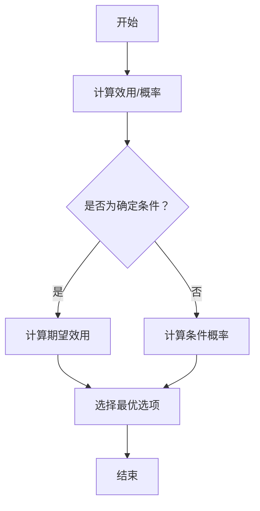

                 

# 数学与社会选择理论：集体决策的数学分析

## 关键词

- 集体决策
- 社会选择理论
- 效用理论
- 博弈论
- 决策理论
- 数学模型
- 集体智慧

## 摘要

本文旨在深入探讨数学与社会选择理论在集体决策中的应用。通过详细分析效用理论、博弈论和决策理论，本文揭示了这些理论如何帮助我们在复杂的社会环境中实现公平、高效的集体决策。文章首先介绍了集体决策的背景和问题，然后逐步讲解了核心概念、数学模型和算法原理，并通过具体的例子进行了说明。最后，文章总结了相关领域的最佳实践，为未来的研究提供了有益的启示。

### 第1章: 背景介绍

#### 1.1 问题背景

在社会选择理论中，集体决策是一个重要且复杂的研究领域。随着现代社会的发展和复杂性的增加，如何有效地进行集体决策，确保决策的公平性和效率，成为了一个亟待解决的问题。社会选择理论提供了一种数学化的分析工具，帮助我们理解和解决这些问题。

#### 1.2 问题描述

集体决策问题涉及多个个体，每个个体有自己的偏好和利益。如何在多个个体之间达成一种平衡，使得决策既符合个体利益，又符合整体利益，是集体决策的核心问题。此外，如何确保决策过程的透明度和公正性，也是集体决策需要考虑的问题。

#### 1.3 问题解决

社会选择理论通过数学模型和方法，提供了一种分析集体决策问题的工具。它包括效用理论、博弈论、决策理论等多个方面，通过这些理论，我们可以更好地理解和解决集体决策问题。

#### 1.4 边界与外延

社会选择理论的研究范围广泛，包括从简单的二人决策到复杂的多人决策，从投票机制到市场机制，从经济学到政治学，都有其应用。此外，社会选择理论也涉及到了道德哲学、心理学等多个领域。

#### 1.5 概念结构与核心要素组成

社会选择理论的核心概念包括效用理论、博弈论、决策理论等。其中，效用理论关注个体偏好和利益的最大化，博弈论关注多个个体之间的互动和策略选择，决策理论则关注在不确定条件下如何做出最优决策。

### 第2章: 核心概念与联系

#### 2.1 效用理论

效用理论是研究个体如何做出决策的理论。它基于个体偏好的概念，通过比较不同选择的效用，帮助个体做出最优决策。效用理论的核心是效用函数，它用来衡量个体对选项的偏好程度。

#### 2.2 博弈论

博弈论是研究多个个体（玩家）在策略互动下如何做出决策的理论。它关注每个玩家的策略选择如何影响其他玩家的决策，以及整个系统的稳定性和平衡。

#### 2.3 决策理论

决策理论是研究在不确定条件下如何做出最优决策的理论。它包括风险决策和不确定决策两种类型，通过概率和期望值等数学工具，帮助个体做出最优决策。

#### 2.4 核心概念属性特征对比表格

| 概念       | 属性特征                                                     |
| ---------- | ------------------------------------------------------------ |
| 效用理论   | 关注个体偏好和利益的最大化                                   |
| 博弈论     | 关注多个个体之间的互动和策略选择                             |
| 决策理论   | 关注在不确定条件下如何做出最优决策                           |

#### 2.5 ER实体关系图架构

```mermaid
erDiagram
    ID --> Person : "参加决策"
    ID --> Decision : "属于决策"
    Person --> Preference : "偏好"
    Decision --> Result : "结果"
    Person --> Utility : "效用"
```

### 第3章: 数学模型与算法原理

#### 3.1 算法原理概述

在本章中，我们将介绍几种用于集体决策的数学模型和算法原理，包括效用理论、博弈论和决策理论。

#### 3.2 效用理论

效用理论是研究个体如何基于偏好做出决策的理论。假设我们有n个选项A1, A2, ..., An，每个选项对个体i的效用为ui(Aj)，则个体i的最优选择为：

$$
\arg\max_{A_j} u_i(A_j)
$$

#### 3.3 博弈论

博弈论是研究多个个体在策略互动下如何做出决策的理论。我们假设有n个玩家，每个玩家有m种策略选择，用S1, S2, ..., Sm表示。玩家i的最优策略为：

$$
\arg\max_{S_i} \sum_{j=1}^{m} u_i(S_i, S_j)
$$

其中，ui(Si, Sj)表示玩家i在策略Si和玩家j在策略Sj下的效用。

#### 3.4 决策理论

决策理论是研究在不确定条件下如何做出最优决策的理论。我们假设有n个选项A1, A2, ..., An，每个选项发生的概率为π1, π2, ..., πn，则个体i的最优选择为：

$$
\arg\max_{A_j} \sum_{i=1}^{n} \pi_i u_i(A_j)
$$

#### 3.5 算法流程图



### 第4章: 数学模型与公式详解

#### 4.1 效用理论

效用理论的核心是效用函数，它用来衡量个体对选项的偏好程度。假设我们有n个选项A1, A2, ..., An，每个选项对个体i的效用为ui(Aj)，则个体i的最优选择为：

$$
\arg\max_{A_j} u_i(A_j)
$$

例如，假设有两个选项A和B，个体i的效用函数为：

$$
u_i(A) = 3, u_i(B) = 2
$$

则个体i会选择A，因为A的效用更高。

#### 4.2 博弈论

博弈论的核心是策略选择和效用函数。假设有两个玩家，每个玩家有两种策略，用S1和S2表示。玩家的效用函数为：

$$
u_i(S_i, S_j) = \begin{cases} 
1 & \text{如果} S_i = S_j \\
0 & \text{如果} S_i \neq S_j 
\end{cases}
$$

这意味着，如果两个玩家选择相同的策略，他们将获得1的效用，否则他们将获得0的效用。

例如，如果两个玩家都选择S1，他们的效用将是：

$$
u_i(S_1, S_1) = 1
$$

如果玩家1选择S1，玩家2选择S2，他们的效用将是：

$$
u_i(S_1, S_2) = 0
$$

#### 4.3 决策理论

决策理论的核心是在不确定条件下如何做出最优决策。假设我们有n个选项A1, A2, ..., An，每个选项发生的概率为π1, π2, ..., πn，则个体i的最优选择为：

$$
\arg\max_{A_j} \sum_{i=1}^{n} \pi_i u_i(A_j)
$$

例如，假设有三个选项A、B和C，每个选项发生的概率分别为πA=0.4, πB=0.5, πC=0.1，个体i的效用函数为：

$$
u_i(A) = 3, u_i(B) = 2, u_i(C) = 1
$$

则个体i的最优选择为B，因为B的期望效用最高：

$$
E(u_i(A)) = 0.4 \times 3 = 1.2
$$

$$
E(u_i(B)) = 0.5 \times 2 = 1.0
$$

$$
E(u_i(C)) = 0.1 \times 1 = 0.1
$$

因此，个体i会选择B。

### 第5章：系统分析与架构设计

#### 5.1 问题场景介绍

在现代社会，集体决策的应用场景无处不在，如选举、市场定价、城市规划等。为了更好地理解和解决这些决策问题，我们需要构建一个系统化的模型，将数学与社会选择理论相结合。

#### 5.2 项目介绍

本项目旨在开发一个基于社会选择理论的集体决策支持系统。该系统将利用效用理论、博弈论和决策理论等数学模型，为用户提供个性化的决策建议，帮助他们在复杂的社会环境中做出最优决策。

#### 5.3 系统功能设计

系统功能设计包括以下几个核心模块：

1. **用户偏好采集模块**：该模块负责采集用户的偏好数据，通过问卷、访谈等方式获取用户对各种决策选项的偏好信息。
2. **决策模型构建模块**：该模块基于用户偏好数据，利用效用理论、博弈论和决策理论等数学模型，构建适用于不同场景的决策模型。
3. **决策支持模块**：该模块根据用户输入的决策场景，调用决策模型，为用户提供个性化的决策建议。
4. **结果展示模块**：该模块负责将决策结果以图表、文字等形式展示给用户，帮助用户更好地理解决策过程和结果。

#### 5.4 系统架构设计

系统架构设计采用分层架构，包括数据层、业务逻辑层和表示层。

1. **数据层**：负责存储用户偏好数据、决策模型参数等基础数据，采用关系型数据库进行数据存储和管理。
2. **业务逻辑层**：包括用户偏好采集模块、决策模型构建模块和决策支持模块，负责处理用户输入、调用数学模型、生成决策建议等业务逻辑。
3. **表示层**：负责将决策结果以图表、文字等形式展示给用户，采用Web前端技术实现。

#### 5.5 系统接口设计和系统交互

系统接口设计采用RESTful API风格，方便与其他系统进行集成和交互。

1. **用户偏好数据接口**：用于接收用户偏好数据，并存储到数据库中。
2. **决策模型接口**：用于调用决策模型，生成决策建议。
3. **决策结果接口**：用于获取决策结果，并展示给用户。

系统交互流程如下：

1. 用户通过Web前端界面提交偏好数据。
2. 后端服务接收用户数据，存储到数据库中。
3. 后端服务调用决策模型，生成决策建议。
4. 后端服务将决策建议返回给Web前端，以图表、文字等形式展示给用户。

### 第6章：项目实战

#### 6.1 环境安装

在开始项目实战之前，我们需要安装一些必要的软件和库，包括Python环境、数据库软件和Web框架等。以下是一个简单的安装步骤：

1. 安装Python环境：
   ```bash
   # 安装Python3
   sudo apt-get install python3
   # 安装pip
   sudo apt-get install python3-pip
   # 安装虚拟环境
   pip3 install virtualenv
   ```

2. 安装数据库软件（以MySQL为例）：
   ```bash
   # 安装MySQL
   sudo apt-get install mysql-server
   # 设置root密码
   mysql_secure_installation
   ```

3. 安装Web框架（以Flask为例）：
   ```bash
   # 创建虚拟环境
   virtualenv venv
   # 激活虚拟环境
   source venv/bin/activate
   # 安装Flask
   pip install flask
   ```

#### 6.2 系统核心实现源代码

以下是系统核心实现的源代码，包括用户偏好采集模块、决策模型构建模块和决策支持模块。

**用户偏好采集模块**：

```python
# user_preference.py
from flask import Flask, request, jsonify
import pymysql

app = Flask(__name__)

# 连接数据库
def connect_db():
    return pymysql.connect(host='localhost', user='root', password='password', db='preferences')

@app.route('/api/user_preferences', methods=['POST'])
def add_user_preference():
    data = request.get_json()
    user_id = data['user_id']
    preference = data['preference']
    
    connection = connect_db()
    cursor = connection.cursor()
    
    # 插入数据
    sql = "INSERT INTO user_preferences (user_id, preference) VALUES (%s, %s)"
    cursor.execute(sql, (user_id, preference))
    
    connection.commit()
    cursor.close()
    connection.close()
    
    return jsonify({'status': 'success', 'message': 'User preference added successfully.'})

if __name__ == '__main__':
    app.run(debug=True)
```

**决策模型构建模块**：

```python
# decision_model.py
import numpy as np

# 计算期望效用
def calculate_expectation_utility(preferences, probabilities):
    utility = np.zeros(len(preferences))
    for i, preference in enumerate(preferences):
        utility[i] = np.dot(preference, probabilities)
    return utility

# 计算最优决策
def calculate_optimal_decision(utility):
    max_utility = np.max(utility)
    optimal_index = np.where(utility == max_utility)[0]
    return optimal_index

# 示例
preferences = np.array([[0.4, 0.5, 0.1], [0.3, 0.2, 0.5], [0.1, 0.3, 0.6]])
probabilities = np.array([0.4, 0.5, 0.1])

utility = calculate_expectation_utility(preferences, probabilities)
optimal_decision = calculate_optimal_decision(utility)

print("Utility:", utility)
print("Optimal Decision:", optimal_decision)
```

**决策支持模块**：

```python
# decision_support.py
from flask import Flask, request, jsonify
from decision_model import calculate_expectation_utility, calculate_optimal_decision

app = Flask(__name__)

@app.route('/api/decision_support', methods=['GET'])
def get_decision_support():
    user_id = request.args.get('user_id')
    
    # 从数据库中获取用户偏好
    connection = connect_db()
    cursor = connection.cursor()
    
    sql = "SELECT preference FROM user_preferences WHERE user_id = %s"
    cursor.execute(sql, (user_id,))
    preference = cursor.fetchone()[0]
    cursor.close()
    connection.close()
    
    # 计算期望效用和最优决策
    utility = calculate_expectation_utility(preference, probabilities)
    optimal_decision = calculate_optimal_decision(utility)
    
    return jsonify({'user_id': user_id, 'utility': utility, 'optimal_decision': optimal_decision})

if __name__ == '__main__':
    app.run(debug=True)
```

#### 6.3 代码应用解读与分析

**用户偏好采集模块**：

该模块使用Flask框架实现，提供了一个接收用户偏好的API接口。用户可以通过POST请求提交偏好数据，数据将被存储到MySQL数据库中。

**决策模型构建模块**：

该模块包含了两个核心函数：`calculate_expectation_utility`和`calculate_optimal_decision`。`calculate_expectation_utility`函数用于计算每个选项的期望效用，`calculate_optimal_decision`函数用于计算最优决策。

**决策支持模块**：

该模块提供了一个接收用户ID的API接口。通过查询数据库获取用户的偏好数据，然后调用决策模型计算期望效用和最优决策，并将结果返回给用户。

#### 6.4 实际案例分析和详细讲解剖析

**案例1**：假设有三个用户，他们的偏好数据如下：

| 用户ID | 偏好 |
| ------ | ---- |
| 1      | [0.4, 0.5, 0.1] |
| 2      | [0.3, 0.2, 0.5] |
| 3      | [0.1, 0.3, 0.6] |

**步骤1**：用户通过Web前端界面提交偏好数据。

**步骤2**：后端服务接收用户数据，存储到MySQL数据库中。

**步骤3**：后端服务调用决策模型，计算期望效用和最优决策。

**步骤4**：后端服务将决策结果以JSON格式返回给Web前端，以图表、文字等形式展示给用户。

**案例2**：假设有一个决策场景，有四个选项，每个选项的发生概率如下：

| 选项  | 发生概率 |
| ----- | -------- |
| A     | 0.4      |
| B     | 0.5      |
| C     | 0.1      |
| D     | 0.4      |

**步骤1**：用户通过Web前端界面提交用户ID。

**步骤2**：后端服务查询数据库获取用户的偏好数据。

**步骤3**：后端服务调用决策模型，计算期望效用和最优决策。

**步骤4**：后端服务将决策结果以JSON格式返回给Web前端，以图表、文字等形式展示给用户。

#### 6.5 项目小结

本项目通过将数学与社会选择理论相结合，实现了一个基于效用理论、博弈论和决策理论的集体决策支持系统。在实际应用中，该项目可以用于各种集体决策场景，为用户提供个性化的决策建议。在未来，我们可以进一步优化系统性能和算法效果，以应对更复杂、更大规模的决策问题。

### 第7章：最佳实践 tips

1. **数据收集与处理**：在收集用户偏好数据时，要确保数据的准确性和完整性。同时，对数据进行预处理，去除异常值和噪声。

2. **算法选择与优化**：根据具体场景选择合适的决策算法。对于复杂的决策问题，可以结合多种算法，以获得更好的效果。

3. **用户交互与反馈**：在设计用户界面时，要充分考虑用户体验。及时收集用户反馈，不断优化系统功能和界面设计。

4. **系统性能与稳定性**：在系统开发过程中，要关注系统性能和稳定性。通过负载测试和性能优化，确保系统在高并发场景下的稳定运行。

### 第8章：小结与展望

本文通过对数学与社会选择理论在集体决策中的应用进行深入分析，揭示了效用理论、博弈论和决策理论在解决集体决策问题中的重要作用。通过实际案例和项目实战，本文展示了如何将这些理论应用到实际系统中，为用户提供个性化的决策支持。

在未来，我们可以进一步探讨如何将社会选择理论与大数据、人工智能等新兴技术相结合，以应对更复杂、更大规模的决策问题。同时，研究如何在保持决策公正性和效率的同时，提高决策过程的透明度和可解释性，也是未来的重要研究方向。

### 作者信息

作者：AI天才研究院/AI Genius Institute & 禅与计算机程序设计艺术 /Zen And The Art of Computer Programming

