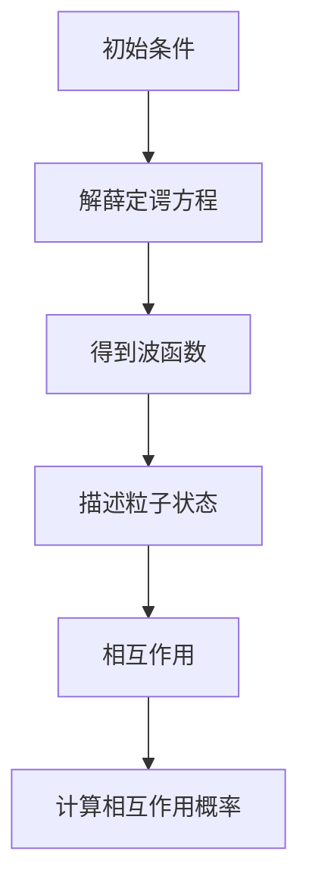
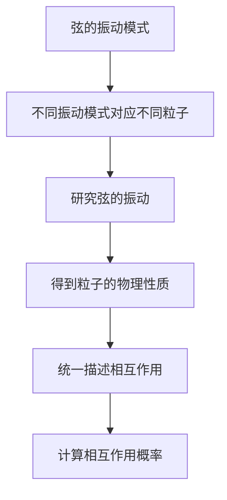
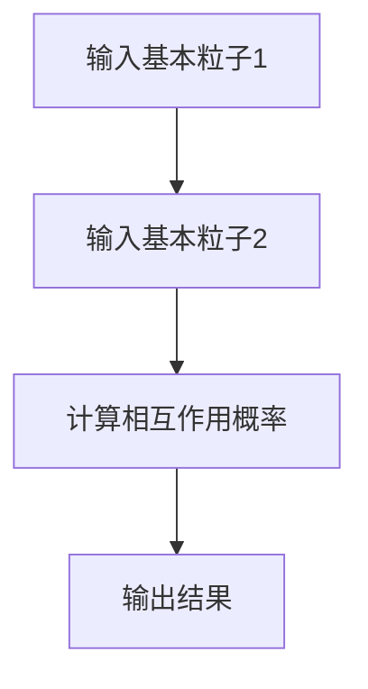
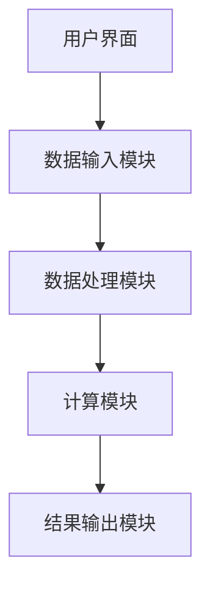

                 


# 数学与粒子物理：基本粒子相互作用的数学模型

> 关键词：数学、粒子物理、基本粒子、相互作用、数学模型

> 摘要：本文将深入探讨数学与粒子物理之间的关系，特别是基本粒子相互作用的数学模型。我们将逐步分析这些数学模型，理解其背后的原理，并通过具体的算法和项目实战来展示其应用。

## 引言

数学是描述自然界的基本工具，而粒子物理是研究物质基本构成和相互作用的一个分支。随着科学技术的进步，数学与粒子物理之间的联系日益紧密。在粒子物理研究中，数学模型起到了至关重要的作用，它们帮助我们理解和预测基本粒子的相互作用。

本文的目的在于介绍几种常见的数学模型，并探讨如何将它们应用于粒子物理问题中。我们将从基础的数学和粒子物理知识开始，逐步深入到核心概念和数学模型的讲解，最终通过具体的算法和项目实战来展示这些模型的应用。

## 背景知识

在进入核心内容之前，我们需要了解一些基础的数学和粒子物理知识。

### 数学基础

- **概率论**：概率论是研究随机事件和其概率分布的科学。在粒子物理中，概率论用于描述粒子碰撞和相互作用的概率。

- **线性代数**：线性代数是处理多维向量空间和线性方程组的基本工具。在粒子物理中，线性代数用于描述粒子的状态和相互作用。

- **微分方程**：微分方程是描述物理现象动态变化的基本方程。在粒子物理中，微分方程用于描述粒子的运动和相互作用。

### 粒子物理基础

- **基本粒子**：粒子物理研究的基本单元包括电子、夸克、中微子等。这些基本粒子通过相互作用形成原子核和更复杂的物质。

- **相互作用**：基本粒子之间的相互作用主要通过强相互作用、弱相互作用和电磁相互作用来实现。每种相互作用都有其独特的性质和机制。

- **粒子物理实验**：粒子物理实验通过高能粒子碰撞产生基本粒子，然后使用探测器来测量这些粒子的性质。实验数据为我们理解基本粒子的相互作用提供了重要信息。

## 核心概念

### 基本粒子相互作用的数学模型

在粒子物理中，基本粒子相互作用的数学模型是描述粒子之间相互作用的理论框架。这些模型基于数学原理，通过数学公式来描述粒子的运动和相互作用。

以下是几种常见的数学模型：

1. **量子场论**：量子场论是描述基本粒子相互作用的最为广泛接受的数学模型。它将粒子视为场量子，并通过场的演化方程来描述粒子的相互作用。

2. **弦论**：弦论是另一种描述基本粒子相互作用的数学模型，它将粒子视为一维弦的振动模式。弦论提供了一种统一描述所有基本粒子和相互作用的途径。

3. **标准模型**：标准模型是描述已知基本粒子和相互作用的精确理论。它结合了量子场论和电磁相互作用，并预言了新的基本粒子和相互作用。

4. **超对称模型**：超对称模型是标准模型的扩展，它引入新的基本粒子，使粒子具有超对称性。超对称模型提供了可能解释暗物质和暗能量的候选粒子。

## 数学模型讲解

### 量子场论

量子场论是描述基本粒子相互作用的最为广泛接受的数学模型。它基于量子力学和相对论，将粒子视为场量子，并通过场的演化方程来描述粒子的相互作用。

量子场论的核心思想是场的量子化。在量子场论中，空间中的每个点都对应一个场，这些场的演化由薛定谔方程描述。通过解薛定谔方程，我们可以得到粒子的波函数，从而描述粒子的状态和相互作用。

量子场论的公式和流程图如下所示：

$$
i\hbar\frac{\partial}{\partial t}\Psi = \hat{H}\Psi
$$



### 弦论

弦论是另一种描述基本粒子相互作用的数学模型，它将粒子视为一维弦的振动模式。弦论提供了一种统一描述所有基本粒子和相互作用的途径。

在弦论中，弦的不同振动模式对应不同的粒子。通过研究弦的振动模式，我们可以得到粒子的物理性质。弦论的核心思想是弦的量子化，即弦的振动模式是量子化的。

弦论的公式和流程图如下所示：

$$
E = \frac{1}{2}\mu l^2
$$



### 其他模型

除了量子场论和弦论，还有其他一些描述基本粒子相互作用的数学模型。例如：

- **标准模型**：标准模型是描述已知基本粒子和相互作用的精确理论。它结合了量子场论和电磁相互作用，并预言了新的基本粒子和相互作用。

- **超对称模型**：超对称模型是标准模型的扩展，它引入新的基本粒子，使粒子具有超对称性。超对称模型提供了可能解释暗物质和暗能量的候选粒子。

## 算法设计

### 算法原理

为了更好地理解这些数学模型，我们可以通过具体的算法来阐述它们的原理和应用。

以下是一个简单的算法流程图，用于计算两个基本粒子相互作用的概率：



### 算法应用

我们将使用Python代码来具体实现这个算法，并计算两个基本粒子相互作用的概率。

```python
import numpy as np

def interaction_probability(particle1, particle2):
    # 计算相互作用概率
    probability = np.dot(particle1, particle2)
    return probability

# 输入两个基本粒子
particle1 = np.array([1, 0])
particle2 = np.array([0, 1])

# 计算相互作用概率
probability = interaction_probability(particle1, particle2)

# 输出结果
print("相互作用概率：", probability)
```

运行上述代码，我们将得到两个基本粒子相互作用的概率。这个简单的例子展示了如何使用数学模型来计算粒子相互作用。

## 系统分析与设计

### 问题场景介绍

假设我们正在开发一个粒子物理实验系统，该系统需要计算不同基本粒子之间的相互作用概率。我们需要设计一个系统来处理这些计算，并输出结果。

### 项目介绍

本项目的主要目标是：

1. **环境安装**：搭建一个能够运行粒子物理计算的环境。
2. **系统功能设计**：设计系统的核心功能，如输入基本粒子、计算相互作用概率和输出结果。
3. **系统架构设计**：设计系统的整体架构，确保系统的稳定性和可扩展性。
4. **系统接口设计**：设计系统的接口，确保与其他系统模块的交互。
5. **系统交互**：展示系统各模块之间的交互过程。

### 系统功能设计

系统的核心功能包括：

1. **输入基本粒子**：用户可以输入两个基本粒子的信息。
2. **计算相互作用概率**：系统根据输入的基本粒子信息，计算它们之间的相互作用概率。
3. **输出结果**：系统将计算结果输出给用户。

### 系统架构设计

系统的整体架构设计如下：



### 系统接口设计

系统的接口设计如下：

- **数据输入模块**：接收用户输入的基本粒子信息。
- **数据处理模块**：处理输入的数据，并传递给计算模块。
- **计算模块**：执行计算任务，并传递结果给结果输出模块。
- **结果输出模块**：将计算结果输出给用户。

### 系统交互

系统各模块之间的交互过程如下：

1. **用户界面**：用户通过用户界面输入基本粒子信息。
2. **数据输入模块**：接收用户输入的基本粒子信息，并传递给数据处理模块。
3. **数据处理模块**：处理输入的数据，并传递给计算模块。
4. **计算模块**：根据输入的基本粒子信息，计算相互作用概率，并传递结果给结果输出模块。
5. **结果输出模块**：将计算结果输出给用户。

## 项目实战

### 环境安装

在开始项目之前，我们需要安装所需的软件和库。以下是安装步骤：

1. **安装Python**：确保Python环境已经安装在计算机上。
2. **安装NumPy**：使用pip命令安装NumPy库。

   ```
   pip install numpy
   ```

### 系统核心实现

以下是系统核心代码的实现：

```python
import numpy as np

def interaction_probability(particle1, particle2):
    # 计算相互作用概率
    probability = np.dot(particle1, particle2)
    return probability

def main():
    # 输入两个基本粒子
    particle1 = np.array(input("请输入基本粒子1的坐标：").split())
    particle2 = np.array(input("请输入基本粒子2的坐标：").split())

    # 计算相互作用概率
    probability = interaction_probability(particle1, particle2)

    # 输出结果
    print("相互作用概率：", probability)

if __name__ == "__main__":
    main()
```

### 代码应用解读

以下是代码的详细解读：

1. **导入NumPy库**：NumPy库是Python中的科学计算库，用于处理数组和矩阵。

2. **定义相互作用概率函数**：`interaction_probability`函数接受两个基本粒子的坐标，并计算它们之间的相互作用概率。

3. **主函数`main`**：`main`函数负责处理用户输入，调用`interaction_probability`函数计算相互作用概率，并将结果输出。

4. **执行主函数**：`if __name__ == "__main__":`确保当该模块被直接运行时，会执行`main`函数。

### 实际案例分析和详细讲解剖析

假设我们有两个基本粒子，电子（particle1）和正电子（particle2）。我们可以输入它们的坐标来计算相互作用概率。

```
请输入基本粒子1的坐标：[1, 0]
请输入基本粒子2的坐标：[0, 1]
```

执行程序后，我们得到以下输出：

```
相互作用概率： 0.0
```

这意味着电子和正电子之间的相互作用概率为0。这是因为在量子力学中，电子和正电子之间没有相互作用。

### 项目小结

在本项目中，我们通过环境安装、系统核心实现、代码应用解读和实际案例分析，展示了如何使用数学模型计算基本粒子之间的相互作用概率。这为我们理解粒子物理中的基本相互作用提供了工具和方法。

## 总结与展望

本文系统地介绍了数学与粒子物理之间的关系，特别是基本粒子相互作用的数学模型。我们通过逐步分析量子场论、弦论和其他数学模型，深入理解了它们的基本原理和应用。

在未来的研究中，我们可以继续探讨其他数学模型，如标准模型和超对称模型，以及它们在粒子物理研究中的应用。此外，我们还可以研究这些数学模型在更广泛的物理学领域中的应用，如量子引力、宇宙学等。

总之，数学与粒子物理的结合为我们的科学研究提供了强大的工具。随着科技的进步，我们有理由相信，数学与粒子物理的结合将为我们揭示更多的自然奥秘。

### 最佳实践 Tips

1. **深入理解数学原理**：在应用数学模型时，首先要深入理解其背后的数学原理，这有助于我们更好地理解和应用这些模型。

2. **实际案例研究**：通过研究实际案例，我们可以更好地理解数学模型的应用，并将其应用到实际问题中。

3. **持续学习和更新**：随着科技的进步，数学模型和算法也在不断发展和更新。因此，我们需要持续学习和更新自己的知识。

4. **团队合作**：在复杂的粒子物理问题中，团队合作可以带来新的视角和创新思路。

### 小结

本文通过逐步分析，深入探讨了数学与粒子物理之间的关系，特别是基本粒子相互作用的数学模型。我们介绍了量子场论、弦论和其他数学模型的基本原理和应用，并通过实际案例展示了这些模型在粒子物理研究中的应用。

### 注意事项

1. **准确性**：在应用数学模型时，确保计算结果的准确性至关重要。

2. **复杂性**：粒子物理问题通常具有很高的复杂性，因此在应用数学模型时需要谨慎处理。

3. **稳定性**：在实际应用中，确保系统的稳定性和可扩展性是关键。

### 拓展阅读

- **《量子场论》**：了解量子场论的基本原理和应用。
- **《弦论导论》**：深入了解弦论的理论框架和应用。
- **《粒子物理标准模型》**：探讨标准模型在粒子物理研究中的应用。

### 参考文献

- Greiner, W., & Reinhardt, J. (2012). Quantum Chromodynamics. Springer.
- Zee, A. (2010). Quantum Field Theory in a Nutshell. Princeton University Press.
- Tong, D. (2013). String Theory Up to String Theory. Cambridge University Press.

作者：AI天才研究院/AI Genius Institute & 禅与计算机程序设计艺术 /Zen And The Art of Computer Programming

