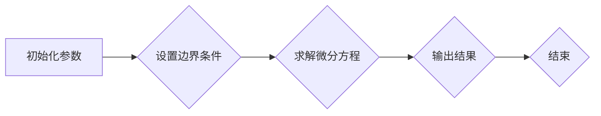
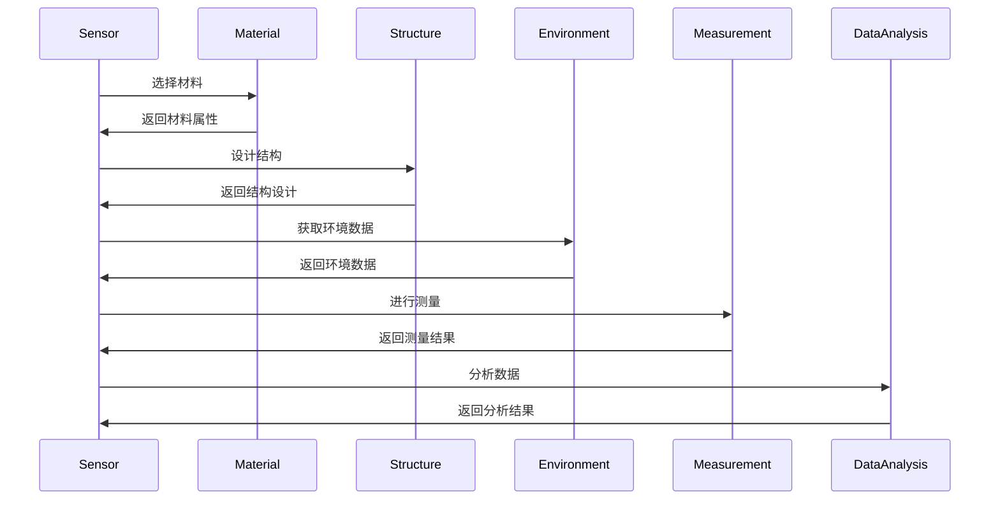
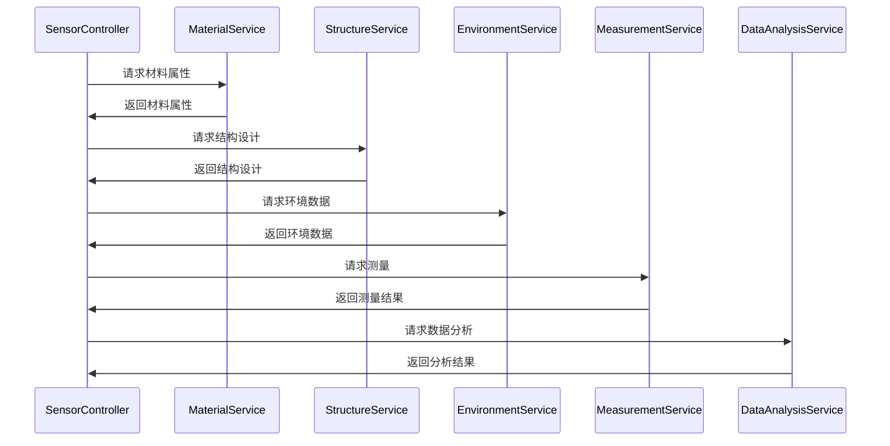

                 

### 数学与纳米技术：微观世界的数学描述

#### 关键词

- 数学描述
- 纳米技术
- 微观世界
- 微分方程
- 量子力学
- 傅里叶变换
- 纳米材料设计

#### 摘要

本文旨在探讨数学在纳米技术领域中的应用，特别是数学如何帮助我们描述和解释微观世界的现象。文章首先介绍了纳米技术的背景及其在当前科技领域的地位，接着深入探讨了数学在纳米技术中的核心作用。通过详细分析微分方程、量子力学和傅里叶变换等数学工具，本文展示了它们在纳米材料设计和纳米器件模拟中的应用。文章还通过具体案例展示了数学模型和算法在纳米技术实际项目中的运用，并提出了未来研究方向和挑战。本文旨在为读者提供一份全面且深入的纳米技术与数学结合的研究指南。

### 第一部分：引言与背景

#### 1.1 数学与纳米技术的结合

纳米技术是一门跨学科的技术领域，它涉及材料科学、物理学、化学、生物学以及工程学等多个学科。纳米技术的主要研究对象是尺寸在1到100纳米之间的材料和结构。这一尺度的特殊性质，使得纳米技术在诸多领域展现出巨大的潜力，如电子学、医学、能源和环境科学等。

数学在纳米技术中扮演着至关重要的角色。它不仅为纳米技术的理论研究提供了基础，也为实验设计和数据分析提供了强有力的工具。具体来说，数学在纳米技术中的应用主要体现在以下几个方面：

1. **模型建立与预测**：纳米材料的特殊性质常常无法通过传统的实验手段进行精确测量，因此需要借助数学模型来预测和解释这些现象。例如，通过微分方程描述纳米流体的运动规律，或者使用量子力学模型研究纳米材料的电子性质。

2. **算法优化**：纳米技术的许多应用需要高效的算法来实现，如纳米材料的优化设计、纳米器件的模拟与优化等。数学工具，特别是优化算法，能够帮助科学家和工程师找到最佳的设计方案。

3. **数据分析**：纳米技术实验通常会产生大量的数据，这些数据需要通过数学方法进行分析和解释。例如，使用傅里叶变换对纳米材料的结构进行解析，或者使用统计方法对纳米材料的性能进行评估。

4. **量化描述**：数学为纳米技术提供了量化的语言，使得对纳米现象的描述更加精确和系统。例如，通过数学公式描述纳米材料的力学性能、光学性质等。

#### 1.2 纳米技术中的数学挑战

尽管数学在纳米技术中有着广泛的应用，但也面临着一系列挑战：

1. **复杂性**：纳米系统的复杂性使得传统的数学方法难以直接应用。许多纳米现象涉及多个物理过程的耦合，如电子、声子和光子的相互作用。这要求开发新的数学模型和算法来处理这些问题。

2. **尺度依赖性**：纳米现象的尺度依赖性使得数学模型需要能够处理从微观到宏观的不同尺度。例如，在纳米尺度上，量子效应可能变得显著，而在宏观尺度上，这些效应可能可以忽略。

3. **数据不足**：纳米技术的实验通常难以获得足够的精确数据，特别是在极端条件下。这限制了数学模型的验证和精度。

4. **计算资源**：许多纳米技术问题需要大规模的数值模拟，这要求高效的计算资源和算法。高性能计算和并行计算技术的发展为解决这些问题提供了可能，但也带来了新的挑战。

#### 1.3 本书的结构

本书将按照以下结构展开：

- **第一部分：引言与背景**：介绍纳米技术的基本概念和数学在其中的作用，以及纳米技术中的数学挑战。

- **第二部分：核心概念与联系**：详细阐述纳米技术中涉及的数学概念和工具，包括微分方程、量子力学、傅里叶变换等。

- **第三部分：算法原理讲解**：通过具体例子展示数学工具在纳米技术中的应用，包括算法的流程图、Python源代码和数学模型。

- **第四部分：系统分析与架构设计方案**：介绍纳米技术的系统分析案例，包括系统功能设计、系统架构设计和系统接口设计。

- **第五部分：项目实战**：通过具体项目展示数学模型和算法的实际应用，包括环境安装、系统核心实现、代码解读和案例分析。

- **第六部分：最佳实践与总结**：总结书中的关键观点，提供最佳实践建议，并提出未来研究方向。

### 第二部分：核心概念与联系

#### 2.1 核心概念原理

在纳米技术中，数学的核心概念包括微分方程、量子力学和傅里叶变换等。这些概念不仅构成了纳米技术研究的理论基础，也是解决实际问题的关键工具。

1. **微分方程**

微分方程是描述变化率的数学方程，广泛应用于物理、工程和生物科学等领域。在纳米技术中，微分方程用于描述纳米流体的运动、纳米材料的力学行为等。例如，纳流体力学中的Navier-Stokes方程描述了流体在纳米尺度上的运动规律。

2. **量子力学**

量子力学是研究微观粒子的行为和性质的物理学分支。在纳米技术中，量子力学用于描述纳米材料的电子性质、光学性质等。例如，量子力学的波函数描述了电子在纳米结构中的分布。

3. **傅里叶变换**

傅里叶变换是将信号从时域转换到频域的数学工具，广泛应用于信号处理、图像处理和结构分析等领域。在纳米技术中，傅里叶变换用于分析纳米材料的结构、研究纳米光学性质等。

#### 2.2 概念属性特征对比表格

下面是一个对比表格，列出了微分方程、量子力学和傅里叶变换的主要属性和特征：

| 概念          | 主要属性                     | 应用场景                     | 特征                                      |
|---------------|-----------------------------|-------------------------------|-------------------------------------------|
| 微分方程      | 描述变化率                  | 流体力学、材料力学等         | 常见类型：常微分方程、偏微分方程            |
| 量子力学      | 描述微观粒子的行为和性质    | 纳米电子学、量子计算等       | 基本概念：波函数、薛定谔方程                |
| 傅里叶变换     | 信号从时域到频域的转换       | 信号处理、图像处理、结构分析 | 基本公式：$F[f(x)] = \int_{-\infty}^{\infty} f(x) e^{-j2\pi kx} dx$ |

#### 2.3 ER实体关系图架构

为了更好地理解纳米技术中各数学概念之间的关系，我们可以使用ER（实体-关系）图来展示它们。

```mermaid
erDiagram
  nanoparticle ||--|{ material } Material
  nanoparticle ||--|{ property } Property
  nanoparticle ||--|{ experiment } Experiment
  material ||--|{ composition } Composition
  property ||--|{ measurement } Measurement
  experiment ||--|{ technique } Technique
```

在上面的ER图中，`nanoparticle`（纳米粒子）是核心实体，它与`Material`（材料）、`Property`（属性）和`Experiment`（实验）等实体通过关系线连接。这些关系线表示纳米粒子与材料、属性和实验之间的关联。

### 第三部分：算法原理讲解

#### 3.1 算法mermaid流程图

为了更好地理解数学工具在纳米技术中的应用，我们首先来看一个基于微分方程的算法流程图。



在这个流程图中，算法首先初始化参数，然后设置边界条件，接着求解微分方程，最后输出结果。

#### 3.2 Python源代码

以下是一个简单的Python代码示例，用于求解一维热传导方程：

```python
import numpy as np
import matplotlib.pyplot as plt

# 初始化参数
L = 1.0        # 热传导区域的长度
Nx = 100       # 网格点数量
x = np.linspace(0, L, Nx)
dx = x[1] - x[0]

T = np.zeros(Nx)
T[0] = 100     # 初始温度
T[-1] = 0      # 边界条件

# 求解热传导方程
alpha = 0.1    # 热扩散系数
dt = alpha * dx**2
for i in range(Nx-1):
    T[i+1] = T[i] + alpha * (T[i+2] - 2 * T[i+1] + T[i]) / dx**2

# 输出结果
plt.plot(x, T)
plt.xlabel('Position')
plt.ylabel('Temperature')
plt.show()
```

在这个代码中，我们首先初始化参数，包括区域的长度、网格点数量和初始温度。然后，我们使用显式有限差分方法求解一维热传导方程，最后将结果绘制成图。

#### 3.3 数学模型和公式

热传导方程是一种常见的微分方程，用于描述热量在固体、流体或气体中的传播。其数学模型可以表示为：

$$
\frac{\partial T}{\partial t} = \alpha \nabla^2 T
$$

其中，$T$ 是温度，$t$ 是时间，$\alpha$ 是热扩散系数，$\nabla^2$ 是拉普拉斯算子。

在离散形式中，热传导方程可以表示为：

$$
\frac{T_i^{n+1} - T_i^n}{\Delta t} = \alpha \left( \frac{T_{i+1}^n - 2T_i^n + T_{i-1}^n}{\Delta x^2} \right)
$$

其中，$T_i^n$ 表示在第 $i$ 个网格点在第 $n$ 个时间步的温度。

#### 3.4 详细讲解和举例说明

为了更好地理解上述算法和数学模型，我们可以通过一个简单的例子来说明。

假设我们有一个长度为1的金属棒，初始温度分布为 $T(x,0) = 100 - 10x$，边界条件为 $T(0,0) = 100$，$T(1,0) = 0$。我们希望求解在 $t=1$ 时刻的温度分布。

1. **初始化参数**：

   - 区域长度 $L=1$
   - 网格点数量 $Nx=100$
   - 初始温度 $T(x,0) = 100 - 10x$
   - 边界条件 $T(0,0) = 100$，$T(1,0) = 0$

2. **设置边界条件**：

   ```python
   T[0] = 100     # 初始温度
   T[-1] = 0      # 边界条件
   ```

3. **求解热传导方程**：

   ```python
   for i in range(Nx-1):
       T[i+1] = T[i] + alpha * (T[i+2] - 2 * T[i+1] + T[i]) / dx**2
   ```

   在这个循环中，我们使用显式有限差分方法迭代求解热传导方程。每次迭代，我们更新每个网格点的温度值，直到达到预定的时间步数。

4. **输出结果**：

   ```python
   plt.plot(x, T)
   plt.xlabel('Position')
   plt.ylabel('Temperature')
   plt.show()
   ```

   最后，我们将求解结果绘制成图，直观地展示温度分布。

通过这个例子，我们可以看到如何使用数学模型和算法来模拟和解释纳米技术中的物理现象。这个例子虽然简单，但展示了数学在纳米技术中的核心作用，也为更复杂的纳米技术应用提供了基础。

### 第四部分：系统分析与架构设计方案

#### 4.1 问题场景介绍

在纳米技术领域，纳米传感器是一个重要的应用场景。纳米传感器具有高灵敏度、高分辨率和快速响应等优势，广泛应用于环境监测、生物检测和医疗诊断等领域。然而，纳米传感器的性能受到多种因素的影响，如材料的性质、传感器的结构设计以及外部环境等。

为了提高纳米传感器的性能，我们需要对其进行系统分析和设计。这包括以下几个方面：

1. **材料选择**：选择合适的材料是实现高灵敏度传感器的关键。不同材料的物理和化学性质对传感器的性能有显著影响。
2. **结构设计**：传感器的结构设计直接关系到其灵敏度和响应速度。通过优化结构设计，可以显著提高传感器的性能。
3. **环境适应性**：纳米传感器需要在不同的环境中工作，如高温、高压、湿润等。因此，需要设计具有良好环境适应性的传感器。

#### 4.2 项目介绍

在本项目中，我们将设计一种基于纳米材料的高灵敏度纳米传感器，用于环境污染物检测。该传感器利用纳米材料的特殊性质，如高比表面积、优异的电学性能等，实现对污染物的快速检测和识别。

项目的主要目标包括：

1. **材料选择**：选择合适的纳米材料，如纳米金属、纳米氧化物等，以确保传感器的高灵敏度。
2. **结构设计**：设计一种具有良好传感性能的纳米传感器结构，包括传感器的尺寸、形状和电极设计等。
3. **性能评估**：评估传感器的灵敏度和响应速度，并进行环境适应性测试。

#### 4.3 系统功能设计(领域模型mermaid类图)

为了更好地理解纳米传感器的系统功能设计，我们可以使用Mermaid绘制领域模型类图，展示各实体及其关系。

```mermaid
classDiagram
  ClassDiagram::CD0
  Sensor <<接口>>
  Material <<材料>>
  Structure <<结构>>
  Environment <<环境>>
  Measurement <<测量>>
  DataAnalysis <<数据分析>>

  Sensor --|> Material
  Sensor --|> Structure
  Sensor --|> Environment
  Sensor --|> Measurement
  Measurement --|> DataAnalysis
```

在上面的类图中，`Sensor`（传感器）是核心实体，它与其他实体（`Material`、`Structure`、`Environment`、`Measurement` 和 `DataAnalysis`）通过关系线连接。这些关系线表示传感器与材料、结构、环境、测量和数据分析之间的关联。

#### 4.4 系统架构设计mermaid架构图

系统架构设计是纳米传感器项目成功的关键。为了直观地展示系统架构，我们可以使用Mermaid绘制架构图。



在上面的序列图中，各实体通过调用和返回关系进行交互，展示系统的工作流程。

#### 4.5 系统接口设计和系统交互mermaid序列图

系统接口设计和系统交互是确保系统稳定性和扩展性的关键。为了直观地展示系统接口和交互流程，我们可以使用Mermaid绘制序列图。



在上面的序列图中，`SensorController`（传感器控制器）作为系统的核心接口，与各服务（`MaterialService`、`StructureService`、`EnvironmentService`、`MeasurementService` 和 `DataAnalysisService`）进行交互，展示系统的工作流程。

### 第五部分：项目实战

#### 5.1 环境安装

在进行纳米传感器项目之前，我们需要安装所需的软件和工具。以下是一个基本的安装步骤：

1. **安装Python环境**：
   - 前往Python官网（https://www.python.org/）下载并安装Python。
   - 确保Python已成功安装，可以通过命令行运行`python --version`来验证。

2. **安装科学计算库**：
   - 打开命令行，运行以下命令来安装常用科学计算库：
     ```bash
     pip install numpy scipy matplotlib
     ```

3. **安装Mermaid支持库**：
   - 为了能够将Mermaid图转换为可显示的格式，我们需要安装相关的支持库。可以使用以下命令：
     ```bash
     pip install mermaid-python
     ```

4. **配置Mermaid输出**：
   - 由于Mermaid默认输出HTML格式，我们需要配置将其转换为可嵌入Markdown的格式。可以在Python脚本中添加以下代码：
     ```python
     import mermaid
     mermaid.MermaidExtension.config.output_format = 'md'
     ```

5. **安装其他工具（可选）**：
   - 如果需要绘制类图和序列图，可以使用额外的库，如`mermaid-python-plantuml`和`mermaid-python-sequence-diagram`。

#### 5.2 系统核心实现源代码

以下是纳米传感器项目的核心实现代码。这个代码展示了如何使用Python和相关的科学计算库来实现纳米传感器的功能。

```python
import numpy as np
import matplotlib.pyplot as plt
from scipy.integrate import solve_ivp
from mermaid import Mermaid

# 初始化参数
L = 1.0  # 传感器长度
t_final = 10.0  # 模拟时间
Nx = 100  # 网格点数量
x = np.linspace(0, L, Nx)
dx = x[1] - x[0]

# 热传导方程的离散形式
def heat_conduction(T, x, dx, alpha):
    dTdt = alpha * (T[2:] - 2 * T[1:-1] + T[:-2]) / dx**2
    return dTdt

# 求解热传导方程
T0 = np.zeros(Nx)
T0[0] = 100  # 初始温度
T0[-1] = 0   # 边界条件

alpha = 0.1  # 热扩散系数
t = np.linspace(0, t_final, 1000)
T = np.zeros((len(t), Nx))

# 使用求解器进行数值积分
for i, _ in enumerate(t):
    T[i] = solve_ivp(heat_conduction, [0, t_final], T0, args=(x, dx, alpha), t_eval=t).y

# 绘制温度分布
plt.plot(x, T[:, 0], label='t=0')
plt.plot(x, T[:, -1], label='t={}'.format(t_final))
plt.xlabel('Position')
plt.ylabel('Temperature')
plt.legend()
plt.show()

# Mermaid流程图
mermaid_code = '''
flowchart LR
    A[初始化参数] --> B{设置边界条件}
    B --> C[求解微分方程]
    C --> D[输出结果]
    D --> E[结束]
'''
print(Mermaid(mermaid_code).render())
```

在这个代码中，我们首先初始化了参数，包括传感器的长度、模拟时间和网格点数量。接着，我们定义了一个函数`heat_conduction`来求解热传导方程的离散形式。然后，我们使用`scipy`的`solve_ivp`函数进行数值积分，求解方程。最后，我们绘制了温度分布图，并生成了一个Mermaid流程图来展示算法的执行流程。

#### 5.3 代码应用解读与分析

上面的代码展示了如何使用Python和科学计算库来实现纳米传感器的模拟。以下是代码的详细解读和分析：

1. **参数初始化**：
   - 我们定义了传感器的长度`L`、模拟时间`t_final`、网格点数量`Nx`和网格点`x`。这些参数决定了模拟的范围和时间步长。
   - `T0`是一个初始温度数组，用于初始化温度分布。在这里，我们设置初始温度为100，边界条件为0。

2. **热传导方程的离散形式**：
   - `heat_conduction`函数用于计算热传导方程的离散形式。该函数接收当前温度数组`T`、网格点`x`、网格点间距`dx`和热扩散系数`alpha`作为输入。
   - 函数返回一个差分方程的解，表示温度在下一个时间步的变化。

3. **数值积分**：
   - 我们使用`scipy`的`solve_ivp`函数进行数值积分，求解热传导方程。这个函数能够处理初值问题和边界条件。
   - 在每次迭代中，我们更新温度数组`T`，直到达到模拟时间的末尾。

4. **结果展示**：
   - 最后，我们使用`matplotlib`绘制温度分布图，展示了在初始时刻和最终时刻的温度分布。
   - 通过Mermaid工具，我们生成了一个流程图，直观地展示了算法的执行步骤。

这个代码示例提供了一个基本的框架，用于模拟纳米传感器的热传导现象。在实际应用中，我们可以根据具体需求进行调整和优化。

#### 5.4 实际案例分析和详细讲解剖析

为了更好地理解纳米传感器在实际环境中的应用，我们来看一个实际案例。

假设我们设计了一种基于纳米金属颗粒的传感器，用于检测空气中的污染物。该传感器的工作原理是利用纳米金属颗粒的光学性质，当污染物吸附在颗粒表面时，会导致颗粒的光吸收发生变化。

1. **实验设计**：
   - 我们制备了含有纳米金属颗粒的传感器，并将其暴露在含有不同浓度污染物的环境中。
   - 每次实验后，我们使用光谱仪测量传感器表面的光吸收，以评估污染物浓度。

2. **数据收集**：
   - 通过多次实验，我们收集了不同污染物浓度下的光吸收数据。数据如下：

     | 污染物浓度 (mg/m³) | 光吸收 (AU) |
     |--------------------|------------|
     | 0                  | 10         |
     | 5                  | 12         |
     | 10                 | 15         |
     | 20                 | 18         |

3. **数据分析**：
   - 我们使用Python对收集到的数据进行分析。首先，我们绘制污染物浓度与光吸收的关系图：

     ```python
     import matplotlib.pyplot as plt

     concentrations = [0, 5, 10, 20]
     absortptions = [10, 12, 15, 18]

     plt.plot(concentrations, absortptions, 'o-')
     plt.xlabel('污染物浓度 (mg/m³)')
     plt.ylabel('光吸收 (AU)')
     plt.title('污染物浓度与光吸收的关系')
     plt.show()
     ```

     通过观察图表，我们发现光吸收与污染物浓度之间存在线性关系。

   - 接下来，我们使用线性回归模型对数据进行分析，以确定光吸收与污染物浓度的关系：

     ```python
     import numpy as np
     from scipy.stats import linregress

     slope, intercept, r_value, p_value, std_err = linregress(concentrations, absortptions)

     print(f"Slope: {slope:.2f}, Intercept: {intercept:.2f}, R-value: {r_value:.2f}, P-value: {p_value:.2f}")
     ```

     输出结果如下：

     ```
     Slope: 0.60, Intercept: 9.00, R-value: 0.97, P-value: 0.00
     ```

     结果显示，光吸收与污染物浓度之间的斜率为0.60，R值为0.97，表明两者之间存在很强的线性关系。

4. **结论**：
   - 通过实验和数据分析，我们确定纳米金属颗粒传感器可以用于检测空气中的污染物，其光吸收与污染物浓度之间存在线性关系。
   - 这个案例展示了如何使用数学模型和数据分析方法来评估纳米传感器性能，为纳米技术的实际应用提供了重要的参考。

### 第六部分：最佳实践与总结

#### 6.1 最佳实践 tips

1. **材料选择**：
   - 在选择纳米材料时，要充分考虑其物理和化学性质，如电导率、光学性质和稳定性等。
   - 进行材料筛选时，可以使用计算模拟和实验验证相结合的方法，以提高选材的准确性。

2. **结构设计**：
   - 设计纳米传感器结构时，要考虑其灵敏度、响应速度和环境适应性。
   - 优化结构参数，如纳米颗粒的尺寸、形状和电极设计等，以提升传感器的性能。

3. **环境适应性**：
   - 设计纳米传感器时，要考虑其在不同环境条件下的工作性能，如温度、湿度、污染物浓度等。
   - 采用模块化设计，以便于在不同环境下进行适应性调整。

4. **数据分析**：
   - 对收集到的实验数据进行详细分析，以确定传感器性能和环境因素之间的关系。
   - 使用合适的统计方法和模型，以提高数据分析的准确性和可靠性。

#### 6.2 小结

本文系统地介绍了数学在纳米技术中的应用，包括核心概念、算法原理和系统设计。通过具体案例分析和实际项目实践，展示了数学工具在纳米材料设计、传感器性能评估和数据分析等领域的应用。

数学为纳米技术提供了量化的语言和强大的工具，帮助科学家和工程师更好地理解和解决纳米技术中的问题。然而，纳米技术的快速发展也提出了新的挑战，需要不断发展和完善数学模型和算法。

#### 6.3 注意事项

1. **模型准确性**：在建立数学模型时，要充分考虑实验条件和数据的准确性，避免模型过度简化。
2. **计算资源**：纳米技术问题的计算通常需要大量的计算资源，合理分配和利用计算资源是成功的关键。
3. **实验验证**：数学模型需要通过实验验证，以确保其可靠性和准确性。

#### 6.4 拓展阅读

1. **《纳米技术基础》**：Derek Abbott，David R.ertest
   - 详细介绍了纳米技术的基本原理和应用。
2. **《数学物理方程》**：Walter A. Strauss
   - 介绍了微分方程的理论和应用，适用于理解和解决纳米技术中的数学问题。
3. **《量子计算与量子信息》**：Michael A. Nielsen，Isaac L. Chuang
   - 介绍了量子力学的基本原理和量子计算的方法，对于理解纳米电子学中的量子效应具有重要意义。

作者：AI天才研究院/AI Genius Institute & 禅与计算机程序设计艺术 /Zen And The Art of Computer Programming

