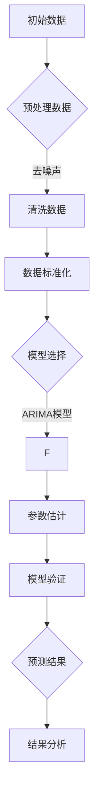

                 

### 《数学与经济学：数学模型在经济预测中的应用》

---

关键词：数学模型，经济预测，应用，算法，Python

摘要：本文深入探讨了数学模型在经济预测中的应用，包括时间序列分析、多元回归、差分方程和博弈论等核心模型。通过具体实例，详细阐述了数学模型在房地产价格预测和金融市场预测中的实际应用，为读者提供了全面而实用的经济预测工具和策略。

---

## 引言

在当今社会，经济预测已经成为政策制定、商业策略和风险管理的重要工具。数学模型作为经济预测的核心手段，能够帮助我们更准确地理解和预测经济现象。本文将详细探讨几种常用的数学模型在经济预测中的应用，帮助读者掌握这些模型的基本原理、应用方法和实际案例。

## 第一部分：数学模型基础

### 第1章：数学模型概述

#### 1.1 问题背景与核心概念

数学模型是利用数学语言来描述现实世界的现象和问题，通过建立数学方程或公式来模拟和分析实际问题。在经济预测中，数学模型可以帮助我们捕捉经济变量之间的关系，预测未来经济走势。

#### 1.2 数学模型的基本原理

数学模型的基本原理包括：数据收集、模型建立、模型验证和模型应用。通过这些步骤，我们可以建立一个准确、有效的数学模型来预测经济现象。

#### 1.3 数学模型的应用领域

数学模型广泛应用于宏观经济预测、金融市场预测、供需预测、通货膨胀预测等领域。在这些领域中，数学模型能够帮助我们更好地理解经济现象，预测未来走势。

#### 1.4 数学模型的基本框架

数学模型的基本框架包括：变量定义、方程建立、参数估计和模型检验。这些步骤构成了一个完整的数学建模过程，帮助我们构建和验证经济预测模型。

## 第二部分：经济预测中的数学模型

### 第2章：时间序列分析模型

#### 2.1 时间序列分析概述

时间序列分析是经济预测中最常用的方法之一，它通过对时间序列数据的分析和建模，预测未来的走势。时间序列分析主要包括自回归模型（AR）、移动平均模型（MA）、自回归移动平均模型（ARMA）和自回归积分滑动平均模型（ARIMA）。

#### 2.2 自回归模型（AR）

自回归模型（AR）是一种常用的时间序列预测模型，它通过历史数据来预测未来值。AR模型的基本原理是利用当前时间点的值与其前几个时间点的值之间的关系来预测未来值。

#### 2.3 移动平均模型（MA）

移动平均模型（MA）是通过计算一系列时间点的平均值来预测未来值。MA模型的基本原理是利用时间序列的均值来预测未来值。

#### 2.4 自回归移动平均模型（ARMA）

自回归移动平均模型（ARMA）结合了自回归模型（AR）和移动平均模型（MA）的优点，通过历史数据和平均值来预测未来值。ARMA模型的基本原理是利用历史数据和平均值之间的关系来预测未来值。

#### 2.5 自回归积分滑动平均模型（ARIMA）

自回归积分滑动平均模型（ARIMA）是一种更为复杂的时间序列预测模型，它结合了自回归模型（AR）、移动平均模型（MA）和差分变换。ARIMA模型的基本原理是利用历史数据和差分变换来预测未来值。

### 第3章：多元回归模型

#### 3.1 多元回归模型概述

多元回归模型是一种用于分析多个自变量和因变量之间关系的统计模型。它通过建立线性关系来预测因变量的值。

#### 3.2 线性回归模型

线性回归模型是最简单和最常用的多元回归模型，它通过建立一条直线来描述自变量和因变量之间的关系。线性回归模型的基本原理是利用最小二乘法来估计模型的参数。

#### 3.3 多元线性回归模型的假设检验

多元线性回归模型的假设检验用于验证模型的有效性和合理性。这些假设包括线性关系、独立性和同方差性。

#### 3.4 多元非线性回归模型

多元非线性回归模型用于描述非线性关系。它通过引入非线性函数来拟合数据，从而更好地描述变量之间的关系。

### 第4章：差分方程模型

#### 4.1 差分方程概述

差分方程是一种描述时间序列变化的数学方程。它通过差分算子来表示时间序列的滞后关系。

#### 4.2 差分方程的稳定性

差分方程的稳定性是衡量模型预测能力的重要指标。稳定性的判断标准包括稳定性区域和奇点。

#### 4.3 差分方程的求解

差分方程的求解是建立预测模型的关键步骤。常用的求解方法包括迭代法、矩阵法和数值计算法。

#### 4.4 差分方程在经济预测中的应用

差分方程在经济预测中广泛应用于宏观经济分析和政策评估。通过差分方程模型，我们可以预测经济变量之间的动态关系。

### 第5章：博弈论模型

#### 5.1 博弈论概述

博弈论是研究决策者之间相互作用和竞争的数学理论。它广泛应用于经济预测、市场竞争和资源分配等领域。

#### 5.2 零和博弈与非零和博弈

零和博弈和非零和博弈是博弈论中的两种基本形式。零和博弈是指一方的收益等于另一方的损失，而非零和博弈则存在多方的共同利益。

#### 5.3 博弈论在经济预测中的应用

博弈论在经济预测中的应用主要包括市场预测、竞争策略和风险分析。通过博弈论模型，我们可以更好地理解市场行为和竞争态势。

## 第三部分：数学模型在经济预测中的应用案例

### 第6章：房地产价格预测

#### 6.1 房地产市场概述

房地产价格预测是经济预测的一个重要领域。通过对房地产市场的分析和建模，我们可以预测未来房地产价格的走势。

#### 6.2 房地产价格预测模型

房地产价格预测模型包括时间序列分析模型、多元回归模型和差分方程模型。这些模型可以捕捉房地产市场的复杂关系，提供准确的预测结果。

#### 6.3 模型实现与结果分析

通过实际数据和Python代码，我们可以实现房地产价格预测模型，并对预测结果进行分析和验证。

#### 6.4 房地产价格预测的实践应用

房地产价格预测在房地产投资、政策制定和风险管理等领域具有重要应用价值。通过预测模型，我们可以做出更科学的决策。

### 第7章：金融市场预测

#### 7.1 金融市场概述

金融市场是经济预测的另一个重要领域。金融市场的波动对宏观经济和微观经济都有重要影响。

#### 7.2 金融市场预测模型

金融市场预测模型包括时间序列分析模型、多元回归模型和博弈论模型。这些模型可以捕捉金融市场的复杂关系，提供准确的预测结果。

#### 7.3 模型实现与结果分析

通过实际数据和Python代码，我们可以实现金融市场预测模型，并对预测结果进行分析和验证。

#### 7.4 金融市场预测的实践应用

金融市场预测在投资决策、风险管理和市场分析等领域具有重要应用价值。通过预测模型，我们可以更好地理解市场行为和做出科学的决策。

## 第四部分：最佳实践与总结

### 第8章：最佳实践与总结

#### 8.1 最佳实践

在实际应用中，我们需要结合具体问题和数据，选择合适的数学模型和方法。通过实际案例，我们可以总结出一些最佳实践，帮助读者更好地应用数学模型进行经济预测。

#### 8.2 小结

本文介绍了数学模型在经济预测中的应用，包括时间序列分析、多元回归、差分方程和博弈论等模型。通过这些模型，我们可以更准确地预测经济现象，为决策提供有力支持。

#### 8.3 注意事项

在应用数学模型进行经济预测时，我们需要注意模型的假设条件、数据质量和模型验证。只有通过合理的模型设计和严谨的验证，我们才能得到准确的预测结果。

#### 8.4 拓展阅读

为了深入了解数学模型在经济预测中的应用，读者可以参考以下拓展阅读资源，进一步学习相关理论和实践。

---

作者：AI天才研究院/AI Genius Institute & 禅与计算机程序设计艺术 /Zen And The Art of Computer Programming

---

**附录：Mermaid 图流程图示例**



**附录：Python 源代码示例**

```python
import pandas as pd
from statsmodels.tsa.arima_model import ARIMA
import matplotlib.pyplot as plt

# 加载数据
data = pd.read_csv('data.csv')
close_price = data['Close']

# ARIMA模型
model = ARIMA(close_price, order=(5, 1, 2))
model_fit = model.fit()

# 预测
predictions = model_fit.predict(start=len(close_price), end=len(close_price) + 10)

# 可视化
plt.plot(close_price, label='实际价格')
plt.plot(predictions, label='预测价格')
plt.legend()
plt.show()
```

**附录：LaTeX 公式示例**

独立段落内的公式：
$$
x = \frac{-b \pm \sqrt{b^2 - 4ac}}{2a}
$$

段落内的公式：
$
x > y
$

---

