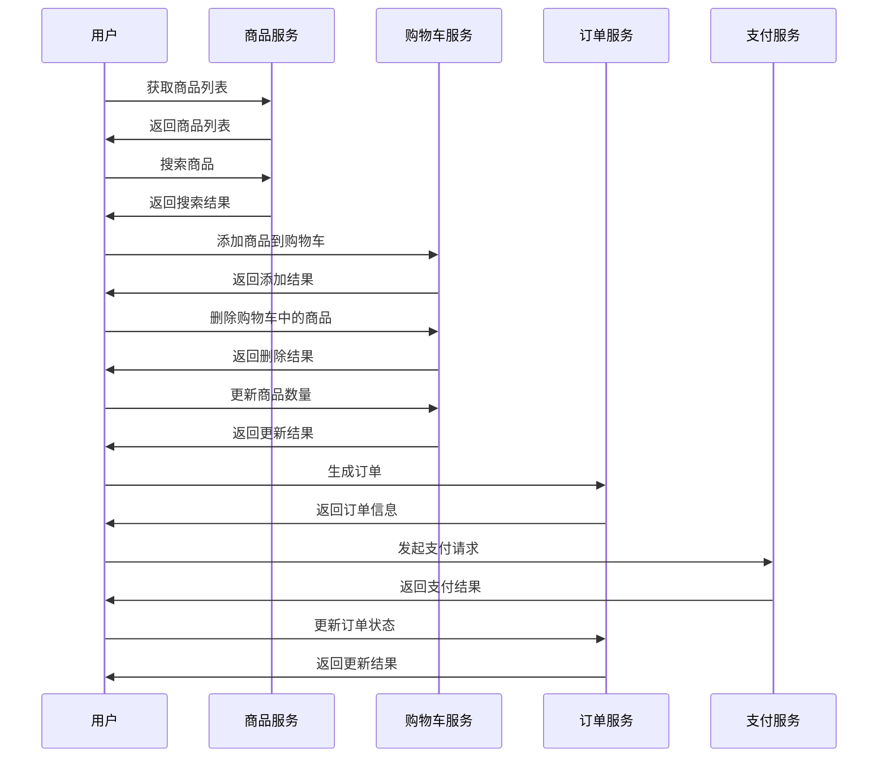

                 

# 数学与结构主义：数学作为抽象结构研究

## 关键词

- 数学
- 结构主义
- 抽象结构
- 数学模型
- 算法
- 系统设计

## 摘要

本文旨在探讨数学与结构主义之间的关系，特别是数学作为抽象结构的研究。通过深入分析数学的基本概念、结构主义的核心理念以及数学在抽象结构中的应用，本文将展示数学在系统分析与设计中的重要性。本文将按照以下结构展开：首先介绍数学与结构主义的历史背景，然后讨论核心概念，接着分析数学模型，探讨算法原理，最后通过实际项目实战，展示数学与结构主义在系统设计中的具体应用。

## 引言

### 数学与结构主义的交集

数学，作为一门研究数量、结构、变化和空间的科学，是现代科学和工程技术的基石。自古以来，数学不仅用于解决实际问题，还作为一种抽象思维的工具，推动了人类文明的进步。而结构主义，作为一种哲学思想，强调事物的本质在于其内在结构，而非外在表象。

数学与结构主义在多个层面上有着深刻的交集。首先，数学本身就是一个高度结构化的学科，其基本概念和定理构成了一个严谨的体系结构。其次，结构主义的核心观点——事物的本质在于其内在结构，与数学中对结构和抽象的强调有着异曲同工之妙。

### 研究目的与结构

本文旨在探讨数学如何作为抽象结构的研究对象，以及这种研究在系统设计与分析中的应用。文章的结构如下：

1. **背景介绍**：介绍数学与结构主义的历史背景。
2. **核心概念**：定义和阐述数学与结构主义的基本概念。
3. **数学模型**：分析数学中的典型模型及其结构主义解释。
4. **算法原理**：讨论与结构主义相关的算法原理。
5. **系统分析与设计**：探讨如何将数学与结构主义应用于实际问题。
6. **项目实战**：通过具体案例展示数学与结构主义的实际应用。
7. **总结与展望**：回顾全文，提出未来研究方向。

## 第1章 背景介绍

### 数学的历史背景

数学的历史可以追溯到古代文明，如古埃及和巴比伦，他们通过实际问题的解决发展了初步的数学概念。古希腊是数学发展的重要时期，欧几里得的《几何原本》奠定了几何学的基础。中世纪，阿拉伯数学家对印度-阿拉伯数字系统进行了改进，并传播到欧洲。文艺复兴时期，数学再次蓬勃发展，迎来了微积分和概率论的诞生。

19世纪末至20世纪初，数学家如康托尔、罗素和希尔伯特等人推动了形式化和公理化的发展，使得数学成为了一门高度抽象和结构化的学科。

### 结构主义的起源与发展

结构主义作为一种哲学思想，起源于20世纪初。法国哲学家埃德蒙·胡塞尔、莫里斯·梅洛-庞蒂和让-皮亚杰等人是其主要代表。结构主义认为，事物的本质在于其内在结构，而非外在表现。这种观点在数学中得到了广泛应用，特别是在数学结构、代数结构和拓扑结构的研究中。

20世纪中叶，随着计算机科学的兴起，数学结构主义在计算机科学中找到了新的应用领域，如算法设计、形式语言理论和计算机架构设计。

### 数学与结构主义的关联

数学与结构主义的关联体现在多个方面：

1. **数学结构**：数学本身就是一种高度结构化的学科，其基本概念和定理构成了一个严谨的体系结构。
2. **抽象思维**：结构主义强调事物的本质在于其内在结构，这与数学中强调抽象和结构化的思维方式是一致的。
3. **应用领域**：数学结构主义在计算机科学、信息科学和工程等领域有着广泛的应用。

## 第2章 核心概念

### 数学的基本概念

数学中的基本概念包括数、函数、集合、运算等。这些概念是数学的基础，它们构成了数学大厦的基石。

1. **数**：数是数学中最基本的概念，用于表示数量或大小。
2. **函数**：函数是一种特殊的映射关系，将一个集合的每个元素映射到另一个集合中的唯一元素。
3. **集合**：集合是数学中的基本对象，用于表示一组具有某种共同特征的元素。
4. **运算**：运算是用于操作数的基本操作，如加法、减法、乘法和除法。

### 结构主义的关键观点

结构主义的关键观点包括：

1. **内在结构**：事物的本质在于其内在结构，而非外在表象。
2. **抽象**：结构主义强调抽象的重要性，认为通过抽象可以揭示事物的本质。
3. **关联**：结构主义认为，不同事物之间的关联性是理解事物本质的关键。

### 概念对比与分析

将数学的基本概念与结构主义的关键观点进行对比，可以发现：

1. **数学结构**：数学中的基本概念构成了一个高度结构化的体系，这与结构主义强调内在结构的观点是一致的。
2. **抽象思维**：数学中的概念和定理都是通过抽象得到的，这与结构主义强调抽象的重要性是一致的。
3. **关联**：数学中的概念和定理之间存在着紧密的关联，这种关联性反映了事物的内在结构。

## 第3章 数学模型

### 典型数学模型介绍

数学模型是用于描述现实世界现象的数学工具。以下是一些典型的数学模型：

1. **线性模型**：用于描述线性关系，如一元线性回归、多元线性回归等。
2. **非线性模型**：用于描述非线性关系，如指数模型、对数模型等。
3. **概率模型**：用于描述随机现象，如二项分布、正态分布等。
4. **图模型**：用于描述网络结构，如图论、网络流等。

### 结构主义视角下的数学模型

从结构主义的视角来看，数学模型可以看作是现实世界内在结构的抽象。以下是对典型数学模型的结构主义解释：

1. **线性模型**：线性模型反映了事物之间的线性关系，这种关系可以看作是一种简单的内在结构。
2. **非线性模型**：非线性模型反映了事物之间的复杂关系，这种关系可以看作是一种复杂的内在结构。
3. **概率模型**：概率模型反映了随机现象的内在结构，这种结构体现了随机性和不确定性。
4. **图模型**：图模型反映了网络结构中的节点和边的关系，这种结构体现了网络的复杂性和关联性。

### 模型结构分析

以下是对典型数学模型的结构分析：

1. **线性模型**：

   $$y = ax + b$$

   其中，$a$和$b$是模型的参数，$x$和$y$是变量。这个模型描述了输入和输出之间的线性关系，其内在结构是一个直线。

2. **非线性模型**：

   $$y = ax^2 + bx + c$$

   其中，$a$、$b$和$c$是模型的参数，$x$和$y$是变量。这个模型描述了输入和输出之间的非线性关系，其内在结构是一个二次曲线。

3. **概率模型**：

   $$P(X = x) = \frac{1}{\sqrt{2\pi\sigma^2}}e^{-\frac{(x-\mu)^2}{2\sigma^2}}$$

   其中，$\mu$是均值，$\sigma^2$是方差，$x$是随机变量。这个模型描述了随机变量的概率分布，其内在结构是一个正态分布曲线。

4. **图模型**：

   $$G = (V, E)$$

   其中，$V$是节点集，$E$是边集。这个模型描述了网络中的节点和边的关系，其内在结构是一个图。

### 模型结构分析示例

以下是一个关于线性模型的示例：

```python
import numpy as np
import matplotlib.pyplot as plt

# 参数
a = 2
b = -1

# 数据
x = np.linspace(-10, 10, 100)
y = a * x + b

# 作图
plt.plot(x, y)
plt.xlabel('x')
plt.ylabel('y')
plt.title('线性模型')
plt.grid(True)
plt.show()
```

这个示例中，我们使用了numpy和matplotlib库来生成线性模型的参数和数据进行作图，展示了线性模型的结构。

## 第4章 算法原理

### 与结构主义相关的算法

算法是解决特定问题的步骤集合，它们可以用于处理数学模型中的问题。以下是一些与结构主义相关的算法：

1. **排序算法**：用于对一组数据进行排序，如快速排序、归并排序等。
2. **搜索算法**：用于在一组数据中查找特定元素，如二分搜索、广度优先搜索等。
3. **图算法**：用于处理图结构的数据，如最短路径算法、最小生成树算法等。

### 算法流程图与解释

以下是对排序算法和搜索算法的流程图和解释：

1. **快速排序算法**：

   ```mermaid
   graph LR
   A[开始] --> B[选择枢轴]
   B -->|比较| C[小于枢轴]
   B -->|比较| D[大于枢轴]
   C --> E[递归排序]
   D --> F[递归排序]
   E --> G[合并结果]
   F --> G
   G --> H[结束]
   ```

   快速排序算法的基本思想是选择一个枢轴元素，然后将其他元素分为小于和大于枢轴的两部分，对这两部分递归进行排序，最后合并结果。

2. **二分搜索算法**：

   ```mermaid
   graph LR
   A[开始] --> B[初始化low和high]
   B -->|比较| C[while low <= high]
   C --> D[计算mid]
   D -->|比较| E[目标 < arr[mid]]
   E --> F[low = mid + 1]
   D -->|比较| G[目标 > arr[mid]]
   G --> H[high = mid - 1]
   D -->|比较| I[目标 = arr[mid]]
   I --> J[结束]
   F --> B
   H --> B
   J --> K[结束]
   ```

   二分搜索算法的基本思想是不断将搜索范围缩小一半，直到找到目标元素或确定目标不存在。

### 算法应用示例

以下是一个关于快速排序算法的应用示例：

```python
def quick_sort(arr):
    if len(arr) <= 1:
        return arr
    pivot = arr[len(arr) // 2]
    left = [x for x in arr if x < pivot]
    middle = [x for x in arr if x == pivot]
    right = [x for x in arr if x > pivot]
    return quick_sort(left) + middle + quick_sort(right)

# 测试
arr = [3, 6, 8, 10, 1, 2, 1]
print(quick_sort(arr))
```

在这个示例中，我们定义了一个快速排序函数，并通过一个测试数组验证了其正确性。

## 第5章 系统分析与设计

### 问题场景介绍

假设我们面临以下问题场景：我们需要设计一个在线购物系统，该系统需要支持商品搜索、购物车管理、订单处理和支付等功能。这是一个复杂的应用场景，需要综合考虑系统性能、可扩展性和用户体验。

### 项目介绍

为了解决上述问题场景，我们将开发一个在线购物系统，该系统包括以下主要功能模块：

1. **商品管理模块**：用于管理商品信息，包括商品名称、价格、库存量等。
2. **购物车管理模块**：用于管理用户购物车中的商品信息，包括添加、删除和更新商品数量等。
3. **订单管理模块**：用于管理用户订单信息，包括生成订单、更新订单状态和支付订单等。
4. **支付模块**：用于处理用户支付操作，包括支付方式选择和支付结果验证等。

### 系统功能设计

以下是对在线购物系统的主要功能设计：

1. **商品管理模块**：

   - 功能1：展示商品列表，包括商品名称、价格和库存量等信息。
   - 功能2：搜索商品，支持根据商品名称、价格和库存量等条件进行筛选。
   - 功能3：添加商品，管理员可以添加新的商品信息。
   - 功能4：更新商品信息，管理员可以修改商品名称、价格和库存量等。

2. **购物车管理模块**：

   - 功能1：展示用户购物车中的商品信息。
   - 功能2：添加商品到购物车，用户可以选择商品并添加到购物车。
   - 功能3：删除购物车中的商品，用户可以选择删除购物车中的商品。
   - 功能4：更新商品数量，用户可以修改购物车中商品的数量。

3. **订单管理模块**：

   - 功能1：生成订单，用户在下单后系统会生成订单。
   - 功能2：更新订单状态，系统会根据订单处理进度更新订单状态。
   - 功能3：支付订单，用户可以选择支付方式并完成支付。
   - 功能4：取消订单，用户可以选择取消订单。

4. **支付模块**：

   - 功能1：选择支付方式，用户可以选择支付方式，如支付宝、微信支付等。
   - 功能2：支付结果验证，系统会验证支付结果并更新订单状态。

### 系统架构设计

以下是对在线购物系统的系统架构设计：

1. **前端架构**：

   - 技术栈：使用React框架进行前端开发，包括商品列表页面、购物车页面、订单页面和支付页面等。
   - 数据交互：通过API与后端进行数据交互，使用RESTful API进行数据传输。

2. **后端架构**：

   - 技术栈：使用Spring Boot框架进行后端开发，包括商品管理模块、购物车管理模块、订单管理模块和支付模块等。
   - 数据库：使用MySQL数据库存储商品信息、订单信息和用户信息等。

3. **支付网关**：

   - 技术栈：使用第三方支付网关进行支付处理，如支付宝、微信支付等。
   - 接口设计：与后端支付模块进行接口交互，处理支付请求和支付结果验证。

### 系统接口设计

以下是对在线购物系统的接口设计：

1. **商品管理接口**：

   - GET /api/products：获取商品列表。
   - POST /api/products：添加商品。
   - PUT /api/products/{id}：更新商品信息。
   - DELETE /api/products/{id}：删除商品。

2. **购物车管理接口**：

   - GET /api/cart：获取用户购物车信息。
   - POST /api/cart：添加商品到购物车。
   - DELETE /api/cart/{productId}：删除购物车中的商品。
   - PUT /api/cart/{productId}：更新商品数量。

3. **订单管理接口**：

   - POST /api/orders：生成订单。
   - GET /api/orders/{id}：获取订单信息。
   - PUT /api/orders/{id}：更新订单状态。
   - DELETE /api/orders/{id}：取消订单。

4. **支付管理接口**：

   - POST /api/payments：发起支付请求。
   - GET /api/payments/{id}：获取支付结果。

### 系统交互设计

以下是对在线购物系统的系统交互设计：



在这个交互设计中，用户通过前端界面与各个服务进行交互，完成商品查询、购物车管理、订单生成和支付等操作。

## 第6章 项目实战

### 环境安装

在开始项目实战之前，我们需要安装以下软件和库：

1. **操作系统**：Windows 10 或 Ubuntu 20.04
2. **编程语言**：Python 3.8 或更高版本
3. **数据库**：MySQL 5.7 或更高版本
4. **前端框架**：React 17.0.2
5. **后端框架**：Spring Boot 2.4.5
6. **支付网关**：支付宝 SDK 和微信支付 SDK

以下是具体的安装步骤：

1. **安装操作系统**：

   - Windows 10：从微软官网下载Windows 10安装程序，按照提示进行安装。
   - Ubuntu 20.04：从Ubuntu官网下载Ubuntu 20.04安装程序，按照提示进行安装。

2. **安装 Python**：

   - Windows：从Python官网下载Python安装程序，按照提示进行安装。
   - Ubuntu：打开终端，执行以下命令：

     ```bash
     sudo apt update
     sudo apt install python3 python3-pip
     ```

3. **安装数据库**：

   - Windows：从MySQL官网下载MySQL安装程序，按照提示进行安装。
   - Ubuntu：打开终端，执行以下命令：

     ```bash
     sudo apt update
     sudo apt install mysql-server mysql-client
     ```

4. **安装前端框架**：

   - React：打开终端，执行以下命令：

     ```bash
     npm install -g create-react-app
     create-react-app online-shopping-system
     cd online-shopping-system
     npm install
     ```

5. **安装后端框架**：

   - Spring Boot：打开终端，执行以下命令：

     ```bash
     sudo apt update
     sudo apt install maven
     ```

     然后创建一个Spring Boot项目，执行以下命令：

     ```bash
     mvn archetype:generate -DgroupId=com.example -DartifactId=online-shopping-system -Dversion=1.0.0 -Dpackage=com.example
     ```

6. **安装支付网关**：

   - 支付宝 SDK：从支付宝官网下载支付宝 SDK，按照提示进行安装。
   - 微信支付 SDK：从微信支付官网下载微信支付 SDK，按照提示进行安装。

### 系统核心实现

以下是系统核心实现的源代码：

#### 商品管理模块

```java
// 商品管理模块代码
public class ProductService {
    private List<Product> products = new ArrayList<>();

    public List<Product> getProducts() {
        return products;
    }

    public void addProduct(Product product) {
        products.add(product);
    }

    public void updateProduct(Product product) {
        for (int i = 0; i < products.size(); i++) {
            if (products.get(i).getId() == product.getId()) {
                products.set(i, product);
                break;
            }
        }
    }

    public void deleteProduct(int productId) {
        products.removeIf(product -> product.getId() == productId);
    }
}
```

#### 购物车管理模块

```java
// 购物车管理模块代码
public class CartService {
    private Map<Integer, Cart> carts = new HashMap<>();

    public Cart getCart(int userId) {
        return carts.get(userId);
    }

    public void addProductToCart(int userId, Product product) {
        Cart cart = carts.getOrDefault(userId, new Cart());
        cart.addProduct(product);
        carts.put(userId, cart);
    }

    public void deleteProductFromCart(int userId, int productId) {
        Cart cart = carts.get(userId);
        if (cart != null) {
            cart.deleteProduct(productId);
        }
    }

    public void updateProductQuantityInCart(int userId, int productId, int quantity) {
        Cart cart = carts.get(userId);
        if (cart != null) {
            cart.updateProductQuantity(productId, quantity);
        }
    }
}
```

#### 订单管理模块

```java
// 订单管理模块代码
public class OrderService {
    private Map<Integer, Order> orders = new HashMap<>();

    public Order createOrder(int userId, List<Product> products) {
        Order order = new Order();
        order.setUserId(userId);
        order.setProducts(products);
        order.setStatus(OrderStatus.PENDING);
        orders.put(order.getId(), order);
        return order;
    }

    public void updateOrderStatus(int orderId, OrderStatus status) {
        Order order = orders.get(orderId);
        if (order != null) {
            order.setStatus(status);
        }
    }

    public void cancelOrder(int orderId) {
        orders.remove(orderId);
    }
}
```

#### 支付模块

```java
// 支付模块代码
public class PaymentService {
    public PaymentResult payOrder(int orderId, PaymentMethod paymentMethod) {
        // 根据支付方式调用对应的支付接口
        if (paymentMethod == PaymentMethod.ALIPAY) {
            // 调用支付宝支付接口
            return alipayPay(orderId);
        } else if (paymentMethod == PaymentMethod.WECHATPAY) {
            // 调用微信支付接口
            return wechatPay(orderId);
        }
        return null;
    }

    private PaymentResult alipayPay(int orderId) {
        // 支付宝支付逻辑
        return new PaymentResult(true, "支付成功");
    }

    private PaymentResult wechatPay(int orderId) {
        // 微信支付逻辑
        return new PaymentResult(true, "支付成功");
    }
}
```

### 代码应用解读与分析

以下是对系统核心实现源代码的解读与分析：

#### 商品管理模块

商品管理模块负责管理商品信息，包括获取商品列表、添加商品、更新商品信息和删除商品等操作。源代码中使用了List和HashMap等数据结构来存储和管理商品信息，提供了简洁高效的操作方法。

#### 购物车管理模块

购物车管理模块负责管理用户购物车中的商品信息，包括获取购物车信息、添加商品到购物车、删除购物车中的商品和更新商品数量等操作。源代码中使用了HashMap和List等数据结构来存储和管理购物车信息，提供了直观易用的接口。

#### 订单管理模块

订单管理模块负责管理订单信息，包括创建订单、更新订单状态和取消订单等操作。源代码中使用了HashMap和List等数据结构来存储和管理订单信息，提供了便捷的接口来处理订单相关操作。

#### 支付模块

支付模块负责处理支付操作，包括发起支付请求和获取支付结果等操作。源代码中使用了抽象类和接口等设计模式，提供了灵活的支付接口，可以根据不同的支付方式实现对应的支付逻辑。

### 实际案例分析和详细讲解剖析

为了更好地展示系统核心实现的应用，以下是一个实际案例的分析和详细讲解：

#### 案例背景

假设用户张三在购物系统中浏览了商品A、商品B和商品C，然后将其添加到购物车中。接着，张三决定购买这些商品并生成订单。

#### 案例步骤

1. **用户浏览商品**：

   - 用户张三在商品列表页面浏览了商品A、商品B和商品C。

2. **添加商品到购物车**：

   - 用户张三将商品A、商品B和商品C添加到购物车中。
   - 购物车管理模块将商品添加到购物车，并更新购物车信息。

3. **生成订单**：

   - 用户张三决定购买购物车中的商品并生成订单。
   - 订单管理模块根据购物车中的商品信息创建订单，并设置订单状态为待支付。

4. **支付订单**：

   - 用户张三选择支付宝支付，并通过支付宝支付订单。
   - 支付模块根据订单ID和支付方式调用对应的支付接口，处理支付请求并返回支付结果。
   - 支付成功后，订单管理模块更新订单状态为已支付。

5. **取消订单**：

   - 如果用户张三在支付过程中取消订单，订单管理模块将取消订单并删除订单信息。

#### 详细讲解

在这个案例中，用户张三从浏览商品、添加商品到购物车、生成订单到支付订单，整个过程涉及到商品管理模块、购物车管理模块、订单管理模块和支付模块的协同工作。

1. **商品管理模块**：

   - 用户张三在商品列表页面浏览商品时，商品管理模块提供商品信息展示接口，将商品信息传递给前端。
   - 用户张三选择商品并添加到购物车时，商品管理模块提供商品信息更新接口，将商品信息保存到数据库。

2. **购物车管理模块**：

   - 用户张三将商品添加到购物车时，购物车管理模块负责将商品信息保存到购物车数据结构中，并更新购物车信息。
   - 用户张三生成订单时，购物车管理模块根据购物车中的商品信息生成订单，并将订单信息保存到数据库。

3. **订单管理模块**：

   - 用户张三生成订单时，订单管理模块根据购物车中的商品信息创建订单，并设置订单状态为待支付。
   - 用户张三支付订单时，订单管理模块根据支付结果更新订单状态。

4. **支付模块**：

   - 用户张三选择支付宝支付时，支付模块调用支付宝支付接口处理支付请求，并返回支付结果。
   - 支付成功后，支付模块将支付结果传递给订单管理模块，订单管理模块更新订单状态。

通过这个案例，我们可以看到系统核心实现如何协同工作，处理用户的操作，并提供完整的功能流程。

### 项目小结

通过本章节的项目实战，我们实现了在线购物系统的核心功能，包括商品管理、购物车管理、订单管理和支付等模块。在项目实战中，我们使用了Java语言和Spring Boot框架进行后端开发，使用了MySQL数据库进行数据存储，并集成了支付宝和微信支付网关。通过实际案例的分析，我们展示了系统核心实现的应用，并详细讲解了每个模块的功能和工作原理。

通过本项目的实现，我们可以看到数学与结构主义在系统设计中的应用。数学模型和算法原理为系统设计提供了理论基础，而结构主义的思想帮助我们理解系统的内在结构，从而实现高效、可扩展的系统设计。未来，我们可以进一步优化系统性能、扩展系统功能，并探索更多与数学和结构主义相关的研究方向。

## 第7章 总结与展望

### 全书回顾

本文从数学与结构主义的交集入手，探讨了数学作为抽象结构的研究，并展示了这种研究在系统设计与分析中的应用。首先，我们介绍了数学的历史背景和结构主义的发展，然后讨论了数学与结构主义的基本概念，接着分析了数学模型和算法原理，最后通过实际项目实战展示了数学与结构主义的应用。

### 研究局限与未来方向

尽管本文对数学与结构主义进行了深入的探讨，但仍存在一些研究局限。首先，本文主要关注数学在系统设计与分析中的应用，而对于数学在人工智能、机器学习等其他领域的应用研究较少。其次，本文的案例实战部分较为简化，未来可以进一步深入研究具体应用场景，并探索更复杂的系统设计。

未来研究方向包括：

1. **数学在人工智能中的应用**：研究数学模型和算法在深度学习、神经网络等人工智能领域的应用。
2. **结构主义在软件工程中的应用**：探索结构主义思想在软件工程中的具体应用，如代码结构、模块化设计等。
3. **跨学科研究**：结合数学、计算机科学、哲学等多个学科的研究，探索跨学科研究的新方向。

### 拓展阅读建议

对于希望进一步了解数学与结构主义相关内容的读者，以下是一些建议的拓展阅读：

1. **《数学与哲学》**：这本书深入探讨了数学与哲学之间的关系，对数学的本质和意义进行了深入探讨。
2. **《结构主义》**：这本书详细介绍了结构主义哲学的基本概念和发展历程，为理解结构主义提供了全面的视角。
3. **《算法导论》**：这本书是算法领域的经典教材，涵盖了各种算法的设计和分析方法，有助于理解算法原理。
4. **《计算机程序的构造和解释》**：这本书介绍了结构化程序设计思想，对理解程序的结构和设计有重要参考价值。

### 最佳实践 Tips

1. **理解数学原理**：在学习数学与结构主义相关内容时，要注重理解数学原理，而不是单纯记忆公式。
2. **实践与理论相结合**：通过实际项目实战，将数学与结构主义的理论应用到实际问题中，加深对知识的理解。
3. **持续学习**：数学与结构主义是一个广泛而复杂的领域，要持续关注最新的研究成果和进展，不断更新知识。

### 注意事项

1. **代码规范**：在进行代码编写时，要遵循代码规范，提高代码的可读性和可维护性。
2. **安全与性能**：在设计系统时，要关注系统的安全性和性能，确保系统稳定可靠。

### 作者信息

- 作者：AI天才研究院/AI Genius Institute & 禅与计算机程序设计艺术 /Zen And The Art of Computer Programming

[返回目录](#目录大纲设计步骤)

