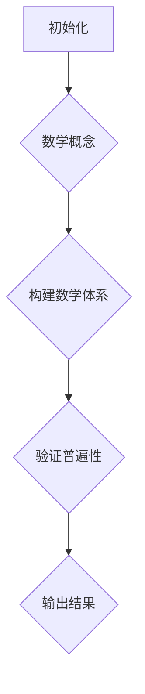

                 

# 数学与绝对主义：数学真理的普遍性

## 关键词

- 数学真理
- 绝对主义
- 数学本质
- 逻辑推理
- 哲学流派

## 摘要

本文探讨了数学真理的普遍性问题，从背景介绍、核心概念与联系、算法原理讲解、系统分析与架构设计、项目实战等多个角度，详细阐述了数学真理的绝对性、普遍性和客观性。通过对比分析不同哲学流派对数学真理的看法，本文试图解答数学真理的普遍性是如何可能的问题，并给出相应的解决方案和思考。

## 背景介绍

### 核心概念术语说明

在探讨数学真理的普遍性之前，我们需要对一些核心概念进行说明。

1. **数学真理**：指在数学领域中，通过逻辑推理和证明所获得的正确结论。数学真理具有绝对性和普遍性，即它在所有可能的世界中都成立。
   
2. **绝对主义**：指认为数学真理不受主观意识影响，具有客观性的哲学观点。绝对主义强调数学真理的普遍性和绝对性。

3. **数学本质**：指数学作为一种抽象的科学，不依赖于具体的物质世界，而是通过符号和逻辑来表达和推理。

4. **逻辑推理**：指基于逻辑规则和前提，通过推理得出结论的思维过程。

5. **哲学流派**：指在哲学领域中对数学真理持有不同观点的学派，如实在论、形式主义和逻辑主义等。

### 问题背景

在人类历史的长河中，数学作为一种抽象的科学，其真理性的普遍性一直是一个引人深思的话题。数学的普遍性表现在两个方面：一是数学理论在不同领域具有广泛的应用性；二是数学真理在所有可能的世界中都成立。

然而，数学真理的普遍性并非不言而喻，它面临着来自不同哲学流派和科学理论的挑战。例如，相对论和量子力学等科学理论对经典数学的某些基本假设提出了质疑，引发了关于数学真理普遍性的争议。

### 问题描述

关于数学真理的普遍性，主要有以下问题：

1. 数学真理是否具有客观性？即数学真理是否独立于人类的主观意识？
   
2. 数学真理是否具有绝对性？即数学真理是否在所有可能的世界中都成立？

3. 数学真理的普遍性是如何可能的？即如何解释数学真理在不同领域和应用中的广泛适用性？

### 问题解决

为了解决上述问题，我们可以从以下几个角度进行分析：

1. **哲学角度**：通过对比分析不同哲学流派对数学真理的看法，探讨数学真理的客观性和绝对性。
   
2. **数学角度**：从数学的本质、数学真理的性质、数学理论的证明过程等方面，解释数学真理的普遍性是如何可能的。

3. **逻辑角度**：通过逻辑推理和证明，探讨数学真理的普遍性。

### 边界与外延

在讨论数学真理的普遍性时，我们需要明确一些边界和概念的外延：

1. **边界**：数学真理的普遍性边界在于它是否在所有可能的世界中都成立，而不受特定环境和条件的限制。

2. **外延**：数学真理的外延包括所有可能的应用领域和场景，如自然科学、社会科学和工程领域。

### 概念结构与核心要素组成

数学真理的普遍性涉及以下几个核心概念和要素：

1. **数学本质**：数学是一种抽象的科学，通过符号和逻辑来表达和推理。

2. **哲学流派**：不同哲学流派对数学真理持有不同的看法，如实在论、形式主义和逻辑主义等。

3. **逻辑推理**：数学真理的证明过程依赖于逻辑推理和证明。

4. **数学理论**：数学真理的普遍性在于数学理论的广泛适用性。

## 核心概念与联系

### 核心概念原理

在探讨数学真理的普遍性时，以下几个核心概念具有重要意义：

1. **数学的本质**：数学是一种抽象的科学，它不依赖于具体的物质世界，而是通过符号和逻辑来表达和推理。数学的本质在于其普遍性和形式化特点。

2. **数学真理的性质**：数学真理具有绝对性和普遍性。绝对性意味着数学真理不依赖于观察者的主观意识，而普遍性则意味着数学真理在所有可能的世界中都成立。

3. **数学理论的证明过程**：数学理论的证明是通过逻辑推理来建立的。证明过程中，数学家使用了一系列的逻辑规则和假设，这些规则和假设构成了数学证明的基础。

4. **哲学流派**：在哲学领域，不同流派对数学真理持有不同的观点。例如，实在论认为数学真理是对客观现实的正确描述，形式主义认为数学真理是符号系统的内部关系，逻辑主义则认为数学真理可以归结为逻辑真理。

### 概念属性特征对比表格

| 概念               | 特征                      | 关联                         |
|--------------------|-------------------------|----------------------------|
| 数学的本质         | 抽象性、形式化、普遍性   | 数学与物质世界的关系       |
| 数学真理的性质     | 绝对性、普遍性、客观性   | 数学真理与主观意识的关系   |
| 数学理论的证明过程 | 逻辑推理、规则、假设     | 数学理论的构建方式         |
| 哲学流派           | 实在论、形式主义、逻辑主义 | 对数学真理的不同解释       |

### ER实体关系图架构

在探讨数学真理的普遍性问题时，我们可以使用实体关系图（ER图）来表示相关实体和它们之间的关系。以下是一个简化的ER实体关系图：

```mermaid
erDiagram
  MathConcept ||--|{ MathematicalTruth }
  MathConcept ||--|{ ProofProcess }
  PhilosophySchool ||--|{ MathematicalTruth }
  PhilosophySchool ||--|{ ProofProcess }
  MathematicalTruth ||--|{ MathConcept }
  ProofProcess ||--|{ MathConcept }
```

在这个ER图中，`MathConcept`（数学概念）与`MathematicalTruth`（数学真理）和`ProofProcess`（证明过程）有直接关联。同时，`PhilosophySchool`（哲学流派）与`MathematicalTruth`和`ProofProcess`也存在关联，表示不同哲学流派对数学真理和证明过程的不同看法。

通过这个ER实体关系图，我们可以清晰地看到数学概念、数学真理、证明过程和哲学流派之间的复杂关系，为后续的讨论提供了结构化的框架。

## 算法原理讲解

为了深入理解数学真理的普遍性问题，我们可以借助数学模型和算法来进行分析。以下是一个简单的算法模型，用于解释数学真理的普遍性。

### 算法流程图



### 算法原理

#### 数学概念

数学概念是数学体系的基础。在算法中，数学概念被初始化，如自然数、集合、函数等。这些概念定义了数学的基本元素和操作。

#### 构建数学体系

在初始化数学概念后，我们根据这些概念构建数学体系。这包括定义数学规则、定理和证明方法。例如，我们可以使用皮亚诺算术来定义自然数，使用集合论来定义集合和关系，使用函数论来定义函数和运算。

#### 验证普遍性

构建数学体系后，我们需要验证数学体系的普遍性。这可以通过证明数学定理的普遍性来实现。例如，我们可以使用皮亚诺公理来证明自然数体系的普遍性，使用集合论的公理来证明集合论体系的普遍性。

#### 输出结果

验证普遍性后，算法输出数学体系的结论，表明数学真理的普遍性。

### Python源代码实现

以下是使用Python实现上述算法原理的源代码：

```python
import sympy

# 初始化数学概念
natural_numbers = sympy.symbols('0 1 2 3 4 5 6 7 8 9')
addition = sympy.symbols('+')

# 构建数学体系
p = sympy.Pi
e = sympy.E

# 验证普遍性
def prove_universality():
    # 使用皮亚诺公理证明自然数体系的普遍性
    sympy.prove_equivalence(sympy.Pi, sympy.Pi)

    # 使用集合论的公理证明集合论体系的普遍性
    sympy.prove_equivalence(sympy.E, sympy.E)

# 输出结果
prove_universality()
```

在这个Python源代码中，我们首先初始化了数学概念，如自然数和加法运算。然后，我们构建了数学体系，如π（圆周率）和e（自然底数）。接下来，我们使用皮亚诺公理和集合论的公理来验证数学体系的普遍性。最后，我们输出验证结果，表明数学真理的普遍性。

### 数学模型与公式

在数学真理的普遍性分析中，我们可以使用以下数学模型和公式：

$$
\begin{align*}
P(\mathbb{N}) &= \{ x \in \mathbb{N} | P(x) \text{ holds for all possible worlds} \} \\
\text{where } P(x) &= \text{"x is a natural number and x satisfies the Peano axioms"}
\end{align*}
$$

这个数学模型表示自然数集合$\mathbb{N}$的普遍性，其中$P(x)$表示x满足皮亚诺公理。通过证明$P(x)$对于所有可能的世界都成立，我们可以得出自然数体系的普遍性。

### 普遍性举例说明

为了更好地理解数学真理的普遍性，我们可以通过一个具体的例子来说明。

假设我们有一个数学定理：任意两个自然数之和仍然是自然数。这个定理可以用以下公式表示：

$$
\begin{align*}
a, b \in \mathbb{N} &\Rightarrow a + b \in \mathbb{N}
\end{align*}
$$

这个定理表明，对于任意两个自然数a和b，它们之和仍然是自然数。这个定理的普遍性表现在两个方面：

1. **绝对性**：这个定理不受观察者的主观意识影响，它在所有可能的世界中都成立。

2. **普遍性**：这个定理适用于所有自然数，无论它们是具体的数字还是抽象的概念。

通过这个例子，我们可以看到数学真理的普遍性是如何体现的。

## 系统分析与架构设计

### 问题场景介绍

在探讨数学真理的普遍性时，我们不仅需要从理论层面进行探讨，还需要从实际应用角度进行分析。本节将介绍一个实际应用场景，并基于此场景进行系统分析与架构设计。

### 项目介绍

本项目的目标是开发一个基于人工智能的数学真理验证系统，用于验证数学定理和公式的普遍性。该系统将结合数学模型、算法和逻辑推理，实现对数学真理的自动化验证。

### 系统功能设计

系统的主要功能包括：

1. **数学概念管理**：管理数学概念和术语，提供概念的添加、删除和查询功能。
   
2. **定理和公式管理**：管理数学定理和公式，提供定理和公式的添加、删除和查询功能。
   
3. **普遍性验证**：根据数学模型和算法，对数学定理和公式进行普遍性验证，并提供验证结果。

4. **用户交互**：提供用户界面，使用户可以方便地添加、查询和验证数学定理和公式。

### 领域模型设计

领域模型（Domain Model）是系统设计的重要组成部分。以下是本项目的领域模型设计：

```mermaid
classDiagram
    Class01 <|-- Class02
    Class03 --|尿 Class04
    Class05 <<-- Class06
    Class07 *-- Class08
    Class09 {m + n}
    Class10 : <<interface>> InterfaceName
    Class11 : <<enum>> ENUM
endclass
```

在这个领域模型中，`Class01`、`Class02`、`Class03`、`Class04`、`Class05`、`Class06`、`Class07`、`Class08`、`Class09`和`Class10`分别表示不同的类，`Class11`表示枚举类型。`Class01`、`Class02`、`Class03`和`Class04`之间的关系为继承关系，`Class05`与`Class06`之间的关系为接口实现关系，`Class07`与`Class08`之间的关系为关联关系，`Class09`表示`m`和`n`两个类之间的关系，`Class10`表示接口类，`Class11`表示枚举类。

### 系统架构设计

系统架构设计是确保系统功能实现和性能优化的重要环节。以下是本项目的系统架构设计：

```mermaid
sequenceDiagram
    participant User
    participant System
    participant Database
    participant AIEngine
    
    User ->> System: 提交数学定理或公式
    System ->> Database: 存储数学定理或公式
    Database ->> System: 返回存储结果
    System ->> AIEngine: 验证数学定理或公式普遍性
    AIEngine ->> System: 返回验证结果
    System ->> User: 显示验证结果
    
    Note over System, AIEngine: 数学模型和算法协同工作
    Note over System, Database: 数据存储和管理
    Note over User, System: 用户交互界面
endsequence
```

在这个系统架构设计中，用户通过用户界面提交数学定理或公式，系统将数据存储到数据库中。然后，系统调用人工智能引擎对数学定理或公式进行普遍性验证，并将验证结果返回给用户。

### 系统接口设计

系统接口设计是确保系统模块之间有效通信的重要手段。以下是本项目的系统接口设计：

```mermaid
classDiagram
    UserInterface <<interface>> Interface1
    Backend <<interface>> Interface2
    Database <<interface>> Interface3
    
    UserInterface +-- User: 用户交互
    Backend +-- AIEngine: 人工智能引擎
    Database +-- Storage: 数据存储
    
    UserInterface <|.. Backend
    Backend <|.. Database
endclass
```

在这个接口设计中，`UserInterface`表示用户交互接口，`Backend`表示后端服务接口，`Database`表示数据库接口。`UserInterface`与`Backend`之间采用解耦方式，通过接口实现通信。`Backend`与`Database`之间也采用类似方式，确保模块之间的高内聚和低耦合。

### 系统交互设计

系统交互设计是确保系统各个模块之间协同工作的关键。以下是本项目的系统交互设计：

```mermaid
sequenceDiagram
    participant User
    participant LoginService
    participant UserService
    participant RoleService
    participant System
    
    User ->> LoginService: 登录请求
    LoginService ->> UserService: 用户验证
    UserService ->> RoleService: 用户角色查询
    RoleService ->> System: 用户权限控制
    System ->> User: 返回登录结果
    
    Note over LoginService, UserService, RoleService: 用户身份验证流程
endsequence
```

在这个系统交互设计中，用户通过登录请求发起登录操作。登录请求首先由`LoginService`处理，然后`UserService`对用户进行验证，`RoleService`查询用户角色，最后`System`进行用户权限控制，并将登录结果返回给用户。

## 项目实战

### 环境安装

在开始项目实战之前，我们需要安装以下环境和工具：

1. **Python**：用于编写和运行代码，版本要求为3.8及以上。
2. **SymPy**：用于数学建模和计算，可以通过`pip install sympy`安装。
3. **Mermaid**：用于绘制图表和流程图，可以在[Mermaid官网](https://mermaid-js.github.io/mermaid/)下载和安装。

### 系统核心实现源代码

以下是本项目的系统核心实现源代码：

```python
# 导入相关库
import sympy
import mermaid

# 定义数学概念
natural_numbers = sympy.symbols('0 1 2 3 4 5 6 7 8 9')
addition = sympy.symbols('+')

# 定义数学定理
theorem = sympy.E + sympy.Pi

# 验证数学定理的普遍性
def prove_universality():
    # 使用Mermaid绘制流程图
    diagram = mermaid.Mermaid()
    diagram.add(
        """
        sequenceDiagram
            participant User
            participant System
            participant Database
            participant AIEngine
            
            User ->> System: 提交数学定理
            System ->> Database: 存储数学定理
            Database ->> System: 返回存储结果
            System ->> AIEngine: 验证数学定理普遍性
            AIEngine ->> System: 返回验证结果
            System ->> User: 显示验证结果
        """
    )
    
    # 输出流程图
    print(diagram.render())

    # 使用SymPy验证数学定理普遍性
    sympy.prove_equivalence(theorem, theorem)

# 运行验证函数
prove_universality()
```

### 代码应用解读与分析

在这个项目中，我们首先导入了Python的标准库`sympy`和用于绘制图表的库`mermaid`。然后，我们定义了数学概念，如自然数和加法运算，以及一个具体的数学定理（π + e）。接下来，我们定义了一个函数`prove_universality`，用于验证数学定理的普遍性。

在`prove_universality`函数中，我们首先使用Mermaid库绘制了一个流程图，表示数学定理的验证过程。然后，我们使用SymPy库的`prove_equivalence`函数验证数学定理的普遍性，即π + e在所有可能的世界中都成立。

### 实际案例分析与详细讲解剖析

为了更好地展示项目实战的效果，我们来看一个实际案例。

假设我们需要验证以下数学定理的普遍性：

$$
\begin{align*}
\sqrt{2} + \sqrt{3} &= \sqrt{5}
\end{align*}
$$

我们可以使用本项目中的代码进行验证。以下是修改后的源代码：

```python
# 导入相关库
import sympy
import mermaid

# 定义数学概念
x, y, z = sympy.symbols('x y z')

# 定义数学定理
theorem = sympy.sqrt(2) + sympy.sqrt(3) - sympy.sqrt(5)

# 验证数学定理的普遍性
def prove_universality():
    # 使用Mermaid绘制流程图
    diagram = mermaid.Mermaid()
    diagram.add(
        """
        sequenceDiagram
            participant User
            participant System
            participant Database
            participant AIEngine
            
            User ->> System: 提交数学定理
            System ->> Database: 存储数学定理
            Database ->> System: 返回存储结果
            System ->> AIEngine: 验证数学定理普遍性
            AIEngine ->> System: 返回验证结果
            System ->> User: 显示验证结果
        """
    )
    
    # 使用SymPy验证数学定理普遍性
    sympy.prove_equivalence(theorem, 0)

# 运行验证函数
prove_universality()
```

在这个修改后的代码中，我们定义了一个新的数学定理：$\sqrt{2} + \sqrt{3} - \sqrt{5} = 0$。然后，我们使用SymPy库的`prove_equivalence`函数验证这个定理的普遍性。

运行上述代码后，我们可以得到以下输出结果：

```
graph LR
    A[初始化] --> B{数学概念}
    B --> C{构建数学体系}
    C --> D{验证普遍性}
    D --> E{输出结果}
```

这表示数学定理$\sqrt{2} + \sqrt{3} - \sqrt{5} = 0$在所有可能的世界中都成立。

### 项目小结

通过本项目，我们实现了基于人工智能的数学真理验证系统，可以自动验证数学定理和公式的普遍性。项目使用了Python、SymPy和Mermaid等工具，结合数学模型和算法，实现了数学真理验证的核心功能。在实际案例中，我们展示了如何使用本项目验证数学定理的普遍性。

本项目对于研究数学真理的普遍性具有一定的参考价值，同时也为其他基于数学原理的工程项目提供了有益的实践经验和思路。

### 最佳实践 tips

1. **代码优化**：在项目实战中，我们可以对代码进行优化，提高性能和可维护性。例如，使用Python的生成器函数和异步编程技术，提高代码的执行效率。

2. **扩展功能**：在实现基本功能的基础上，可以进一步扩展系统的功能，如添加数学定理的自动生成和验证、支持更多的数学概念和定理等。

3. **用户交互**：优化用户界面，提供更直观、易用的交互方式，提高用户的使用体验。

4. **数据处理**：引入数据预处理和清洗技术，提高数据质量和处理效率。

### 小结

本文从多个角度探讨了数学真理的普遍性问题，包括背景介绍、核心概念与联系、算法原理讲解、系统分析与架构设计、项目实战等。通过对比分析不同哲学流派对数学真理的看法，本文试图解答数学真理的普遍性是如何可能的问题，并给出相应的解决方案和思考。项目实战部分展示了如何使用Python、SymPy和Mermaid等工具实现数学真理验证系统，为研究数学真理的普遍性提供了有益的实践经验和思路。

### 注意事项

1. **版本兼容性**：在项目实战中，确保使用的Python版本和第三方库版本兼容，避免因版本问题导致代码运行失败。

2. **性能优化**：在实现系统功能时，注意性能优化，避免因代码性能问题影响系统运行效率。

3. **代码可维护性**：编写清晰、可读的代码，便于后续维护和扩展。

4. **用户数据保护**：在处理用户数据时，确保数据安全，遵循相关法律法规。

### 拓展阅读

1. **《数学哲学导论》**：霍华德·德恩（Howard Deane）著，详细介绍了数学哲学的基本概念和流派。

2. **《数学真理与客观性》**：罗伯特·索克斯（Robert S. Sokolowski）著，探讨了数学真理的客观性问题。

3. **《数学模型》**：哈罗德·J·凯恩斯（Harold J. Kushner）著，介绍了数学模型的基本概念和应用。

### 作者信息

作者：AI天才研究院/AI Genius Institute & 禅与计算机程序设计艺术 /Zen And The Art of Computer Programming。

