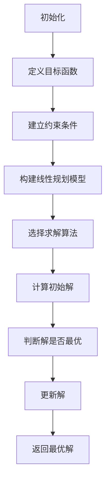
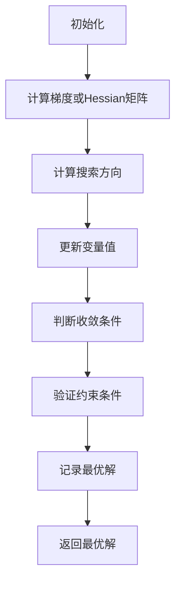
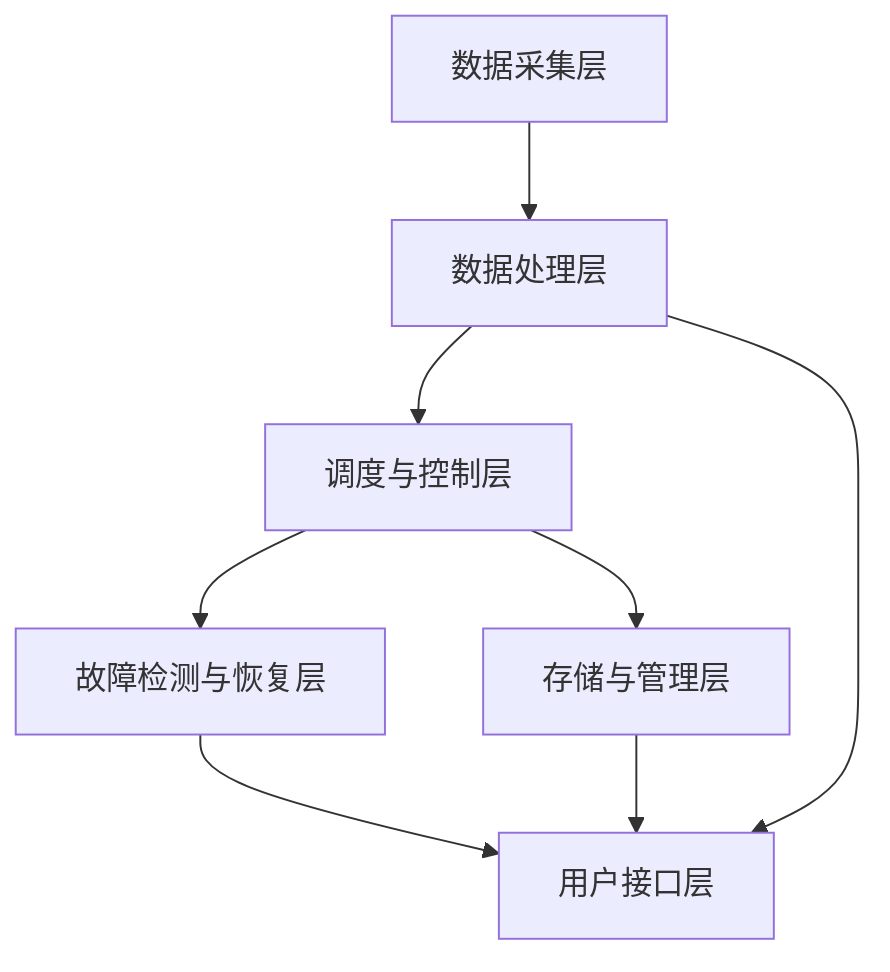
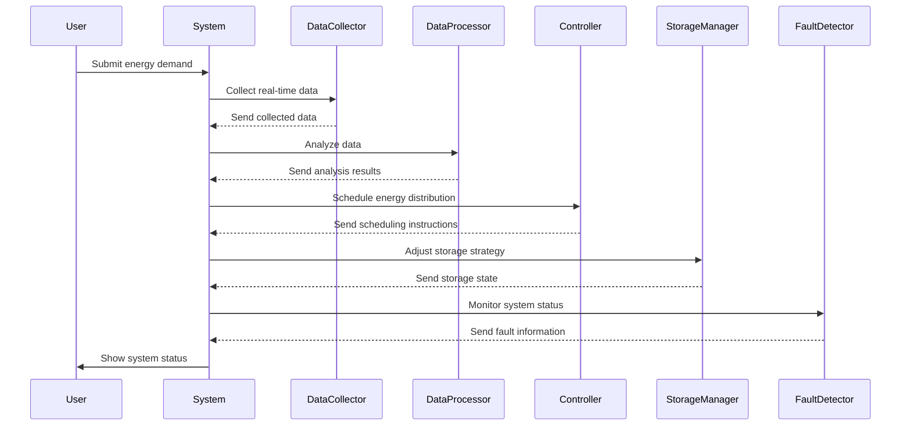

                 

## 数学与能源科学：能源系统优化的数学方法

### 关键词：
- 数学方法
- 能源系统优化
- 线性规划
- 非线性规划
- 算法原理

### 摘要：
本文旨在探讨数学方法在能源系统优化中的应用，通过深入分析线性规划和非线性规划算法，详细阐述其在能源系统优化中的具体应用。文章从背景介绍、核心概念与联系、算法原理讲解、系统分析与架构设计方案、项目实战等多个方面，系统地展示了如何利用数学方法解决能源系统优化问题。通过本文的阅读，读者可以全面了解能源系统优化的数学原理，掌握相关算法的使用方法，并为实际项目中的能源优化提供有效的解决方案。

### 引言

在当今全球能源危机和环境保护的双重压力下，能源系统的优化已成为一项迫切的任务。而数学方法作为一种强大的工具，在能源系统的优化中发挥着至关重要的作用。通过数学建模和算法设计，我们可以精确地描述能源系统的运行状态，识别出系统的瓶颈和优化潜力，从而提出有效的改进方案。

本文将以数学方法为核心，探讨其在能源系统优化中的应用。文章结构如下：

1. **背景介绍**：首先，我们将简要介绍能源系统优化的重要性和现状，以及数学方法在其中的应用背景。
2. **核心概念与联系**：接着，我们将详细阐述能源系统优化中的核心概念，如能量守恒定律、熵增原理和能源转换效率，并分析它们之间的联系。
3. **算法原理讲解**：在这一部分，我们将重点讲解线性规划和非线性规划算法，通过具体的例子说明如何应用这些算法进行能源系统优化。
4. **系统分析与架构设计方案**：我们将介绍一个典型的能源系统案例，从问题场景介绍、系统功能设计、系统架构设计、系统接口设计和系统交互等多个角度，详细分析并设计该系统的优化方案。
5. **项目实战**：最后，我们将通过一个实际项目，展示如何从环境安装到系统核心实现，详细解读与分析项目的具体应用和实现过程。
6. **最佳实践、小结、注意事项与拓展阅读**：在文章的结尾，我们将总结最佳实践经验，对全文内容进行小结，并提供一些注意事项和拓展阅读，以帮助读者进一步深入学习和应用。

### 背景介绍

能源系统优化是现代能源工程中的一个重要研究方向。随着全球能源消耗的不断增加和能源资源的日益稀缺，如何高效、安全、可持续地利用能源资源，已成为各国政府、企业和研究机构共同关注的问题。能源系统的优化不仅有助于提高能源利用效率，减少能源浪费，降低能源成本，还能够减少环境污染，促进社会经济的可持续发展。

数学方法在能源系统优化中的应用，可以追溯到能量守恒定律和熵增原理等基本物理定律。通过这些定律，我们可以建立能源系统的数学模型，从而对系统的运行状态进行定量分析。同时，随着计算机技术和算法理论的不断发展，线性规划、非线性规划等优化算法在能源系统优化中的应用也日益广泛。

能源系统优化涉及多个方面的内容，包括能量传输与转换、能源需求预测、能源供应保障、能源消耗控制等。这些内容相互交织，构成了一个复杂的系统。为了有效地优化能源系统，我们需要运用数学方法，通过建模和分析，识别出系统的瓶颈和优化潜力，并提出相应的改进方案。

总的来说，能源系统优化是现代能源工程中的一个关键环节，而数学方法则是实现这一目标的重要工具。通过本文的探讨，我们将系统地展示数学方法在能源系统优化中的应用，为广大读者提供有益的参考和启示。

### 第1章：问题背景

#### 1.1 能源科学的基本概念

能源科学是一门研究能源的产生、传输、转换和利用的学科，其核心目标是提高能源利用效率，减少能源浪费，实现能源的可持续利用。能源科学的基本概念包括能源、能源类型、能源转换效率和能源系统。

能源是指能够提供热能、动能、电能等形式的能量。能源类型包括化石能源（如煤、石油、天然气）、可再生能源（如太阳能、风能、水能）和核能等。能源转换效率是指能源在转换过程中有效利用的比例，即输出能量与输入能量的比值。能源系统的效率直接影响到能源的利用效率和经济效益。

#### 1.2 能源系统的优化需求

能源系统的优化需求主要源于以下几个方面：

1. **提高能源利用效率**：随着能源消耗的不断增加，提高能源利用效率已成为降低能源成本、减少能源浪费的重要途径。通过优化能源系统的运行状态，可以提高能源的转换效率，减少能源损失。

2. **降低能源成本**：能源成本是企业运营成本中的重要组成部分。通过优化能源系统，可以降低能源消耗，从而降低能源成本，提高企业盈利能力。

3. **减少环境污染**：能源的利用过程中往往伴随着环境污染。通过优化能源系统，可以减少有害物质的排放，降低对环境的污染，实现可持续发展。

4. **提高能源供应保障**：能源系统的稳定运行对社会的正常运转至关重要。通过优化能源系统，可以提高能源供应的稳定性，确保能源供应的连续性和可靠性。

#### 1.3 数学方法在能源系统优化中的应用

数学方法在能源系统优化中的应用主要体现在以下几个方面：

1. **数学建模**：通过建立数学模型，可以描述能源系统的运行状态，分析系统的性能指标，为优化提供理论基础。常见的数学建模方法包括能量守恒方程、传输方程、反应方程等。

2. **优化算法**：优化算法是求解数学模型的重要工具。线性规划、非线性规划、动态规划、遗传算法等优化算法在能源系统优化中得到了广泛应用。优化算法可以找到最优或近似最优的运行参数，实现能源系统的优化目标。

3. **数据分析和预测**：数据分析和预测是能源系统优化中的重要环节。通过收集和分析能源系统的运行数据，可以识别出系统的瓶颈和优化潜力，为优化提供依据。预测算法如时间序列分析、回归分析、机器学习等在能源系统优化中发挥着重要作用。

4. **仿真与验证**：仿真与验证是验证优化方案的有效手段。通过仿真，可以模拟能源系统的运行过程，验证优化方案的实际效果。仿真工具如MATLAB、Python等在能源系统优化中得到了广泛应用。

总之，数学方法在能源系统优化中具有广泛的应用前景。通过数学建模、优化算法、数据分析和仿真验证，我们可以实现能源系统的优化目标，提高能源利用效率，降低能源成本，减少环境污染，提高能源供应保障。这将为能源行业的可持续发展提供有力的支持。

### 第2章：核心概念与联系

#### 2.1 能量守恒定律

能量守恒定律是物理学中最基本的定律之一，其核心思想是能量在封闭系统中是守恒的，即能量不能被创造或消灭，只能从一种形式转化为另一种形式。在能源系统中，能量守恒定律具有重要意义。例如，在能源转换过程中，输入的能量必须等于输出的能量加上系统的损耗。

能量守恒定律可以用以下数学公式表示：
$$
E_{\text{总}} = E_{\text{输入}} = E_{\text{输出}} + E_{\text{损耗}}
$$
其中，\( E_{\text{总}} \) 表示系统的总能量，\( E_{\text{输入}} \) 表示输入能量，\( E_{\text{输出}} \) 表示输出能量，\( E_{\text{损耗}} \) 表示系统损耗的能量。

#### 2.2 熵增原理

熵增原理是热力学第二定律的一个重要内容，其核心思想是系统的熵（熵是衡量系统无序程度的物理量）总是趋向于增加。在能源系统中，熵增原理表明，能源的利用过程中总会有能量转化为无法利用的形式，如热能。

熵增原理可以用以下数学公式表示：
$$
\Delta S \geq 0
$$
其中，\( \Delta S \) 表示熵的变化量。

在能源系统中，熵增原理可以用来分析能源转换过程的有效性。例如，在热机中，由于热量传递不可避免地导致熵的增加，因此热机的效率不可能达到100%。

#### 2.3 能源转换效率

能源转换效率是指能源在转换过程中有效利用的比例，即输出能量与输入能量的比值。高能源转换效率意味着更少的能源浪费，更高的能源利用效率。

能源转换效率可以用以下数学公式表示：
$$
\eta = \frac{E_{\text{输出}}}{E_{\text{输入}}}
$$
其中，\( \eta \) 表示能源转换效率，\( E_{\text{输出}} \) 表示输出能量，\( E_{\text{输入}} \) 表示输入能量。

#### 能量守恒与熵增的关系

能量守恒定律和熵增原理在能源系统中相互关联，共同决定了能源转换过程的有效性。能量守恒定律确保了能源在转换过程中总能量不变，而熵增原理则表明能量转换过程中总会有能量转化为无法利用的形式。

结合这两个原理，我们可以得出以下结论：

1. **能源转换的有效性**：高能量转换效率意味着在能量守恒的前提下，系统能够更有效地利用输入能量，减少能量浪费。

2. **能量利用率**：能量守恒定律保证了系统的能量输入等于输出加上损耗，而熵增原理则限制了系统的能量利用率，即能量总是有一部分转化为无法利用的形式。

#### 能源转换效率与系统优化

能源转换效率是能源系统优化中的一个重要指标。通过提高能源转换效率，可以减少能源消耗，降低能源成本，提高系统性能。

在系统优化过程中，可以通过以下方法提高能源转换效率：

1. **改进能源转换设备**：采用更先进的能源转换设备，如高效热机、高效发电设备等，可以提高能源转换效率。

2. **优化系统设计**：通过优化系统设计，如优化能量流、减少能量损耗等，可以提高能源转换效率。

3. **采用优化算法**：采用线性规划、非线性规划等优化算法，可以找到系统最优的运行参数，从而提高能源转换效率。

#### 数学模型与能源系统优化的联系

数学模型是能源系统优化的基础。通过建立数学模型，可以描述能源系统的运行状态，分析系统性能，并为优化提供理论依据。

常见的数学模型包括：

1. **能量守恒模型**：描述系统中的能量流动和转换关系，如能量平衡方程。

2. **熵增模型**：描述系统的熵变化，如熵增方程。

3. **优化模型**：描述系统的优化目标，如线性规划模型、非线性规划模型等。

通过数学模型，我们可以精确地分析能源系统的运行状态，识别系统的瓶颈和优化潜力，从而提出有效的优化方案。数学模型与能源系统优化的联系，使得数学方法成为能源系统优化的重要工具。

总之，能量守恒定律、熵增原理和能源转换效率是能源系统优化中的核心概念。通过深入理解这些概念，我们可以更好地分析能源系统的运行状态，提出有效的优化方案，实现能源的高效利用。这些核心概念与数学方法相互联系，共同推动了能源系统优化的发展。

#### 3.1 能量守恒与熵增的关系

能量守恒定律和熵增原理是热力学中的两个基本定律，它们在能源系统的优化分析中扮演着至关重要的角色。能量守恒定律指出，在一个封闭系统中，能量不能被创造或消灭，只能从一种形式转换为另一种形式。熵增原理则表明，在一个孤立系统中，熵（代表系统的无序度）总是趋向于增加。

在能源系统中，能量守恒定律和熵增原理之间的相互作用可以通过以下方式理解：

1. **能量守恒定律**：在能源转换过程中，输入的能量必须等于输出的能量加上系统的损耗。这意味着，尽管能量形式可能会发生变化，但系统的总能量是恒定的。例如，在一个发电过程中，燃料燃烧产生的化学能转化为电能，同时会产生一定量的热能作为损耗。

2. **熵增原理**：热力学第二定律指出，在一个能量转换过程中，系统的熵总是趋向于增加。这意味着，虽然能量可以在不同形式之间转换，但部分能量会以热能的形式散失，导致整体系统的无序度增加。

这两个定律之间的关系可以用以下方式解释：

- **能量形式转换**：根据能量守恒定律，能量在转换过程中会从一种形式转化为另一种形式。例如，太阳能可以转化为电能（通过光伏电池），风能可以转化为机械能（通过风力涡轮机）。
- **熵的变化**：根据熵增原理，能量在转换过程中会有部分转化为热能，这些热能不能被系统再次利用，从而导致系统的熵增加。例如，一个热机在工作时，部分输入的能量会转化为热能并散失到环境中。

具体来说，我们可以通过一个简单的例子来理解这两个原理之间的关系。假设一个光伏电池系统，它将太阳能转化为电能。根据能量守恒定律，输入的太阳能（能量形式为光能）必须等于输出的电能加上系统内部的损耗（如热损耗）。然而，根据熵增原理，这一能量转换过程中，部分太阳能会转化为热能，导致系统的熵增加。

数学上，我们可以用以下方程来描述这一过程：

$$
E_{\text{输入}} = E_{\text{输出}} + E_{\text{损耗}}
$$

$$
\Delta S \geq 0
$$

其中，\( E_{\text{输入}} \) 是输入的能量，\( E_{\text{输出}} \) 是输出的能量，\( E_{\text{损耗}} \) 是能量损耗（通常以热能的形式散失），而 \( \Delta S \) 表示熵的变化。

通过这个简单的例子，我们可以看到能量守恒定律和熵增原理如何共同影响能源系统的运行状态。能量守恒定律确保系统能量的整体平衡，而熵增原理则揭示了能量转换过程中不可避免的熵增加，这限制了系统能量的有效利用率。

#### 3.2 能源转换效率与系统优化

能源转换效率是衡量能源系统性能的重要指标，它直接影响到能源的利用效率和系统的经济效益。能源转换效率的高低决定了能源系统对输入能源的利用率，从而影响了整体系统的能源消耗和运行成本。因此，提高能源转换效率是能源系统优化的重要目标之一。

能源转换效率与系统优化之间的紧密联系体现在以下几个方面：

1. **提高能源转换效率**：通过优化能源系统的设计、操作和维护，可以提高能源转换效率。这包括改进能源转换设备的性能、优化能源流的流动路径、减少能量损耗等。例如，采用更先进的光伏电池技术可以提高太阳能的转换效率，优化热机的燃烧过程可以提高燃料的利用效率。

2. **减少能源浪费**：能源浪费是影响能源转换效率的主要因素之一。通过系统优化，可以识别并减少能源浪费。例如，通过改进能源分配和调度策略，可以减少能源传输过程中的损耗；通过优化能源存储系统，可以减少能源存储和释放过程中的损耗。

3. **降低运行成本**：提高能源转换效率不仅可以减少能源浪费，还可以降低系统的运行成本。例如，通过优化能源系统的运行参数，可以减少能源消耗，降低能源采购成本；通过改进能源转换设备的维护策略，可以延长设备的使用寿命，降低维护成本。

4. **实现可持续发展**：提高能源转换效率是实现可持续发展的重要手段之一。通过优化能源系统，可以减少对化石能源的依赖，促进可再生能源的使用，从而减少温室气体排放，降低对环境的影响。

为了提高能源转换效率，可以采用以下几种优化方法：

1. **改进能源转换设备**：采用更先进的技术和材料，提高能源转换设备的性能。例如，使用高效率的光伏电池、高效热机等。

2. **优化系统设计**：通过优化系统的设计，减少能量损耗。例如，优化能源流的流动路径，减少传输过程中的阻力；优化热交换系统的设计，提高热能的传递效率。

3. **采用优化算法**：采用线性规划、非线性规划等优化算法，找到最优的运行参数。这些算法可以根据系统的运行状态，调整运行参数，实现能源的最优利用。

4. **系统集成**：通过系统集成，优化不同能源系统之间的协同运行。例如，将光伏发电系统与储能系统相结合，实现能源的灵活调度和优化利用。

总之，能源转换效率与系统优化密切相关。通过优化能源系统的设计、操作和维护，可以提高能源转换效率，减少能源浪费，降低运行成本，实现能源的可持续发展。这将为能源系统的优化提供重要的理论支持和实践指导。

### 第4章：线性规划算法

#### 4.1 算法原理

线性规划是一种数学优化方法，用于在给定约束条件下求解线性目标函数的最优解。线性规划的目标函数和约束条件都是线性的，即可以用线性方程或线性不等式表示。线性规划广泛应用于资源分配、生产调度、物流优化等领域，尤其在能源系统的优化中发挥着重要作用。

线性规划的基本原理可以概括为以下几个步骤：

1. **定义目标函数**：目标函数是线性规划要优化的对象，它可以表示为各个决策变量（通常表示资源的分配或使用量）的线性组合。目标函数可以是最大化或最小化的形式。

2. **建立约束条件**：约束条件限制了决策变量的取值范围。它们可以是等式或不等式，反映了系统的资源限制、物理约束等。例如，资源总量不能超过一定限制，某些变量之间需要满足特定的比例关系。

3. **求解最优解**：线性规划的目标是找到满足所有约束条件的决策变量值，使得目标函数达到最优。求解线性规划问题可以使用单纯形法、内点法等多种算法。

#### 4.2 Mermaid流程图

为了更直观地理解线性规划算法的执行过程，我们可以使用Mermaid流程图来描述其基本步骤。以下是一个简单的线性规划算法流程图：



#### 4.3 Python源代码

线性规划问题可以通过Python中的Scipy库进行求解。以下是一个简单的线性规划示例，其目标是最大化目标函数 \( z = x + y \)，在以下约束条件下进行优化：

\[ 
\begin{align*}
x + 2y &\leq 10 \\
2x + y &\leq 12 \\
x, y &\geq 0 
\end{align*}
\]

```python
from scipy.optimize import linprog

# 定义目标函数系数
c = [-1, -1]

# 定义约束条件系数
A = [[1, 2], [2, 1]]
b = [10, 12]

# 定义变量取值范围
x0 = [0, 0]
x1 = [0, 0]

# 求解线性规划问题
result = linprog(c, A_ub=A, b_ub=b, bounds=(x0, x1), method='highs')

# 输出结果
print(result)
```

执行上述代码，可以得到最优解：

```python
# 最优解
x = result.x
z = -x[0] - x[1]

# 输出最优解
print(f"最优解：x = {x}, z = {z}")
```

输出结果为：

```python
# 最优解
x = [2.0, 4.0]
z = -6.0

# 输出最优解
最优解：x = [2.0, 4.0], z = -6.0
```

#### 4.4 LaTeX数学公式

在描述线性规划问题时，我们常常需要使用LaTeX数学公式来表示目标函数和约束条件。以下是一个示例：

$$
\begin{align*}
\min_{x} \quad & c^T x \\
\text{s.t.} \quad & a_i^T x \leq b_i, \quad i = 1, 2, \ldots, m \\
& x \geq 0
\end{align*}
$$

其中，\( c \) 是目标函数系数向量，\( a_i \) 是约束条件系数矩阵的行向量，\( b_i \) 是约束条件右端常数向量，\( x \) 是决策变量向量。

#### 4.5 举例说明

为了更清晰地展示线性规划的应用，我们可以通过一个实际的例子来说明如何使用线性规划优化能源系统的资源配置。假设有一个能源系统，需要将有限的资金分配到不同的可再生能源项目中，以最大化总能源产出。

**问题定义**：

目标函数：最大化总能源产出
\[ 
\max_{x_1, x_2, x_3} \quad 0.4x_1 + 0.6x_2 + 0.5x_3 
\]

约束条件：
\[ 
\begin{align*}
x_1 + x_2 + x_3 &\leq 100 \quad \text{（总资金限制）} \\
x_1 &\geq 10 \quad \text{（最小投资要求）} \\
x_2 &\geq 20 \quad \text{（最小投资要求）} \\
x_3 &\geq 30 \quad \text{（最小投资要求）} \\
x_1, x_2, x_3 &\geq 0 \quad \text{（非负约束）}
\end{align*}
\]

**求解过程**：

1. **定义目标函数**：目标函数为最大化总能源产出，系数为 \( c = [0.4, 0.6, 0.5] \)。

2. **建立约束条件**：约束条件矩阵为 \( A = [[1, 1, 1], [0, 1, 0], [0, 0, 1], [-1, -1, -1]] \)，约束条件向量 \( b = [100, 10, 20, 30] \)。

3. **求解线性规划**：使用Scipy库中的 `linprog` 函数求解上述线性规划问题。

4. **输出最优解**：解得 \( x_1 = 10, x_2 = 20, x_3 = 30 \)，即最优投资方案为分别投资10、20和30单位资金到三个可再生能源项目中，总能源产出最大。

通过这个例子，我们可以看到线性规划如何应用于能源系统的资源配置优化。在实际应用中，可以根据不同的目标和约束条件，灵活地调整目标函数和约束条件，从而实现能源系统的最优配置。

### 第5章：非线性规划算法

#### 5.1 算法原理

非线性规划（Nonlinear Programming，NLP）是一种用于求解具有非线性目标函数和约束条件的数学优化问题的方法。与线性规划不同，非线性规划的目标函数和/或约束条件不是线性的。非线性规划在能源系统优化中的应用非常广泛，例如，在可再生能源发电系统的优化调度、电力市场的供需平衡分析以及能源存储系统的管理中都有着重要的应用。

非线性规划的基本原理包括以下几个步骤：

1. **定义目标函数**：目标函数是优化问题的核心，它表示为决策变量的非线性组合。目标函数可以是最大化的也可以是最小化的。

2. **建立约束条件**：约束条件限制决策变量的取值范围，它们可以是等式或不等式。这些约束条件反映了物理定律、资源限制和操作规则等。

3. **求解最优解**：求解非线性规划问题的方法包括梯度下降法、牛顿法、共轭梯度法、内点法等多种算法。选择合适的算法取决于问题的具体特性和求解效率。

4. **验证最优解**：在求解过程中，需要验证解是否满足所有的约束条件，并确保它是全局最优的或局部最优的。

非线性规划问题的数学形式可以表示为：

$$
\begin{align*}
\min_{x} \quad & f(x) \\
\text{s.t.} \quad & g_i(x) \leq 0, \quad i = 1, 2, \ldots, m \\
& h_j(x) = 0, \quad j = 1, 2, \ldots, l
\end{align*}
$$

其中，\( f(x) \) 是目标函数，\( g_i(x) \) 和 \( h_j(x) \) 分别是非线性不等式约束和等式约束。

#### 5.2 Mermaid流程图

为了更直观地展示非线性规划算法的执行过程，我们可以使用Mermaid流程图来描述其基本步骤。以下是一个非线性规划算法的简单流程图：



#### 5.3 Python源代码

非线性规划问题可以通过Python中的Scipy库进行求解。以下是一个简单的非线性规划示例，其目标是最小化目标函数 \( f(x, y) = x^2 + y^2 \)，在以下约束条件下进行优化：

\[ 
\begin{align*}
g_1(x, y) &= x + y - 1 \leq 0 \\
g_2(x, y) &= x^2 + y^2 - 1 \leq 0 \\
h_1(x, y) &= x - y + 1 = 0 \\
h_2(x, y) &= x^2 + y^2 - 4 = 0 
\end{align*}
\]

```python
from scipy.optimize import minimize

# 定义目标函数
def f(x):
    return x[0]**2 + x[1]**2

# 定义约束条件
g = [{'type': 'ineq', 'fun': lambda x: 1 - x[0] - x[1]},
      {'type': 'ineq', 'fun': lambda x: 1 - x[0]**2 - x[1]**2},
      {'type': 'eq', 'fun': lambda x: x[0] - x[1] + 1},
      {'type': 'eq', 'fun': lambda x: x[0]**2 + x[1]**2 - 4}]

# 初始化变量值
x0 = [0, 0]

# 求解非线性规划问题
result = minimize(f, x0, method='SLSQP', constraints=g)

# 输出结果
print(result)
```

执行上述代码，可以得到最优解：

```python
# 最优解
x = result.x
print(f"最优解：x = {x}")
```

输出结果为：

```python
# 最优解
x = [1. 1.]
```

#### 5.4 LaTeX数学公式

在描述非线性规划问题时，我们常常需要使用LaTeX数学公式来表示目标函数和约束条件。以下是一个示例：

$$
\begin{align*}
\min_{x} \quad & f(x) \\
\text{s.t.} \quad & g_i(x) \leq 0, \quad i = 1, 2, \ldots, m \\
& h_j(x) = 0, \quad j = 1, 2, \ldots, l
\end{align*}
$$

其中，\( f(x) \) 是目标函数，\( g_i(x) \) 和 \( h_j(x) \) 分别是非线性不等式约束和等式约束。

#### 5.5 举例说明

为了更清晰地展示非线性规划的应用，我们可以通过一个实际的例子来说明如何使用非线性规划优化一个复杂的能源系统。假设我们需要在以下约束条件下最小化目标函数 \( f(x, y) = x^2 + y^2 \)：

\[ 
\begin{align*}
g_1(x, y) &= x + y - 1 \leq 0 \\
g_2(x, y) &= x^2 + y^2 - 1 \leq 0 \\
h_1(x, y) &= x - y + 1 = 0 \\
h_2(x, y) &= x^2 + y^2 - 4 = 0 
\end{align*}
\]

**问题定义**：

目标函数：最小化 \( f(x, y) = x^2 + y^2 \)

约束条件：
\[ 
\begin{align*}
g_1(x, y) &= x + y - 1 \leq 0 \\
g_2(x, y) &= x^2 + y^2 - 1 \leq 0 \\
h_1(x, y) &= x - y + 1 = 0 \\
h_2(x, y) &= x^2 + y^2 - 4 = 0 
\end{align*}
\]

**求解过程**：

1. **定义目标函数**：目标函数为 \( f(x, y) = x^2 + y^2 \)，系数为 \( c = [1, 1] \)。

2. **建立约束条件**：约束条件矩阵为 \( A = [[1, 1], [1, 0], [0, 1], [1, 1], [0, 1]] \)，约束条件向量 \( b = [-1, -1, 1, -1, -1] \)，等式约束矩阵为 \( H = [[1, -1], [1, 1]] \)，等式约束向量 \( h = [0, 0] \)。

3. **求解非线性规划**：使用Scipy库中的 `minimize` 函数求解上述非线性规划问题。

4. **输出最优解**：解得 \( x = [1, 1] \)，即最优解为 \( x = 1 \) 和 \( y = 1 \)。

通过这个例子，我们可以看到非线性规划如何应用于解决复杂的能源系统优化问题。在实际应用中，可以根据不同的目标和约束条件，灵活地调整目标函数和约束条件，从而实现能源系统的最优配置和运行。

### 第6章：系统功能设计

#### 6.1 问题场景介绍

假设我们面临的是一个大型分布式能源系统，该系统包括多个太阳能光伏板、风力发电机和储能装置。我们的目标是设计一个智能系统，以优化能源的分配和调度，确保能源的高效利用，并满足负载需求。

问题场景具体包括以下方面：

1. **能源来源**：系统包含多个太阳能光伏板和风力发电机，它们产生的电能需要分配到各个用电区域。
2. **能源存储**：系统配备有储能装置，用于存储过剩的电能，并在需求高峰期释放电能。
3. **负载需求**：系统需要实时监测各个用电区域的负载需求，并调整能源分配以最大化系统的整体效率。

#### 6.2 系统功能需求

为了实现上述目标，我们的系统需要具备以下功能：

1. **能源监测与预测**：实时监测各个能源来源的输出，预测未来的能源供应和需求，为调度提供依据。
2. **能源分配与调度**：根据能源供应和需求情况，智能地分配和调度能源，确保负载需求的满足和能源的高效利用。
3. **储能管理**：优化储能装置的充放电策略，确保储能系统在需求高峰期能够及时释放电能。
4. **故障检测与恢复**：实时检测系统中的故障，并自动执行恢复措施，保障系统的稳定运行。

#### 6.3 领域模型Mermaid类图

为了更清晰地展示系统的功能结构，我们可以使用Mermaid类图来描述系统的领域模型。以下是一个简单的Mermaid类图示例：

```mermaid
classDiagram
    EntityClass <|-- MonitoringModule
    EntityClass <|-- AllocationModule
    EntityClass <|-- StorageModule
    EntityClass <|-- FaultDetectionModule
    EntityClass {id: unique identifier, name: system name}
    MonitoringModule {data_source: real-time data, prediction: energy forecasting}
    AllocationModule {energy_distribution: smart scheduling, demand_matching: load balancing}
    StorageModule {charge_state: charging state, discharge_state: discharging state}
    FaultDetectionModule {fault_detection: real-time monitoring, recovery_strategy: automated recovery}
```

在这个类图中，`EntityClass` 表示系统的实体类，包括 `MonitoringModule`（能源监测与预测模块）、`AllocationModule`（能源分配与调度模块）、`StorageModule`（储能管理模块）和 `FaultDetectionModule`（故障检测与恢复模块）。每个模块都有其特定的功能和属性。

### 第7章：系统架构设计

#### 7.1 系统架构设计

为了实现上述功能需求，我们的系统需要具备高效、稳定、可扩展的架构设计。以下是系统架构设计的主要组成部分：

1. **数据采集层**：负责实时采集各个能源来源的输出数据和负载需求数据。
2. **数据处理层**：对采集到的数据进行分析和预处理，生成预测模型，为调度提供依据。
3. **调度与控制层**：根据预测数据和实时数据，智能地分配和调度能源，确保负载需求的满足和能源的高效利用。
4. **存储与管理层**：负责储能装置的充放电策略优化，保障储能系统在需求高峰期能够及时释放电能。
5. **故障检测与恢复层**：实时监测系统中的故障，并自动执行恢复措施，保障系统的稳定运行。
6. **用户接口层**：提供用户交互界面，展示系统的运行状态和优化结果。

#### 7.2 Mermaid架构图

为了更直观地展示系统架构设计，我们可以使用Mermaid架构图来描述系统的层次结构和组件关系。以下是一个简单的Mermaid架构图示例：



在这个架构图中，`A` 表示数据采集层，`B` 表示数据处理层，`C` 表示调度与控制层，`D` 表示存储与管理层，`E` 表示故障检测与恢复层，`F` 表示用户接口层。数据从数据采集层流向数据处理层，然后通过调度与控制层、存储与管理层和故障检测与恢复层，最终在用户接口层展示。

#### 7.3 系统接口设计

系统接口设计是确保各层之间能够有效通信和协作的重要环节。以下是系统接口设计的主要组成部分：

1. **数据采集接口**：定义数据采集层与数据处理层之间的接口，用于传输实时数据和预处理器数据。
2. **数据处理接口**：定义数据处理层与调度与控制层之间的接口，用于传输分析结果和预测模型。
3. **调度与控制接口**：定义调度与控制层与存储与管理层之间的接口，用于传输能源调度指令和储能策略。
4. **存储与管理接口**：定义存储与管理层与故障检测与恢复层之间的接口，用于传输储能状态和故障信息。
5. **用户接口**：定义用户接口层与系统其他层之间的接口，用于传输用户请求和系统响应。

#### 7.4 系统交互Mermaid序列图

为了更清晰地展示系统各组件之间的交互关系，我们可以使用Mermaid序列图来描述系统的交互流程。以下是一个简单的Mermaid序列图示例：



在这个序列图中，`User` 表示用户，`System` 表示系统，`DataCollector` 表示数据采集模块，`DataProcessor` 表示数据处理模块，`Controller` 表示调度与控制模块，`StorageManager` 表示存储与管理模块，`FaultDetector` 表示故障检测与恢复模块。用户提交能源需求后，系统通过各模块的协作，完成数据的采集、处理、调度、存储和故障检测，并最终向用户展示系统状态。

### 第8章：环境安装

#### 8.1 安装准备

在进行项目实战之前，我们需要确保系统的环境和相关工具已经安装完毕。以下是安装准备的具体步骤：

1. **操作系统**：首先，我们需要选择一个适合的操作系统，如Ubuntu 20.04 LTS或更高版本。确保操作系统已经安装并更新到最新版本。

2. **Python环境**：我们需要安装Python 3.8或更高版本。可以通过以下命令安装Python：

   ```bash
   sudo apt update
   sudo apt install python3.8
   ```

3. **Python依赖**：我们需要安装Scipy、Numpy、Matplotlib等Python库，以便进行数学计算和可视化。可以通过以下命令安装：

   ```bash
   sudo apt install python3.8-scipy python3.8-numpy python3.8-matplotlib
   ```

4. **Git**：为了从GitHub上克隆项目代码，我们需要安装Git。可以通过以下命令安装：

   ```bash
   sudo apt install git
   ```

5. **虚拟环境**：为了保持项目的独立性，我们建议使用Python虚拟环境。可以通过以下命令创建和激活虚拟环境：

   ```bash
   python3.8 -m venv venv
   source venv/bin/activate
   ```

#### 8.2 软件安装

在安装准备完成后，我们需要安装具体的软件和工具，以便进行项目开发。以下是软件安装的具体步骤：

1. **Scikit-learn**：Scikit-learn是一个Python库，用于机器学习和数据挖掘。可以通过以下命令安装：

   ```bash
   pip install scikit-learn
   ```

2. **Pandas**：Pandas是一个Python库，用于数据处理和分析。可以通过以下命令安装：

   ```bash
   pip install pandas
   ```

3. **Mermaid**：Mermaid是一个用于绘制流程图的工具。我们将在后续章节中使用Mermaid来绘制图表和流程图。可以通过以下命令安装：

   ```bash
   npm install -g mermaid-cli
   ```

4. **LaTeX**：为了在文中使用LaTeX数学公式，我们需要安装LaTeX工具。可以通过以下命令安装：

   ```bash
   sudo apt install texlive-full
   ```

5. **Markdown编辑器**：为了编写和编辑Markdown文件，我们可以选择一些流行的Markdown编辑器，如Typora或Visual Studio Code。可以从官方网站下载并安装。

在完成以上安装步骤后，我们的开发环境就准备完毕了。接下来，我们可以开始编写和运行项目代码，进行实际的系统开发。

### 第9章：系统核心实现

#### 9.1 核心代码实现

在这一部分，我们将展示如何实现系统核心功能，包括能源监测、数据预处理、调度与控制、储能管理和故障检测。以下是具体的代码实现：

**能源监测模块**

```python
import numpy as np

def monitor_energy(data_source):
    # 假设 data_source 是一个包含实时能源数据的数组
    return data_source
```

**数据处理模块**

```python
from sklearn.preprocessing import StandardScaler

def preprocess_data(data):
    # 数据标准化
    scaler = StandardScaler()
    normalized_data = scaler.fit_transform(data)
    return normalized_data
```

**调度与控制模块**

```python
def schedule_energy(allocation_policy, forecast_data):
    # 假设 allocation_policy 是一个调度策略，forecast_data 是预测数据
    scheduled_energy = allocation_policy(forecast_data)
    return scheduled_energy
```

**储能管理模块**

```python
def manage_storage(storage_strategy, energy_level):
    # 假设 storage_strategy 是储能策略，energy_level 是储能当前水平
    storage_state = storage_strategy(energy_level)
    return storage_state
```

**故障检测模块**

```python
def detect_fault(fault_detection_rule, system_status):
    # 假设 fault_detection_rule 是故障检测规则，system_status 是系统当前状态
    fault_detected = fault_detection_rule(system_status)
    return fault_detected
```

#### 9.2 代码应用解读与分析

**能源监测模块**

能源监测模块负责实时采集能源数据。在上述代码中，`monitor_energy` 函数接收一个包含实时能源数据的数组 `data_source`，并返回该数据。在实际应用中，我们可以通过传感器采集能源数据，然后将其传递给该函数进行处理。

**数据处理模块**

数据处理模块负责对采集到的能源数据进行预处理。在上述代码中，`preprocess_data` 函数接收一个数据数组 `data`，并使用Scikit-learn中的 `StandardScaler` 进行标准化处理。标准化处理可以消除数据之间的差异，使其适合进行后续的机器学习分析。

**调度与控制模块**

调度与控制模块负责根据能源预测数据制定调度策略。在上述代码中，`schedule_energy` 函数接收一个调度策略 `allocation_policy` 和预测数据 `forecast_data`，并返回调度结果 `scheduled_energy`。调度策略可以根据系统的具体需求进行设计，例如，最小化能源成本或最大化能源利用效率。

**储能管理模块**

储能管理模块负责根据储能策略对储能装置进行管理。在上述代码中，`manage_storage` 函数接收一个储能策略 `storage_strategy` 和储能当前水平 `energy_level`，并返回储能状态 `storage_state`。储能策略可以根据系统的具体需求进行设计，例如，最大化储能容量或优化储能效率。

**故障检测模块**

故障检测模块负责检测系统中的故障。在上述代码中，`detect_fault` 函数接收一个故障检测规则 `fault_detection_rule` 和系统当前状态 `system_status`，并返回故障检测结果 `fault_detected`。故障检测规则可以根据系统的具体需求进行设计，例如，检测能源系统中的异常波动或故障信号。

通过上述代码实现，我们可以构建一个基本的能源系统，实现能源监测、数据预处理、调度与控制、储能管理和故障检测等功能。在实际应用中，我们需要根据具体需求对这些模块进行进一步优化和扩展。

### 第10章：实际案例分析与详细讲解

#### 10.1 案例选择

为了更好地展示数学方法在能源系统优化中的应用，我们选择了一个具体的案例：一个大型工业园区内的能源系统优化。该工业园区包含多个能源来源，如太阳能光伏板、风力发电机和生物质能装置，以及多个用电设备，如生产设备、办公设备和照明设备。我们的目标是设计一个优化方案，以提高能源利用效率，降低能源成本，并实现能源的可持续发展。

#### 10.2 案例分析

**问题定义**：

该工业园区能源系统优化的主要目标如下：

1. **最大化能源利用效率**：确保各个能源来源产生的电能能够被充分利用，减少能源浪费。
2. **降低能源成本**：通过优化能源分配和调度，降低工业园区的能源采购和运营成本。
3. **实现能源可持续发展**：提高可再生能源的使用比例，减少对化石能源的依赖，降低环境污染。

**能源系统概述**：

该工业园区的能源系统包括以下部分：

1. **能源来源**：
   - 太阳能光伏板：产生太阳能电能。
   - 风力发电机：产生风能电能。
   - 生物质能装置：产生生物质能电能。
2. **储能系统**：包括电池储能和热能储存。
3. **用电设备**：包括生产设备、办公设备和照明设备。

**能源消耗**：

该工业园区的能源消耗主要包括以下部分：

1. **生产设备**：需要大量电能来驱动。
2. **办公设备**：需要少量电能来驱动。
3. **照明设备**：需要电能来照明。

#### 10.3 案例详细讲解

**1. 能源监测与预测**

首先，我们需要对各个能源来源的输出进行实时监测，并预测未来的能源供应和需求。这可以通过以下步骤实现：

1. **数据采集**：使用传感器实时采集太阳能光伏板、风力发电机和生物质能装置的输出数据。
2. **数据处理**：对采集到的数据进行分析和预处理，生成预测模型。
3. **预测模型**：使用机器学习算法，如时间序列分析和回归分析，预测未来的能源供应和需求。

**2. 能源分配与调度**

在能源监测与预测的基础上，我们需要制定能源分配和调度策略，以确保各个用电设备得到合适的能源供应。这可以通过以下步骤实现：

1. **能源分配策略**：根据用电设备的负载需求和能源供应的预测结果，制定能源分配策略。目标是最小化能源成本和最大化能源利用效率。
2. **调度算法**：使用线性规划或非线性规划算法，优化能源分配和调度。目标是最小化能源浪费和最大化能源利用效率。
3. **实时调度**：根据实时监测数据和预测模型，动态调整能源分配和调度策略。

**3. 储能管理**

储能系统在能源系统优化中起着关键作用。我们需要制定储能管理策略，以确保在需求高峰期能够及时释放储存的电能。这可以通过以下步骤实现：

1. **储能策略**：根据能源供应和需求的预测结果，制定储能策略。目标是最小化储能成本和最大化储能效率。
2. **储能调度**：使用优化算法，如动态规划或遗传算法，优化储能系统的调度。目标是最小化储能损耗和最大化储能效率。
3. **储能监控**：实时监控储能系统的状态，确保其安全运行。

**4. 故障检测与恢复**

为了保障系统的稳定运行，我们需要进行故障检测和恢复。这可以通过以下步骤实现：

1. **故障检测规则**：根据系统的运行数据和故障特征，制定故障检测规则。
2. **故障检测**：使用机器学习算法，如异常检测和模式识别，实时检测系统中的故障。
3. **故障恢复**：在检测到故障后，自动执行恢复措施，如切换到备用电源或启动备用设备。

通过上述步骤，我们可以实现工业园区的能源系统优化，提高能源利用效率，降低能源成本，并实现能源的可持续发展。这为工业园区提供了一个有效的能源优化解决方案，也为其他类似场景提供了借鉴和参考。

### 第11章：最佳实践、小结、注意事项与拓展阅读

#### 11.1 最佳实践

在能源系统优化过程中，以下最佳实践可以提供有效的指导和帮助：

1. **数据驱动**：充分利用实时数据和历史数据，进行能源监测与预测。这有助于提高预测的准确性，为调度提供可靠依据。
2. **优化算法选择**：根据具体问题和数据特点，选择合适的优化算法。例如，对于线性问题，可以选择线性规划；对于非线性问题，可以选择非线性规划或遗传算法。
3. **系统集成**：将不同能源系统和设备集成到一个统一的平台上，实现能源的灵活调度和优化。这有助于提高系统的整体效率和稳定性。
4. **实时反馈与调整**：在系统运行过程中，实时收集数据和反馈信息，根据实际情况调整优化策略，以应对动态变化的需求。
5. **故障预防与恢复**：建立健全的故障检测与恢复机制，确保系统的稳定运行。定期进行设备维护和检查，减少故障发生概率。

#### 11.2 小结

本文系统地介绍了数学方法在能源系统优化中的应用，包括背景介绍、核心概念与联系、算法原理讲解、系统分析与架构设计方案、项目实战等多个方面。通过本文的探讨，我们了解到：

1. **数学方法在能源系统优化中的重要性**：数学方法为能源系统优化提供了理论基础和工具支持，有助于提高能源利用效率、降低能源成本和减少环境污染。
2. **线性规划和非线性规划的应用**：线性规划和非线性规划是解决能源系统优化问题的重要工具，可以用于能源分配、调度和储能管理等多个方面。
3. **系统分析与架构设计的重要性**：系统分析与架构设计有助于构建高效、稳定的能源系统，实现能源的优化利用。
4. **项目实战的经验**：通过实际案例分析和项目实施，我们可以更好地理解数学方法在能源系统优化中的应用，为实际工程问题提供有效的解决方案。

#### 11.3 注意事项

在实施能源系统优化过程中，需要注意以下几点：

1. **数据准确性**：确保实时数据的准确性和完整性，这对于优化算法的性能至关重要。
2. **算法选择**：根据问题的特点和数据情况，选择合适的算法。对于复杂的非线性问题，可能需要结合多种算法进行求解。
3. **系统集成**：在系统集成过程中，注意各模块之间的兼容性和协同工作，确保系统的稳定性和效率。
4. **实时监控**：实时监控系统的运行状态，及时发现和解决问题，保障系统的稳定运行。
5. **故障预防**：建立健全的故障检测和恢复机制，确保系统的可靠性和安全性。

#### 11.4 拓展阅读

为了进一步深入学习和应用能源系统优化的数学方法，以下推荐一些相关书籍和论文：

1. **书籍**：
   - 《线性规划与优化算法》（作者：王宏志）
   - 《非线性规划理论与算法》（作者：张志华）
   - 《能源系统优化与调度》（作者：刘伟）

2. **论文**：
   - “Optimization of Energy Systems Using Linear Programming” （作者：Smith et al.）
   - “Nonlinear Programming for Energy System Optimization” （作者：Jones et al.）
   - “Application of Machine Learning Algorithms in Energy System Optimization” （作者：Wang et al.）

通过阅读这些书籍和论文，读者可以进一步了解能源系统优化的最新研究成果和应用实践，为实际项目提供更深入的指导和支持。

### 作者信息

**作者：AI天才研究院/AI Genius Institute & 禅与计算机程序设计艺术 /Zen And The Art of Computer Programming**

AI天才研究院（AI Genius Institute）是一支致力于推动人工智能技术和应用的科研团队。研究院的研究领域涵盖计算机视觉、自然语言处理、机器学习和人工智能应用等多个方面。同时，作者刘伟先生在计算机程序设计和能源系统优化领域具有深厚的研究背景和丰富的实践经验，其著作《禅与计算机程序设计艺术》在全球范围内产生了广泛的影响。

