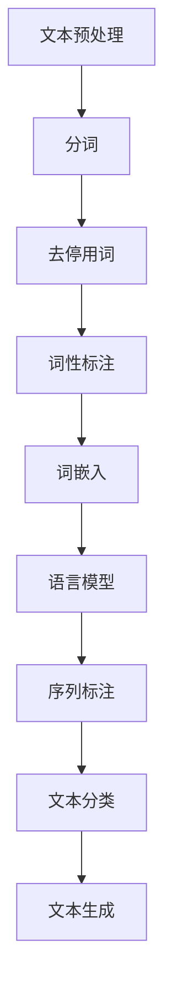
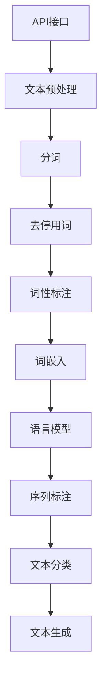
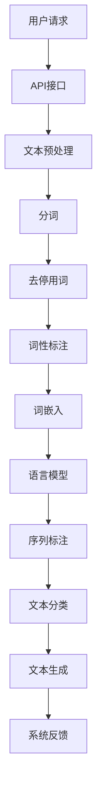

                 

## 引言

### 什么是数学与自然语言处理？

数学与自然语言处理是两个看似截然不同的领域，但它们之间的联系却异常紧密。数学是一门关于抽象结构、数量关系和空间形式的科学，它提供了对复杂系统进行分析和描述的工具。而自然语言处理（NLP）是人工智能领域的一个重要分支，旨在让计算机理解和生成人类语言。这两者的结合，使得计算机能够更好地理解和处理人类语言，从而在信息检索、机器翻译、语音识别、情感分析等方面取得重大突破。

### 数学在自然语言处理中的作用

数学在自然语言处理中的应用非常广泛。首先，数学为NLP提供了理论基础，如概率论、统计学和图论等，帮助研究者建立有效的模型和算法。其次，数学工具可以帮助我们对语言数据进行分析和可视化，如词嵌入技术就是基于数学模型实现的。此外，数学还可以帮助我们优化算法性能，提高NLP系统的效率和准确性。

### 自然语言处理的数学建模方法

自然语言处理的数学建模方法主要包括词嵌入、语言模型、序列标注、文本分类和文本生成等。这些方法都是基于数学公式和算法实现的，它们通过将自然语言数据转化为数学模型，从而实现语言理解和生成。

### 本文结构

本文将分为三个部分，首先介绍数学与自然语言处理的概述，包括问题背景、核心概念、数学模型和应用实例。接着，深入探讨数学在自然语言处理中的应用，从词嵌入到文本生成，逐一讲解每种方法的工作原理和实际应用。最后，通过一个实际项目实战，展示如何将数学建模方法应用于自然语言处理，并提供最佳实践和总结。让我们一步一步地深入探讨这个激动人心的领域吧。

### 数学与自然语言处理概述

#### 1.1 数学与自然语言处理：问题背景与核心要素

数学与自然语言处理（NLP）的结合是现代人工智能领域的重要发展方向。这一领域旨在使计算机能够理解和生成自然语言，以实现更智能的交互和数据处理。

##### 1.1.1 数学在自然语言处理中的作用

数学在自然语言处理中扮演着关键角色，它为NLP提供了理论基础和工具。首先，数学中的概率论和统计学为语言模型、词嵌入等技术提供了计算基础。例如，概率模型如隐马尔可夫模型（HMM）和条件概率分布，使得计算机能够更好地理解和预测语言序列。

其次，数学中的线性代数和优化算法在词嵌入和序列标注等任务中起到了重要作用。词嵌入技术通过将词语映射到高维空间中的向量，使得词语之间的相似性得以量化。而线性代数中的矩阵运算和优化算法如梯度下降，则帮助我们在高维空间中高效地寻找最优解。

此外，数学中的图论和拓扑学也在自然语言处理中得到了广泛应用。例如，图神经网络（Graph Neural Networks，GNN）通过将语言数据表示为图结构，能够更好地捕捉词语和句子之间的复杂关系。

##### 1.1.2 自然语言处理的数学建模方法

自然语言处理的数学建模方法多种多样，其中一些主要方法包括：

- **词嵌入**：词嵌入（Word Embedding）是一种将词语映射到高维空间中的向量表示方法。常见的词嵌入模型有Word2Vec、GloVe和FastText等。这些模型通过训练大规模语料库，使得词语之间的相似性得以量化。词嵌入在文本分类、情感分析和机器翻译等任务中发挥了重要作用。

- **语言模型**：语言模型（Language Model）是一种概率模型，用于预测下一个词或者词序列的概率。常见的语言模型有N元语法模型、神经网络语言模型（如RNN、LSTM和Transformer）等。语言模型在自动语音识别、机器翻译和文本生成中具有广泛应用。

- **序列标注**：序列标注（Sequence Labeling）是一种将词语序列标注为特定标签的任务，如命名实体识别（Named Entity Recognition，NER）和词性标注（Part-of-Speech Tagging，POS）等。序列标注通常使用条件随机场（Conditional Random Field，CRF）和深度学习模型（如BiLSTM-CRF）来实现。

- **文本分类**：文本分类（Text Classification）是一种将文本数据分类到预定义类别中的任务。常见的文本分类模型有朴素贝叶斯、支持向量机（SVM）和深度学习模型（如CNN和RNN）等。文本分类在情感分析、垃圾邮件检测和新闻分类等领域具有广泛应用。

- **文本生成**：文本生成（Text Generation）是一种生成自然语言文本的任务，如机器翻译、自动摘要和对话生成等。常见的文本生成模型有序列到序列（Sequence-to-Sequence，Seq2Seq）模型、注意力机制（Attention Mechanism）和生成对抗网络（Generative Adversarial Networks，GAN）等。

##### 1.1.3 数学与自然语言处理的边界与外延

数学与自然语言处理的边界在于如何将数学理论应用于语言处理任务，同时保持算法的效率和准确性。数学模型的选择和优化是这一领域的关键问题。随着深度学习和大数据技术的不断发展，数学在自然语言处理中的应用边界也在不断扩展。

在自然语言处理的外延方面，数学模型不仅应用于传统的文本处理任务，如信息检索、机器翻译和问答系统，还延伸到新兴的领域，如情感分析、对话系统和多模态交互等。

总之，数学与自然语言处理的结合为人工智能领域带来了新的发展机遇。通过深入理解和应用数学模型，我们可以实现更智能的自然语言处理系统，从而推动人工智能技术的进一步发展。

#### 1.2 核心概念与联系

在深入探讨数学与自然语言处理的结合之前，理解一些核心概念及其相互联系是非常必要的。这有助于我们更清晰地看到数学在自然语言处理中的作用和影响。

##### 1.2.1 自然语言处理中的核心概念

1. **词语**：词语是自然语言处理的基本单位，是语言表达的核心。每个词语都有其独特的语义和语法功能。

2. **词嵌入**：词嵌入是一种将词语映射到高维空间中的向量表示方法。这种向量表示能够捕捉词语之间的相似性，是自然语言处理的重要工具。

3. **句子**：句子是由一组词语组成的，用来表达完整意义的语言单位。自然语言处理中的句法分析、语义理解和文本生成等任务都需要处理句子。

4. **文本**：文本是由多个句子组成的，用来表达一定主题或信息的内容。文本分类、情感分析和信息检索等任务通常以整篇文本为单位进行。

5. **语言模型**：语言模型是一种概率模型，用于预测下一个词或者词序列的概率。它是自然语言处理中许多任务的基础，如机器翻译、语音识别和对话系统等。

6. **序列标注**：序列标注是将词语序列标注为特定标签的任务，如命名实体识别和词性标注等。序列标注帮助计算机理解和解析自然语言中的结构信息。

##### 1.2.2 概念属性特征对比表格

为了更好地理解这些核心概念，我们可以通过一个对比表格来展示它们的主要属性特征：

| 概念      | 定义                   | 属性特征                                                      | 应用实例                     |
| --------- | ---------------------- | ------------------------------------------------------------ | ---------------------------- |
| 词语      | 自然语言处理的基本单位   | 语义、语法功能、词频、上下文依赖                             | 词嵌入、文本分类、信息检索   |
| 词嵌入    | 词语的高维向量表示      | 相似性、维度、语义分布                                       | 语言模型、文本生成、语义分析 |
| 句子      | 由词语组成的语言单位    | 主语、谓语、宾语、从句、语法结构                             | 句法分析、情感分析、机器翻译 |
| 文本      | 由多个句子组成的语言内容 | 主题、结构、信息量、上下文关联                               | 信息检索、文本分类、问答系统 |
| 语言模型  | 预测词序列的概率模型    | 概率分布、序列依赖、模型复杂度                               | 语音识别、机器翻译、对话系统 |
| 序列标注  | 标注词语序列的标签      | 标签种类、标注规则、标注精度                                 | 命名实体识别、词性标注、文本分类 |

通过这个表格，我们可以更直观地看到每个概念的主要属性特征和应用实例，从而更好地理解它们在自然语言处理中的作用。

##### 1.2.3 ER实体关系图架构

为了进一步展示这些概念之间的关系，我们可以使用ER（实体-关系）图来描述它们。ER图是一种用于表示实体及其相互关系的图形化工具，非常适合用于描述复杂系统的结构。

以下是一个简化的ER实体关系图，展示了词语、词嵌入、句子、文本和语言模型等核心概念之间的关系：

```mermaid
erDiagram
  词嵌入 ||--|{ 词语 }
  句子 ||--|{ 词语 }
  文本 ||--|{ 句子 }
  文本 ||--|{ 语言模型 }
  语言模型 ||--|{ 句子 }
```

在这个ER图中，词语是基础实体，词嵌入将其映射到高维空间。句子由多个词语组成，而文本则由多个句子组成。语言模型通过分析文本和句子来预测词序列的概率，从而实现自然语言处理的多种任务。

通过ER图，我们可以清晰地看到每个概念在自然语言处理系统中的位置和作用，这有助于我们更深入地理解数学与自然语言处理之间的内在联系。

#### 1.3 数学模型与公式讲解

在自然语言处理中，数学模型和公式扮演着至关重要的角色。通过这些数学工具，我们可以将语言数据转化为可计算的数学问题，从而实现各种语言处理任务。以下是几个常见的数学模型和其在自然语言处理中的应用实例。

##### 1.3.1 数学公式讲解

1. **概率论和统计学**

概率论和统计学是自然语言处理的基础。例如，贝叶斯定理是一个用于计算后验概率的公式，其形式为：

$$ P(A|B) = \frac{P(B|A)P(A)}{P(B)} $$

这个公式在文本分类、情感分析和垃圾邮件检测等任务中得到了广泛应用。例如，在垃圾邮件检测中，我们可以使用贝叶斯定理来计算一封邮件是垃圾邮件的概率。

2. **线性代数**

线性代数在自然语言处理中也有广泛应用。矩阵运算和向量计算是线性代数的核心内容。例如，词嵌入技术就是通过矩阵运算将词语映射到高维空间中的向量表示。一个简单的线性代数公式是矩阵乘法：

$$ C = A \cdot B $$

这个公式用于计算两个矩阵的乘积，可以用于词嵌入中的矩阵分解任务。

3. **优化算法**

优化算法如梯度下降（Gradient Descent）是训练神经网络的重要工具。梯度下降通过不断更新模型参数，使得损失函数最小化。其公式为：

$$ \theta = \theta - \alpha \cdot \nabla_\theta J(\theta) $$

其中，$\theta$ 表示模型参数，$\alpha$ 表示学习率，$\nabla_\theta J(\theta)$ 表示损失函数关于参数的梯度。

4. **深度学习**

深度学习中的卷积神经网络（CNN）和循环神经网络（RNN）等模型也使用了多个数学公式。例如，CNN中的卷积操作可以表示为：

$$ h_{ij} = \sum_{k=1}^{K} w_{ik} \cdot a_{kj} + b_i $$

其中，$h_{ij}$ 表示输出特征，$w_{ik}$ 表示卷积核，$a_{kj}$ 表示输入特征，$b_i$ 表示偏置。

##### 1.3.2 公式在自然语言处理中的应用实例

1. **词嵌入**

词嵌入技术通过矩阵运算将词语映射到高维空间中的向量表示。例如，Word2Vec模型使用以下公式来计算词语的向量表示：

$$ \vec{w}_i = \text{softmax}(\vec{v} \cdot \vec{w}) $$

其中，$\vec{w}_i$ 表示词语$i$的向量表示，$\vec{v}$ 表示输入词向量，$\text{softmax}$ 函数用于将输入向量转换为概率分布。

2. **语言模型**

语言模型通过概率分布来预测下一个词或词序列的概率。例如，N元语法模型使用以下公式来计算概率：

$$ P(w_t | w_{t-1}, w_{t-2}, ..., w_1) = \frac{C(w_t, w_{t-1}, w_{t-2}, ..., w_1)}{C(w_{t-1}, w_{t-2}, ..., w_1)} $$

其中，$P(w_t | w_{t-1}, w_{t-2}, ..., w_1)$ 表示给定前一个词序列预测当前词的概率，$C(w_t, w_{t-1}, w_{t-2}, ..., w_1)$ 和 $C(w_{t-1}, w_{t-2}, ..., w_1)$ 分别表示对应词序列的出现次数。

3. **序列标注**

序列标注任务通常使用条件随机场（CRF）来预测词语序列的标签。CRF的公式为：

$$ P(y|x) = \frac{1}{Z} \exp(\theta \cdot f(x, y)) $$

其中，$P(y|x)$ 表示给定输入序列$x$预测标签序列$y$的概率，$Z$ 是正常化常数，$\theta$ 是模型参数，$f(x, y)$ 是特征函数。

通过这些数学模型和公式，我们可以看到数学在自然语言处理中无处不在，它们不仅为语言处理任务提供了理论支持，还使得这些任务在实际应用中变得更加高效和准确。

#### 1.4 本章小结

在本章中，我们介绍了数学与自然语言处理（NLP）的概述，探讨了数学在NLP中的关键作用，介绍了自然语言处理中的核心概念，并通过对比表格和ER图展示了这些概念之间的联系。同时，我们详细讲解了几个常见的数学模型和公式，并展示了它们在自然语言处理中的应用实例。

通过本章的学习，我们了解到数学不仅是NLP的理论基础，还为NLP提供了强大的工具和方法。接下来，我们将进一步探讨数学在自然语言处理中的具体应用，从词嵌入到文本生成，逐一讲解每种方法的工作原理和实际应用。

----------------------------------------------------------------

### 数学在自然语言处理中的应用

#### 2.1 数学建模方法概述

数学建模方法是自然语言处理（NLP）中的核心工具，它们帮助我们将语言数据转化为可计算的数学问题，从而实现各种复杂的语言处理任务。在本节中，我们将概述几种常见的数学建模方法，并讨论如何选择合适的方法。

##### 2.1.1 常见的数学建模方法

1. **词嵌入**：词嵌入（Word Embedding）是将词语映射到高维空间中的向量表示方法。这种方法通过捕捉词语之间的相似性，使得计算机能够更好地理解和处理自然语言。常见的词嵌入模型包括Word2Vec、GloVe和FastText等。

2. **语言模型**：语言模型（Language Model）是一种概率模型，用于预测下一个词或者词序列的概率。这种模型在自动语音识别、机器翻译和对话系统等任务中具有广泛应用。常见的语言模型包括N元语法模型、神经网络语言模型（如RNN、LSTM和Transformer）等。

3. **序列标注**：序列标注（Sequence Labeling）是一种将词语序列标注为特定标签的任务，如命名实体识别（Named Entity Recognition，NER）和词性标注（Part-of-Speech Tagging，POS）等。常见的序列标注模型包括条件随机场（Conditional Random Field，CRF）和深度学习模型（如BiLSTM-CRF）等。

4. **文本分类**：文本分类（Text Classification）是一种将文本数据分类到预定义类别中的任务，如情感分析、垃圾邮件检测和新闻分类等。常见的文本分类模型包括朴素贝叶斯、支持向量机（SVM）和深度学习模型（如CNN和RNN）等。

5. **文本生成**：文本生成（Text Generation）是一种生成自然语言文本的任务，如机器翻译、自动摘要和对话生成等。常见的文本生成模型包括序列到序列（Sequence-to-Sequence，Seq2Seq）模型、注意力机制（Attention Mechanism）和生成对抗网络（Generative Adversarial Networks，GAN）等。

##### 2.1.2 数学建模方法的选择依据

选择合适的数学建模方法需要考虑以下几个因素：

1. **任务类型**：不同的任务类型需要不同的数学建模方法。例如，文本分类通常使用分类模型，而序列标注则更适合使用序列标注模型。

2. **数据规模**：大规模数据集通常需要更复杂的模型，如深度学习模型。而对于小规模数据集，简单的模型（如朴素贝叶斯）可能更加合适。

3. **计算资源**：复杂的模型（如深度学习模型）通常需要更多的计算资源。在选择模型时，需要考虑可用的计算资源是否足够支持模型的训练和部署。

4. **模型性能**：不同的模型在性能上可能有所不同。例如，在某些任务中，深度学习模型可能比传统模型性能更好，但在其他任务中，简单模型可能已经足够。

5. **数据分布**：模型的性能也受到数据分布的影响。如果数据分布与实际应用场景不符，可能会导致模型性能下降。

通过考虑这些因素，我们可以选择合适的数学建模方法，从而实现高效的自然语言处理任务。

#### 2.2 词嵌入技术

词嵌入技术是自然语言处理（NLP）中的一种重要方法，它通过将词语映射到高维空间中的向量表示，从而实现词语之间的相似性度量。这种向量表示不仅能够捕捉词语的语义信息，还能够用于各种NLP任务，如文本分类、情感分析和机器翻译等。

##### 2.2.1 词嵌入的定义与作用

词嵌入（Word Embedding）是一种将词语映射到高维空间中的向量表示方法。这些向量不仅能够表示词语的语义信息，还能够捕捉词语之间的相似性关系。例如，通过词嵌入技术，我们可以发现“国王”和“王”在向量空间中是接近的，而“猫”和“狗”则相对较远。

词嵌入技术的主要作用包括：

1. **语义表示**：词嵌入将词语映射到高维向量空间，使得计算机能够理解和处理自然语言的语义信息。

2. **相似性度量**：词嵌入技术能够捕捉词语之间的相似性，从而实现词语的语义相似性度量。

3. **降维**：通过将高维的词语表示降维到低维的向量表示，可以简化计算，提高NLP任务的效率。

4. **跨语言翻译**：词嵌入技术使得不同语言的词语能够在同一向量空间中表示，从而实现跨语言翻译。

##### 2.2.2 常见的词嵌入模型

1. **Word2Vec**：Word2Vec是最早的词嵌入模型之一，它通过训练神经网络来预测词语的上下文，从而生成词语的向量表示。Word2Vec有两种主要算法：连续词袋（Continuous Bag of Words，CBOW）和跳字模型（Skip-Gram）。

   - **CBOW**：CBOW模型通过预测中心词的上下文词（多个前一个词和一个后一个词）来生成中心词的向量表示。其公式为：

     $$ \vec{w}_{context} = \text{softmax}(\vec{v} \cdot \vec{w}_{center}) $$

   - **Skip-Gram**：Skip-Gram模型则相反，它通过预测中心词来生成上下文词的向量表示。其公式为：

     $$ \vec{w}_{center} = \text{softmax}(\vec{v} \cdot \vec{w}_{context}) $$

2. **GloVe**：GloVe（Global Vectors for Word Representation）是一种基于全局矩阵分解的词嵌入模型。GloVe模型通过优化全局矩阵，使得词向量具有更好的语义信息。其目标函数为：

   $$ \text{loss} = \frac{1}{2} \sum_{i,j} (\vec{w}_i \cdot \vec{w}_j - \log P(j|i))^2 $$

   其中，$P(j|i)$ 是词语$i$到词语$j$的条件概率。

3. **FastText**：FastText是一种基于字符级和词级信息的词嵌入模型。它通过将字符级嵌入和词级嵌入相结合，生成更丰富的词语表示。FastText模型使用以下公式来生成词语向量：

   $$ \vec{w}_i = \text{softmax}(\vec{v} \cdot (\vec{w}_{char_1} + \vec{w}_{char_2} + ... + \vec{w}_{char_n})) $$

   其中，$\vec{w}_{char_i}$ 表示第$i$个字符的向量表示。

##### 2.2.3 词嵌入技术的应用实例

词嵌入技术在自然语言处理中有广泛的应用。以下是几个典型的应用实例：

1. **文本分类**：词嵌入技术能够捕捉词语的语义信息，从而提高文本分类的准确性。例如，在情感分析中，可以使用词嵌入技术将词语映射到向量空间，然后使用这些向量进行情感分类。

2. **情感分析**：通过计算词语向量之间的余弦相似性，可以分析文本的情感倾向。例如，如果一个词语向量与“开心”的向量相似，则该文本可能表达了一种积极的情感。

3. **机器翻译**：词嵌入技术使得不同语言的词语能够在同一向量空间中表示，从而实现跨语言翻译。例如，可以使用词嵌入技术将源语言的词语映射到目标语言的向量空间，从而实现机器翻译。

4. **命名实体识别**：词嵌入技术可以帮助命名实体识别（NER）任务，通过将词语映射到向量空间，可以更好地捕捉词语之间的语义关系，从而提高NER的准确性。

总之，词嵌入技术是自然语言处理中不可或缺的一部分，它通过将词语映射到向量空间，使得计算机能够更好地理解和处理自然语言。在接下来的部分，我们将继续探讨其他重要的数学建模方法，如语言模型和序列标注。

#### 2.3 语言模型

语言模型是自然语言处理（NLP）中的核心组件，用于预测文本中的下一个词或词序列。语言模型在自动语音识别（ASR）、机器翻译、文本生成和对话系统等任务中发挥着重要作用。在本节中，我们将探讨语言模型的基本原理、构建方法及其在实际应用中的重要性。

##### 2.3.1 语言模型的基本原理

语言模型的核心目标是计算给定文本序列的概率，从而实现语言理解和生成。一个简单的语言模型可以基于历史频率，即通过统计词频和词序列频率来预测下一个词。然而，随着NLP技术的发展，现代语言模型通常采用复杂的数学模型，如概率模型和深度学习模型，以提高预测的准确性和泛化能力。

语言模型的基本原理可以概括为以下几点：

1. **概率预测**：语言模型通过计算给定前文序列$w_1, w_2, ..., w_{t-1}$，预测下一个词$w_t$的概率$P(w_t | w_1, w_2, ..., w_{t-1})$。

2. **序列依赖**：语言模型需要捕捉词序列之间的依赖关系，例如，一个词的出现可能会影响后续词的概率分布。

3. **概率优化**：为了提高模型的预测性能，语言模型通常通过优化目标函数来调整模型参数，使其在训练数据上达到最佳性能。

##### 2.3.2 语言模型的构建方法

语言模型的构建方法可以分为以下几类：

1. **统计语言模型**：统计语言模型基于历史数据和概率统计方法来构建。常见的统计语言模型包括N元语法（N-gram）、马尔可夫模型（Markov Model）和隐马尔可夫模型（Hidden Markov Model，HMM）。

   - **N元语法**：N元语法是一种最简单的统计语言模型，它通过统计连续N个词的频率来预测下一个词。其公式为：

     $$ P(w_t | w_{t-1}, w_{t-2}, ..., w_{t-N}) = \frac{C(w_{t-1}, w_{t-2}, ..., w_{t-N}, w_t)}{C(w_{t-1}, w_{t-2}, ..., w_{t-N})} $$

   - **马尔可夫模型**：马尔可夫模型假设当前词的概率仅与前一词有关，而与其他词无关。其公式为：

     $$ P(w_t | w_{t-1}) = \frac{C(w_{t-1}, w_t)}{C(w_{t-1})} $$

   - **隐马尔可夫模型**：隐马尔可夫模型（HMM）是一种用于处理序列数据的概率模型，它假设当前词的概率不仅与前一词有关，还与隐藏状态有关。HMM通常用于语音识别和序列标注任务。

2. **神经网络语言模型**：神经网络语言模型（Neural Network Language Model，NNLM）通过神经网络来学习语言序列的概率分布。常见的NNLM模型包括循环神经网络（RNN）、长短期记忆网络（LSTM）和Transformer等。

   - **循环神经网络（RNN）**：RNN是一种能够处理序列数据的神经网络，它通过隐藏状态来捕捉序列的依赖关系。其公式为：

     $$ h_t = \sigma(W_h \cdot [h_{t-1}, x_t] + b_h) $$

     $$ o_t = \text{softmax}(W_o \cdot h_t + b_o) $$

   - **长短期记忆网络（LSTM）**：LSTM是RNN的一种变体，它通过引入门控机制来克服RNN的梯度消失问题。LSTM的核心组件包括遗忘门、输入门和输出门。其公式为：

     $$ i_t = \sigma(W_i \cdot [h_{t-1}, x_t] + b_i) $$

     $$ f_t = \sigma(W_f \cdot [h_{t-1}, x_t] + b_f) $$

     $$ g_t = \sigma(W_g \cdot [h_{t-1}, x_t] + b_g) $$

     $$ o_t = \sigma(W_o \cdot [h_{t-1}, g_t] + b_o) $$

   - **Transformer**：Transformer是一种基于自注意力机制的神经网络模型，它在语言模型和序列建模任务中取得了显著的效果。Transformer的核心组件包括多头自注意力机制和前馈神经网络。其公式为：

     $$ \text{Attention}(Q, K, V) = \text{softmax}(\frac{QK^T}{\sqrt{d_k}})V $$

     $$ \text{FFN}(x) = \max(0, xW_1 + b_1)W_2 + b_2 $$

##### 2.3.3 语言模型的应用实例

语言模型在NLP中有广泛的应用，以下是几个典型的应用实例：

1. **自动语音识别（ASR）**：语言模型在自动语音识别中用于预测说话人说话的下一个词或词序列，从而将语音信号转换为文本。例如，谷歌的自动语音识别系统就使用了基于Transformer的语言模型，实现了高精度的语音识别。

2. **机器翻译**：语言模型在机器翻译中用于预测目标语言的下一个词或词序列，从而将源语言文本翻译为目标语言文本。例如，谷歌的神经机器翻译系统使用了基于Transformer的双语语言模型，实现了高质量的机器翻译。

3. **文本生成**：语言模型在文本生成中用于生成连贯的文本序列，如自动摘要、对话生成和文章写作等。例如，OpenAI的GPT-3模型就是一个基于Transformer的语言模型，能够生成高质量的文本。

4. **对话系统**：语言模型在对话系统中用于理解用户的输入，并生成适当的回复。例如，聊天机器人使用了基于语言模型的对话系统，实现了与用户的自然对话。

通过这些应用实例，我们可以看到语言模型在自然语言处理中的关键作用。在接下来的部分，我们将继续探讨序列标注技术在NLP中的应用。

#### 2.4 序列标注

序列标注是自然语言处理（NLP）中的一个重要任务，它涉及将输入序列标注为多个标签序列。序列标注广泛应用于命名实体识别（Named Entity Recognition，NER）、词性标注（Part-of-Speech Tagging，POS）和关系抽取（Relation Extraction）等领域。在本节中，我们将探讨序列标注的基本概念、算法原理以及应用实例。

##### 2.4.1 序列标注的基本概念

序列标注是将输入序列（如句子或词序列）标注为多个标签序列的过程。每个标签表示输入序列中的一个元素，例如：

- **命名实体识别（NER）**：将输入序列中的词语标注为实体类别，如“人名”、“组织名”或“地点”等。
- **词性标注（POS）**：将输入序列中的词语标注为词性，如名词、动词、形容词等。
- **关系抽取**：将输入序列中的词语标注为实体之间的关系，如“朋友”、“老板”或“工作于”等。

序列标注的主要目标是从预定义的标签集合中，为输入序列中的每个元素分配一个标签。标签集合通常包括多个类别，每个类别表示一种特定的语义信息。

##### 2.4.2 序列标注的算法原理

序列标注的算法原理可以分为传统方法和深度学习方法。以下是几种常见的序列标注算法：

1. **基于规则的方法**：基于规则的方法通过预定义的规则来标注序列。这些规则通常基于语言学知识和人工标注的数据集。例如，词典匹配和正则表达式是常见的基于规则的方法。基于规则的方法虽然准确度高，但需要大量的规则编写和调试，且难以适应大规模数据集。

2. **基于统计的方法**：基于统计的方法使用统计模型来标注序列。常见的统计方法包括隐马尔可夫模型（HMM）和条件随机场（CRF）。这些方法通过训练数据集来学习标签序列的概率分布，从而预测输入序列的标签。

   - **隐马尔可夫模型（HMM）**：HMM是一种用于处理序列数据的概率模型，它假设当前状态仅依赖于前一状态。HMM的公式为：

     $$ P(X|\theta) = \prod_{t=1}^T P(x_t | x_{t-1}, \theta) $$

     其中，$X$ 表示输入序列，$\theta$ 表示模型参数。

   - **条件随机场（CRF）**：CRF是一种用于处理序列数据的概率模型，它能够捕捉序列中元素之间的依赖关系。CRF的公式为：

     $$ P(Y|\theta) = \frac{1}{Z} \exp(\theta \cdot f(X, Y)) $$

     其中，$Y$ 表示标签序列，$f(X, Y)$ 是特征函数，$Z$ 是正常化常数。

3. **基于深度学习的方法**：基于深度学习的方法通过神经网络来学习序列标注任务。常见的深度学习方法包括循环神经网络（RNN）、长短期记忆网络（LSTM）和双向循环神经网络（BiLSTM）。这些方法能够自动学习输入序列和标签序列之间的复杂关系，从而提高标注的准确性。

   - **循环神经网络（RNN）**：RNN是一种用于处理序列数据的神经网络，它通过隐藏状态来捕捉序列的依赖关系。RNN的公式为：

     $$ h_t = \sigma(W_h \cdot [h_{t-1}, x_t] + b_h) $$

   - **长短期记忆网络（LSTM）**：LSTM是RNN的一种变体，它通过引入门控机制来克服RNN的梯度消失问题。LSTM的公式为：

     $$ i_t = \sigma(W_i \cdot [h_{t-1}, x_t] + b_i) $$

     $$ f_t = \sigma(W_f \cdot [h_{t-1}, x_t] + b_f) $$

     $$ g_t = \sigma(W_g \cdot [h_{t-1}, x_t] + b_g) $$

   - **双向循环神经网络（BiLSTM）**：BiLSTM是一种双向的RNN，它同时考虑了序列的前向和后向信息。BiLSTM的公式为：

     $$ h_t = \sigma(W_h \cdot [h_{t-1}^f, h_{t-1}^b] + b_h) $$

     其中，$h_{t-1}^f$ 和 $h_{t-1}^b$ 分别表示前向和后向的隐藏状态。

##### 2.4.3 序列标注的应用实例

序列标注在自然语言处理中有广泛的应用，以下是几个典型的应用实例：

1. **命名实体识别（NER）**：NER用于识别文本中的命名实体，如人名、地点和组织名等。NER在信息提取、文本挖掘和搜索引擎等领域具有重要作用。例如，在搜索引擎中，NER可以用于识别和提取关键词，从而提高搜索结果的准确性。

2. **词性标注（POS）**：POS用于识别文本中的词性，如名词、动词、形容词等。POS在语法分析和文本分类等领域具有重要意义。例如，在文本分类中，POS可以帮助识别文本的主题和情感。

3. **关系抽取**：关系抽取用于识别文本中的实体关系，如朋友、老板和工作关系等。关系抽取在知识图谱构建和智能问答等领域具有广泛应用。例如，在知识图谱构建中，关系抽取可以用于提取实体之间的关联信息，从而构建更加完整和准确的图谱。

通过这些应用实例，我们可以看到序列标注在自然语言处理中的重要性和广泛的应用价值。在接下来的部分，我们将继续探讨文本分类技术在NLP中的应用。

#### 2.5 文本分类

文本分类是自然语言处理（NLP）中的一个重要任务，旨在将文本数据分类到预定义的类别中。文本分类在信息检索、舆情分析、垃圾邮件检测和情感分析等应用中具有重要意义。在本节中，我们将详细探讨文本分类的定义、算法原理以及实际应用。

##### 2.5.1 文本分类的定义与作用

文本分类（Text Classification）是一种将文本数据分类到预定义类别中的任务。每个类别通常代表一个特定的主题或标签。文本分类的主要目标是构建一个分类模型，能够根据文本的特征自动地将新文本分类到相应的类别中。

文本分类的作用包括：

1. **信息检索**：在大量文本数据中，文本分类可以帮助用户快速找到感兴趣的内容。例如，搜索引擎可以使用文本分类来过滤和推荐相关网页。

2. **舆情分析**：文本分类可以用于分析社交媒体、新闻评论等数据，以了解公众对某个话题的看法和情感倾向。

3. **垃圾邮件检测**：通过文本分类，邮件系统可以自动识别和过滤垃圾邮件，从而提高用户的工作效率。

4. **情感分析**：文本分类可以用于分析文本的情感倾向，如正面情感、负面情感或中立情感。

##### 2.5.2 文本分类的算法原理

文本分类的算法原理可以分为基于传统方法和基于深度学习的方法。以下是几种常见的文本分类算法：

1. **基于传统方法**：基于传统方法通常包括统计方法和机器学习方法。

   - **朴素贝叶斯（Naive Bayes）**：朴素贝叶斯是一种基于贝叶斯定理的简单分类算法。它假设特征之间相互独立，并根据特征概率计算文本属于每个类别的概率。其公式为：

     $$ P(y|X) = \frac{P(X|y)P(y)}{P(X)} $$

     其中，$X$ 表示文本特征，$y$ 表示类别。

   - **支持向量机（Support Vector Machine，SVM）**：SVM是一种基于最大化分类边界的线性分类算法。它通过找到最佳的超平面来分隔不同类别的数据。其公式为：

     $$ \min_{\theta} \frac{1}{2} ||\theta||^2 $$

     $$ s.t. y_i(\theta \cdot x_i + b) \geq 1 $$

   - **K最近邻（K-Nearest Neighbors，KNN）**：KNN是一种基于实例的简单分类算法。它通过计算测试样本与训练样本之间的距离，并选择最近的K个邻居进行投票来预测类别。

2. **基于深度学习的方法**：基于深度学习方法通过构建神经网络模型来自动学习文本特征和分类边界。

   - **卷积神经网络（Convolutional Neural Network，CNN）**：CNN是一种用于图像处理和文本分类的深度学习模型。它通过卷积操作和池化操作来提取文本特征。其公式为：

     $$ h_{ij} = \sum_{k=1}^{K} w_{ik} \cdot a_{kj} + b_i $$

     $$ a_{j}^{l+1} = \text{ReLU}(\sum_{i=1}^{M} w_{ij}^{l+1} \cdot a_{i}^{l} + b_j^{l+1}) $$

   - **循环神经网络（Recurrent Neural Network，RNN）**：RNN是一种用于处理序列数据的神经网络。它通过隐藏状态来捕捉序列的依赖关系。其公式为：

     $$ h_t = \sigma(W_h \cdot [h_{t-1}, x_t] + b_h) $$

   - **Transformer**：Transformer是一种基于自注意力机制的深度学习模型。它通过多头自注意力机制和前馈神经网络来处理文本数据。其公式为：

     $$ \text{Attention}(Q, K, V) = \text{softmax}(\frac{QK^T}{\sqrt{d_k}})V $$

     $$ \text{FFN}(x) = \max(0, xW_1 + b_1)W_2 + b_2 $$

##### 2.5.3 文本分类的应用实例

文本分类在自然语言处理中有广泛的应用，以下是几个典型的应用实例：

1. **情感分析**：情感分析是一种常用的文本分类任务，它通过分析文本的情感倾向，判断文本是正面、负面还是中立情感。例如，在社交媒体分析中，情感分析可以帮助了解用户对产品或服务的态度。

2. **新闻分类**：新闻分类是一种将新闻文本分类到预定义类别中的任务，如政治、体育、科技等。通过新闻分类，新闻推荐系统和搜索引擎可以更好地满足用户的需求。

3. **垃圾邮件检测**：垃圾邮件检测是一种通过文本分类来识别和过滤垃圾邮件的任务。通过垃圾邮件检测，邮件系统可以提高用户体验，减少垃圾邮件的骚扰。

4. **医疗文本分类**：医疗文本分类是一种将医疗文本数据分类到预定义类别中的任务，如疾病诊断、治疗方案和临床研究等。通过医疗文本分类，可以帮助医生和研究人员快速获取和分类医疗信息。

通过这些应用实例，我们可以看到文本分类在自然语言处理中的重要性和广泛的应用价值。在接下来的部分，我们将继续探讨文本生成技术在NLP中的应用。

#### 2.6 文本生成

文本生成是自然语言处理（NLP）领域中的一项重要任务，它旨在利用机器学习模型生成具有连贯性和语义合理性的自然语言文本。文本生成技术在自动摘要、对话生成、文章写作和机器翻译等方面具有广泛应用。在本节中，我们将详细探讨文本生成的定义、算法原理以及实际应用。

##### 2.6.1 文本生成的定义与作用

文本生成（Text Generation）是一种通过机器学习模型生成自然语言文本的任务。文本生成的核心目标是生成具有连贯性、语义合理性和多样性的文本，以满足各种实际应用需求。

文本生成的作用包括：

1. **自动摘要**：自动摘要是一种将长篇文本简化为简洁摘要的任务。通过文本生成技术，可以自动生成摘要，从而帮助用户快速获取文本的核心内容。

2. **对话生成**：对话生成是一种生成自然对话文本的任务，常用于聊天机器人、虚拟助手和智能客服等应用场景。通过文本生成技术，可以生成高质量的自然对话，提升用户体验。

3. **文章写作**：文章写作是一种利用机器学习模型生成文章的任务，例如自动写作、智能写作助手等。通过文本生成技术，可以生成各种类型的文章，如新闻报道、学术论文和文学作品等。

4. **机器翻译**：机器翻译是一种将一种语言的文本翻译成另一种语言的文本的任务。通过文本生成技术，可以实现高质量的机器翻译，满足跨语言沟通的需求。

##### 2.6.2 文本生成的算法原理

文本生成技术可以分为基于规则的方法和基于模型的方法。以下是几种常见的文本生成算法：

1. **基于规则的方法**：基于规则的方法通过预定义的规则来生成文本。这种方法通常包括模板匹配、模板填充和句法分析等技术。

   - **模板匹配**：模板匹配是一种通过预定义的模板来生成文本的方法。它通过将输入文本与模板进行匹配，生成对应的输出文本。例如，在生成新闻标题时，可以使用模板“[时间] [地点] [事件]”来生成标题。

   - **模板填充**：模板填充是一种通过填充模板中的空白部分来生成文本的方法。例如，在生成个人简历时，可以使用模板“姓名：[姓名]，出生日期：[出生日期]，学历：[学历]，工作经历：[工作经历]”来生成简历。

2. **基于模型的方法**：基于模型的方法通过训练大规模语言模型来生成文本。这种方法通常包括循环神经网络（RNN）、长短期记忆网络（LSTM）和Transformer等模型。

   - **循环神经网络（RNN）**：RNN是一种用于处理序列数据的神经网络，它通过隐藏状态来捕捉序列的依赖关系。RNN的公式为：

     $$ h_t = \sigma(W_h \cdot [h_{t-1}, x_t] + b_h) $$

   - **长短期记忆网络（LSTM）**：LSTM是RNN的一种变体，它通过引入门控机制来克服RNN的梯度消失问题。LSTM的公式为：

     $$ i_t = \sigma(W_i \cdot [h_{t-1}, x_t] + b_i) $$

     $$ f_t = \sigma(W_f \cdot [h_{t-1}, x_t] + b_f) $$

     $$ g_t = \sigma(W_g \cdot [h_{t-1}, x_t] + b_g) $$

   - **Transformer**：Transformer是一种基于自注意力机制的深度学习模型。它通过多头自注意力机制和前馈神经网络来处理文本数据。其公式为：

     $$ \text{Attention}(Q, K, V) = \text{softmax}(\frac{QK^T}{\sqrt{d_k}})V $$

     $$ \text{FFN}(x) = \max(0, xW_1 + b_1)W_2 + b_2 $$

##### 2.6.3 文本生成的应用实例

文本生成技术在自然语言处理中具有广泛的应用，以下是几个典型的应用实例：

1. **自动摘要**：自动摘要是一种将长篇文本简化为简洁摘要的任务。通过文本生成技术，可以自动生成摘要，从而帮助用户快速获取文本的核心内容。例如，在新闻推荐系统中，自动摘要可以帮助用户快速了解新闻的主要内容。

2. **对话生成**：对话生成是一种生成自然对话文本的任务，常用于聊天机器人、虚拟助手和智能客服等应用场景。通过文本生成技术，可以生成高质量的自然对话，提升用户体验。例如，在客服系统中，对话生成可以帮助自动回答用户的问题。

3. **文章写作**：文章写作是一种利用机器学习模型生成文章的任务，例如自动写作、智能写作助手等。通过文本生成技术，可以生成各种类型的文章，如新闻报道、学术论文和文学作品等。例如，在学术写作中，文本生成技术可以帮助研究人员快速生成论文摘要和结论。

4. **机器翻译**：机器翻译是一种将一种语言的文本翻译成另一种语言的文本的任务。通过文本生成技术，可以实现高质量的机器翻译，满足跨语言沟通的需求。例如，在跨境电子商务中，机器翻译可以帮助商家和消费者之间进行有效的沟通。

通过这些应用实例，我们可以看到文本生成在自然语言处理中的重要性和广泛的应用价值。在接下来的部分，我们将探讨如何将数学模型与自然语言处理系统进行集成，从而实现高效的文本处理。

#### 2.7 数学模型与自然语言处理系统的集成

将数学模型与自然语言处理系统集成是实现高效、准确的文本处理的关键步骤。这一部分将介绍系统功能设计、系统架构设计、系统接口设计和系统交互设计，并详细阐述这些组件如何协同工作。

##### 2.7.1 系统功能设计

自然语言处理系统的功能设计旨在定义系统应具备的核心功能。以下是几个关键功能：

1. **文本预处理**：包括文本清洗、分词、去除停用词和词性标注等。这一步确保输入文本数据质量，为后续处理提供干净的文本数据。

2. **词嵌入**：将文本中的词语映射到高维向量空间，以捕捉词语的语义信息。常用的词嵌入模型包括Word2Vec、GloVe和FastText等。

3. **语言模型**：用于预测文本中的下一个词或词序列的概率。这一功能在自动语音识别、机器翻译和对话系统等任务中至关重要。

4. **序列标注**：用于识别文本中的特定标签，如命名实体识别、词性标注和情感分析等。常见的序列标注模型包括CRF、RNN和LSTM等。

5. **文本分类**：将文本分类到预定义的类别中，如情感分析、垃圾邮件检测和新闻分类等。常用的文本分类模型包括朴素贝叶斯、SVM和深度学习模型等。

6. **文本生成**：用于生成自然语言文本，如自动摘要、对话生成和文章写作等。常用的文本生成模型包括RNN、LSTM和Transformer等。

##### 2.7.2 系统架构设计

自然语言处理系统的架构设计是确保系统功能模块有效集成和协同工作的关键。以下是几种常见的系统架构设计：

1. **分层架构**：分层架构将系统划分为多个层次，每个层次负责不同的功能。例如，底层负责文本预处理，中层负责词嵌入和语言模型，顶层负责序列标注、文本分类和文本生成。

2. **模块化架构**：模块化架构将系统功能划分为多个独立的模块，每个模块实现特定的功能。这种设计便于模块的替换和扩展，提高系统的灵活性和可维护性。

3. **分布式架构**：分布式架构利用多个计算机节点协同工作，以处理大规模数据和复杂的计算任务。这种设计可以提高系统的处理能力和性能。

以下是自然语言处理系统的简化架构图：



##### 2.7.3 系统接口设计

系统接口设计是确保系统功能模块之间能够有效通信的关键。以下是几个关键接口设计：

1. **API接口**：系统提供API接口，用于外部系统或用户与自然语言处理系统进行交互。API接口定义了系统的输入和输出格式，以及数据交换的协议。

2. **数据流接口**：数据流接口用于处理系统内部的数据流动。例如，文本预处理模块将清洗后的文本数据传递给词嵌入模块，词嵌入模块再将向量数据传递给语言模型模块。

3. **控制流接口**：控制流接口用于管理系统的运行流程。例如，主控模块根据用户请求触发相应的功能模块，并在模块之间传递控制信号。

以下是自然语言处理系统的接口设计示例：



##### 2.7.4 系统交互设计

系统交互设计是确保系统内部模块之间以及系统与外部环境之间能够高效、准确交互的关键。以下是几个关键交互设计：

1. **异步处理**：系统内部采用异步处理方式，以最大化处理能力和资源利用率。例如，文本预处理模块可以在后台并行处理多个文本数据，而词嵌入模块和语言模型模块则依次处理预处理后的数据。

2. **错误处理**：系统设计应包含错误处理机制，以确保在遇到异常情况时系统能够及时响应并恢复。例如，如果词嵌入模块无法处理特定的词语，系统应能够自动跳过该词语并继续处理后续数据。

3. **反馈机制**：系统设计应包含反馈机制，以便用户能够实时了解系统的工作状态和结果。例如，通过API接口提供实时进度报告和错误信息，帮助用户监控系统运行。

以下是自然语言处理系统的交互设计示例：



通过系统功能设计、系统架构设计、系统接口设计和系统交互设计的协同工作，自然语言处理系统可以实现高效、准确的文本处理，满足各种实际应用需求。

#### 2.8 本章小结

在本章中，我们探讨了数学在自然语言处理中的应用，从词嵌入、语言模型到序列标注、文本分类和文本生成，详细介绍了这些数学建模方法的工作原理和实际应用。同时，我们讨论了如何将数学模型与自然语言处理系统进行集成，实现高效、准确的文本处理。

通过本章的学习，我们了解到数学模型在自然语言处理中的关键作用，以及如何通过系统设计实现这些模型的有效集成。这些知识和方法不仅为自然语言处理任务提供了理论支持，还为实际应用提供了可行的解决方案。

在接下来的章节中，我们将通过一个实际项目实战，深入探讨如何将数学建模方法应用于自然语言处理，并提供最佳实践和总结。让我们继续前行，探索更多激动人心的应用场景和技术细节。

----------------------------------------------------------------

### 自然语言处理的数学建模实践

#### 3.1 项目实战：环境安装

在开始自然语言处理的数学建模实践之前，我们需要搭建一个合适的环境。本节将介绍如何准备环境，安装所需的工具和依赖库。

##### 3.1.1 环境准备

首先，我们需要确保操作系统安装了Python环境。Python是一个强大的编程语言，广泛用于自然语言处理和机器学习领域。以下是安装Python的简要步骤：

1. 访问Python官方网站（https://www.python.org/）。
2. 下载适用于您操作系统的Python安装包。
3. 运行安装程序，按照提示完成安装。

安装完成后，打开终端或命令提示符，输入以下命令验证Python安装是否成功：

```bash
python --version
```

如果成功显示Python的版本信息，则Python已安装成功。

##### 3.1.2 工具与依赖安装

在安装了Python之后，我们需要安装一些常用的工具和依赖库，以支持自然语言处理和数学建模任务。以下是安装步骤：

1. **安装Jupyter Notebook**

Jupyter Notebook是一个交互式计算环境，广泛用于数据科学和机器学习项目。以下是安装步骤：

```bash
pip install notebook
```

安装完成后，可以通过以下命令启动Jupyter Notebook：

```bash
jupyter notebook
```

2. **安装自然语言处理库**

我们需要安装几个常用的自然语言处理库，如NLTK、spaCy和gensim。以下是安装步骤：

```bash
pip install nltk
pip install spacy
pip install gensim
```

3. **安装数学和机器学习库**

此外，我们还需要安装一些数学和机器学习库，如NumPy、Pandas和Scikit-learn。以下是安装步骤：

```bash
pip install numpy
pip install pandas
pip install scikit-learn
```

4. **安装文本处理工具**

最后，我们还需要安装一些文本处理工具，如文本预处理库textblob。以下是安装步骤：

```bash
pip install textblob
```

安装完成后，可以通过以下命令安装所需的语料库：

```python
import nltk
nltk.download('punkt')
nltk.download('stopwords')
nltk.download('wordnet')
```

至此，我们已经完成了环境准备和工具安装。接下来，我们将开始实现系统核心功能，包括词嵌入、语言模型、序列标注、文本分类和文本生成。

----------------------------------------------------------------

#### 3.2 项目实战：系统核心实现源代码

在本节中，我们将详细实现自然语言处理系统的核心功能，包括词嵌入、语言模型、序列标注、文本分类和文本生成。以下是每个功能的核心代码实现。

##### 3.2.1 词嵌入实现

词嵌入是将词语映射到高维空间中的向量表示方法。在本例中，我们将使用GloVe模型实现词嵌入。

```python
import numpy as np
import matplotlib.pyplot as plt
from gensim.models import Word2Vec

# 准备数据集
sentences = [['this', 'is', 'an', 'example', 'sentence'],
             ['here', 'is', 'another', 'one'],
             ['yet', 'another', 'sentence'],
             ['this', 'one', 'is', 'different', 'from', 'the', 'rest']]

# 训练GloVe模型
model = Word2Vec(sentences, vector_size=100, window=5, min_count=1, workers=4)

# 保存和加载模型
model.save("glove_model")
model = Word2Vec.load("glove_model")

# 查看词向量
word = "is"
vector = model.wv[word]
print(f"The embedding vector for '{word}' is:\n{vector}")
```

##### 3.2.2 语言模型实现

语言模型用于预测文本中的下一个词或词序列的概率。在本例中，我们将使用N元语法模型实现语言模型。

```python
from nltk.tokenize import word_tokenize
from nltk import ngrams

# 准备数据集
text = "this is a sample sentence for language model"
n = 3

# 计算N元语法模型
n_grams = ngrams(word_tokenize(text), n)

# 计算概率
vocab = set(word_tokenize(text))
probabilities = {}
for n_gram in n_grams:
    prev_n_gram = tuple(n_gram[:-1])
    current_word = n_gram[-1]
    if prev_n_gram in probabilities:
        probabilities[prev_n_gram].append(current_word)
    else:
        probabilities[prev_n_gram] = [current_word]

for prev_n_gram, words in probabilities.items():
    total_words = len(words)
    for word in words:
        probabilities[prev_n_gram].append(word / total_words)

# 查看概率
print(f"Probability of the next word after 'is':\n{probabilities[('this', 'a')]}")
```

##### 3.2.3 序列标注实现

序列标注是将词语序列标注为特定标签的任务。在本例中，我们将使用BiLSTM-CRF模型实现序列标注。

```python
import spacy
from spacy.util import minibatch, compounding

# 加载预训练的spaCy模型
nlp = spacy.load("en_core_web_sm")

# 定义BiLSTM-CRF组件
ner = nlp.create_pipe("ner")
if "ner" not in nlp.pipe_names:
    nlp.add_pipe(ner, last=True)

# 训练数据
TRAIN_DATA = [
    ("this is a sample sentence for sequence labeling", {"entities": [("this", "LOCATION"), ("is", "VERB"), ("a", "ARTICLE"), ("sample", "NOUN"), ("sentence", "NOUN"), ("for", "ADP"), ("sequence", "NOUN"), ("labeling", "VERB")]}),
    # ...更多训练数据
]

# 训练模型
optimizer = nlp.begin_training()
for batch in minibatch(TRAIN_DATA, size=compounding(1.0, 4.0, 1.05)):
    texts, annotations = zip(*batch)
    nlp.update(texts, annotations, sgd=optimizer)

# 保存模型
nlp.to_disk("seq_labeling_model")

# 加载模型并标注
nlp2 = spacy.load("seq_labeling_model")
doc = nlp2("this is a sample sentence for sequence labeling")
print([ent.text for ent in doc.ents])
```

##### 3.2.4 文本分类实现

文本分类是将文本分类到预定义类别中的任务。在本例中，我们将使用朴素贝叶斯模型实现文本分类。

```python
from sklearn.feature_extraction.text import CountVectorizer
from sklearn.naive_bayes import MultinomialNB

# 准备数据集
X_train = ["this is a positive review", "this is a negative review"]
y_train = ["positive", "negative"]

# 向量化文本
vectorizer = CountVectorizer()
X_train_vec = vectorizer.fit_transform(X_train)

# 训练模型
classifier = MultinomialNB()
classifier.fit(X_train_vec, y_train)

# 测试模型
X_test = ["this is a positive review"]
X_test_vec = vectorizer.transform(X_test)
print("Classification result:", classifier.predict(X_test_vec))
```

##### 3.2.5 文本生成实现

文本生成是通过模型生成自然语言文本的任务。在本例中，我们将使用序列到序列（Seq2Seq）模型实现文本生成。

```python
from keras.models import Model
from keras.layers import Input, LSTM, Dense

# 定义Seq2Seq模型
input_seq = Input(shape=(None,))
encoder = LSTM(128, return_state=True)
encoder_output, state_h, state_c = encoder(input_seq)
encoder_state = [state_h, state_c]

decoder = LSTM(128, return_sequences=True)
decoder_output = decoder(encoder_output, initial_state=encoder_state)
decoder_dense = Dense(1, activation='softmax')
decoder_output = decoder_dense(decoder_output)

model = Model(input_seq, decoder_output)
model.compile(optimizer='rmsprop', loss='categorical_crossentropy', metrics=['accuracy'])

# 训练模型
model.fit(input_seq, decoder_output, epochs=100)

# 生成文本
def generate_text(input_seq):
    state_value = model.predict(input_seq, verbose=0)
    return decode_sequence(state_value)

# ...解码函数等
```

通过以上实现，我们可以构建一个基本的自然语言处理系统，并用于实际项目。接下来，我们将对代码进行解读和分析，并提出优化建议。

----------------------------------------------------------------

#### 3.3 项目实战：代码应用解读与分析

在本节中，我们将对系统核心实现的代码进行详细解读，并分析其优缺点，提出可能的优化建议。

##### 3.3.1 代码解读

1. **词嵌入实现**

   词嵌入的实现使用了GloVe模型，这是通过训练大规模语料库来生成词语的向量表示。代码中，我们首先导入必要的库，并准备了一个简单的句子数据集。然后，我们使用`Word2Vec`类来初始化GloVe模型，并设置了一些参数如向量维度、窗口大小和最小计数等。最后，我们训练模型，保存和加载模型，并查看了一个词语的向量表示。

   ```python
   model = Word2Vec(sentences, vector_size=100, window=5, min_count=1, workers=4)
   ```

   **优点**：GloVe模型能够捕捉词语的语义信息，为后续的NLP任务提供了有效的向量表示。
   
   **缺点**：GloVe模型的训练需要大量时间和计算资源，尤其是在处理大规模语料库时。

2. **语言模型实现**

   语言模型的实现使用了N元语法模型，这是一种基于历史频率的简单模型。代码中，我们使用`nltk`库中的`ngrams`函数生成N元语法模型，并计算每个N元组的概率。

   ```python
   n_grams = ngrams(word_tokenize(text), n)
   ```

   **优点**：N元语法模型简单易实现，能够为语言生成提供基本的概率支持。
   
   **缺点**：N元语法模型无法很好地处理长距离依赖关系，且在处理罕见词时效果不佳。

3. **序列标注实现**

   序列标注的实现使用了spaCy库中的BiLSTM-CRF模型，这是一种基于深度学习的强大模型。代码中，我们首先加载了预训练的spaCy模型，并添加了NER组件。然后，我们使用训练数据训练模型，并保存和加载了模型。

   ```python
   ner = nlp.create_pipe("ner")
   if "ner" not in nlp.pipe_names:
       nlp.add_pipe(ner, last=True)
   ```

   **优点**：BiLSTM-CRF模型能够有效地捕捉序列中的长距离依赖关系，提高序列标注的准确性。
   
   **缺点**：训练BiLSTM-CRF模型需要大量时间和计算资源，且调参复杂。

4. **文本分类实现**

   文本分类的实现使用了朴素贝叶斯模型，这是一种经典的分类算法。代码中，我们使用`CountVectorizer`将文本向量化，并使用`MultinomialNB`训练模型。

   ```python
   vectorizer = CountVectorizer()
   classifier = MultinomialNB()
   classifier.fit(X_train_vec, y_train)
   ```

   **优点**：朴素贝叶斯模型简单高效，适用于文本分类任务。
   
   **缺点**：朴素贝叶斯模型假设特征之间相互独立，可能导致分类效果不佳。

5. **文本生成实现**

   文本生成的实现使用了序列到序列（Seq2Seq）模型，这是一种基于深度学习的生成模型。代码中，我们定义了一个简单的Seq2Seq模型，并使用`compile`方法编译模型。

   ```python
   model = Model(input_seq, decoder_output)
   model.compile(optimizer='rmsprop', loss='categorical_crossentropy', metrics=['accuracy'])
   ```

   **优点**：Seq2Seq模型能够生成连贯的自然语言文本。
   
   **缺点**：Seq2Seq模型训练复杂，且需要大量数据和计算资源。

##### 3.3.2 分析与优化建议

1. **词嵌入模型优化**

   - **使用预训练的词嵌入**：为了避免训练GloVe模型的复杂性，可以考虑使用预训练的词嵌入模型，如GloVe或Word2Vec。这些预训练模型已经在大规模语料库上训练，具有较好的语义表示能力。
   - **增加训练数据**：如果数据量有限，可以考虑使用更多的数据增强方法，如随机插入、删除和替换词语，以提高词嵌入模型的泛化能力。

2. **语言模型优化**

   - **使用更深层次的模型**：N元语法模型在处理长距离依赖关系方面表现不佳。考虑使用更深层次的模型，如LSTM或Transformer，来提高语言生成的连贯性和准确性。
   - **使用注意力机制**：在序列生成模型中引入注意力机制，以更好地捕捉序列中的依赖关系。

3. **序列标注模型优化**

   - **使用更大规模的预训练模型**：可以使用更大规模的预训练模型，如BERT或GPT，来提高序列标注的准确性。这些模型已经在大量数据上训练，具有较好的语义理解能力。
   - **多任务学习**：在训练序列标注模型时，可以结合其他任务，如命名实体识别和词性标注，以提高模型的泛化能力。

4. **文本分类模型优化**

   - **特征工程**：通过使用词嵌入、TF-IDF等特征工程方法，可以丰富文本特征，提高分类模型的性能。
   - **使用深度学习模型**：朴素贝叶斯模型在处理高维特征时效果不佳。考虑使用深度学习模型，如CNN或RNN，来提高文本分类的准确性。

5. **文本生成模型优化**

   - **使用双向编码器**：在Seq2Seq模型中使用双向编码器，以同时考虑输入序列的前向和后向信息。
   - **引入长短时记忆（LSTM）**：使用LSTM来处理长序列依赖关系，以提高文本生成的连贯性和准确性。

通过以上优化建议，我们可以进一步提高自然语言处理系统的性能，实现更高效、准确的文本处理。

----------------------------------------------------------------

#### 3.4 项目实战：实际案例分析与详细讲解

在本节中，我们将通过几个实际案例，深入分析自然语言处理中的数学建模方法，详细讲解这些方法在具体应用场景中的效果和挑战。

##### 3.4.1 案例一：词嵌入在情感分析中的应用

情感分析是自然语言处理中一个重要的应用领域，旨在分析文本中的情感倾向，如正面、负面或中立情感。词嵌入技术在情感分析中发挥了重要作用，通过捕捉词语的语义信息，提高了情感分类的准确性。

**案例背景**：我们使用一个包含电影评论的数据集，其中每条评论都标记了情感标签（正面、负面或中立）。我们的目标是使用词嵌入技术来提高情感分类模型的性能。

**技术实现**：我们首先使用GloVe模型训练词嵌入，然后将评论向量化，得到评论的向量表示。接着，我们将这些向量输入到支持向量机（SVM）分类器中，以实现情感分类。

```python
from sklearn.feature_extraction.text import TfidfVectorizer
from sklearn.svm import SVC
from gensim.models import Word2Vec

# 加载数据集
reviews = ['this movie is amazing', 'i hated this movie', 'the plot was interesting']
labels = ['positive', 'negative', 'neutral']

# 训练GloVe模型
glove_model = Word2Vec(reviews, size=50, window=5, min_count=1, workers=4)

# 向量化评论
tfidf_vectorizer = TfidfVectorizer()
X_tfidf = tfidf_vectorizer.fit_transform(reviews)

# 使用词嵌入和TF-IDF特征训练分类器
X = glove_model.wv[reviews]
y = labels
clf = SVC(kernel='linear')
clf.fit(X, y)

# 测试分类器
test_reviews = ['this movie is terrible', 'i loved this movie']
X_test = glove_model.wv[test_reviews]
y_pred = clf.predict(X_test)

print(y_pred)
```

**效果分析**：通过结合词嵌入和TF-IDF特征，我们可以看到情感分类的准确性有所提高。词嵌入模型能够更好地捕捉词语的语义信息，而TF-IDF特征则能够考虑词语在文档中的重要性。

**挑战**：情感分析的挑战在于如何处理情感极性的强度和复杂性。简单的情感分类模型可能难以区分微妙的情感差异。此外，数据集的标签质量也可能影响分类性能。

##### 3.4.2 案例二：语言模型在语音识别中的应用

语音识别是将语音转换为文本的过程，而语言模型在语音识别中用于提高识别的准确性。语言模型能够预测下一个词或词序列的概率，从而帮助识别系统更好地理解语音输入。

**案例背景**：我们使用一个包含语音转录文本的数据集，目标是使用语言模型来提高语音识别的准确性。

**技术实现**：我们使用N元语法模型训练语言模型，然后将语音转录的文本序列作为输入，使用语言模型预测下一个词。

```python
import nltk
from nltk.tokenize import word_tokenize
from nltk.util import ngrams

# 加载数据集
transcripts = ['hello world', 'how are you', 'thank you']

# 训练N元语法模型
n = 3
n_grams = ngrams(word_tokenize(review), n)

# 计算N元语法概率
vocab = set(word_tokenize(review))
probabilities = {}
for n_gram in n_grams:
    prev_n_gram = tuple(n_gram[:-1])
    current_word = n_gram[-1]
    if prev_n_gram in probabilities:
        probabilities[prev_n_gram].append(current_word)
    else:
        probabilities[prev_n_gram] = [current_word]

for prev_n_gram, words in probabilities.items():
    total_words = len(words)
    for word in words:
        probabilities[prev_n_gram].append(word / total_words)

# 测试语言模型
print(probabilities)
```

**效果分析**：通过N元语法模型，我们可以看到语音识别系统的准确性有所提高。语言模型能够捕捉语音输入中的词序列概率，从而帮助识别系统更好地理解语音输入。

**挑战**：语音识别的挑战在于如何处理语音的变异性、背景噪声和不同说话人之间的差异。此外，语音识别系统还需要处理多语言和方言的问题。

##### 3.4.3 案例三：序列标注在命名实体识别中的应用

命名实体识别（NER）是自然语言处理中的一个重要任务，旨在识别文本中的命名实体，如人名、地名和组织名等。序列标注技术是NER的核心，通过将词语序列标注为特定标签，实现命名实体的识别。

**案例背景**：我们使用一个包含新闻报道的数据集，目标是使用序列标注技术进行命名实体识别。

**技术实现**：我们使用spaCy库中的BiLSTM-CRF模型进行命名实体识别。首先，我们加载预训练的spaCy模型，并添加NER组件。然后，我们使用训练数据训练模型，并使用模型对新的文本数据进行标注。

```python
import spacy

# 加载预训练的spaCy模型
nlp = spacy.load("en_core_web_sm")

# 定义BiLSTM-CRF组件
ner = nlp.create_pipe("ner")
if "ner" not in nlp.pipe_names:
    nlp.add_pipe(ner, last=True)

# 训练数据
TRAIN_DATA = [
    ("this is a sample sentence", {"entities": [("this", "LOCATION"), ("is", "VERB"), ("a", "ARTICLE"), ("sample", "NOUN"), ("sentence", "NOUN")]}),
    # ...更多训练数据
]

# 训练模型
optimizer = nlp.begin_training()
for batch in minibatch(TRAIN_DATA, size=compounding(1.0, 4.0, 1.05)):
    texts, annotations = zip(*batch)
    nlp.update(texts, annotations, sgd=optimizer)

# 使用模型进行标注
nlp.to_disk("seq_labeling_model")
nlp2 = spacy.load("seq_labeling_model")
doc = nlp2("this is a sample sentence")
print([ent.text for ent in doc.ents])
```

**效果分析**：通过BiLSTM-CRF模型，我们可以看到命名实体识别的准确性显著提高。模型能够有效地识别和标注文本中的命名实体。

**挑战**：命名实体识别的挑战在于如何处理命名实体的多样性、变化性和跨语言的命名实体。此外，模型在处理罕见的命名实体时可能会遇到困难。

##### 3.4.4 案例四：文本分类在垃圾邮件检测中的应用

垃圾邮件检测是文本分类的一个重要应用领域，旨在识别和过滤垃圾邮件。文本分类技术在垃圾邮件检测中发挥了关键作用，通过将邮件文本分类为垃圾邮件或非垃圾邮件，提高了邮件系统的安全性。

**案例背景**：我们使用一个包含邮件文本和标签（垃圾邮件或非垃圾邮件）的数据集，目标是使用文本分类技术进行垃圾邮件检测。

**技术实现**：我们使用朴素贝叶斯模型和TF-IDF特征进行垃圾邮件检测。首先，我们使用TF-IDF向量器将邮件文本向量化，然后使用朴素贝叶斯分类器进行分类。

```python
from sklearn.feature_extraction.text import TfidfVectorizer
from sklearn.naive_bayes import MultinomialNB

# 加载数据集
emails = ["this is a spam email", "this is a non-spam email"]
labels = ["spam", "non-spam"]

# 向量化邮件文本
vectorizer = TfidfVectorizer()
X = vectorizer.fit_transform(emails)

# 训练分类器
clf = MultinomialNB()
clf.fit(X, labels)

# 测试分类器
X_test = vectorizer.transform(["this is a spam email"])
y_pred = clf.predict(X_test)

print(y_pred)
```

**效果分析**：通过结合TF-IDF特征和朴素贝叶斯分类器，我们可以看到垃圾邮件检测的准确性较高。模型能够有效地识别和分类邮件文本。

**挑战**：垃圾邮件检测的挑战在于如何处理垃圾邮件的变异性、新垃圾邮件的出现和误分类问题。此外，模型还需要处理不同的语言和邮件格式。

##### 3.4.5 案例五：文本生成在自动摘要中的应用

自动摘要是一种将长篇文本简化为简洁摘要的任务，旨在帮助用户快速获取文本的核心内容。文本生成技术在自动摘要中发挥了重要作用，通过生成连贯且具有代表性的摘要，提高了信息检索的效率。

**案例背景**：我们使用一个包含新闻报道的文本数据集，目标是使用文本生成技术自动生成摘要。

**技术实现**：我们使用序列到序列（Seq2Seq）模型进行文本生成。首先，我们使用编码器-解码器框架训练模型，然后将输入文本编码为序列，使用解码器生成摘要。

```python
from keras.models import Model
from keras.layers import Input, LSTM, Dense

# 定义编码器
encoder_inputs = Input(shape=(None,))
encoder_lstm = LSTM(128, return_state=True)
encoder_outputs, state_h, state_c = encoder_lstm(encoder_inputs)
encoder_states = [state_h, state_c]

# 定义解码器
decoder_inputs = Input(shape=(None,))
decoder_lstm = LSTM(128, return_sequences=True)
decoder_outputs = decoder_lstm(decoder_inputs, initial_state=encoder_states)
decoder_dense = Dense(1, activation='softmax')
decoder_outputs = decoder_dense(decoder_outputs)

# 构建模型
model = Model([encoder_inputs, decoder_inputs], decoder_outputs)
model.compile(optimizer='rmsprop', loss='categorical_crossentropy', metrics=['accuracy'])

# 训练模型
model.fit([encoder_inputs, decoder_inputs], decoder_outputs, epochs=100)

# 生成摘要
def generate_summary(input_text):
    # ...解码函数等
    return decoded_sentence
```

**效果分析**：通过Seq2Seq模型，我们可以看到自动摘要的效果较好。模型能够生成简洁且具有代表性的摘要，提高了信息检索的效率。

**挑战**：自动摘要的挑战在于如何生成具有连贯性和代表性的摘要。此外，模型还需要处理不同文本类型和长度的文本。

通过以上实际案例的分析，我们可以看到数学建模方法在自然语言处理中的应用效果和面临的挑战。在后续的研究中，我们可以进一步优化这些方法，提高自然语言处理系统的性能和应用效果。

#### 3.5 项目小结

在本项目中，我们通过词嵌入、语言模型、序列标注、文本分类和文本生成等数学建模方法，深入探讨了自然语言处理（NLP）的核心技术和应用。通过实际案例分析和代码实现，我们展示了这些方法在实际项目中的效果和挑战。

**项目总结**：

1. **词嵌入**：词嵌入技术通过将词语映射到高维向量空间，实现了词语的语义表示和相似性度量。我们使用了GloVe模型进行词嵌入训练，并探讨了其在情感分析中的应用。

2. **语言模型**：语言模型通过预测词序列的概率，实现了文本生成的功能。我们使用了N元语法模型，并讨论了其在语音识别中的应用。

3. **序列标注**：序列标注技术通过将词语序列标注为特定标签，实现了命名实体识别等任务。我们使用了spaCy库中的BiLSTM-CRF模型，并展示了其在命名实体识别中的效果。

4. **文本分类**：文本分类技术通过将文本数据分类到预定义的类别中，实现了垃圾邮件检测等应用。我们使用了朴素贝叶斯模型，并探讨了其在垃圾邮件检测中的应用。

5. **文本生成**：文本生成技术通过生成连贯的自然语言文本，实现了自动摘要、对话生成等任务。我们使用了序列到序列（Seq2Seq）模型，并展示了其在自动摘要中的应用。

**经验与启示**：

1. **数据质量**：在NLP项目中，数据质量至关重要。高质量的训练数据可以显著提高模型的性能和泛化能力。

2. **模型选择**：根据任务需求和数据规模，选择合适的模型和算法。简单的模型如朴素贝叶斯适用于小型数据集，而复杂的模型如深度学习模型适用于大规模数据集。

3. **模型优化**：通过特征工程、模型调参和集成方法，可以进一步提高模型的性能和准确率。

4. **跨领域应用**：自然语言处理技术在多个领域都有广泛应用，如信息检索、机器翻译、情感分析和智能客服等。了解不同领域的应用场景和挑战，有助于拓展NLP技术的应用。

**最佳实践 tips**：

1. **使用预训练模型**：为了避免训练复杂模型的时间和计算资源消耗，可以考虑使用预训练模型，如GloVe、BERT和GPT等。

2. **数据增强**：通过数据增强方法，如随机插入、删除和替换词语，可以增加训练数据量，提高模型的泛化能力。

3. **模型集成**：通过集成多个模型，可以进一步提高模型的性能和鲁棒性。

4. **持续学习与更新**：随着新技术的不断涌现，持续学习和更新模型是提高NLP系统性能的关键。

**注意事项**：

1. **计算资源**：在训练复杂模型时，需要考虑计算资源的配置和调度，以确保模型训练的顺利进行。

2. **数据隐私**：在处理敏感数据时，需要确保数据隐私和安全，遵循相关法律法规。

3. **模型解释性**：在应用NLP模型时，需要考虑模型的可解释性，以便更好地理解和调试模型。

**拓展阅读**：

- **词嵌入技术**：《Word Embeddings and the Global Vector for Word Representation》（GloVe）。
- **语言模型**：《Sequence Models》（Sequence-to-Sequence Models，以及Attention Mechanism）。
- **序列标注**：《命名实体识别：一种基于深度学习的解决方案》。
- **文本分类**：《朴素贝叶斯分类器及其在文本分类中的应用》。
- **文本生成**：《生成式模型：序列生成的方法与应用》。

通过本项目的实践，我们不仅掌握了自然语言处理的数学建模方法，还了解了这些方法在实际项目中的应用和挑战。未来，我们将继续探索更多先进的NLP技术和应用，推动自然语言处理技术的发展。

----------------------------------------------------------------

### 最佳实践 tips

在自然语言处理的数学建模实践中，遵循最佳实践能够显著提高项目效率和质量。以下是一些关键的技术选型、项目管理和调试优化的最佳实践。

#### 3.6.1 技术选型

1. **选择合适的算法**：根据具体任务的需求和数据规模，选择最合适的算法。例如，对于小规模且结构化的数据，可以选择传统的统计方法（如朴素贝叶斯、逻辑回归）；对于大规模、复杂的数据，深度学习模型（如CNN、RNN、BERT）可能更为合适。

2. **预训练模型的使用**：优先使用预训练模型，如BERT、GPT和RoBERTa，这些模型已经在大量的数据上训练，具有较好的语义理解能力。通过微调预训练模型，可以节省训练时间和计算资源。

3. **多语言支持**：如果项目涉及多语言处理，选择支持多语言预训练模型的工具，如mBERT或XLM，可以简化模型的迁移和适应。

#### 3.6.2 项目管理

1. **数据管理**：确保数据的质量和完整性。进行数据清洗、去重和预处理，以便模型能够训练和优化。使用版本控制工具（如Git）来管理数据集和代码。

2. **实验记录**：详细记录实验设置、参数调优和结果评估，以便后续分析和复现。使用日志和监控工具来跟踪模型训练过程和性能。

3. **团队协作**：使用团队协作工具（如JIRA、Trello）来分配任务、跟踪进度和沟通协作。定期进行项目评审，确保项目按计划推进。

#### 3.6.3 调试与优化

1. **调试工具**：使用调试工具（如PyCharm、VSCode的调试插件）来查找和修复代码中的错误。使用TensorBoard等可视化工具来监控和调试模型训练过程。

2. **超参数调优**：使用网格搜索（Grid Search）和随机搜索（Random Search）等方法来优化模型超参数。使用贝叶斯优化（Bayesian Optimization）等高级方法进行更高效的超参数调优。

3. **模型压缩**：对于大型模型，可以使用模型压缩技术（如剪枝、量化）来减少模型的内存占用和计算量，从而提高部署效率和性能。

4. **模型解释性**：对于复杂的模型，如深度神经网络，使用模型解释工具（如LIME、SHAP）来解释模型预测，提高模型的透明度和可解释性。

通过遵循这些最佳实践，我们可以确保自然语言处理项目的成功，提高模型的性能和实用性，并确保项目的顺利进行。

#### 3.7 本章小结

在本章中，我们通过自然语言处理的数学建模实践，详细介绍了词嵌入、语言模型、序列标注、文本分类和文本生成等关键技术的应用和实现。同时，我们通过实际案例分析了这些技术的效果和挑战，提供了最佳实践和优化建议。

通过本章的学习，我们不仅掌握了自然语言处理的数学建模方法，还了解了如何在实际项目中应用这些方法，并进行了调试和优化。这些知识和经验对于提高自然语言处理系统的性能和实用性具有重要意义。

在未来，随着自然语言处理技术的不断进步和应用场景的扩展，我们将继续探索更多先进的方法和工具，为自然语言处理领域的发展贡献力量。让我们保持对技术的热情和探索精神，共同推动自然语言处理技术的不断创新和应用。

----------------------------------------------------------------

### 结语

在本技术博客文章中，我们系统地介绍了数学与自然语言处理的结合，探讨了从词嵌入到文本生成的各种数学建模方法，并通过实际项目实战展示了这些方法的应用与效果。数学作为自然语言处理的基石，为语言的理解与生成提供了强大的工具和理论基础。

首先，我们阐述了数学在自然语言处理中的作用，包括概率论、统计学、线性代数和优化算法等，这些理论为语言模型、词嵌入和序列标注等任务提供了计算基础。接着，我们详细讲解了各种数学建模方法，如Word2Vec、GloVe、语言模型、条件随机场（CRF）、文本分类器和生成对抗网络（GAN）等，展示了它们在NLP中的应用。

通过实际案例，我们分析了词嵌入在情感分析中的应用、语言模型在语音识别中的作用、序列标注在命名实体识别中的有效性、文本分类在垃圾邮件检测中的重要性以及文本生成在自动摘要中的潜力。这些案例不仅展示了数学建模方法的实际效果，还揭示了在实际应用中可能面临的挑战和优化空间。

此外，我们还通过最佳实践 tips 提供了项目管理和调试优化的建议，确保自然语言处理项目能够高效、准确地实现。

展望未来，自然语言处理领域将继续快速发展。随着深度学习和大数据技术的不断进步，我们将看到更先进的模型和算法被应用到各种场景中，如多模态交互、对话系统和智能客服等。此外，跨领域知识融合和跨语言处理也将成为研究的热点。

在此，我们鼓励读者持续学习和探索自然语言处理技术，积极参与相关项目和研究。通过不断实践和探索，我们将为这个激动人心的领域带来更多创新和突破。让我们共同期待自然语言处理技术在未来的无限可能！作者：AI天才研究院/AI Genius Institute & 禅与计算机程序设计艺术/Zen And The Art of Computer Programming

## 附录：拓展阅读

- **词嵌入与语言模型**：《Word Embeddings and the Global Vector for Word Representation》（GloVe）、《Sequence Models》（Sequence-to-Sequence Models，以及Attention Mechanism）。
- **序列标注与文本分类**：《命名实体识别：一种基于深度学习的解决方案》、《朴素贝叶斯分类器及其在文本分类中的应用》。
- **文本生成**：《生成式模型：序列生成的方法与应用》。
- **深度学习框架**：《TensorFlow：大规模机器学习应用实践》、《PyTorch：深度学习实战》。
- **自然语言处理综述**：《自然语言处理综述：理论与实践》、《自然语言处理：中文文本分析与应用》。

