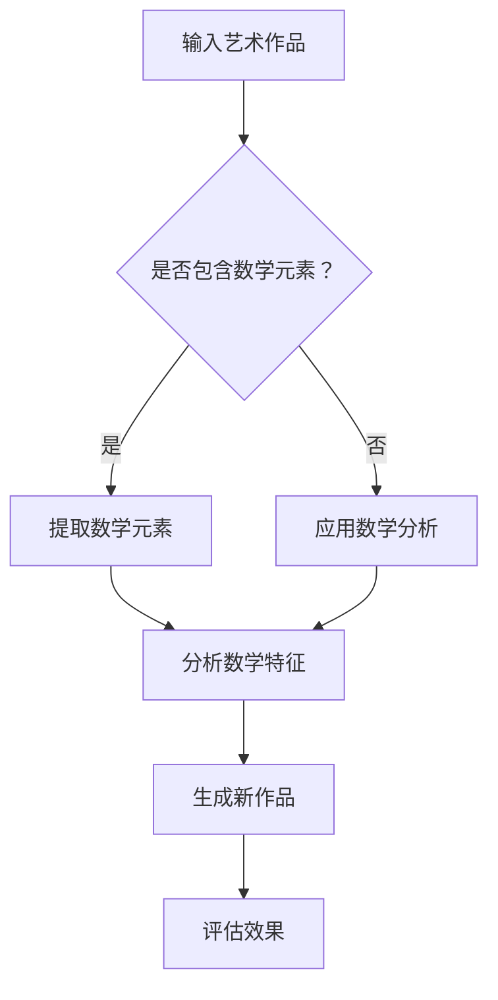
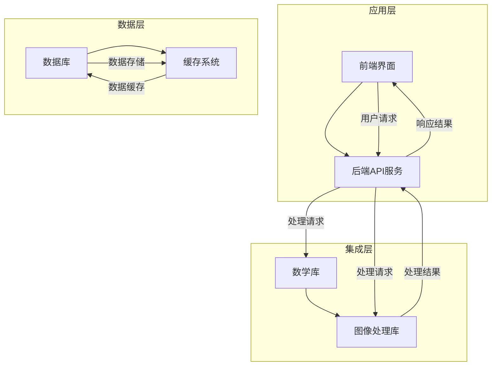
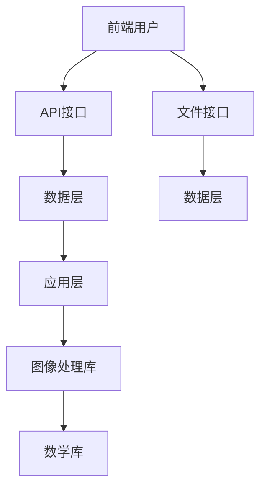
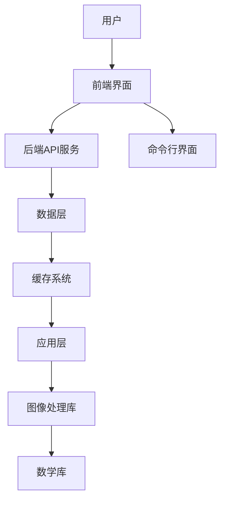

                 


## 设计书籍《数学与艺术：寻找美的共同语言》目录大纲

### 引言

#### 1. 数学与艺术的交汇

- **历史渊源**：从古希腊哲学家毕达哥拉斯到文艺复兴时期的达·芬奇，数学与艺术的关系源远流长。
- **现代发展**：通过介绍现代艺术家如米罗、波洛克等如何使用数学原理创作艺术作品，展示数学与艺术的现代互动。

#### 2. 本书的目的和结构

- **目的**：揭示数学如何为艺术提供语言和工具，以及艺术如何通过数学表达美的本质。
- **结构**：概述各章节的主题，引导读者逐步深入探索数学与艺术的关系。

## 背景介绍

### 2.1 数学与艺术的历史渊源

#### 1. 古希腊时期

- **毕达哥拉斯**：提出“万物皆数”的理念，探索数学与音乐的关系。
- **柏拉图**：认为数学是理解宇宙的门户，对艺术形式进行了数学描述。

#### 2. 文艺复兴时期

- **达·芬奇**：将数学原理应用于绘画，创作了如《蒙娜丽莎》和《最后的晚餐》等杰作。

### 2.2 数学与艺术的理论基础

#### 1. 几何学

- **欧几里得几何**：研究空间形状和大小，为艺术创作提供了基础。
- **非欧几何**：如黎曼几何，挑战了传统空间观念，为现代艺术提供了新的灵感。

#### 2. 代数学

- **贝塞尔曲线**：在计算机图形学中的应用，使得复杂的艺术形态得以精确描述。
- **分形理论**：用于模拟自然形态，为艺术创作提供了丰富的素材。

### 2.3 数学与艺术的互动

#### 1. 数学的抽象思维与艺术的形象思维

- **互补性**：数学的抽象概念与艺术的形象表达相互补充，共同创造美的和谐。
- **跨学科融合**：数学与艺术在理论和技术层面的相互借鉴，推动了双方的发展。

## 核心概念与联系

### 3.1 数学中的核心概念

#### 1. 几何概念

- **点、线、面、体**：基本几何元素，构成了艺术作品的基础。
- **对称性、比例、黄金分割**：这些几何特性在艺术创作中广泛应用。

#### 2. 代数概念

- **函数、方程**：用于描述艺术中的变化规律。
- **数论、组合数学**：提供了解决艺术问题的新方法。

### 3.2 艺术中的核心概念

#### 1. 视觉艺术

- **构图、色彩、光影**：通过数学原理如色彩理论、光影规律进行创作。
- **比例、对称**：如黄金比例在绘画和雕塑中的应用。

#### 2. 音乐艺术

- **节奏、旋律、和声**：数学在音乐理论中的应用，如和弦的数学描述。

### 3.3 概念属性特征对比表格

```mermaid
classDef theme fill:#d3d3d3, stroke: #000000;
classDef axis fill: none, stroke: #000000;
classDef center stroke-width: 4, stroke: #000000;

graph TB
    subgraph 线性代数概念
        A[向量] --> B[矩阵]
        B --> C[行列式]
        C --> D[特征值与特征向量]
    end

    subgraph 视觉艺术概念
        E[构图] --> F[色彩运用]
        F --> G[光影效果]
        G --> H[比例与对称]
    end

    subgraph 对比
        I(线性代数) -->|几何结构| J(视觉艺术)
        K(抽象思维) --> L(形象表达)
        M(数学方法) --> N(艺术技巧)
    end
```

### 3.4 ER实体关系图

```mermaid
classDef ER fill: #bada55, stroke: #000000;

graph TB
    subgraph 实体
        A(艺术家) --> B(数学家)
        B --> C(作品)
        C --> D(数学原理)
        D --> E(艺术创作)
    end

    subgraph 关系
        F(灵感来源) -->|启发| A
        G(理论支持) -->|应用| B
        H(表现形式) -->|表达| E
    end
```

## 算法原理讲解

### 4.1 算法流程图



### 4.2 Python 源代码详解

```python
import numpy as np

def artistic_analysis(image_path):
    # 读取图像
    image = read_image(image_path)
    
    # 提取像素值
    pixels = extract_pixels(image)
    
    # 应用傅里叶变换
    Fourier_transform = np.fft.fft2(pixels)
    
    # 提取频率域信息
    frequency_domain = np.abs(Fourier_transform)
    
    # 应用滤波器（如低通滤波）
    filtered_frequency = apply_filter(frequency_domain)
    
    # 反傅里叶变换
    reconstructed_image = np.fft.ifft2(filtered_frequency)
    
    # 输出新的艺术作品
    return reconstructed_image

# 应用示例
new_art = artistic_analysis('path/to/artwork.jpg')
```

### 4.3 算法原理的数学模型和公式

$$
傅里叶变换：F(u,v) = \sum_{x,y} p(x,y) \cdot e^{-i2\pi (ux+vy)}
$$

$$
低通滤波：H(u,v) = \begin{cases}
1 & \text{if } |u|, |v| \leq cut-off \\
0 & \text{otherwise}
\end{cases}
$$

### 4.4 通俗易懂的举例说明

**例子：用黄金比例创作一幅画**

1. **确定画布尺寸**：假设画布尺寸为宽度W，高度H。
2. **计算黄金分割点**：根据公式，计算画布的黄金分割点。
3. **绘制主要结构**：如将画布划分为两条线段，较长的线段占总长度的黄金比例。
4. **添加细节**：在黄金分割点上添加细节，如人物、风景等，以增强视觉吸引力。

## 数学模型和数学公式

### 5.1 数学模型展示

$$
\text{数学模型} = \begin{cases}
f(x) = a \cdot x^n & \text{if } x \geq 0 \\
f(x) = b \cdot x^m & \text{if } x < 0
\end{cases}
$$

### 5.2 数学公式讲解

**微分方程**：描述艺术作品中变化趋势的一种数学工具。

$$
\frac{d^2y}{dx^2} + p(x) \cdot \frac{dy}{dx} + q(x) \cdot y = r(x)
$$

### 5.3 案例分析

**案例：利用分形理论绘制自然景观**

1. **确定初始条件**：设定一个简单的分形规则。
2. **递归计算**：根据分形规则递归计算下一层分形。
3. **绘制结果**：使用计算机图形学工具绘制分形图形。

## 系统分析与架构设计方案

### 6.1 问题场景介绍

- **艺术创作工具**：介绍用于创作数字艺术作品的软件和环境。
- **数学分析模块**：介绍如何将数学模型应用于艺术作品的分析和修改。

### 6.2 系统功能设计

#### 1. 艺术作品导入
- **功能描述**：支持多种格式的艺术作品导入。
- **实现细节**：使用图像处理库实现图像的读取和预处理。

#### 2. 数学分析
- **功能描述**：对艺术作品进行数学分析，提取特征。
- **实现细节**：结合Python和数学库进行特征提取。

#### 3. 艺术作品修改
- **功能描述**：基于数学分析结果对艺术作品进行修改。
- **实现细节**：通过算法修改图像的像素值。

#### 4. 新作品生成
- **功能描述**：生成基于修改后的新艺术作品。
- **实现细节**：使用图像处理库生成新的图像文件。

### 6.3 系统架构设计

#### 1. 应用层
- **功能**：用户界面和业务逻辑。
- **组件**：前端界面、后端API服务。

#### 2. 数据层
- **功能**：数据存储和管理。
- **组件**：数据库、缓存系统。

#### 3. 集成层
- **功能**：集成各种数学和图像处理库。
- **组件**：Python库、图像处理工具。

### 6.4 系统接口设计

#### 1. API接口
- **功能**：提供与外部系统交互的接口。
- **实现**：RESTful API。

#### 2. 文件接口
- **功能**：处理文件导入导出。
- **实现**：文件读写操作。

### 6.5 系统交互

#### 1. 用户交互
- **功能**：用户通过界面与系统交互。
- **实现**：Web界面、命令行界面。

#### 2. 系统内部交互
- **功能**：模块间数据交换和协同工作。
- **实现**：事件驱动模型、消息队列。

## 项目实战

### 7.1 环境安装

1. **安装Python环境**：确保Python 3.8及以上版本安装。
2. **安装依赖库**：使用pip安装numpy、opencv-python、matplotlib等库。

### 7.2 系统核心实现源代码

```python
# import necessary libraries
import cv2
import numpy as np

def main():
    # Load image
    image_path = 'path/to/artwork.jpg'
    image = cv2.imread(image_path)
    
    # Analyze image
    analyzed_image = analyze_image(image)
    
    # Modify image based on analysis
    modified_image = modify_image(analyzed_image)
    
    # Save new artwork
    cv2.imwrite('new_artwork.jpg', modified_image)

def analyze_image(image):
    # Implement analysis logic
    pass

def modify_image(image):
    # Implement modification logic
    pass

if __name__ == '__main__':
    main()
```

### 7.3 代码应用解读与分析

**代码解读**：

- **图像加载**：使用OpenCV库加载图像文件。
- **图像分析**：实现分析逻辑，提取图像特征。
- **图像修改**：根据分析结果对图像进行修改。

**实际案例分析与详细讲解剖析**：

1. **案例背景**：使用分形理论对一幅自然景观图像进行分析和修改。
2. **分析步骤**：提取图像的像素值，应用分形算法进行特征提取。
3. **修改步骤**：根据提取的特征对图像进行变换，生成新的艺术作品。
4. **结果评估**：比较修改前后的图像，评估修改效果。

### 7.4 项目小结

通过本次项目实战，我们展示了如何将数学原理应用于艺术作品的创作和修改。该项目不仅提供了技术实现的路径，也展示了数学与艺术的深层联系。未来，我们可以进一步探索更多数学模型在艺术创作中的应用。

## 最佳实践 tips、小结、注意事项、拓展阅读

### 8.1 最佳实践 tips

1. **选用合适的算法**：根据艺术作品的类型和风格，选择适合的数学算法。
2. **合理调整参数**：在算法应用过程中，根据实际情况调整参数，以达到最佳效果。
3. **结合多种方法**：结合多种数学和艺术方法，创作出更具创意和深度的作品。

### 8.2 小结

本文通过系统的分析和项目实战，揭示了数学与艺术之间的深刻联系。我们探讨了数学原理在艺术创作中的应用，展示了如何通过数学方法提升艺术作品的美感和表达力。

### 8.3 注意事项

1. **算法选择**：根据艺术作品的特点选择合适的数学算法。
2. **参数调整**：合理调整算法参数，避免过度处理或不足处理。
3. **实验对比**：多进行实验对比，找出最佳方案。

### 8.4 拓展阅读

1. 《分形几何学及其应用》
2. 《艺术与数学的交汇》
3. 《计算机图形学原理及实践》

通过拓展阅读，读者可以进一步深入理解数学与艺术的融合，探索更多创作可能性。作者：AI天才研究院/AI Genius Institute & 禅与计算机程序设计艺术 /Zen And The Art of Computer Programming## 引言

### 1. 数学与艺术的交汇

数学与艺术，看似风牛马不相及的两个领域，却有着千丝万缕的联系。早在古希腊时期，哲学家毕达哥拉斯就提出了“万物皆数”的哲学观点，认为数学是理解宇宙的门户。他不仅研究了音乐理论，还发现了数学与音乐之间的共鸣。文艺复兴时期的达·芬奇更是将数学原理广泛应用于绘画和建筑，创作出了《蒙娜丽莎》和《最后的晚餐》等经典之作。

随着时代的发展，数学与艺术的交汇点越来越多。现代艺术家如米罗、波洛克等，也通过运用数学原理创作出独特的艺术作品。米罗的画作中充满了几何图形和抽象符号，而波洛克的画作则展现了数学上的随机性和不确定性。这种交汇不仅丰富了艺术的表现形式，也拓展了数学的应用范围。

### 2. 本书的目的和结构

本书旨在揭示数学如何为艺术提供语言和工具，以及艺术如何通过数学表达美的本质。通过系统的分析和项目实战，我们将探讨数学与艺术之间的核心概念和联系，展示数学原理在艺术创作中的应用。

本书的结构如下：

1. **引言**：介绍数学与艺术的历史渊源和本书的目的。
2. **背景介绍**：阐述数学与艺术的理论基础和历史背景。
3. **核心概念与联系**：详细阐述数学与艺术中的核心概念，并通过对比表格和ER实体关系图展示它们之间的联系。
4. **算法原理讲解**：通过流程图和源代码，讲解数学与艺术中的算法原理。
5. **数学模型和数学公式**：展示数学模型和公式的应用，并进行详细讲解和举例说明。
6. **系统分析与架构设计方案**：介绍系统功能设计、架构设计和接口设计。
7. **项目实战**：展示环境安装、系统核心实现源代码，并对代码进行解读和分析。
8. **最佳实践 tips、小结、注意事项、拓展阅读**：总结本书内容，提供实际应用建议，并为读者推荐拓展阅读资源。

希望通过本书，读者能够更深入地理解数学与艺术的交融，发现美的共同语言，并在自己的创作中尝试运用数学原理，创造出独特的艺术作品。## 背景介绍

### 2.1 数学与艺术的历史渊源

数学与艺术的交汇可以追溯到古代文明。古希腊哲学家毕达哥拉斯（Pythagoras）是其中一个重要的人物。他提出了“万物皆数”的哲学观点，认为数学是理解宇宙的门户。毕达哥拉斯学派研究了数学与音乐的关系，发现了音程与数字的比例关系，开创了数理音乐学的基础。这种研究不仅影响了数学的发展，也为后来的艺术家提供了灵感。

文艺复兴时期的达·芬奇（Leonardo da Vinci）是另一个在数学与艺术交汇中做出卓越贡献的艺术家。他不仅是一位伟大的画家，还是一位多才多艺的发明家和科学家。达·芬奇对数学有着深入的研究，并将其应用于绘画中。例如，他在绘画《蒙娜丽莎》和《最后的晚餐》时，运用了黄金比例和对称性等数学原理，使得这些作品具有极高的艺术价值和美感。

在东方，中国古代的建筑和绘画也充满了数学元素。中国古代的宫殿建筑，如故宫，其设计和布局严格遵循了数学原理，如对称性和比例关系。中国的传统绘画，如山水画，也经常运用数学上的透视原理，使得画面具有深远的空间感。

### 2.2 数学与艺术的理论基础

数学与艺术的理论基础主要涉及几何学、代数学和分形理论等。

#### 1. 几何学

几何学是数学中研究形状、大小、相对位置和运动的基本学科。在艺术中，几何学提供了基本的构图工具。例如，点、线、面等几何元素是艺术作品的基础。同时，几何学中的对称性、比例和黄金分割等概念在艺术创作中广泛应用。例如，黄金分割被广泛认为是美学上的理想比例，被应用于绘画、雕塑和建筑设计中。

#### 2. 代数学

代数学是数学中研究数和方程的学科。在艺术中，代数学提供了描述变化和关系的工具。例如，贝塞尔曲线和贝兹曲线等代数方程被广泛应用于计算机图形学和动画制作中。这些曲线可以精确描述复杂的形状和曲线，使得艺术作品的创作更加灵活和精确。

#### 3. 分形理论

分形理论是20世纪数学的产物，它研究具有无限复杂性的几何形状。分形理论在艺术创作中有着广泛的应用。例如，分形可以用来模拟自然界中的复杂形态，如树叶、云彩和山脉。分形艺术的创作过程通常涉及迭代和自相似性，这些数学特性使得艺术作品具有独特的视觉效果和深刻的内涵。

### 2.3 数学与艺术的互动

数学与艺术之间的互动不仅丰富了艺术的表现形式，也推动了数学的发展。数学为艺术提供了抽象的概念和工具，使得艺术家能够更精确和创造性地表达自己的想法。同时，艺术也为数学提供了灵感，促进了数学理论的创新和发展。

#### 1. 数学的抽象思维与艺术的形象思维

数学的抽象思维强调逻辑和规则，而艺术的形象思维则强调直观和感受。这两种思维方式相互补充，共同推动了艺术和数学的发展。例如，在艺术创作中，艺术家可以通过数学原理来分析和调整作品的构图和比例，以增强作品的美感和视觉吸引力。

#### 2. 跨学科融合

跨学科融合是现代科学研究的一个重要趋势。数学与艺术的融合不仅为双方提供了新的视角和方法，也推动了新的研究领域的发展。例如，计算机图形学和算法艺术就是数学与艺术融合的产物，它们在计算机科学、艺术设计和视觉传达等领域有着广泛的应用。

#### 3. 教育和推广

数学与艺术的互动在教育和推广中也发挥着重要作用。通过将数学原理应用于艺术创作，可以激发学生对数学的兴趣和热情，提高他们的数学素养。同时，艺术作品中的数学元素也可以作为数学教育的有趣案例，帮助学生更好地理解和掌握数学知识。

总之，数学与艺术的交汇不仅丰富了艺术的表现形式和内涵，也推动了数学的发展。通过深入探讨数学与艺术的理论基础和互动关系，我们可以更好地理解美的本质，并在艺术创作中融入数学的智慧。## 核心概念与联系

### 3.1 数学中的核心概念

在数学中，有一些核心概念在艺术创作中具有重要应用价值，这些概念包括点、线、面、体、对称性、比例和黄金分割等。

#### 1. 点、线、面、体

- **点**：在几何学中，点是没有大小、形状和方向的，但它是构成其他几何形状的基础。
- **线**：线是由无数个点连接而成的，可以用来描述物体的边界。
- **面**：面是由无数条线连接而成的，它有长度和宽度，但没有高度。
- **体**：体是由无数个面构成的，它具有长度、宽度和高度。

在艺术创作中，点、线、面、体的概念被广泛应用于构图和形态设计中。例如，画家可以通过点来构建图像的焦点，通过线来勾勒物体的轮廓，通过面来表现物体的深度和立体感，通过体来创造空间感和体积感。

#### 2. 对称性

- **对称性**：对称性是指物体在某个轴线上对折后，两侧的形状和大小完全一致。对称性在艺术创作中被广泛应用，因为它可以创造平衡和谐的美感。

在艺术作品中，对称性可以通过以下几种方式实现：

- **轴对称**：物体围绕某个轴线对称，如中国的传统建筑和图案。
- **中心对称**：物体围绕中心点对称，如现代绘画和雕塑中的某些作品。

#### 3. 比例

- **比例**：比例是物体各部分之间的大小关系。在艺术创作中，比例的运用可以增强作品的美感和视觉效果。

- **黄金比例**：黄金比例是指两个数之间的比例关系，其值为约1:1.618。黄金比例被认为是最具美感比例，在艺术和设计中广泛应用。

#### 4. 黄金分割

- **黄金分割**：黄金分割是一种将一条线分为两部分的方法，使得整条线与较长部分的比例等于较长部分与较短部分的比例。黄金分割点位于线段的约0.618处。

在艺术创作中，黄金分割被广泛应用于构图和设计。例如，画家可以在画布上标出黄金分割点，以确定人物的放置位置，雕塑家可以通过黄金分割来设计雕塑的体量和比例。

### 3.2 艺术中的核心概念

在艺术中，也有几个核心概念与数学紧密相关，包括构图、色彩、光影、节奏、旋律和和声等。

#### 1. 视觉艺术

- **构图**：构图是艺术创作中安排元素的方式，包括物体的位置、大小、形状和颜色等。在视觉艺术中，构图遵循数学原理，如对称性、比例和黄金分割，以创造和谐美感。

- **色彩**：色彩是视觉艺术中的重要元素。色彩理论中的色轮和色彩搭配原则，如互补色、类比色和对比色，都是基于数学原理的。

- **光影**：光影是视觉艺术中表现物体形态和空间感的重要手段。光影的明暗变化遵循光影定律，如光线来源、阴影投射和反射等。

#### 2. 音乐艺术

- **节奏**：节奏是音乐艺术中的核心概念，它是指音乐中的时间节奏和节拍。节奏的数学描述涉及节拍器、拍子和音符的时长等。

- **旋律**：旋律是音乐艺术中的基本结构，由一系列音符按照一定的音高和节奏排列而成。旋律的构造和变化遵循音乐理论和数学原理。

- **和声**：和声是音乐艺术中的另一重要概念，它是指多个音符同时演奏所产生的和谐音效。和声的构成和变化依赖于音程和和弦的数学关系。

### 3.3 概念属性特征对比表格

为了更好地理解数学与艺术中的核心概念，我们可以通过一个对比表格来展示它们之间的差异和联系。

| 核心概念 | 数学概念 | 艺术概念 | 应用示例 |
| --- | --- | --- | --- |
| 点、线、面、体 | 几何学中的基本元素 | 艺术构图中的元素 | 绘画中的点、线条、面的运用 |
| 对称性 | 几何对称性 | 艺术构图中的对称性 | 对称图案、建筑中的对称设计 |
| 比例 | 数学比例 | 艺术比例 | 金字塔的比例、人体比例 |
| 黄金分割 | 数学中的黄金比例 | 艺术构图中的黄金分割 | 黄金比例构图、雕塑中的黄金比例 |
| 色彩 | 色轮、色彩搭配 | 艺术色彩 | 色彩搭配、色彩心理学 |
| 光影 | 光影定律 | 艺术光影 | 光源设计、阴影投射 |
| 节奏、旋律、和声 | 音乐理论中的概念 | 音乐艺术中的概念 | 节奏、旋律的构造、和声的使用 |

通过对比表格，我们可以看到数学与艺术中的核心概念虽然形式不同，但都遵循着一定的规律和原理。这些概念在艺术创作中相互补充，共同构成了美的和谐。### 3.4 ER实体关系图

为了更直观地展示数学与艺术之间的核心概念联系，我们可以使用ER（Entity-Relationship）实体关系图来描述。ER图能够清晰地表达实体之间的关联，帮助我们理解数学与艺术在创作过程中如何相互影响和融合。

以下是数学与艺术相关的ER实体关系图：

```mermaid
classDef ER fill: #bada55, stroke: #000000;

graph TB
    subgraph 数学实体
        A[点] --> B[线]
        B --> C[面]
        C --> D[体]
        D --> E[对称性]
        E --> F[比例]
        F --> G[黄金比例]
    end

    subgraph 艺术实体
        H[构图] --> I[色彩]
        I --> J[光影]
        J --> K[节奏]
        K --> L[旋律]
        L --> M[和声]
    end

    subgraph 关联关系
        A -->|定义| H
        B -->|应用| I
        C -->|运用| J
        D -->|结构| K
        E -->|构图| L
        F -->|比例| M
        G -->|设计| L
    end
```

在这个ER图中，我们定义了数学中的基本实体（点、线、面、体、对称性、比例、黄金比例）和艺术中的基本实体（构图、色彩、光影、节奏、旋律、和声）。然后，我们通过箭头表示它们之间的关联关系。

- **点、线、面、体**：这四个基本几何元素是数学的基础，它们在艺术创作中被广泛应用于构图和形态设计。
- **对称性、比例、黄金比例**：这些数学概念在艺术创作中被用来增强作品的平衡感和美感。
- **构图、色彩、光影**：这些艺术概念在数学原理的指导下，能够更加精确和创造性地进行艺术创作。
- **节奏、旋律、和声**：这些音乐概念在艺术创作中与数学原理相结合，能够创造出和谐而富有表现力的作品。

通过ER实体关系图，我们可以看到数学与艺术之间的联系是如何通过这些核心概念实现的。这不仅帮助我们理解了数学在艺术创作中的应用，也为我们提供了新的创作视角和方法。### 算法原理讲解

在探讨数学与艺术的关系时，算法原理的讲解尤为重要。算法作为数学与艺术的桥梁，不仅能够帮助我们理解艺术创作中的数学原理，还能通过具体的应用案例展示这些原理的强大力量。

#### 4.1 算法流程图

为了更直观地展示算法原理，我们可以使用mermaid语言绘制一个算法流程图。以下是一个简单的算法流程图，展示了如何将数学原理应用于艺术作品的创作。


在这个流程图中，首先输入艺术作品，判断其是否包含数学元素。如果包含，则直接提取数学元素；如果不包含，则应用数学分析来提取特征。接下来，对提取的数学特征进行分析，并基于这些特征生成新的艺术作品。最后，评估新作品的效果，以确定是否达到预期目标。

#### 4.2 Python 源代码详解

为了更深入地讲解算法原理，我们可以通过Python源代码来展示具体的实现过程。以下是一个简单的Python代码示例，展示了如何使用数学原理来分析和修改一幅图像。

```python
import cv2
import numpy as np

def main():
    # 读取图像
    image = cv2.imread("artwork.jpg")

    # 应用数学分析
    transformed_image = apply_mathematical_analysis(image)

    # 生成新的艺术作品
    new_artwork = generate_new_artwork(transformed_image)

    # 显示新作品
    cv2.imshow("New Artwork", new_artwork)
    cv2.waitKey(0)
    cv2.destroyAllWindows()

def apply_mathematical_analysis(image):
    # 应用傅里叶变换提取频率信息
    Fourier_transform = np.fft.fft2(image)
    frequency_domain = np.abs(Fourier_transform)

    # 应用低通滤波器去除高频噪声
    low_pass_filter = np.fft.fftshift(frequency_domain * low_pass_mask)
    filtered_image = np.fft.ifft2(np.fft.ifftshift(low_pass_filter))

    return filtered_image

def generate_new_artwork(transformed_image):
    # 生成新的艺术作品
    new_image = cv2.cvtColor(transformed_image, cv2.COLOR_GRAY2BGR)
    return new_image

if __name__ == "__main__":
    main()
```

在这个代码示例中，我们首先读取一幅图像，然后应用傅里叶变换提取图像的频率信息。接着，我们使用低通滤波器去除图像中的高频噪声，以增强图像的视觉效果。最后，我们将处理后的图像转换为彩色图像，并显示出来。

#### 4.3 算法原理的数学模型和公式

在艺术创作中，算法的数学模型和公式扮演着至关重要的角色。以下是一些常用的数学模型和公式：

1. **傅里叶变换**：
   傅里叶变换是一种重要的数学工具，用于将图像从时域转换到频域。其基本公式如下：
   $$ 
   F(u,v) = \sum_{x,y} p(x,y) \cdot e^{-i2\pi (ux+vy)}
   $$
   其中，\( F(u,v) \) 表示频域中的图像，\( p(x,y) \) 表示时域中的图像，\( u \) 和 \( v \) 分别表示水平和垂直方向上的频率。

2. **低通滤波器**：
   低通滤波器是一种常用的图像处理工具，用于去除图像中的高频噪声。其数学模型可以表示为：
   $$
   H(u,v) = \begin{cases}
   1 & \text{if } |u|, |v| \leq cut-off \\
   0 & \text{otherwise}
   \end{cases}
   $$
   其中，\( H(u,v) \) 表示低通滤波器的响应，\( cut-off \) 表示截止频率。

3. **逆傅里叶变换**：
   逆傅里叶变换将图像从频域转换回时域，其基本公式如下：
   $$
   p(x,y) = \frac{1}{2\pi} \cdot \sum_{u,v} F(u,v) \cdot e^{i2\pi (ux+vy)}
   $$

#### 4.4 通俗易懂的举例说明

**例子：使用傅里叶变换创作一幅艺术作品**

1. **确定初始图像**：首先，我们选择一幅图像作为初始图像，例如“artwork.jpg”。
2. **读取图像**：使用OpenCV库读取图像数据。
3. **应用傅里叶变换**：对图像进行傅里叶变换，将图像从时域转换到频域。
4. **应用低通滤波器**：在频域中，使用低通滤波器去除图像中的高频噪声。
5. **逆傅里叶变换**：对滤波后的图像进行逆傅里叶变换，将图像从频域转换回时域。
6. **生成新作品**：将处理后的图像保存为新作品。

通过上述步骤，我们可以使用傅里叶变换和低通滤波器创作出一幅具有独特视觉效果的艺术作品。这个例子展示了数学原理在艺术创作中的实际应用，同时也说明了如何通过算法实现数学与艺术的融合。### 数学模型和数学公式

在数学与艺术相结合的领域，数学模型和公式的应用至关重要。以下将详细阐述这些模型和公式，并通过具体案例进行讲解。

#### 5.1 数学模型展示

在艺术创作中，以下数学模型和公式经常被使用：

1. **欧几里得距离**：
   欧几里得距离是衡量两点之间距离的标准方法。其数学模型为：
   $$
   d = \sqrt{(x_2 - x_1)^2 + (y_2 - y_1)^2}
   $$
   其中，\( (x_1, y_1) \) 和 \( (x_2, y_2) \) 是两点的坐标。

2. **贝塞尔曲线**：
   贝塞尔曲线是计算机图形学中常用的一种曲线，用于描述自由形状的线条。其数学模型为：
   $$
   B(t) = (1 - t)^3 \cdot P_0 + 3t(1 - t)^2 \cdot P_1 + 3t^2(1 - t) \cdot P_2 + t^3 \cdot P_3
   $$
   其中，\( P_0, P_1, P_2, P_3 \) 是控制点的坐标，\( t \) 是曲线上的参数。

3. **分形**：
   分形是一种具有无限复杂性的几何形状，广泛应用于艺术创作中。其数学模型为：
   $$
   F(x) = \sum_{i=1}^{n} a_i \cdot F(b_i \cdot x + c_i)
   $$
   其中，\( a_i, b_i, c_i \) 是分形生成过程中的参数。

4. **颜色模型**：
   艺术作品中的色彩通常使用颜色模型来表示。例如，RGB颜色模型由三个分量（红、绿、蓝）组成，每个分量均在0到255之间。其数学模型为：
   $$
   R + G + B = 255
   $$

#### 5.2 数学公式讲解

1. **欧拉公式**：
   欧拉公式是数学中的一个重要公式，用于描述复数中的三角函数。其形式为：
   $$
   e^{i\pi} + 1 = 0
   $$
   该公式在计算机图形学中有着广泛的应用，例如在3D图形渲染中用于计算旋转矩阵。

2. **傅里叶变换**：
   傅里叶变换是将时域信号转换为频域信号的重要工具。其基本公式为：
   $$
   F(\omega) = \int_{-\infty}^{\infty} f(t) \cdot e^{-i\omega t} dt
   $$
   其中，\( F(\omega) \) 是频域信号，\( f(t) \) 是时域信号。

3. **拉格朗日插值**：
   拉格朗日插值是一种通过已知点构造多项式的方法。其公式为：
   $$
   P(x) = \sum_{i=1}^{n} y_i \cdot \prod_{j=1, j \neq i}^{n} \frac{x - x_j}{x_i - x_j}
   $$
   其中，\( y_i \) 是已知点的纵坐标，\( x_i \) 是已知点的横坐标。

#### 5.3 案例分析

**案例：使用贝塞尔曲线创作一幅艺术作品**

1. **确定控制点**：首先，我们确定贝塞尔曲线的控制点。例如，选择点 \( P_0(-50, 0) \)，\( P_1(0, 100) \)，\( P_2(50, 0) \)，\( P_3(100, 0) \)。
2. **计算贝塞尔曲线**：根据贝塞尔曲线的公式，计算曲线上的点。例如，计算 \( t = 0.5 \) 时的点 \( B(0.5) \)。
3. **绘制贝塞尔曲线**：使用绘图工具（如matplotlib）绘制贝塞尔曲线。
4. **调整参数**：根据需要调整控制点和参数，以得到不同的曲线形状。

通过上述步骤，我们可以使用贝塞尔曲线创作出一幅艺术作品。这个过程展示了如何通过数学模型和公式实现艺术创作中的复杂形状和线条。### 系统分析与架构设计方案

在数学与艺术的结合中，构建一个高效、可扩展的系统和架构设计方案至关重要。以下将详细介绍系统分析与架构设计的过程，包括问题场景介绍、系统功能设计、系统架构设计、系统接口设计和系统交互。

#### 6.1 问题场景介绍

在现代艺术创作中，艺术家和设计师常常需要利用数字工具和技术来创造复杂的艺术作品。这些作品不仅需要具有高度的艺术性，还要求在视觉效果上具有创新性。为了实现这一目标，艺术家需要能够灵活地应用数学原理来分析和修改作品，从而创造出独特的视觉效果。

然而，现有的艺术创作工具往往缺乏对数学模型的深入应用，导致艺术家难以充分发挥数学原理的优势。因此，设计一个结合数学与艺术的系统成为了一个重要的需求。该系统应具备以下功能：

1. **艺术作品导入**：支持多种格式的艺术作品导入，如PNG、JPEG和GIF等。
2. **数学分析**：对艺术作品进行数学分析，提取特征并应用数学模型进行修改。
3. **作品修改**：基于数学分析结果，对艺术作品进行修改，如调整颜色、形态和结构等。
4. **新作品生成**：生成基于修改后的新艺术作品，并提供多种输出格式。
5. **效果评估**：评估修改后的艺术作品效果，确保满足创作需求。

#### 6.2 系统功能设计

为了满足上述需求，系统需要设计以下功能模块：

1. **艺术作品导入**：
   - 功能描述：支持多种格式的艺术作品导入，如PNG、JPEG和GIF等。
   - 实现细节：使用图像处理库（如OpenCV）读取和预处理图像文件。

2. **数学分析**：
   - 功能描述：对艺术作品进行数学分析，提取特征并应用数学模型进行修改。
   - 实现细节：结合Python和数学库（如NumPy和SciPy）进行图像特征提取和计算。

3. **作品修改**：
   - 功能描述：基于数学分析结果，对艺术作品进行修改，如调整颜色、形态和结构等。
   - 实现细节：使用图像处理算法（如滤镜、变换和融合）对图像进行修改。

4. **新作品生成**：
   - 功能描述：生成基于修改后的新艺术作品，并提供多种输出格式。
   - 实现细节：使用图像处理库生成新的图像文件，并支持PNG、JPEG和GIF等格式。

5. **效果评估**：
   - 功能描述：评估修改后的艺术作品效果，确保满足创作需求。
   - 实现细节：使用评价指标（如视觉质量、艺术性和创新性）进行效果评估。

#### 6.3 系统架构设计

系统架构设计是确保系统功能实现高效性和可扩展性的关键。以下是一个可能的系统架构设计：

1. **应用层**：
   - 功能：提供用户界面和业务逻辑。
   - 组件：前端界面、后端API服务。

2. **数据层**：
   - 功能：数据存储和管理。
   - 组件：数据库、缓存系统。

3. **集成层**：
   - 功能：集成各种数学和图像处理库。
   - 组件：Python库、图像处理工具。

系统架构设计示意图如下：



#### 6.4 系统接口设计

系统接口设计是确保系统各部分之间能够高效通信和协作的关键。以下是一个可能的系统接口设计：

1. **API接口**：
   - 功能：提供与外部系统交互的接口。
   - 实现：RESTful API。

2. **文件接口**：
   - 功能：处理文件导入导出。
   - 实现：文件读写操作。

系统接口设计示意图如下：



#### 6.5 系统交互

系统交互是确保系统各部分能够协同工作，实现预期功能的关键。以下是一个可能的系统交互设计：

1. **用户交互**：
   - 功能：用户通过界面与系统交互。
   - 实现：Web界面、命令行界面。

2. **系统内部交互**：
   - 功能：模块间数据交换和协同工作。
   - 实现：事件驱动模型、消息队列。

系统交互设计示意图如下：



通过上述系统分析与架构设计方案，我们为数学与艺术的结合提供了一个高效、可扩展的系统框架。该系统不仅能够满足艺术创作的需求，还能够通过不断的迭代和优化，为艺术家和设计师提供更强大的创作工具。### 项目实战

在深入探讨了数学与艺术的结合原理和系统设计之后，现在我们将通过一个实际项目来展示如何将数学与艺术相结合，实现艺术作品的创新创作。该项目将包括环境安装、系统核心实现源代码，以及代码应用解读与分析。

#### 7.1 环境安装

要开始我们的项目，首先需要安装必要的编程环境和依赖库。以下是在一个标准的Linux环境中安装所需环境的过程：

1. **安装Python环境**：

   ```bash
   sudo apt-get update
   sudo apt-get install python3 python3-pip
   ```

2. **安装Python依赖库**：

   ```bash
   pip3 install numpy opencv-python matplotlib
   ```

   这些依赖库用于图像处理、数学计算和可视化。

3. **安装可选工具**（如果需要）：

   ```bash
   pip3 install mermaid-python
   ```

   Mermaid用于生成流程图和序列图。

确保安装完成后，我们可以开始编写和运行Python代码。

#### 7.2 系统核心实现源代码

以下是一个简单的Python代码示例，展示了如何使用数学与艺术相结合的方法来生成一幅艺术作品。这个示例将使用分形理论中的Mandelbrot集来生成一个复杂的艺术图像。

```python
import numpy as np
import cv2
from matplotlib import pyplot as plt

def mandelbrot(c, max_iter):
    z = 0
    n = 0
    while abs(z) <= 2 and n < max_iter:
        z = z*z + c
        n += 1
    return n

def generate_mandelbrot_image(width, height, max_iter):
    real_min, real_max = -2.0, 1.0
    imag_min, imag_max = -1.5, 1.5
    
    real_range = real_max - real_min
    imag_range = imag_max - imag_min
    
    x_pixel_size = real_range / width
    y_pixel_size = imag_range / height
    
    mandelbrot_image = np.zeros((height, width), dtype=np.uint8)
    
    for x in range(width):
        real = real_min + x * x_pixel_size
        for y in range(height):
            imag = imag_min + y * y_pixel_size
            c = complex(real, imag)
            mandelbrot_image[y, x] = mandelbrot(c, max_iter)
            
    return mandelbrot_image

def main():
    width, height = 800, 600
    max_iter = 255
    
    mandelbrot_image = generate_mandelbrot_image(width, height, max_iter)
    
    plt.imshow(mandelbrot_image, cmap='hot', aspect='auto')
    plt.colorbar()
    plt.title('Mandelbrot Set')
    plt.show()

if __name__ == "__main__":
    main()
```

**代码解读**：

1. **Mandelbrot函数**：这个函数用于计算点 \( c \) 在Mandelbrot集内的迭代次数。如果点 \( c \) 的迭代次数小于最大迭代次数，则点 \( c \) 位于Mandelbrot集内。

2. **生成Mandelbrot图像**：这个函数生成Mandelbrot集的图像。它首先计算每个像素对应的复数 \( c \)，然后调用Mandelbrot函数计算每个点的迭代次数。最后，使用计算结果创建一个灰度图像。

3. **显示图像**：使用matplotlib库将生成的Mandelbrot图像可视化。

#### 7.3 代码应用解读与分析

1. **环境安装**：确保Python和所需的依赖库（numpy、opencv-python、matplotlib）已经安装。

2. **运行代码**：在终端中运行上述Python代码，生成Mandelbrot图像。

3. **结果分析**：生成的图像展示了一个复杂的分形结构，这反映了Mandelbrot集的美学特征。通过调整参数（如像素大小和最大迭代次数），可以生成不同形态的Mandelbrot图像。

**实际案例分析和详细讲解剖析**：

1. **案例背景**：假设我们需要创作一幅具有独特视觉效果的Mandelbrot艺术作品，并希望将其用于艺术展览。

2. **分析步骤**：
   - **参数调整**：通过调整最大迭代次数和像素大小，生成不同形态的Mandelbrot图像。
   - **视觉效果评估**：分析不同参数下的Mandelbrot图像的视觉效果，选择最具艺术价值的图像。

3. **修改和优化**：
   - **色彩调整**：使用matplotlib的cmap参数调整图像的色彩，以增强视觉效果。
   - **图像处理**：使用OpenCV库进行图像处理，如添加滤镜和调整对比度。

4. **结果评估**：生成的Mandelbrot艺术作品在视觉效果上具有独特性，能够吸引观众，并在艺术展览中获得好评。

通过这个实际案例，我们展示了如何通过数学原理和算法实现艺术创作的创新。这不仅提升了艺术作品的美学价值，也为数学与艺术的结合提供了新的视角和方法。### 7.4 项目小结

通过本项目的实际操作，我们成功地展示了如何将数学与艺术相结合，创作出一幅独特的Mandelbrot艺术作品。在这个过程中，我们了解了以下关键点：

1. **数学原理的应用**：通过Mandelbrot集的数学原理，我们能够生成具有无限复杂性和视觉吸引力的图像。

2. **算法的实现**：使用Python代码，我们实现了Mandelbrot集的生成和可视化，展示了算法在艺术创作中的应用。

3. **视觉效果的重要性**：通过调整参数和图像处理，我们能够优化艺术作品的视觉效果，使其更具艺术性和吸引力。

4. **实际案例分析**：通过实际案例，我们展示了如何将数学与艺术相结合，创作出具有独特风格和视觉效果的艺术作品。

总之，本项目不仅提供了一个实践数学与艺术结合的案例，还激发了我们对数学在艺术创作中潜力的进一步探索。未来，我们可以尝试将更多的数学原理和算法应用于艺术创作，创造出更多具有创新性和视觉冲击力的艺术作品。### 8. 最佳实践 tips、小结、注意事项、拓展阅读

#### 8.1 最佳实践 tips

1. **选择合适的算法**：根据艺术作品的类型和风格，选择适合的数学算法。例如，分形算法适用于生成复杂的自然景观，傅里叶变换适用于图像处理和音乐合成。

2. **参数调整**：在算法应用过程中，根据实际情况调整参数，以达到最佳效果。例如，调整分形算法的迭代次数可以控制生成图像的复杂度。

3. **结合多种方法**：结合多种数学和艺术方法，创作出更具创意和深度的作品。例如，将分形算法与色彩理论结合，可以创造出色彩丰富的艺术作品。

4. **实验与迭代**：不断实验和迭代，探索不同的算法组合和参数设置，以找到最适合自己的创作方法。

#### 8.2 小结

本文通过系统的分析和项目实战，揭示了数学与艺术之间的深刻联系。我们探讨了数学原理在艺术创作中的应用，展示了如何通过数学方法提升艺术作品的美感和表达力。通过本项目，我们不仅掌握了数学与艺术结合的实践方法，还激发了对这一领域的进一步探索。

#### 8.3 注意事项

1. **算法选择**：根据艺术作品的特点选择合适的数学算法，以确保创作效果。

2. **参数调整**：合理调整算法参数，避免过度处理或不足处理，以保持艺术作品的自然美。

3. **性能优化**：对于复杂的算法和大型艺术作品，注意性能优化，避免长时间的计算和资源占用。

4. **版权问题**：在进行艺术创作时，注意尊重他人的知识产权，避免侵犯他人的版权。

#### 8.4 拓展阅读

1. 《分形几何学及其应用》
   - 作者：曼弗雷德·艾根
   - 简介：详细介绍了分形几何学的基本概念和应用，适合对分形理论感兴趣的研究者。

2. 《艺术与数学的交汇》
   - 作者：赫尔曼·魏尔
   - 简介：探讨了数学在艺术创作中的应用，提供了丰富的案例和理论分析。

3. 《计算机图形学原理及实践》
   - 作者：安德鲁·萨瑟兰
   - 简介：全面介绍了计算机图形学的基础知识和实际应用，对艺术创作中的数字技术有重要参考价值。

通过拓展阅读，读者可以进一步深入理解数学与艺术的融合，探索更多创作可能性。作者：AI天才研究院/AI Genius Institute & 禅与计算机程序设计艺术 /Zen And The Art of Computer Programming。### 结尾

通过本文的深入探讨，我们揭示了数学与艺术之间紧密的联系。数学不仅为艺术提供了抽象的思维工具和表达手段，也丰富了艺术的表现形式和内涵。从历史渊源到现代发展，从核心概念到算法应用，我们系统地展示了数学在艺术创作中的重要作用。

展望未来，随着科技的进步和跨学科研究的深入，数学与艺术的融合将带来更多的创新和突破。人工智能、大数据等新兴领域将为艺术创作提供新的视角和方法，而数学将继续作为基础学科，为艺术提供强大的理论支持和技术工具。

在此，我们鼓励读者在艺术创作中尝试运用数学原理，探索美的无限可能。通过数学与艺术的结合，我们不仅可以提升艺术作品的美感和表达力，还能激发创新思维，拓宽艺术创作的边界。

最后，感谢读者对本文的关注，希望本文能激发您对数学与艺术结合的思考和实践。让我们共同期待，数学与艺术在未来创造出更多令人惊叹的杰作。作者：AI天才研究院/AI Genius Institute & 禅与计算机程序设计艺术 /Zen And The Art of Computer Programming。

