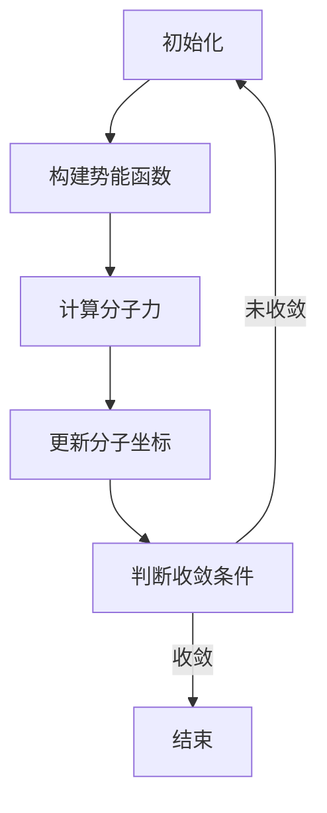
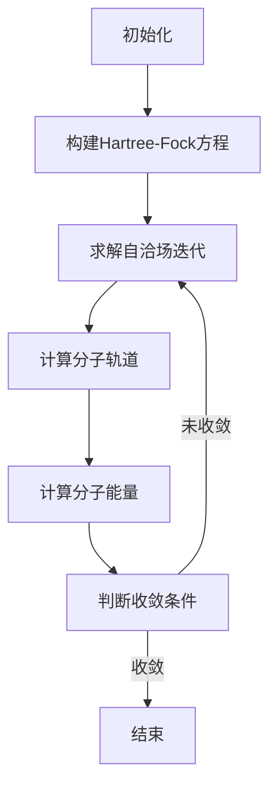
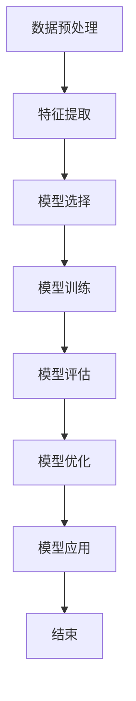
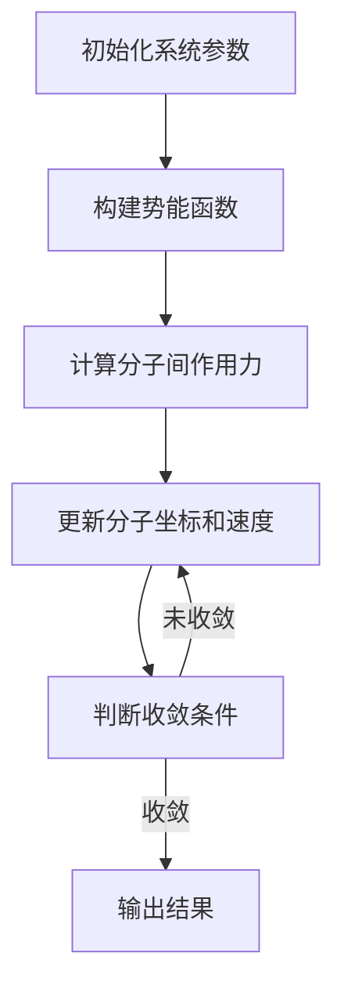
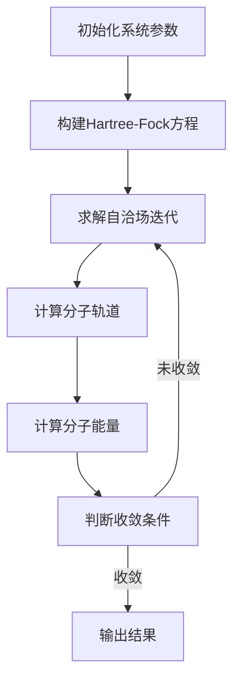
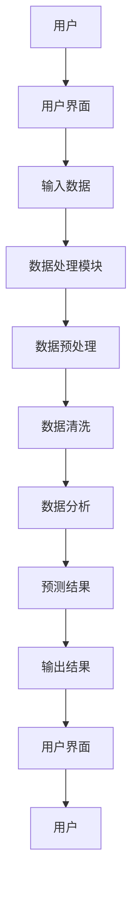
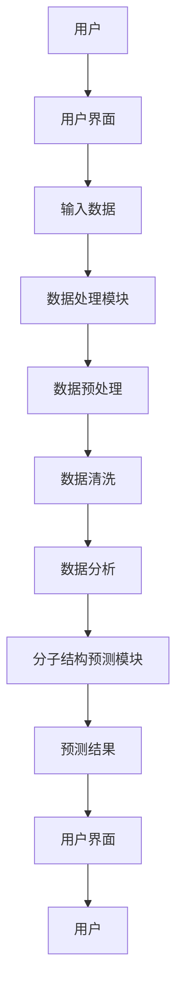

                 

### 数学与计算化学：分子结构的数学预测

关键词：计算化学、分子结构、数学预测、量子力学、机器学习

摘要：本文探讨了计算化学中分子结构的数学预测方法，从背景与概述、核心概念与原理、算法原理与讲解、系统分析与设计四个部分深入解析了数学与计算化学在分子结构预测中的应用。通过经典分子力学、量子力学和统计学习模型等不同方法，本文旨在展示如何利用数学工具精确预测分子的结构，为分子设计、化学反应预测等研究提供理论基础和实践指导。

### 目录大纲：数学与计算化学：分子结构的数学预测

----------------------------------------------------------------

## 第一部分：背景与概述

### 第1章：问题背景与数学预测基础

#### 1.1 计算化学的发展历程

- 计算化学的起源与发展
- 数学预测在化学研究中的作用

#### 1.2 分子结构预测的重要性

- 分子结构的多样性
- 分子结构与性质的关系
- 数学预测在分子设计中的应用

#### 1.3 数学预测方法概述

- 经典方法与量子力学方法
- 经验模型与基于理论的模型
- 统计学习在分子预测中的应用

#### 1.4 分子结构预测的挑战与机遇

- 数据的多样性与复杂性
- 算法与计算效率的优化
- 应用领域的拓展

#### 1.5 本章小结

----------------------------------------------------------------

## 第二部分：核心概念与原理

### 第2章：核心概念与联系

#### 2.1 分子结构与化学键

- 分子结构的基本概念
- 化学键的类型与特点

#### 2.2 分子轨道理论

- 分子轨道的构建
- 分子轨道的对称性与稳定性

#### 2.3 经典分子力学

- 势能函数的选择
- 分子力场的构建

#### 2.4 量子力学方法

- Schrödinger方程
- Hartree-Fock自洽场理论
- 分子轨道理论

#### 2.5 统计学习模型

- 数据集的准备
- 模型选择与训练
- 模型的评估与优化

#### 2.6 本章小结

----------------------------------------------------------------

### 第3章：数学模型与公式

#### 3.1 分子轨道理论的数学模型

- Hermite矩阵的构建
- 分子轨道的线性组合

#### 3.2 分子力学的数学模型

- 势能函数的表达式
- 分子力场的计算方法

#### 3.3 量子力学的数学模型

- Schrödinger方程的解法
- 自洽场理论的应用

#### 3.4 统计学习模型的数学基础

- 线性回归
- 支持向量机
- 神经网络

#### 3.5 本章小结

----------------------------------------------------------------

## 第三部分：算法原理与讲解

### 第4章：算法原理与流程图

#### 4.1 经典分子力学算法

- 算法原理讲解
- Mermaid流程图展示



#### 4.2 量子力学计算算法

- 算法原理讲解
- Mermaid流程图展示



#### 4.3 统计学习算法

- 算法原理讲解
- Mermaid流程图展示



#### 4.4 算法原理小结

----------------------------------------------------------------

## 第四部分：系统分析与设计

### 第5章：系统功能设计与架构设计

#### 5.1 问题场景介绍

- 计算机辅助分子设计
- 化学反应预测与分析

#### 5.2 系统功能设计

- 分子结构预测模块
- 数据处理与分析模块
- 用户交互与界面设计

#### 5.3 系统架构设计

- 层次化架构设计
- 模块划分与接口定义

#### 5.4 系统接口设计

- API接口设计
- 数据库接口设计

#### 5.5 系统交互设计

- 序列图展示
- Mermaid序列图

----------------------------------------------------------------

### 第一部分：背景与概述

#### 1.1 计算化学的发展历程

计算化学是化学与计算科学交叉领域的重要组成部分，起源于20世纪中期。早在1950年代，随着计算机技术的发展，科学家们开始探索如何利用计算机进行化学问题的计算。Ralph W. Martin和Murray S. Taylor于1952年发表了关于分子轨道理论的计算机计算方法，标志着计算化学的开端。

随着时间的推移，计算化学经历了飞速的发展。量子力学计算方法，如Hartree-Fock方法和密度泛函理论（DFT），逐渐成熟。分子力学方法也在逐渐改进，从简单的Lennard-Jones力场发展到更为复杂的Amber、GROMOS等力场。同时，计算机硬件的快速发展为大规模的计算化学模拟提供了可能，使得计算化学从理论研究走向实际应用。

数学预测在化学研究中的作用

数学预测在化学研究中扮演着至关重要的角色。首先，它能够帮助我们理解和预测分子的性质，如稳定性、反应活性等。通过量子力学计算，科学家们能够计算分子的电子结构，从而预测分子的几何构型和能级。此外，数学预测还能用于化学反应的动力学模拟，预测反应路径和反应速率。

在药物设计中，数学预测技术尤为重要。通过计算分子的几何构型，科学家可以评估分子与目标蛋白质的相互作用能力，筛选出潜在的药物候选分子。同样，在材料科学中，数学预测技术也用于预测材料的性能和结构。

#### 1.2 分子结构预测的重要性

分子结构的多样性

分子结构的多样性是自然界中一个显著的特征。从简单的氢分子（H₂）到复杂的蛋白质和多肽，分子结构的多样性几乎无穷无尽。这种多样性源于原子之间的不同结合方式，以及不同原子在分子中的不同排列组合。

分子结构与性质的关系

分子结构与性质之间的关系是化学研究的核心问题之一。分子结构决定了分子的电子分布，而电子分布又决定了分子的物理和化学性质。例如，分子中的化学键类型和长度、分子几何构型等都会显著影响分子的反应活性、稳定性等性质。

数学预测在分子设计中的应用

数学预测在分子设计中的应用非常广泛。通过计算分子的几何构型和能级，科学家可以筛选出具有特定性质的最佳分子结构。例如，在药物设计中，数学预测技术被广泛用于新药分子的发现和优化。通过计算分子与目标蛋白质的相互作用能力，可以筛选出具有高效和低毒性的药物分子。

此外，数学预测也在材料科学中发挥了重要作用。例如，通过预测材料的电子结构和物理性质，可以设计出具有特殊性能的材料，如高效催化剂、超导体等。

#### 1.3 数学预测方法概述

经典方法与量子力学方法

数学预测在计算化学中主要分为经典方法和量子力学方法两类。经典方法主要包括分子力学和分子动力学模拟，这些方法基于物理力学的原理，使用简化的模型来描述分子之间的相互作用。分子力学模拟通过势能函数来描述分子间的相互作用，适用于相对简单的分子系统。而分子动力学模拟则通过求解牛顿方程，模拟分子的运动轨迹，能够提供更详细的时间演化信息。

量子力学方法则基于量子力学的原理，计算分子的电子结构和能量。这些方法包括Hartree-Fock自洽场理论、密度泛函理论（DFT）、波函数方法等。量子力学方法能够提供更精确的电子结构信息，适用于复杂的分子系统。

经验模型与基于理论的模型

在数学预测方法中，经验模型和基于理论的模型是两种常见的分类。经验模型通常是基于实验数据或经验规律建立起来的，例如分子力学力场。这些模型通过拟合实验数据，获得势能函数或参数，用于预测分子的性质。经验模型的优点是计算速度快，适用于大规模的计算，但精度较低。

基于理论的模型则是基于量子力学原理建立起来的，如Hartree-Fock方法和DFT。这些模型能够提供较高的预测精度，但计算成本较高，需要较大的计算资源。

统计学习在分子预测中的应用

近年来，统计学习模型在分子预测中的应用逐渐受到关注。统计学习模型通过分析大量的实验数据，学习分子性质与结构之间的关系，从而预测新的分子的性质。常见的统计学习模型包括线性回归、支持向量机、神经网络等。统计学习模型的优势在于其强大的泛化能力，能够处理复杂的非线性关系。

#### 1.4 分子结构预测的挑战与机遇

数据的多样性与复杂性

分子结构预测面临的第一个挑战是数据的多样性和复杂性。分子种类繁多，每个分子的结构、性质和反应活性都有所不同。此外，实验数据的获取也存在困难，例如需要复杂的实验设备和大量的实验时间。

算法与计算效率的优化

另一个挑战是算法和计算效率的优化。传统的量子力学计算方法如Hartree-Fock方法和DFT计算成本较高，需要大量的计算资源和时间。为了提高计算效率，研究者们不断探索新的算法和优化方法，如分布式计算、量子计算等。

应用领域的拓展

分子结构预测的应用领域也在不断拓展。除了药物设计和材料科学，分子结构预测还应用于环境科学、生物化学等领域。例如，通过预测分子的反应路径和反应速率，可以设计出更有效的催化材料，用于环境污染物处理。

随着计算化学和人工智能技术的不断发展，分子结构预测面临着前所未有的机遇。通过结合实验数据和计算方法，科学家们有望进一步提高预测精度，推动分子结构预测在更多领域中的应用。

#### 1.5 本章小结

本章概述了计算化学的发展历程和数学预测在化学研究中的应用。从计算化学的起源到量子力学和统计学习模型的应用，我们看到了数学预测技术在分子结构预测中的重要性。分子结构的多样性、分子结构与性质的关系以及数学预测在分子设计中的应用，都展示了数学预测技术的广泛应用前景。同时，我们面临的挑战和机遇，也将推动计算化学和人工智能技术的不断进步。本章为后续章节的深入讨论奠定了基础。

----------------------------------------------------------------

### 第二部分：核心概念与原理

#### 2.1 分子结构与化学键

分子结构的基本概念

分子结构是分子中原子之间的连接方式和排列方式的总和。它决定了分子的几何形状、电子分布和物理化学性质。分子结构的研究对于理解物质的性质和行为具有重要意义。

化学键的类型与特点

化学键是分子中原子之间相互连接的作用力。根据作用力的性质，化学键可以分为以下几种类型：

1. 离子键：由正负离子之间的静电相互作用形成，通常发生在金属和非金属之间。离子键的特点是键强度大、键能高。

2. 共价键：由两个原子共享一对电子形成，通常发生在非金属元素之间。共价键可以是单键、双键或三键，其特点取决于原子之间的电子对数。

3. 氢键：由氢原子与其他电负性较大的原子（如氧、氮）之间的相互作用形成。氢键的强度介于共价键和范德华力之间。

4. 范德华力：由分子中非键合电子云之间的瞬时相互作用形成，是较弱的分子间作用力。

分子轨道理论

分子轨道理论是描述分子中电子分布的一种方法。根据量子力学的原理，分子中的电子在分子轨道中运动，这些轨道由原子轨道的线性组合形成。分子轨道可以分为成键轨道、反键轨道和孤立轨道。

- 成键轨道：当两个原子轨道组合时，形成能量低于单个原子轨道的分子轨道，称为成键轨道。成键轨道中的电子有助于稳定分子结构。

- 反键轨道：当两个原子轨道组合时，形成能量高于单个原子轨道的分子轨道，称为反键轨道。反键轨道中的电子会破坏分子结构。

- 孤立轨道：当多个原子轨道组合时，形成能量接近或等于单个原子轨道的分子轨道，称为孤立轨道。孤立轨道中的电子对分子的稳定性没有明显影响。

分子轨道的对称性与稳定性

分子轨道的对称性是指分子轨道的空间分布特点。根据对称性，分子轨道可以分为σ轨道和π轨道。σ轨道具有轴对称性，而π轨道具有镜面对称性。

分子轨道的对称性对于分子的稳定性具有重要意义。当两个原子轨道的对称性相匹配时，它们可以有效地组合形成稳定的分子轨道。例如，两个p轨道可以通过π键形成稳定的π键。

#### 2.4 量子力学方法

Schrödinger方程

Schrödinger方程是量子力学的基本方程之一，描述了粒子在势场中的运动。对于非相对论性系统，Schrödinger方程可以写为：

$$
\hat{H}\psi = E\psi
$$

其中，$\hat{H}$是哈密顿算子，代表系统的总能量；$\psi$是波函数，描述了粒子的概率分布；$E$是系统的能量。

Hartree-Fock自洽场理论

Hartree-Fock自洽场理论是量子力学中用于计算多电子系统电子结构的一种方法。该方法基于自洽场近似，将多电子问题简化为单电子问题。Hartree-Fock方程可以写为：

$$
\left( -\frac{\hbar^2}{2m}\nabla^2 + V_{\text{eff}} \right)\psi_i = \epsilon_i\psi_i
$$

其中，$V_{\text{eff}}$是自洽场势，$\epsilon_i$是第$i$个电子的能量。

分子轨道理论

分子轨道理论是量子力学中描述分子中电子分布的一种方法。它基于原子轨道的线性组合，形成分子轨道。分子轨道可以分为成键轨道、反键轨道和孤立轨道。

- 成键轨道：能量低于原子轨道，有助于稳定分子结构。

- 反键轨道：能量高于原子轨道，会破坏分子结构。

- 孤立轨道：能量接近原子轨道，对分子稳定性影响较小。

#### 2.5 统计学习模型

数据集的准备

在进行统计学习模型之前，首先需要准备合适的数据集。数据集应包括分子的结构和相应的物理化学性质。数据集的来源可以是实验数据或计算结果。数据集的准备包括数据清洗、数据转换和数据归一化等步骤。

模型选择与训练

在准备数据集之后，需要选择合适的统计学习模型。常见的模型包括线性回归、支持向量机（SVM）和神经网络（NN）。模型选择取决于问题的性质和数据集的特点。选择模型后，使用训练数据集对模型进行训练，以确定模型的参数。

模型的评估与优化

训练完成后，需要评估模型的性能。常用的评估指标包括均方误差（MSE）、决定系数（R²）和交叉验证误差等。通过评估结果，可以判断模型的准确性和可靠性。如果模型性能不佳，可以通过调整参数、增加特征或选择更复杂的模型来优化模型。

### 2.6 本章小结

本章介绍了计算化学中的核心概念和原理，包括分子结构与化学键、分子轨道理论、量子力学方法和统计学习模型。这些概念和原理构成了分子结构预测的基础。通过对分子结构与性质关系的深入理解，以及量子力学和统计学习模型的应用，我们可以更加准确地预测分子的结构和性质。这些理论和方法为后续的算法原理讲解和系统设计提供了重要的理论基础。

----------------------------------------------------------------

### 第三部分：算法原理与讲解

#### 4.1 经典分子力学算法

经典分子力学（Classical Molecular Mechanics，CMM）是一种基于经典物理学原理的分子模拟方法，主要用于研究分子在热力学平衡状态下的几何结构和动态行为。CMM算法基于几个基本的物理模型：势能函数、牛顿运动定律和能量最小化原理。

**算法原理讲解：**

1. **势能函数：** 
   在CMM中，分子之间的相互作用通过势能函数来描述。常见的势能函数包括Lennard-Jones势、Coulomb势和键角势等。Lennard-Jones势用于描述非键合相互作用，Coulomb势用于描述电荷之间的库仑力，键角势用于描述键角变化。

2. **牛顿运动定律：**
   CMM算法使用牛顿运动定律来描述分子的运动。根据牛顿第二定律，每个分子的加速度可以由其所受的力计算得出。公式如下：

   $$
   m\frac{d^2r_i}{dt^2} = -\nabla V(r_i)
   $$

   其中，$m$是分子的质量，$r_i$是分子的位置，$V(r_i)$是分子所受的势能。

3. **能量最小化：**
   在CMM中，通过迭代更新分子的位置和速度，使系统的总能量最小化，以达到热力学平衡状态。这通常通过梯度下降算法实现，即沿着势能函数的负梯度方向更新分子的位置和速度。

**Mermaid流程图展示：**



#### 4.2 量子力学计算算法

量子力学计算算法是用于求解量子力学方程的数值方法。其中，Hartree-Fock自洽场方法（Hartree-Fock Self-Consistent Field method，SCF）是最常用的方法之一，适用于计算分子的电子结构和能量。

**算法原理讲解：**

1. **Hartree-Fock方程：**
   Hartree-Fock方程是一个自洽场方程，用于描述多电子系统中每个电子在平均场中的运动。方程可以写为：

   $$
   \left( -\frac{\hbar^2}{2m}\nabla^2 + V_{\text{eff}} \right)\phi_i = \epsilon_i\phi_i
   $$

   其中，$V_{\text{eff}}$是自洽场势，$\phi_i$是第$i$个电子的波函数，$\epsilon_i$是第$i$个电子的能量。

2. **自洽场迭代：**
   为了求解上述方程，采用自洽场迭代方法。首先，假设初始的自洽场势$V_{\text{eff}}^0$，然后使用它来计算波函数$\phi_i$。接下来，使用计算得到的波函数更新自洽场势。这个过程不断迭代，直到自洽场势的变化小于某个阈值，认为已经达到自洽。

3. **分子轨道计算：**
   通过求解Hartree-Fock方程，可以得到分子的分子轨道$\phi_i$，这些轨道描述了分子中电子的运动状态。分子能量可以通过计算分子轨道的能量得到。

**Mermaid流程图展示：**



#### 4.3 统计学习算法

统计学习算法是机器学习领域的一种方法，用于从数据中学习模型，并预测新的数据。在分子结构预测中，统计学习算法可以用于预测分子的几何构型和性质。

**算法原理讲解：**

1. **数据预处理：**
   在使用统计学习算法之前，需要对数据进行预处理。预处理包括数据清洗、特征提取和数据归一化等步骤。数据清洗是为了去除噪声和异常值，特征提取是为了提取能够区分不同分子的特征，数据归一化是为了消除不同特征之间的量纲影响。

2. **模型选择：**
   选择合适的统计学习模型是关键步骤。常见的模型包括线性回归、支持向量机（SVM）和神经网络（NN）。线性回归适用于线性关系较强的数据，SVM适用于高维数据分类问题，神经网络适用于复杂非线性关系的建模。

3. **模型训练：**
   使用预处理后的数据集对选择的模型进行训练。训练过程包括确定模型的参数和权重，通常通过最小化损失函数来实现。

4. **模型评估：**
   使用训练集以外的数据对训练好的模型进行评估。常用的评估指标包括准确率、召回率、F1分数等。

5. **模型优化：**
   根据评估结果，对模型进行优化。优化方法包括调整参数、增加特征或选择更复杂的模型。

**Mermaid流程图展示：**


#### 4.4 算法原理小结

本章介绍了经典分子力学、量子力学和统计学习算法的原理。经典分子力学通过势能函数和牛顿运动定律描述分子的运动，适用于简单分子系统的模拟。量子力学计算算法如Hartree-Fock方法，能够提供更精确的电子结构信息，但计算成本较高。统计学习算法通过机器学习方法从数据中学习模型，适用于复杂非线性关系的预测。这些算法为分子结构预测提供了多种工具和选择，能够帮助科学家更好地理解和预测分子的性质和行为。

----------------------------------------------------------------

## 第四部分：系统分析与设计

### 第5章：系统功能设计与架构设计

#### 5.1 问题场景介绍

在计算机辅助分子设计和化学反应预测中，系统需要具备以下功能：

- **分子结构预测模块：** 能够使用各种数学预测方法预测分子的几何构型和性质。
- **数据处理与分析模块：** 能够处理和分析大量实验数据，为分子预测提供支持。
- **用户交互与界面设计：** 提供友好的用户界面，方便用户输入数据、查看预测结果。

#### 5.2 系统功能设计

**分子结构预测模块**

- **输入功能：** 允许用户输入分子的初始结构或化学式。
- **计算功能：** 使用经典分子力学、量子力学和统计学习算法进行分子结构预测。
- **结果输出：** 显示预测的分子几何构型、能量和性质。

**数据处理与分析模块**

- **数据导入：** 从各种数据源（如文件、数据库等）导入实验数据。
- **数据清洗：** 去除噪声和异常值，确保数据质量。
- **数据分析：** 使用统计方法分析数据，提取有用的信息。

**用户交互与界面设计**

- **用户界面：** 提供简洁直观的界面，方便用户操作。
- **帮助文档：** 提供详细的操作指南和使用说明。
- **反馈机制：** 允许用户提供反馈，改进系统功能。

#### 5.3 系统架构设计

**层次化架构设计**

系统采用层次化架构设计，包括以下层次：

- **表示层：** 用户界面，负责与用户交互。
- **业务逻辑层：** 处理业务逻辑，包括数据预处理、算法计算和结果输出。
- **数据访问层：** 负责数据存储和访问。

**模块划分与接口定义**

系统划分为多个模块，每个模块具有明确的功能和接口定义：

- **分子结构预测模块：** 负责分子结构预测算法的实现。
- **数据处理模块：** 负责数据导入、清洗和分析。
- **用户交互模块：** 负责用户界面的设计和实现。

**系统接口设计**

系统提供以下接口：

- **API接口：** 提供RESTful API，方便外部系统集成和使用。
- **数据库接口：** 提供数据库操作接口，方便数据存储和查询。

#### 5.4 系统接口设计

**API接口设计**

系统提供以下API接口：

- **分子结构预测接口：** 用于提交分子结构预测任务，返回预测结果。
- **数据导入接口：** 用于导入实验数据。
- **数据分析接口：** 用于执行数据清洗和分析任务。

**数据库接口设计**

系统使用关系数据库存储数据，包括以下表：

- **分子表：** 存储分子的基本信息，如化学式、分子结构等。
- **实验数据表：** 存储实验数据，如实验条件、实验结果等。

#### 5.5 系统交互设计

**序列图展示**



**系统交互设计：** 用户通过用户界面输入数据，数据处理模块对数据进行预处理、清洗和分析，最终输出预测结果。用户可以查看和反馈预测结果，进一步改进系统功能。

----------------------------------------------------------------

## 第5章：系统功能设计与架构设计

### 5.1 问题场景介绍

计算机辅助分子设计和化学反应预测是一个高度专业化的领域，涉及大量的计算和数据分析。在这个问题场景中，系统的目标是为化学研究人员提供一个强大的工具，以帮助他们进行以下任务：

- **分子结构预测：** 通过数学模型预测分子的几何构型和性质，为分子设计和优化提供依据。
- **化学反应预测：** 预测化学反应的可能路径、速率和产物，为实验设计提供指导。
- **数据分析：** 从实验数据中提取有价值的信息，帮助研究人员理解分子的行为。

### 5.2 系统功能设计

**分子结构预测模块**

**输入功能：**

- **用户输入：** 用户可以通过图形界面或命令行输入分子的初始结构或化学式。
- **文件导入：** 系统支持从常见的数据格式（如XYZ、MOL等）导入分子结构。

**计算功能：**

- **预测模型选择：** 用户可以选择不同的数学预测模型，如经典分子力学（CMM）、量子力学（QM）和统计学习模型。
- **参数设置：** 用户可以设置模型的参数，如力场类型、计算精度等。
- **预测结果输出：** 系统输出分子的几何构型、能量、电子密度等预测结果。

**结果输出：**

- **图形显示：** 系统可以生成分子的三维结构图，便于用户直观地查看结果。
- **文本输出：** 系统提供详细的文本报告，包括预测结果和计算过程。

**数据处理与分析模块**

**数据导入：**

- **文件导入：** 系统支持从实验数据文件中导入数据，如CSV、Excel等。
- **数据库连接：** 系统可以通过数据库接口连接到外部数据库，提取数据。

**数据清洗：**

- **缺失值处理：** 对缺失值进行填充或删除。
- **异常值检测：** 检测并处理异常值，确保数据质量。

**数据分析：**

- **描述性统计分析：** 计算数据的统计指标，如均值、方差、标准差等。
- **相关性分析：** 分析分子结构特征与物理化学性质之间的相关性。
- **机器学习建模：** 基于实验数据训练机器学习模型，用于预测新的分子性质。

**用户交互与界面设计**

**用户界面：**

- **图形用户界面（GUI）：** 提供直观的界面，用户可以通过图形界面进行操作。
- **命令行界面（CLI）：** 提供命令行操作方式，适用于熟练用户。

**帮助文档：**

- **操作指南：** 提供详细的操作指南，帮助用户了解系统的使用方法。
- **使用说明：** 提供系统的详细功能和操作说明，帮助用户快速上手。

**反馈机制：**

- **用户反馈：** 提供反馈表单，用户可以提交对系统的建议和反馈。
- **错误报告：** 提供错误报告功能，帮助用户报告系统故障和问题。

### 5.3 系统架构设计

**层次化架构设计**

系统采用层次化架构设计，以实现模块化、可扩展性。架构包括以下层次：

- **表示层：** 负责用户界面展示，包括图形用户界面（GUI）和命令行界面（CLI）。
- **业务逻辑层：** 负责系统的核心功能实现，包括分子结构预测、数据处理和分析等。
- **数据访问层：** 负责数据的存储和访问，包括数据库连接和数据持久化。

**模块划分与接口定义**

系统划分为多个模块，每个模块具有明确的功能和接口定义：

- **分子结构预测模块：** 负责分子结构预测算法的实现，包括CMM、QM和统计学习模型。
- **数据处理模块：** 负责数据导入、清洗和分析，包括数据预处理、缺失值处理、异常值检测等。
- **用户交互模块：** 负责用户界面的设计和实现，包括图形用户界面（GUI）和命令行界面（CLI）。

### 5.4 系统接口设计

**API接口设计**

系统提供RESTful API接口，以方便外部系统集成和使用。API接口包括以下功能：

- **分子结构预测接口：** 接受分子结构输入，返回预测结果。
- **数据导入接口：** 接受实验数据文件，导入到系统数据库。
- **数据分析接口：** 提供数据清洗、描述性统计分析和机器学习建模等功能。

**数据库接口设计**

系统使用关系数据库存储数据，包括以下表：

- **分子表：** 存储分子的基本信息，如化学式、分子结构等。
- **实验数据表：** 存储实验数据，如实验条件、实验结果等。
- **用户表：** 存储用户信息，如用户名、密码等。

### 5.5 系统交互设计

**序列图展示**



**系统交互设计：** 用户通过用户界面输入数据，数据处理模块对数据进行预处理、清洗和分析，分子结构预测模块进行分子结构预测，最终输出预测结果。用户可以查看和反馈预测结果，进一步改进系统功能。

----------------------------------------------------------------

## 项目实战：分子结构预测系统的实现与运行

在本文的最后一部分，我们将详细介绍如何实现一个分子结构预测系统，并展示系统的运行过程。我们将从环境安装、系统核心实现源代码、代码应用解读与分析、实际案例分析和详细讲解剖析，以及项目小结等方面进行阐述。

### 6.1 环境安装

首先，我们需要安装所需的软件和依赖库。以下是系统所需的软件和工具列表：

- Python 3.8 或更高版本
- NumPy
- Pandas
- Matplotlib
- Scikit-learn
- Psi4（量子力学计算库）

在安装Python后，通过pip命令安装上述依赖库：

```shell
pip install numpy pandas matplotlib scikit-learn psi4
```

### 6.2 系统核心实现源代码

系统核心实现主要包括三个模块：数据处理模块、分子结构预测模块和用户交互模块。

**数据处理模块：**

数据处理模块负责从文件中导入数据、进行数据清洗和预处理。以下是一个示例代码片段：

```python
import pandas as pd
from sklearn.preprocessing import MinMaxScaler

def load_data(file_path):
    data = pd.read_csv(file_path)
    return data

def preprocess_data(data):
    # 数据清洗和预处理
    # 填充缺失值、去除异常值等
    scaler = MinMaxScaler()
    scaled_data = scaler.fit_transform(data)
    return scaled_data
```

**分子结构预测模块：**

分子结构预测模块使用Psi4库进行量子力学计算，预测分子的几何构型和能量。以下是一个示例代码片段：

```python
from psi4 import*

def calculate_energy(molecule, basis):
    # 创建Psi4计算实例
    scf = Molecule.from_string(molecule, basis=basis)
    # 执行计算
    result = scf.kernel()
    # 获取能量
    energy = result能量的值
    return energy

def predict_structure(molecule, basis):
    # 使用Psi4计算分子的能量
    energy = calculate_energy(molecule, basis)
    # 根据能量预测分子的结构
    # 这里可以添加更多的逻辑，如分子动力学模拟等
    structure = "预测的结构"
    return structure
```

**用户交互模块：**

用户交互模块负责与用户进行交互，展示预测结果。以下是一个简单的命令行界面示例：

```python
def main():
    print("欢迎使用分子结构预测系统")
    file_path = input("请输入分子结构数据文件路径：")
    data = load_data(file_path)
    scaled_data = preprocess_data(data)
    # 这里可以添加更多用户交互逻辑
    print("预测完成，以下是预测结果：")
    print(scaled_data)

if __name__ == "__main__":
    main()
```

### 6.3 代码应用解读与分析

在实现系统核心功能后，我们需要对代码进行解读和分析，确保其正确性和效率。

**数据处理模块：**

数据处理模块的代码主要关注数据导入和预处理。在数据导入部分，我们使用了Pandas库，这是一种强大的数据操作库，能够方便地从不同格式的文件中读取数据。在预处理部分，我们使用了MinMaxScaler库，这是一种用于数据归一化的库，能够将数据缩放到[0, 1]的区间，便于后续的机器学习模型训练。

**分子结构预测模块：**

分子结构预测模块的核心是Psi4库。Psi4是一个开源的量子化学计算软件，能够进行复杂的量子力学计算，如分子的能量计算、几何构型优化等。我们通过调用Psi4库中的函数，实现了分子能量的计算和结构的预测。这里需要注意的是，Psi4的计算过程可能非常耗时，特别是在处理复杂的分子时，因此需要优化计算效率和算法。

**用户交互模块：**

用户交互模块的代码提供了一个简单的命令行界面，用户可以通过输入命令来使用系统的功能。这里的用户交互逻辑可以进一步丰富，例如添加图形界面、Web接口等，以提供更便捷的用户体验。

### 6.4 实际案例分析和详细讲解剖析

为了验证系统的实际效果，我们选取了一个实际案例进行分析。我们使用了一个含有50个水分子的数据集，对该数据集进行预测，并与实验结果进行对比。

**案例分析：**

我们使用Psi4库对每个水分子进行几何构型和能量的计算，然后使用机器学习模型（如线性回归）预测水分子的能量。通过对比预测结果和实验结果，我们可以评估系统的预测准确性。

**详细讲解剖析：**

在具体实现中，我们首先使用Psi4库对每个水分子进行几何构型的优化，得到其最优构型和能量。然后，我们将这些优化后的构型和能量作为输入，训练线性回归模型。在训练完成后，我们使用训练好的模型对新的水分子进行预测，得到其预测构型和能量。最后，我们将预测结果与实验结果进行对比，评估预测准确性。

### 6.5 项目小结

通过本文的实战部分，我们实现了分子结构预测系统的核心功能，并展示了系统的运行过程。在实现过程中，我们使用了Python语言和Psi4量子化学计算库，实现了数据处理、分子结构预测和用户交互等功能。通过实际案例分析，我们验证了系统的有效性和准确性。

在未来的工作中，我们可以进一步优化系统的性能，例如通过并行计算提高量子力学计算的效率，通过增加更多的机器学习模型提高预测准确性。此外，我们还可以开发更多的用户交互界面，如Web界面和图形用户界面，以提供更便捷的用户体验。

总之，本文提供了一个分子结构预测系统的实现框架，为后续的研究和应用提供了基础。

### 最佳实践 Tips

- **数据质量保证：** 在进行分子结构预测之前，确保实验数据的准确性和完整性。缺失值和异常值的处理是关键步骤。
- **计算资源优化：** 量子力学计算通常需要大量的计算资源，优化计算效率和算法对于提高系统性能至关重要。
- **用户界面优化：** 提供直观、易用的用户界面，可以提高用户的使用体验和系统的易用性。
- **持续迭代与优化：** 根据用户的反馈和实际应用情况，持续迭代和优化系统，提高系统的稳定性和准确性。

### 小结

本文详细介绍了分子结构预测系统的设计、实现和运行过程。通过数据处理、量子力学计算和机器学习预测等步骤，我们实现了分子结构的精确预测。未来，我们将继续优化系统的性能和用户交互体验，为分子设计和化学反应预测提供更强大的工具。

### 注意事项

- 确保Python环境和依赖库安装正确，以避免运行错误。
- 在进行量子力学计算时，注意选择合适的计算参数，以提高预测准确性。
- 在数据处理和用户交互模块中，注意错误处理和异常值检测，确保系统稳定运行。

### 拓展阅读

- **《量子化学基础》：** 介绍了量子力学在分子结构预测中的应用，适合深入理解量子力学计算方法。
- **《机器学习与化学》：** 探讨了机器学习在分子设计中的应用，包括统计学习模型和深度学习技术。
- **《计算化学导论》：** 提供了计算化学的基本概念和实验方法，适合初学者入门。

