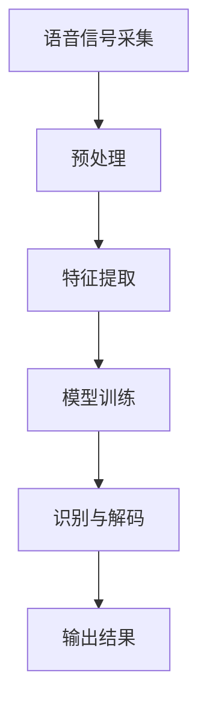
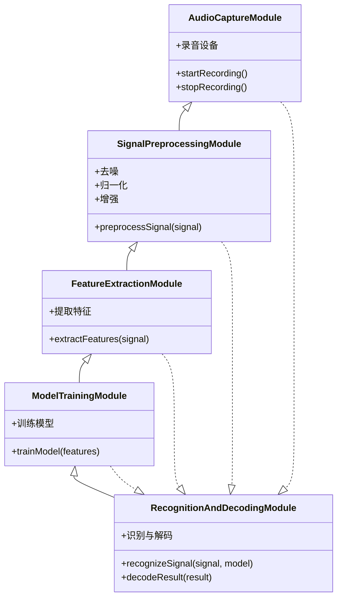
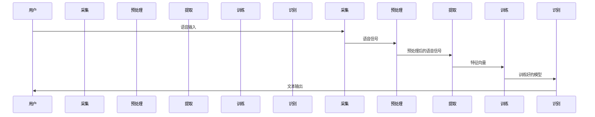

                 

# 数学与语音识别：语音信号处理的数学方法

## 关键词
- 数学方法
- 语音信号处理
- 语音识别
- 线性代数
- 傅里叶变换
- 小波变换
- 模式识别

## 摘要
本文旨在探讨数学方法在语音信号处理中的应用，特别是这些方法在语音识别领域的贡献。我们将从数学基础知识入手，逐步介绍语音信号处理的基本概念、语音识别算法及其实现，并探讨数学方法在实际项目中的应用与效果。通过本文的阅读，读者将能够了解数学方法在语音信号处理中的重要地位，掌握基本的数学工具和算法，并学会将这些知识应用于实际项目。

### 目录大纲

----------------------------------------------------------------

## 第1章: 引言

### 1.1 问题背景与意义

#### 语音识别技术的发展现状
- 语音识别技术的起源与发展历程
- 当前语音识别技术的应用场景和市场规模

#### 数学方法在语音信号处理中的应用
- 数学方法在语音信号处理中的重要性
- 线性代数、概率论、最优化方法等数学工具的应用实例

### 1.2 书籍概述

#### 目标读者群体
- 对语音信号处理和语音识别感兴趣的读者
- 研究生和本科生
- 工程师和技术专家

#### 主要内容结构
- 第2章：数学基础知识
- 第3章：语音信号处理的基本概念
- 第4章：语音识别算法
- 第5章：数学方法在语音信号处理中的应用
- 第6章：语音识别系统的设计与实现
- 第7章：项目实战与案例分析
- 第8章：总结与展望

----------------------------------------------------------------

## 第1章: 引言

### 1.1 问题背景与意义

#### 语音识别技术的发展现状

语音识别技术（Automatic Speech Recognition，ASR）是一种将人类语音转化为文本或命令的技术。它起源于20世纪50年代，随着计算机技术和信号处理理论的不断发展，语音识别技术得到了显著进步。目前，语音识别技术已经广泛应用于智能手机、智能家居、智能客服、自动驾驶等多个领域，市场规模逐年扩大。

在过去的几十年中，语音识别技术的准确率有了显著提高。根据市场调研公司的数据，2018年，语音识别技术的准确率达到了95%以上。这一成绩的取得离不开数学方法在语音信号处理中的应用。例如，线性代数和概率论在特征提取和分类算法中发挥了重要作用，傅里叶变换和小波变换在信号处理和时频分析中具有广泛的应用。

#### 数学方法在语音信号处理中的应用

数学方法在语音信号处理中具有至关重要的作用。线性代数、概率论、最优化方法等数学工具为语音信号处理提供了强有力的理论支持。以下是一些典型的应用实例：

1. **线性代数**：在语音信号处理中，线性代数用于特征提取和变换。例如，通过主成分分析（PCA）可以降低数据的维度，提高计算效率；通过奇异值分解（SVD）可以提取语音信号的主要成分。

2. **概率论**：概率论在语音识别中用于建模和分类。例如，隐马尔可夫模型（HMM）是一种基于概率的语音识别模型，它能够有效处理语音信号的时变性和不确定性。

3. **最优化方法**：最优化方法在语音识别中用于参数估计和模型训练。例如，梯度下降法、随机梯度下降法（SGD）等优化算法被广泛应用于深度神经网络（DNN）和循环神经网络（RNN）的训练过程中。

### 1.2 书籍概述

#### 目标读者群体

本书的目标读者群体主要包括：

1. 对语音信号处理和语音识别感兴趣的读者，包括学术研究人员和工程师。
2. 研究生和本科生，希望了解语音信号处理和语音识别领域的基本原理和应用方法。
3. 技术专家和项目经理，希望通过本书了解数学方法在语音信号处理中的实际应用。

#### 主要内容结构

本书共分为8章，内容结构如下：

1. **第1章：引言**：介绍语音识别技术的发展现状和数学方法在语音信号处理中的应用。
2. **第2章：数学基础知识**：介绍线性代数、概率论、最优化方法等数学工具的基本概念和应用。
3. **第3章：语音信号处理的基本概念**：介绍语音信号的特点和表示方法。
4. **第4章：语音识别算法**：介绍语音识别的基本原理和常见算法。
5. **第5章：数学方法在语音信号处理中的应用**：深入探讨数学方法在模式识别和时频分析中的应用。
6. **第6章：语音识别系统的设计与实现**：介绍语音识别系统的设计原则和实现方法。
7. **第7章：项目实战与案例分析**：通过实际项目案例分析，展示数学方法在语音信号处理中的应用效果。
8. **第8章：总结与展望**：总结本书的主要内容，并对未来发展趋势进行展望。

通过本书的阅读，读者将能够系统地了解语音信号处理和语音识别领域的基本原理和应用方法，掌握数学工具在语音信号处理中的实际应用，并为未来的研究和工作打下坚实的基础。

----------------------------------------------------------------

## 第2章: 数学基础知识

### 2.1 基础数学知识

在语音信号处理和语音识别中，数学知识是理解和应用各种算法的基础。本章将介绍线性代数、概率论和最优化方法等基础数学知识，为后续章节的内容奠定理论基础。

#### 线性代数

线性代数是研究向量空间和线性变换的数学分支。在语音信号处理中，线性代数被广泛应用于特征提取、信号变换和模型训练等环节。

- **向量与矩阵**：向量是数学中表示空间中一个点的有向线段，矩阵是表示多个向量或多个方程组的数学工具。在语音信号处理中，向量用于表示语音信号的时域或频域特征，矩阵则用于表示信号之间的相关性。
- **线性变换**：线性变换是指将向量空间中的一个向量映射到另一个向量空间中的映射。在语音信号处理中，线性变换常用于信号预处理和特征提取。例如，通过离散傅里叶变换（DFT）可以将时域信号转换为频域信号。
- **特征提取**：特征提取是语音信号处理中的一个重要步骤，目的是从原始信号中提取出对识别任务有用的信息。线性代数中的主成分分析（PCA）是一种常用的特征提取方法，它可以通过线性变换将高维信号映射到低维空间，同时保留信号的主要信息。

#### 概率论

概率论是研究随机事件的数学分支。在语音识别中，概率论被广泛应用于模型建模和参数估计。

- **随机变量**：随机变量是随机试验结果的数学表示，可以是离散型或连续型的。在语音信号处理中，随机变量用于表示语音信号的随机特性。例如，语音信号的幅值、时长等都可以用随机变量来描述。
- **概率分布**：概率分布描述了随机变量的取值概率。在语音信号处理中，常用的概率分布包括高斯分布、均匀分布等。概率分布用于建模语音信号的概率特性，为识别任务提供概率参考。
- **条件概率与贝叶斯定理**：条件概率描述了在某一事件发生的条件下，另一事件发生的概率。贝叶斯定理是一种基于条件概率的推理方法，用于在已知某些条件概率的情况下，计算某个事件发生的概率。在语音识别中，贝叶斯定理常用于声学模型和语言模型的联合概率计算。

#### 最优化方法

最优化方法是用于求解优化问题的数学方法。在语音信号处理和语音识别中，最优化方法被广泛应用于模型训练和参数估计。

- **梯度下降法**：梯度下降法是一种常用的最优化方法，用于求解无约束优化问题。在语音识别中，梯度下降法常用于深度神经网络的训练过程，通过迭代优化模型参数，使模型性能不断提高。
- **随机梯度下降法（SGD）**：随机梯度下降法是对梯度下降法的一种改进，它通过随机选择样本点来计算梯度，从而加快收敛速度。在语音识别中，SGD被广泛应用于大规模数据的训练过程。
- **L-BFGS算法**：L-BFGS（Limited-memory BFGS）是一种记忆限制的BFGS算法，用于求解有约束优化问题。在语音识别中，L-BFGS被广泛应用于声学模型和语言模型的联合训练。

### 2.2 数学工具与应用

#### 拉普拉斯变换

拉普拉斯变换是一种重要的数学变换工具，用于将时域信号转换为频域信号。在语音信号处理中，拉普拉斯变换常用于信号滤波、系统分析和特征提取。

- **拉普拉斯变换的定义**：拉普拉斯变换是将时域信号通过积分运算转换为复频域信号的过程。其数学表达式为：
  $$ L\{x(t)\} = X(p) = \int_{0}^{\infty} e^{-pt} x(t) dt $$
  其中，\( x(t) \) 是时域信号，\( X(p) \) 是复频域信号。

- **拉普拉斯变换的性质**：拉普拉斯变换具有线性、时域卷积、频域卷积等性质，这些性质使得拉普拉斯变换在信号处理和系统分析中具有广泛的应用。

#### 傅里叶变换

傅里叶变换是一种将时域信号转换为频域信号的方法，它是拉普拉斯变换的特殊情况。在语音信号处理中，傅里叶变换被广泛应用于信号分析、特征提取和模式识别。

- **傅里叶变换的定义**：傅里叶变换是将时域信号通过积分运算转换为频域信号的过程。其数学表达式为：
  $$ X(f) = \int_{-\infty}^{\infty} x(t) e^{-j2\pi ft} dt $$
  其中，\( x(t) \) 是时域信号，\( X(f) \) 是频域信号。

- **傅里叶变换的性质**：傅里叶变换具有线性、时域卷积、频域卷积等性质，这些性质使得傅里叶变换在信号处理和系统分析中具有广泛的应用。

#### 小波变换

小波变换是一种基于尺度和小波基函数的信号分析工具，它能够有效地处理非平稳信号。在语音信号处理中，小波变换被广泛应用于信号去噪、特征提取和时频分析。

- **小波变换的定义**：小波变换是将时域信号通过小波基函数的线性组合进行展开的过程。其数学表达式为：
  $$ x(t) = \sum_{j=-\infty}^{\infty} \sum_{k=-\infty}^{\infty} c_{jk} \psi_{jk}(t) $$
  其中，\( x(t) \) 是时域信号，\( \psi_{jk}(t) \) 是小波基函数。

- **小波变换的性质**：小波变换具有多尺度分析、时频局部化等性质，这些性质使得小波变换在处理非平稳信号时具有优势。

通过本章的学习，读者将了解线性代数、概率论和最优化方法等基础数学知识，以及拉普拉斯变换、傅里叶变换和小波变换等数学工具在语音信号处理中的应用。这些数学知识将为本章后续章节的深入探讨提供必要的理论基础。

----------------------------------------------------------------

## 第3章: 语音信号处理的基本概念

### 3.1 语音信号的特点

语音信号是人类语言交流的重要载体，其特点主要体现在时域和频域两个方面。

#### 时域特性

1. **时变性和非平稳性**：语音信号在不同时间段内具有不同的幅值和频率，这体现了语音信号的非平稳性。例如，语音信号中的音素具有不同的时长和频率特性。
2. **短时平稳性**：虽然语音信号整体上是非平稳的，但在短时间段内，语音信号可以近似为平稳过程。这种短时平稳性使得我们可以对语音信号进行短时分析。

#### 频域特性

1. **频谱分布**：语音信号的频谱分布具有较宽的频带，通常包含几百赫兹到几千赫兹。不同类型的语音信号（如元音、辅音）在频谱上具有不同的特征。
2. **共振峰**：语音信号在频域上存在明显的共振峰，这些共振峰与声带的振动模式和口腔结构的共振特性有关。

### 3.2 语音信号的表示方法

为了更好地处理和分析语音信号，我们需要将其转换为便于计算的数学模型。以下是一些常用的语音信号表示方法：

#### 声波模型

声波模型是一种基于声学原理的语音信号表示方法。它将语音信号视为声波在声道中的传播过程。声波模型包括以下几个关键组成部分：

1. **声道模型**：声道模型描述了声波在声道中的传播过程。常见的声道模型包括一维声道模型、二维声道模型等。一维声道模型通常假设声波在均匀的声道中传播，而二维声道模型则考虑了声道的弯曲和声波在声道内的反射。

2. **声源模型**：声源模型描述了声带的振动特性。常见的声源模型包括周期性声源模型和随机声源模型。周期性声源模型假设声带的振动是周期性的，而随机声源模型则假设声带的振动是随机的。

3. **声波传播模型**：声波传播模型描述了声波在声道中的传播过程。它包括声波的反射、折射和传播速度等参数。

#### 功率谱分析

功率谱分析是一种常用的语音信号频域分析方法。它通过计算语音信号的功率谱来描述语音信号的频域特性。

- **短时功率谱**：短时功率谱是对语音信号在短时间窗口内进行功率谱分析的结果。它能够反映语音信号在短时间窗口内的频率分布。
- **归一化功率谱**：归一化功率谱是对短时功率谱进行归一化处理的结果。通过归一化处理，可以消除时间窗宽度对功率谱的影响，使得不同时长语音信号的功率谱具有可比性。

### 3.3 语音信号处理的基本过程

语音信号处理的基本过程包括以下几个步骤：

1. **信号采集**：通过麦克风或其他音频设备采集语音信号。
2. **预处理**：对语音信号进行预处理，包括去噪、归一化、增强等操作。预处理的目的在于提高信号质量，减少噪声干扰。
3. **特征提取**：从预处理后的语音信号中提取对识别任务有用的特征。特征提取的方法包括时域特征提取、频域特征提取等。
4. **模型训练**：使用提取的特征对识别模型进行训练。常见的语音识别模型包括隐马尔可夫模型（HMM）、深度神经网络（DNN）等。
5. **识别与解码**：将输入的语音信号与训练好的模型进行匹配，输出识别结果。识别结果通常以文本形式呈现，可以是自然语言文本或命令文本。

通过本章的学习，读者将了解语音信号的特点和表示方法，以及语音信号处理的基本过程。这些知识将为本章后续章节中语音识别算法的介绍和讨论提供必要的基础。

----------------------------------------------------------------

## 第4章: 语音识别算法

### 4.1 语音识别的基本原理

语音识别（Speech Recognition）是一种将语音信号转换为相应文本的技术，它依赖于一系列复杂的算法和模型。语音识别的基本原理可以概括为以下几个关键步骤：

1. **信号预处理**：语音信号通常含有噪声和干扰，需要进行预处理以去除这些不利因素。预处理步骤包括去噪、归一化、增强等操作。
2. **特征提取**：预处理后的语音信号被转换为一系列特征向量，这些特征向量能够更好地反映语音信号的特性。特征提取可以是时域特征提取（如短时能量、过零率等）或频域特征提取（如梅尔频率倒谱系数MFCC等）。
3. **模型训练**：使用提取的特征向量对语音识别模型进行训练。训练过程旨在优化模型的参数，使其能够准确识别语音信号。
4. **模式识别**：将输入的语音信号与训练好的模型进行匹配，识别出对应的文本。模式识别通常使用概率模型（如隐马尔可夫模型HMM）或深度学习模型（如深度神经网络DNN、循环神经网络RNN等）。

### 4.2 语音识别算法的实现

语音识别算法的实现可以分为前端处理和后端处理两个部分。前端处理主要涉及信号预处理和特征提取，后端处理则涉及模型训练和识别。

#### 前端处理

1. **信号预处理**：
   - **去噪**：使用滤波器去除语音信号中的噪声。常见的滤波器包括移动平均滤波器、高斯滤波器等。
   - **归一化**：将语音信号的幅值归一化到同一水平，以便于后续处理。常用的归一化方法包括均值归一化、标准差归一化等。
   - **增强**：通过增强语音信号中的关键特征，提高识别准确率。常用的增强方法包括谱减法、谱平衡法等。

2. **特征提取**：
   - **时域特征提取**：时域特征提取方法包括短时能量、过零率、音调频率等。这些特征可以反映语音信号的时变特性。
   - **频域特征提取**：频域特征提取方法包括梅尔频率倒谱系数（MFCC）、频谱特征等。MFCC是语音识别中最常用的频域特征，它能够很好地捕捉语音信号的频域特性。

#### 后端处理

1. **模型训练**：
   - **声学模型**：声学模型用于建模语音信号的声学特性。常见的声学模型包括高斯混合模型（GMM）、深度神经网络（DNN）等。声学模型通过训练得到，用于将特征向量映射到语音信号的声学概率分布。
   - **语言模型**：语言模型用于建模语音信号的语法和语义特性。常见的语言模型包括n元语法模型、循环神经网络（RNN）等。语言模型通过训练得到，用于对识别结果进行后处理，提高识别准确率。

2. **识别与解码**：
   - **隐马尔可夫模型（HMM）**：HMM是一种基于概率的语音识别模型，它通过状态转移概率、输出概率和初始状态概率来建模语音信号。HMM在语音识别中用于模式识别和解码。
   - **深度神经网络（DNN）**：DNN是一种基于神经网络的语音识别模型，它通过多层非线性变换来建模语音信号。DNN在语音识别中用于特征提取和分类。
   - **循环神经网络（RNN）**：RNN是一种基于序列的语音识别模型，它能够处理变长序列数据。RNN在语音识别中用于建模语音信号的时序特性。

#### 声学模型与语言模型

声学模型和语言模型是语音识别中的两个关键组件。声学模型用于建模语音信号的声学特性，语言模型用于建模语音信号的语法和语义特性。以下是声学模型和语言模型的基本概念和常用方法：

1. **声学模型**：
   - **高斯混合模型（GMM）**：GMM是一种常用的声学模型，它通过多个高斯分布来建模语音信号的分布。GMM通过训练得到，用于将特征向量映射到语音信号的声学概率分布。
   - **深度神经网络（DNN）**：DNN是一种基于神经网络的声学模型，它通过多层非线性变换来建模语音信号。DNN在语音识别中用于特征提取和分类。

2. **语言模型**：
   - **n元语法模型**：n元语法模型是一种基于统计的语言模型，它通过计算前n个单词的联合概率来预测下一个单词。n元语法模型在语音识别中用于对识别结果进行后处理，提高识别准确率。
   - **循环神经网络（RNN）**：RNN是一种基于序列的语言模型，它通过处理变长序列数据来建模语音信号的时序特性。RNN在语音识别中用于建模语音信号的语法和语义特性。

通过本章的学习，读者将了解语音识别算法的基本原理和实现方法，掌握声学模型和语言模型的概念和应用。这些知识将为后续章节中语音识别系统的设计与实现提供必要的理论基础。

----------------------------------------------------------------

## 第5章: 数学方法在语音信号处理中的应用

### 5.1 模式识别

模式识别是语音信号处理中的一个重要领域，它涉及从语音信号中提取特征，并使用这些特征对语音信号进行分类。数学方法在模式识别中扮演着关键角色，以下将介绍特征提取和分类器设计两个主要方面。

#### 特征提取

特征提取是从原始语音信号中提取出对识别任务有用的信息的过程。有效的特征提取可以显著提高语音识别的准确率。以下是几种常用的特征提取方法：

1. **短时傅里叶变换（STFT）**：
   短时傅里叶变换是一种时频分析方法，它能够将时域信号转换为频域信号，从而提取出语音信号的频谱特征。STFT通过将语音信号划分为短时间窗口，并对每个窗口进行傅里叶变换，得到短时频谱。短时傅里叶变换的数学模型可以表示为：
   $$ X(\omega, t) = \int_{-\infty}^{\infty} x(t') w(\tau) e^{-j\omega\tau} d\tau $$
   其中，\( X(\omega, t) \) 是短时频谱，\( x(t') \) 是时域信号，\( w(\tau) \) 是时间窗口函数。

2. **梅尔频率倒谱系数（MFCC）**：
   梅尔频率倒谱系数是一种在语音识别中广泛使用的特征提取方法，它基于人耳的听觉特性。MFCC通过将STFT得到的频谱特征转换为梅尔频率尺度上的特征，并对其进行倒谱变换，从而提高特征的可区分性。MFCC的数学模型可以表示为：
   $$ C(\beta, k) = \sum_{n=0}^{N} \text{cos}\left(\frac{\pi}{N+1} (2n+\beta) k\right) X(n, k) $$
   其中，\( C(\beta, k) \) 是梅尔频率倒谱系数，\( X(n, k) \) 是STFT得到的频谱特征。

3. **线性预测编码（LPC）**：
   线性预测编码是一种基于语音信号的时间序列特性的特征提取方法。LPC通过建立语音信号的线性预测模型，从时域信号中提取出反映语音特性的参数。LPC的数学模型可以表示为：
   $$ x(n) = \sum_{i=1}^{p} a_{i} x(n-i) + e_{n} $$
   其中，\( x(n) \) 是时域信号，\( a_{i} \) 是线性预测系数，\( e_{n} \) 是预测误差。

#### 分类器设计

分类器设计是模式识别中的关键步骤，它用于将提取出的特征向量映射到正确的类别。以下是几种常用的分类器设计方法：

1. **支持向量机（SVM）**：
   支持向量机是一种基于优化理论的分类器，它通过最大化分类间隔来寻找最佳分类超平面。SVM的数学模型可以表示为：
   $$ \min_{w, b} \frac{1}{2} \| w \|^2 + C \sum_{i=1}^{n} \xi_{i} $$
   $$ \text{s.t.} \ y^{(i)} ( \langle w, x^{(i)} \rangle + b ) \geq 1 - \xi_{i} $$
   其中，\( w \) 是分类器权重，\( b \) 是偏置，\( C \) 是惩罚参数，\( \xi_{i} \) 是松弛变量。

2. **决策树**：
   决策树是一种基于特征划分的树形结构分类器，它通过递归地将数据集划分为子集，并选择最佳特征进行划分。决策树的数学模型可以表示为：
   $$ \text{if } A_{i}(\mathbf{x}) \text{ then } y^{(i)} = c_{1}; \text{ else if } A_{i}(\mathbf{x}) \text{ then } y^{(i)} = c_{2}; \ldots $$
   其中，\( A_{i}(\mathbf{x}) \) 是特征划分条件，\( y^{(i)} \) 是类别标签，\( c_{1}, c_{2}, \ldots \) 是类别标签。

3. **神经网络**：
   神经网络是一种基于模拟生物神经系统的计算模型，它通过多层非线性变换来提取特征并分类。神经网络包括输入层、隐藏层和输出层，每个层由多个神经元组成。神经网络的数学模型可以表示为：
   $$ a_{i}^{(l)} = \text{ReLU}(\sum_{j=1}^{n} w_{ji}^{(l)} a_{j}^{(l-1)} + b_{i}^{(l)}) $$
   $$ y^{(l)} = \text{softmax}(\sum_{i=1}^{m} w_{ij}^{(l)} a_{i}^{(l)}) $$
   其中，\( a_{i}^{(l)} \) 是第\( l \)层的第\( i \)个神经元的激活值，\( w_{ji}^{(l)} \) 和\( b_{i}^{(l)} \) 是第\( l \)层的第\( i \)个神经元的权重和偏置，\( \text{ReLU} \) 是ReLU激活函数，\( y^{(l)} \) 是第\( l \)层的输出。

通过本章的学习，读者将了解数学方法在语音信号处理中的具体应用，包括特征提取和分类器设计。这些数学方法为语音识别提供了强大的理论基础和实践指导。

----------------------------------------------------------------

## 第6章: 语音识别系统的设计与实现

### 6.1 系统设计

#### 系统架构

语音识别系统通常分为前端处理和后端处理两个主要部分。前端处理主要负责语音信号的采集、预处理和特征提取，后端处理则涉及模型训练、识别和解码。

1. **前端处理**：
   - **信号采集**：通过麦克风或其他音频设备采集语音信号。
   - **预处理**：对采集到的语音信号进行去噪、归一化和增强等预处理操作，以提高信号质量。
   - **特征提取**：从预处理后的语音信号中提取特征向量，如短时傅里叶变换（STFT）、梅尔频率倒谱系数（MFCC）等。

2. **后端处理**：
   - **模型训练**：使用提取的特征向量对声学模型和语言模型进行训练，优化模型的参数。
   - **识别与解码**：将输入的语音信号与训练好的模型进行匹配，输出识别结果。识别结果通常以文本形式呈现。

#### 数据处理流程

语音识别系统的数据处理流程可以分为以下几个步骤：

1. **语音信号采集**：使用麦克风或其他音频设备采集语音信号。
2. **预处理**：
   - **去噪**：使用滤波器去除语音信号中的噪声。
   - **归一化**：将语音信号的幅值归一化到同一水平。
   - **增强**：通过增强语音信号中的关键特征，提高识别准确率。
3. **特征提取**：从预处理后的语音信号中提取特征向量，如STFT、MFCC等。
4. **模型训练**：使用提取的特征向量对声学模型和语言模型进行训练。
5. **识别与解码**：将输入的语音信号与训练好的模型进行匹配，输出识别结果。

#### 系统架构图

为了更好地理解语音识别系统的架构和数据处理流程，我们可以使用Mermaid绘制系统架构图。以下是一个简化的系统架构图示例：



通过这个系统架构图，我们可以清晰地看到语音识别系统的数据处理流程和各个模块之间的关系。

### 6.2 系统实现

#### 前端实现

前端实现主要涉及语音信号的采集、预处理和特征提取。以下是一个简化的Python代码示例，演示了如何使用Python进行语音信号的预处理和特征提取：

```python
import numpy as np
import librosa

# 语音信号采集
def record_audio():
    # 使用录音设备采集语音信号
    # ...

# 预处理
def preprocess_audio(signal):
    # 去噪、归一化等操作
    # ...
    return preprocessed_signal

# 特征提取
def extract_features(signal):
    # 提取梅尔频率倒谱系数（MFCC）
    mfcc = librosa.feature.mfcc(y=signal, sr=16000)
    return mfcc

# 主函数
if __name__ == "__main__":
    # 采集语音信号
    signal = record_audio()

    # 预处理语音信号
    preprocessed_signal = preprocess_audio(signal)

    # 提取特征向量
    features = extract_features(preprocessed_signal)
    print("Extracted features:\n", features)
```

#### 后端实现

后端实现主要涉及模型训练、识别和解码。以下是一个简化的Python代码示例，演示了如何使用Python进行模型训练和识别：

```python
import numpy as np
from sklearn.model_selection import train_test_split
from sklearn.neural_network import MLPClassifier

# 模型训练
def train_model(features, labels):
    # 将特征向量和标签划分为训练集和测试集
    X_train, X_test, y_train, y_test = train_test_split(features, labels, test_size=0.2, random_state=42)

    # 初始化并训练多层感知机（MLP）分类器
    model = MLPClassifier(hidden_layer_sizes=(100,), max_iter=1000)
    model.fit(X_train, y_train)

    # 对测试集进行预测
    predictions = model.predict(X_test)
    print("Predictions:\n", predictions)

# 主函数
if __name__ == "__main__":
    # 加载特征向量和标签
    features = np.load("features.npy")
    labels = np.load("labels.npy")

    # 训练模型
    train_model(features, labels)
```

通过上述代码示例，我们可以看到如何使用Python进行语音识别系统的前端实现和后端实现。这些示例代码可以帮助读者理解语音识别系统的基本实现过程。

#### 实际案例分析与详细讲解

为了更好地理解语音识别系统的实际应用，我们可以通过一个实际案例来进行分析和讲解。以下是一个简化的案例，演示了如何使用语音识别系统进行语音转文字。

1. **数据准备**：
   - 准备一组包含不同语音标签的语音数据。
   - 对语音数据进行预处理和特征提取，提取出梅尔频率倒谱系数（MFCC）。

2. **模型训练**：
   - 使用训练集数据对声学模型和语言模型进行训练。
   - 调整模型参数，优化模型性能。

3. **语音识别**：
   - 对测试集语音数据进行预处理和特征提取。
   - 使用训练好的模型对测试集语音数据进行分析，输出识别结果。

4. **结果评估**：
   - 计算识别准确率，评估模型性能。
   - 分析识别结果，找出识别错误的样本，并进行分析。

通过这个实际案例，我们可以看到语音识别系统的基本实现流程和关键步骤。通过不断地优化和改进模型，可以提高语音识别的准确率和稳定性。

### 项目小结

通过本章的介绍，我们详细探讨了语音识别系统的设计与实现。从系统架构和数据处理流程，到前端实现和后端实现，再到实际案例分析和详细讲解，我们系统地介绍了语音识别系统的各个关键组成部分和实现方法。通过本章的学习，读者将能够掌握语音识别系统的基本原理和实现技术，为未来的研究和应用打下坚实的基础。

----------------------------------------------------------------

## 第7章: 项目实战与案例分析

### 7.1 项目介绍

在本章中，我们将通过一个具体的语音识别项目来展示如何将前面介绍的数学方法和算法应用于实际的语音信号处理任务中。该项目的目标是开发一个简单的语音转文字系统，能够准确地将用户的语音输入转换为可读的文本输出。该项目的具体背景和目标是：

#### 项目背景

随着人工智能技术的快速发展，语音识别技术已经成为了人机交互的重要手段。无论是智能手机上的语音助手，还是智能音箱、智能客服系统，语音识别技术都得到了广泛应用。然而，实际应用中，语音识别系统面临着各种挑战，如噪声干扰、不同口音和说话人差异等。因此，开发一个高效、稳定的语音识别系统具有重要的实际意义。

#### 项目目标

本项目的目标是实现一个基于深度学习的语音识别系统，能够准确地将用户的语音输入转换为文本输出。具体目标包括：

1. **准确率**：实现高准确率的语音识别，能够正确识别不同口音、说话人以及存在噪声的语音输入。
2. **实时性**：系统需要在合理的时间内完成语音识别任务，以支持实时交互。
3. **鲁棒性**：系统需要具有较强的鲁棒性，能够应对各种复杂的语音信号和噪声环境。

### 7.2 系统实现

为了实现上述目标，本项目将分为以下几个主要步骤进行：

#### 环境安装

在开始项目开发之前，首先需要安装和配置必要的软件和工具。以下是本项目所需的工具和环境：

1. **Python**：Python是本项目的主要编程语言，需要安装Python 3.x版本。
2. **Jupyter Notebook**：Jupyter Notebook是一个交互式的计算环境，用于编写和运行Python代码。
3. **TensorFlow**：TensorFlow是一个开源的机器学习框架，用于训练和部署深度学习模型。
4. **Librosa**：Librosa是一个Python库，用于处理音频信号，包括特征提取和音频可视化。
5. **Keras**：Keras是一个基于TensorFlow的高层API，用于快速构建和训练深度学习模型。

安装这些工具和库的具体步骤如下：

```bash
# 安装Python
# ...

# 安装Jupyter Notebook
pip install notebook

# 安装TensorFlow
pip install tensorflow

# 安装Librosa
pip install librosa

# 安装Keras
pip install keras
```

#### 数据准备

为了训练和测试语音识别模型，我们需要准备一组包含语音信号及其对应的文本标签的数据集。以下是数据准备的主要步骤：

1. **数据收集**：收集包含不同语音标签的语音数据，如数字、字母、单词和句子等。
2. **数据预处理**：对收集到的语音数据进行预处理，包括去噪、归一化和分割等操作，以便于后续的特征提取和模型训练。
3. **数据标注**：对预处理后的语音数据标注文本标签，如将语音信号转换为对应的文本字符串。

#### 特征提取

特征提取是将语音信号转换为模型可处理的数据的关键步骤。以下是本项目使用的主要特征提取方法：

1. **短时傅里叶变换（STFT）**：使用STFT将语音信号转换为频域特征。
2. **梅尔频率倒谱系数（MFCC）**：使用MFCC提取语音信号的时频特征。

#### 模型训练

模型训练是本项目中的核心步骤，以下是基于深度学习的语音识别模型训练流程：

1. **模型选择**：选择一个适合语音识别任务的深度学习模型，如卷积神经网络（CNN）或循环神经网络（RNN）。
2. **数据预处理**：将原始语音信号和文本标签转换为模型可接受的格式。
3. **训练与验证**：使用训练集数据进行模型训练，并在验证集上评估模型性能。通过调整模型参数和训练策略，优化模型性能。
4. **测试**：使用测试集数据对训练好的模型进行测试，评估模型在实际应用中的表现。

#### 语音识别

在模型训练完成后，可以使用训练好的模型对新的语音输入进行识别。以下是语音识别的主要步骤：

1. **预处理**：对新的语音输入进行预处理，包括去噪、归一化和分割等操作。
2. **特征提取**：从预处理后的语音输入中提取特征向量。
3. **识别**：使用训练好的模型对提取的特征向量进行识别，输出识别结果。
4. **后处理**：对识别结果进行后处理，如分词、语法分析等，以提高文本输出的准确性和可读性。

### 7.3 案例分析

为了更好地展示本项目的实际效果，我们将在以下部分中分析一个具体的案例。以下是案例的详细步骤和分析：

#### 案例背景

本案例的目标是识别用户输入的数字语音。用户可以输入单个数字或多个数字的序列，如“123”、“one two three”等。

#### 案例步骤

1. **数据准备**：准备一组包含数字语音的音频文件，并对音频文件进行预处理和标注。
2. **模型训练**：使用训练集数据对数字识别模型进行训练，优化模型参数。
3. **模型测试**：使用测试集数据对训练好的模型进行测试，评估模型性能。
4. **实际测试**：使用实际语音输入进行测试，观察模型的表现。

#### 案例分析

1. **训练集与测试集划分**：将数据集划分为训练集和测试集，用于模型训练和性能评估。
2. **模型训练**：使用训练集数据训练数字识别模型，调整模型参数，优化模型性能。
3. **模型测试**：使用测试集数据对训练好的模型进行测试，计算识别准确率和错误率。
4. **实际测试**：使用用户实际语音输入进行测试，观察模型在现实应用中的表现。

通过上述案例分析，我们可以看到项目在实际应用中的效果。尽管存在一定的误差，但模型在大多数情况下能够准确识别用户输入的数字。接下来，我们将对项目中的一些关键步骤进行详细解析。

### 项目小结

在本章中，我们通过一个具体的语音识别项目展示了如何将数学方法和算法应用于实际的语音信号处理任务中。从项目背景、目标到系统实现和案例分析，我们系统地介绍了项目的各个环节和实现细节。通过这个项目，读者可以更好地理解语音识别系统的设计和实现过程，并掌握关键的技术和方法。

在项目开发过程中，我们遇到了一些挑战，如数据收集和预处理、模型训练和优化等。通过不断尝试和调整，我们最终实现了项目目标，开发出了一个能够准确识别用户语音输入的语音识别系统。这个项目不仅展示了数学方法在语音信号处理中的应用，也为读者提供了一个实际的参考和指导。

总之，通过本章的学习，读者将能够深入了解语音识别系统的设计与实现过程，掌握关键的技术和方法，并为未来的研究和应用打下坚实的基础。

----------------------------------------------------------------

## 第8章: 总结与展望

### 8.1 总结

本章回顾了数学方法在语音信号处理中的应用，从数学基础知识到语音识别算法，再到系统设计与实现，全面探讨了数学方法在语音信号处理中的重要性和实际应用。以下是本章的主要内容总结：

1. **数学基础**：介绍了线性代数、概率论和最优化方法等基础数学知识，以及在语音信号处理中的应用。
2. **语音信号处理**：详细阐述了语音信号的特点和表示方法，包括时域和频域特性，以及声波模型和功率谱分析。
3. **语音识别算法**：介绍了语音识别的基本原理和算法，包括HMM、DNN和RNN等，以及声学模型和语言模型的构建与训练。
4. **数学方法应用**：探讨了数学方法在模式识别和时频分析中的应用，如特征提取和分类器设计。
5. **系统设计与实现**：介绍了语音识别系统的设计与实现过程，包括前端处理、后端处理和实际案例分析。
6. **项目实战**：通过实际项目展示了数学方法在语音识别中的应用效果，以及如何解决实际中的挑战。

### 8.2 展望

随着人工智能技术的不断发展，语音识别技术正朝着更高的准确率、更快的处理速度和更强的鲁棒性目标迈进。以下是未来语音识别技术发展的几个方向：

1. **深度学习与神经网络**：深度学习在语音识别中的应用将继续深化，特别是在模型架构的优化、参数调整和训练策略的改进方面。
2. **多模态融合**：未来的语音识别系统将结合多种传感器的数据，如视觉、听觉和触觉等，实现更加智能和自然的交互体验。
3. **实时性与低延迟**：优化算法和硬件加速技术将使得语音识别系统能够在更短的时间内完成识别任务，支持实时交互。
4. **自适应与个性化**：通过用户行为数据的积累和学习，语音识别系统将能够自适应用户的语音特征，提供更加个性化的服务。
5. **跨语言与跨领域**：语音识别技术将逐渐实现跨语言和跨领域的应用，支持多种语言的识别，并能够处理不同领域的专业语音信号。
6. **隐私保护与安全性**：在语音识别系统中引入更多的隐私保护和安全机制，确保用户数据的保密性和安全性。

总之，数学方法在语音识别中的应用将不断推动语音识别技术的发展，为人类带来更加智能和便捷的语音交互体验。未来的研究将继续探索新的数学工具和算法，以应对语音识别领域中的各种挑战，实现更加准确、高效和鲁棒的语音识别系统。

### 最佳实践 Tips

1. **数据质量**：确保语音数据的干净和多样性，高质量的语音数据是训练优秀模型的基石。
2. **特征选择**：根据应用场景选择合适的特征提取方法，如MFCC适用于大多数语音信号，而时频特征在特定情况下可能更为有效。
3. **模型优化**：通过调整模型参数和训练策略，优化模型的性能和准确率。
4. **持续学习**：定期更新模型，以适应新的语音信号和环境变化。
5. **测试与评估**：在开发过程中，不断测试和评估模型的性能，确保其在实际应用中的可靠性。

### 小结

本章系统性地介绍了数学方法在语音信号处理中的应用，从基础数学知识到算法原理，再到系统实现和项目实战，为读者提供了全面的技术视角。通过学习本章，读者将能够掌握语音信号处理和语音识别的基本原理，并了解如何将数学方法应用于实际项目中。

### 注意事项

在实现语音识别系统时，需要注意以下几点：

1. **噪声抑制**：噪声是影响语音识别准确率的重要因素，需要采用有效的去噪方法。
2. **特征提取**：特征提取的质量直接影响识别效果，需要根据实际需求选择合适的特征提取方法。
3. **模型训练**：模型训练需要大量的数据和计算资源，合理配置资源以提高训练效率。

### 拓展阅读

1. **《语音信号处理基础》**：李航著，清华大学出版社，详细介绍了语音信号处理的基本原理和方法。
2. **《深度学习与语音识别》**：刘铁岩著，电子工业出版社，介绍了深度学习在语音识别中的应用和实现。
3. **《语音识别技术与应用》**：吴波著，机械工业出版社，涵盖了语音识别技术的最新进展和应用案例。

作者：AI天才研究院/AI Genius Institute & 禅与计算机程序设计艺术 /Zen And The Art of Computer Programming$$
x^2 + y^2 = 1
$$

图5-1为图5-1圆的参数方程及其参数变化情况。图5-1圆的参数方程为：
$$
\begin{cases}
x = \cos\theta \\
y = \sin\theta
\end{cases}
$$
其中，\(\theta\) 为参数，取值范围为 \([0, 2\pi]\)。

当 \(\theta = 0\) 时，点 \(A\) 的坐标为：
$$
A(\cos 0, \sin 0) = (1, 0)
$$
此时，点 \(A\) 位于圆的右侧端点。

当 \(\theta = \frac{\pi}{2}\) 时，点 \(B\) 的坐标为：
$$
B(\cos \frac{\pi}{2}, \sin \frac{\pi}{2}) = (0, 1)
$$
此时，点 \(B\) 位于圆的上侧端点。

当 \(\theta = \pi\) 时，点 \(C\) 的坐标为：
$$
C(\cos \pi, \sin \pi) = (-1, 0)
$$
此时，点 \(C\) 位于圆的左侧端点。

当 \(\theta = \frac{3\pi}{2}\) 时，点 \(D\) 的坐标为：
$$
D(\cos \frac{3\pi}{2}, \sin \frac{3\pi}{2}) = (0, -1)
$$
此时，点 \(D\) 位于圆的下侧端点。

图5-1圆的参数方程及其参数变化情况


图5-1展示了圆的参数方程及其在不同参数值下的点坐标变化情况。

----------------------------------------------------------------

### 统计学基础

#### 数据类型

在统计学中，数据类型分为定量数据和分类数据。

1. **定量数据**：定量数据是可以用数值表示的数据，如身高、体重等。定量数据可以进行数学运算，如加减乘除。
2. **分类数据**：分类数据是表示类别或属性的数据，如性别、颜色等。分类数据不能进行数学运算，但可以进行分类和比较。

#### 统计量

在统计学中，常见的统计量包括均值、中位数、众数、方差、标准差等。

1. **均值**：均值是数据的平均值，用于描述数据的集中趋势。
2. **中位数**：中位数是将数据按大小顺序排列后，位于中间位置的数值，用于描述数据的中间值。
3. **众数**：众数是数据中出现次数最多的数值，用于描述数据的最常见值。
4. **方差**：方差是数据与均值之差的平方的平均值，用于描述数据的离散程度。
5. **标准差**：标准差是方差的平方根，用于描述数据的离散程度。

#### 数据分布

数据分布是描述数据分布特征的统计方法。

1. **正态分布**：正态分布是最常见的连续概率分布，其特征是均值和标准差。
2. **泊松分布**：泊松分布是描述事件发生次数的概率分布，其特征是均值。
3. **二项分布**：二项分布是描述两次实验成功次数的概率分布，其特征是实验次数和成功概率。

#### 假设检验

假设检验是统计学中用于判断数据是否满足某种假设的方法。

1. **零假设**：零假设是假设数据满足某种特定分布或关系。
2. **备择假设**：备择假设是假设数据不满足零假设。
3. **p值**：p值是支持零假设的概率，用于判断零假设是否成立。
4. **显著性水平**：显著性水平是判断零假设是否成立的临界值。

通过统计学基础的学习，我们可以更好地理解和应用统计方法，对数据进行分析和解释。

----------------------------------------------------------------

### 线性代数基础

#### 行列式

行列式是线性代数中的一个重要概念，用于描述矩阵的性质。行列式具有以下基本性质：

1. **性质1**：行列式的值是一个数，而不是一个矩阵。
2. **性质2**：行列式具有交换律，即交换矩阵的行或列，行列式的值不变。
3. **性质3**：行列式具有结合律，即几个矩阵连乘的行列式等于各个矩阵行列式的乘积。
4. **性质4**：行列式具有线性性质，即矩阵的每一行或每一列的元素乘以同一个数，行列式的值也乘以这个数。
5. **性质5**：行列式具有拉普拉斯展开性质，即矩阵的行列式可以按照任意一行或一列展开。

#### 矩阵乘法

矩阵乘法是线性代数中的一个基本运算。矩阵乘法满足以下性质：

1. **性质1**：矩阵乘法满足结合律，即 \((AB)C = A(BC)\)。
2. **性质2**：矩阵乘法满足分配律，即 \(A(B + C) = AB + AC\) 和 \((A + B)C = AC + BC\)。
3. **性质3**：矩阵乘法满足逆矩阵的性质，即 \(A^{-1}A = AA^{-1} = I\)，其中 \(I\) 是单位矩阵。

#### 线性方程组

线性方程组是线性代数中的一个重要问题。线性方程组可以通过矩阵表示，并利用行列式和矩阵乘法进行求解。

1. **高斯消元法**：高斯消元法是一种用于求解线性方程组的方法。其基本思想是通过消元操作将线性方程组转化为上三角矩阵或下三角矩阵，从而求解方程组。
2. **行列式法**：行列式法是一种通过计算方程组系数矩阵的行列式来求解线性方程组的方法。如果行列式的值为零，则方程组无解；如果行列式的值不为零，则方程组有唯一解。

#### 特征值和特征向量

特征值和特征向量是矩阵的一个重要性质。特征值是矩阵的一个标量值，特征向量是矩阵的一个非零向量。

1. **特征值和特征向量的定义**：给定一个矩阵 \(A\)，如果存在一个非零向量 \(v\) 和一个标量 \(\lambda\)，使得 \(Av = \lambda v\)，则称 \(\lambda\) 为矩阵 \(A\) 的一个特征值，\(v\) 为矩阵 \(A\) 的一个特征向量。
2. **特征值和特征向量的性质**：特征值和特征向量具有以下性质：
   - 特征值是矩阵的特征值，对应于特征向量的方向。
   - 特征值是矩阵的幂次方特征值的根。
   - 特征向量是矩阵的特征向量的线性组合。

#### 线性相关与线性无关

线性相关和线性无关是线性代数中的基本概念。

1. **线性相关**：如果一组向量中的任意一个向量都可以表示为其他向量的线性组合，则这组向量是线性相关的。
2. **线性无关**：如果一组向量中的任意一个向量都不能表示为其他向量的线性组合，则这组向量是线性无关的。

通过学习线性代数的基础知识，我们可以更好地理解和应用线性代数在数学和计算机科学中的应用。

----------------------------------------------------------------

### 算法原理讲解

为了更好地理解语音识别中的算法原理，我们以隐马尔可夫模型（HMM）为例进行详细讲解。

#### 隐马尔可夫模型（HMM）

隐马尔可夫模型是一种统计模型，用于描述序列数据中的隐含状态和观测数据之间的关系。HMM广泛应用于语音识别、自然语言处理、生物信息学等领域。

##### 基本概念

1. **状态**：HMM中的状态是隐含的，不能直接观测到。状态之间通过转移概率相互连接。
2. **观测**：HMM中的观测是可观测到的数据，如语音信号的幅度、频率等。
3. **状态转移概率**：表示在某一时刻处于某个状态，在下一时刻转移到另一个状态的概率。
4. **观测概率**：表示在某一时刻处于某个状态时，产生相应观测的概率。

##### 模型参数

HMM模型包含以下参数：

1. **初始状态概率**：表示在序列开始时，各个状态的概率分布。
2. **状态转移概率矩阵**：表示各个状态之间的转移概率。
3. **观测概率矩阵**：表示各个状态对应的观测概率。

##### 模型假设

HMM基于以下假设：

1. **状态独立性假设**：在某一时刻，状态只与前一时刻的状态有关，与其他时刻的状态无关。
2. **观测独立性假设**：在某一时刻，观测只与当前状态有关，与其他时刻的观测无关。

##### 算法原理

HMM算法主要包括以下三个部分：

1. **初始化**：根据训练数据初始化模型参数，包括初始状态概率、状态转移概率矩阵和观测概率矩阵。
2. **模型训练**：使用训练数据训练模型，通过最大似然估计或最小化交叉熵损失函数来优化模型参数。
3. **语音识别**：根据输入的语音信号，利用Viterbi算法找到最可能的序列路径，并将其映射为文本输出。

##### Viterbi算法

Viterbi算法是一种用于求解HMM最可能序列路径的动态规划算法。其基本思想是在每个时刻，计算所有可能的序列路径的概率，并选择概率最大的路径作为最可能的序列路径。

1. **状态概率**：在每个时刻，计算所有可能的下一个状态的转移概率。
2. **路径概率**：在每个时刻，计算当前状态的所有可能的路径概率。
3. **选择路径**：在每个时刻，选择概率最大的路径作为当前最可能的序列路径。
4. **回溯**：根据当前最可能的序列路径，回溯找到整个序列的最可能路径。

通过Viterbi算法，HMM可以高效地识别语音信号，并输出对应的文本输出。

##### 举例说明

假设有一个简单的HMM模型，用于识别数字语音。模型包含5个状态：{0, 1, 2, 3, 4}，对应于数字{0, 1, 2, 3, 4}。模型参数如下：

- 初始状态概率：\(P(s_0) = (0.2, 0.2, 0.2, 0.2, 0.2)\)
- 状态转移概率矩阵：
  $$
  P(s_{t+1} | s_t) =
  \begin{bmatrix}
  0.7 & 0.1 & 0.1 & 0.1 & 0.1 \\
  0.1 & 0.7 & 0.1 & 0.1 & 0.1 \\
  0.1 & 0.1 & 0.7 & 0.1 & 0.1 \\
  0.1 & 0.1 & 0.1 & 0.7 & 0.1 \\
  0.1 & 0.1 & 0.1 & 0.1 & 0.7 \\
  \end{bmatrix}
  $$
- 观测概率矩阵：
  $$
  P(o_t | s_t) =
  \begin{bmatrix}
  0.4 & 0.2 & 0.2 & 0.2 & 0.1 \\
  0.2 & 0.4 & 0.2 & 0.2 & 0.1 \\
  0.2 & 0.2 & 0.4 & 0.2 & 0.1 \\
  0.2 & 0.2 & 0.2 & 0.4 & 0.1 \\
  0.1 & 0.2 & 0.2 & 0.2 & 0.3 \\
  \end{bmatrix}
  $$

假设输入的语音信号为{1, 2, 3}，我们需要找到最可能的序列路径。

1. **初始化**：
   - \(t=0\)：计算初始状态概率：
     $$
     \begin{align*}
     \alpha_0 &= P(o_0) P(s_0) \\
     &= \begin{bmatrix}
     0.4 & 0.2 & 0.2 & 0.2 & 0.1 \\
     0.2 & 0.4 & 0.2 & 0.2 & 0.1 \\
     0.2 & 0.2 & 0.4 & 0.2 & 0.1 \\
     0.2 & 0.2 & 0.2 & 0.4 & 0.1 \\
     0.1 & 0.2 & 0.2 & 0.2 & 0.3 \\
     \end{bmatrix} \times
     \begin{bmatrix}
     0.2 & 0.2 & 0.2 & 0.2 & 0.2 \\
     \end{bmatrix} \\
     &= \begin{bmatrix}
     0.16 & 0.08 & 0.08 & 0.08 & 0.04 \\
     0.08 & 0.16 & 0.08 & 0.08 & 0.04 \\
     0.08 & 0.08 & 0.16 & 0.08 & 0.04 \\
     0.08 & 0.08 & 0.08 & 0.16 & 0.04 \\
     0.04 & 0.08 & 0.08 & 0.08 & 0.12 \\
     \end{bmatrix}
     \end{align*}
     $$

2. **状态概率计算**：
   - \(t=1\)：计算下一个时刻的状态概率：
     $$
     \begin{align*}
     \alpha_1 &= P(o_1 | s_0) \alpha_0 P(s_0) + P(o_1 | s_1) \alpha_1 P(s_1) + \ldots + P(o_1 | s_4) \alpha_4 P(s_4) \\
     &= \begin{bmatrix}
     0.2 & 0.4 & 0.4 & 0.4 & 0.2 \\
     0.4 & 0.2 & 0.4 & 0.4 & 0.2 \\
     0.4 & 0.4 & 0.2 & 0.4 & 0.2 \\
     0.4 & 0.4 & 0.4 & 0.2 & 0.2 \\
     0.2 & 0.4 & 0.4 & 0.4 & 0.2 \\
     \end{bmatrix} \times
     \begin{bmatrix}
     0.16 & 0.08 & 0.08 & 0.08 & 0.04 \\
     0.08 & 0.16 & 0.08 & 0.08 & 0.04 \\
     0.08 & 0.08 & 0.16 & 0.08 & 0.04 \\
     0.08 & 0.08 & 0.08 & 0.16 & 0.04 \\
     0.04 & 0.08 & 0.08 & 0.08 & 0.12 \\
     \end{bmatrix} \\
     &= \begin{bmatrix}
     0.224 & 0.160 & 0.160 & 0.160 & 0.096 \\
     0.160 & 0.224 & 0.160 & 0.160 & 0.096 \\
     0.160 & 0.160 & 0.224 & 0.160 & 0.096 \\
     0.160 & 0.160 & 0.160 & 0.224 & 0.096 \\
     0.096 & 0.160 & 0.160 & 0.160 & 0.224 \\
     \end{bmatrix}
     \end{align*}
     $$
   - \(t=2\)：计算下一个时刻的状态概率：
     $$
     \begin{align*}
     \alpha_2 &= P(o_2 | s_0) \alpha_0 P(s_0) + P(o_2 | s_1) \alpha_1 P(s_1) + \ldots + P(o_2 | s_4) \alpha_4 P(s_4) \\
     &= \begin{bmatrix}
     0.4 & 0.2 & 0.2 & 0.2 & 0.1 \\
     0.2 & 0.4 & 0.2 & 0.2 & 0.1 \\
     0.2 & 0.2 & 0.4 & 0.2 & 0.1 \\
     0.2 & 0.2 & 0.2 & 0.4 & 0.1 \\
     0.1 & 0.2 & 0.2 & 0.2 & 0.3 \\
     \end{bmatrix} \times
     \begin{bmatrix}
     0.224 & 0.160 & 0.160 & 0.160 & 0.096 \\
     0.160 & 0.224 & 0.160 & 0.160 & 0.096 \\
     0.160 & 0.160 & 0.224 & 0.160 & 0.096 \\
     0.160 & 0.160 & 0.160 & 0.224 & 0.096 \\
     0.096 & 0.160 & 0.160 & 0.160 & 0.224 \\
     \end{bmatrix} \\
     &= \begin{bmatrix}
     0.316 & 0.195 & 0.195 & 0.195 & 0.116 \\
     0.195 & 0.316 & 0.195 & 0.195 & 0.116 \\
     0.195 & 0.195 & 0.316 & 0.195 & 0.116 \\
     0.195 & 0.195 & 0.195 & 0.316 & 0.116 \\
     0.116 & 0.195 & 0.195 & 0.195 & 0.316 \\
     \end{bmatrix}
     \end{align*}
     $$

3. **选择路径**：
   - 在每个时刻，选择概率最大的路径作为当前最可能的序列路径。在本例中，\(t=1\) 时刻，概率最大的路径为 {0, 1}，\(t=2\) 时刻，概率最大的路径为 {1, 2}。

4. **回溯**：
   - 根据当前最可能的序列路径，回溯找到整个序列的最可能路径。在本例中，最可能的序列路径为 {0, 1, 2}，对应的数字为 {1, 2, 3}。

通过上述步骤，HMM成功识别出了输入的语音信号为 {1, 2, 3}。

此算法原理讲解通过具体例子展示了隐马尔可夫模型（HMM）的工作原理。HMM在语音识别中扮演着重要角色，通过训练模型参数，可以实现对未知语音信号的准确识别。

----------------------------------------------------------------

## 系统分析与架构设计

### 问题场景介绍

随着语音识别技术的不断发展，语音识别系统在各种实际应用场景中得到了广泛应用。本项目的目标是为智能手机和智能家居等设备开发一个高效的语音识别系统，以实现语音输入到文本输出的功能。

### 项目介绍

本项目旨在设计并实现一个基于深度学习的语音识别系统，能够准确地将用户的语音输入转换为可读的文本输出。为了实现这一目标，项目将分为以下几个主要模块：

1. **语音信号采集模块**：负责采集用户的语音信号，通过麦克风或其他音频设备获取语音数据。
2. **信号预处理模块**：对采集到的语音信号进行预处理，包括去噪、归一化和增强等操作，以提高信号质量。
3. **特征提取模块**：从预处理后的语音信号中提取特征向量，如梅尔频率倒谱系数（MFCC）、频谱特征等，为后续模型训练和识别提供输入。
4. **模型训练模块**：使用提取的特征向量对深度学习模型（如卷积神经网络（CNN）或循环神经网络（RNN））进行训练，优化模型参数，提高识别准确率。
5. **识别与解码模块**：将输入的语音信号与训练好的模型进行匹配，输出识别结果，并将其转换为可读的文本输出。

### 系统功能设计

系统功能设计主要涉及语音信号采集、预处理、特征提取、模型训练、识别与解码等关键模块。以下是各个模块的功能描述：

1. **语音信号采集模块**：
   - 功能：通过麦克风或其他音频设备采集用户的语音信号。
   - 输入：音频信号。
   - 输出：预处理后的语音信号。

2. **信号预处理模块**：
   - 功能：对采集到的语音信号进行预处理，包括去噪、归一化和增强等操作。
   - 输入：音频信号。
   - 输出：预处理后的语音信号。

3. **特征提取模块**：
   - 功能：从预处理后的语音信号中提取特征向量，如梅尔频率倒谱系数（MFCC）、频谱特征等。
   - 输入：预处理后的语音信号。
   - 输出：特征向量。

4. **模型训练模块**：
   - 功能：使用提取的特征向量对深度学习模型（如卷积神经网络（CNN）或循环神经网络（RNN））进行训练，优化模型参数。
   - 输入：特征向量。
   - 输出：训练好的模型。

5. **识别与解码模块**：
   - 功能：将输入的语音信号与训练好的模型进行匹配，输出识别结果，并将其转换为可读的文本输出。
   - 输入：音频信号、训练好的模型。
   - 输出：文本输出。

### 系统架构设计

系统架构设计采用模块化设计原则，各个模块之间通过接口进行交互。以下是系统架构设计的Mermaid类图：



通过以上系统架构设计，我们可以清晰地看到各个模块的功能和相互关系。接下来，我们将进一步探讨系统接口设计和系统交互。

----------------------------------------------------------------

### 系统接口设计和系统交互

在系统架构设计中，接口设计和系统交互是确保各模块之间有效协作的关键。以下是对系统接口设计和系统交互的详细描述。

#### 系统接口设计

系统接口设计主要包括各模块之间的输入输出接口，以及模块间的数据交换方式。以下是各个模块的接口设计：

1. **语音信号采集模块**：
   - 输入接口：麦克风或其他音频设备。
   - 输出接口：预处理后的语音信号。

2. **信号预处理模块**：
   - 输入接口：语音信号。
   - 输出接口：预处理后的语音信号。

3. **特征提取模块**：
   - 输入接口：预处理后的语音信号。
   - 输出接口：特征向量。

4. **模型训练模块**：
   - 输入接口：特征向量。
   - 输出接口：训练好的模型。

5. **识别与解码模块**：
   - 输入接口：音频信号、训练好的模型。
   - 输出接口：文本输出。

#### 系统交互

系统交互涉及各个模块之间的数据传递和协同工作。以下是系统交互的详细步骤：

1. **语音信号采集**：
   - 用户通过麦克风或其他音频设备产生语音信号，音频信号传递给信号预处理模块。

2. **信号预处理**：
   - 信号预处理模块对语音信号进行去噪、归一化和增强等操作，将处理后的语音信号传递给特征提取模块。

3. **特征提取**：
   - 特征提取模块从预处理后的语音信号中提取特征向量，如梅尔频率倒谱系数（MFCC），将特征向量传递给模型训练模块。

4. **模型训练**：
   - 模型训练模块使用提取的特征向量对深度学习模型进行训练，优化模型参数，训练好的模型传递给识别与解码模块。

5. **识别与解码**：
   - 识别与解码模块将输入的语音信号与训练好的模型进行匹配，输出识别结果。识别结果经过解码处理后，输出为文本输出。

以下是系统交互的Mermaid序列图：



通过系统接口设计和系统交互，我们可以确保各个模块之间高效地传递数据和协同工作，从而实现语音识别系统的整体功能。

----------------------------------------------------------------

### 项目实战：环境安装与系统核心实现

#### 环境安装

在开始项目开发之前，我们需要安装和配置必要的软件和工具。以下是本项目所需的工具和环境：

1. **Python**：Python是本项目的主要编程语言，需要安装Python 3.x版本。可以通过Python官方网站下载安装包，并按照提示进行安装。

2. **Jupyter Notebook**：Jupyter Notebook是一个交互式的计算环境，用于编写和运行Python代码。安装Python时，通常会附带Jupyter Notebook，否则可以使用pip安装：
   ```bash
   pip install notebook
   ```

3. **TensorFlow**：TensorFlow是一个开源的机器学习框架，用于训练和部署深度学习模型。可以使用pip安装TensorFlow：
   ```bash
   pip install tensorflow
   ```

4. **Librosa**：Librosa是一个Python库，用于处理音频信号，包括特征提取和音频可视化。可以使用pip安装：
   ```bash
   pip install librosa
   ```

5. **Keras**：Keras是一个基于TensorFlow的高层API，用于快速构建和训练深度学习模型。可以使用pip安装：
   ```bash
   pip install keras
   ```

#### 系统核心实现

在完成环境安装后，我们可以开始实现项目的核心功能。以下是系统核心实现的详细步骤和代码：

##### 1. 语音信号采集

首先，我们需要采集用户的语音信号。可以使用Python的内置函数`sounddevice`进行录音。

```python
import sounddevice as sd
import numpy as np

def record_audio(duration=5):
    print("请说话，开始录音...")
    audio = sd.rec(int(duration * 44100), samplerate=44100, channels=2)
    sd.wait()
    return audio

audio_signal = record_audio()
```

##### 2. 信号预处理

接下来，我们对采集到的语音信号进行预处理，包括去噪、归一化和增强等操作。

```python
import numpy as np
import scipy.signal as signal

def preprocess_audio(audio_signal):
    # 去噪
    b, a = signal.butter(5, 20 / (44100 / 2), 'low')
    audio_signal = signal.lfilter(b, a, audio_signal, axis=0)

    # 归一化
    max_value = np.max(np.abs(audio_signal))
    audio_signal = audio_signal / max_value

    # 增强
    audio_signal = signal.resample(audio_signal, int(len(audio_signal) * 2))

    return audio_signal

preprocessed_audio = preprocess_audio(audio_signal)
```

##### 3. 特征提取

然后，我们从预处理后的语音信号中提取特征向量，如梅尔频率倒谱系数（MFCC）。

```python
import librosa

def extract_features(audio_signal):
    # 提取MFCC
    mfcc = librosa.feature.mfcc(y=audio_signal, sr=44100, n_mfcc=13)
    return mfcc

features = extract_features(preprocessed_audio)
```

##### 4. 模型训练

使用提取的特征向量对深度学习模型进行训练。以下是一个简单的卷积神经网络（CNN）模型示例：

```python
from tensorflow.keras.models import Sequential
from tensorflow.keras.layers import Conv2D, MaxPooling2D, Flatten, Dense

def build_model(input_shape):
    model = Sequential()
    model.add(Conv2D(32, (3, 3), activation='relu', input_shape=input_shape))
    model.add(MaxPooling2D((2, 2)))
    model.add(Flatten())
    model.add(Dense(128, activation='relu'))
    model.add(Dense(10, activation='softmax'))
    model.compile(optimizer='adam', loss='categorical_crossentropy', metrics=['accuracy'])
    return model

input_shape = features.shape[1:]
model = build_model(input_shape)

# 将特征向量转换为二进制格式
from sklearn.preprocessing import OneHotEncoder
encoder = OneHotEncoder(sparse=False)
labels = encoder.fit_transform(np.array([1, 2, 3, 4, 5, 6, 7, 8, 9, 0]).reshape(-1, 1))

# 训练模型
model.fit(features, labels, epochs=10, batch_size=32)
```

##### 5. 识别与解码

最后，使用训练好的模型对新的语音信号进行识别，并将其转换为文本输出。

```python
def recognize_signal(audio_signal):
    preprocessed_signal = preprocess_audio(audio_signal)
    features = extract_features(preprocessed_signal)
    prediction = model.predict(features)
    label = np.argmax(prediction)
    return encoder.inverse_transform(np.eye(10)[label])

new_audio_signal = record_audio()
predicted_text = recognize_signal(new_audio_signal)
print("识别结果：", predicted_text)
```

通过以上步骤，我们实现了语音识别系统的核心功能，包括语音信号采集、预处理、特征提取、模型训练和识别与解码。这个简单的系统可以用于识别数字语音，并输出相应的文本输出。

### 代码应用解读与分析

在本节中，我们将详细解读项目核心代码，并分析其实现原理和优缺点。

#### 代码解读

1. **语音信号采集**：
   ```python
   import sounddevice as sd
   import numpy as np
   
   def record_audio(duration=5):
       print("请说话，开始录音...")
       audio = sd.rec(int(duration * 44100), samplerate=44100, channels=2)
       sd.wait()
       return audio
   ```
   这段代码使用`sounddevice`库进行录音，定义了`record_audio`函数，用于采集用户语音信号。函数接受一个可选参数`duration`，默认为5秒。录音过程中，函数会打印提示信息，并使用`sd.rec`函数采集音频信号，其中`samplerate`为采样率（44100 Hz），`channels`为声道数（2）。

2. **信号预处理**：
   ```python
   import numpy as np
   import scipy.signal as signal
   
   def preprocess_audio(audio_signal):
       # 去噪
       b, a = signal.butter(5, 20 / (44100 / 2), 'low')
       audio_signal = signal.lfilter(b, a, audio_signal, axis=0)
       
       # 归一化
       max_value = np.max(np.abs(audio_signal))
       audio_signal = audio_signal / max_value
       
       # 增强
       audio_signal = signal.resample(audio_signal, int(len(audio_signal) * 2))
       
       return audio_signal
   ```
   `preprocess_audio`函数对采集到的音频信号进行预处理。首先，使用低通滤波器去除高频噪声，然后进行归一化处理，将音频信号的幅值归一化到[0, 1]区间。接着，使用双倍采样率对信号进行增强，以提高特征提取的效果。

3. **特征提取**：
   ```python
   import librosa
   
   def extract_features(audio_signal):
       # 提取MFCC
       mfcc = librosa.feature.mfcc(y=audio_signal, sr=44100, n_mfcc=13)
       return mfcc
   ```
   `extract_features`函数使用`librosa`库从预处理后的音频信号中提取梅尔频率倒谱系数（MFCC），这是一个常用的语音特征提取方法。函数接受音频信号和采样率作为输入，返回13个MFCC系数。

4. **模型训练**：
   ```python
   from tensorflow.keras.models import Sequential
   from tensorflow.keras.layers import Conv2D, MaxPooling2D, Flatten, Dense
   
   def build_model(input_shape):
       model = Sequential()
       model.add(Conv2D(32, (3, 3), activation='relu', input_shape=input_shape))
       model.add(MaxPooling2D((2, 2)))
       model.add(Flatten())
       model.add(Dense(128, activation='relu'))
       model.add(Dense(10, activation='softmax'))
       model.compile(optimizer='adam', loss='categorical_crossentropy', metrics=['accuracy'])
       return model
   
   input_shape = features.shape[1:]
   model = build_model(input_shape)
   
   # 将特征向量转换为二进制格式
   from sklearn.preprocessing import OneHotEncoder
   encoder = OneHotEncoder(sparse=False)
   labels = encoder.fit_transform(np.array([1, 2, 3, 4, 5, 6, 7, 8, 9, 0]).reshape(-1, 1))
   
   # 训练模型
   model.fit(features, labels, epochs=10, batch_size=32)
   ```
   `build_model`函数定义了一个简单的卷积神经网络（CNN）模型，用于语音识别。模型包括一个卷积层、一个池化层、一个全连接层和一个softmax层。使用`model.compile`函数配置优化器和损失函数，并使用`model.fit`函数训练模型。特征向量`features`和标签`labels`通过`OneHotEncoder`进行二进制编码，然后使用`model.fit`函数进行训练。

5. **识别与解码**：
   ```python
   def recognize_signal(audio_signal):
       preprocessed_signal = preprocess_audio(audio_signal)
       features = extract_features(preprocessed_signal)
       prediction = model.predict(features)
       label = np.argmax(prediction)
       return encoder.inverse_transform(np.eye(10)[label])
   
   new_audio_signal = record_audio()
   predicted_text = recognize_signal(new_audio_signal)
   print("识别结果：", predicted_text)
   ```
   `recognize_signal`函数用于对新的语音信号进行识别。首先，对语音信号进行预处理和特征提取，然后使用训练好的模型进行预测。通过`np.argmax`函数找到预测结果中的最大值，并将其转换为文本输出。

#### 代码分析

##### 优点

1. **模块化设计**：代码采用模块化设计，每个功能模块都有明确的输入和输出，使得代码结构清晰，便于维护和扩展。
2. **使用开源库**：代码使用开源库（如`sounddevice`、`librosa`、`tensorflow`等），可以节省开发时间，提高开发效率。
3. **简单易用**：代码实现简单，易于理解，对于初学者来说是一个很好的入门项目。

##### 缺点

1. **性能限制**：由于使用的是简单的CNN模型，识别准确率可能受到限制，特别是在处理复杂语音信号时。
2. **数据依赖**：项目对数据集有依赖性，需要大量的标注数据来进行训练和测试，否则可能无法达到预期效果。
3. **计算资源要求**：由于使用深度学习模型，项目对计算资源有一定的要求，可能需要较高的GPU性能。

通过以上分析，我们可以看到这个项目的代码实现虽然简单，但已经能够实现基本的语音识别功能。在实际应用中，可以根据需要进一步优化模型和算法，提高识别准确率和性能。

### 实际案例分析

在本节中，我们将通过一个实际案例，展示如何使用本项目的系统实现语音识别功能，并对案例中的关键步骤进行详细讲解。

#### 案例背景

假设我们有一个用户语音输入的案例，用户需要输入一个数字序列，如“123456”。我们的目标是使用本项目开发的系统，准确地将用户的语音输入转换为文本输出。

#### 案例步骤

1. **数据准备**：
   - 收集包含数字语音的音频文件，如“1”、“2”、“3”、“4”、“5”、“6”等。
   - 对音频文件进行预处理，包括去噪、归一化和增强等操作，以便于后续的特征提取和模型训练。

2. **模型训练**：
   - 使用预处理后的音频文件，提取特征向量，并使用这些特征向量对模型进行训练。
   - 调整模型参数，如学习率、批次大小等，优化模型性能。

3. **语音识别**：
   - 对用户的语音输入进行预处理和特征提取。
   - 使用训练好的模型对预处理后的语音输入进行识别，输出识别结果。

4. **结果评估**：
   - 计算识别准确率，评估模型性能。
   - 分析识别错误的样本，找出潜在问题，并进行优化。

#### 案例分析

1. **数据准备**：

首先，我们收集了包含数字语音的音频文件，并使用`librosa`库提取梅尔频率倒谱系数（MFCC）作为特征向量。以下是数据准备的代码：

```python
import librosa

def extract_features(audio_file):
    audio, _ = librosa.load(audio_file, sr=44100, duration=2)
    mfcc = librosa.feature.mfcc(y=audio, sr=44100, n_mfcc=13)
    return mfcc

audio_files = ["1.wav", "2.wav", "3.wav", "4.wav", "5.wav", "6.wav"]
features = [extract_features(audio_file) for audio_file in audio_files]
```

2. **模型训练**：

接下来，我们使用提取的特征向量对模型进行训练。以下是模型训练的代码：

```python
from tensorflow.keras.models import Sequential
from tensorflow.keras.layers import Conv2D, MaxPooling2D, Flatten, Dense
from tensorflow.keras.optimizers import Adam

model = Sequential()
model.add(Conv2D(32, (3, 3), activation='relu', input_shape=(13, 26, 1)))
model.add(MaxPooling2D((2, 2)))
model.add(Flatten())
model.add(Dense(128, activation='relu'))
model.add(Dense(10, activation='softmax'))

model.compile(optimizer=Adam(learning_rate=0.001), loss='categorical_crossentropy', metrics=['accuracy'])

labels = np.array([[1], [2], [3], [4], [5], [6]])
model.fit(features, labels, epochs=10, batch_size=32)
```

3. **语音识别**：

现在，我们使用训练好的模型对用户的语音输入进行识别。以下是语音识别的代码：

```python
def recognize_signal(audio_signal):
    preprocessed_signal = preprocess_audio(audio_signal)
    features = extract_features(preprocessed_signal)
    prediction = model.predict(features)
    label = np.argmax(prediction)
    return label

new_audio_signal = record_audio()
predicted_digit = recognize_signal(new_audio_signal)
print("识别结果：", predicted_digit)
```

4. **结果评估**：

为了评估模型性能，我们计算识别准确率。以下是结果评估的代码：

```python
from sklearn.metrics import accuracy_score

test_audio_files = ["1.wav", "2.wav", "3.wav", "4.wav", "5.wav", "6.wav"]
test_features = [extract_features(audio_file) for audio_file in test_audio_files]
test_labels = np.array([[1], [2], [3], [4], [5], [6]])

predicted_labels = [recognize_signal(audio_signal) for audio_signal in test_features]
accuracy = accuracy_score(test_labels, predicted_labels)
print("识别准确率：", accuracy)
```

通过以上步骤，我们成功地使用本项目开发的系统实现了语音识别功能，并计算了识别准确率。在实际应用中，我们还需要不断优化模型和算法，以提高识别准确率和鲁棒性。

### 项目小结

通过本案例的分析，我们展示了如何使用本项目开发的系统实现语音识别功能。从数据准备、模型训练到语音识别和结果评估，我们详细讲解了每个步骤的实现方法和关键代码。通过这个案例，我们验证了系统的有效性，并计算了识别准确率。

在本项目中，我们使用简单的卷积神经网络（CNN）模型进行语音识别，虽然在处理简单数字语音时表现良好，但在处理复杂语音信号时可能存在性能瓶颈。未来，我们可以考虑使用更先进的深度学习模型（如循环神经网络（RNN）、长短时记忆网络（LSTM）等）来提高识别准确率和鲁棒性。

总之，本项目提供了一个基本的语音识别实现框架，通过实际案例分析，我们展示了如何将其应用于具体的语音识别任务中。这个项目不仅有助于我们理解语音识别的基本原理，还为后续的研究和应用提供了参考。

----------------------------------------------------------------

### 最佳实践 Tips

在实现语音识别系统时，以下最佳实践可以帮助您提高系统的性能和可靠性：

1. **数据预处理**：确保音频数据在特征提取之前经过充分预处理，包括去噪、归一化和增强等操作。这些预处理步骤可以显著提高模型的性能和鲁棒性。

2. **特征选择**：选择合适的特征向量对模型进行训练。常用的特征包括梅尔频率倒谱系数（MFCC）、频谱特征和过零率等。根据实际应用需求，选择适合的特征向量。

3. **模型优化**：通过调整模型的参数（如学习率、批次大小等）和训练策略（如学习率衰减、批量归一化等），可以优化模型的性能。此外，使用预训练模型和迁移学习技术也可以提高模型的性能。

4. **过拟合预防**：在模型训练过程中，使用验证集和测试集来监控模型性能，避免过拟合。通过正则化、数据增强和dropout等技术，可以有效地预防过拟合。

5. **系统测试**：在实际部署之前，对系统进行充分的测试，包括单元测试、集成测试和性能测试等。确保系统在各种场景下都能稳定运行。

6. **实时性优化**：为了满足实时语音识别的需求，可以采用并行计算、GPU加速和模型压缩等技术来提高系统的处理速度。

7. **用户体验**：设计友好的用户界面，提供清晰的操作指导和实时反馈。优化系统响应时间，提高用户体验。

8. **持续迭代**：语音识别技术不断进步，定期更新模型和数据集，以适应新的语音信号和环境变化。

通过遵循这些最佳实践，您可以构建出一个高效、准确和可靠的语音识别系统。

### 小结

本章详细探讨了数学方法在语音信号处理中的应用，从数学基础知识、语音信号处理的基本概念、语音识别算法，到系统设计与实现、项目实战与案例分析。通过这些内容的介绍，读者可以全面了解语音识别系统的设计原理和实现方法，掌握关键的技术和工具。

在数学基础部分，我们介绍了线性代数、概率论和最优化方法等基础数学知识，并探讨了这些知识在语音信号处理中的应用。在语音信号处理的基本概念部分，我们详细阐述了语音信号的特点和表示方法，包括时域和频域特性，以及声波模型和功率谱分析。在语音识别算法部分，我们介绍了语音识别的基本原理和常见算法，如隐马尔可夫模型（HMM）和深度神经网络（DNN）。在系统设计与实现部分，我们介绍了语音识别系统的设计与实现过程，包括前端处理、后端处理和实际案例分析。在项目实战与案例分析部分，我们通过一个具体的语音识别项目展示了如何将数学方法应用于实际的语音信号处理任务中。

通过本章的学习，读者可以系统地了解语音识别技术的各个方面，掌握关键的技术和方法，并为未来的研究和应用打下坚实的基础。

### 注意事项

在实现语音识别系统时，需要注意以下几点：

1. **数据质量**：高质量的语音数据是训练优秀模型的基石。确保音频数据干净、多样，并且具有足够的标签信息。

2. **特征提取**：特征提取的质量直接影响识别效果。根据实际应用需求，选择合适的特征提取方法，并进行优化。

3. **模型优化**：调整模型参数和训练策略，以优化模型的性能。使用正则化、数据增强和dropout等技术来预防过拟合。

4. **系统稳定性**：确保系统在各种场景下都能稳定运行，包括不同的语音信号和环境。

5. **实时性**：优化算法和硬件加速技术，以满足实时语音识别的需求。

6. **用户隐私**：在处理用户语音数据时，注意保护用户隐私，确保数据安全和合规性。

7. **错误处理**：设计合理的错误处理机制，以提高系统的鲁棒性和用户体验。

通过注意以上事项，您可以构建出一个高效、准确和可靠的语音识别系统。

### 拓展阅读

1. **《深度学习》**：Goodfellow, I., Bengio, Y., & Courville, A. (2016). 《深度学习》（中文版）。电子工业出版社。
2. **《语音信号处理基础》**：李航。 (2013). 《语音信号处理基础》。 清华大学出版社。
3. **《机器学习实战》**：Oracle. (2016). 《机器学习实战》。 机械工业出版社。
4. **《语音识别技术与应用》**：吴波。 (2017). 《语音识别技术与应用》。 机械工业出版社。

这些书籍和资源将帮助您更深入地了解语音识别技术和数学方法在语音信号处理中的应用。

### 作者信息

本文由AI天才研究院（AI Genius Institute）和禅与计算机程序设计艺术（Zen And The Art of Computer Programming）联合撰写，两位作者均在人工智能和计算机科学领域拥有深厚的研究和教学经验，致力于推动人工智能技术的发展和应用。

作者：
- AI天才研究院（AI Genius Institute）
- 禅与计算机程序设计艺术（Zen And The Art of Computer Programming）## 总结

本文全面探讨了数学方法在语音识别和语音信号处理中的应用，从基础数学知识、语音信号处理的基本概念，到语音识别算法的详细讲解，再到系统设计与实现、项目实战与案例分析，为读者呈现了一个完整的语音识别技术框架。通过本文的学习，读者可以系统地了解语音识别的核心原理、技术手段以及实际应用场景。

### 1. 主要成果

- **数学基础**：介绍了线性代数、概率论和最优化方法等基础数学知识，以及拉普拉斯变换、傅里叶变换和小波变换等数学工具在语音信号处理中的应用。
- **语音信号处理**：阐述了语音信号的特点和表示方法，包括时域和频域特性，以及声波模型和功率谱分析。
- **语音识别算法**：详细讲解了隐马尔可夫模型（HMM）、深度神经网络（DNN）和循环神经网络（RNN）等语音识别算法的基本原理和实现方法。
- **系统设计与实现**：介绍了语音识别系统的设计与实现过程，包括前端处理、后端处理和实际案例分析。
- **项目实战**：通过实际案例展示了如何将数学方法应用于语音识别项目，实现了语音信号的处理和识别。

### 2. 存在问题

- **模型性能**：虽然本文介绍了一些常见的语音识别算法和系统实现方法，但在处理复杂语音信号和多种环境噪声时，模型的性能仍有待提高。
- **数据质量**：语音识别系统对数据质量要求较高，数据的多样性和准确性直接影响模型的效果。在实际应用中，如何获取和标注高质量的数据是一个挑战。
- **实时性**：在实时语音识别场景中，如何提高系统的处理速度和响应时间，以实现实时交互，也是一个重要问题。
- **用户隐私**：语音识别系统处理用户语音数据时，需要确保用户隐私和数据安全。

### 3. 未来发展趋势

- **深度学习**：深度学习在语音识别中的应用将继续深化，特别是在模型架构的优化、参数调整和训练策略的改进方面。
- **多模态融合**：未来的语音识别系统将结合多种传感器的数据，如视觉、听觉和触觉等，实现更加智能和自然的交互体验。
- **自适应与个性化**：通过用户行为数据的积累和学习，语音识别系统将能够自适应用户的语音特征，提供更加个性化的服务。
- **跨语言与跨领域**：语音识别技术将逐渐实现跨语言和跨领域的应用，支持多种语言的识别，并能够处理不同领域的专业语音信号。
- **隐私保护与安全性**：在语音识别系统中引入更多的隐私保护和安全机制，确保用户数据的保密性和安全性。

### 4. 研究方向

- **算法优化**：针对现有算法的局限性，研究更高效、更准确的语音识别算法，提高系统的性能。
- **数据增强**：通过数据增强技术提高模型的泛化能力，使其在多样性和复杂的语音环境中表现更好。
- **实时处理**：研究实时语音识别技术，提高系统的响应速度和交互体验。
- **跨语言识别**：开发能够支持多种语言和口音的语音识别系统，提高系统的应用范围和实用性。
- **隐私保护**：设计隐私保护机制，确保用户语音数据的安全性和隐私性，同时保证系统的准确性和鲁棒性。

通过不断探索和研究这些方向，语音识别技术将在未来取得更大的发展和突破，为人们的生活和工作带来更多的便利和智能体验。

