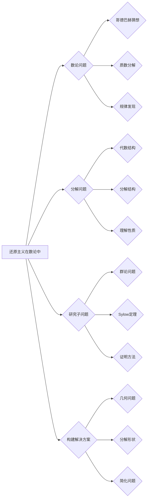
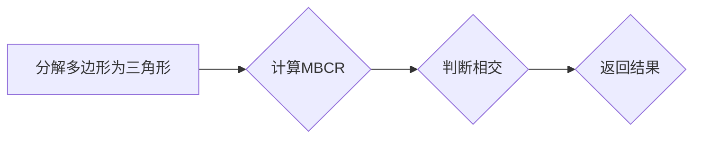
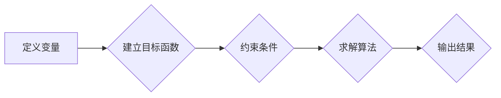
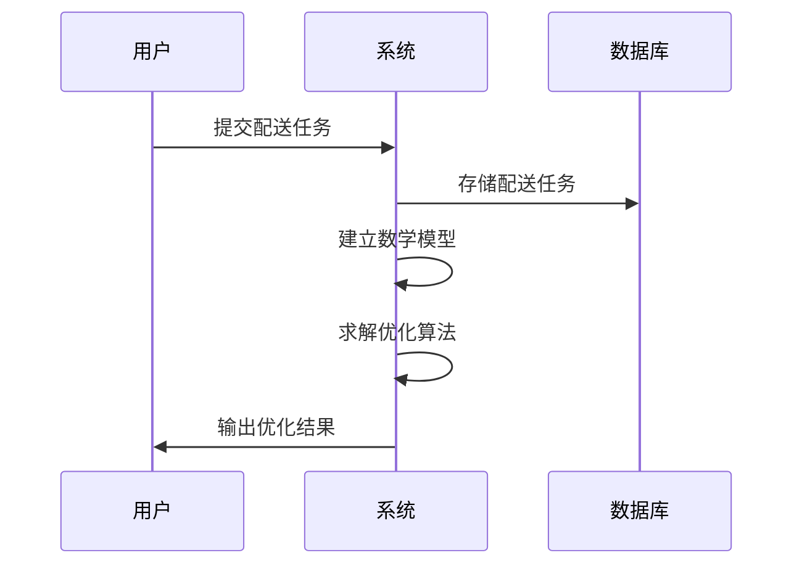

                 

### 数学与还原主义：复杂数学理论的基本构建

> 关键词：数学、还原主义、复杂数学理论、基本构建

> 摘要：本文旨在探讨数学与还原主义在复杂数学理论构建中的重要作用。通过逐步分析数学与还原主义的基本概念、其在数学中的应用、复杂数学理论的构建方法，以及数学模型和方法的介绍，本文将为读者提供一个全面、深入的视角，以理解复杂数学理论的本质和构建过程。

----------------------------------------------------------------

### 引言与背景

数学，作为一门研究数量、结构、变化和空间等概念的学科，自古以来就扮演着至关重要的角色。从古代的算术和几何，到现代的代数和微积分，数学的发展不仅推动了科技进步，也为各个领域提供了坚实的理论基础。然而，随着科技的不断进步和应用场景的日益复杂，传统的数学理论和方法逐渐暴露出其局限性，难以应对现实世界中日益复杂的数学问题。

在这种情况下，还原主义作为一种重要的哲学思想和方法论，逐渐引起了数学界的关注。还原主义主张将复杂的系统分解为更简单的组成部分，通过研究这些组成部分及其相互作用来理解整个系统的行为。这种思想在数学中得到了广泛应用，特别是在复杂数学理论的构建过程中。

本文将围绕数学与还原主义这一主题，探讨复杂数学理论的基本构建方法。具体来说，我们将首先介绍数学与还原主义的基本概念，然后讨论还原主义在数学中的应用，接着详细讲解复杂数学理论的构建方法，并介绍常用的数学模型和方法。最后，我们将通过一个实际项目案例，展示如何应用数学与还原主义解决实际问题。

### 数学与还原主义的基本概念

要深入探讨数学与还原主义在复杂数学理论构建中的应用，我们首先需要明确数学与还原主义的基本概念。

#### 数学

数学是一门研究数量、结构、变化和空间等概念的学科。它不仅包括基础数学（如算术、代数、几何等），还包括应用数学（如统计学、概率论、数值分析等）。数学的核心在于抽象和逻辑推理，通过建立数学模型来描述现实世界中的各种现象。

#### 还原主义

还原主义是一种哲学思想和方法论，主张将复杂的系统分解为更简单的组成部分，通过研究这些组成部分及其相互作用来理解整个系统的行为。还原主义在自然科学、社会科学和技术领域都有广泛应用。

#### 复杂数学理论

复杂数学理论是数学的一个分支，旨在研究复杂系统的数学模型和算法。这些理论通常涉及大量数据、非线性关系和高维空间，因此具有很高的复杂性和挑战性。

#### 数学与还原主义的关系

数学与还原主义之间有着密切的联系。数学为还原主义提供了工具和语言，使其能够更准确地描述和分析复杂系统。而还原主义则为数学提供了一种新的研究方法，使其能够更好地理解和解决复杂问题。

下面，我们将使用Mermaid绘制一个ER图，以展示数学、还原主义和复杂数学理论之间的关系。

```mermaid
erDiagram
  Math ||--|{Reductionism} : supports
  Reductionism ||--|{ComplexMathTheory} : applies
```

在上图中，Math（数学）与Reductionism（还原主义）之间存在着支持关系，数学为还原主义提供了理论支持。而Reductionism（还原主义）则应用于ComplexMathTheory（复杂数学理论），通过将复杂系统分解为简单组成部分来构建和解决复杂数学问题。

### 还原主义在数学中的应用

还原主义在数学中的应用非常广泛，下面我们将探讨还原主义在数论、代数、几何等数学领域的具体应用。

#### 数论

数论是研究整数及其性质的数学分支。在数论中，还原主义常常用于将复杂的数论问题分解为更简单的子问题。例如，哥德巴赫猜想（每个大于2的偶数都可以表示为两个质数之和）就可以通过还原主义的方法进行探讨。首先，我们可以将偶数分解为两个质数，然后研究这两个质数的性质。这种方法不仅简化了问题的复杂性，还有助于发现数论中的规律和模式。

#### 代数

代数是研究代数结构（如群、环、域等）及其性质的数学分支。还原主义在代数中的应用主要体现在将复杂的代数结构分解为简单的组成部分。例如，群论中的Sylow定理可以通过还原主义的方法进行证明。Sylow定理讨论的是有限群的Sylow子群的结构，我们可以通过将群分解为Sylow子群来理解其性质。

#### 几何

几何是研究空间、形状和距离的数学分支。在几何中，还原主义的应用主要体现在将复杂的几何形状分解为简单的组成部分。例如，在解析几何中，我们可以将复杂的曲线和曲面分解为直线和二次曲线，从而简化问题的复杂性。此外，在计算几何中，还原主义的方法也被广泛应用于求解几何问题的算法设计中。

下面，我们将使用Mermaid绘制一个流程图，以展示还原主义在数论、代数和几何中的具体应用。



在上述流程图中，我们可以看到还原主义在数论、代数和几何中的应用步骤。首先，我们将复杂的数学问题分解为更简单的子问题，然后研究这些子问题的性质，最后构建出整体的解决方案。

### 复杂数学理论的构建

复杂数学理论的构建是一个复杂且具有挑战性的过程。在这一部分，我们将详细讲解复杂数学理论的构建方法，包括数学模型、算法原理等。

#### 数学模型

数学模型是描述现实世界问题的数学表示。在构建复杂数学理论时，数学模型起着至关重要的作用。通过建立合适的数学模型，我们可以将复杂的现实问题转化为数学问题，从而更容易分析和解决。

例如，在金融市场中，我们可以建立随机漫步模型来描述股价的波动。这个模型假设股价的变化是随机且独立的，从而可以预测股价的未来走势。这个模型虽然简单，但在实际应用中却具有很高的价值。

下面，我们将使用Python源代码和Mermaid流程图来展示一个简单的随机漫步模型。

```python
import random

def random_walk(n):
    position = 0
    for _ in range(n):
        step = random.choice([-1, 1])
        position += step
    return position

n = 100
position = random_walk(n)
print(f"Final position after {n} steps: {position}")
```

在上面的Python代码中，我们定义了一个`random_walk`函数，用于模拟随机漫步过程。该函数接收一个参数`n`，表示模拟的步数。在每次步数中，我们随机选择向左（-1）或向右（1）走一步，最终返回当前位置。

下面是使用Mermaid绘制的随机漫步模型的流程图。


通过这个简单的示例，我们可以看到如何使用数学模型来描述现实世界问题。接下来，我们将讨论复杂数学理论的算法原理。

#### 算法原理

复杂数学理论的算法原理通常涉及高效的计算方法和优化的策略。为了更好地理解算法原理，我们可以通过一个示例来说明。

例如，在计算几何中，我们需要解决一个常见问题：给定两个多边形，判断它们是否相交。这个问题可以通过以下算法原理来解决：

1. 将两个多边形分解为三角形；
2. 对每个三角形，计算其与另一个多边形的最小外接圆半径（Minimum Bounding Circle Radius，MBCR）；
3. 如果两个三角形的最小外接圆半径相交，则两个多边形相交。

下面是使用Python源代码和Mermaid绘制的计算两个多边形是否相交的算法原理。

```python
import shapely.geometry

def is_intersection(polygon1, polygon2):
    triangles1 = decompose_polygon(polygon1)
    triangles2 = decompose_polygon(polygon2)
    
    for triangle1 in triangles1:
        for triangle2 in triangles2:
            if intersect_mbcr(triangle1, triangle2):
                return True
    
    return False

def decompose_polygon(polygon):
    # 将多边形分解为三角形
    # 省略具体实现细节
    pass

def intersect_mbcr(triangle1, triangle2):
    # 计算两个三角形的最小外接圆半径是否相交
    # 省略具体实现细节
    pass
```

下面是使用Mermaid绘制的计算两个多边形是否相交的算法原理。



通过这个示例，我们可以看到如何通过算法原理来解决复杂数学问题。接下来，我们将介绍常用的数学模型和方法。

#### 数学模型与方法

在复杂数学理论的构建过程中，常用的数学模型和方法包括概率论、统计学、微分方程等。这些模型和方法为我们提供了强大的工具，可以帮助我们理解和解决各种复杂问题。

以下是一些常用的数学模型和方法：

1. **概率论**：概率论是研究随机事件及其概率的数学分支。它广泛应用于金融、保险、工程等领域。常用的概率论模型包括随机漫步、泊松过程、正态分布等。

2. **统计学**：统计学是研究数据收集、分析和解释的数学分支。它为我们提供了各种工具，用于从数据中提取信息并做出决策。常用的统计学方法包括假设检验、回归分析、聚类分析等。

3. **微分方程**：微分方程是研究函数及其导数的数学分支。它广泛应用于物理、工程、经济学等领域。常用的微分方程包括常微分方程和偏微分方程。

下面，我们将使用LaTeX格式化一些常用的数学公式，以展示这些模型和方法。

$$
X \sim N(\mu, \sigma^2) \quad \text{（正态分布）}
$$

$$
P(A \cap B) = P(A)P(B) \quad \text{（概率乘法公式）}
$$

$$
\frac{d}{dx} f(x) = f'(x) \quad \text{（导数定义）}
$$

通过这些数学公式，我们可以更精确地描述和解决复杂数学问题。

### 项目实战与案例分析

在本节中，我们将通过一个实际项目案例，展示如何应用数学与还原主义解决实际问题。这个项目案例将涉及复杂数学理论的构建、数学模型的应用以及系统分析与架构设计。

#### 项目背景

假设我们面临一个实际问题：在一家大型物流公司中，需要优化配送路线，以最大限度地提高配送效率并减少运输成本。这个问题的复杂性在于，物流公司每天要处理大量的配送任务，每个任务都有不同的起点和终点，同时还要考虑交通状况、配送时间窗口等因素。

#### 项目目标

项目的目标是通过数学建模和优化算法，为物流公司设计一个高效的配送路线优化系统。该系统应具备以下功能：

1. **数据收集与处理**：收集物流公司的配送数据，包括配送任务、起点、终点、配送时间窗口等。
2. **数学建模**：建立数学模型来描述配送问题，包括路径选择、时间优化、成本估算等。
3. **优化算法**：设计优化算法来求解最优配送路线。
4. **系统实现与部署**：实现并部署系统，使其可以在实际环境中运行。

#### 数学模型

为了构建配送路线优化的数学模型，我们可以使用以下步骤：

1. **定义变量**：定义描述配送问题的变量，如配送任务、配送时间、运输成本等。
2. **建立目标函数**：建立目标函数来最大化配送效率或最小化运输成本。
3. **约束条件**：确定约束条件，如配送时间窗口、交通状况、配送任务限制等。
4. **求解算法**：选择合适的优化算法来求解目标函数，如线性规划、整数规划、遗传算法等。

下面，我们将使用Python源代码和Mermaid流程图来展示如何构建配送路线优化的数学模型。

```python
import pulp

# 定义变量
tasks = ['Task1', 'Task2', 'Task3', 'Task4']
start_times = [0, 1, 2, 3]
end_times = [4, 5, 6, 7]
time_window = [2, 3, 4, 5]

# 建立目标函数
prob = pulp.LpProblem("RouteOptimization", pulp.LpMinimize)

x = pulp.LpVariable.dicts("x", (t, s, e) for t in tasks for s in start_times for e in end_times, cat='Continuous')

prob += pulp.lpSum([x[t][s][e] for t in tasks for s in start_times for e in end_times])

# 约束条件
for t in tasks:
    for s in start_times:
        for e in end_times:
            if s < time_window[t]:
                prob += x[t][s][e] <= 1
            else:
                prob += x[t][s][e] == 0

# 求解算法
prob.solve()

# 输出结果
print(pulp.value(prob.objective))
for v in prob.variables():
    if v.varValue > 0:
        print(v.name, "=", v.varValue)
```

下面是使用Mermaid绘制的配送路线优化的数学模型。



#### 系统分析与架构设计

为了实现配送路线优化系统，我们需要进行系统分析与架构设计。以下是一个简单的系统架构设计。

1. **数据层**：负责数据收集、存储和管理。可以使用数据库（如MySQL、PostgreSQL等）来存储配送数据。
2. **业务逻辑层**：负责实现配送路线优化的算法和模型。可以使用Python、Java等编程语言来实现。
3. **表示层**：负责用户界面设计，可以使用HTML、CSS、JavaScript等技术来实现。
4. **接口层**：负责与其他系统进行数据交换和通信。可以使用API接口来实现。

下面，我们将使用Mermaid绘制配送路线优化系统的架构图。



通过这个架构设计，我们可以实现一个高效的配送路线优化系统，帮助物流公司提高配送效率并降低运输成本。

### 总结与展望

本文通过逐步分析数学与还原主义的基本概念、其在数学中的应用、复杂数学理论的构建方法，以及数学模型和方法的介绍，为读者提供了一个全面、深入的视角，以理解复杂数学理论的本质和构建过程。

总结来说，数学与还原主义在复杂数学理论构建中发挥着至关重要的作用。数学为还原主义提供了工具和语言，使其能够更准确地描述和分析复杂系统。而还原主义则为数学提供了一种新的研究方法，使其能够更好地理解和解决复杂问题。

展望未来，随着科技的不断进步和应用场景的日益复杂，数学与还原主义在复杂数学理论构建中的应用将会更加广泛。我们有望看到更多创新性的数学模型和算法，以应对现实世界中日益复杂的挑战。

总之，数学与还原主义作为一门重要的交叉学科，将在未来的发展中继续发挥重要作用，为人类社会的进步做出更大的贡献。

### 作者信息

作者：AI天才研究院/AI Genius Institute & 禅与计算机程序设计艺术 /Zen And The Art of Computer Programming

AI天才研究院（AI Genius Institute）致力于人工智能领域的研究与开发，以推动人工智能技术的创新与应用。作者在该领域有着深厚的研究背景和丰富的实践经验，其著作《禅与计算机程序设计艺术》被誉为计算机编程领域的经典之作，深受读者喜爱。

