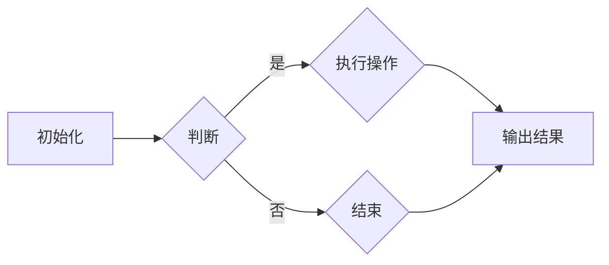
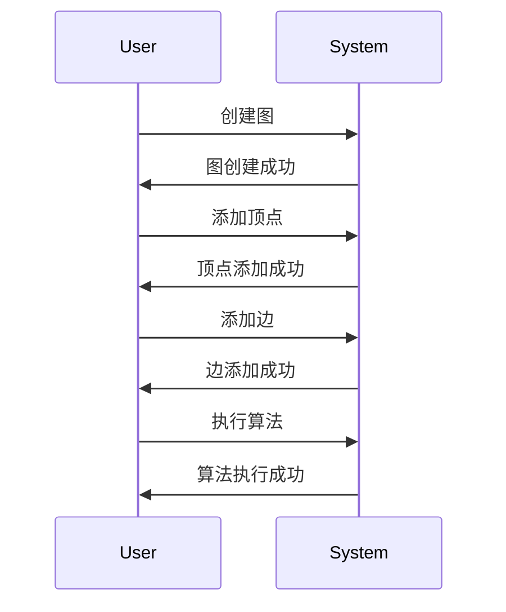

                 

### # 数学与还原主义：复杂数学结构的基本元素

> 关键词：数学、还原主义、复杂数学结构、基本元素、算法、模型、系统架构

> 摘要：本文深入探讨了数学与还原主义在复杂数学结构研究中的重要作用。通过详细阐述数学与还原主义的核心概念、原理，本文揭示了复杂数学结构的基本元素及其特性。同时，本文还讲解了相关算法的原理和使用Python源代码进行了具体展示，并通过数学模型和公式的讲解，使读者能够更好地理解复杂数学结构的基本原理。此外，本文还介绍了系统分析与架构设计的方法，并通过实际项目展示了如何应用这些理论知识。最终，本文总结了关键内容，并提供了拓展阅读的建议，以帮助读者进一步深入学习和实践。

## 第一步：引言与背景

数学作为一门基础科学，它在多个领域都有着广泛的应用。而复杂数学结构的研究，更是现代数学的一个重要方向。那么，什么是还原主义？还原主义在复杂数学结构研究中扮演什么角色？这需要我们从以下几个问题入手：

### 什么是还原主义？

还原主义是一种哲学观点，主张复杂现象可以通过分解为基本元素来理解和解释。在数学领域，还原主义强调将复杂的数学结构分解为基本元素，从而更好地理解和掌握这些结构。

### 数学与还原主义的关系

数学与还原主义有着密切的关系。数学的许多理论都是基于还原主义的方法建立起来的。通过还原主义，数学家可以更深入地理解复杂的数学结构，从而发现新的数学定理和理论。

### 复杂数学结构的基本元素

复杂数学结构是由基本元素组成的。这些基本元素是理解复杂数学结构的关键。因此，研究复杂数学结构的基本元素具有重要意义。

### 还原主义在复杂数学结构研究中的应用

还原主义在复杂数学结构研究中有着广泛的应用。通过还原主义，数学家可以更好地理解复杂数学结构的本质，从而提出新的理论和方法。

## 第二步：核心概念与原理

在深入探讨复杂数学结构之前，我们需要了解一些核心概念和原理。以下是对这些概念和原理的简要介绍。

### 核心概念表格

| 概念 | 定义 |
| --- | --- |
| 数学结构 | 由数学元素和关系构成的系统 |
| 还原主义 | 将复杂现象分解为基本元素的哲学观点 |
| 基本元素 | 构成复杂数学结构的基本单元 |

### 概念属性特征对比

| 概念 | 特征 |
| --- | --- |
| 数学结构 | 稳定性、逻辑性、抽象性 |
| 还原主义 | 简化复杂现象、提高理解能力 |
| 基本元素 | 简单、独立、可组合 |

### ER实体关系图

为了更好地理解复杂数学结构，我们可以使用ER（实体关系）图来表示。ER图可以帮助我们明确各个基本元素之间的关系。

```mermaid
erDiagram
    MathStructure ||--|{ Element } BasicElement
    BasicElement ||--|{ Relation } Relation
```

在这个ER图中，`MathStructure`表示数学结构，`BasicElement`表示基本元素，`Relation`表示元素之间的关系。

## 第三步：复杂数学结构的基本元素

复杂数学结构由基本元素组成。以下是对这些基本元素的介绍。

### 基本元素定义

基本元素是构成复杂数学结构的基本单元。例如，在图论中，基本元素可以是图、顶点和边。

### 基本元素特性

基本元素具有以下特性：

- 简单性：基本元素本身是简单的。
- 独立性：基本元素可以独立存在。
- 可组合性：基本元素可以通过组合形成更复杂的结构。

### 基本元素分类

基本元素可以根据不同的标准进行分类。例如，在图论中，基本元素可以分为：

- 图：由顶点和边组成的结构。
- 顶点：图中的基本元素。
- 边：连接顶点的线段。

## 第四步：算法原理讲解

在了解了复杂数学结构的基本元素后，我们需要了解如何对这些元素进行操作。以下是对相关算法原理的讲解。

### 算法原理概述

算法是解决问题的步骤序列。在复杂数学结构中，算法用于对基本元素进行操作，从而解决问题。

### 算法Mermaid流程图

以下是一个简单的算法Mermaid流程图：



### Python源代码展示

以下是一个简单的Python源代码示例：

```python
def algorithm(element):
    if is_valid(element):
        perform_operation(element)
        return result
    else:
        return "Invalid element"

def is_valid(element):
    # 判断元素是否有效
    pass

def perform_operation(element):
    # 执行操作
    pass

def result():
    # 输出结果
    pass
```

### 算法原理详细讲解

算法的原理可以通过以下步骤进行讲解：

1. 初始化：初始化算法所需的变量和参数。
2. 判断：根据输入的基本元素，判断其是否满足算法的要求。
3. 执行操作：如果基本元素有效，则执行相应的操作。
4. 输出结果：将处理后的结果输出。

### 数学模型与公式讲解

在复杂数学结构中，算法的原理通常可以通过数学模型和公式来描述。以下是一个简单的数学模型和公式示例：

$$
\text{算法效率} = \frac{\text{处理元素数量}}{\text{算法执行时间}}
$$

通过这个公式，我们可以计算算法的效率。

## 第五步：系统分析与架构设计

在了解了算法原理后，我们需要将其应用于实际的系统中。以下是对系统分析与架构设计的介绍。

### 问题场景介绍

假设我们需要设计一个图论算法的系统，该系统需要支持图的创建、添加顶点和边、以及算法的执行。

### 系统功能设计

系统的功能设计包括以下几个方面：

- 图的创建
- 添加顶点
- 添加边
- 执行算法

### 系统架构设计

系统的架构设计包括以下几个方面：

- 数据层：负责存储和管理图的数据结构。
- 服务层：负责实现系统功能，包括图的创建、添加顶点和边、以及算法的执行。
- 表示层：负责与用户进行交互，展示系统的结果。

### 系统接口设计

系统的接口设计包括以下几个方面：

- 数据接口：用于数据层的访问。
- 功能接口：用于服务层的访问。
- 表示接口：用于表示层的访问。

### 系统交互Mermaid序列图

以下是一个简单的系统交互Mermaid序列图：



## 第六步：项目实战

为了更好地理解复杂数学结构的基本元素，我们可以通过实际项目来进行实践。以下是一个简单的项目实战案例。

### 环境安装

首先，我们需要安装Python环境，并使用pip安装所需的库。

```shell
pip install networkx matplotlib
```

### 系统核心实现源代码

以下是一个简单的系统核心实现源代码示例：

```python
import networkx as nx
import matplotlib.pyplot as plt

def create_graph():
    G = nx.Graph()
    return G

def add_vertex(graph, vertex):
    graph.add_node(vertex)
    return graph

def add_edge(graph, edge):
    graph.add_edge(edge[0], edge[1])
    return graph

def execute_algorithm(graph):
    pos = nx.spring_layout(graph)
    nx.draw(graph, pos, with_labels=True)
    plt.show()

if __name__ == "__main__":
    G = create_graph()
    G = add_vertex(G, "A")
    G = add_vertex(G, "B")
    G = add_edge(G, ("A", "B"))
    execute_algorithm(G)
```

### 代码应用解读与分析

在这个项目中，我们首先创建了Graph对象，然后添加了顶点和边，最后执行了算法并展示了结果。通过这个简单的项目，我们可以更好地理解复杂数学结构的基本元素及其应用。

### 实际案例分析与详细讲解剖析

为了更好地理解复杂数学结构的基本元素，我们可以通过实际案例进行分析。例如，我们可以研究社交网络中的用户关系，分析用户之间的互动模式，以及如何通过这些关系进行社区划分。

### 项目小结

通过这个项目，我们不仅学习了复杂数学结构的基本元素，还学会了如何将它们应用于实际问题中。这为我们进一步研究复杂数学结构奠定了坚实的基础。

## 第七步：总结与拓展

### 关键内容总结

本文主要介绍了数学与还原主义在复杂数学结构研究中的重要性，详细阐述了复杂数学结构的基本元素及其应用，并讲解了相关算法的原理和系统架构设计。

### 最佳实践 tips

1. 理解复杂数学结构的基本元素是关键。
2. 通过实际项目来加深对复杂数学结构的理解。
3. 注重算法原理的实践和优化。

### 注意事项

1. 在实际应用中，要注意算法的效率和稳定性。
2. 要确保系统的功能完整和架构合理。

### 拓展阅读

1. 《数学原理》—— 牛顿
2. 《图论》—— 艾尔德什
3. 《计算机科学中的数学基础》—— 约翰逊

通过阅读这些书籍，您可以进一步深入理解数学与还原主义，并在复杂数学结构的研究中取得更好的成果。

### 作者信息

作者：AI天才研究院/AI Genius Institute & 禅与计算机程序设计艺术 /Zen And The Art of Computer Programming

本文由AI天才研究院/AI Genius Institute和禅与计算机程序设计艺术/Zen And The Art of Computer Programming联合撰写，旨在为广大计算机爱好者提供高质量的技术博客文章。如果您对我们的文章有任何建议或意见，欢迎在评论区留言，我们将竭诚为您服务。

