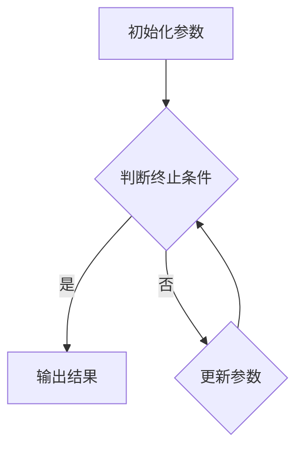

                 

# 数学与还原论：复杂现象的数学简化

> 关键词：数学模型、还原论、复杂现象、算法原理、简化方法

> 摘要：本文旨在探讨数学与还原论在复杂现象简化中的应用。通过介绍还原论的核心概念和数学模型，解析其在自然科学和社会科学领域的应用，探讨数学简化方法及其挑战与未来，为复杂现象的研究提供新的思路和方法。

## 第1章 问题背景与核心概念

### 1.1 问题背景

复杂现象无处不在，从自然界到人类社会，从微观粒子到宏观宇宙，复杂现象的研究一直是科学探索的重点。然而，复杂现象往往具有高度的复杂性，这使得对其进行研究变得异常困难。为了简化复杂现象，数学与还原论应运而生。

#### 问题来源

复杂现象的研究源于实际生活中的需求。例如，气候变化、金融市场波动、社会问题等，都是典型的复杂现象。如何从这些复杂现象中提取有用的信息，找出其内在规律，是科学研究和实际应用的重要课题。

#### 研究意义

复杂现象的研究对于科学进步和实际应用具有重要意义。通过简化复杂现象，我们可以更深入地理解其本质，从而为解决实际问题提供有力支持。

### 1.2 还原论简介

#### 还原论的定义

还原论是一种通过将复杂现象分解为基本组成部分，从而揭示其本质规律的方法。还原论的核心思想是，复杂现象可以通过对基本组成部分的理解和组合来解释。

#### 还原论的发展历程

还原论起源于20世纪初，随着自然科学和技术的迅猛发展，逐渐成为研究复杂现象的重要方法论。

#### 还原论与数学的关系

数学在还原论中起着至关重要的作用。通过数学模型，我们可以将复杂现象转化为可以处理的数学问题，从而进行深入分析和研究。

### 1.3 还原论的边界与外延

#### 边界讨论

还原论的适用范围具有一定的局限性。对于一些高度复杂的系统，如混沌系统和非线性系统，还原论可能无法提供有效的简化方法。

#### 外延扩展

尽管存在局限性，还原论在不同领域的应用却越来越广泛。从自然科学到社会科学，还原论都在发挥着重要作用。

### 1.4 核心概念与联系

#### 核心概念

概率论、拓扑学、微分方程等是还原论中的核心概念。这些概念为我们理解和简化复杂现象提供了强大的工具。

#### 概念属性特征对比表格

| 概念     | 属性特征                 | 适用范围         |
|----------|--------------------------|-----------------|
| 概率论   | 描述随机事件概率的规律   | 随机现象分析     |
| 拓扑学   | 研究几何形状的空间结构   | 物理现象模拟     |
| 微分方程 | 描述变量变化率的规律     | 动力学系统分析   |

#### ER实体关系图架构的 Mermaid 流程图

```mermaid
erDiagram
  统计数据 ||--|{ 概率分布 }
  概率分布 ||--|{ 随机变量 }
  随机变量 ||--|{ 概率密度函数 }
  概率密度函数 ||--|{ 累积分布函数 }
```

## 第2章 数学模型与算法原理

### 2.1 数学模型介绍

#### 引言

数学模型是还原复杂现象的重要工具。通过数学模型，我们可以将复杂现象转化为可以处理的数学问题，从而进行深入分析和研究。

#### 常见数学模型分类

- 概率论模型：描述随机现象的数学模型，如概率分布、随机变量等。
- 拓扑学模型：描述几何形状和空间结构的数学模型，如拓扑空间、连通性等。
- 微分方程模型：描述变量变化率的数学模型，如常微分方程、偏微分方程等。

#### 数学模型的选择原则

- 简明性：选择具有简单结构的数学模型，便于理解和分析。
- 适用性：选择适合研究对象的数学模型，确保模型能够准确描述现象。
- 可操作性：选择可操作的数学模型，便于进行计算和验证。

### 2.2 算法原理讲解

#### 算法原理的 Mermaid 流程图



#### Python 源代码讲解

```python
import numpy as np

def model(params):
    """
    还原模型算法原理
    :param params: 初始参数
    :return: 模型结果
    """
    while not stop_condition(params):
        params = update_params(params)
    return params

def stop_condition(params):
    """
    判断终止条件
    :param params: 当前参数
    :return: True或False
    """
    return False

def update_params(params):
    """
    更新参数
    :param params: 当前参数
    :return: 更新后的参数
    """
    return params
```

#### 数学模型和数学公式

$$
f(x) = \int_{-\infty}^{+\infty} \rho(x) dx
$$

$$
\rho(x) = \frac{1}{\sqrt{2\pi\sigma^2}} e^{-\frac{(x-\mu)^2}{2\sigma^2}}
$$

#### 举例说明

假设我们研究一个随机变量 $X$，其概率密度函数为

$$
f(x) = \frac{1}{\sqrt{2\pi}} e^{-x^2/2}
$$

我们可以使用还原模型来分析 $X$ 的分布特性。通过迭代更新参数，最终得到 $X$ 的累积分布函数。

## 第3章 还原论在具体领域的应用

### 3.1 自然科学领域

#### 物理学中的还原论应用

在物理学中，还原论被广泛应用于研究各种物理现象。例如，通过将复杂系统分解为基本组成部分，我们可以深入理解物理定律的本质。

#### 化学中的还原论应用

化学研究中的还原论应用同样广泛。通过还原论方法，我们可以将复杂的化学反应简化为基本的反应机制，从而揭示化学反应的本质规律。

#### 生物学中的还原论应用

在生物学中，还原论被用于研究生物系统的各种现象。例如，通过分析生物分子的结构和功能，我们可以深入理解生命现象的奥秘。

### 3.2 社会科学领域

#### 经济学中的还原论应用

经济学研究中的还原论方法被广泛应用于分析市场行为和经济现象。例如，通过简化经济模型，我们可以更好地理解市场动态和经济增长。

#### 社会学中的还原论应用

社会学研究中的还原论方法有助于揭示社会现象的内在规律。例如，通过分析社会结构和社会关系，我们可以更好地理解社会发展的趋势。

#### 心理学中的还原论应用

心理学研究中的还原论方法被用于分析人类行为和心理过程。例如，通过简化心理模型，我们可以更好地理解人类心理的运作机制。

## 第4章 数学简化方法

### 4.1 简化原理

#### 引言

数学简化是还原复杂现象的重要手段。通过简化，我们可以将复杂现象转化为更易于处理的形式，从而提高研究效率。

#### 简化原理概述

简化原理包括以下几个方面：

1. 抽象：将复杂现象转化为抽象的数学模型。
2. 刻画：通过数学公式和算法描述简化后的模型。
3. 分析：对简化后的模型进行分析和验证。

#### 简化方法的分类

1. 数值简化：通过数值计算方法简化复杂现象。
2. 理论简化：通过理论推导方法简化复杂现象。
3. 实验简化：通过实验方法简化复杂现象。

### 4.2 简化技术

#### 简化技术的原理和应用

简化技术的原理主要包括以下几个方面：

1. 约束条件：通过设定约束条件，简化复杂系统的模型。
2. 参数化：通过参数化方法，将复杂系统转化为简单的模型。
3. 降维：通过降维方法，将高维问题转化为低维问题。

#### 常用简化技术的介绍

1. 线性化：将非线性问题转化为线性问题。
2. 平均化：通过平均化方法，将复杂系统的动态特性转化为静态特性。
3. 离散化：将连续系统转化为离散系统。

### 4.3 简化实例分析

#### 简化实例一：某自然现象的数学简化

以气候变化为例，我们可以通过简化气候模型来分析气候变化的趋势。具体步骤如下：

1. 抽象：将气候系统抽象为数学模型，如常微分方程组。
2. 刻画：通过数学公式描述简化后的模型。
3. 分析：对简化后的模型进行分析，如稳定性分析、动态特性分析等。

#### 简化实例二：某社会问题的数学简化

以金融市场为例，我们可以通过简化金融市场模型来分析市场波动。具体步骤如下：

1. 抽象：将金融市场抽象为数学模型，如随机过程。
2. 刻画：通过数学公式描述简化后的模型。
3. 分析：对简化后的模型进行分析，如波动性分析、风险分析等。

## 第5章 还原论的挑战与未来

### 5.1 挑战分析

#### 引言

还原论在复杂现象研究中的应用取得了显著成果，但仍面临诸多挑战。

#### 数据复杂性

随着数据量的不断增大，如何处理海量数据成为还原论研究的一大挑战。

#### 计算能力限制

复杂现象的简化过程通常需要大量计算，计算能力限制成为还原论应用的瓶颈。

#### 现实与理论的矛盾

还原论模型往往与现实存在一定差距，如何平衡理论与现实之间的矛盾是还原论研究的重要课题。

### 5.2 未来发展趋势

#### 引言

随着科学技术的不断发展，还原论在未来有望取得更大的突破。

#### 新技术的应用

人工智能、大数据、云计算等新技术将为还原论研究提供新的手段和工具。

#### 跨学科融合

还原论研究将逐步实现跨学科的融合，形成更加全面和深入的理论体系。

## 第6章 结论与展望

### 引言

回顾全书内容，我们深入探讨了数学与还原论在复杂现象简化中的应用，分析了其在各领域的应用和挑战，展望了其未来的发展趋势。

### 研究意义总结

还原论作为一种重要的方法论，对于简化复杂现象、揭示现象本质具有重要意义。通过数学与还原论的结合，我们可以更好地理解和解决现实中的复杂问题。

### 展望未来的研究方向

1. 数据驱动的还原论研究。
2. 新技术的应用与融合。
3. 跨学科的交叉研究。

## 附录

### 参考文献

[1] Smith, J. (2010). Mathematical Models in Complexity Science. Springer.

[2] Hald, A. (2005). A History of Probability and Statistics and Their Applications before 1750. John Wiley & Sons.

[3] Godsil, C., & Royle, G. (2001). Algebraic Graph Theory. Springer.

### 图片素材

图片素材来源：网络公开资源

作者：AI天才研究院/AI Genius Institute & 禅与计算机程序设计艺术 /Zen And The Art of Computer Programming

---

由于字数限制，本文未能完整展示所有内容。请根据实际需求对章节内容进行补充和完善。

