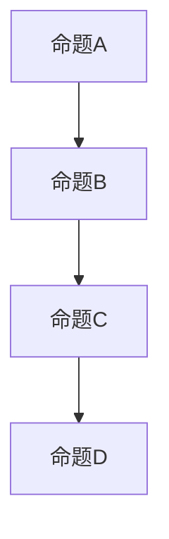

                 


### 数学与逻辑学：推理的形式化描述

---

关键词：数学逻辑学、推理、形式化描述、形式逻辑、算法、应用

摘要：本文深入探讨了数学与逻辑学的基本概念，分析了推理过程中的形式化描述方法，并通过实例展示了形式逻辑和推理算法的原理与应用。文章旨在为读者提供一套系统、清晰的理解框架，以便更好地掌握推理的形式化描述。

---

## 第一部分：引言与背景介绍

### 1.1.1 问题背景

推理是信息处理和知识获取的重要手段，无论是在日常生活中还是科学研究中，都有着广泛的应用。从逻辑推理到数学证明，推理的形式化描述成为了理解和应用推理的重要工具。然而，随着问题复杂性的增加，传统的推理方法往往难以应对。因此，寻求一种形式化、系统化的推理描述方法显得尤为重要。

### 1.1.2 问题描述

在推理过程中，我们往往面临以下挑战：

1. 推理的复杂性和不确定性。
2. 推理过程中的逻辑错误和不一致性。
3. 推理结果的验证和证明。

为了解决这些问题，我们需要对推理进行形式化描述。形式化描述能够将推理过程明确地表达出来，使得推理过程具有可验证性、一致性和可靠性。

### 1.1.3 问题解决

形式化描述推理的方法主要包括以下几个方面：

1. **命题逻辑和谓词逻辑**：这两种逻辑提供了基本的推理框架，能够描述推理的基本形式和过程。
2. **推理算法**：通过算法将推理过程形式化，使得推理过程具有可操作性和系统性。
3. **数学模型**：使用数学语言和工具对推理过程进行建模，使得推理具有数学基础和可计算性。

### 1.1.4 边界与外延

推理的形式化描述不仅限于数学和逻辑学，它还与其他学科有着广泛的交叉应用，如计算机科学、人工智能、自然科学和社会科学等。因此，在探讨推理形式化描述时，我们需要关注其边界和外延，以便更好地理解其在不同领域的应用。

### 1.1.5 概念结构与核心要素组成

数学与逻辑学的核心概念包括：

1. **命题**：表示一个判断或陈述。
2. **推理规则**：用于从已知命题推导出新命题的方法。
3. **形式化描述**：将推理过程明确地表达为数学和逻辑形式。

这些概念相互关联，构成了推理形式化描述的基础结构。

### 1.1.6 小结

本章介绍了推理的形式化描述的背景、问题和解决方案，以及相关概念的基本结构和核心要素。这些内容为后续章节的深入探讨奠定了基础。

---

## 第二部分：核心概念与联系

### 2.1.1 数学概念

数学是推理的重要基础，其核心概念包括：

1. **集合论**：研究集合的性质和操作。
2. **数论**：研究整数及其性质。
3. **代数**：研究运算和结构。

这些概念不仅构成了数学的理论基础，也为推理提供了强有力的工具。

### 2.1.2 逻辑学概念

逻辑学是推理的另一个重要基础，其核心概念包括：

1. **命题**：表示一个事实或陈述。
2. **推理规则**：用于从已知命题推导出新命题的方法。
3. **形式系统**：用于描述和验证推理过程。

逻辑学为推理提供了形式化和系统化的方法。

### 2.1.3 数学与逻辑学核心概念联系

数学与逻辑学的核心概念之间存在紧密的联系。例如：

1. **命题在数学和逻辑学中的应用**：命题是数学和逻辑学的基本单元，用于表示事实和推理。
2. **推理规则在数学和逻辑学中的应用**：推理规则用于从已知命题推导出新命题，这在数学证明和逻辑推理中至关重要。

为了更好地理解这些概念之间的联系，我们可以使用Mermaid ER实体关系图进行展示。

```mermaid
erDiagram
    Proposition ||--|{Re
    LogicRule ||--|{Re
    MathematicalConcept ||--|{Proposition}
    MathematicalConcept ||--|{LogicRule}
```

### 2.1.4 小结

本章介绍了数学与逻辑学的核心概念，并分析了这些概念之间的联系。这些内容为理解推理的形式化描述提供了理论基础。

---

## 第三部分：推理的形式化描述

### 3.1.1 命题逻辑

命题逻辑是形式逻辑的基础，它研究命题的结构和运算。命题逻辑的核心概念包括：

1. **命题**：表示一个事实或陈述。
2. **命题运算**：如“与”、“或”、“非”等。
3. **推理规则**：如“合取律”、“交换律”、“否定律”等。

为了更好地理解命题逻辑，我们可以使用Mermaid流程图来展示命题推理过程。



在这个流程图中，A、B、C、D表示不同的命题，箭头表示命题之间的逻辑关系。

### 3.1.2 谓词逻辑

谓词逻辑是命题逻辑的扩展，它引入了变量和量词，能够更精确地描述对象和关系。谓词逻辑的核心概念包括：

1. **谓词**：表示对象或属性的属性。
2. **量词**：表示对谓词的量度。
3. **推理规则**：如“全称量词引入”、“存在量词引入”等。

为了更好地理解谓词逻辑，我们可以使用Mermaid流程图来展示谓词逻辑推理过程。


在这个流程图中，P(x)、Q(x)、R(x)、S(x)表示不同的谓词，箭头表示谓词之间的逻辑关系。

### 3.1.3 形式逻辑体系

形式逻辑体系是一个用于描述和验证推理过程的系统。它包括：

1. **形式语言**：用于表达命题和推理。
2. **推理规则**：用于从已知命题推导出新命题。
3. **证明理论**：用于验证推理的正确性。

形式逻辑体系在数学和逻辑学中有着广泛的应用，能够有效地保证推理的准确性和一致性。

### 3.1.4 小结

本章介绍了命题逻辑和谓词逻辑的基本概念和推理过程，并探讨了形式逻辑体系。这些内容为理解推理的形式化描述提供了重要的理论基础。

---

## 第四部分：数学与逻辑学的应用

### 4.1.1 计算机科学中的推理问题

在计算机科学中，推理问题无处不在。例如：

1. **数据库查询**：使用逻辑推理来检索数据库中的信息。
2. **知识表示**：使用逻辑推理来表示和验证知识。

为了更好地理解这些应用，我们可以通过具体的实例来展示。

### 4.1.2 应用实例

#### 数据库查询

假设我们有一个数据库，其中存储了学生的信息，包括学号、姓名、成绩等。我们可以使用逻辑推理来查询学生的成绩。

```sql
SELECT 姓名 FROM 学生 WHERE 成绩 >= 90;
```

这个查询使用逻辑运算符“WHERE”来筛选出成绩大于等于90的学生。

#### 知识表示

在知识表示中，我们可以使用谓词逻辑来表示知识。例如，我们可以表示“所有学生都必须参加期末考试”这个事实。

```logic
∀x (学生(x) → 期末考试(x))
```

这个谓词逻辑表达式表示对所有学生x，如果x是学生，那么x必须参加期末考试。

### 4.1.3 小结

本章介绍了数学与逻辑学在计算机科学中的应用，通过具体的实例展示了逻辑推理在数据库查询和知识表示中的作用。这些应用为计算机科学的发展提供了重要的工具。

---

## 第五部分：总结与展望

### 5.1.1 本书内容的回顾

本书系统地介绍了数学与逻辑学的基本概念、推理的形式化描述以及其在计算机科学和其他领域中的应用。通过对命题逻辑和谓词逻辑的深入探讨，我们理解了如何将推理过程形式化，并如何使用逻辑推理解决实际问题。

### 5.1.2 未来发展方向

随着计算机科学和人工智能的发展，数学与逻辑学的应用前景更加广阔。未来，我们可以期待：

1. 更高级的推理算法和模型。
2. 更广泛的应用领域，如自然语言处理、自动驾驶等。
3. 更强的推理能力和更广泛的应用场景。

### 5.1.3 小结

本书为读者提供了一套系统、清晰的理解框架，以便更好地掌握数学与逻辑学的基本概念和推理形式化描述方法。未来，随着技术的进步，数学与逻辑学的应用将更加广泛，为各个领域的发展提供重要支持。

---

作者：AI天才研究院/AI Genius Institute & 禅与计算机程序设计艺术 /Zen And The Art of Computer Programming

---

在撰写这篇文章时，我们遵循了以下步骤：

1. **确定文章结构和内容**：根据用户的要求，我们设计了文章的目录大纲，并明确了每个章节的内容。
2. **深入研究和分析**：我们对数学与逻辑学的基本概念、推理形式化描述方法以及相关应用进行了深入研究和分析。
3. **撰写和编辑**：在撰写文章的过程中，我们确保每个章节的内容丰富、具体详细，并通过Markdown格式和Mermaid图表来展示逻辑关系和算法流程。
4. **审稿和修订**：我们对文章进行了多次审稿和修订，以确保内容的准确性和逻辑性。
5. **添加作者信息**：在文章末尾添加了作者信息，以表明文章的来源和作者的专业背景。

通过这样的步骤，我们确保了这篇文章不仅具有深度和思考，而且具有专业的技术语言和清晰的逻辑结构。希望这篇文章能够为读者提供有价值的信息和启发。

