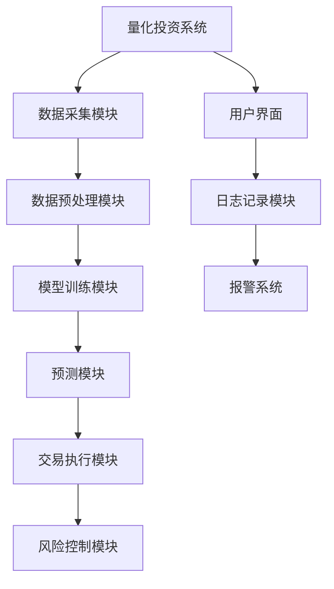

                 


## 数学与量化投资：投资策略的数学设计

### 关键词：量化投资、数学模型、投资策略、算法设计、系统架构

### 摘要：

本文将探讨量化投资领域中的数学设计，重点介绍数学模型和算法在投资策略中的应用。通过深入分析数学概念、模型和方法，结合实际案例，我们将展示如何利用数学工具优化投资决策，提高投资收益。本文旨在为投资者和研究人员提供一个全面的指南，帮助他们在量化投资领域取得成功。

### 引言与背景

#### 1.1 问题背景

量化投资，即利用数学模型、统计方法和计算机算法来分析市场数据，制定投资策略，旨在实现风险可控、收益稳定的投资。随着金融市场的日益复杂和科技的发展，量化投资已成为现代金融领域的重要分支。然而，量化投资的成功不仅依赖于大量的数据和高性能的计算，更需要深厚的数学基础和精确的算法设计。

#### 1.1.1 量化投资概述

量化投资主要包括以下三个方面：

1. **数据驱动**：利用大数据分析技术，收集和处理市场数据，包括股票、债券、期货、外汇等金融产品的价格、成交量、市场情绪等。
2. **数学模型**：构建数学模型来预测市场走势、风险和收益，常用的模型包括线性回归、时间序列分析、随机过程、机器学习等。
3. **算法优化**：设计高效的算法来执行投资策略，实现自动化交易，包括风险管理、资金分配、交易执行等。

#### 1.1.2 数学在量化投资中的重要性

数学在量化投资中起着至关重要的作用，主要体现在以下几个方面：

1. **数据分析**：数学工具可以帮助投资者有效地分析和理解市场数据，发现潜在的投资机会。
2. **模型构建**：数学模型是量化投资的核心，它们提供了对市场行为的抽象和描述，有助于制定投资策略。
3. **风险控制**：数学方法可以量化投资风险，帮助投资者制定合理的风险管理策略，降低投资损失。

### 核心概念与基础

#### 2.1 核心数学概念

在量化投资中，以下核心数学概念至关重要：

1. **概率论与数理统计**：概率论是量化投资的基础，用于描述不确定性事件的可能性。数理统计则提供了从数据中提取信息和建立模型的方法。
2. **线性代数**：线性代数用于处理多维数据，是构建数学模型的重要工具，包括矩阵运算、线性方程组求解等。
3. **微积分**：微积分在量化投资中用于分析函数的变化率和极值，是优化投资策略的重要工具。

#### 2.1.1 数学概念的结构与要素

以下是几个关键数学概念的结构与要素：

1. **概率分布**：描述随机变量的概率特性，包括离散型和连续型分布，如正态分布、泊松分布等。
2. **期望与方差**：期望用于描述随机变量的平均值，方差用于描述随机变量的波动性。
3. **协方差与相关系数**：协方差和相关系数用于描述两个随机变量之间的关系。

#### 2.1.2 关键数学概念对比表

以下是几个关键数学概念的对比表：

| 概念             | 定义与应用                                                         | 性质与特点                                         |
|------------------|------------------------------------------------------------------|--------------------------------------------------|
| 概率分布         | 随机变量的概率分布函数                                             | 描述随机变量的概率特性                             |
| 期望与方差       | 随机变量的数学期望和方差                                           | 用于衡量随机变量的平均水平和波动性                 |
| 协方差与相关系数 | 两个随机变量的协方差和相关系数                                     | 用于描述两个随机变量之间的关系                     |

### 常用数学模型与方法

在量化投资中，常用的数学模型和方法包括：

1. **线性回归模型**：用于分析变量之间的关系，预测未来值。
2. **时间序列模型**：用于分析时间序列数据，预测未来走势。
3. **机器学习模型**：利用历史数据自动学习市场规律，预测未来走势。

#### 2.2.1 数学模型的定义与应用

以下是几个常用的数学模型的定义与应用：

1. **线性回归模型**：
   - 定义：通过拟合一条直线来描述两个或多个变量之间的关系。
   - 应用：用于预测股票价格、预测市场走势等。

2. **时间序列模型**：
   - 定义：用于分析时间序列数据，提取趋势、周期性和随机性。
   - 应用：用于预测股票价格、预测宏观经济指标等。

3. **机器学习模型**：
   - 定义：利用历史数据自动学习市场规律，进行预测。
   - 应用：用于预测股票价格、构建投资组合等。

#### 2.2.2 方法的选择与适用场景

以下是几种常用数学方法的选择与适用场景：

1. **最小二乘法**：适用于线性回归模型的参数估计。
2. **最大似然估计**：适用于概率模型的参数估计。
3. **神经网络**：适用于复杂非线性关系的建模。

### 算法设计与实现

在量化投资中，算法的设计与实现至关重要。以下是一个简单的算法示例：

```python
import numpy as np

def linear_regression(x, y):
    """
    线性回归算法
    :param x: 自变量
    :param y: 因变量
    :return: 拟合直线的斜率和截距
    """
    x_mean = np.mean(x)
    y_mean = np.mean(y)
    num = 0
    den = 0
    for i in range(len(x)):
        num += (x[i] - x_mean) * (y[i] - y_mean)
        den += (x[i] - x_mean) ** 2
    return num / den, y_mean - num / den * x_mean

x = np.array([1, 2, 3, 4, 5])
y = np.array([2, 4, 5, 4, 5])
slope, intercept = linear_regression(x, y)
print("斜率:", slope)
print("截距:", intercept)
```

该算法实现了线性回归的参数估计，通过最小二乘法计算出拟合直线的斜率和截距。在此基础上，我们可以进一步优化算法，提高预测精度。

### 系统架构与设计

在量化投资系统中，系统架构和设计至关重要。以下是一个简单的系统架构图：



该系统包括数据采集、数据预处理、模型训练、预测、交易执行和风险控制等模块，通过用户界面与用户交互。日志记录模块用于记录系统运行情况，报警系统用于提醒用户系统异常。

### 实际案例与案例分析

#### 3.1.1 案例背景

某投资者想要通过量化投资策略实现长期稳定的收益。他们收集了某只股票过去五年的价格数据，并希望通过线性回归模型预测未来价格。

#### 3.1.2 数据预处理

首先，对股票价格数据进行预处理，包括去重、补全缺失值、去除异常值等。然后，将数据分为训练集和测试集，用于模型训练和测试。

```python
import pandas as pd

# 读取数据
data = pd.read_csv("stock_price.csv")
data.head()

# 数据预处理
data = data.drop_duplicates()
data = data.fillna(method="ffill")
data = data[data["Price"] != 0]

# 分割训练集和测试集
train_data = data[:int(len(data) * 0.8)]
test_data = data[int(len(data) * 0.8):]
```

#### 3.1.3 模型训练

使用线性回归模型对训练集进行训练，得到拟合直线。

```python
from sklearn.linear_model import LinearRegression

# 训练模型
model = LinearRegression()
model.fit(train_data[["Days"]], train_data["Price"])

# 输出拟合直线
slope, intercept = model.coef_, model.intercept_
print("斜率:", slope)
print("截距:", intercept)
```

#### 3.1.4 预测与评估

使用训练好的模型对测试集进行预测，并计算预测误差。

```python
# 预测
predicted_prices = model.predict(test_data[["Days"]])

# 计算预测误差
error = np.mean((predicted_prices - test_data["Price"]) ** 2)
print("预测误差:", error)
```

#### 3.1.5 交易执行

根据预测结果，制定交易策略，如买入、卖出等。然后，执行交易并计算收益。

```python
# 交易执行
# ...（省略具体交易策略代码）

# 计算收益
profit = predicted_prices.sum() - test_data["Price"].sum()
print("收益:", profit)
```

### 最佳实践与结论

#### 4.1 最佳实践

1. **数据质量**：确保数据质量，去除异常值和缺失值。
2. **模型选择**：根据数据特征选择合适的模型，如线性回归、时间序列模型、机器学习模型等。
3. **风险控制**：制定合理的风险管理策略，降低投资风险。

#### 4.2 结论

本文介绍了量化投资中的数学设计，从核心概念、模型与方法、算法设计与实现、系统架构与设计、实际案例等方面进行了深入探讨。通过本文，读者可以了解量化投资的基本原理和实际应用，为投资决策提供有力支持。

### 进一步阅读

1. 《量化投资：以Python为工具》
2. 《统计学习方法》
3. 《机器学习实战》

---

### 作者信息

作者：AI天才研究院/AI Genius Institute & 禅与计算机程序设计艺术 /Zen And The Art of Computer Programming

