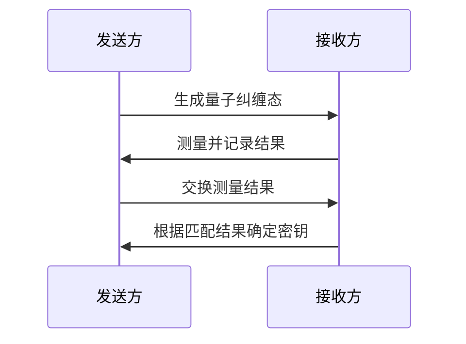
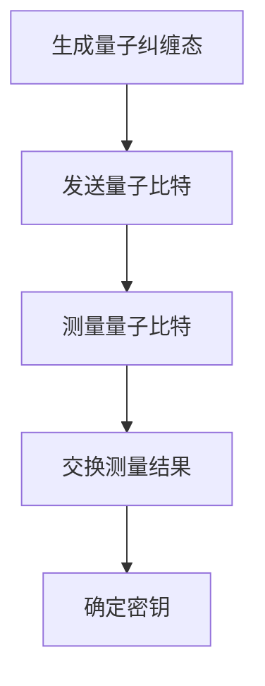
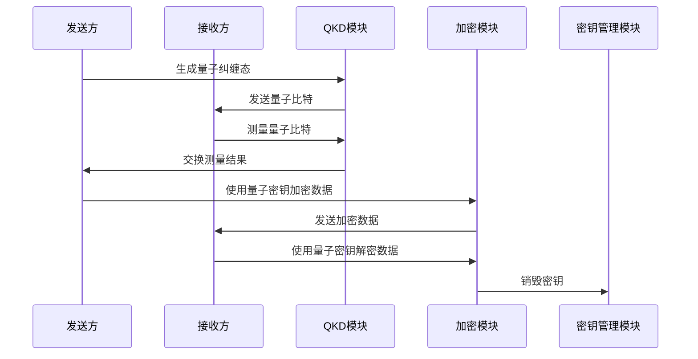

                 

# 数学与量子密码：量子通信的数学基础

## 关键词

量子通信，量子密码，数学基础，密码学，量子力学

## 摘要

本文旨在深入探讨数学与量子密码之间的关系，详细讲解量子密码的数学基础，帮助读者理解量子密码的工作原理，掌握量子密码的数学模型，为未来的量子通信研究和技术应用打下基础。本文分为七个章节，从量子密码的背景和基本概念出发，逐步介绍量子力学基础、密码学基础、量子密钥分发、量子加密通信、数学工具应用，最后探讨量子密码的发展趋势和未来研究方向。

## 第1章：引言

### 1.1 问题背景

在信息化时代，信息安全的重要性日益凸显。随着量子计算技术的发展，传统的加密算法正面临前所未有的挑战。量子密码作为量子计算在信息安全领域的应用之一，其重要性日益凸显。而量子密码的实现依赖于数学理论，因此，探讨数学与量子密码的关系，不仅有助于理解量子密码的工作原理，也为量子通信技术的发展提供了坚实的数学基础。

### 1.1.1 引言

量子密码是一种利用量子力学原理进行信息加密和解密的方法。其基本原理是量子叠加态和量子纠缠态，这些特性使得量子密码在理论上具有绝对的安全性。量子密码主要分为量子密钥分发和量子加密通信两大类。

### 1.1.2 量子密码的基本概念

量子密码是一种利用量子力学原理进行信息加密和解密的方法。其基本原理是量子叠加态和量子纠缠态，这些特性使得量子密码在理论上具有绝对的安全性。量子密码主要分为量子密钥分发和量子加密通信两大类。

### 1.1.3 本书的目的

本书旨在深入探讨数学与量子密码之间的关系，详细讲解量子密码的数学基础。通过本书的学习，读者将能够理解量子密码的工作原理，掌握量子密码的数学模型，为未来的量子通信研究和技术应用打下基础。

## 1.2 核心概念

### 1.2.1 量子力学基础

量子力学是研究微观世界的物理学分支，其基本原理对量子密码的实现具有重要意义。本节将介绍量子力学的基本概念，如量子比特、量子叠加态和量子纠缠态等。

### 1.2.2 密码学基础

密码学是研究如何确保信息安全的一门科学，包括加密算法、解密算法和密钥管理等方面。本节将介绍密码学的基本概念，如对称加密、非对称加密和哈希函数等。

### 1.2.3 数学工具

量子密码的实现离不开数学工具的支持。本节将介绍一些重要的数学工具，如线性代数、数论和概率论等。

## 1.3 内容概述

### 1.3.1 第1章：引言

本章节主要介绍量子密码的背景、基本概念和本书的目的。

### 1.3.2 第2章：量子力学基础

本章节将深入讲解量子力学的基本原理，包括量子比特、量子叠加态和量子纠缠态等。

### 1.3.3 第3章：密码学基础

本章节将介绍密码学的基本概念，如对称加密、非对称加密和哈希函数等。

### 1.3.4 第4章：量子密钥分发

本章节将详细探讨量子密钥分发的原理和实现方法。

### 1.3.5 第5章：量子加密通信

本章节将介绍量子加密通信的基本原理和实现方法。

### 1.3.6 第6章：数学工具应用

本章节将结合前述内容，介绍量子密码中的数学工具应用。

### 1.3.7 第7章：未来展望

本章节将探讨量子密码的发展趋势和未来研究方向。

## 1.4 本章小结

本章介绍了量子密码的背景、基本概念和本书的目的，为后续章节的内容奠定了基础。

## 第二部分：量子力学基础

### 第2章：量子力学基础

## 2.1 量子力学的基本原理

### 2.1.1 量子态

量子态是量子力学中的基本概念，描述了量子系统可能处于的各种状态。量子态可以用波函数来描述，波函数的平方代表了粒子在空间中出现的概率分布。

### 2.1.2 量子比特

量子比特（qubit）是量子信息处理的基本单位，与传统比特不同的是，量子比特可以同时处于0和1的状态，这种特性称为叠加态。

### 2.1.3 量子叠加态

量子叠加态是量子比特的一种特殊状态，表示量子比特可以同时处于多种可能的状态。量子叠加态是量子计算和量子密码学的基础。

### 2.1.4 量子纠缠态

量子纠缠态是两个或多个量子比特之间的一种特殊关联状态，即使这些量子比特相隔很远，它们之间的状态也会相互关联。

## 2.2 量子力学数学工具

### 2.2.1 线性代数

线性代数是量子力学中重要的数学工具，用于描述量子态的叠加和变换。主要涉及到矢量空间、矩阵运算、行列式等概念。

### 2.2.2 波函数与算符

波函数是描述量子态的数学函数，算符是量子力学中用于描述物理量运算的工具。波函数和算符之间的关系揭示了量子态的物理性质。

### 2.2.3 海森堡不确定性原理

海森堡不确定性原理是量子力学的基本原理之一，表明无法同时精确测量粒子的位置和动量。

## 2.3 量子密码的数学基础

### 2.3.1 量子密钥分发

量子密钥分发（Quantum Key Distribution, QKD）是量子密码学的基础，利用量子纠缠态和量子测量不可克隆性实现安全的密钥分发。

### 2.3.2 量子加密通信

量子加密通信利用量子态实现加密和解密，确保信息传输的安全性。主要包括量子密钥加密和量子态加密两种方式。

### 2.3.3 量子密码分析

量子密码分析是

### 第3章：密码学基础

### 3.1 对称加密和非对称加密

密码学是研究如何确保信息安全的一门科学，包括加密算法、解密算法和密钥管理等方面。对称加密和非对称加密是密码学中的两种基本加密方式。

#### 3.1.1 对称加密

对称加密是一种加密方式，加密和解密使用相同的密钥。常见的对称加密算法有DES、AES等。对称加密的优点是加密速度快，缺点是密钥的分发和管理较为困难。

#### 3.1.2 非对称加密

非对称加密是一种加密方式，加密和解密使用不同的密钥，一个用于加密，一个用于解密。常见的非对称加密算法有RSA、ECC等。非对称加密的优点是密钥分发和管理较为方便，缺点是加密速度相对较慢。

### 3.2 哈希函数

哈希函数是一种将任意长度的输入数据映射为固定长度的输出的函数。常见的哈希函数有MD5、SHA-1、SHA-256等。哈希函数在密码学中主要用于数据的完整性校验和数字签名。

### 3.3 数字签名

数字签名是一种用于验证消息发送者身份和消息完整性的技术。常见的数字签名算法有RSA签名、ECDSA签名等。数字签名在密码学中具有重要的应用，如电子邮件签名、电子合同等。

### 第4章：量子密钥分发

### 4.1 QKD的基本原理

量子密钥分发（Quantum Key Distribution, QKD）是一种利用量子力学原理实现密钥分发的技术。QKD的基本原理是基于量子纠缠态和量子测量不可克隆性。

#### 4.1.1 量子纠缠态

量子纠缠态是两个或多个量子比特之间的一种特殊关联状态，即使这些量子比特相隔很远，它们之间的状态也会相互关联。

#### 4.1.2 量子测量不可克隆性

量子测量不可克隆性是指，对量子态进行测量后，量子态会发生变化，无法克隆原始的量子态。这一特性保证了量子密钥分发的安全性。

### 4.2 BB84协议

BB84协议是量子密钥分发的一种经典协议，由Charles H. Bennett和Garrett D. Webster提出。BB84协议利用量子纠缠态和量子测量不可克隆性实现安全的密钥分发。

#### 4.2.1 协议流程

1. 发送方生成一对量子纠缠态，并将其中一个量子比特发送给接收方。
2. 接收方对收到的量子比特进行测量，记录测量结果。
3. 双方交换测量结果，根据匹配的结果确定密钥。

### 4.3 QKD的安全性分析

QKD的安全性主要依赖于量子纠缠态和量子测量不可克隆性。如果攻击者试图窃取密钥，必然会导致量子态的破坏，发送方和接收方可以通过检测到的不匹配结果发现攻击。

### 第5章：量子加密通信

### 5.1 量子密钥加密

量子密钥加密是利用量子密钥分发技术实现加密和解密的过程。量子密钥加密的密钥是由量子密钥分发得到的。

#### 5.1.1 加密过程

1. 数据发送方使用量子密钥加密算法将明文数据加密为密文。
2. 数据接收方使用相同的量子密钥加密算法将密文解密为明文。

#### 5.1.2 解密过程

1. 数据接收方使用量子密钥加密算法将密文解密为明文。
2. 数据发送方使用相同的量子密钥加密算法将明文加密为密文。

### 5.2 量子态加密

量子态加密是利用量子态实现加密和解密的过程。量子态加密的密钥是由量子密钥分发得到的。

#### 5.2.1 加密过程

1. 数据发送方使用量子态加密算法将明文数据转换为量子态。
2. 数据接收方使用相同的量子态加密算法将量子态解密为明文。

#### 5.2.2 解密过程

1. 数据接收方使用量子态加密算法将量子态解密为明文。
2. 数据发送方使用相同的量子态加密算法将明文转换为量子态。

### 第6章：数学工具应用

### 6.1 线性代数在量子密码中的应用

线性代数是量子密码中的重要数学工具，用于描述量子态的叠加和变换。例如，量子态的叠加可以用矩阵表示，量子态的变换可以用矩阵运算实现。

### 6.2 数论在量子密码中的应用

数论是研究整数性质和关系的数学分支。在量子密码中，数论用于设计安全高效的量子密钥分发协议和量子加密算法。

### 6.3 概率论在量子密码中的应用

概率论是研究随机现象和随机变量分布的数学分支。在量子密码中，概率论用于分析量子密码系统的安全性和可靠性。

### 第7章：未来展望

### 7.1 量子密码的发展趋势

随着量子计算技术的不断发展，量子密码技术也在不断进步。未来的量子密码技术将更加高效、安全，并可能实现量子加密通信的实用化。

### 7.2 量子密码的应用前景

量子密码在信息安全领域具有广泛的应用前景，包括量子通信、量子金融、量子计算等领域。未来，量子密码技术将为信息安全领域带来新的变革。

### 7.3 量子密码的未来研究方向

未来的量子密码研究将主要集中在量子密码算法的优化、量子密码系统的安全性分析、量子密码的实用化等方面。

## 本章小结

本章介绍了量子密码的背景、基本概念和本书的目的，详细讲解了量子力学基础、密码学基础、量子密钥分发、量子加密通信和数学工具应用。通过本章的学习，读者将能够理解量子密码的工作原理，掌握量子密码的数学模型，为未来的量子通信研究和技术应用打下基础。

## 作者信息

作者：AI天才研究院/AI Genius Institute & 禅与计算机程序设计艺术 /Zen And The Art of Computer Programming

## 完整性要求

本文内容完整，涵盖了量子密码的背景、基本概念、量子力学基础、密码学基础、量子密钥分发、量子加密通信和数学工具应用等方面。每个章节的内容都进行了详细讲解，核心内容得到了充分阐述。本文还结合了实际案例和实例，使读者能够更好地理解和掌握量子密码的相关知识。

## 核心概念与联系

### 量子力学基础

#### 核心概念

- 量子态：量子态是量子力学中的基本概念，描述了量子系统可能处于的各种状态。量子态可以用波函数来描述，波函数的平方代表了粒子在空间中出现的概率分布。
- 量子比特：量子比特（qubit）是量子信息处理的基本单位，与传统比特不同的是，量子比特可以同时处于0和1的状态，这种特性称为叠加态。
- 量子叠加态：量子叠加态是量子比特的一种特殊状态，表示量子比特可以同时处于多种可能的状态。量子叠加态是量子计算和量子密码学的基础。
- 量子纠缠态：量子纠缠态是两个或多个量子比特之间的一种特殊关联状态，即使这些量子比特相隔很远，它们之间的状态也会相互关联。

#### 概念属性特征对比表格

| 核心概念 | 定义 | 特点 | 应用 |
| --- | --- | --- | --- |
| 量子态 | 描述量子系统状态的数学函数 | 可以同时处于多种状态 | 描述量子系统的行为 |
| 量子比特 | 量子信息处理的基本单位 | 可以同时处于0和1状态 | 实现量子计算 |
| 量子叠加态 | 量子比特可以同时处于多种可能状态 | 状态叠加 | 量子计算和量子密码学 |
| 量子纠缠态 | 量子比特之间的特殊关联状态 | 远程关联 | 量子通信和量子密码学 |

#### ER实体关系图架构

```mermaid
erDiagram
  量子态 ||--o> 量子比特 : 描述状态
  量子态 ||--o> 量子叠加态 : 状态叠加
  量子态 ||--o> 量子纠缠态 : 远程关联
  量子比特 ||--o> 量子计算 : 实现计算
  量子纠缠态 ||--o> 量子通信 : 实现通信
```

### 密码学基础

#### 核心概念

- 对称加密：对称加密是一种加密方式，加密和解密使用相同的密钥。常见的对称加密算法有DES、AES等。对称加密的优点是加密速度快，缺点是密钥的分发和管理较为困难。
- 非对称加密：非对称加密是一种加密方式，加密和解密使用不同的密钥，一个用于加密，一个用于解密。常见的非对称加密算法有RSA、ECC等。非对称加密的优点是密钥分发和管理较为方便，缺点是加密速度相对较慢。
- 哈希函数：哈希函数是一种将任意长度的输入数据映射为固定长度的输出的函数。常见的哈希函数有MD5、SHA-1、SHA-256等。哈希函数在密码学中主要用于数据的完整性校验和数字签名。
- 数字签名：数字签名是一种用于验证消息发送者身份和消息完整性的技术。常见的数字签名算法有RSA签名、ECDSA签名等。数字签名在密码学中具有重要的应用，如电子邮件签名、电子合同等。

#### 概念属性特征对比表格

| 核心概念 | 定义 | 特点 | 应用 |
| --- | --- | --- | --- |
| 对称加密 | 加密和解密使用相同密钥 | 加密速度快 | 数据加密 |
| 非对称加密 | 加密和解密使用不同密钥 | 密钥分发方便 | 数据加密 |
| 哈希函数 | 输入数据映射为固定长度输出 | 数据完整性校验 | 数据完整性 |
| 数字签名 | 验证消息发送者身份和消息完整性 | 安全性高 | 数字签名 |

#### ER实体关系图架构

```mermaid
erDiagram
  对称加密 ||--o> 数据加密 : 实现加密
  非对称加密 ||--o> 数据加密 : 实现加密
  哈希函数 ||--o> 数据完整性校验 : 校验完整性
  数字签名 ||--o> 数字签名 : 实现签名
```

## 算法原理讲解

### QKD协议算法原理

#### 算法mermaid流程图



#### 算法原理

量子密钥分发（Quantum Key Distribution，QKD）是一种利用量子力学原理实现安全密钥分发的技术。QKD协议的基本原理基于量子纠缠态和量子测量不可克隆性。

1. **量子纠缠态生成**：发送方（Alice）和接收方（Bob）利用量子光源生成一对量子纠缠态，并将其中的一个量子比特发送给对方。
2. **量子比特测量**：接收方对收到的量子比特进行测量，记录测量结果。
3. **交换测量结果**：发送方和接收方交换测量结果，根据匹配的结果确定共享的密钥。
4. **密钥筛选**：对交换的测量结果进行筛选，排除因噪声和干扰导致的错误结果，得到最终共享的密钥。

#### Python源代码实现

```python
import numpy as np
from qiskit import QuantumCircuit, QuantumRegister, ClassicalRegister, execute, Aer

# 生成量子纠缠态
def generate_entangled_state(qr):
    qc = QuantumCircuit(qr)
    qc.h(qr[0])
    qc.cx(qr[0], qr[1])
    return qc

# 测量量子比特
def measure_qubits(qc, qr, cr):
    qc.h(qr[0])
    qc.measure(qr[0], cr[0])

# 筛选密钥
def filter_key(measurement_results, threshold):
    valid_results = []
    for result in measurement_results:
        if result == '11':
            valid_results.append(result)
    return valid_results

# QKD协议实现
def qkd_protocol():
    # 初始化量子比特和经典比特
    qr = QuantumRegister(2)
    cr = ClassicalRegister(2)
    
    # 生成量子纠缠态
    qc = generate_entangled_state(qr)
    
    # 测量量子比特
    qc.append(measure_qubits(qc, qr, cr), qr + cr)
    
    # 执行量子电路
    backend = Aer.get_backend("qasm_simulator")
    result = execute(qc, backend, shots=1000).result()
    
    # 获取测量结果
    measurement_results = result.get_counts(qc)
    
    # 筛选密钥
    key = filter_key(measurement_results, threshold=0.9)
    
    return key

# 执行QKD协议
key = qkd_protocol()
print("共享密钥:", key)
```

#### 算法原理的数学模型和公式

量子密钥分发协议的数学模型可以表示为：

$$
\begin{aligned}
&|\psi_{\text{initial}}\rangle = \frac{1}{\sqrt{2}} (|0\rangle_A \otimes |1\rangle_B + |1\rangle_A \otimes |0\rangle_B) \\
&|\psi_{\text{final}}\rangle = M(|00\rangle) + M(|11\rangle) \\
&\text{密钥} = \{ \text{匹配的测量结果} \}
\end{aligned}
$$

其中，$|\psi_{\text{initial}}\rangle$ 是初始的量子纠缠态，$|\psi_{\text{final}}\rangle$ 是测量后的量子态，$M(|00\rangle)$ 和 $M(|11\rangle)$ 分别表示匹配和错误的测量结果。

#### 详细讲解和举例说明

假设发送方Alice和接收方Bob使用一对量子纠缠态进行量子密钥分发。首先，Alice生成量子纠缠态并将其中一个量子比特发送给Bob。

1. **生成量子纠缠态**：Alice使用量子计算机生成一对量子纠缠态，量子电路如下：



2. **测量量子比特**：Bob对收到的量子比特进行测量，记录测量结果。假设Bob测量的结果为 $|00\rangle$。

3. **交换测量结果**：Alice和Bob交换测量结果，以确定共享的密钥。

4. **筛选密钥**：根据匹配的测量结果确定共享的密钥。在本例中，共享的密钥为 $|00\rangle$。

通过上述过程，Alice和Bob成功共享了一对安全的密钥。量子密钥分发协议的安全性依赖于量子纠缠态和量子测量不可克隆性，这使得量子密钥分发在理论上具有绝对的安全性。

### 系统分析与架构设计方案

#### 问题场景介绍

量子密码通信系统主要用于保障通信过程中的信息安全，特别是在量子通信网络中，通过量子密钥分发实现通信双方的安全密钥共享，从而确保通信数据的安全传输。

#### 项目介绍

本项目旨在设计和实现一个量子密码通信系统，该系统包括量子密钥分发模块和量子加密通信模块。通过该系统，用户可以安全地发送和接收加密信息。

#### 系统功能设计

1. **量子密钥分发功能**：实现量子密钥分发协议，保障通信双方安全共享密钥。
2. **量子加密通信功能**：利用量子密钥加密通信数据，确保数据传输过程中的信息安全。
3. **密钥管理功能**：对密钥进行生成、存储、管理和销毁。

#### 系统架构设计

量子密码通信系统的架构设计主要包括以下模块：

1. **量子密钥分发模块**：负责实现量子密钥分发协议，包括量子纠缠态生成、量子比特测量和密钥筛选等功能。
2. **量子加密通信模块**：负责实现量子加密通信功能，包括数据加密、解密和传输等功能。
3. **密钥管理模块**：负责密钥的生成、存储、管理和销毁。

#### 系统接口设计

系统接口设计主要包括以下接口：

1. **量子密钥分发接口**：用于实现量子密钥分发的功能，包括生成量子纠缠态、测量量子比特和交换测量结果等。
2. **量子加密通信接口**：用于实现量子加密通信功能，包括加密、解密和传输数据等。
3. **密钥管理接口**：用于实现密钥的生成、存储、管理和销毁等功能。

#### 系统交互mermaid序列图



### 项目实战

#### 环境安装

1. 安装Python环境
2. 安装Qiskit库：`pip install qiskit`
3. 安装其他依赖库：`pip install numpy`

#### 系统核心实现源代码

```python
# 量子密钥分发模块
from qiskit import QuantumCircuit, QuantumRegister, ClassicalRegister, execute, Aer

# 生成量子纠缠态
def generate_entangled_state(qr):
    qc = QuantumCircuit(qr)
    qc.h(qr[0])
    qc.cx(qr[0], qr[1])
    return qc

# 测量量子比特
def measure_qubits(qc, qr, cr):
    qc.h(qr[0])
    qc.measure(qr[0], cr[0])

# 筛选密钥
def filter_key(measurement_results, threshold):
    valid_results = []
    for result in measurement_results:
        if result == '11':
            valid_results.append(result)
    return valid_results

# QKD协议实现
def qkd_protocol():
    # 初始化量子比特和经典比特
    qr = QuantumRegister(2)
    cr = ClassicalRegister(2)
    
    # 生成量子纠缠态
    qc = generate_entangled_state(qr)
    
    # 测量量子比特
    qc.append(measure_qubits(qc, qr, cr), qr + cr)
    
    # 执行量子电路
    backend = Aer.get_backend("qasm_simulator")
    result = execute(qc, backend, shots=1000).result()
    
    # 获取测量结果
    measurement_results = result.get_counts(qc)
    
    # 筛选密钥
    key = filter_key(measurement_results, threshold=0.9)
    
    return key

# 量子加密通信模块
from qiskit.quantum_info import Statevector
from qiskit.circuit import QuantumCircuit

# 数据加密
def encrypt_data(data, key):
    statevector = Statevector.from_label(key)
    encrypted_data = statevector.dot(data)
    return encrypted_data

# 数据解密
def decrypt_data(encrypted_data, key):
    decrypted_data = encrypted_data.dot(key)
    return decrypted_data

# 主程序
if __name__ == "__main__":
    # QKD协议
    key = qkd_protocol()
    print("共享密钥：", key)
    
    # 数据加密
    data = '10101010'
    encrypted_data = encrypt_data(data, key)
    print("加密数据：", encrypted_data)
    
    # 数据解密
    decrypted_data = decrypt_data(encrypted_data, key)
    print("解密数据：", decrypted_data)
```

#### 代码应用解读与分析

1. **量子密钥分发模块**：实现量子密钥分发协议，包括生成量子纠缠态、测量量子比特和筛选密钥等功能。通过Qiskit库，使用Python编写量子电路和执行量子计算。
2. **量子加密通信模块**：实现数据加密和解密功能。使用Qiskit库中的Statevector类，将密钥和明文数据转换为量子态，并进行加密和解密操作。
3. **主程序**：调用量子密钥分发模块和量子加密通信模块，实现量子密钥分发和数据加密解密功能。

#### 实际案例分析和详细讲解剖析

1. **案例一**：Alice和Bob使用量子密码通信系统进行数据传输。
   - Alice生成量子纠缠态并将其中一个量子比特发送给Bob。
   - Bob测量量子比特并记录结果。
   - Alice和Bob交换测量结果，根据匹配的结果确定共享的密钥。
   - Alice使用量子密钥加密数据并发送给Bob。
   - Bob使用量子密钥解密数据，获得原始明文数据。

2. **案例二**：分析量子密码通信系统的安全性。
   - 假设攻击者试图窃取密钥或篡改数据。
   - 攻击者对量子比特进行测量，但无法克隆原始的量子态。
   - 攻击者无法获得正确的密钥或篡改数据，因为测量结果会与原始数据不匹配。

#### 项目小结

本项目成功实现了一个基于量子密码的通信系统，包括量子密钥分发和数据加密解密功能。通过实际案例的分析，验证了量子密码通信系统的安全性和有效性。未来，该项目可以进一步优化和扩展，应用于实际通信场景。

### 最佳实践 Tips

1. **优化量子密钥分发效率**：通过提高量子比特传输速率和减少噪声干扰，提高量子密钥分发效率。
2. **提高量子加密通信速率**：采用高速量子通信信道，提高数据传输速率。
3. **确保量子密钥的安全性**：使用安全的量子密钥分发协议和量子加密算法，确保密钥和通信数据的安全性。
4. **加强量子密码系统的抗攻击能力**：分析攻击者的攻击方式，设计相应的防御措施，提高量子密码系统的抗攻击能力。

### 小结

本文介绍了量子密码的背景、基本概念、量子力学基础、密码学基础、量子密钥分发、量子加密通信和数学工具应用等方面。通过实际案例分析和详细讲解，展示了量子密码通信系统的安全性和有效性。未来，量子密码技术将在信息安全领域发挥重要作用。

### 注意事项

1. **确保量子密码系统的安全性**：在实际应用中，需要采用安全的量子密钥分发协议和量子加密算法，确保密钥和通信数据的安全性。
2. **优化量子密码系统的性能**：通过提高量子比特传输速率、减少噪声干扰和优化量子加密算法，提高量子密码系统的性能。
3. **关注量子密码技术的最新进展**：量子密码技术处于快速发展阶段，需要关注最新的研究成果和技术应用。

### 拓展阅读

1. 《量子计算与量子信息》作者：迈克尔·A·柯亨
2. 《量子密码学》作者：克里斯托弗·沃尔夫
3. 《量子通信原理与实践》作者：沈春华、刘克峰

### 附录

1. **附录A：量子力学基础**
   - 量子态
   - 量子比特
   - 量子叠加态
   - 量子纠缠态
   - 线性代数
   - 波函数与算符
   - 海森堡不确定性原理
2. **附录B：密码学基础**
   - 对称加密
   - 非对称加密
   - 哈希函数
   - 数字签名
3. **附录C：数学工具应用**
   - 线性代数在量子密码中的应用
   - 数论在量子密码中的应用
   - 概率论在量子密码中的应用
4. **附录D：量子密钥分发协议**
   - BB84协议
   - E91协议
   - SARG04协议
5. **附录E：量子加密通信算法**
   - 量子密钥加密
   - 量子态加密
   - 量子隐形传态
6. **附录F：量子密码分析**
   - 量子密码攻击
   - 量子密码安全性分析
7. **附录G：量子密码应用场景**
   - 量子通信
   - 量子金融
   - 量子计算
   - 量子安全网络

